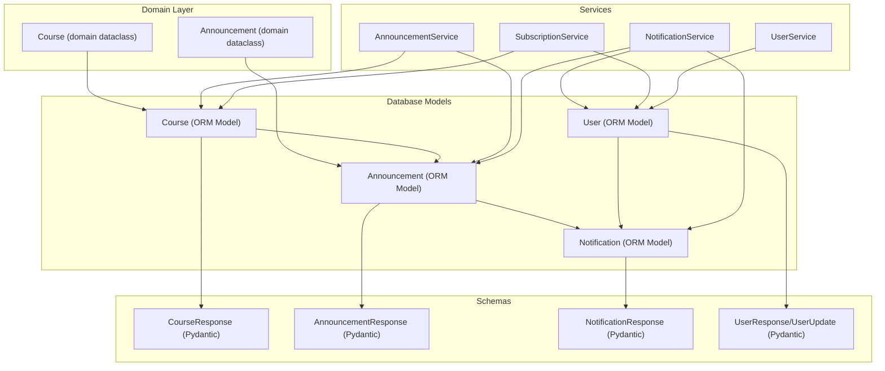
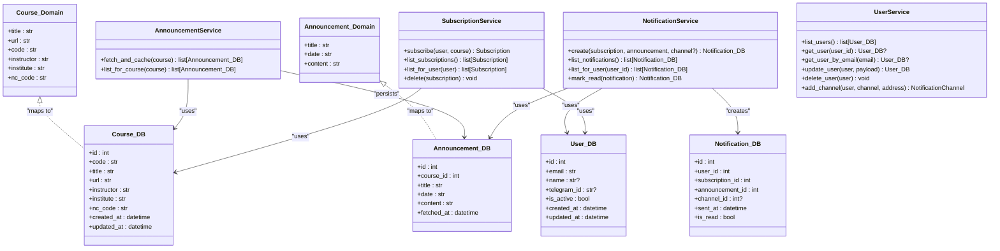
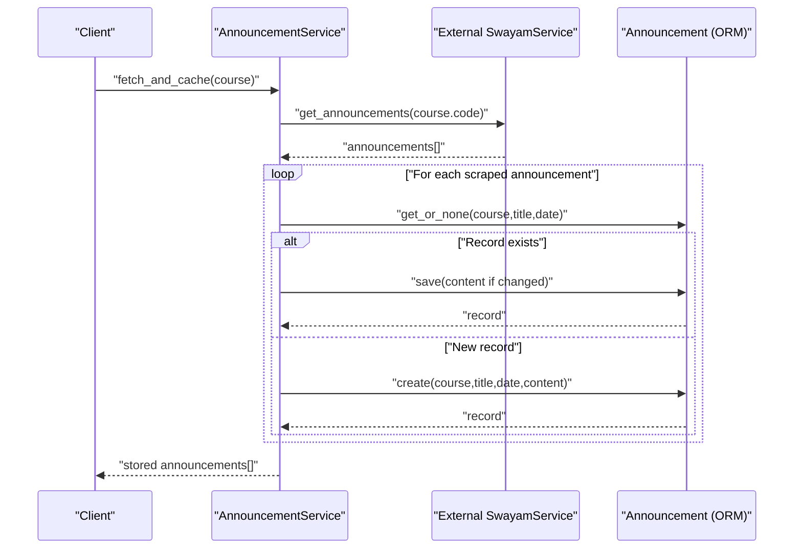
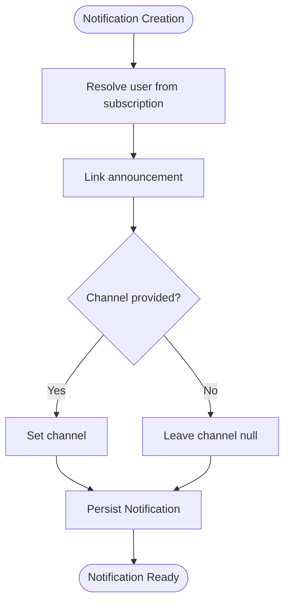
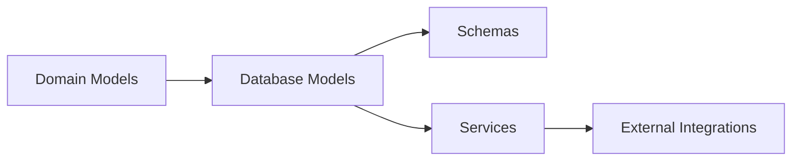

# Domain Models

<cite>
**Referenced Files in This Document**
- [models.py](file://notice-reminders/app/domain/models.py)
- [course.py](file://notice-reminders/app/models/course.py)
- [announcement.py](file://notice-reminders/app/models/announcement.py)
- [notification.py](file://notice-reminders/app/models/notification.py)
- [user.py](file://notice-reminders/app/models/user.py)
- [announcement.py](file://notice-reminders/app/schemas/announcement.py)
- [course.py](file://notice-reminders/app/schemas/course.py)
- [notification.py](file://notice-reminders/app/schemas/notification.py)
- [user.py](file://notice-reminders/app/schemas/user.py)
- [announcement_service.py](file://notice-reminders/app/services/announcement_service.py)
- [notification_service.py](file://notice-reminders/app/services/notification_service.py)
- [user_service.py](file://notice-reminders/app/services/user_service.py)
- [subscription_service.py](file://notice-reminders/app/services/subscription_service.py)
</cite>

## Table of Contents
1. [Introduction](#introduction)
2. [Project Structure](#project-structure)
3. [Core Components](#core-components)
4. [Architecture Overview](#architecture-overview)
5. [Detailed Component Analysis](#detailed-component-analysis)
6. [Dependency Analysis](#dependency-analysis)
7. [Performance Considerations](#performance-considerations)
8. [Troubleshooting Guide](#troubleshooting-guide)
9. [Conclusion](#conclusion)

## Introduction
This document describes the domain-level models and business logic entities in the Notice Reminders system. It focuses on how domain entities encapsulate business logic, how database models map to API schemas, and how domain services enforce business rules. The domain layer is intentionally minimal and lightweight, centered around dataclasses representing core domain entities and service classes coordinating persistence and cross-cutting concerns.

## Project Structure
The domain layer is organized by concerns:
- Domain models: Lightweight data containers for core entities
- Database models: Tortoise ORM entities for persistence
- Schemas: Pydantic models for API serialization/deserialization
- Services: Business logic orchestration and rule enforcement

**Diagram sources**
- [models.py](file://notice-reminders/app/domain/models.py#L7-L34)
- [course.py](file://notice-reminders/app/models/course.py#L7-L22)
- [announcement.py](file://notice-reminders/app/models/announcement.py#L11-L25)
- [notification.py](file://notice-reminders/app/models/notification.py#L14-L37)
- [user.py](file://notice-reminders/app/models/user.py#L7-L20)
- [announcement.py](file://notice-reminders/app/schemas/announcement.py#L6-L16)
- [course.py](file://notice-reminders/app/schemas/course.py#L6-L19)
- [notification.py](file://notice-reminders/app/schemas/notification.py#L6-L17)
- [user.py](file://notice-reminders/app/schemas/user.py#L6-L24)
- [announcement_service.py](file://notice-reminders/app/services/announcement_service.py#L11-L45)
- [notification_service.py](file://notice-reminders/app/services/notification_service.py#L7-L31)
- [subscription_service.py](file://notice-reminders/app/services/subscription_service.py#L8-L23)
- [user_service.py](file://notice-reminders/app/services/user_service.py#L11-L55)

**Section sources**
- [models.py](file://notice-reminders/app/domain/models.py#L1-L34)
- [course.py](file://notice-reminders/app/models/course.py#L1-L22)
- [announcement.py](file://notice-reminders/app/models/announcement.py#L1-L25)
- [notification.py](file://notice-reminders/app/models/notification.py#L1-L37)
- [user.py](file://notice-reminders/app/models/user.py#L1-L20)
- [announcement.py](file://notice-reminders/app/schemas/announcement.py#L1-L16)
- [course.py](file://notice-reminders/app/schemas/course.py#L1-L19)
- [notification.py](file://notice-reminders/app/schemas/notification.py#L1-L17)
- [user.py](file://notice-reminders/app/schemas/user.py#L1-L24)
- [announcement_service.py](file://notice-reminders/app/services/announcement_service.py#L1-L45)
- [notification_service.py](file://notice-reminders/app/services/notification_service.py#L1-L31)
- [subscription_service.py](file://notice-reminders/app/services/subscription_service.py#L1-L23)
- [user_service.py](file://notice-reminders/app/services/user_service.py#L1-L55)

## Core Components
- Domain entities
  - Course: Lightweight dataclass representing a MOOC course entity in the domain.
  - Announcement: Lightweight dataclass representing a course announcement in the domain.
- Database models
  - Course: Persisted course entity with unique and indexed identifiers.
  - Announcement: Persisted announcement linked to a course.
  - Notification: Persisted notification linking a user, subscription, and announcement, optionally with a channel.
  - User: Persisted user entity with unique identifiers and activity flag.
- Schemas
  - CourseResponse, AnnouncementResponse, NotificationResponse, UserResponse/UserUpdate: Pydantic models enabling serialization/deserialization and controlled updates.
- Services
  - AnnouncementService: Fetches announcements from external source, deduplicates, and persists differences.
  - NotificationService: Creates notifications and manages read-state.
  - SubscriptionService: Manages user-course subscriptions with idempotent behavior.
  - UserService: Manages user records and notification channels with integrity handling.

These components form a cohesive domain layer where domain entities describe core concepts, database models persist state, schemas define API boundaries, and services enforce business rules and coordinate operations.

**Section sources**
- [models.py](file://notice-reminders/app/domain/models.py#L7-L34)
- [course.py](file://notice-reminders/app/models/course.py#L7-L22)
- [announcement.py](file://notice-reminders/app/models/announcement.py#L11-L25)
- [notification.py](file://notice-reminders/app/models/notification.py#L14-L37)
- [user.py](file://notice-reminders/app/models/user.py#L7-L20)
- [announcement.py](file://notice-reminders/app/schemas/announcement.py#L6-L16)
- [course.py](file://notice-reminders/app/schemas/course.py#L6-L19)
- [notification.py](file://notice-reminders/app/schemas/notification.py#L6-L17)
- [user.py](file://notice-reminders/app/schemas/user.py#L6-L24)
- [announcement_service.py](file://notice-reminders/app/services/announcement_service.py#L11-L45)
- [notification_service.py](file://notice-reminders/app/services/notification_service.py#L7-L31)
- [subscription_service.py](file://notice-reminders/app/services/subscription_service.py#L8-L23)
- [user_service.py](file://notice-reminders/app/services/user_service.py#L11-L55)

## Architecture Overview
The domain layer follows a layered pattern:
- Domain models: Pure data containers with minimal behavior.
- Database models: Encapsulate persistence and relationships.
- Schemas: Define API contracts and validation.
- Services: Orchestrate domain actions, enforce invariants, and manage cross-cutting concerns.

**Diagram sources**
- [models.py](file://notice-reminders/app/domain/models.py#L7-L34)
- [course.py](file://notice-reminders/app/models/course.py#L7-L22)
- [announcement.py](file://notice-reminders/app/models/announcement.py#L11-L25)
- [notification.py](file://notice-reminders/app/models/notification.py#L14-L37)
- [user.py](file://notice-reminders/app/models/user.py#L7-L20)
- [announcement_service.py](file://notice-reminders/app/services/announcement_service.py#L11-L45)
- [notification_service.py](file://notice-reminders/app/services/notification_service.py#L7-L31)
- [subscription_service.py](file://notice-reminders/app/services/subscription_service.py#L8-L23)
- [user_service.py](file://notice-reminders/app/services/user_service.py#L11-L55)

## Detailed Component Analysis

### Domain Entities
- Course (domain dataclass)
  - Purpose: Represents a MOOC course concept in the domain.
  - Behavior: Provides a string representation summarizing course identity.
- Announcement (domain dataclass)
  - Purpose: Represents a course announcement concept in the domain.
  - Behavior: Provides a formatted string representation for display.

These domain entities are intentionally simple and free of persistence logic, enabling reuse across mapping layers.

**Section sources**
- [models.py](file://notice-reminders/app/domain/models.py#L7-L34)

### Database Models
- Course (ORM)
  - Unique and indexed identifiers enable fast lookups and referential integrity.
  - Timestamps track creation and updates.
- Announcement (ORM)
  - Foreign key relationship to Course.
  - Fetched timestamp supports ordering and deduplication.
- Notification (ORM)
  - Many-to-one relationships to User, Subscription, and Announcement.
  - Optional channel reference supports multiple delivery channels.
  - Read-state flag enables inbox management.
- User (ORM)
  - Unique constraints on email and Telegram ID ensure global uniqueness.
  - Activity flag supports account lifecycle management.

These models encapsulate persistence concerns and maintain referential integrity.

**Section sources**
- [course.py](file://notice-reminders/app/models/course.py#L7-L22)
- [announcement.py](file://notice-reminders/app/models/announcement.py#L11-L25)
- [notification.py](file://notice-reminders/app/models/notification.py#L14-L37)
- [user.py](file://notice-reminders/app/models/user.py#L7-L20)

### Schemas
- CourseResponse: Defines the serialized shape of a course for APIs.
- AnnouncementResponse: Defines the serialized shape of an announcement for APIs.
- NotificationResponse: Defines the serialized shape of a notification for APIs.
- UserResponse/UserUpdate: Define serialized shapes for user resources and update payloads.

Schemas enable controlled serialization and validation between application layers and the API boundary.

**Section sources**
- [course.py](file://notice-reminders/app/schemas/course.py#L6-L19)
- [announcement.py](file://notice-reminders/app/schemas/announcement.py#L6-L16)
- [notification.py](file://notice-reminders/app/schemas/notification.py#L6-L17)
- [user.py](file://notice-reminders/app/schemas/user.py#L6-L24)

### Services and Business Rule Enforcement
- AnnouncementService
  - Deduplication: Uses composite criteria (course, title, date) to detect existing announcements.
  - Content synchronization: Updates persisted content if it differs from scraped data.
  - Idempotency: Returns existing records when duplicates are detected.
  - Ordering: Lists announcements ordered by fetch time.
- NotificationService
  - Creation: Builds a notification linking a subscription’s user, the announcement, and optional channel.
  - Listing: Supports global and user-scoped retrieval with ordering.
  - Read-state: Marks notifications as read and persists state.
- SubscriptionService
  - Idempotency: Prevents duplicate subscriptions via database integrity and fallback retrieval.
  - Filtering: Lists subscriptions globally and per user.
- UserService
  - Controlled updates: Applies only provided fields to avoid overwriting defaults.
  - Channel management: Adds notification channels with integrity handling for duplicates.

These services coordinate between domain entities, database models, and schemas while enforcing business invariants.

**Diagram sources**
- [announcement_service.py](file://notice-reminders/app/services/announcement_service.py#L11-L45)
- [announcement.py](file://notice-reminders/app/models/announcement.py#L11-L25)

**Diagram sources**
- [notification_service.py](file://notice-reminders/app/services/notification_service.py#L7-L31)
- [notification.py](file://notice-reminders/app/models/notification.py#L14-L37)

**Section sources**
- [announcement_service.py](file://notice-reminders/app/services/announcement_service.py#L11-L45)
- [notification_service.py](file://notice-reminders/app/services/notification_service.py#L7-L31)
- [subscription_service.py](file://notice-reminders/app/services/subscription_service.py#L8-L23)
- [user_service.py](file://notice-reminders/app/services/user_service.py#L11-L55)

### Domain-Driven Design Patterns in This Layer
- Aggregate Roots
  - Course aggregates related announcements and serves as a boundary for business operations.
  - User aggregates subscriptions and notifications, forming a user-centric boundary.
- Entities
  - Course and Announcement are entities with identity and behavior in the domain.
- Value Objects
  - Domain dataclasses represent immutable value-like structures for course and announcement metadata.
- Domain Events
  - Not modeled in code; however, the Notification entity and NotificationService provide hooks for future event emission (e.g., after creation or read-state changes).
- Mapping Between Layers
  - Domain dataclasses map to ORM models for persistence.
  - ORM models map to Pydantic schemas for API exposure.

[No sources needed since this section synthesizes patterns without quoting specific code]

## Dependency Analysis
The domain layer exhibits low coupling and clear separation of responsibilities:
- Domain models depend only on Python typing constructs.
- Database models depend on Tortoise ORM and define foreign keys.
- Schemas depend on Pydantic for validation and serialization.
- Services depend on models and external integrations, enforcing business rules.

**Diagram sources**
- [models.py](file://notice-reminders/app/domain/models.py#L1-L34)
- [course.py](file://notice-reminders/app/models/course.py#L1-L22)
- [announcement.py](file://notice-reminders/app/models/announcement.py#L1-L25)
- [notification.py](file://notice-reminders/app/models/notification.py#L1-L37)
- [user.py](file://notice-reminders/app/models/user.py#L1-L20)
- [announcement.py](file://notice-reminders/app/schemas/announcement.py#L1-L16)
- [course.py](file://notice-reminders/app/schemas/course.py#L1-L19)
- [notification.py](file://notice-reminders/app/schemas/notification.py#L1-L17)
- [user.py](file://notice-reminders/app/schemas/user.py#L1-L24)
- [announcement_service.py](file://notice-reminders/app/services/announcement_service.py#L1-L45)
- [notification_service.py](file://notice-reminders/app/services/notification_service.py#L1-L31)
- [subscription_service.py](file://notice-reminders/app/services/subscription_service.py#L1-L23)
- [user_service.py](file://notice-reminders/app/services/user_service.py#L1-L55)

**Section sources**
- [models.py](file://notice-reminders/app/domain/models.py#L1-L34)
- [course.py](file://notice-reminders/app/models/course.py#L1-L22)
- [announcement.py](file://notice-reminders/app/models/announcement.py#L1-L25)
- [notification.py](file://notice-reminders/app/models/notification.py#L1-L37)
- [user.py](file://notice-reminders/app/models/user.py#L1-L20)
- [announcement.py](file://notice-reminders/app/schemas/announcement.py#L1-L16)
- [course.py](file://notice-reminders/app/schemas/course.py#L1-L19)
- [notification.py](file://notice-reminders/app/schemas/notification.py#L1-L17)
- [user.py](file://notice-reminders/app/schemas/user.py#L1-L24)
- [announcement_service.py](file://notice-reminders/app/services/announcement_service.py#L1-L45)
- [notification_service.py](file://notice-reminders/app/services/notification_service.py#L1-L31)
- [subscription_service.py](file://notice-reminders/app/services/subscription_service.py#L1-L23)
- [user_service.py](file://notice-reminders/app/services/user_service.py#L1-L55)

## Performance Considerations
- Deduplication and content updates: AnnouncementService minimizes writes by updating only when content differs.
- Indexing: Course code is unique and indexed, improving lookup performance for subscriptions and announcements.
- Ordering: Services order results by timestamps to support efficient pagination and recent-first retrieval.
- Asynchronous operations: Services leverage async/await for IO-bound tasks (external scraping and database operations).

[No sources needed since this section provides general guidance]

## Troubleshooting Guide
- Duplicate subscription prevention
  - Symptom: Attempting to create a duplicate subscription fails.
  - Resolution: SubscriptionService handles integrity errors by retrieving the existing subscription.
- Channel creation conflicts
  - Symptom: Adding the same channel/address twice raises an integrity error.
  - Resolution: UserService catches integrity errors and returns the existing channel.
- Notification read-state updates
  - Symptom: Marking a notification as read does not persist.
  - Resolution: NotificationService sets the flag and saves the record.

**Section sources**
- [subscription_service.py](file://notice-reminders/app/services/subscription_service.py#L8-L23)
- [user_service.py](file://notice-reminders/app/services/user_service.py#L38-L55)
- [notification_service.py](file://notice-reminders/app/services/notification_service.py#L27-L31)

## Conclusion
The Notice Reminders domain layer cleanly separates concerns across domain entities, database models, schemas, and services. Domain entities capture core concepts with minimal behavior, while services enforce business rules, coordinate persistence, and maintain invariants. The design supports extensibility, such as adding domain events alongside the Notification entity, and maintains performance through indexing, deduplication, and asynchronous operations.