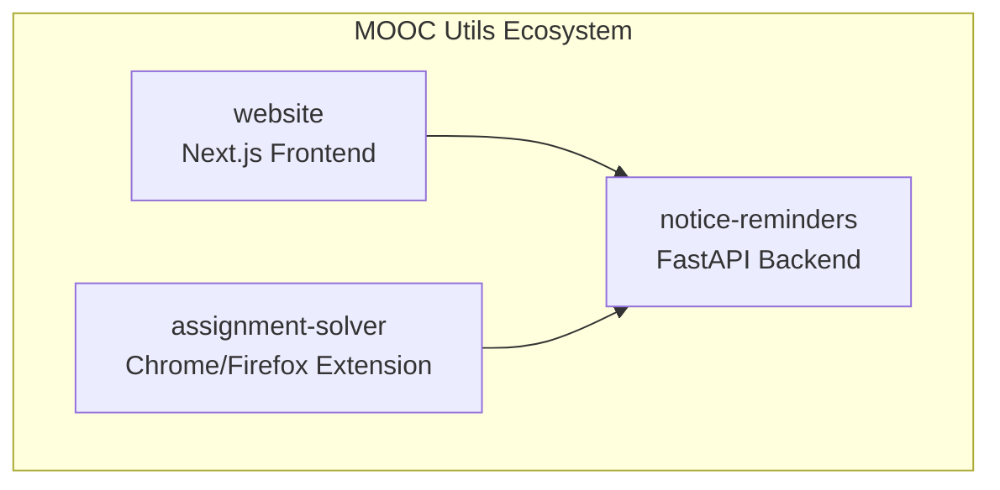
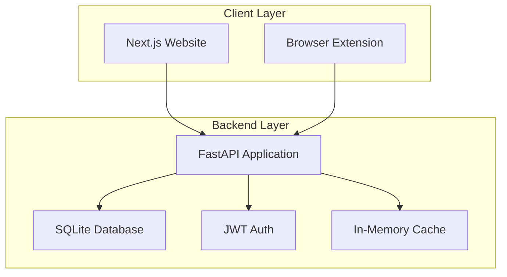
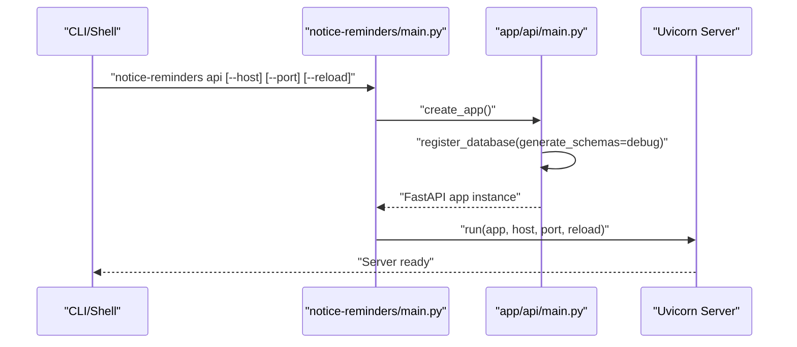
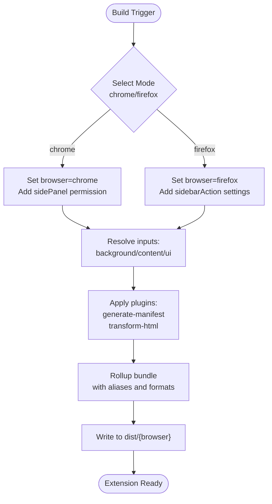
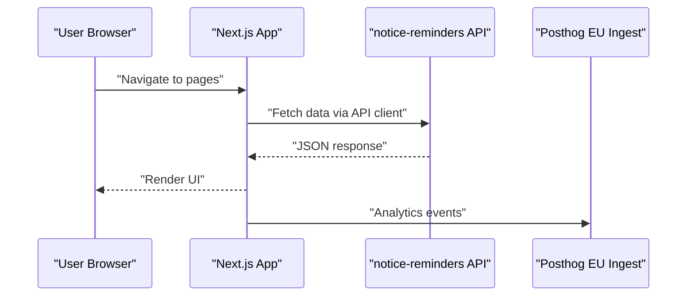
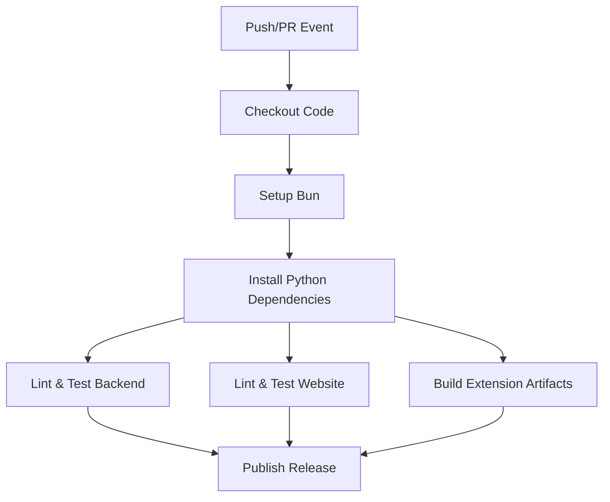
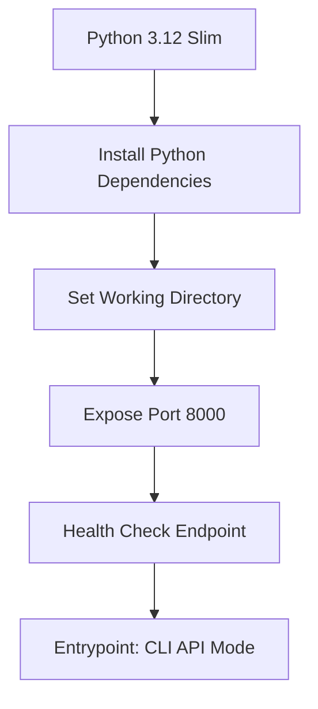
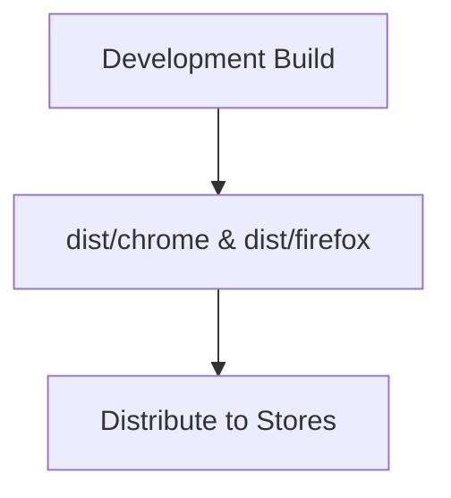
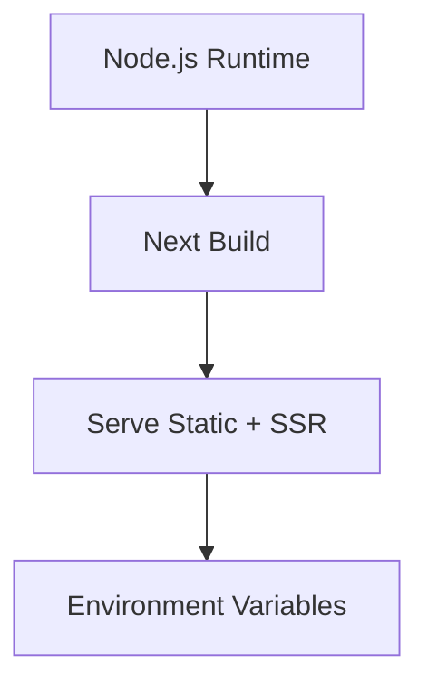
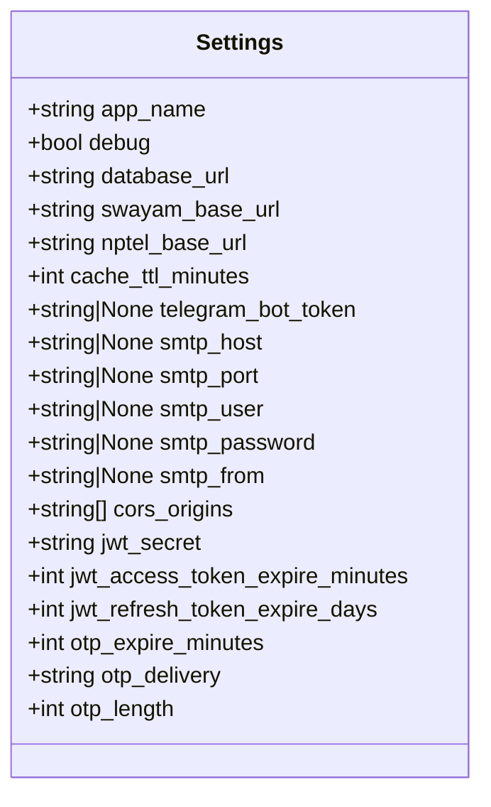

# Deployment and CI/CD

<cite>
**Referenced Files in This Document**
- [main.py](file://notice-reminders/main.py)
- [api_main.py](file://notice-reminders/app/api/main.py)
- [config.py](file://notice-reminders/app/core/config.py)
- [pyproject.toml](file://notice-reminders/pyproject.toml)
- [package.json](file://assignment-solver/package.json)
- [vite.config.js](file://assignment-solver/vite.config.js)
- [manifest.config.js](file://assignment-solver/manifest.config.js)
- [next.config.ts](file://website/next.config.ts)
- [api.ts](file://website/lib/api.ts)
- [release.yml](file://.github/workflows/release.yml)
</cite>

## Table of Contents
1. [Introduction](#introduction)
2. [Project Structure](#project-structure)
3. [Core Components](#core-components)
4. [Architecture Overview](#architecture-overview)
5. [Detailed Component Analysis](#detailed-component-analysis)
6. [CI/CD Pipeline](#cicd-pipeline)
7. [Docker Containerization](#docker-containerization)
8. [Environment-Specific Configurations](#environment-specific-configurations)
9. [Production Deployment Strategies](#production-deployment-strategies)
10. [Monitoring and Logging](#monitoring-and-logging)
11. [Maintenance Procedures](#maintenance-procedures)
12. [Troubleshooting Guide](#troubleshooting-guide)
13. [Conclusion](#conclusion)

## Introduction
This document provides comprehensive deployment and CI/CD guidance for the MOOC Utils ecosystem, covering:
- CI/CD pipeline configuration and automated testing
- Deployment strategies for the FastAPI backend, Chrome/Firefox extension, and Next.js website
- Docker containerization approaches
- Environment-specific configurations
- Production deployment considerations
- Monitoring, logging, and maintenance procedures

## Project Structure
The repository comprises three primary components:
- FastAPI backend service (notice-reminders)
- Chrome/Firefox browser extension (assignment-solver)
- Next.js marketing/landing website (website)

**Diagram sources**
- [api_main.py](file://notice-reminders/app/api/main.py#L1-L46)
- [api.ts](file://website/lib/api.ts#L1-L184)
- [manifest.config.js](file://assignment-solver/manifest.config.js#L1-L108)

**Section sources**
- [pyproject.toml](file://notice-reminders/pyproject.toml#L1-L41)
- [package.json](file://assignment-solver/package.json#L1-L30)
- [next.config.ts](file://website/next.config.ts#L1-L19)

## Core Components
- FastAPI Backend: Provides REST APIs for course search, announcements, subscriptions, and user authentication. It supports CLI and API modes via command-line entry points.
- Assignment Solver Extension: A cross-browser extension supporting Chrome and Firefox with dynamic manifest generation, content scripts, background service workers, and UI panels.
- Website: Next.js frontend with Posthog analytics integration and API client for backend communication.

Key implementation references:
- Backend entry point and mode selection
- FastAPI app factory and router registration
- Settings configuration with environment variables
- Extension build scripts and manifest generation
- Next.js configuration and API client

**Section sources**
- [main.py](file://notice-reminders/main.py#L1-L71)
- [api_main.py](file://notice-reminders/app/api/main.py#L1-L46)
- [config.py](file://notice-reminders/app/core/config.py#L1-L32)
- [package.json](file://assignment-solver/package.json#L1-L30)
- [vite.config.js](file://assignment-solver/vite.config.js#L1-L109)
- [manifest.config.js](file://assignment-solver/manifest.config.js#L1-L108)
- [next.config.ts](file://website/next.config.ts#L1-L19)
- [api.ts](file://website/lib/api.ts#L1-L184)

## Architecture Overview
The system follows a client-service architecture:
- The Next.js website communicates with the FastAPI backend via HTTP endpoints.
- The browser extension interacts with the same backend for user management, subscriptions, and notifications.
- The backend exposes modular routers for users, authentication, search, courses, announcements, subscriptions, and notifications.

**Diagram sources**
- [api_main.py](file://notice-reminders/app/api/main.py#L1-L46)
- [config.py](file://notice-reminders/app/core/config.py#L1-L32)

## Detailed Component Analysis

### FastAPI Backend Deployment
The backend supports two operational modes:
- CLI mode for local tasks and maintenance
- API mode for production serving via Uvicorn

Operational flow:
- Entry point parses arguments to select mode
- API mode initializes Uvicorn with host, port, and reload options
- App factory creates FastAPI instance, registers CORS, and mounts routers
- Database initialization occurs based on settings and debug flag

**Diagram sources**
- [main.py](file://notice-reminders/main.py#L8-L66)
- [api_main.py](file://notice-reminders/app/api/main.py#L17-L42)

**Section sources**
- [main.py](file://notice-reminders/main.py#L1-L71)
- [api_main.py](file://notice-reminders/app/api/main.py#L1-L46)
- [config.py](file://notice-reminders/app/core/config.py#L1-L32)
- [pyproject.toml](file://notice-reminders/pyproject.toml#L1-L41)

### Browser Extension Build and Distribution
The extension supports Chrome and Firefox with dynamic manifest generation and separate build targets:
- Build scripts for Chrome and Firefox
- Vite configuration with aliases and plugins for manifest generation and HTML transformation
- Manifest generation handles browser-specific permissions and UI elements

**Diagram sources**
- [vite.config.js](file://assignment-solver/vite.config.js#L54-L108)
- [manifest.config.js](file://assignment-solver/manifest.config.js#L14-L105)

**Section sources**
- [package.json](file://assignment-solver/package.json#L6-L14)
- [vite.config.js](file://assignment-solver/vite.config.js#L1-L109)
- [manifest.config.js](file://assignment-solver/manifest.config.js#L1-L108)

### Next.js Website Deployment
The website integrates with the backend via an API client and includes Posthog analytics:
- API client reads NEXT_PUBLIC_API_URL from environment
- Rewrites route patterns for Posthog ingestion endpoints
- Uses React Query and shadcn/ui components

**Diagram sources**
- [api.ts](file://website/lib/api.ts#L16-L53)
- [next.config.ts](file://website/next.config.ts#L4-L15)

**Section sources**
- [api.ts](file://website/lib/api.ts#L1-L184)
- [next.config.ts](file://website/next.config.ts#L1-L19)

## CI/CD Pipeline
Current repository includes a release workflow. The workflow orchestrates:
- Checkout repository
- Setup Bun for JavaScript tooling
- Install Python dependencies for the backend
- Run linting and tests for all components
- Build distribution artifacts for the extension
- Publish release assets

**Diagram sources**
- [release.yml](file://.github/workflows/release.yml)

**Section sources**
- [.github/workflows/release.yml](file://.github/workflows/release.yml)

## Docker Containerization
Containerization strategies for each component:

### FastAPI Backend Container
- Base image: python:3.12-slim
- Install system dependencies if needed
- Copy project files and install Python dependencies using the project configuration
- Set working directory and expose port
- Define health check endpoint
- Entrypoint uses the CLI entry point with API mode

**Diagram sources**
- [pyproject.toml](file://notice-reminders/pyproject.toml#L1-L41)
- [main.py](file://notice-reminders/main.py#L54-L62)

### Browser Extension Packaging
- Build artifacts are generated under dist/{browser}
- Distribute prebuilt extensions for Chrome and Firefox
- Consider publishing to respective stores after signing

**Diagram sources**
- [package.json](file://assignment-solver/package.json#L9-L11)
- [vite.config.js](file://assignment-solver/vite.config.js#L56-L91)

### Next.js Website Container
- Use Next.js official image or lightweight Node base
- Build static assets and serve with Next runtime
- Configure environment variables for API URL and analytics

**Diagram sources**
- [next.config.ts](file://website/next.config.ts#L1-L19)
- [api.ts](file://website/lib/api.ts#L16-L16)

## Environment-Specific Configurations
Backend settings are managed via environment variables:
- Database URL and debug mode
- CORS origins for web integration
- JWT secrets and token expiration
- Email SMTP settings for OTP delivery
- Platform URLs for NPTEL/Swayam scraping

**Diagram sources**
- [config.py](file://notice-reminders/app/core/config.py#L4-L32)

**Section sources**
- [config.py](file://notice-reminders/app/core/config.py#L1-L32)

## Production Deployment Strategies
Recommended production practices:

### Backend
- Use a reverse proxy (Nginx/Caddy) to terminate TLS and forward to Uvicorn
- Scale horizontally behind a load balancer
- Persist SQLite in production using PostgreSQL with connection pooling
- Configure health checks and readiness probes
- Enable structured logging and metrics collection

### Extension
- Sign and publish to Chrome Web Store and Mozilla Add-ons
- Automate builds and releases via CI with version tagging
- Maintain compatibility matrices for Chrome/Firefox versions

### Website
- Deploy static build to CDN or static hosting
- Configure HTTPS and security headers
- Integrate analytics and error tracking
- Use environment-specific API URLs

[No sources needed since this section provides general guidance]

## Monitoring and Logging
- Backend logging: Configure structured logging with log levels and correlation IDs
- Metrics: Expose Prometheus-compatible metrics endpoint
- Tracing: Integrate OpenTelemetry for distributed tracing
- Frontend monitoring: Use Posthog for analytics and Sentry for error reporting
- Health checks: Implement readiness/liveness endpoints

[No sources needed since this section provides general guidance]

## Maintenance Procedures
- Database migrations: Use Tortoise ORM migrations and Aerich for schema changes
- Dependency updates: Regularly update Python packages and Node dependencies
- Security patches: Monitor advisories and apply updates promptly
- Backup strategy: Back up database and configuration files regularly

[No sources needed since this section provides general guidance]

## Troubleshooting Guide
Common issues and resolutions:
- Backend fails to start: Verify environment variables and database connectivity
- CORS errors: Ensure frontend origin is included in CORS origins
- Extension not loading: Check manifest generation and browser permissions
- Website API failures: Confirm NEXT_PUBLIC_API_URL and network connectivity

**Section sources**
- [config.py](file://notice-reminders/app/core/config.py#L20-L20)
- [api.ts](file://website/lib/api.ts#L16-L53)

## Conclusion
This guide outlines a complete deployment and CI/CD strategy for the MOOC Utils components. By leveraging the existing build scripts, environment configuration, and the release workflow, teams can reliably deploy the FastAPI backend, distribute the browser extension, and host the Next.js website in production while maintaining observability and operational hygiene.