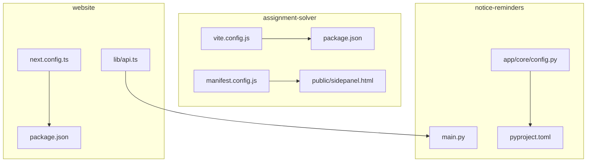
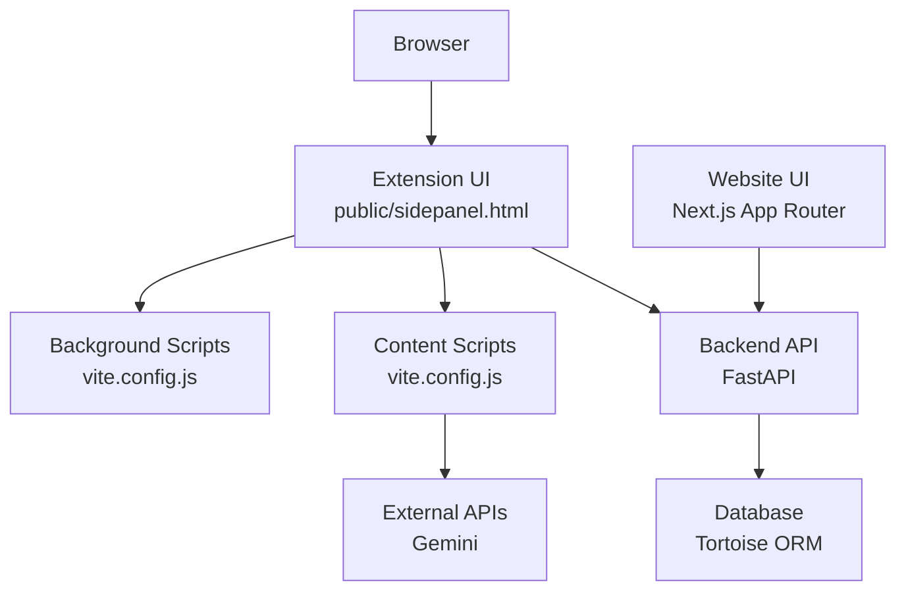
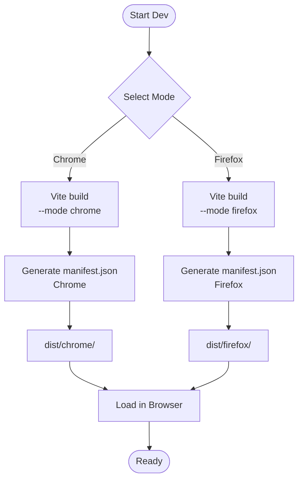
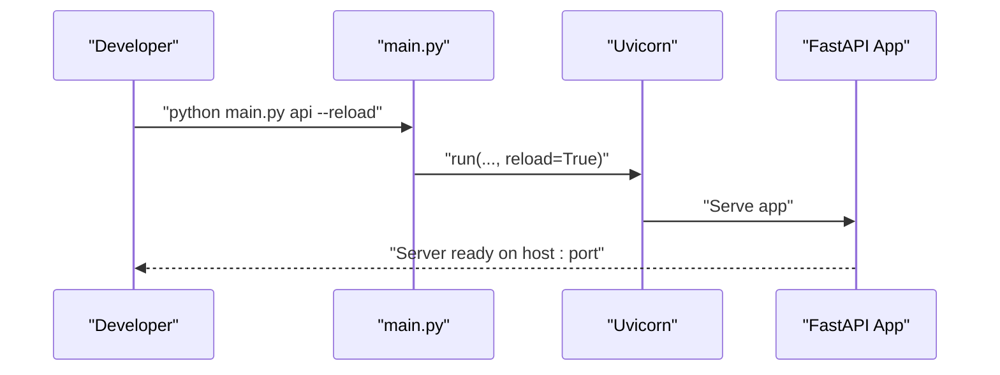
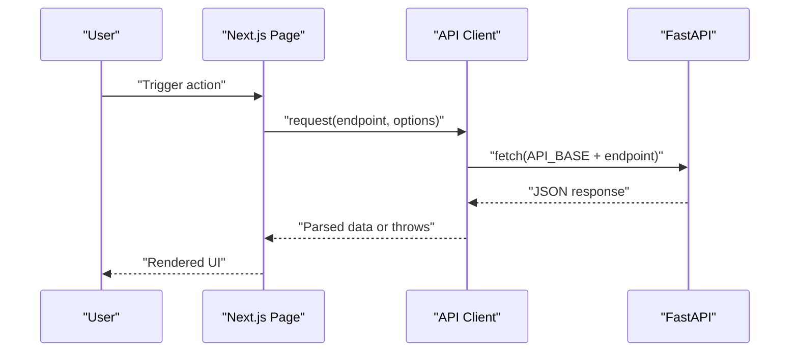
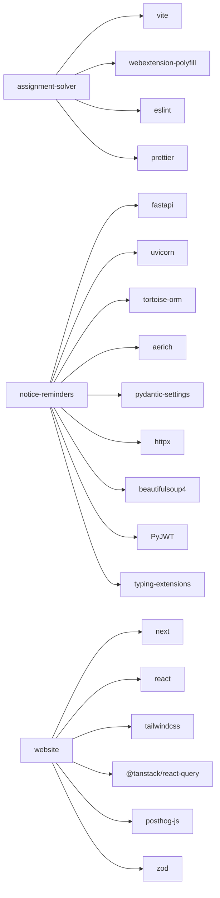

# Development Setup

<cite>
**Referenced Files in This Document**
- [assignment-solver/package.json](file://assignment-solver/package.json)
- [assignment-solver/vite.config.js](file://assignment-solver/vite.config.js)
- [assignment-solver/manifest.config.js](file://assignment-solver/manifest.config.js)
- [assignment-solver/README.md](file://assignment-solver/README.md)
- [assignment-solver/public/sidepanel.html](file://assignment-solver/public/sidepanel.html)
- [notice-reminders/pyproject.toml](file://notice-reminders/pyproject.toml)
- [notice-reminders/main.py](file://notice-reminders/main.py)
- [notice-reminders/app/core/config.py](file://notice-reminders/app/core/config.py)
- [notice-reminders/README.md](file://notice-reminders/README.md)
- [website/package.json](file://website/package.json)
- [website/next.config.ts](file://website/next.config.ts)
- [website/lib/api.ts](file://website/lib/api.ts)
- [website/README.md](file://website/README.md)
- [assignment-solver/.gitignore](file://assignment-solver/.gitignore)
- [notice-reminders/.gitignore](file://notice-reminders/.gitignore)
- [website/.gitignore](file://website/.gitignore)
</cite>

## Table of Contents
1. [Introduction](#introduction)
2. [Project Structure](#project-structure)
3. [Core Components](#core-components)
4. [Architecture Overview](#architecture-overview)
5. [Detailed Component Analysis](#detailed-component-analysis)
6. [Dependency Analysis](#dependency-analysis)
7. [Performance Considerations](#performance-considerations)
8. [Troubleshooting Guide](#troubleshooting-guide)
9. [Conclusion](#conclusion)
10. [Appendices](#appendices)

## Introduction
This document provides a complete development environment setup guide for all three components of the project:
- Browser Extension (Assignment Solver)
- Backend API (Notice Reminders)
- Website (Next.js frontend)

It covers prerequisites, environment variables, dependency installation, local development server setup, build configuration, Python virtual environment setup, development workflow, debugging techniques, hot reload configurations, and best practices. It also includes troubleshooting guidance for common development issues.

## Project Structure
The repository is organized as a monorepo with three distinct components:
- assignment-solver: A cross-browser extension built with Vite and webextension-polyfill, generating separate Chrome and Firefox manifests.
- notice-reminders: A FastAPI backend with Tortoise ORM, Aerich migrations, and Pydantic settings for configuration.
- website: A Next.js 16 App Router application with TypeScript, Tailwind CSS, and TanStack Query.

**Diagram sources**
- [assignment-solver/package.json](file://assignment-solver/package.json#L1-L30)
- [assignment-solver/vite.config.js](file://assignment-solver/vite.config.js#L1-L109)
- [assignment-solver/manifest.config.js](file://assignment-solver/manifest.config.js#L1-L108)
- [assignment-solver/public/sidepanel.html](file://assignment-solver/public/sidepanel.html#L1-L392)
- [notice-reminders/pyproject.toml](file://notice-reminders/pyproject.toml#L1-L41)
- [notice-reminders/main.py](file://notice-reminders/main.py#L1-L71)
- [notice-reminders/app/core/config.py](file://notice-reminders/app/core/config.py#L1-L32)
- [website/package.json](file://website/package.json#L1-L47)
- [website/next.config.ts](file://website/next.config.ts#L1-L19)
- [website/lib/api.ts](file://website/lib/api.ts#L1-L184)

**Section sources**
- [assignment-solver/package.json](file://assignment-solver/package.json#L1-L30)
- [notice-reminders/pyproject.toml](file://notice-reminders/pyproject.toml#L1-L41)
- [website/package.json](file://website/package.json#L1-L47)

## Core Components
This section outlines prerequisites, environment variables, dependency installation, and development server setup for each component.

### Browser Extension (Assignment Solver)
- Prerequisites
  - Bun package manager
  - Gemini API key from Google AI Studio
  - Chrome (116+) or Firefox (121+)
- Environment variables
  - None required for building; API key is stored locally in the extension.
- Dependency installation
  - Install dependencies using Bun.
- Local development server
  - Watch mode for Chrome or Firefox with automatic rebuild on changes.
- Build configuration
  - Vite configuration supports separate builds for Chrome and Firefox, dynamic manifest generation, and aliases for internal modules.
- Hot reload
  - Use watch mode scripts to enable hot reload during development.
- Best practices
  - Keep API keys local to the extension; do not commit secrets.
  - Use the provided scripts for linting and formatting.

**Section sources**
- [assignment-solver/README.md](file://assignment-solver/README.md#L24-L91)
- [assignment-solver/package.json](file://assignment-solver/package.json#L6-L14)
- [assignment-solver/vite.config.js](file://assignment-solver/vite.config.js#L54-L107)
- [assignment-solver/manifest.config.js](file://assignment-solver/manifest.config.js#L14-L105)

### Backend API (Notice Reminders)
- Prerequisites
  - Python 3.12+
- Environment variables
  - Configuration is managed via Pydantic settings with a .env file.
  - Key settings include database URL, CORS origins, JWT configuration, and optional SMTP/Telegram settings.
- Dependency installation
  - Use uv to synchronize dependencies.
- Local development server
  - Run the FastAPI server in development mode with auto-reload.
- Build configuration
  - Project uses Hatch as the build backend; wheel packaging configured for the app package.
- Hot reload
  - Enable reload flag for development.
- Best practices
  - Use uv for reproducible environments.
  - Keep secrets in .env and exclude from version control.

**Section sources**
- [notice-reminders/README.md](file://notice-reminders/README.md#L20-L56)
- [notice-reminders/pyproject.toml](file://notice-reminders/pyproject.toml#L1-L41)
- [notice-reminders/app/core/config.py](file://notice-reminders/app/core/config.py#L4-L32)
- [notice-reminders/main.py](file://notice-reminders/main.py#L30-L66)

### Website (Next.js)
- Prerequisites
  - Node.js and Bun
- Environment variables
  - NEXT_PUBLIC_API_URL must point to the running backend API.
- Dependency installation
  - Install dependencies using Bun.
- Local development server
  - Start Next.js in development mode.
- Build configuration
  - Next.js configuration includes PostCSS/Tailwind and custom rewrites for PostHog.
- Hot reload
  - Next.js dev server provides automatic hot reload.
- Best practices
  - Do not use npm run dev per repository guidelines.
  - Ensure the backend is running for login and dashboard features.

**Section sources**
- [website/README.md](file://website/README.md#L20-L51)
- [website/package.json](file://website/package.json#L5-L10)
- [website/next.config.ts](file://website/next.config.ts#L3-L18)
- [website/lib/api.ts](file://website/lib/api.ts#L16-L32)

## Architecture Overview
The website communicates with the backend API. The extension interacts with external APIs (e.g., Gemini) and injects content into target pages. The backend manages users, subscriptions, and announcements.

**Diagram sources**
- [assignment-solver/public/sidepanel.html](file://assignment-solver/public/sidepanel.html#L1-L392)
- [assignment-solver/vite.config.js](file://assignment-solver/vite.config.js#L54-L107)
- [website/lib/api.ts](file://website/lib/api.ts#L16-L32)
- [notice-reminders/main.py](file://notice-reminders/main.py#L54-L66)

## Detailed Component Analysis

### Browser Extension (Assignment Solver)
- Build system
  - Vite with plugins to generate manifests and transform HTML for side panels.
  - Separate input entries for background, content, and UI.
- Manifest generation
  - Dynamic manifests for Chrome (side_panel) and Firefox (sidebar_action).
- Development workflow
  - Watch mode for Chrome and Firefox with automatic rebuilds.
- Debugging
  - Load unpacked extension in developer mode.
  - Inspect service worker and content script consoles.

**Diagram sources**
- [assignment-solver/vite.config.js](file://assignment-solver/vite.config.js#L54-L107)
- [assignment-solver/manifest.config.js](file://assignment-solver/manifest.config.js#L14-L105)

**Section sources**
- [assignment-solver/vite.config.js](file://assignment-solver/vite.config.js#L1-L109)
- [assignment-solver/manifest.config.js](file://assignment-solver/manifest.config.js#L1-L108)
- [assignment-solver/public/sidepanel.html](file://assignment-solver/public/sidepanel.html#L1-L392)
- [assignment-solver/README.md](file://assignment-solver/README.md#L74-L91)

### Backend API (Notice Reminders)
- Configuration
  - Pydantic settings with defaults and environment file loading.
- Server startup
  - Uvicorn runner with configurable host, port, and reload.
- Development commands
  - Formatting, linting, and type checking via uv tooling.

**Diagram sources**
- [notice-reminders/main.py](file://notice-reminders/main.py#L54-L66)

**Section sources**
- [notice-reminders/app/core/config.py](file://notice-reminders/app/core/config.py#L4-L32)
- [notice-reminders/pyproject.toml](file://notice-reminders/pyproject.toml#L1-L41)
- [notice-reminders/README.md](file://notice-reminders/README.md#L51-L56)

### Website (Next.js)
- API client
  - Centralized API client with environment-driven base URL and standardized error handling.
- Rewrites
  - PostHog ingestion rewrites configured in Next.js config.
- Development
  - Next.js dev server with hot reload; linting via ESLint.

**Diagram sources**
- [website/lib/api.ts](file://website/lib/api.ts#L28-L53)
- [website/next.config.ts](file://website/next.config.ts#L4-L15)

**Section sources**
- [website/lib/api.ts](file://website/lib/api.ts#L1-L184)
- [website/next.config.ts](file://website/next.config.ts#L1-L19)
- [website/README.md](file://website/README.md#L20-L51)

## Dependency Analysis
- assignment-solver
  - Vite, webextension-polyfill, ESLint, Prettier.
  - Aliases for internal modules simplify imports.
- notice-reminders
  - FastAPI, Uvicorn, Tortoise ORM, Aerich, Pydantic settings, httpx, beautifulsoup4, PyJWT, typing-extensions.
  - Build backend via Hatch; wheel packaging for app.
- website
  - Next.js, React, Tailwind CSS, TanStack Query, PostHog JS, shadcn/base-ui, zod.

**Diagram sources**
- [assignment-solver/package.json](file://assignment-solver/package.json#L15-L20)
- [notice-reminders/pyproject.toml](file://notice-reminders/pyproject.toml#L7-L19)
- [website/package.json](file://website/package.json#L11-L37)

**Section sources**
- [assignment-solver/package.json](file://assignment-solver/package.json#L15-L20)
- [notice-reminders/pyproject.toml](file://notice-reminders/pyproject.toml#L7-L19)
- [website/package.json](file://website/package.json#L11-L37)

## Performance Considerations
- Browser Extension
  - Use watch mode for incremental builds.
  - Minimize heavy computations in content scripts; offload to background/service worker when possible.
  - Respect rate limits for external APIs.
- Backend API
  - Use migrations and caching TTL settings appropriately.
  - Monitor database queries and optimize ORM usage.
- Website
  - Leverage Next.js static generation and caching.
  - Keep asset sizes reasonable; use Tailwind utilities efficiently.

[No sources needed since this section provides general guidance]

## Troubleshooting Guide
- Browser Extension
  - Could not get page HTML: Ensure you are on a supported assignment page and that it is fully loaded.
  - Question container not found: Re-extract questions; check console for errors.
  - API Key invalid: Verify the key at Google AI Studio; ensure it has Gemini API access enabled.
  - Answers not being applied: Some platforms use custom components; inspect console and apply answers individually.
  - Rate limit errors: Wait before retrying; consider upgrading quota or reducing concurrent requests.
- Backend API
  - Database connectivity: Verify database URL in environment settings.
  - CORS issues: Ensure frontend origin is included in CORS origins.
  - Reload not working: Confirm reload flag is passed when starting the server.
- Website
  - Login/dashboard not working: Ensure the backend is running and NEXT_PUBLIC_API_URL points to the correct host/port.
  - PostHog not tracking: Verify rewrites are active in development.

**Section sources**
- [assignment-solver/README.md](file://assignment-solver/README.md#L259-L312)
- [notice-reminders/app/core/config.py](file://notice-reminders/app/core/config.py#L14-L27)
- [notice-reminders/main.py](file://notice-reminders/main.py#L42-L45)
- [website/README.md](file://website/README.md#L27-L51)
- [website/next.config.ts](file://website/next.config.ts#L4-L15)

## Conclusion
By following this guide, you can set up a complete development environment across the browser extension, backend API, and website. Use the provided scripts and configurations for hot reload, linting, and formatting. Keep secrets secure, respect rate limits, and leverage the monorepo structure to iterate efficiently across components.

[No sources needed since this section summarizes without analyzing specific files]

## Appendices
- Environment variable templates
  - Notice Reminders (.env): Define database URL, JWT secret, and optional SMTP/Telegram settings.
  - Website (.env.local): Set NEXT_PUBLIC_API_URL to the backend address.
- Version requirements
  - Browser Extension: Requires Bun and modern browsers.
  - Backend API: Requires Python 3.12+.
  - Website: Requires Node.js and Bun.

**Section sources**
- [notice-reminders/app/core/config.py](file://notice-reminders/app/core/config.py#L4-L32)
- [website/README.md](file://website/README.md#L27-L33)
- [assignment-solver/README.md](file://assignment-solver/README.md#L24-L28)