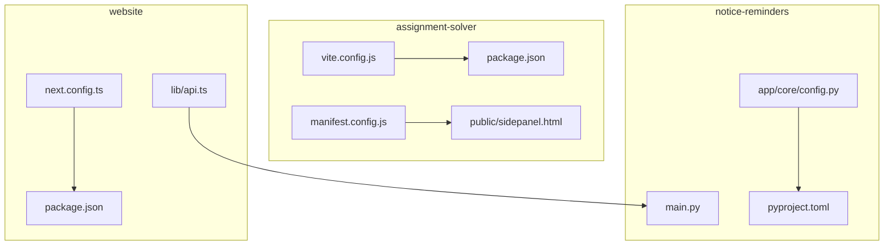
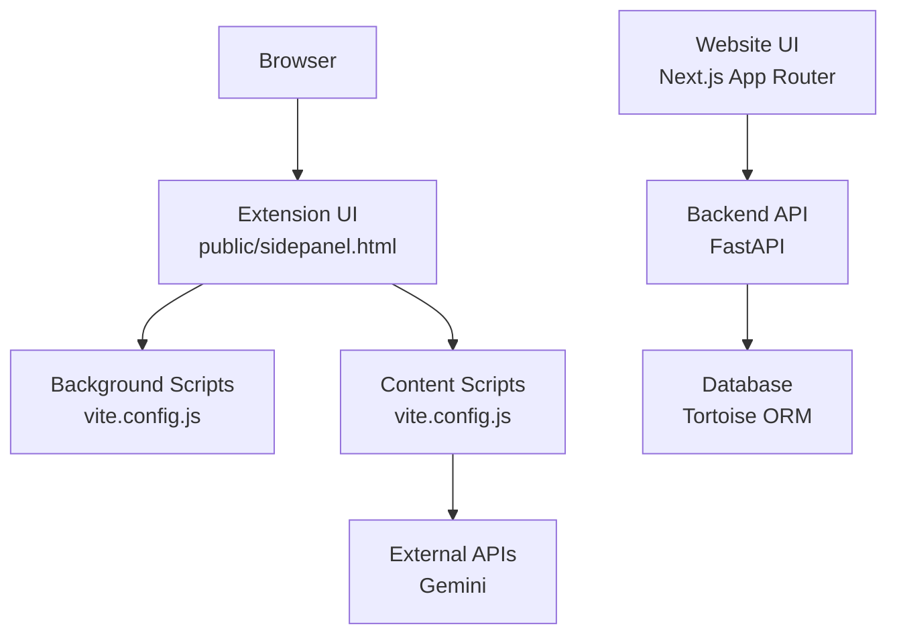
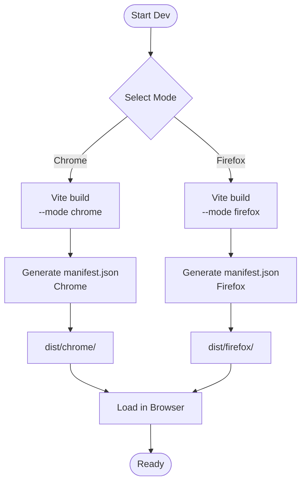
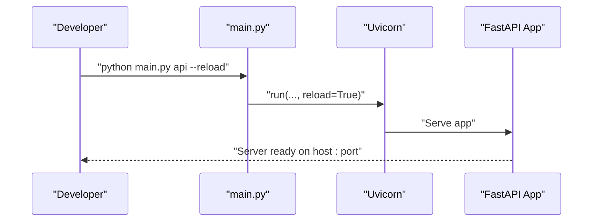
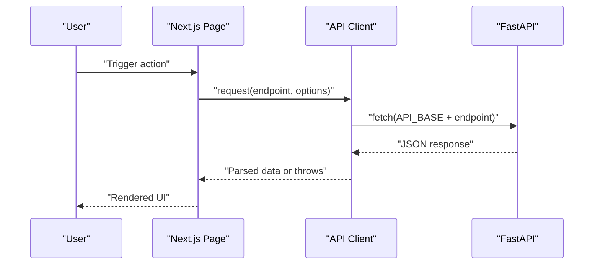
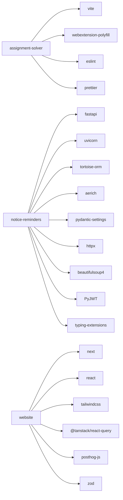

# Development setup

## Introduction
Local setup for all three pieces:
- Browser extension (Assignment Solver)
- Backend API (Notice Reminders)
- Website (Next.js)

Tooling, env files, and the scripts that keep reloads and linting sane.

## Project structure
The repository is organized as a monorepo with three distinct components:
- assignment-solver: A cross-browser extension built with Vite and webextension-polyfill, generating separate Chrome and Firefox manifests.
- notice-reminders: A FastAPI backend with Tortoise ORM, Aerich migrations, and Pydantic settings for configuration.
- website: A Next.js 16 App Router application with TypeScript, Tailwind CSS, and TanStack Query.

```mermaid
graph TB
subgraph "assignment-solver"
AS_PKG["package.json"]
AS_VITE["vite.config.js"]
AS_MAN["manifest.config.js"]
AS_HTML["public/sidepanel.html"]
end
subgraph "notice-reminders"
NR_PY["pyproject.toml"]
NR_MAIN["main.py"]
NR_CFG["app/core/config.py"]
end
subgraph "website"
WEB_PKG["package.json"]
WEB_NEXT["next.config.ts"]
WEB_API["lib/api.ts"]
end
WEB_API --> NR_MAIN
AS_MAN --> AS_HTML
AS_VITE --> AS_PKG
WEB_NEXT --> WEB_PKG
NR_CFG --> NR_PY
```

## Core components
### Browser extension (assignment solver)
- Prerequisites
 - Bun package manager
 - Gemini API key from Google AI Studio
 - Chrome (116+) or Firefox (121+)
- Environment variables
 - None required for building; API key is stored locally in the extension.
- Dependency installation
 - Install dependencies using Bun.
- Local development server
 - Watch mode for Chrome or Firefox with automatic rebuild on changes.
- Build configuration
 - Vite configuration supports separate builds for Chrome and Firefox, dynamic manifest generation, and aliases for internal modules.
- Hot reload
 - Use watch mode scripts to enable hot reload during development.
- Best practices
 - Keep API keys local to the extension; do not commit secrets.
 - Use the provided scripts for linting and formatting.

### Backend API (notice reminders)
- Prerequisites
 - Python 3.12+
- Environment variables
 - Configuration is managed via Pydantic settings with a .env file.
 - Key settings include database URL, CORS origins, JWT configuration, and optional SMTP/Telegram settings.
- Dependency installation
 - Use uv to synchronize dependencies.
- Local development server
 - Run the FastAPI server in development mode with auto-reload.
- Build configuration
 - Project uses Hatch as the build backend; wheel packaging configured for the app package.
- Hot reload
 - Enable reload flag for development.
- Best practices
 - Use uv for reproducible environments.
 - Keep secrets in .env and exclude from version control.

### Website (Next.js)
- Prerequisites
 - Bun (and a current Node if your environment still needs it for tooling)
- Environment variables
 - `NEXT_PUBLIC_API_URL` must point at the running Notice Reminders API (`http://localhost:8000` in local setups).
- Dependency installation
 - `cd website && bun install`
- Local development
 - Repo guidelines: do not run `npm run dev` or `bun dev`. Use `bun run build` and `bun run lint`.
- Build configuration
 - Next.js 16 App Router, PostCSS/Tailwind 4, PostHog rewrites in `next.config.ts`.
- Best practices
 - Start `uv run python main.py api` before expecting login or dashboard data.

## Architecture overview
The website communicates with the backend API. The extension interacts with external APIs (e.g., Gemini) and injects content into target pages. The backend manages users, subscriptions, and announcements.

```mermaid
graph TB
Browser["Browser"]
Ext["Extension UI<br/>public/sidepanel.html"]
ExtBg["Background Scripts<br/>vite.config.js"]
ExtCt["Content Scripts<br/>vite.config.js"]
ExtAPI["External APIs<br/>Gemini"]
WebUI["Website UI<br/>Next.js App Router"]
API["Backend API<br/>FastAPI"]
DB["Database<br/>Tortoise ORM"]
Browser --> Ext
Ext --> ExtBg
Ext --> ExtCt
ExtCt --> ExtAPI
WebUI --> API
API --> DB
```

## Detailed component analysis

### Browser extension (assignment solver)
- Build system
 - Vite with plugins to generate manifests and transform HTML for side panels.
 - Separate input entries for background, content, and UI.
- Manifest generation
 - Dynamic manifests for Chrome (side_panel) and Firefox (sidebar_action).
- Development workflow
 - Watch mode for Chrome and Firefox with automatic rebuilds.
- Debugging
 - Load unpacked extension in developer mode.
 - Inspect service worker and content script consoles.

```mermaid
flowchart TD
Start(["Start Dev"]) --> Mode{"Select Mode"}
Mode --> |Chrome| ChromeBuild["Vite build<br/>--mode chrome"]
Mode --> |Firefox| FirefoxBuild["Vite build<br/>--mode firefox"]
ChromeBuild --> GenManifest["Generate manifest.json<br/>Chrome"]
FirefoxBuild --> GenManifestFF["Generate manifest.json<br/>Firefox"]
GenManifest --> Dist["dist/chrome/"]
GenManifestFF --> DistFF["dist/firefox/"]
Dist --> Load["Load in Browser"]
DistFF --> Load
Load --> Done(["Ready"])
```

### Backend API (notice reminders)
- Configuration
 - Pydantic settings with defaults and environment file loading.
- Server startup
 - Uvicorn runner with configurable host, port, and reload.
- Development commands
 - Formatting, linting, and type checking via uv tooling.

```mermaid
sequenceDiagram
participant Dev as "Developer"
participant CLI as "main.py"
participant Uvicorn as "Uvicorn"
participant App as "FastAPI App"
Dev->>CLI : "python main.py api --reload"
CLI->>Uvicorn : "run(..., reload=True)"
Uvicorn->>App : "Serve app"
App-->>Dev : "Server ready on host : port"
```

### Website (Next.js)
- API client
 - Centralized API client with environment-driven base URL and standardized error handling.
- Rewrites
 - PostHog ingestion rewrites configured in Next.js config.
- Development
 - Next.js dev server with hot reload; linting via ESLint.

```mermaid
sequenceDiagram
participant User as "User"
participant UI as "Next.js Page"
participant API as "API Client"
participant Backend as "FastAPI"
User->>UI : "Trigger action"
UI->>API : "request(endpoint, options)"
API->>Backend : "fetch(API_BASE + endpoint)"
Backend-->>API : "JSON response"
API-->>UI : "Parsed data or throws"
UI-->>User : "Rendered UI"
```

## Dependency analysis
- assignment-solver
 - Vite, webextension-polyfill, ESLint, Prettier.
 - Aliases for internal modules simplify imports.
- notice-reminders
 - FastAPI, Uvicorn, Tortoise ORM, Aerich, Pydantic settings, httpx, beautifulsoup4, PyJWT, typing-extensions.
 - Build backend via Hatch; wheel packaging for app.
- website
 - Next.js 16.1.6, React 19.2.3, Tailwind CSS 4, TanStack Query, PostHog JS, shadcn/base-ui, zod.

```mermaid
graph LR
AS["assignment-solver"] --> Vite["vite"]
AS --> Poly["webextension-polyfill"]
AS --> ESL["eslint"]
AS --> PRET["prettier"]
NR["notice-reminders"] --> FA["fastapi"]
NR --> UV["uvicorn"]
NR --> TO["tortoise-orm"]
NR --> AR["aerich"]
NR --> PS["pydantic-settings"]
NR --> HT["httpx"]
NR --> BS["beautifulsoup4"]
NR --> JWT["PyJWT"]
NR --> TE["typing-extensions"]
WEB["website"] --> NX["next"]
WEB --> R["react"]
WEB --> TW["tailwindcss"]
WEB --> TQ["@tanstack/react-query"]
WEB --> PH["posthog-js"]
WEB --> ZD["zod"]
```

## Performance considerations
- Browser Extension
 - Use watch mode for incremental builds.
 - Minimize heavy computations in content scripts; offload to background/service worker when possible.
 - Respect rate limits for external APIs.
- Backend API
 - Use migrations and caching TTL settings appropriately.
 - Monitor database queries and optimize ORM usage.
- Website
 - Prefer `bun run build` over a long-running dev server.
 - Keep asset sizes reasonable; use Tailwind utilities efficiently.

## Troubleshooting guide
- Browser Extension
 - Could not get page HTML: Ensure you are on a supported assignment page and that it is fully loaded.
 - Question container not found: Re-extract questions; check console for errors.
 - API Key invalid: Verify the key at Google AI Studio; ensure it has Gemini API access enabled.
 - Answers not being applied: Some platforms use custom components; inspect console and apply answers individually.
 - Rate limit errors: Wait before retrying; consider upgrading quota or reducing concurrent requests.
- Backend API
 - Database connectivity: Verify database URL in environment settings.
 - CORS issues: Ensure frontend origin is included in CORS origins.
 - Reload not working: Confirm reload flag is passed when starting the server.
- Website
 - Login/dashboard not working: Ensure the backend is running and NEXT_PUBLIC_API_URL points to the correct host/port.
 - PostHog not tracking: Verify rewrites are active in development.

## Conclusion
Three packages, three terminals is normal. Keep API keys out of git and respect Gemini rate limits while you iterate.

## Appendices
- Environment variable templates
 - Notice Reminders (.env): Define database URL, JWT secret, and optional SMTP/Telegram settings.
 - Website (.env.local): Set NEXT_PUBLIC_API_URL to the backend address.
- Version requirements
 - Browser Extension: Requires Bun and modern browsers.
 - Backend API: Requires Python 3.12+.
 - Website: Requires Bun. Repo rules: no `npm run dev` or `bun dev`.
