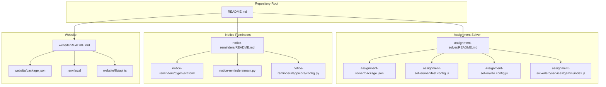
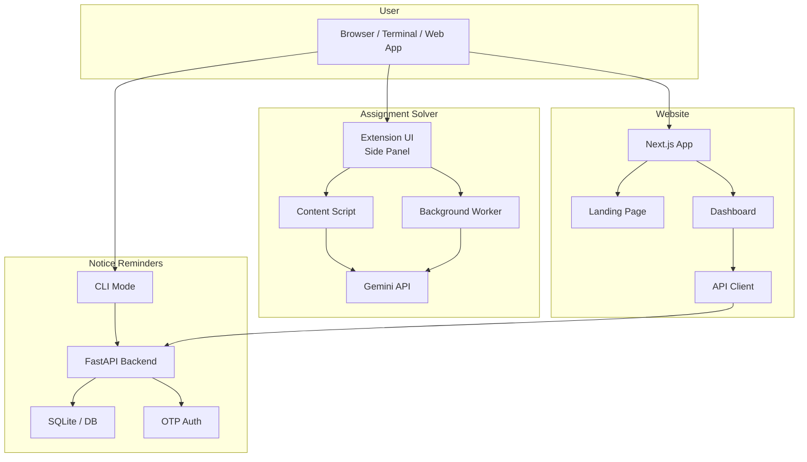
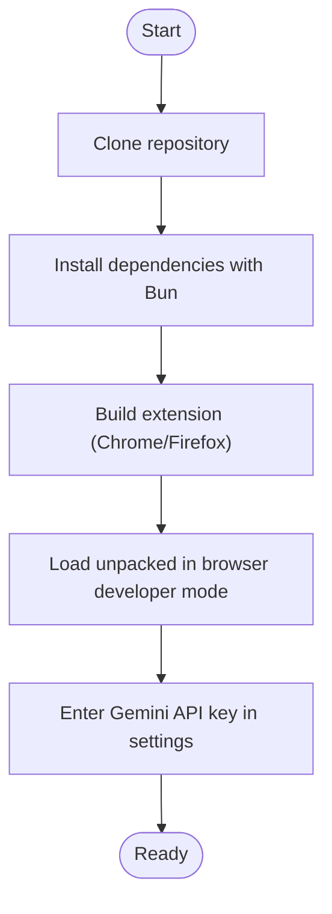
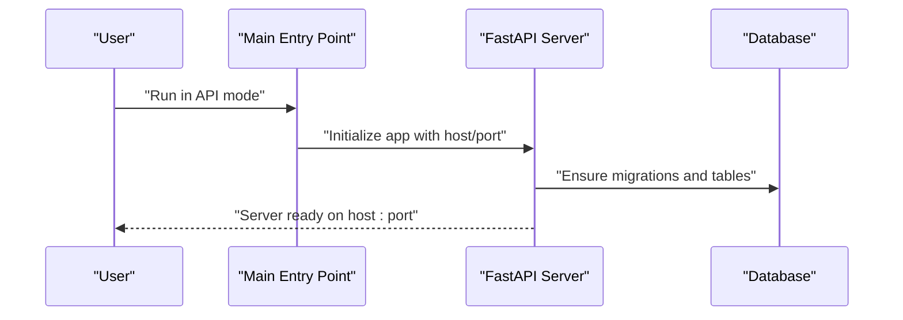
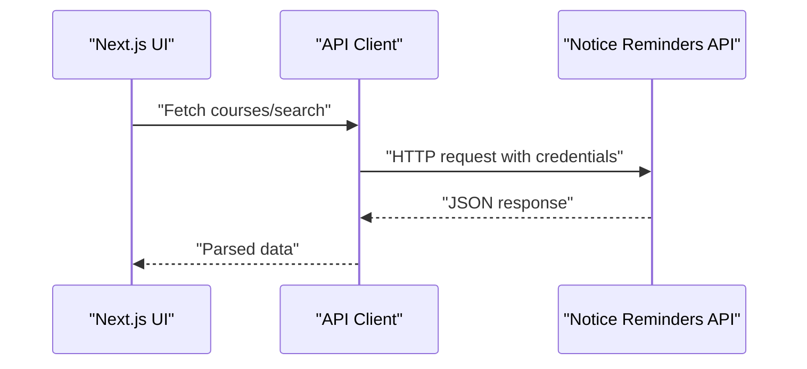
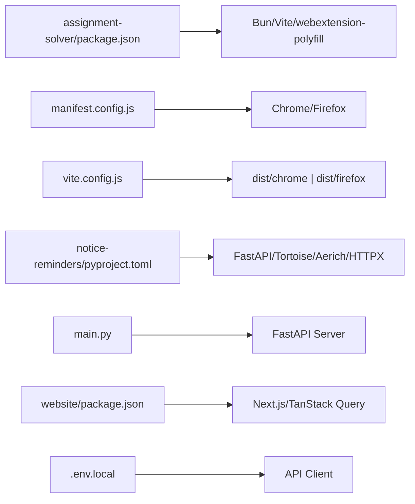

# Getting Started

<cite>
**Referenced Files in This Document**
- [README.md](file://README.md)
- [assignment-solver/README.md](file://assignment-solver/README.md)
- [assignment-solver/package.json](file://assignment-solver/package.json)
- [assignment-solver/manifest.config.js](file://assignment-solver/manifest.config.js)
- [assignment-solver/vite.config.js](file://assignment-solver/vite.config.js)
- [assignment-solver/src/services/gemini/index.js](file://assignment-solver/src/services/gemini/index.js)
- [notice-reminders/README.md](file://notice-reminders/README.md)
- [notice-reminders/pyproject.toml](file://notice-reminders/pyproject.toml)
- [notice-reminders/main.py](file://notice-reminders/main.py)
- [notice-reminders/app/core/config.py](file://notice-reminders/app/core/config.py)
- [website/README.md](file://website/README.md)
- [website/package.json](file://website/package.json)
- [website/.env.local](file://website/.env.local)
- [website/lib/api.ts](file://website/lib/api.ts)
</cite>

## Table of Contents
1. [Introduction](#introduction)
2. [Project Structure](#project-structure)
3. [Core Components](#core-components)
4. [Architecture Overview](#architecture-overview)
5. [Detailed Component Analysis](#detailed-component-analysis)
6. [Dependency Analysis](#dependency-analysis)
7. [Performance Considerations](#performance-considerations)
8. [Troubleshooting Guide](#troubleshooting-guide)
9. [Conclusion](#conclusion)
10. [Appendices](#appendices)

## Introduction
This guide helps you quickly set up and use the MOOC Utils suite: the Assignment Solver browser extension, the Notice Reminders CLI tool and API backend, and the Website dashboard. You will find prerequisites, environment setup, installation steps, initial configuration, and a basic workflow for new users. Quick start examples show how to install the extension, configure your Gemini API key, and access the website dashboard.

## Project Structure
MOOC Utils is organized as a multi-project repository with three independent components:
- Assignment Solver: a browser extension for AI-powered assignment assistance.
- Notice Reminders: a Python CLI tool and FastAPI backend for course announcements and subscriptions.
- Website: a Next.js web app providing a landing page and dashboard for Notice Reminders and Assignment Solver.

**Diagram sources**
- [README.md](file://README.md#L1-L62)
- [assignment-solver/README.md](file://assignment-solver/README.md#L1-L339)
- [notice-reminders/README.md](file://notice-reminders/README.md#L1-L56)
- [website/README.md](file://website/README.md#L1-L51)

**Section sources**
- [README.md](file://README.md#L1-L62)

## Core Components
- Assignment Solver extension: AI-powered question extraction and solving using Gemini, with manual and automated modes. Requires a Gemini API key and a modern browser.
- Notice Reminders CLI tool and API: Python-based tool to search courses, fetch announcements, and manage subscriptions via a FastAPI backend. Provides OTP-based login and httpOnly cookie authentication.
- Website dashboard: Next.js app with a landing page and a dashboard for Notice Reminders. Requires the backend to be running for login and data.

**Section sources**
- [assignment-solver/README.md](file://assignment-solver/README.md#L1-L339)
- [notice-reminders/README.md](file://notice-reminders/README.md#L1-L56)
- [website/README.md](file://website/README.md#L1-L51)

## Architecture Overview
The three components operate independently but integrate through the Website dashboard and Notice Reminders backend.

**Diagram sources**
- [assignment-solver/README.md](file://assignment-solver/README.md#L164-L202)
- [notice-reminders/main.py](file://notice-reminders/main.py#L8-L66)
- [website/lib/api.ts](file://website/lib/api.ts#L16-L53)

## Detailed Component Analysis

### Assignment Solver Extension
Installation and setup:
- Prerequisites: Bun package manager, a Gemini API key, and a supported browser (Chrome or Firefox).
- Build: Use the provided scripts to build for Chrome or Firefox, or build both.
- Load in browser: Developer mode required; load the appropriate distribution folder.
- Configure API key: Open the side panel, go to Settings, enter your Gemini API key, and save.

Basic workflow:
- Navigate to an assignment page.
- Open the extension side panel and extract questions.
- Choose Manual or Auto mode; review and confirm actions.

Verification steps:
- Ensure the extension icon appears in the toolbar.
- Confirm the side panel opens and displays settings.
- Test extraction and solving with a known assignment page.

Common issues and fixes:
- “Could not get page HTML”: Refresh the page and re-extract.
- “Question container not found”: Re-extract and check console logs.
- “API Key invalid”: Verify the key at the AI Studio and ensure no extra spaces.
- Answers not applied: Platform-specific input components may require manual application.

**Section sources**
- [assignment-solver/README.md](file://assignment-solver/README.md#L24-L73)
- [assignment-solver/README.md](file://assignment-solver/README.md#L93-L133)
- [assignment-solver/README.md](file://assignment-solver/README.md#L259-L290)
- [assignment-solver/package.json](file://assignment-solver/package.json#L6-L14)
- [assignment-solver/manifest.config.js](file://assignment-solver/manifest.config.js#L14-L105)
- [assignment-solver/vite.config.js](file://assignment-solver/vite.config.js#L54-L108)
- [assignment-solver/src/services/gemini/index.js](file://assignment-solver/src/services/gemini/index.js#L12-L341)

#### Build and Load Flow

**Diagram sources**
- [assignment-solver/README.md](file://assignment-solver/README.md#L30-L73)
- [assignment-solver/package.json](file://assignment-solver/package.json#L6-L14)
- [assignment-solver/vite.config.js](file://assignment-solver/vite.config.js#L54-L108)

### Notice Reminders CLI Tool and API
Installation and setup:
- Prerequisites: Python 3.12+.
- Install dependencies using the project’s dependency management tool.
- Run in CLI mode for interactive scraping without a database.
- Run in API mode to start the backend server; optionally enable auto-reload for development.

Environment and configuration:
- The backend reads settings from environment variables and supports configurable CORS origins, JWT secrets, and OTP delivery.

Basic workflow:
- Register or log in via OTP on the Website dashboard.
- Use the dashboard to search courses, view announcements, and manage subscriptions.
- Optionally run the CLI to search and view announcements directly from the terminal.

Verification steps:
- Confirm the API server is reachable at the configured host/port.
- Verify OTP login succeeds and persists a session cookie.
- Ensure course search and announcement retrieval work.

Common issues and fixes:
- Port conflicts: Change host/port when starting the API server.
- Database initialization: Ensure the database path exists and is writable.
- OTP delivery: Configure SMTP or adjust OTP delivery settings for production.

**Section sources**
- [notice-reminders/README.md](file://notice-reminders/README.md#L20-L56)
- [notice-reminders/pyproject.toml](file://notice-reminders/pyproject.toml#L1-L41)
- [notice-reminders/main.py](file://notice-reminders/main.py#L8-L66)
- [notice-reminders/app/core/config.py](file://notice-reminders/app/core/config.py#L4-L32)

#### API Startup Sequence

**Diagram sources**
- [notice-reminders/main.py](file://notice-reminders/main.py#L8-L66)
- [notice-reminders/app/core/config.py](file://notice-reminders/app/core/config.py#L4-L32)

### Website Dashboard
Installation and setup:
- Prerequisites: Node.js and Bun.
- Install dependencies and configure environment variables for the API URL.
- Build the Next.js app and run lint checks.

Basic workflow:
- Visit the website and use the OTP login to access the dashboard.
- Browse courses, manage subscriptions, and view notifications.

Verification steps:
- Confirm the dashboard loads and shows navigation links.
- Log in using OTP and verify session persistence.
- Check that course search and subscription management are functional.

Common issues and fixes:
- Backend not running: The dashboard requires the Notice Reminders API to be available.
- Environment misconfiguration: Ensure NEXT_PUBLIC_API_URL points to the running backend.
- Development server: Follow the repository’s guidance on using the correct dev command.

**Section sources**
- [website/README.md](file://website/README.md#L20-L51)
- [website/package.json](file://website/package.json#L5-L10)
- [website/.env.local](file://website/.env.local#L1-L6)
- [website/lib/api.ts](file://website/lib/api.ts#L16-L53)

#### Website API Client Flow

**Diagram sources**
- [website/lib/api.ts](file://website/lib/api.ts#L28-L53)

## Dependency Analysis
- Assignment Solver depends on Bun, Vite, and webextension-polyfill for building and cross-browser compatibility. It integrates with the Gemini API for AI-powered extraction and solving.
- Notice Reminders depends on Python 3.12+, FastAPI, Tortoise ORM, Aerich, and HTTPX for scraping and database operations. It exposes a REST API for the frontend.
- Website depends on Next.js, React, TanStack Query, and Tailwind for the UI and API client integration.

**Diagram sources**
- [assignment-solver/package.json](file://assignment-solver/package.json#L15-L29)
- [assignment-solver/manifest.config.js](file://assignment-solver/manifest.config.js#L14-L105)
- [assignment-solver/vite.config.js](file://assignment-solver/vite.config.js#L54-L108)
- [notice-reminders/pyproject.toml](file://notice-reminders/pyproject.toml#L1-L41)
- [notice-reminders/main.py](file://notice-reminders/main.py#L8-L66)
- [website/package.json](file://website/package.json#L11-L37)
- [website/.env.local](file://website/.env.local#L1-L6)

**Section sources**
- [assignment-solver/package.json](file://assignment-solver/package.json#L15-L29)
- [notice-reminders/pyproject.toml](file://notice-reminders/pyproject.toml#L1-L41)
- [website/package.json](file://website/package.json#L11-L37)

## Performance Considerations
- Assignment Solver: Rate limiting is handled client-side to prevent API throttling and ensure reliable DOM updates. Consider reducing concurrent operations if encountering rate limit errors.
- Notice Reminders: Configure cache TTL and database connection pooling appropriately. Use production-grade ASGI servers for higher concurrency.
- Website: Minimize unnecessary re-fetches using TanStack Query caching and invalidate queries after mutations.

[No sources needed since this section provides general guidance]

## Troubleshooting Guide
- Assignment Solver
  - “Could not get page HTML”: Ensure you are on a real assignment page and refresh the page.
  - “Question container not found”: Re-extract questions and check the browser console.
  - “API Key invalid”: Verify the key at the AI Studio and remove extra spaces.
  - Answers not applied: Some platforms use custom components; apply answers manually to identify issues.
  - Rate limit errors: Wait before retrying, upgrade quotas, or reduce batch size.

- Notice Reminders
  - Port conflicts: Change host/port when starting the API server.
  - Database path: Ensure the database path exists and is writable.
  - OTP delivery: Configure SMTP or adjust OTP delivery settings.

- Website
  - Backend not running: Start the Notice Reminders API before launching the website.
  - Environment misconfiguration: Set NEXT_PUBLIC_API_URL to the backend address.
  - Dev server: Follow the repository’s guidance on using the correct dev command.

**Section sources**
- [assignment-solver/README.md](file://assignment-solver/README.md#L259-L290)
- [notice-reminders/README.md](file://notice-reminders/README.md#L20-L56)
- [website/README.md](file://website/README.md#L20-L51)

## Conclusion
You now have the essentials to install and use MOOC Utils components. Start with the Assignment Solver to practice with a Gemini API key, then set up the Notice Reminders backend and Website dashboard for a complete workflow. Use the troubleshooting tips to resolve common issues and verify each component’s configuration.

[No sources needed since this section summarizes without analyzing specific files]

## Appendices

### Quick Start Examples
- Setting up course subscriptions
  - Log in to the Website dashboard using OTP.
  - Search for courses and add subscriptions to receive updates.
  - Manage channels and notifications from the dashboard.

- Installing the Assignment Solver extension
  - Build the extension for your browser and load it in developer mode.
  - Enter your Gemini API key in the extension settings.
  - Practice extraction and solving on a test assignment page.

- Accessing the Website
  - Install dependencies and configure NEXT_PUBLIC_API_URL.
  - Build and run the Next.js app; log in via OTP to access the dashboard.

**Section sources**
- [website/README.md](file://website/README.md#L20-L51)
- [assignment-solver/README.md](file://assignment-solver/README.md#L30-L73)
- [notice-reminders/README.md](file://notice-reminders/README.md#L20-L56)