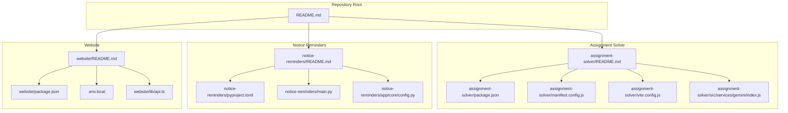
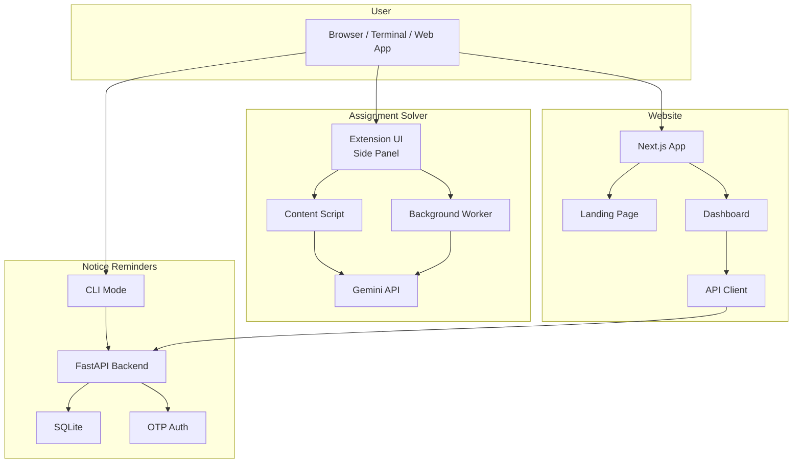
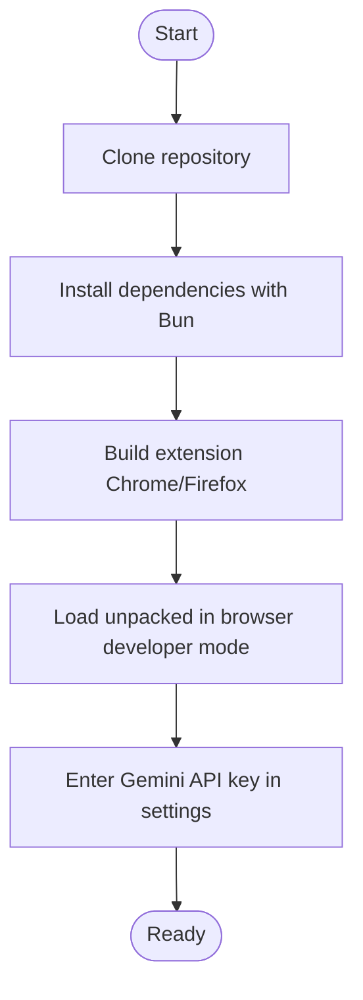
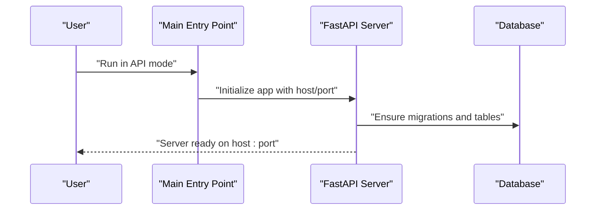
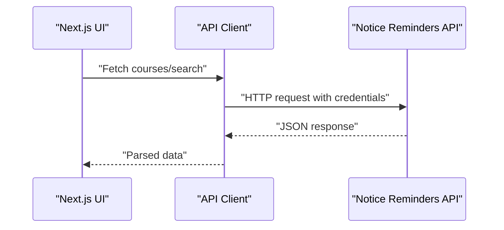
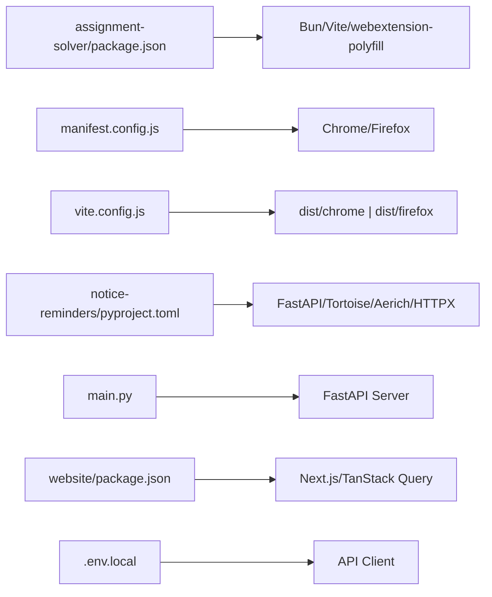

# Getting started

Install the Assignment Solver extension, run Notice Reminders as a CLI or FastAPI server, and point the Next.js site at that API. Each directory is its own project.

Clone:

```bash
git clone https://github.com/tashifkhan/MOOC-utils
cd MOOC-utils
```

## Project structure

Three independent packages:

- `assignment-solver/`: Chrome/Firefox extension. Gemini runs in the browser with your own API key.
- `notice-reminders/`: Python 3.12+ CLI plus FastAPI. SQLite by default.
- `website/`: Next.js App Router landing page and Notice Reminders dashboard.


```mermaid
graph TB
subgraph "Repository Root"
R["README.md"]
end
subgraph "Assignment Solver"
AS_README["assignment-solver/README.md"]
AS_PKG["assignment-solver/package.json"]
AS_MAN["assignment-solver/manifest.config.js"]
AS_VITE["assignment-solver/vite.config.js"]
AS_GEM["assignment-solver/src/services/gemini/index.js"]
end
subgraph "Notice Reminders"
NR_README["notice-reminders/README.md"]
NR_TOML["notice-reminders/pyproject.toml"]
NR_MAIN["notice-reminders/main.py"]
NR_CFG["notice-reminders/app/core/config.py"]
end
subgraph "Website"
WEB_README["website/README.md"]
WEB_PKG["website/package.json"]
WEB_ENV[".env.local"]
WEB_API["website/lib/api.ts"]
end
R --> AS_README
R --> NR_README
R --> WEB_README
AS_README --> AS_PKG
AS_README --> AS_MAN
AS_README --> AS_VITE
AS_README --> AS_GEM
NR_README --> NR_TOML
NR_README --> NR_MAIN
NR_README --> NR_CFG
WEB_README --> WEB_PKG
WEB_README --> WEB_ENV
WEB_README --> WEB_API
```

## Core components

- Assignment Solver: Vite 5 extension (`nptel-assignment-solver` 1.1.0). Chrome 116+ or Firefox 121+. The Gemini key lives in `browser.storage.local` and is sent only to Google.
- Notice Reminders: `uv sync`, then `uv run python main.py cli` or `uv run python main.py api`. Default DB is `sqlite://./data/db/db.sqlite3`.
- Website: Next.js 16.1.6, React 19.2.3, TanStack Query, Tailwind 4. Needs `NEXT_PUBLIC_API_URL` and a running API for login and the dashboard.

## Architecture overview

The extension never talks to Notice Reminders. The website does.


```mermaid
graph TB
subgraph "User"
U["Browser / Terminal / Web App"]
end
subgraph "Assignment Solver"
EXT["Extension UI<br/>Side Panel"]
BG["Background Worker"]
CS["Content Script"]
GEM["Gemini API"]
end
subgraph "Notice Reminders"
CLI["CLI Mode"]
API["FastAPI Backend"]
DB["SQLite"]
AUTH["OTP Auth"]
end
subgraph "Website"
LANDING["Landing Page"]
DASH["Dashboard"]
NEXT["Next.js App"]
CLIENT["API Client"]
end
U --> EXT
EXT --> BG
EXT --> CS
CS --> GEM
BG --> GEM
U --> CLI
CLI --> API
API --> DB
API --> AUTH
U --> NEXT
NEXT --> DASH
NEXT --> LANDING
DASH --> CLIENT
CLIENT --> API
```

## Assignment solver extension

Prerequisites: [Bun](https://bun.sh/), a Gemini key from [Google AI Studio](https://aistudio.google.com/apikey), Chrome 116+ or Firefox 121+.

```bash
cd assignment-solver
bun install
bun run build            # dist/chrome and dist/firefox
# bun run build:chrome
# bun run build:firefox
```

Watch mode: `bun run dev:chrome` or `bun run dev:firefox`.

Load it:

- Chrome: `chrome://extensions/` → Developer mode → Load unpacked → `dist/chrome/`
- Firefox: `about:debugging` → This Firefox → Load Temporary Add-on → a file in `dist/firefox/` (usually `manifest.json`)

Open the side panel, Settings, paste the Gemini key, Save Key. The key never hits MOOC Utils servers.

Then open an assignment page, extract questions, use Study Hints or Auto-Solve, and confirm before submit.


```mermaid
flowchart TD
Start(["Start"]) --> Clone["Clone repository"]
Clone --> InstallDeps["Install dependencies with Bun"]
InstallDeps --> Build["Build extension Chrome/Firefox"]
Build --> LoadDev["Load unpacked in browser developer mode"]
LoadDev --> Configure["Enter Gemini API key in settings"]
Configure --> Done(["Ready"])
```

Common failures:

- "Could not get page HTML": refresh, wait for the page to finish loading, extract again.
- "Question container not found": extract again and read the content-script console.
- "API Key invalid": check the key in AI Studio and strip spaces.
- Answers not applied: some platforms use custom inputs. Apply one answer at a time.

## Notice reminders CLI and API

Python 3.12+. Layout is `app/` (API, CLI, models, services), not `package/cli` or `package/api`.

```bash
cd notice-reminders
uv sync
uv run python main.py cli
uv run python main.py api --reload
uv run python main.py api --host 0.0.0.0 --port 8000
```

CLI searches Swayam and prints announcements. No database. API mode uses Tortoise/Aerich, JWT cookies, and email OTP (`otp_delivery` defaults to `console` so codes print in the server log until you set SMTP).

Set `jwt_secret` in `.env`. Optional: `database_url`, `cors_origins` (default `http://localhost:3000`), SMTP, Telegram.


```mermaid
sequenceDiagram
participant User as "User"
participant CLI as "Main Entry Point"
participant API as "FastAPI Server"
participant DB as "Database"
User->>CLI : "Run in API mode"
CLI->>API : "Initialize app with host/port"
API->>DB : "Ensure migrations and tables"
API-->>User : "Server ready on host : port"
```

Check:

- API answers on the host/port you passed (default `127.0.0.1:8000`).
- OTP login from the website sets cookies.
- Search and announcements return data.

Port in use: pass `--port`. SQLite path missing: create `data/db/` and confirm it is writable. No email: leave `otp_delivery=console`.

## Website dashboard

Bun. Repo guidelines forbid `npm run dev` and `bun dev`. Install, set the env, build.

```bash
cd website
bun install
```

`.env.local`:

```bash
NEXT_PUBLIC_API_URL="http://localhost:8000"
```

```bash
bun run build
bun run lint
```

Start the Notice Reminders API before you expect login, subscriptions, or the inbox to work. Public course search still hits that API.


```mermaid
sequenceDiagram
participant UI as "Next.js UI"
participant API as "API Client"
participant BE as "Notice Reminders API"
UI->>API : "Fetch courses/search"
API->>BE : "HTTP request with credentials"
BE-->>API : "JSON response"
API-->>UI : "Parsed data"
```

## Dependency analysis

- Assignment Solver: Bun, Vite 5.4, webextension-polyfill 0.12, fetch to Gemini.
- Notice Reminders: Python 3.12+, FastAPI, Tortoise ORM, Aerich, HTTPX, BeautifulSoup, PyJWT.
- Website: Next.js 16, React 19, TanStack Query 5, Tailwind 4. No Axios.


```mermaid
graph LR
AS_PKG["assignment-solver/package.json"] --> AS_DEPS["Bun/Vite/webextension-polyfill"]
AS_MAN["manifest.config.js"] --> AS_BROWSER["Chrome/Firefox"]
AS_VITE["vite.config.js"] --> AS_OUT["dist/chrome | dist/firefox"]
NR_TOML["notice-reminders/pyproject.toml"] --> NR_DEPS["FastAPI/Tortoise/Aerich/HTTPX"]
NR_MAIN["main.py"] --> NR_API["FastAPI Server"]
WEB_PKG["website/package.json"] --> WEB_DEPS["Next.js/TanStack Query"]
WEB_ENV[".env.local"] --> WEB_API["API Client"]
```

## Performance

- Assignment Solver: 500ms between Gemini answer calls, 200ms between DOM writes. Shrink the batch if you hit quota.
- Notice Reminders: `cache_ttl_minutes` defaults to 60. SQLite is the local default.
- Website: TanStack Query caches dashboard reads. Invalidate after subscription or inbox mutations.

## Troubleshooting

Assignment Solver: page HTML, missing containers, bad keys, custom widgets, Gemini rate limits.

Notice Reminders: `--port`, writable `data/db/db.sqlite3`, SMTP vs console OTP.

Website: API not running, `NEXT_PUBLIC_API_URL` wrong, `bun dev` used against repo rules.

## Conclusion

Key in the side panel, API on 8000, website pointed at that origin. CLI if you only want search.

## Appendices

### Quick start examples

- Course subscriptions: OTP login on the website, search, add a subscription, use the inbox.
- Extension: `bun run build`, load `dist/chrome` or `dist/firefox`, save a Gemini key, try a real assignment page.
- Website: `bun install`, `.env.local`, `bun run build`, API already up.
