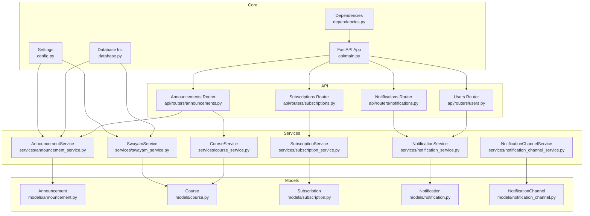
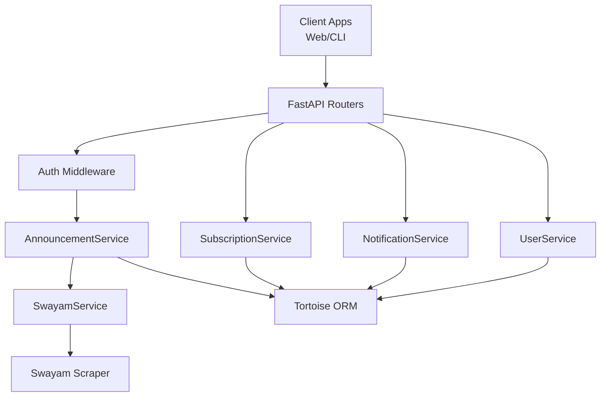
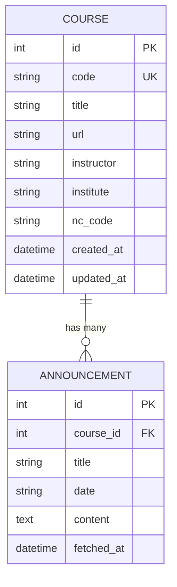
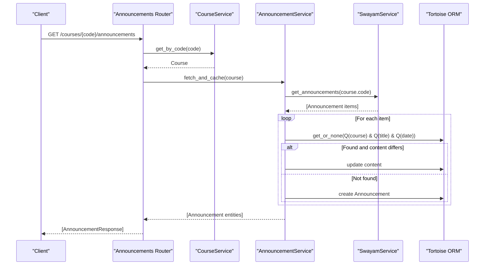
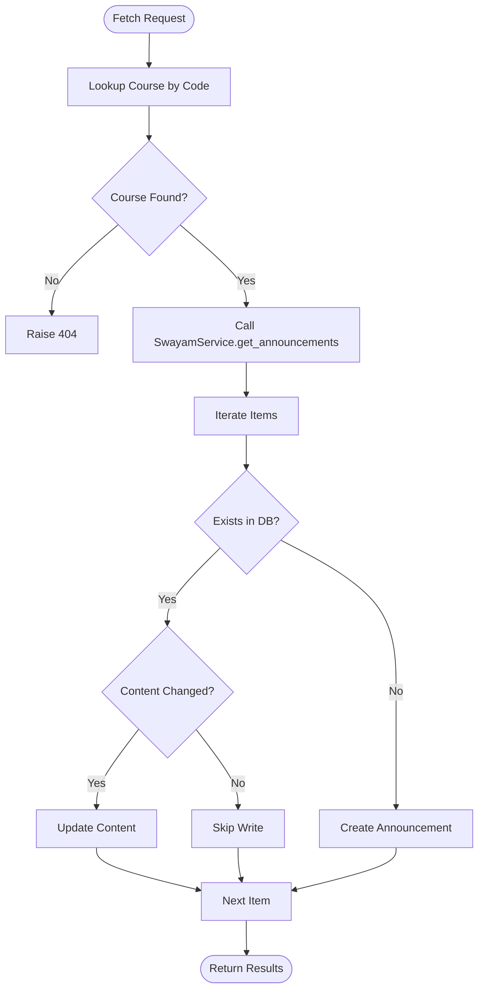
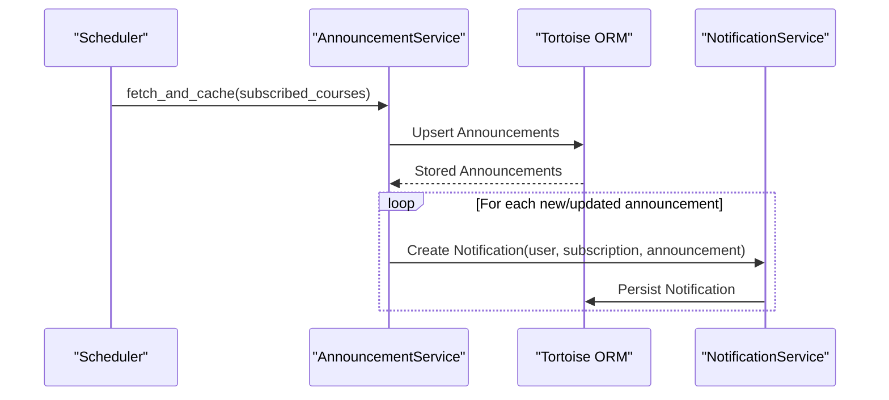
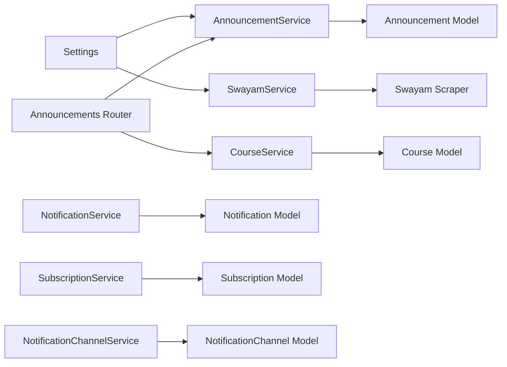

# Announcement Tracking

<cite>
**Referenced Files in This Document**
- [README.md](file://notice-reminders/README.md)
- [config.py](file://notice-reminders/app/core/config.py)
- [database.py](file://notice-reminders/app/core/database.py)
- [dependencies.py](file://notice-reminders/app/core/dependencies.py)
- [main.py](file://notice-reminders/app/api/main.py)
- [announcements.py](file://notice-reminders/app/api/routers/announcements.py)
- [users.py](file://notice-reminders/app/api/routers/users.py)
- [subscriptions.py](file://notice-reminders/app/api/routers/subscriptions.py)
- [notifications.py](file://notice-reminders/app/api/routers/notifications.py)
- [announcement_service.py](file://notice-reminders/app/services/announcement_service.py)
- [swayam_service.py](file://notice-reminders/app/services/swayam_service.py)
- [course_service.py](file://notice-reminders/app/services/course_service.py)
- [notification_service.py](file://notice-reminders/app/services/notification_service.py)
- [notification_channel_service.py](file://notice-reminders/app/services/notification_channel_service.py)
- [subscription_service.py](file://notice-reminders/app/services/subscription_service.py)
- [announcement.py](file://notice-reminders/app/models/announcement.py)
- [course.py](file://notice-reminders/app/models/course.py)
- [subscription.py](file://notice-reminders/app/models/subscription.py)
- [notification.py](file://notice-reminders/app/models/notification.py)
- [notification_channel.py](file://notice-reminders/app/models/notification_channel.py)
- [announcement.py](file://notice-reminders/app/schemas/announcement.py)
- [user.py](file://notice-reminders/app/schemas/user.py)
- [subscription.py](file://notice-reminders/app/schemas/subscription.py)
- [notification.py](file://notice-reminders/app/schemas/notification.py)
</cite>

## Table of Contents
1. [Introduction](#introduction)
2. [Project Structure](#project-structure)
3. [Core Components](#core-components)
4. [Architecture Overview](#architecture-overview)
5. [Detailed Component Analysis](#detailed-component-analysis)
6. [Dependency Analysis](#dependency-analysis)
7. [Performance Considerations](#performance-considerations)
8. [Troubleshooting Guide](#troubleshooting-guide)
9. [Conclusion](#conclusion)
10. [Appendices](#appendices)

## Introduction
This document explains the announcement tracking system that monitors course announcements from Swayam, parses and caches them, and prepares the foundation for real-time alerts. It covers the automated monitoring pipeline, parsing mechanisms, scheduling and caching strategies, notification triggering logic, and the data model. It also documents the API endpoints for querying announcements, managing subscriptions, and retrieving notification history.

The system currently supports:
- Course search and announcement retrieval via Swayam
- Announcement caching with deduplication and content updates
- User subscription management
- Notification history tracking
- REST API for authenticated users

Planned enhancements include integrating Telegram and Email channels for real-time alerts.

**Section sources**
- [README.md](file://notice-reminders/README.md#L1-L56)

## Project Structure
The announcement tracking system resides in the notice-reminders package under app/. The structure separates concerns into:
- Core: configuration, database initialization, and dependency injection
- Services: business logic for announcements, courses, subscriptions, and notifications
- Models: Tortoise ORM entities for persistence
- Schemas: Pydantic models for API serialization
- API Routers: FastAPI endpoints for announcements, subscriptions, notifications, and users
- Scrapers: Integration with Swayam scraping utilities



**Diagram sources**
- [config.py](file://notice-reminders/app/core/config.py#L1-L32)
- [database.py](file://notice-reminders/app/core/database.py)
- [dependencies.py](file://notice-reminders/app/core/dependencies.py)
- [main.py](file://notice-reminders/app/api/main.py)
- [announcements.py](file://notice-reminders/app/api/routers/announcements.py#L1-L33)
- [users.py](file://notice-reminders/app/api/routers/users.py)
- [subscriptions.py](file://notice-reminders/app/api/routers/subscriptions.py)
- [notifications.py](file://notice-reminders/app/api/routers/notifications.py)
- [announcement_service.py](file://notice-reminders/app/services/announcement_service.py#L1-L45)
- [swayam_service.py](file://notice-reminders/app/services/swayam_service.py#L1-L25)
- [course_service.py](file://notice-reminders/app/services/course_service.py)
- [notification_service.py](file://notice-reminders/app/services/notification_service.py)
- [notification_channel_service.py](file://notice-reminders/app/services/notification_channel_service.py)
- [subscription_service.py](file://notice-reminders/app/services/subscription_service.py)
- [announcement.py](file://notice-reminders/app/models/announcement.py#L1-L25)
- [course.py](file://notice-reminders/app/models/course.py#L1-L22)
- [subscription.py](file://notice-reminders/app/models/subscription.py#L1-L28)
- [notification.py](file://notice-reminders/app/models/notification.py#L1-L37)
- [notification_channel.py](file://notice-reminders/app/models/notification_channel.py#L1-L26)

**Section sources**
- [README.md](file://notice-reminders/README.md#L1-L56)

## Core Components
- AnnouncementService: Orchestrates fetching announcements from SwayamService, deduplicating by course/title/date, updating content if changed, and storing via Tortoise ORM.
- SwayamService: Wraps the Swayam scraping integration and exposes asynchronous methods to search courses and fetch announcements.
- CourseService: Manages course metadata and retrieval by code.
- NotificationService: Tracks notification events linked to users, subscriptions, and announcements; supports listing notification history.
- SubscriptionService: Manages user-course subscriptions with activation controls.
- NotificationChannelService: Manages user notification channels (e.g., Telegram, Email) for future alert delivery.
- Models: Define the relational schema for announcements, courses, subscriptions, notifications, and notification channels.
- Schemas: Define API response models for announcements and other entities.

Key responsibilities:
- Automated monitoring: AnnouncementService periodically triggers SwayamService to fetch announcements for subscribed courses.
- Parsing and caching: Deduplication and content update logic prevent redundant writes and keep cached content fresh.
- Real-time alert readiness: NotificationService and NotificationChannelService provide the foundation for dispatching alerts when new announcements are detected.

**Section sources**
- [announcement_service.py](file://notice-reminders/app/services/announcement_service.py#L1-L45)
- [swayam_service.py](file://notice-reminders/app/services/swayam_service.py#L1-L25)
- [course_service.py](file://notice-reminders/app/services/course_service.py)
- [notification_service.py](file://notice-reminders/app/services/notification_service.py)
- [subscription_service.py](file://notice-reminders/app/services/subscription_service.py)
- [notification_channel_service.py](file://notice-reminders/app/services/notification_channel_service.py)
- [announcement.py](file://notice-reminders/app/models/announcement.py#L1-L25)
- [course.py](file://notice-reminders/app/models/course.py#L1-L22)
- [subscription.py](file://notice-reminders/app/models/subscription.py#L1-L28)
- [notification.py](file://notice-reminders/app/models/notification.py#L1-L37)
- [notification_channel.py](file://notice-reminders/app/models/notification_channel.py#L1-L26)

## Architecture Overview
The system follows a layered architecture:
- Presentation Layer: FastAPI routers expose endpoints for announcements, subscriptions, notifications, and users.
- Application Layer: Services encapsulate business logic for announcements, courses, subscriptions, and notifications.
- Persistence Layer: Tortoise ORM models define the schema and relationships.
- Integration Layer: SwayamService integrates with scraping utilities to fetch course announcements.



**Diagram sources**
- [announcements.py](file://notice-reminders/app/api/routers/announcements.py#L1-L33)
- [users.py](file://notice-reminders/app/api/routers/users.py)
- [subscriptions.py](file://notice-reminders/app/api/routers/subscriptions.py)
- [notifications.py](file://notice-reminders/app/api/routers/notifications.py)
- [announcement_service.py](file://notice-reminders/app/services/announcement_service.py#L1-L45)
- [swayam_service.py](file://notice-reminders/app/services/swayam_service.py#L1-L25)
- [config.py](file://notice-reminders/app/core/config.py#L1-L32)

## Detailed Component Analysis

### Announcement Data Model
The Announcement entity stores parsed course announcements with a foreign key to Course. It includes fields for title, date, content, and timestamps for caching and sorting.



**Diagram sources**
- [course.py](file://notice-reminders/app/models/course.py#L1-L22)
- [announcement.py](file://notice-reminders/app/models/announcement.py#L1-L25)

**Section sources**
- [announcement.py](file://notice-reminders/app/models/announcement.py#L1-L25)
- [course.py](file://notice-reminders/app/models/course.py#L1-L22)

### Announcement Parsing and Caching Workflow
The AnnouncementService fetches announcements from SwayamService, deduplicates by course, title, and date, and updates content if changed. It ensures efficient caching and avoids redundant database writes.



**Diagram sources**
- [announcements.py](file://notice-reminders/app/api/routers/announcements.py#L1-L33)
- [announcement_service.py](file://notice-reminders/app/services/announcement_service.py#L1-L45)
- [swayam_service.py](file://notice-reminders/app/services/swayam_service.py#L1-L25)
- [announcement.py](file://notice-reminders/app/models/announcement.py#L1-L25)

**Section sources**
- [announcement_service.py](file://notice-reminders/app/services/announcement_service.py#L17-L41)

### Notification History and Triggering Logic
Notifications link users, subscriptions, and announcements. The Notification entity optionally links to a NotificationChannel for delivery. The NotificationService provides listing of notification history for a user or subscription.

```mermaid
erDiagram
USER {
int id PK
string email UK
string name
datetime created_at
}
SUBSCRIPTION {
int id PK
int user_id FK
int course_id FK
datetime created_at
boolean is_active
}
ANNOUNCEMENT {
int id PK
int course_id FK
string title
string date
text content
datetime fetched_at
}
NOTIFICATION_CHANNEL {
int id PK
int user_id FK
string channel
string address
boolean is_active
datetime created_at
}
NOTIFICATION {
int id PK
int user_id FK
int subscription_id FK
int announcement_id FK
int? channel_id FK
datetime sent_at
boolean is_read
}
USER ||--o{ SUBSCRIPTION : "has many"
COURSE ||--o{ SUBSCRIPTION : "has many"
COURSE ||--o{ ANNOUNCEMENT : "has many"
USER ||--o{ NOTIFICATION : "has many"
SUBSCRIPTION ||--o{ NOTIFICATION : "has many"
ANNOUNCEMENT ||--o{ NOTIFICATION : "has many"
USER ||--o{ NOTIFICATION_CHANNEL : "has many"
NOTIFICATION_CHANNEL ||--o{ NOTIFICATION : "has many"
```

**Diagram sources**
- [notification.py](file://notice-reminders/app/models/notification.py#L1-L37)
- [notification_channel.py](file://notice-reminders/app/models/notification_channel.py#L1-L26)
- [subscription.py](file://notice-reminders/app/models/subscription.py#L1-L28)
- [announcement.py](file://notice-reminders/app/models/announcement.py#L1-L25)
- [course.py](file://notice-reminders/app/models/course.py#L1-L22)
- [user.py](file://notice-reminders/app/models/user.py)

**Section sources**
- [notification.py](file://notice-reminders/app/models/notification.py#L1-L37)
- [notification_channel.py](file://notice-reminders/app/models/notification_channel.py#L1-L26)
- [subscription.py](file://notice-reminders/app/models/subscription.py#L1-L28)

### API Endpoints for Announcements, Subscriptions, and Notifications
- GET /courses/{course_code}/announcements
  - Purpose: Retrieve and cache announcements for a course
  - Authentication: Required
  - Response: List of AnnouncementResponse
  - Implementation: [announcements.py](file://notice-reminders/app/api/routers/announcements.py#L15-L32)

- GET /users/{user_id}/subscriptions
  - Purpose: List a user’s course subscriptions
  - Authentication: Required
  - Response: List of SubscriptionResponse
  - Implementation: [subscriptions.py](file://notice-reminders/app/api/routers/subscriptions.py)

- GET /users/{user_id}/notifications
  - Purpose: List notification history for a user
  - Authentication: Required
  - Response: List of NotificationResponse
  - Implementation: [notifications.py](file://notice-reminders/app/api/routers/notifications.py)

- GET /users/me
  - Purpose: Get current user profile
  - Authentication: Required
  - Response: UserResponse
  - Implementation: [users.py](file://notice-reminders/app/api/routers/users.py)

Note: The endpoints above reflect the current API surface. Additional endpoints for managing subscriptions and notifications are defined in their respective routers.

**Section sources**
- [announcements.py](file://notice-reminders/app/api/routers/announcements.py#L1-L33)
- [users.py](file://notice-reminders/app/api/routers/users.py)
- [subscriptions.py](file://notice-reminders/app/api/routers/subscriptions.py)
- [notifications.py](file://notice-reminders/app/api/routers/notifications.py)

### Scheduling and Caching Strategies
- Cache TTL: Controlled by Settings.cache_ttl_minutes, which determines how frequently announcements are refreshed.
- Deduplication: AnnouncementService uses course, title, and date to detect duplicates and updates content if changed.
- Sorting: Announcements are ordered by fetched_at to show most recent entries first.



**Diagram sources**
- [announcement_service.py](file://notice-reminders/app/services/announcement_service.py#L17-L41)
- [config.py](file://notice-reminders/app/core/config.py#L12-L12)

**Section sources**
- [announcement_service.py](file://notice-reminders/app/services/announcement_service.py#L17-L41)
- [config.py](file://notice-reminders/app/core/config.py#L12-L12)

### Notification Triggering Logic
- Trigger condition: New announcements detected during fetch_and_cache for subscribed courses.
- Storage: Notification records are created linking user, subscription, and announcement.
- Delivery: NotificationChannelService manages channels; future work will integrate Telegram and Email dispatch.



**Diagram sources**
- [announcement_service.py](file://notice-reminders/app/services/announcement_service.py#L17-L41)
- [notification_service.py](file://notice-reminders/app/services/notification_service.py)
- [notification.py](file://notice-reminders/app/models/notification.py#L1-L37)

**Section sources**
- [announcement_service.py](file://notice-reminders/app/services/announcement_service.py#L17-L41)
- [notification_service.py](file://notice-reminders/app/services/notification_service.py)
- [notification.py](file://notice-reminders/app/models/notification.py#L1-L37)

## Dependency Analysis
The system exhibits clear separation of concerns:
- AnnouncementService depends on Settings and SwayamService
- SwayamService depends on Settings and the Swayam scraper
- API routers depend on services via dependency injection
- Models define relationships and are consumed by services and routers



**Diagram sources**
- [config.py](file://notice-reminders/app/core/config.py#L1-L32)
- [announcement_service.py](file://notice-reminders/app/services/announcement_service.py#L1-L16)
- [swayam_service.py](file://notice-reminders/app/services/swayam_service.py#L1-L16)
- [announcements.py](file://notice-reminders/app/api/routers/announcements.py#L1-L12)

**Section sources**
- [config.py](file://notice-reminders/app/core/config.py#L1-L32)
- [dependencies.py](file://notice-reminders/app/core/dependencies.py)
- [main.py](file://notice-reminders/app/api/main.py)

## Performance Considerations
- Database efficiency: Use of get_or_none with composite filters minimizes unnecessary writes and leverages database indexing on course, title, and date.
- Caching: Cache TTL controls frequency of external scraping; tune Settings.cache_ttl_minutes to balance freshness and cost.
- Pagination: For large datasets, consider adding pagination to announcement listing endpoints.
- Asynchronous I/O: SwayamService and AnnouncementService use async patterns to improve throughput.

[No sources needed since this section provides general guidance]

## Troubleshooting Guide
Common issues and resolutions:
- Course not found: The announcements endpoint raises a 404 if the course code does not exist. Verify the course code and ensure it exists in the Course model.
- Empty or stale announcements: Confirm that SwayamService scraping is functioning and that cache_ttl_minutes is set appropriately.
- Authentication errors: Ensure requests include proper authentication as required by require_auth decorators on API endpoints.
- Database connectivity: Verify database URL in Settings.database_url and that migrations have been applied.

**Section sources**
- [announcements.py](file://notice-reminders/app/api/routers/announcements.py#L25-L29)
- [config.py](file://notice-reminders/app/core/config.py#L7-L7)

## Conclusion
The announcement tracking system provides a robust foundation for monitoring course announcements from Swayam, caching parsed content efficiently, and preparing the infrastructure for real-time alerts. The modular design with clear separation of concerns enables easy extension for additional notification channels and improved scheduling strategies.

[No sources needed since this section summarizes without analyzing specific files]

## Appendices

### API Definitions
- GET /courses/{course_code}/announcements
  - Description: Returns cached announcements for a course after refreshing from Swayam
  - Authentication: Required
  - Response: List of AnnouncementResponse

- GET /users/{user_id}/subscriptions
  - Description: Lists a user’s course subscriptions
  - Authentication: Required
  - Response: List of SubscriptionResponse

- GET /users/{user_id}/notifications
  - Description: Lists notification history for a user
  - Authentication: Required
  - Response: List of NotificationResponse

- GET /users/me
  - Description: Returns the current authenticated user
  - Authentication: Required
  - Response: UserResponse

**Section sources**
- [announcements.py](file://notice-reminders/app/api/routers/announcements.py#L15-L32)
- [users.py](file://notice-reminders/app/api/routers/users.py)
- [subscriptions.py](file://notice-reminders/app/api/routers/subscriptions.py)
- [notifications.py](file://notice-reminders/app/api/routers/notifications.py)