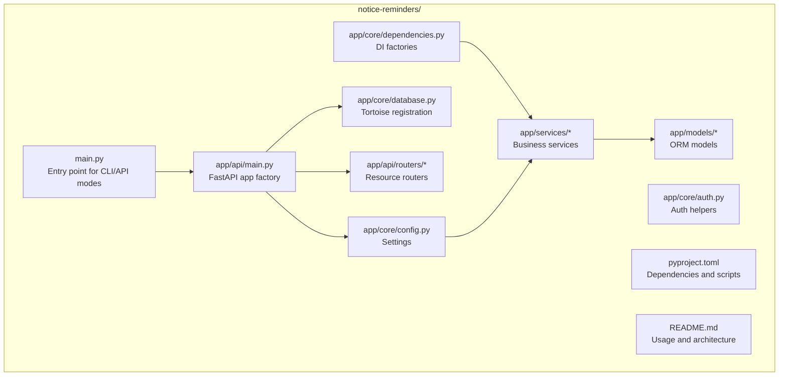
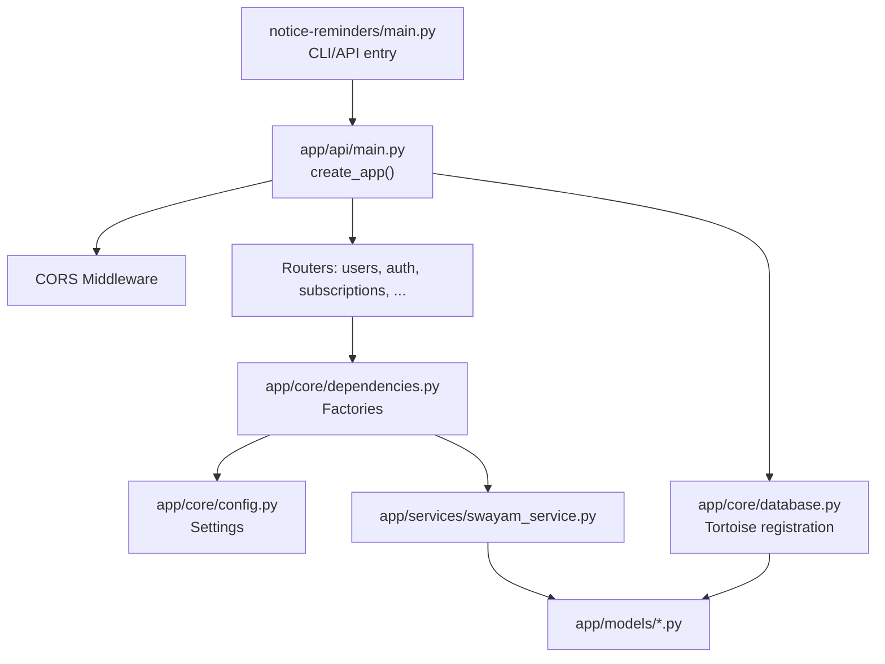
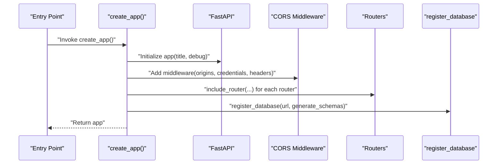
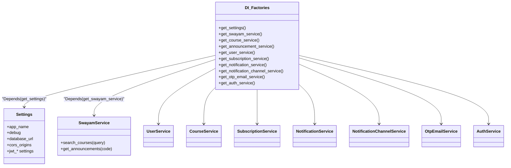
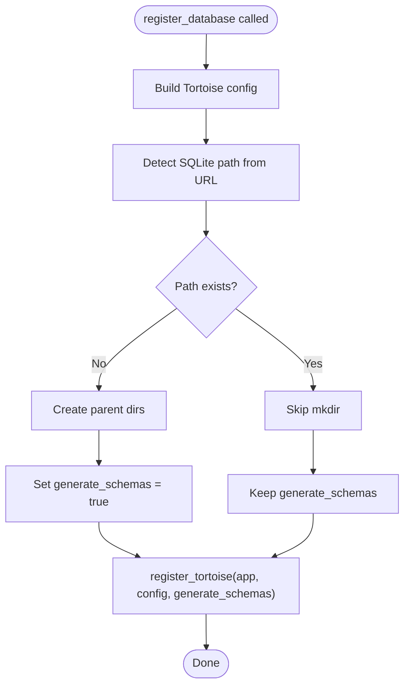
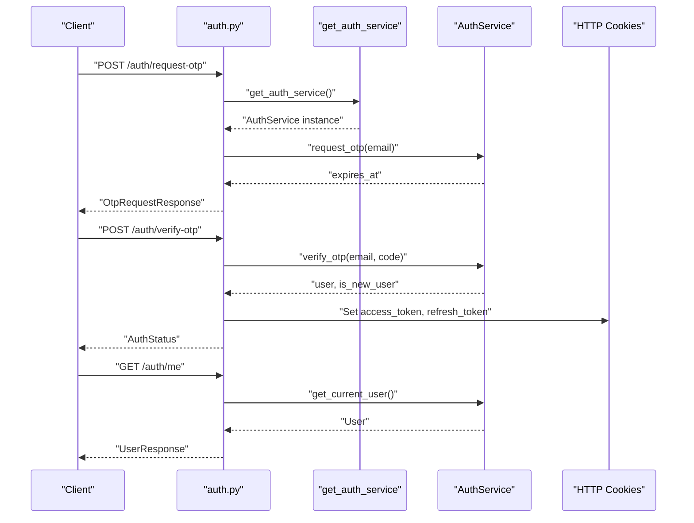
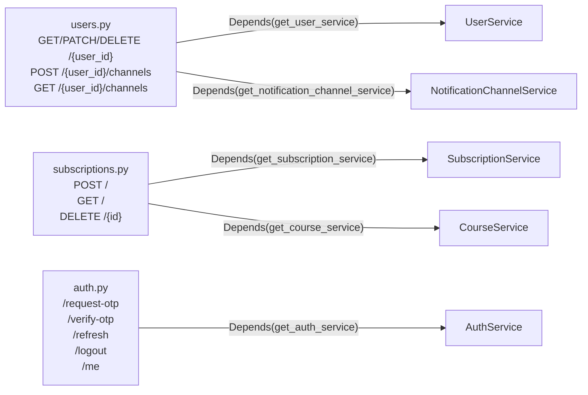
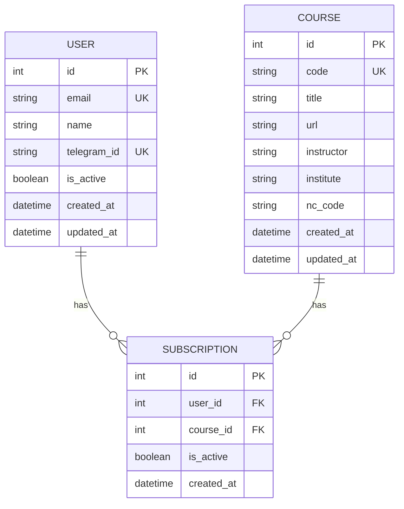
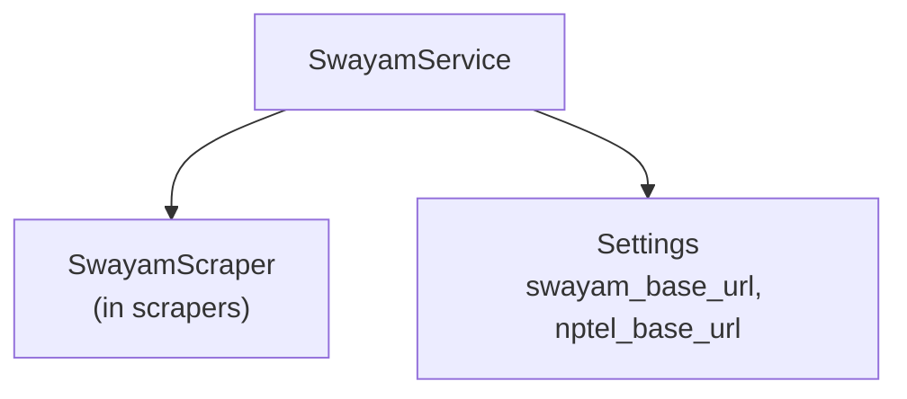
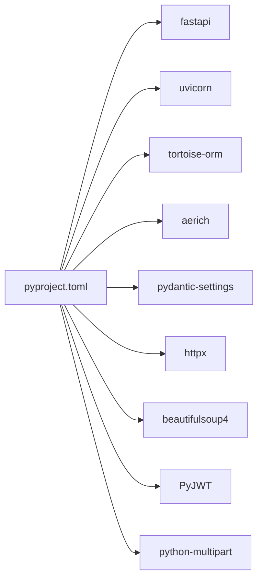

# Architecture Overview

<cite>
**Referenced Files in This Document**
- [notice-reminders/main.py](file://notice-reminders/main.py)
- [notice-reminders/app/api/main.py](file://notice-reminders/app/api/main.py)
- [notice-reminders/pyproject.toml](file://notice-reminders/pyproject.toml)
- [notice-reminders/README.md](file://notice-reminders/README.md)
- [notice-reminders/app/core/config.py](file://notice-reminders/app/core/config.py)
- [notice-reminders/app/core/database.py](file://notice-reminders/app/core/database.py)
- [notice-reminders/app/core/dependencies.py](file://notice-reminders/app/core/dependencies.py)
- [notice-reminders/app/core/auth.py](file://notice-reminders/app/core/auth.py)
- [notice-reminders/app/api/routers/users.py](file://notice-reminders/app/api/routers/users.py)
- [notice-reminders/app/api/routers/auth.py](file://notice-reminders/app/api/routers/auth.py)
- [notice-reminders/app/api/routers/subscriptions.py](file://notice-reminders/app/api/routers/subscriptions.py)
- [notice-reminders/app/services/swayam_service.py](file://notice-reminders/app/services/swayam_service.py)
- [notice-reminders/app/models/user.py](file://notice-reminders/app/models/user.py)
- [notice-reminders/app/models/course.py](file://notice-reminders/app/models/course.py)
- [notice-reminders/app/models/subscription.py](file://notice-reminders/app/models/subscription.py)
</cite>

## Table of Contents
1. [Introduction](#introduction)
2. [Project Structure](#project-structure)
3. [Core Components](#core-components)
4. [Architecture Overview](#architecture-overview)
5. [Detailed Component Analysis](#detailed-component-analysis)
6. [Dependency Analysis](#dependency-analysis)
7. [Performance Considerations](#performance-considerations)
8. [Troubleshooting Guide](#troubleshooting-guide)
9. [Conclusion](#conclusion)
10. [Appendices](#appendices)

## Introduction
This document presents a comprehensive architecture overview of the Notice Reminders API system. It explains the FastAPI application structure, middleware configuration (including CORS), routing architecture, dependency injection pattern, database registration process, and the application factory pattern. It also covers system design, component relationships, data flow patterns, infrastructure requirements, deployment considerations, and scalability aspects. Finally, it illustrates system context diagrams showing how the API integrates with external services like Swayam and NPTEL platforms.

## Project Structure
The Notice Reminders project is organized as a FastAPI application under the notice-reminders package. The structure separates concerns into:
- Application entry points for CLI and API modes
- Core configuration, database registration, and dependency injection
- API routers grouped by domain resources
- Services for scraping and business logic
- Data models managed via Tortoise ORM
- Pydantic settings for environment-driven configuration

**Diagram sources**
- [notice-reminders/main.py](file://notice-reminders/main.py#L1-L71)
- [notice-reminders/app/api/main.py](file://notice-reminders/app/api/main.py#L1-L46)
- [notice-reminders/app/core/config.py](file://notice-reminders/app/core/config.py#L1-L32)
- [notice-reminders/app/core/database.py](file://notice-reminders/app/core/database.py#L1-L54)
- [notice-reminders/app/core/dependencies.py](file://notice-reminders/app/core/dependencies.py#L1-L75)
- [notice-reminders/app/core/auth.py](file://notice-reminders/app/core/auth.py#L1-L72)
- [notice-reminders/app/api/routers/users.py](file://notice-reminders/app/api/routers/users.py#L1-L151)
- [notice-reminders/app/services/swayam_service.py](file://notice-reminders/app/services/swayam_service.py#L1-L25)
- [notice-reminders/app/models/user.py](file://notice-reminders/app/models/user.py#L1-L20)
- [notice-reminders/pyproject.toml](file://notice-reminders/pyproject.toml#L1-L41)
- [notice-reminders/README.md](file://notice-reminders/README.md#L1-L56)

**Section sources**
- [notice-reminders/README.md](file://notice-reminders/README.md#L1-L56)
- [notice-reminders/pyproject.toml](file://notice-reminders/pyproject.toml#L1-L41)

## Core Components
- Application Factory: The FastAPI application is created via a factory function that configures middleware, registers routers, and initializes the database.
- Middleware: CORS is configured using environment-driven origins.
- Dependency Injection: LRU-cached factories supply services and settings to route handlers.
- Database Registration: Tortoise ORM is registered with configurable schema generation and SQLite path provisioning.
- Authentication: Cookie-based JWT tokens with helpers for current user resolution and decorator-based enforcement.

Key implementation references:
- Application factory and router registration: [notice-reminders/app/api/main.py](file://notice-reminders/app/api/main.py#L17-L46)
- CORS configuration: [notice-reminders/app/api/main.py](file://notice-reminders/app/api/main.py#L21-L27)
- Settings and environment loading: [notice-reminders/app/core/config.py](file://notice-reminders/app/core/config.py#L4-L32)
- DI factories: [notice-reminders/app/core/dependencies.py](file://notice-reminders/app/core/dependencies.py#L17-L75)
- Database registration: [notice-reminders/app/core/database.py](file://notice-reminders/app/core/database.py#L39-L54)
- Auth helpers: [notice-reminders/app/core/auth.py](file://notice-reminders/app/core/auth.py#L14-L72)

**Section sources**
- [notice-reminders/app/api/main.py](file://notice-reminders/app/api/main.py#L17-L46)
- [notice-reminders/app/core/config.py](file://notice-reminders/app/core/config.py#L4-L32)
- [notice-reminders/app/core/dependencies.py](file://notice-reminders/app/core/dependencies.py#L17-L75)
- [notice-reminders/app/core/database.py](file://notice-reminders/app/core/database.py#L39-L54)
- [notice-reminders/app/core/auth.py](file://notice-reminders/app/core/auth.py#L14-L72)

## Architecture Overview
The system follows a layered architecture:
- Entry Point: A unified CLI/API entry chooses between modes.
- Web Layer: FastAPI app factory configures middleware and routes.
- Domain Services: Business logic for authentication, subscriptions, courses, and scraping.
- Persistence: Tortoise ORM models and migrations.
- External Integrations: Scraping Swayam and future NPTEL integrations.

**Diagram sources**
- [notice-reminders/main.py](file://notice-reminders/main.py#L8-L66)
- [notice-reminders/app/api/main.py](file://notice-reminders/app/api/main.py#L17-L46)
- [notice-reminders/app/core/dependencies.py](file://notice-reminders/app/core/dependencies.py#L17-L75)
- [notice-reminders/app/core/config.py](file://notice-reminders/app/core/config.py#L4-L32)
- [notice-reminders/app/core/database.py](file://notice-reminders/app/core/database.py#L39-L54)
- [notice-reminders/app/services/swayam_service.py](file://notice-reminders/app/services/swayam_service.py#L10-L25)
- [notice-reminders/app/models/user.py](file://notice-reminders/app/models/user.py#L7-L20)
- [notice-reminders/app/models/course.py](file://notice-reminders/app/models/course.py#L7-L22)
- [notice-reminders/app/models/subscription.py](file://notice-reminders/app/models/subscription.py#L12-L28)

## Detailed Component Analysis

### Application Factory Pattern and Routing
- The application factory constructs a FastAPI app, sets title and debug flags from settings, registers CORS middleware, includes all resource routers, and registers the database.
- Routers are grouped by domain: users, auth, subscriptions, courses, announcements, notifications, and search.

**Diagram sources**
- [notice-reminders/app/api/main.py](file://notice-reminders/app/api/main.py#L17-L46)

**Section sources**
- [notice-reminders/app/api/main.py](file://notice-reminders/app/api/main.py#L17-L46)

### Middleware Configuration (CORS)
- CORS is configured using environment-driven origins from settings, allowing credentials and all methods/headers.

Implementation references:
- Middleware registration: [notice-reminders/app/api/main.py](file://notice-reminders/app/api/main.py#L21-L27)
- Origins from settings: [notice-reminders/app/core/config.py](file://notice-reminders/app/core/config.py#L20)

**Section sources**
- [notice-reminders/app/api/main.py](file://notice-reminders/app/api/main.py#L21-L27)
- [notice-reminders/app/core/config.py](file://notice-reminders/app/core/config.py#L20)

### Dependency Injection Pattern
- Factories decorated with caching supply services and settings to route handlers.
- Typical chain: route handler -> service -> external client (e.g., SwayamService).

**Diagram sources**
- [notice-reminders/app/core/dependencies.py](file://notice-reminders/app/core/dependencies.py#L17-L75)
- [notice-reminders/app/core/config.py](file://notice-reminders/app/core/config.py#L4-L32)
- [notice-reminders/app/services/swayam_service.py](file://notice-reminders/app/services/swayam_service.py#L10-L25)

**Section sources**
- [notice-reminders/app/core/dependencies.py](file://notice-reminders/app/core/dependencies.py#L17-L75)

### Database Registration Process
- Tortoise configuration defines connections and apps mapping models from the models package.
- SQLite path provisioning ensures directories exist before schema generation.
- Schema generation is controlled by debug flag and SQLite path existence.

**Diagram sources**
- [notice-reminders/app/core/database.py](file://notice-reminders/app/core/database.py#L39-L54)

**Section sources**
- [notice-reminders/app/core/database.py](file://notice-reminders/app/core/database.py#L39-L54)

### Authentication and Authorization
- Token verification resolves current user from cookies.
- Decorator enforces authentication and injects current_user into route handlers.
- Auth endpoints manage OTP requests, verification, token refresh, and logout.

**Diagram sources**
- [notice-reminders/app/api/routers/auth.py](file://notice-reminders/app/api/routers/auth.py#L43-L126)
- [notice-reminders/app/core/auth.py](file://notice-reminders/app/core/auth.py#L14-L72)
- [notice-reminders/app/core/dependencies.py](file://notice-reminders/app/core/dependencies.py#L70-L75)

**Section sources**
- [notice-reminders/app/api/routers/auth.py](file://notice-reminders/app/api/routers/auth.py#L43-L126)
- [notice-reminders/app/core/auth.py](file://notice-reminders/app/core/auth.py#L14-L72)

### Routing Architecture
- Users: CRUD and notification channel management with per-user authorization checks.
- Subscriptions: Create/list/delete subscriptions linked to courses.
- Auth: OTP lifecycle, token refresh, logout, and profile retrieval.

**Diagram sources**
- [notice-reminders/app/api/routers/users.py](file://notice-reminders/app/api/routers/users.py#L17-L151)
- [notice-reminders/app/api/routers/subscriptions.py](file://notice-reminders/app/api/routers/subscriptions.py#L16-L71)
- [notice-reminders/app/api/routers/auth.py](file://notice-reminders/app/api/routers/auth.py#L43-L126)
- [notice-reminders/app/core/dependencies.py](file://notice-reminders/app/core/dependencies.py#L48-L75)

**Section sources**
- [notice-reminders/app/api/routers/users.py](file://notice-reminders/app/api/routers/users.py#L17-L151)
- [notice-reminders/app/api/routers/subscriptions.py](file://notice-reminders/app/api/routers/subscriptions.py#L16-L71)
- [notice-reminders/app/api/routers/auth.py](file://notice-reminders/app/api/routers/auth.py#L43-L126)

### Data Models and Relationships
- User, Course, and Subscription define primary entities and relationships.
- Unique constraints prevent duplicate subscriptions per user-course pair.

**Diagram sources**
- [notice-reminders/app/models/user.py](file://notice-reminders/app/models/user.py#L7-L20)
- [notice-reminders/app/models/course.py](file://notice-reminders/app/models/course.py#L7-L22)
- [notice-reminders/app/models/subscription.py](file://notice-reminders/app/models/subscription.py#L12-L28)

**Section sources**
- [notice-reminders/app/models/user.py](file://notice-reminders/app/models/user.py#L7-L20)
- [notice-reminders/app/models/course.py](file://notice-reminders/app/models/course.py#L7-L22)
- [notice-reminders/app/models/subscription.py](file://notice-reminders/app/models/subscription.py#L12-L28)

### External Service Integration (Swayam and NPTEL)
- SwayamService encapsulates scraping operations for course search and announcements.
- NPTEL base URL is configured for potential future integration.

**Diagram sources**
- [notice-reminders/app/services/swayam_service.py](file://notice-reminders/app/services/swayam_service.py#L10-L25)
- [notice-reminders/app/core/config.py](file://notice-reminders/app/core/config.py#L9-L10)

**Section sources**
- [notice-reminders/app/services/swayam_service.py](file://notice-reminders/app/services/swayam_service.py#L10-L25)
- [notice-reminders/app/core/config.py](file://notice-reminders/app/core/config.py#L9-L10)

## Dependency Analysis
- External libraries include FastAPI, Uvicorn, Tortoise ORM, Aerich, Pydantic Settings, httpx, beautifulsoup4, PyJWT, and multipart parsing.
- The API entry point exposes a console script for unified CLI/API invocation.

**Diagram sources**
- [notice-reminders/pyproject.toml](file://notice-reminders/pyproject.toml#L7-L19)

**Section sources**
- [notice-reminders/pyproject.toml](file://notice-reminders/pyproject.toml#L1-L41)

## Performance Considerations
- Caching: LRU caches for settings and services reduce repeated instantiation overhead.
- Database: SQLite is suitable for small-scale usage; consider PostgreSQL for production scale.
- CORS: Allow only necessary origins to minimize preflight overhead.
- Token TTL: Short-lived access tokens with refresh tokens improve security and reduce long-lived credential exposure.
- Scraping: Introduce rate limiting and caching for Swayam/NPTEL endpoints to avoid overloading external services.

[No sources needed since this section provides general guidance]

## Troubleshooting Guide
- CORS errors: Verify allowed origins in settings match frontend origin.
- Database initialization: Ensure SQLite path exists or enable schema generation in debug mode.
- Authentication failures: Confirm cookie presence and token validity; check token expiry and signing secret.
- Route access denied: Ensure current user matches resource ownership and permissions.

**Section sources**
- [notice-reminders/app/api/main.py](file://notice-reminders/app/api/main.py#L21-L27)
- [notice-reminders/app/core/database.py](file://notice-reminders/app/core/database.py#L39-L54)
- [notice-reminders/app/core/auth.py](file://notice-reminders/app/core/auth.py#L14-L72)
- [notice-reminders/app/api/routers/users.py](file://notice-reminders/app/api/routers/users.py#L24-L28)

## Conclusion
The Notice Reminders API employs a clean, modular architecture leveraging FastAPI, Tortoise ORM, and a robust dependency injection pattern. The application factory centralizes configuration, while routers encapsulate domain logic. Authentication relies on JWT cookies, and CORS is configurable via environment settings. The design supports extensibility for NPTEL and improved scraping strategies, with clear separation between web, service, persistence, and external integration layers.

[No sources needed since this section summarizes without analyzing specific files]

## Appendices

### Deployment Considerations
- Environment variables: Configure settings via .env for database URL, JWT secrets, SMTP, and CORS origins.
- Database: Use PostgreSQL in production; ensure migrations are applied via Aerich.
- Reverse proxy: Place behind Nginx or equivalent with HTTPS termination.
- Scaling: Stateless API pods behind a load balancer; persist sessions via Redis if needed.

[No sources needed since this section provides general guidance]