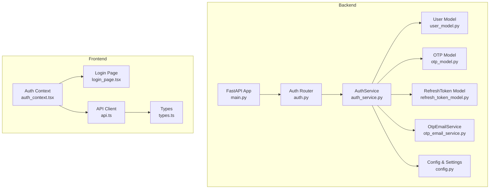
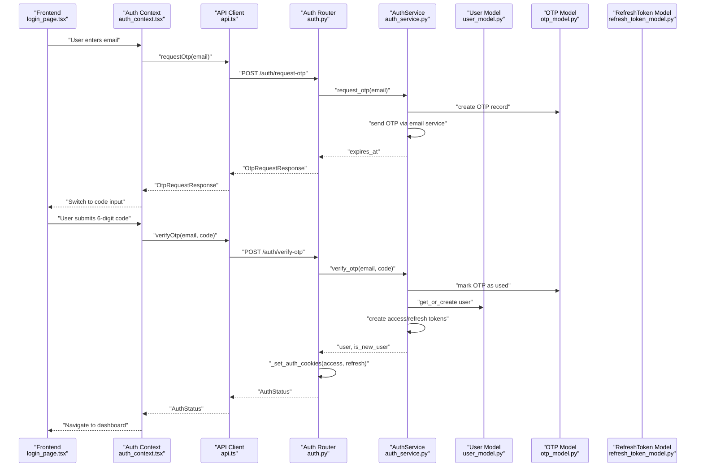
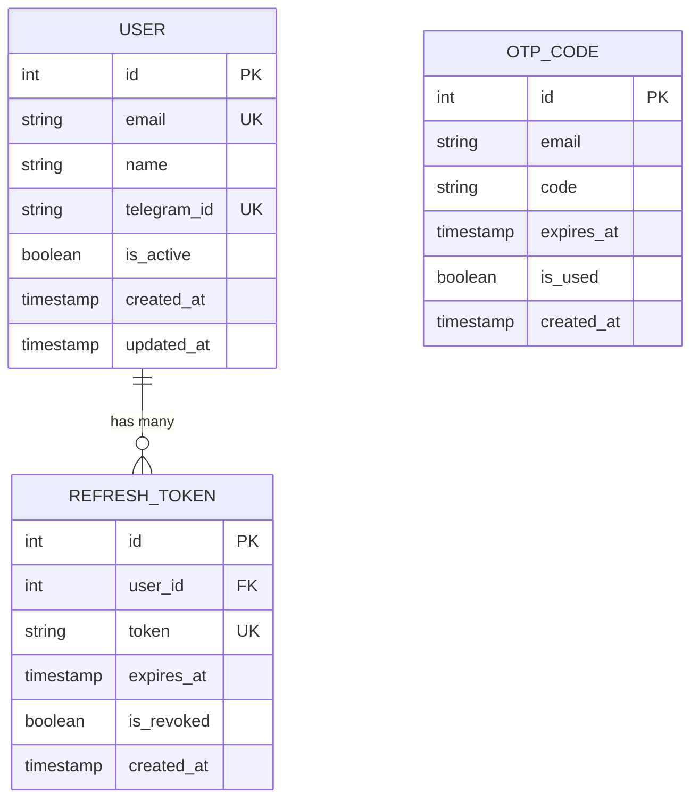
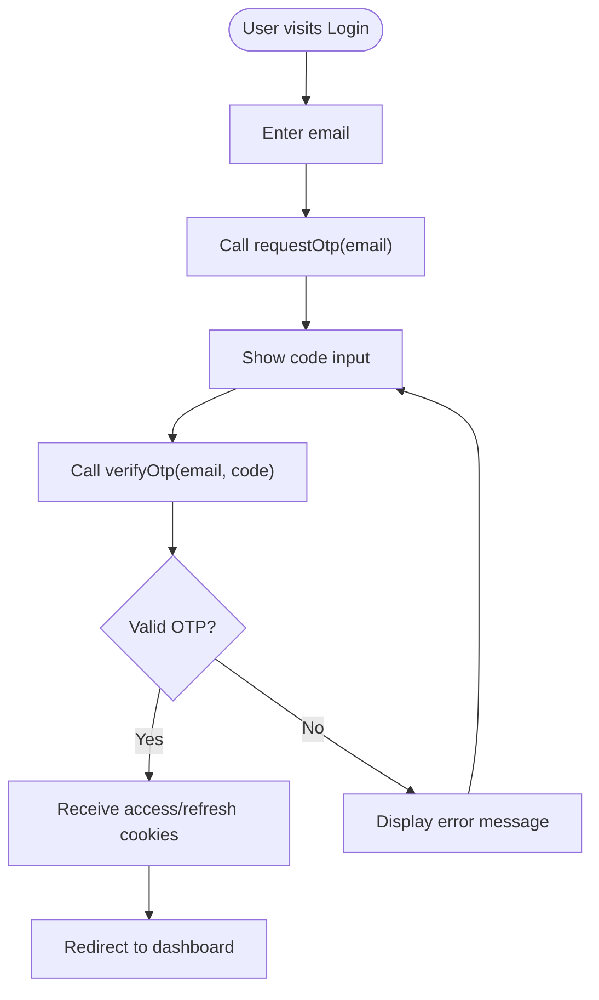
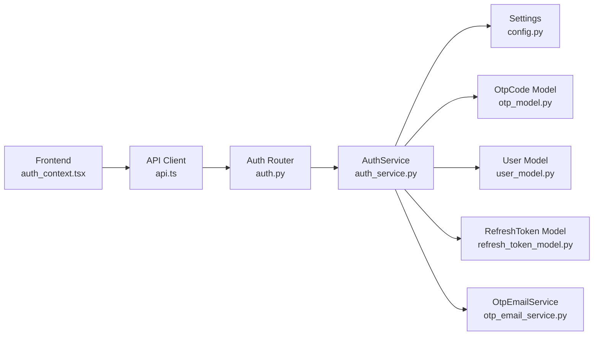

# Authentication System

<cite>
**Referenced Files in This Document**
- [auth.py](file://notice-reminders/app/api/routers/auth.py)
- [auth_core.py](file://notice-reminders/app/core/auth.py)
- [config.py](file://notice-reminders/app/core/config.py)
- [auth_service.py](file://notice-reminders/app/services/auth_service.py)
- [otp_email_service.py](file://notice-reminders/app/services/otp_email_service.py)
- [user_model.py](file://notice-reminders/app/models/user.py)
- [otp_model.py](file://notice-reminders/app/models/otp.py)
- [refresh_token_model.py](file://notice-reminders/app/models/refresh_token.py)
- [auth_schema.py](file://notice-reminders/app/schemas/auth.py)
- [user_schema.py](file://notice-reminders/app/schemas/user.py)
- [main.py](file://notice-reminders/app/api/main.py)
- [auth_context.tsx](file://website/lib/auth-context.tsx)
- [login_page.tsx](file://website/app/notice-reminders/login/page.tsx)
- [api.ts](file://website/lib/api.ts)
- [types.ts](file://website/lib/types.ts)
</cite>

## Table of Contents
1. [Introduction](#introduction)
2. [Project Structure](#project-structure)
3. [Core Components](#core-components)
4. [Architecture Overview](#architecture-overview)
5. [Detailed Component Analysis](#detailed-component-analysis)
6. [Dependency Analysis](#dependency-analysis)
7. [Performance Considerations](#performance-considerations)
8. [Troubleshooting Guide](#troubleshooting-guide)
9. [Conclusion](#conclusion)
10. [Appendices](#appendices)

## Introduction
This document explains the authentication system that enables OTP-based login with JWT cookie management and session handling. It covers the backend implementation (FastAPI), models, services, and schemas, as well as the frontend integration (Next.js) for a complete authentication flow from OTP request to successful login. Security measures, error handling, and API specifications are included to guide both developers and operators.

## Project Structure
The authentication system spans two primary parts:
- Backend (Python/FastAPI): authentication routes, token management, persistence, and email delivery
- Frontend (Next.js): authentication context, UI flow, and API client integration

**Diagram sources**
- [main.py](file://notice-reminders/app/api/main.py#L17-L46)
- [auth.py](file://notice-reminders/app/api/routers/auth.py#L12-L126)
- [auth_service.py](file://notice-reminders/app/services/auth_service.py#L17-L128)
- [otp_email_service.py](file://notice-reminders/app/services/otp_email_service.py#L7-L43)
- [user_model.py](file://notice-reminders/app/models/user.py#L7-L20)
- [otp_model.py](file://notice-reminders/app/models/otp.py#L7-L19)
- [refresh_token_model.py](file://notice-reminders/app/models/refresh_token.py#L7-L23)
- [config.py](file://notice-reminders/app/core/config.py#L4-L32)
- [auth_context.tsx](file://website/lib/auth-context.tsx#L21-L88)
- [login_page.tsx](file://website/app/notice-reminders/login/page.tsx#L19-L158)
- [api.ts](file://website/lib/api.ts#L28-L53)

**Section sources**
- [main.py](file://notice-reminders/app/api/main.py#L17-L46)
- [auth.py](file://notice-reminders/app/api/routers/auth.py#L12-L126)
- [auth_context.tsx](file://website/lib/auth-context.tsx#L21-L88)

## Core Components
- Authentication Router: exposes endpoints for OTP request, verification, token refresh, logout, and profile retrieval
- AuthService: orchestrates OTP generation/validation, JWT creation/verification, refresh token lifecycle, and user provisioning
- Models: User, OTP, and RefreshToken for persistence
- Schemas: Pydantic models for request/response contracts
- Email Service: sends OTP via console or SMTP
- Frontend Auth Context: manages session state, cookies, and navigation
- API Client: centralized fetch wrapper with credential handling

**Section sources**
- [auth.py](file://notice-reminders/app/api/routers/auth.py#L43-L126)
- [auth_service.py](file://notice-reminders/app/services/auth_service.py#L17-L128)
- [user_model.py](file://notice-reminders/app/models/user.py#L7-L20)
- [otp_model.py](file://notice-reminders/app/models/otp.py#L7-L19)
- [refresh_token_model.py](file://notice-reminders/app/models/refresh_token.py#L7-L23)
- [auth_schema.py](file://notice-reminders/app/schemas/auth.py#L8-L26)
- [user_schema.py](file://notice-reminders/app/schemas/user.py#L13-L24)
- [otp_email_service.py](file://notice-reminders/app/services/otp_email_service.py#L7-L43)
- [auth_context.tsx](file://website/lib/auth-context.tsx#L21-L88)
- [api.ts](file://website/lib/api.ts#L28-L53)

## Architecture Overview
The authentication flow integrates frontend and backend components with secure cookie-based sessions using JWTs.

**Diagram sources**
- [login_page.tsx](file://website/app/notice-reminders/login/page.tsx#L37-L61)
- [auth_context.tsx](file://website/lib/auth-context.tsx#L41-L49)
- [api.ts](file://website/lib/api.ts#L150-L165)
- [auth.py](file://notice-reminders/app/api/routers/auth.py#L43-L76)
- [auth_service.py](file://notice-reminders/app/services/auth_service.py#L22-L59)
- [otp_model.py](file://notice-reminders/app/models/otp.py#L7-L19)
- [user_model.py](file://notice-reminders/app/models/user.py#L7-L20)

## Detailed Component Analysis

### Backend Authentication Router
- Routes:
  - POST /auth/request-otp: generates and emails OTP; returns whether user is new and expiry time
  - POST /auth/verify-otp: validates OTP, creates access/refresh tokens, sets secure cookies
  - POST /auth/refresh: rotates refresh token and issues new access/refresh cookies
  - POST /auth/logout: revokes refresh token and clears cookies
  - GET /auth/me: protected route returning current user via access token cookie
- Cookie policy:
  - access_token: HttpOnly, SameSite=Lax, secure unless debug, path "/"
  - refresh_token: HttpOnly, SameSite=Lax, secure unless debug, path "/"
- Error handling:
  - Returns HTTP 400/401 with descriptive messages for invalid/expired OTP or missing/invalid tokens

**Section sources**
- [auth.py](file://notice-reminders/app/api/routers/auth.py#L43-L126)

### Authentication Service Implementation
Responsibilities:
- OTP lifecycle: generation, persistence, expiry enforcement, and usage marking
- User provisioning: auto-create user on first login
- JWT lifecycle: encode/decode access tokens, manage refresh tokens with rotation and revocation
- Token persistence: store refresh tokens with expiry and revoked flag
- Email delivery: console or SMTP transport

Key behaviors:
- Access token payload includes subject, email, issued-at, and expiry
- Refresh token rotation invalidates previous token and issues a new one
- OTP uniqueness per email and latest-first validation ensures freshness

**Section sources**
- [auth_service.py](file://notice-reminders/app/services/auth_service.py#L17-L128)
- [otp_email_service.py](file://notice-reminders/app/services/otp_email_service.py#L7-L43)

### Data Models
- User: identifier, email, optional name/telegram, activity flag, timestamps
- OtpCode: email, code, expiry, usage flag, timestamps
- RefreshToken: foreign key to User, unique token, expiry, revoked flag, timestamps

**Diagram sources**
- [user_model.py](file://notice-reminders/app/models/user.py#L7-L20)
- [otp_model.py](file://notice-reminders/app/models/otp.py#L7-L19)
- [refresh_token_model.py](file://notice-reminders/app/models/refresh_token.py#L7-L23)

**Section sources**
- [user_model.py](file://notice-reminders/app/models/user.py#L7-L20)
- [otp_model.py](file://notice-reminders/app/models/otp.py#L7-L19)
- [refresh_token_model.py](file://notice-reminders/app/models/refresh_token.py#L7-L23)

### JWT Cookie Management and Session Handling
- Access token cookie:
  - Name: access_token
  - Attributes: HttpOnly, SameSite=Lax, secure unless debug, path "/"
  - Max age: derived from settings
- Refresh token cookie:
  - Name: refresh_token
  - Attributes: HttpOnly, SameSite=Lax, secure unless debug, path "/"
  - Max age: derived from settings
- Session retrieval:
  - Protected route middleware reads access_token cookie, verifies JWT, loads user by sub claim
- Token refresh:
  - Uses refresh_token cookie to validate, revoke old, issue new refresh token, and update cookies

**Section sources**
- [auth.py](file://notice-reminders/app/api/routers/auth.py#L15-L41)
- [auth_core.py](file://notice-reminders/app/core/auth.py#L14-L51)
- [auth_service.py](file://notice-reminders/app/services/auth_service.py#L81-L113)

### Password Hashing Strategy
- The system does not hash passwords; authentication relies on OTP delivery and JWT-based session management
- No password field exists in the User model

**Section sources**
- [user_model.py](file://notice-reminders/app/models/user.py#L7-L20)
- [auth_service.py](file://notice-reminders/app/services/auth_service.py#L122-L123)

### Frontend Authentication Flow
- Auth Context:
  - Loads session on startup via /auth/me
  - Provides requestOtp, verifyOtp, refresh, and logout
  - Persists user state and navigates after successful login
- Login Page:
  - Two-step UX: email → code
  - Zod-based validation for email and 6-digit code
  - Conditional rendering and error messaging
- API Client:
  - Fetch wrapper with credentials: include
  - Centralized endpoints for auth operations
  - Typed responses aligned with backend schemas

**Diagram sources**
- [login_page.tsx](file://website/app/notice-reminders/login/page.tsx#L37-L61)
- [auth_context.tsx](file://website/lib/auth-context.tsx#L41-L49)
- [api.ts](file://website/lib/api.ts#L150-L165)

**Section sources**
- [auth_context.tsx](file://website/lib/auth-context.tsx#L21-L88)
- [login_page.tsx](file://website/app/notice-reminders/login/page.tsx#L19-L158)
- [api.ts](file://website/lib/api.ts#L28-L53)

## Dependency Analysis
- Router depends on:
  - AuthService for OTP, token, and user operations
  - Settings for cookie lifetimes and delivery configuration
- AuthService depends on:
  - Models for persistence
  - OtpEmailService for delivery
  - Settings for cryptographic and timing parameters
- Frontend depends on:
  - Auth Context for state management
  - API Client for network requests
  - Types for type safety

**Diagram sources**
- [auth_context.tsx](file://website/lib/auth-context.tsx#L6-L7)
- [api.ts](file://website/lib/api.ts#L28-L53)
- [auth.py](file://notice-reminders/app/api/routers/auth.py#L3-L9)
- [auth_service.py](file://notice-reminders/app/services/auth_service.py#L10-L21)
- [config.py](file://notice-reminders/app/core/config.py#L4-L32)
- [otp_model.py](file://notice-reminders/app/models/otp.py#L7-L19)
- [user_model.py](file://notice-reminders/app/models/user.py#L7-L20)
- [refresh_token_model.py](file://notice-reminders/app/models/refresh_token.py#L7-L23)
- [otp_email_service.py](file://notice-reminders/app/services/otp_email_service.py#L7-L43)

**Section sources**
- [auth.py](file://notice-reminders/app/api/routers/auth.py#L3-L9)
- [auth_service.py](file://notice-reminders/app/services/auth_service.py#L10-L21)
- [auth_context.tsx](file://website/lib/auth-context.tsx#L6-L7)
- [api.ts](file://website/lib/api.ts#L28-L53)

## Performance Considerations
- OTP generation uses constant-time numeric codes; consider rate limiting per email to prevent abuse
- Token rotation creates new refresh tokens; ensure database indexing on token and user fields remains efficient
- Access token expiry is short-lived by default; balance usability with security
- Email delivery is synchronous; consider queuing for production workloads

[No sources needed since this section provides general guidance]

## Troubleshooting Guide
Common issues and resolutions:
- Invalid or expired OTP:
  - Cause: OTP not found, expired, or already used
  - Resolution: Trigger new OTP request; ensure clock sync and correct email
- Missing or invalid access token:
  - Cause: Missing cookie, expired token, or invalid signature
  - Resolution: Re-authenticate; verify JWT secret and clock
- Missing refresh token:
  - Cause: Not present or revoked/expired
  - Resolution: Perform full OTP login; avoid long-lived sessions
- Cookie not set:
  - Cause: SameSite/secure flags mismatch with deployment
  - Resolution: Adjust settings for local vs. production environments
- SMTP configuration errors:
  - Cause: Missing SMTP settings for non-console delivery
  - Resolution: Provide required SMTP environment variables

**Section sources**
- [auth.py](file://notice-reminders/app/api/routers/auth.py#L64-L70)
- [auth_core.py](file://notice-reminders/app/core/auth.py#L18-L51)
- [auth_service.py](file://notice-reminders/app/services/auth_service.py#L104-L120)
- [otp_email_service.py](file://notice-reminders/app/services/otp_email_service.py#L16-L25)

## Conclusion
The authentication system provides a secure, cookie-backed OTP login flow with robust JWT token management and refresh mechanisms. The backend enforces strict validation and persistence, while the frontend offers a smooth, validated user experience. Operators should configure environment variables carefully, especially for JWT secrets and SMTP settings, and deploy with appropriate CORS and cookie policies.

[No sources needed since this section summarizes without analyzing specific files]

## Appendices

### API Endpoint Specifications

- POST /auth/request-otp
  - Request: { email: string }
  - Response: { message: string, is_new_user: boolean, expires_at: datetime }
  - Description: Generates OTP and delivers it; returns expiry time and new-user flag

- POST /auth/verify-otp
  - Request: { email: string, code: string }
  - Response: { user: UserResponse, is_new_user: boolean }
  - Cookies: Sets access_token and refresh_token
  - Description: Validates OTP, provisions user if needed, issues tokens

- POST /auth/refresh
  - Request: none (uses refresh_token cookie)
  - Response: { user: UserResponse, is_new_user: boolean }
  - Cookies: Rotates refresh token and updates access token cookie
  - Description: Refreshes session using valid refresh token

- POST /auth/logout
  - Request: none (uses refresh_token cookie)
  - Response: 204 No Content
  - Description: Revokes refresh token and clears cookies

- GET /auth/me
  - Request: none (uses access_token cookie)
  - Response: UserResponse
  - Description: Returns currently authenticated user

Security considerations:
- Cookies are HttpOnly and use SameSite=Lax; secure flag is disabled only in debug mode
- Access tokens are signed HS256; keep jwt_secret secret
- Refresh tokens are rotated on each refresh and stored with expiry/revocation flags

**Section sources**
- [auth.py](file://notice-reminders/app/api/routers/auth.py#L43-L126)
- [auth_schema.py](file://notice-reminders/app/schemas/auth.py#L8-L26)
- [user_schema.py](file://notice-reminders/app/schemas/user.py#L13-L24)
- [config.py](file://notice-reminders/app/core/config.py#L22-L27)

### Client Integration Examples

- Next.js usage pattern:
  - Wrap app with AuthProvider
  - Use useAuth hook to call requestOtp, verifyOtp, refresh, logout
  - Navigate based on isAuthenticated and loading state

- API client usage:
  - requestOtp(email) → OtpRequestResponse
  - verifyOtp(email, code) → AuthStatus
  - refreshSession() → AuthStatus
  - logout() → void
  - getMe() → User

**Section sources**
- [auth_context.tsx](file://website/lib/auth-context.tsx#L21-L88)
- [login_page.tsx](file://website/app/notice-reminders/login/page.tsx#L19-L158)
- [api.ts](file://website/lib/api.ts#L150-L181)
- [types.ts](file://website/lib/types.ts#L65-L75)