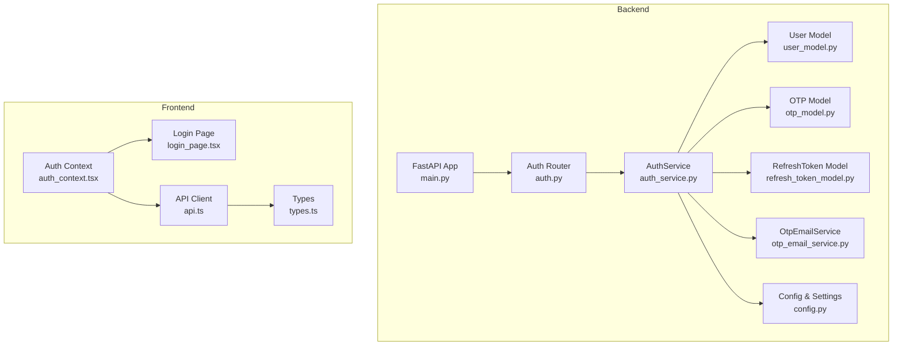
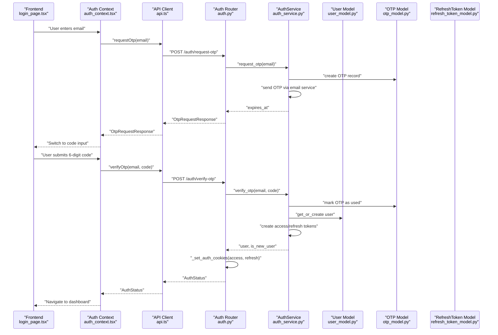
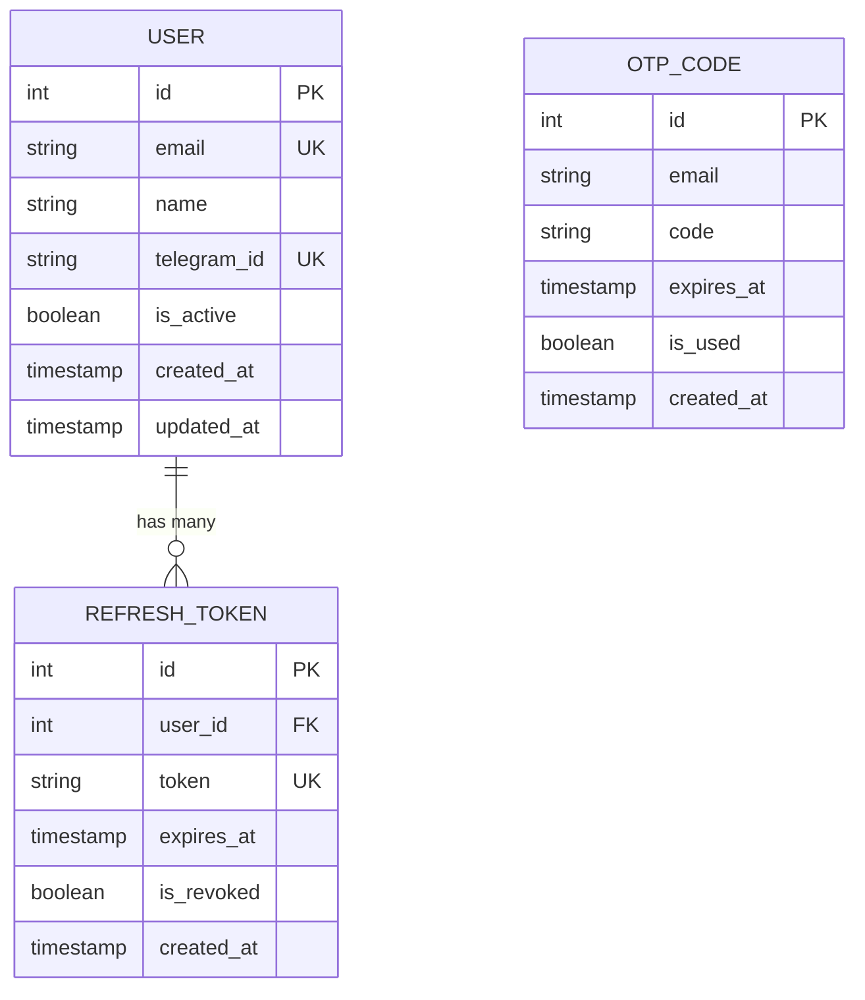
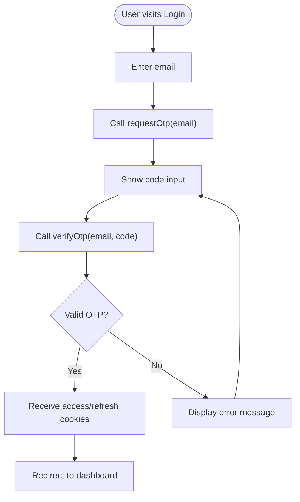
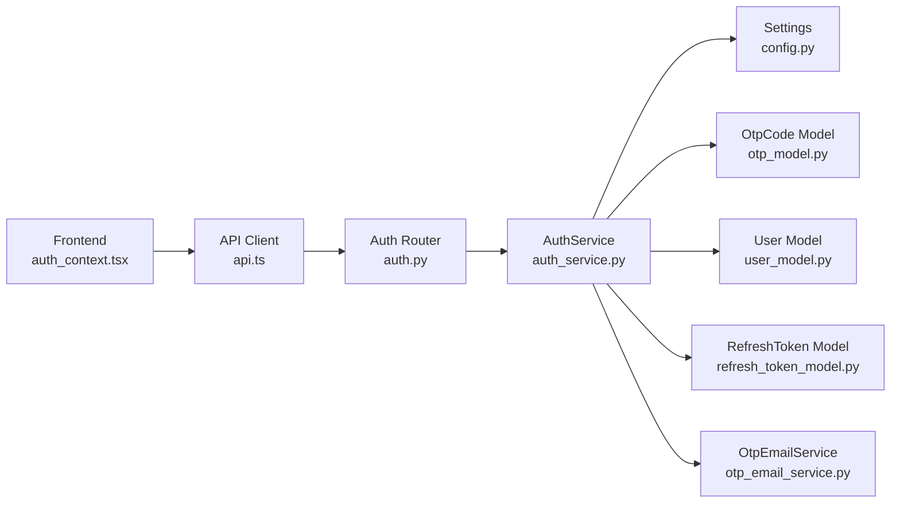

# Authentication system

## Introduction
This page explains the authentication system that enables OTP-based login with JWT cookie management and session handling. It covers the backend implementation (FastAPI), models, services, and schemas, as well as the frontend integration (Next.js) for a complete authentication flow from OTP request to successful login. Security measures, error handling, and API specifications are included to guide both developers and operators.

## Project structure
The authentication system spans two primary parts:
- Backend (Python/FastAPI): authentication routes, token management, persistence, and email delivery
- Frontend (Next.js): authentication context, UI flow, and API client integration

```mermaid
graph TB
subgraph "Backend"
A["FastAPI App<br/>main.py"]
R["Auth Router<br/>auth.py"]
S["AuthService<br/>auth_service.py"]
E["OtpEmailService<br/>otp_email_service.py"]
M1["User Model<br/>user_model.py"]
M2["OTP Model<br/>otp_model.py"]
M3["RefreshToken Model<br/>refresh_token_model.py"]
C["Config & Settings<br/>config.py"]
end
subgraph "Frontend"
F1["Auth Context<br/>auth_context.tsx"]
F2["Login Page<br/>login_page.tsx"]
F3["API Client<br/>api.ts"]
F4["Types<br/>types.ts"]
end
A --> R
R --> S
S --> M1
S --> M2
S --> M3
S --> E
S --> C
F1 --> F2
F1 --> F3
F3 --> F4
```

## Core components
- Authentication Router: exposes endpoints for OTP request, verification, token refresh, logout, and profile retrieval
- AuthService: orchestrates OTP generation/validation, JWT creation/verification, refresh token lifecycle, and user provisioning
- Models: User, OTP, and RefreshToken for persistence
- Schemas: Pydantic models for request/response contracts
- Email Service: sends OTP via console or SMTP
- Frontend Auth Context: manages session state, cookies, and navigation
- API Client: centralized fetch wrapper with credential handling

## Architecture overview
The authentication flow integrates frontend and backend components with secure cookie-based sessions using JWTs.

```mermaid
sequenceDiagram
participant FE as "Frontend<br/>login_page.tsx"
participant AC as "Auth Context<br/>auth_context.tsx"
participant API as "API Client<br/>api.ts"
participant AR as "Auth Router<br/>auth.py"
participant AS as "AuthService<br/>auth_service.py"
participant UM as "User Model<br/>user_model.py"
participant OM as "OTP Model<br/>otp_model.py"
participant RM as "RefreshToken Model<br/>refresh_token_model.py"
FE->>AC : "User enters email"
AC->>API : "requestOtp(email)"
API->>AR : "POST /auth/request-otp"
AR->>AS : "request_otp(email)"
AS->>OM : "create OTP record"
AS->>AS : "send OTP via email service"
AS-->>AR : "expires_at"
AR-->>API : "OtpRequestResponse"
API-->>AC : "OtpRequestResponse"
AC-->>FE : "Switch to code input"
FE->>AC : "User submits 6-digit code"
AC->>API : "verifyOtp(email, code)"
API->>AR : "POST /auth/verify-otp"
AR->>AS : "verify_otp(email, code)"
AS->>OM : "mark OTP as used"
AS->>UM : "get_or_create user"
AS->>AS : "create access/refresh tokens"
AS-->>AR : "user, is_new_user"
AR->>AR : "_set_auth_cookies(access, refresh)"
AR-->>API : "AuthStatus"
API-->>AC : "AuthStatus"
AC-->>FE : "Navigate to dashboard"
```

## Detailed component analysis

### Backend authentication router
- Routes:
  - POST /auth/request-otp: generates and emails OTP; returns whether user is new and expiry time
  - POST /auth/verify-otp: validates OTP, creates access/refresh tokens, sets secure cookies
  - POST /auth/refresh: rotates refresh token and issues new access/refresh cookies
  - POST /auth/logout: revokes refresh token and clears cookies
  - GET /auth/me: protected route returning current user via access token cookie
- Cookie policy:
  - access_token: HttpOnly, SameSite=Lax, secure unless debug, path "/"
  - refresh_token: HttpOnly, SameSite=Lax, secure unless debug, path "/"
- Error handling:
  - Returns HTTP 400/401 with descriptive messages for invalid/expired OTP or missing/invalid tokens

### Authentication service implementation
Responsibilities:
- OTP lifecycle: generation, persistence, expiry enforcement, and usage marking
- User provisioning: auto-create user on first login
- JWT lifecycle: encode/decode access tokens, manage refresh tokens with rotation and revocation
- Token persistence: store refresh tokens with expiry and revoked flag
- Email delivery: console or SMTP transport

Key behaviors:
- Access token payload includes subject, email, issued-at, and expiry
- Refresh token rotation invalidates previous token and issues a new one
- OTP uniqueness per email and latest-first validation ensures freshness

### Data models
- User: identifier, email, optional name/telegram, activity flag, timestamps
- OtpCode: email, code, expiry, usage flag, timestamps
- RefreshToken: foreign key to User, unique token, expiry, revoked flag, timestamps

```mermaid
erDiagram
USER {
int id PK
string email UK
string name
string telegram_id UK
boolean is_active
timestamp created_at
timestamp updated_at
}
OTP_CODE {
int id PK
string email
string code
timestamp expires_at
boolean is_used
timestamp created_at
}
REFRESH_TOKEN {
int id PK
int user_id FK
string token UK
timestamp expires_at
boolean is_revoked
timestamp created_at
}
USER ||--o{ REFRESH_TOKEN : "has many"
```

### JWT cookie management and session handling
- Access token cookie:
  - Name: access_token
  - Attributes: HttpOnly, SameSite=Lax, secure unless debug, path "/"
  - Max age: derived from settings
- Refresh token cookie:
  - Name: refresh_token
  - Attributes: HttpOnly, SameSite=Lax, secure unless debug, path "/"
  - Max age: derived from settings
- Session retrieval:
  - Protected route middleware reads access_token cookie, verifies JWT, loads user by sub claim
- Token refresh:
  - Uses refresh_token cookie to validate, revoke old, issue new refresh token, and update cookies

### Password hashing strategy
- The system does not hash passwords; authentication relies on OTP delivery and JWT-based session management
- No password field exists in the User model

### Frontend authentication flow
- Auth Context:
  - Loads session on startup via /auth/me
  - Provides requestOtp, verifyOtp, refresh, and logout
  - Persists user state and navigates after successful login
- Login Page:
  - Two-step UX: email → code
  - Zod-based validation for email and 6-digit code
  - Conditional rendering and error messaging
- API Client:
  - Fetch wrapper with credentials: include
  - Centralized endpoints for auth operations
  - Typed responses aligned with backend schemas

```mermaid
flowchart TD
Start(["User visits Login"]) --> EnterEmail["Enter email"]
EnterEmail --> RequestOTP["Call requestOtp(email)"]
RequestOTP --> ShowCode["Show code input"]
ShowCode --> Verify["Call verifyOtp(email, code)"]
Verify --> Success{"Valid OTP?"}
Success --> |Yes| SetCookies["Receive access/refresh cookies"]
SetCookies --> Navigate["Redirect to dashboard"]
Success --> |No| ShowError["Display error message"]
ShowError --> ShowCode
```

## Dependency analysis
- Router depends on:
  - AuthService for OTP, token, and user operations
  - Settings for cookie lifetimes and delivery configuration
- AuthService depends on:
  - Models for persistence
  - OtpEmailService for delivery
  - Settings for cryptographic and timing parameters
- Frontend depends on:
  - Auth Context for state management
  - API Client for network requests
  - Types for type safety

```mermaid
graph LR
FE["Frontend<br/>auth_context.tsx"] --> APIC["API Client<br/>api.ts"]
APIC --> AUTHR["Auth Router<br/>auth.py"]
AUTHR --> ASVC["AuthService<br/>auth_service.py"]
ASVC --> CFG["Settings<br/>config.py"]
ASVC --> OTPM["OtpCode Model<br/>otp_model.py"]
ASVC --> USRM["User Model<br/>user_model.py"]
ASVC --> RTM["RefreshToken Model<br/>refresh_token_model.py"]
ASVC --> EMAIL["OtpEmailService<br/>otp_email_service.py"]
```

## Performance considerations
- OTP generation uses constant-time numeric codes; consider rate limiting per email to prevent abuse
- Token rotation creates new refresh tokens; ensure database indexing on token and user fields remains efficient
- Access token expiry is short-lived by default; balance usability with security
- Email delivery is synchronous; consider queuing for production workloads

[No sources needed since this section provides general guidance]

## Troubleshooting guide
Common issues and resolutions:
- Invalid or expired OTP:
  - Cause: OTP not found, expired, or already used
  - Resolution: Trigger new OTP request; ensure clock sync and correct email
- Missing or invalid access token:
  - Cause: Missing cookie, expired token, or invalid signature
  - Resolution: Re-authenticate; verify JWT secret and clock
- Missing refresh token:
  - Cause: Not present or revoked/expired
  - Resolution: Perform full OTP login; avoid long-lived sessions
- Cookie not set:
  - Cause: SameSite/secure flags mismatch with deployment
  - Resolution: Adjust settings for local vs. production environments
- SMTP configuration errors:
  - Cause: Missing SMTP settings for non-console delivery
  - Resolution: Provide required SMTP environment variables

## Conclusion
The authentication system provides a secure, cookie-backed OTP login flow with reliable JWT token management and refresh mechanisms. The backend enforces strict validation and persistence, while the frontend offers a smooth, validated user experience. Operators should configure environment variables carefully, especially for JWT secrets and SMTP settings, and deploy with appropriate CORS and cookie policies.

[No sources needed since this section summarizes without analyzing specific files]

## Appendices

### API endpoint specifications

- POST /auth/request-otp
  - Request: { email: string }
  - Response: { message: string, is_new_user: boolean, expires_at: datetime }
  - Description: Generates OTP and delivers it; returns expiry time and new-user flag

- POST /auth/verify-otp
  - Request: { email: string, code: string }
  - Response: { user: UserResponse, is_new_user: boolean }
  - Cookies: Sets access_token and refresh_token
  - Description: Validates OTP, provisions user if needed, issues tokens

- POST /auth/refresh
  - Request: none (uses refresh_token cookie)
  - Response: { user: UserResponse, is_new_user: boolean }
  - Cookies: Rotates refresh token and updates access token cookie
  - Description: Refreshes session using valid refresh token

- POST /auth/logout
  - Request: none (uses refresh_token cookie)
  - Response: 204 No Content
  - Description: Revokes refresh token and clears cookies

- GET /auth/me
  - Request: none (uses access_token cookie)
  - Response: UserResponse
  - Description: Returns currently authenticated user

Security considerations:
- Cookies are HttpOnly and use SameSite=Lax; secure flag is disabled only in debug mode
- Access tokens are signed HS256; keep jwt_secret secret
- Refresh tokens are rotated on each refresh and stored with expiry/revocation flags

### Client integration examples

- Next.js usage pattern:
  - Wrap app with AuthProvider
  - Use useAuth hook to call requestOtp, verifyOtp, refresh, logout
  - Navigate based on isAuthenticated and loading state

- API client usage:
  - requestOtp(email) → OtpRequestResponse
  - verifyOtp(email, code) → AuthStatus
  - refreshSession() → AuthStatus
  - logout() → void
  - getMe() → User
