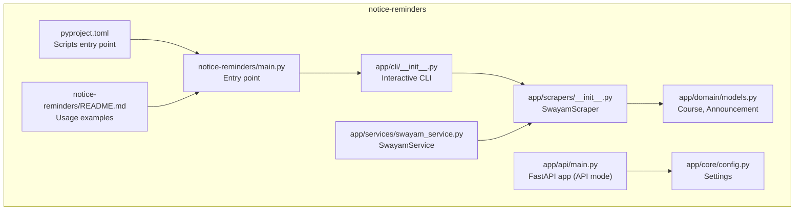
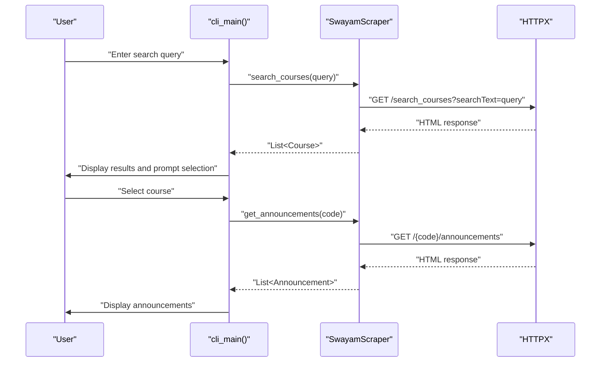
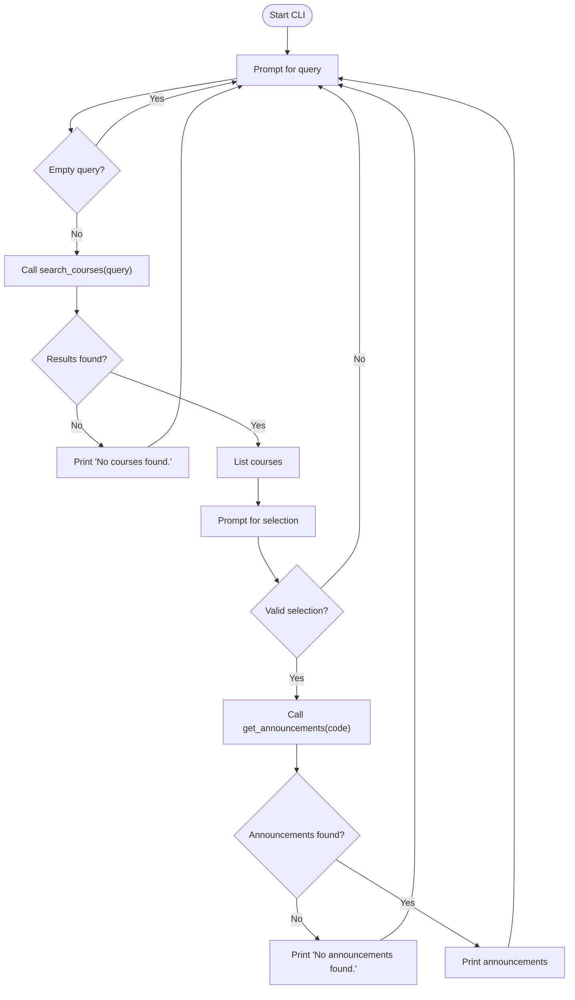
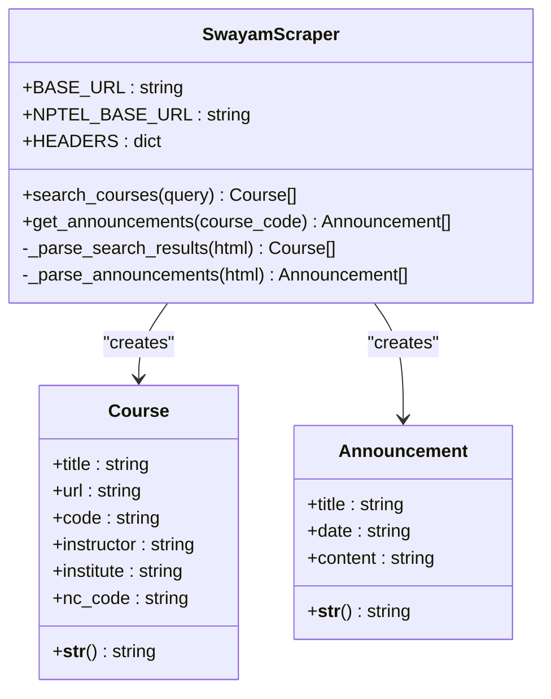
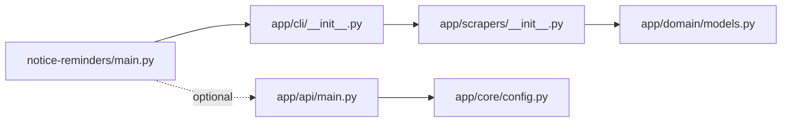

# CLI Tool

<cite>
**Referenced Files in This Document**
- [main.py](file://notice-reminders/main.py)
- [cli/__init__.py](file://notice-reminders/app/cli/__init__.py)
- [scrapers/__init__.py](file://notice-reminders/app/scrapers/__init__.py)
- [domain/models.py](file://notice-reminders/app/domain/models.py)
- [services/swayam_service.py](file://notice-reminders/app/services/swayam_service.py)
- [api/main.py](file://notice-reminders/app/api/main.py)
- [core/config.py](file://notice-reminders/app/core/config.py)
- [pyproject.toml](file://notice-reminders/pyproject.toml)
- [README.md](file://notice-reminders/README.md)
</cite>

## Table of Contents
1. [Introduction](#introduction)
2. [Project Structure](#project-structure)
3. [Core Components](#core-components)
4. [Architecture Overview](#architecture-overview)
5. [Detailed Component Analysis](#detailed-component-analysis)
6. [Dependency Analysis](#dependency-analysis)
7. [Performance Considerations](#performance-considerations)
8. [Troubleshooting Guide](#troubleshooting-guide)
9. [Conclusion](#conclusion)
10. [Appendices](#appendices)

## Introduction
This document describes the command-line interface tool for the MOOC Notice Reminders project. It explains the CLI commands, arguments, operational modes, configuration options, environment variables, and execution workflows. It also provides examples of common CLI operations, automation scripts, and integration with system scheduling, along with troubleshooting guidance and performance optimization tips.

## Project Structure
The CLI tool is part of a larger project with a shared core and dual interfaces (CLI and API). The CLI mode runs independently without requiring a database.

**Diagram sources**
- [main.py](file://notice-reminders/main.py#L1-L71)
- [cli/__init__.py](file://notice-reminders/app/cli/__init__.py#L1-L71)
- [scrapers/__init__.py](file://notice-reminders/app/scrapers/__init__.py#L1-L170)
- [domain/models.py](file://notice-reminders/app/domain/models.py#L1-L34)
- [services/swayam_service.py](file://notice-reminders/app/services/swayam_service.py#L1-L25)
- [api/main.py](file://notice-reminders/app/api/main.py#L1-L46)
- [core/config.py](file://notice-reminders/app/core/config.py#L1-L32)
- [pyproject.toml](file://notice-reminders/pyproject.toml#L1-L41)
- [README.md](file://notice-reminders/README.md#L1-L56)

**Section sources**
- [main.py](file://notice-reminders/main.py#L1-L71)
- [pyproject.toml](file://notice-reminders/pyproject.toml#L21-L22)
- [README.md](file://notice-reminders/README.md#L1-L56)

## Core Components
- Entry point and argument parsing: The main entry point parses subcommands and runs either the CLI or API mode.
- Interactive CLI: Provides an interactive loop to search courses and fetch announcements.
- Scraper: Implements asynchronous scraping of course listings and announcements.
- Domain models: Defines Course and Announcement data structures.
- Service layer: Bridges configuration and scraper for API usage; CLI uses scraper directly.
- Configuration: Centralized settings via Pydantic Settings with environment variable support.
- API mode: Optional server mode for REST endpoints (not covered in CLI documentation but relevant for understanding the full toolset).

Key CLI-specific files:
- [main.py](file://notice-reminders/main.py#L8-L66)
- [cli/__init__.py](file://notice-reminders/app/cli/__init__.py#L9-L71)
- [scrapers/__init__.py](file://notice-reminders/app/scrapers/__init__.py#L14-L170)
- [domain/models.py](file://notice-reminders/app/domain/models.py#L7-L34)
- [services/swayam_service.py](file://notice-reminders/app/services/swayam_service.py#L10-L25)
- [core/config.py](file://notice-reminders/app/core/config.py#L4-L32)

**Section sources**
- [main.py](file://notice-reminders/main.py#L8-L66)
- [cli/__init__.py](file://notice-reminders/app/cli/__init__.py#L9-L71)
- [scrapers/__init__.py](file://notice-reminders/app/scrapers/__init__.py#L14-L170)
- [domain/models.py](file://notice-reminders/app/domain/models.py#L7-L34)
- [services/swayam_service.py](file://notice-reminders/app/services/swayam_service.py#L10-L25)
- [core/config.py](file://notice-reminders/app/core/config.py#L4-L32)

## Architecture Overview
The CLI mode follows a straightforward flow: parse arguments, initialize the scraper, and run an interactive loop to search and fetch course announcements.

**Diagram sources**
- [cli/__init__.py](file://notice-reminders/app/cli/__init__.py#L16-L68)
- [scrapers/__init__.py](file://notice-reminders/app/scrapers/__init__.py#L38-L117)

## Detailed Component Analysis

### Command-Line Interface Commands and Modes
- Command: notice-reminders
- Subcommands:
  - cli: Run the interactive CLI.
  - api: Run the FastAPI server (not covered here).
- Arguments for api mode:
  - --host: Host binding address (default: 127.0.0.1).
  - --port: Port binding (default: 8000).
  - --reload: Enable auto-reload for development.

Execution flow:
- The entry point parses subcommands and routes to the appropriate handler.
- CLI mode initializes the scraper and starts an interactive loop.
- API mode launches the FastAPI server with configured settings.

**Section sources**
- [main.py](file://notice-reminders/main.py#L8-L66)
- [pyproject.toml](file://notice-reminders/pyproject.toml#L21-L22)
- [README.md](file://notice-reminders/README.md#L29-L49)

### Interactive CLI Workflow
The CLI provides an interactive loop:
- Prompts for a search query.
- Displays matching courses.
- Allows selecting a course to fetch announcements.
- Handles errors gracefully and continues the loop until the user quits.

**Diagram sources**
- [cli/__init__.py](file://notice-reminders/app/cli/__init__.py#L16-L68)

**Section sources**
- [cli/__init__.py](file://notice-reminders/app/cli/__init__.py#L9-L71)

### Data Models
The CLI uses two primary data structures:
- Course: title, url, code, instructor, institute, nc_code.
- Announcement: title, date, content.

These models are used to represent scraped data and are printed in a human-readable format.

**Section sources**
- [domain/models.py](file://notice-reminders/app/domain/models.py#L7-L34)

### Scraper Implementation
The scraper performs asynchronous HTTP requests and parses HTML to extract course and announcement data:
- Headers are set for compatibility with target sites.
- Course search endpoint is queried with a search text parameter.
- Announcement retrieval supports multiple URL variants and falls back if needed.
- Results are parsed into Course and Announcement objects.

**Diagram sources**
- [scrapers/__init__.py](file://notice-reminders/app/scrapers/__init__.py#L14-L170)
- [domain/models.py](file://notice-reminders/app/domain/models.py#L7-L34)

**Section sources**
- [scrapers/__init__.py](file://notice-reminders/app/scrapers/__init__.py#L14-L170)
- [domain/models.py](file://notice-reminders/app/domain/models.py#L7-L34)

### Configuration Options and Environment Variables
Settings are loaded via Pydantic Settings with defaults and environment variable support:
- app_name: Application name.
- debug: Debug flag.
- database_url: Database connection string (used by API mode).
- swayam_base_url, nptel_base_url: Base URLs for scraping.
- cache_ttl_minutes: Cache TTL in minutes.
- telegram_bot_token, smtp_*: Notification-related settings.
- cors_origins: Allowed origins for API.
- jwt_secret, jwt_access_token_expire_minutes, jwt_refresh_token_expire_days: JWT settings.
- otp_*: OTP settings.

Environment variables are loaded from a .env file.

**Section sources**
- [core/config.py](file://notice-reminders/app/core/config.py#L4-L32)

### Batch Processing Capabilities
The CLI is interactive and does not provide built-in batch processing. To process multiple queries programmatically:
- Use a scripting approach to automate input to the CLI.
- Alternatively, integrate the scraper directly in a script to avoid interactive prompts.

Note: The service layer exists for API usage and could inspire programmatic scraping approaches outside the CLI.

**Section sources**
- [services/swayam_service.py](file://notice-reminders/app/services/swayam_service.py#L10-L25)
- [scrapers/__init__.py](file://notice-reminders/app/scrapers/__init__.py#L38-L117)

### Examples of Common CLI Operations
- Run the CLI: notice-reminders cli
- Run the API: notice-reminders api --reload
- Bind to a different host/port: notice-reminders api --host 0.0.0.0 --port 8000

Automation and scheduling:
- Use cron or systemd timers to invoke notice-reminders cli periodically.
- Redirect output to files for logging and later processing.

**Section sources**
- [README.md](file://notice-reminders/README.md#L29-L49)
- [pyproject.toml](file://notice-reminders/pyproject.toml#L21-L22)

## Dependency Analysis
The CLI depends on the scraper and domain models. The entry point delegates to the CLI module when invoked with the cli subcommand.

**Diagram sources**
- [main.py](file://notice-reminders/main.py#L47-L52)
- [cli/__init__.py](file://notice-reminders/app/cli/__init__.py#L9-L11)
- [scrapers/__init__.py](file://notice-reminders/app/scrapers/__init__.py#L14-L170)
- [domain/models.py](file://notice-reminders/app/domain/models.py#L7-L34)
- [api/main.py](file://notice-reminders/app/api/main.py#L17-L45)
- [core/config.py](file://notice-reminders/app/core/config.py#L4-L32)

**Section sources**
- [main.py](file://notice-reminders/main.py#L47-L52)
- [cli/__init__.py](file://notice-reminders/app/cli/__init__.py#L9-L11)

## Performance Considerations
- Asynchronous HTTP requests reduce latency when fetching course lists and announcements.
- Respect rate limits and avoid excessive polling to minimize load on upstream servers.
- Cache results locally if extending the CLI to batch operations.
- Keep the CLI responsive by avoiding long-running synchronous operations.

[No sources needed since this section provides general guidance]

## Troubleshooting Guide
Common issues and resolutions:
- Network connectivity: Ensure outbound HTTP access is available.
- Invalid selections: The CLI validates numeric input and indices; re-enter a valid selection.
- Empty queries: The CLI skips empty inputs; enter a non-empty query.
- Scraping failures: The CLI catches exceptions during search and announcement retrieval and continues; retry after a delay.
- API mode differences: The API mode requires a database and differs from CLI behavior.

**Section sources**
- [cli/__init__.py](file://notice-reminders/app/cli/__init__.py#L26-L30)
- [cli/__init__.py](file://notice-reminders/app/cli/__init__.py#L63-L68)

## Conclusion
The CLI tool provides an easy way to search for MOOC courses and fetch announcements without requiring a database. It uses asynchronous scraping, robust error handling, and a simple interactive loop. For automation and scheduling, combine the CLI with system schedulers and redirect output for logging and further processing.

[No sources needed since this section summarizes without analyzing specific files]

## Appendices

### Appendix A: CLI Command Reference
- Command: notice-reminders
- Subcommands:
  - cli: Interactive mode for searching courses and viewing announcements.
  - api: Starts the FastAPI server (not covered here).

Arguments for api:
- --host: Host binding address (default: 127.0.0.1)
- --port: Port binding (default: 8000)
- --reload: Enable auto-reload for development

**Section sources**
- [main.py](file://notice-reminders/main.py#L8-L66)
- [pyproject.toml](file://notice-reminders/pyproject.toml#L21-L22)
- [README.md](file://notice-reminders/README.md#L29-L49)

### Appendix B: Environment Variables
Settings are loaded from a .env file via Pydantic Settings. Typical variables include:
- Database URL
- Base URLs for scraping
- Notification credentials
- CORS origins
- JWT and OTP settings

**Section sources**
- [core/config.py](file://notice-reminders/app/core/config.py#L29-L32)