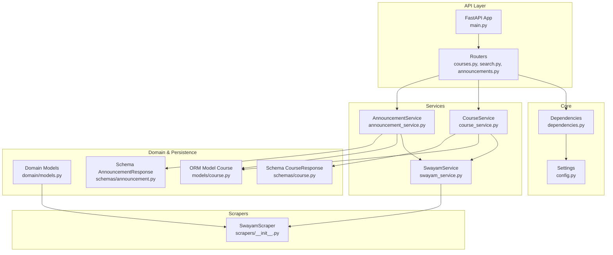
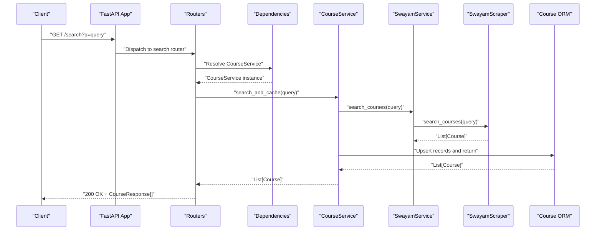
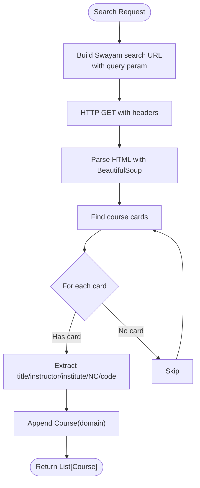
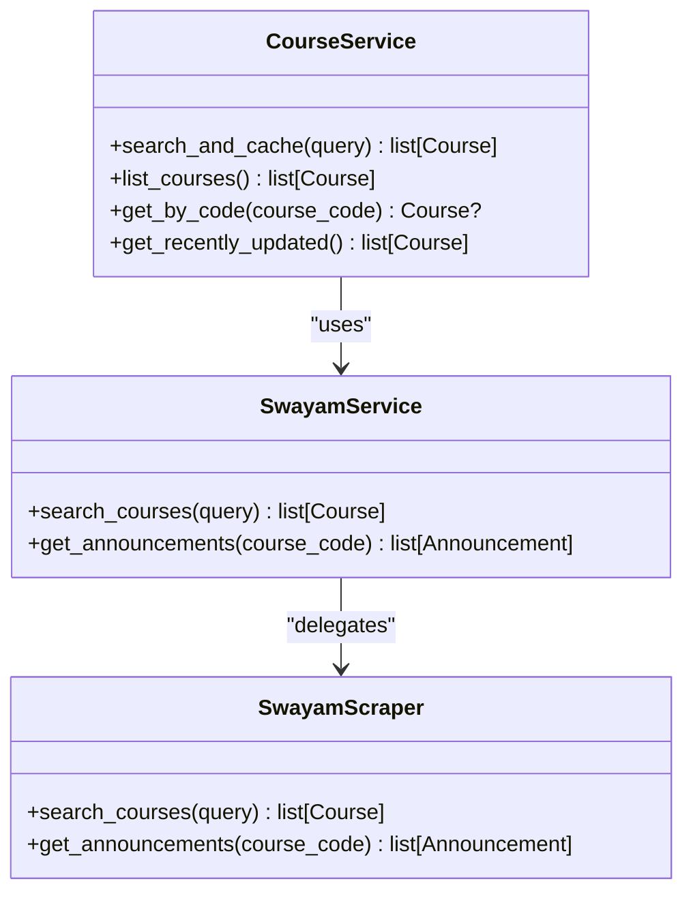
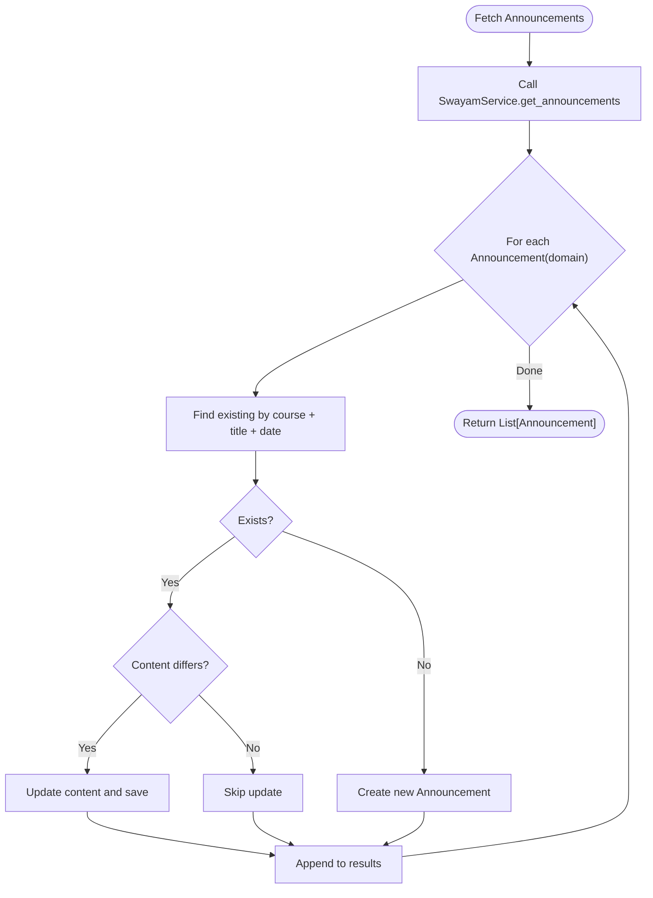
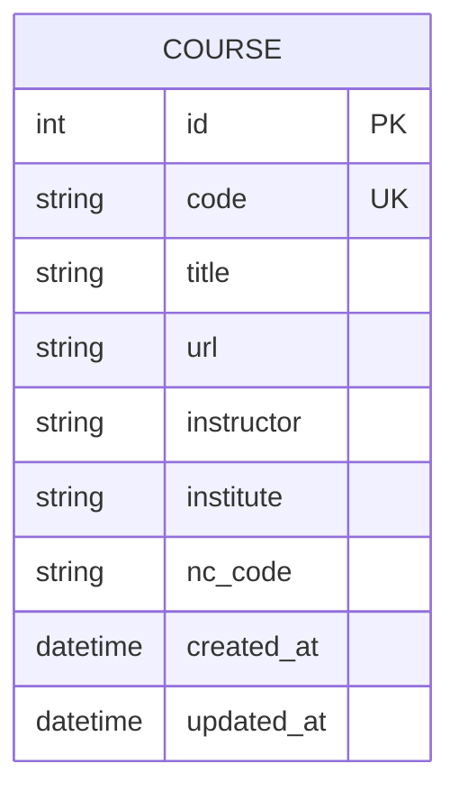
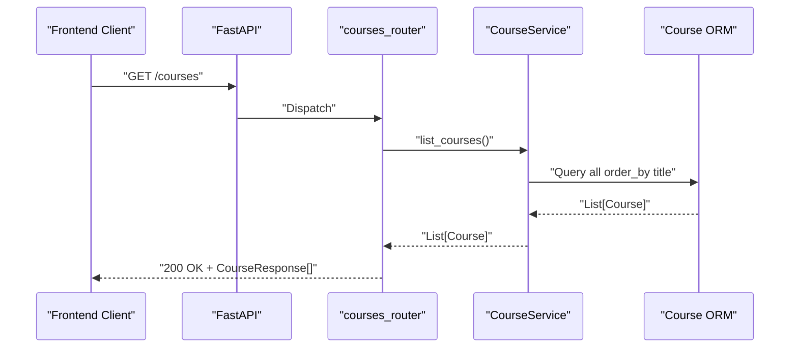
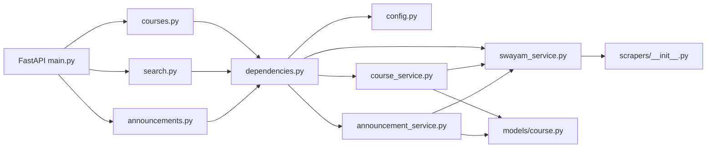

# Course Management

<cite>
**Referenced Files in This Document**
- [README.md](file://notice-reminders/README.md)
- [main.py](file://notice-reminders/app/api/main.py)
- [dependencies.py](file://notice-reminders/app/core/dependencies.py)
- [config.py](file://notice-reminders/app/core/config.py)
- [models.py](file://notice-reminders/app/domain/models.py)
- [course.py](file://notice-reminders/app/models/course.py)
- [schemas_course.py](file://notice-reminders/app/schemas/course.py)
- [schemas_announcement.py](file://notice-reminders/app/schemas/announcement.py)
- [swayam_service.py](file://notice-reminders/app/services/swayam_service.py)
- [course_service.py](file://notice-reminders/app/services/course_service.py)
- [announcement_service.py](file://notice-reminders/app/services/announcement_service.py)
- [courses_router.py](file://notice-reminders/app/api/routers/courses.py)
- [search_router.py](file://notice-reminders/app/api/routers/search.py)
- [announcements_router.py](file://notice-reminders/app/api/routers/announcements.py)
- [scraper_init.py](file://notice-reminders/app/scrapers/__init__.py)
- [api.ts](file://website/lib/api.ts)
</cite>

## Table of Contents
1. [Introduction](#introduction)
2. [Project Structure](#project-structure)
3. [Core Components](#core-components)
4. [Architecture Overview](#architecture-overview)
5. [Detailed Component Analysis](#detailed-component-analysis)
6. [Dependency Analysis](#dependency-analysis)
7. [Performance Considerations](#performance-considerations)
8. [Troubleshooting Guide](#troubleshooting-guide)
9. [Conclusion](#conclusion)
10. [Appendices](#appendices)

## Introduction
This document describes the course management system with a focus on course discovery for Swayam and NPTEL platforms. It explains the web scraping integration, course data parsing, the service layer, data normalization, caching strategies, search and filtering capabilities, pagination, API endpoints, request/response schemas, and integration patterns with external platforms. It also provides examples of course data structures and service usage patterns.

## Project Structure
The course management system resides in the notice-reminders package and exposes:
- A FastAPI backend with routers for courses, search, and announcements
- A service layer that orchestrates scraping and persistence
- Domain models for course and announcement data
- Pydantic schemas for API serialization
- Scrapers for Swayam/NPTEL course discovery and announcements

**Diagram sources**
- [main.py](file://notice-reminders/app/api/main.py#L17-L46)
- [dependencies.py](file://notice-reminders/app/core/dependencies.py#L17-L35)
- [config.py](file://notice-reminders/app/core/config.py#L4-L32)
- [course_service.py](file://notice-reminders/app/services/course_service.py#L12-L66)
- [announcement_service.py](file://notice-reminders/app/services/announcement_service.py#L12-L45)
- [swayam_service.py](file://notice-reminders/app/services/swayam_service.py#L11-L25)
- [models.py](file://notice-reminders/app/domain/models.py#L7-L34)
- [course.py](file://notice-reminders/app/models/course.py#L7-L22)
- [schemas_course.py](file://notice-reminders/app/schemas/course.py#L6-L19)
- [schemas_announcement.py](file://notice-reminders/app/schemas/announcement.py#L6-L16)
- [scraper_init.py](file://notice-reminders/app/scrapers/__init__.py#L14-L170)
- [courses_router.py](file://notice-reminders/app/api/routers/courses.py#L1-L32)
- [search_router.py](file://notice-reminders/app/api/routers/search.py#L1-L17)
- [announcements_router.py](file://notice-reminders/app/api/routers/announcements.py#L1-L32)

**Section sources**
- [README.md](file://notice-reminders/README.md#L1-L56)
- [main.py](file://notice-reminders/app/api/main.py#L17-L46)

## Core Components
- Domain models define lightweight course and announcement entities used during scraping and processing.
- ORM model persists normalized course records with indexing and timestamps.
- Pydantic schemas define API response shapes for clients.
- Services encapsulate business logic: course search and caching, announcement retrieval and deduplication, and integration with scrapers.
- Scrapers handle HTTP requests and HTML parsing for Swayam and NPTEL.
- Routers expose REST endpoints for listing/searching courses and retrieving course announcements.

Key responsibilities:
- Course discovery: search courses via Swayam/NPTEL and normalize into ORM records
- Data normalization: update existing records or insert new ones; maintain consistency
- Caching: TTL-based filtering for recently updated courses
- Announcement retrieval: fetch and de-duplicate announcements per course
- API exposure: list, retrieve, search, and announcement listing endpoints

**Section sources**
- [models.py](file://notice-reminders/app/domain/models.py#L7-L34)
- [course.py](file://notice-reminders/app/models/course.py#L7-L22)
- [schemas_course.py](file://notice-reminders/app/schemas/course.py#L6-L19)
- [schemas_announcement.py](file://notice-reminders/app/schemas/announcement.py#L6-L16)
- [course_service.py](file://notice-reminders/app/services/course_service.py#L12-L66)
- [announcement_service.py](file://notice-reminders/app/services/announcement_service.py#L12-L45)
- [swayam_service.py](file://notice-reminders/app/services/swayam_service.py#L11-L25)
- [scraper_init.py](file://notice-reminders/app/scrapers/__init__.py#L14-L170)
- [courses_router.py](file://notice-reminders/app/api/routers/courses.py#L1-L32)
- [search_router.py](file://notice-reminders/app/api/routers/search.py#L1-L17)
- [announcements_router.py](file://notice-reminders/app/api/routers/announcements.py#L1-L32)

## Architecture Overview
The system follows a layered architecture:
- Presentation: FastAPI routers
- Application: Service layer orchestrating scraping and persistence
- Domain: Lightweight dataclasses for course and announcement
- Infrastructure: Scrapers and ORM models

**Diagram sources**
- [main.py](file://notice-reminders/app/api/main.py#L17-L46)
- [search_router.py](file://notice-reminders/app/api/routers/search.py#L10-L17)
- [dependencies.py](file://notice-reminders/app/core/dependencies.py#L22-L35)
- [course_service.py](file://notice-reminders/app/services/course_service.py#L17-L53)
- [swayam_service.py](file://notice-reminders/app/services/swayam_service.py#L18-L20)
- [scraper_init.py](file://notice-reminders/app/scrapers/__init__.py#L38-L48)
- [course.py](file://notice-reminders/app/models/course.py#L7-L22)

## Detailed Component Analysis

### Course Discovery and Web Scraping (Swayam/NPTEL)
- The scraper targets Swayam’s course search endpoint and NPTEL’s announcements pages.
- It parses course cards to extract title, instructor, institution, NC code, and course code.
- It retrieves announcements for a given course code, handling alternate NPTEL domains.

**Diagram sources**
- [scraper_init.py](file://notice-reminders/app/scrapers/__init__.py#L38-L101)

**Section sources**
- [scraper_init.py](file://notice-reminders/app/scrapers/__init__.py#L14-L170)

### Course Service Layer
- Provides search and cache orchestration, listing, lookup by code, and recent updates filtering.
- Normalizes scraped data into ORM records, updating fields if changed and inserting new records otherwise.

**Diagram sources**
- [course_service.py](file://notice-reminders/app/services/course_service.py#L12-L66)
- [swayam_service.py](file://notice-reminders/app/services/swayam_service.py#L11-L25)
- [scraper_init.py](file://notice-reminders/app/scrapers/__init__.py#L14-L170)

**Section sources**
- [course_service.py](file://notice-reminders/app/services/course_service.py#L12-L66)
- [swayam_service.py](file://notice-reminders/app/services/swayam_service.py#L11-L25)

### Announcement Service and Data Normalization
- Fetches announcements for a course and upserts them into the ORM.
- Deduplicates by course + title + date; updates content if changed.

**Diagram sources**
- [announcement_service.py](file://notice-reminders/app/services/announcement_service.py#L17-L41)
- [swayam_service.py](file://notice-reminders/app/services/swayam_service.py#L22-L24)
- [scraper_init.py](file://notice-reminders/app/scrapers/__init__.py#L103-L169)

**Section sources**
- [announcement_service.py](file://notice-reminders/app/services/announcement_service.py#L12-L45)
- [swayam_service.py](file://notice-reminders/app/services/swayam_service.py#L11-L25)

### Data Models and Schemas
- Domain models: lightweight entities for course and announcement used during scraping and processing.
- ORM model: persistent representation of a course with indexed code and timestamps.
- Schemas: Pydantic models for API responses.

**Diagram sources**
- [course.py](file://notice-reminders/app/models/course.py#L7-L22)

**Section sources**
- [models.py](file://notice-reminders/app/domain/models.py#L7-L34)
- [course.py](file://notice-reminders/app/models/course.py#L7-L22)
- [schemas_course.py](file://notice-reminders/app/schemas/course.py#L6-L19)
- [schemas_announcement.py](file://notice-reminders/app/schemas/announcement.py#L6-L16)

### API Endpoints and Usage Patterns
- List all courses
- Get a course by code
- Search courses (Swayam)
- List announcements for a course

**Diagram sources**
- [courses_router.py](file://notice-reminders/app/api/routers/courses.py#L10-L15)
- [course_service.py](file://notice-reminders/app/services/course_service.py#L55-L56)
- [course.py](file://notice-reminders/app/models/course.py#L7-L22)

**Section sources**
- [courses_router.py](file://notice-reminders/app/api/routers/courses.py#L1-L32)
- [search_router.py](file://notice-reminders/app/api/routers/search.py#L1-L17)
- [announcements_router.py](file://notice-reminders/app/api/routers/announcements.py#L1-L32)
- [api.ts](file://website/lib/api.ts#L75-L96)

### Course Data Structures and Examples
- Domain Course: title, url, code, instructor, institute, nc_code
- Domain Announcement: title, date, content
- ORM Course: id, code (unique/indexed), title, url, instructor, institute, nc_code, created_at, updated_at
- API CourseResponse: id, code, title, url, instructor, institute, nc_code, created_at, updated_at
- API AnnouncementResponse: id, course_id, title, date, content, fetched_at

Usage pattern examples:
- Search courses: call search endpoint with query; receive normalized CourseResponse[]
- Retrieve announcements: call announcements endpoint for a course code; receive AnnouncementResponse[]

**Section sources**
- [models.py](file://notice-reminders/app/domain/models.py#L7-L34)
- [course.py](file://notice-reminders/app/models/course.py#L7-L22)
- [schemas_course.py](file://notice-reminders/app/schemas/course.py#L6-L19)
- [schemas_announcement.py](file://notice-reminders/app/schemas/announcement.py#L6-L16)
- [api.ts](file://website/lib/api.ts#L75-L96)

## Dependency Analysis
The dependency graph shows how the API depends on routers, which depend on services resolved via dependency injection. Services depend on SwayamService, which depends on SwayamScraper. CourseService persists data via ORM; AnnouncementService persists announcements.

**Diagram sources**
- [main.py](file://notice-reminders/app/api/main.py#L17-L46)
- [dependencies.py](file://notice-reminders/app/core/dependencies.py#L17-L75)
- [course_service.py](file://notice-reminders/app/services/course_service.py#L12-L66)
- [announcement_service.py](file://notice-reminders/app/services/announcement_service.py#L12-L45)
- [swayam_service.py](file://notice-reminders/app/services/swayam_service.py#L11-L25)
- [scraper_init.py](file://notice-reminders/app/scrapers/__init__.py#L14-L170)
- [course.py](file://notice-reminders/app/models/course.py#L7-L22)

**Section sources**
- [dependencies.py](file://notice-reminders/app/core/dependencies.py#L17-L75)
- [course_service.py](file://notice-reminders/app/services/course_service.py#L12-L66)
- [announcement_service.py](file://notice-reminders/app/services/announcement_service.py#L12-L45)
- [swayam_service.py](file://notice-reminders/app/services/swayam_service.py#L11-L25)
- [scraper_init.py](file://notice-reminders/app/scrapers/__init__.py#L14-L170)

## Performance Considerations
- Caching strategy: Recently updated courses are filtered using a time-to-live window derived from settings, reducing repeated scraping for unchanged records.
- Upsert efficiency: CourseService updates only changed fields and inserts new records, minimizing unnecessary writes.
- Pagination: Current endpoints return full lists; adding pagination would reduce payload sizes and improve responsiveness for large datasets.
- Concurrency: Scraping uses asynchronous HTTP client; ensure rate limiting and backoff to avoid overloading external sites.
- Indexing: Course code is indexed for efficient lookups; consider additional indexes for frequently queried fields.

**Section sources**
- [config.py](file://notice-reminders/app/core/config.py#L12-L12)
- [course_service.py](file://notice-reminders/app/services/course_service.py#L61-L65)

## Troubleshooting Guide
- Course not found: API returns 404 when retrieving a course by code that does not exist.
- External site changes: Scrapers rely on HTML structure; if selectors change, parsing will fail. Review and update selectors in the scraper.
- Network errors: Scrapers use an explicit User-Agent and follow redirects; ensure network connectivity and headers remain valid.
- Announcement retrieval: Alternate NPTEL domain is handled automatically; if still failing, verify course code correctness and external availability.

**Section sources**
- [courses_router.py](file://notice-reminders/app/api/routers/courses.py#L24-L29)
- [scraper_init.py](file://notice-reminders/app/scrapers/__init__.py#L103-L117)

## Conclusion
The course management system integrates Swayam and NPTEL scraping with a robust service layer, ORM-backed persistence, and clean API endpoints. Course discovery, normalization, and caching are implemented to keep data fresh while minimizing redundant work. Extending the system with pagination, richer filters, and improved error resilience will further enhance usability and reliability.

## Appendices

### API Endpoints Summary
- GET /courses
  - Description: List all courses
  - Response: Array of CourseResponse
- GET /courses/{course_code}
  - Description: Get a course by code
  - Response: CourseResponse
  - Error: 404 if not found
- GET /search?q={query}
  - Description: Search courses by query
  - Response: Array of CourseResponse
- GET /courses/{course_code}/announcements
  - Description: List announcements for a course
  - Response: Array of AnnouncementResponse

**Section sources**
- [courses_router.py](file://notice-reminders/app/api/routers/courses.py#L10-L31)
- [search_router.py](file://notice-reminders/app/api/routers/search.py#L10-L16)
- [announcements_router.py](file://notice-reminders/app/api/routers/announcements.py#L15-L31)
- [api.ts](file://website/lib/api.ts#L75-L96)