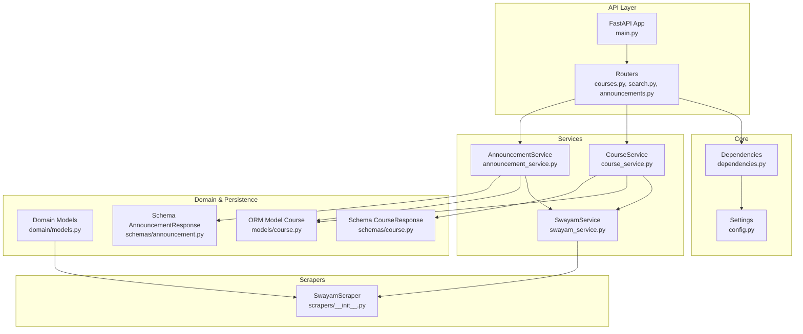
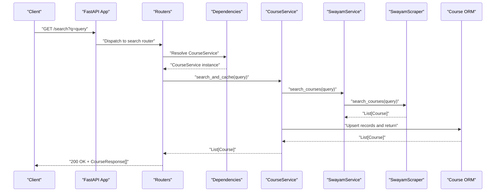
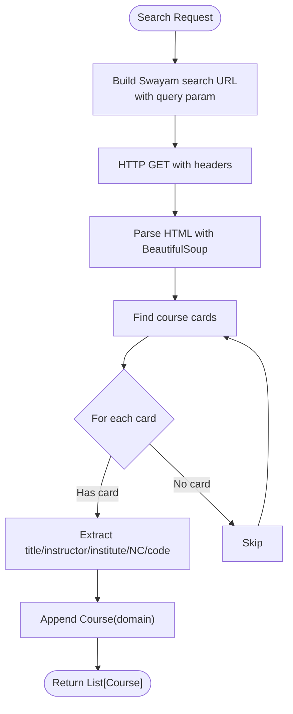
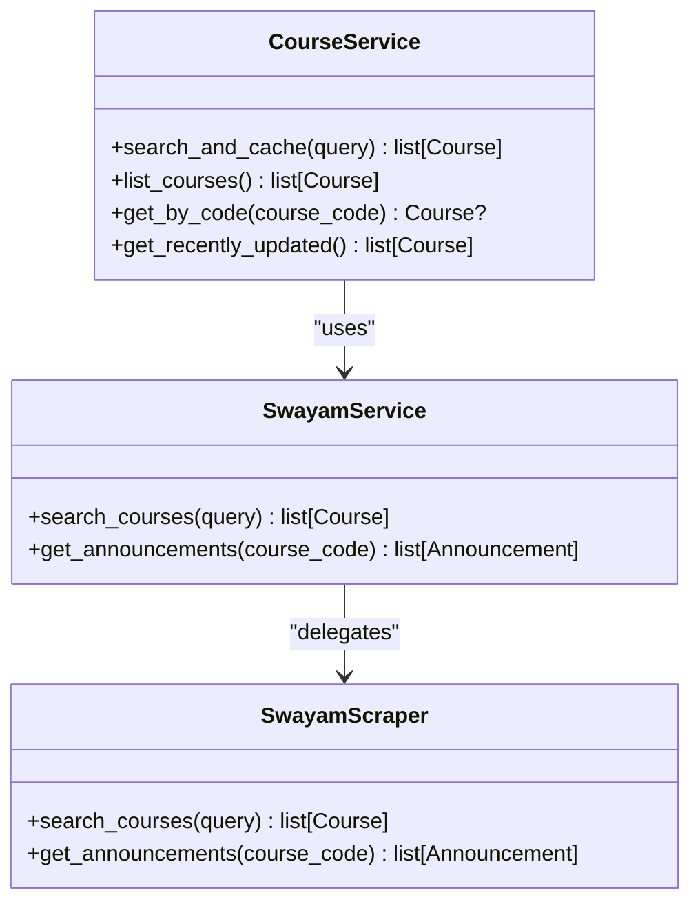
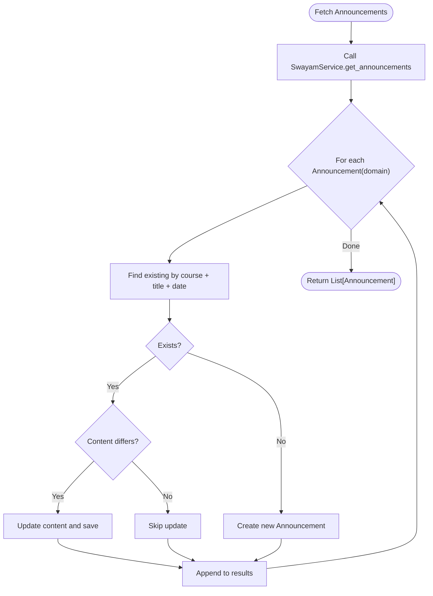
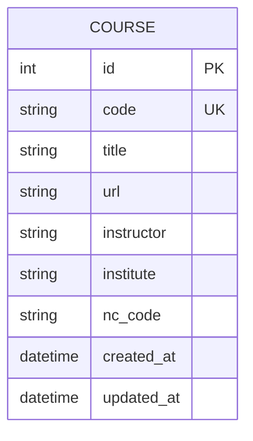
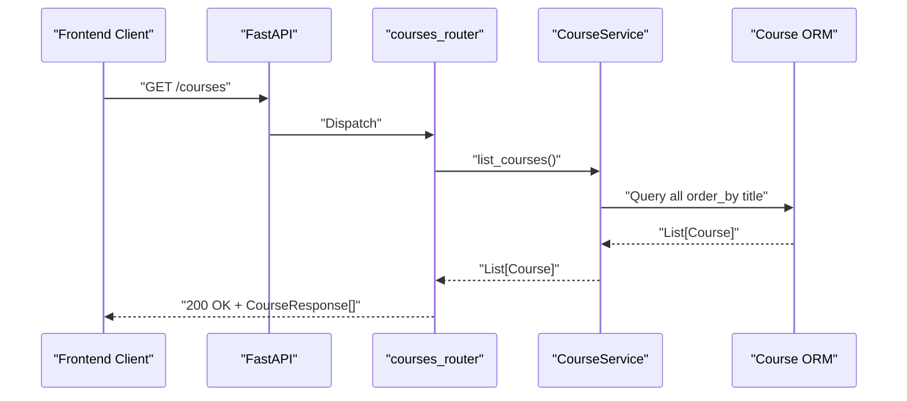
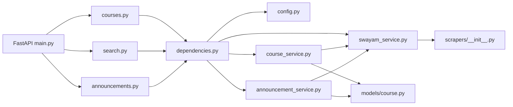

# Course management

## Introduction
This page describes the course management system with a focus on course discovery for Swayam and NPTEL platforms. It explains the web scraping integration, course data parsing, the service layer, data normalization, caching strategies, search and filtering capabilities, pagination, API endpoints, request/response schemas, and integration patterns with external platforms. It also provides examples of course data structures and service usage patterns.

## Project structure
The course management system resides in the notice-reminders package and exposes:
- A FastAPI backend with routers for courses, search, and announcements
- A service layer that orchestrates scraping and persistence
- Domain models for course and announcement data
- Pydantic schemas for API serialization
- Scrapers for Swayam/NPTEL course discovery and announcements

```mermaid
graph TB
subgraph "API Layer"
R1["Routers<br/>courses.py, search.py, announcements.py"]
APP["FastAPI App<br/>main.py"]
end
subgraph "Core"
DEPS["Dependencies<br/>dependencies.py"]
CFG["Settings<br/>config.py"]
end
subgraph "Services"
CSVC["CourseService<br/>course_service.py"]
ASVC["AnnouncementService<br/>announcement_service.py"]
SSVC["SwayamService<br/>swayam_service.py"]
end
subgraph "Domain & Persistence"
DOM["Domain Models<br/>domain/models.py"]
MODEL_COURSE["ORM Model Course<br/>models/course.py"]
SCHEMA_COURSE["Schema CourseResponse<br/>schemas/course.py"]
SCHEMA_ANN["Schema AnnouncementResponse<br/>schemas/announcement.py"]
end
subgraph "Scrapers"
SCR["SwayamScraper<br/>scrapers/__init__.py"]
end
APP --> R1
R1 --> DEPS
DEPS --> CFG
R1 --> CSVC
R1 --> ASVC
CSVC --> SSVC
ASVC --> SSVC
SSVC --> SCR
CSVC --> MODEL_COURSE
ASVC --> MODEL_COURSE
CSVC --> SCHEMA_COURSE
ASVC --> SCHEMA_ANN
DOM --> SCR
```

## Core components
- Domain models define lightweight course and announcement entities used during scraping and processing.
- ORM model persists normalized course records with indexing and timestamps.
- Pydantic schemas define API response shapes for clients.
- Services encapsulate business logic: course search and caching, announcement retrieval and deduplication, and integration with scrapers.
- Scrapers handle HTTP requests and HTML parsing for Swayam and NPTEL.
- Routers expose REST endpoints for listing/searching courses and retrieving course announcements.

Key responsibilities:
- Course discovery: search courses via Swayam/NPTEL and normalize into ORM records
- Data normalization: update existing records or insert new ones; maintain consistency
- Caching: TTL-based filtering for recently updated courses
- Announcement retrieval: fetch and de-duplicate announcements per course
- API exposure: list, retrieve, search, and announcement listing endpoints

## Architecture overview
The system follows a layered architecture:
- Presentation: FastAPI routers
- Application: Service layer orchestrating scraping and persistence
- Domain: Lightweight dataclasses for course and announcement
- Infrastructure: Scrapers and ORM models

```mermaid
sequenceDiagram
participant Client as "Client"
participant API as "FastAPI App"
participant Router as "Routers"
participant Dep as "Dependencies"
participant Svc as "CourseService"
participant SwSvc as "SwayamService"
participant Scraper as "SwayamScraper"
participant ORM as "Course ORM"
Client->>API : "GET /search?q=query"
API->>Router : "Dispatch to search router"
Router->>Dep : "Resolve CourseService"
Dep-->>Router : "CourseService instance"
Router->>Svc : "search_and_cache(query)"
Svc->>SwSvc : "search_courses(query)"
SwSvc->>Scraper : "search_courses(query)"
Scraper-->>SwSvc : "List[Course]"
Svc->>ORM : "Upsert records and return"
ORM-->>Svc : "List[Course]"
Svc-->>Router : "List[Course]"
Router-->>Client : "200 OK + CourseResponse[]"
```

## Detailed component analysis

### Course discovery and web scraping (swayam/NPTEL)
- The scraper targets Swayam's course search endpoint and NPTEL's announcements pages.
- It parses course cards to extract title, instructor, institution, NC code, and course code.
- It retrieves announcements for a given course code, handling alternate NPTEL domains.

```mermaid
flowchart TD
Start(["Search Request"]) --> BuildURL["Build Swayam search URL<br/>with query param"]
BuildURL --> HTTPReq["HTTP GET with headers"]
HTTPReq --> ParseHTML["Parse HTML with BeautifulSoup"]
ParseHTML --> ExtractCards["Find course cards"]
ExtractCards --> ForEachCard{"For each card"}
ForEachCard --> |Has card| ExtractFields["Extract title/instructor/institute/NC/code"]
ExtractFields --> AddToResult["Append Course(domain)"]
ForEachCard --> |No card| NextCard["Skip"]
NextCard --> ExtractCards
AddToResult --> Done(["Return List[Course]"])
```

### Course service layer
- Provides search and cache orchestration, listing, lookup by code, and recent updates filtering.
- Normalizes scraped data into ORM records, updating fields if changed and inserting new records otherwise.

```mermaid
classDiagram
class CourseService {
+search_and_cache(query) list[Course]
+list_courses() list[Course]
+get_by_code(course_code) Course?
+get_recently_updated() list[Course]
}
class SwayamService {
+search_courses(query) list[Course]
+get_announcements(course_code) list[Announcement]
}
class SwayamScraper {
+search_courses(query) list[Course]
+get_announcements(course_code) list[Announcement]
}
CourseService --> SwayamService : "uses"
SwayamService --> SwayamScraper : "delegates"
```

### Announcement service and data normalization
- Fetches announcements for a course and upserts them into the ORM.
- Deduplicates by course + title + date; updates content if changed.

```mermaid
flowchart TD
Start(["Fetch Announcements"]) --> CallAPI["Call SwayamService.get_announcements"]
CallAPI --> ForItem{"For each Announcement(domain)"}
ForItem --> FindExisting["Find existing by course + title + date"]
FindExisting --> Exists{"Exists?"}
Exists --> |Yes| CompareContent{"Content differs?"}
CompareContent --> |Yes| UpdateContent["Update content and save"]
CompareContent --> |No| Skip["Skip update"]
Exists --> |No| CreateNew["Create new Announcement"]
UpdateContent --> Store["Append to results"]
Skip --> Store
CreateNew --> Store
Store --> ForItem
ForItem --> |Done| Return(["Return List[Announcement]"])
```

### Data models and schemas
- Domain models: lightweight entities for course and announcement used during scraping and processing.
- ORM model: persistent representation of a course with indexed code and timestamps.
- Schemas: Pydantic models for API responses.

```mermaid
erDiagram
COURSE {
int id PK
string code UK
string title
string url
string instructor
string institute
string nc_code
datetime created_at
datetime updated_at
}
```

### API endpoints and usage patterns
- List all courses
- Get a course by code
- Search courses (Swayam)
- List announcements for a course

```mermaid
sequenceDiagram
participant FE as "Frontend Client"
participant API as "FastAPI"
participant Router as "courses_router"
participant Svc as "CourseService"
participant ORM as "Course ORM"
FE->>API : "GET /courses"
API->>Router : "Dispatch"
Router->>Svc : "list_courses()"
Svc->>ORM : "Query all order_by title"
ORM-->>Svc : "List[Course]"
Svc-->>Router : "List[Course]"
Router-->>FE : "200 OK + CourseResponse[]"
```

### Course data structures and examples
- Domain Course: title, url, code, instructor, institute, nc_code
- Domain Announcement: title, date, content
- ORM Course: id, code (unique/indexed), title, url, instructor, institute, nc_code, created_at, updated_at
- API CourseResponse: id, code, title, url, instructor, institute, nc_code, created_at, updated_at
- API AnnouncementResponse: id, course_id, title, date, content, fetched_at

Usage pattern examples:
- Search courses: call search endpoint with query; receive normalized CourseResponse[]
- Retrieve announcements: call announcements endpoint for a course code; receive AnnouncementResponse[]

## Dependency analysis
The dependency graph shows how the API depends on routers, which depend on services resolved via dependency injection. Services depend on SwayamService, which depends on SwayamScraper. CourseService persists data via ORM; AnnouncementService persists announcements.

```mermaid
graph LR
API["FastAPI main.py"] --> R_Courses["courses.py"]
API --> R_Search["search.py"]
API --> R_Ann["announcements.py"]
R_Courses --> Deps["dependencies.py"]
R_Search --> Deps
R_Ann --> Deps
Deps --> Settings["config.py"]
Deps --> Svc_Course["course_service.py"]
Deps --> Svc_Ann["announcement_service.py"]
Deps --> Svc_Swayam["swayam_service.py"]
Svc_Course --> ORM["models/course.py"]
Svc_Ann --> ORM
Svc_Course --> Svc_Swayam
Svc_Ann --> Svc_Swayam
Svc_Swayam --> Scraper["scrapers/__init__.py"]
```

## Performance considerations
- Caching strategy: Recently updated courses are filtered using a time-to-live window derived from settings, reducing repeated scraping for unchanged records.
- Upsert efficiency: CourseService updates only changed fields and inserts new records, minimizing unnecessary writes.
- Pagination: Current endpoints return full lists; adding pagination would reduce payload sizes and improve responsiveness for large datasets.
- Concurrency: Scraping uses asynchronous HTTP client; ensure rate limiting and backoff to avoid overloading external sites.
- Indexing: Course code is indexed for efficient lookups; consider additional indexes for frequently queried fields.

## Troubleshooting guide
- Course not found: API returns 404 when retrieving a course by code that does not exist.
- External site changes: Scrapers rely on HTML structure; if selectors change, parsing will fail. Review and update selectors in the scraper.
- Network errors: Scrapers use an explicit User-Agent and follow redirects; ensure network connectivity and headers remain valid.
- Announcement retrieval: Alternate NPTEL domain is handled automatically; if still failing, verify course code correctness and external availability.

## Conclusion
The course management system integrates Swayam and NPTEL scraping with a reliable service layer, ORM-backed persistence, and clean API endpoints. Course discovery, normalization, and caching are implemented to keep data fresh while minimizing redundant work. Extending the system with pagination, richer filters, and improved error resilience will further improve usability and reliability.

## Appendices

### API endpoints summary
- GET /courses
  - Description: List all courses
  - Response: Array of CourseResponse
- GET /courses/{course_code}
  - Description: Get a course by code
  - Response: CourseResponse
  - Error: 404 if not found
- GET /search?q={query}
  - Description: Search courses by query
  - Response: Array of CourseResponse
- GET /courses/{course_code}/announcements
  - Description: List announcements for a course
  - Response: Array of AnnouncementResponse
