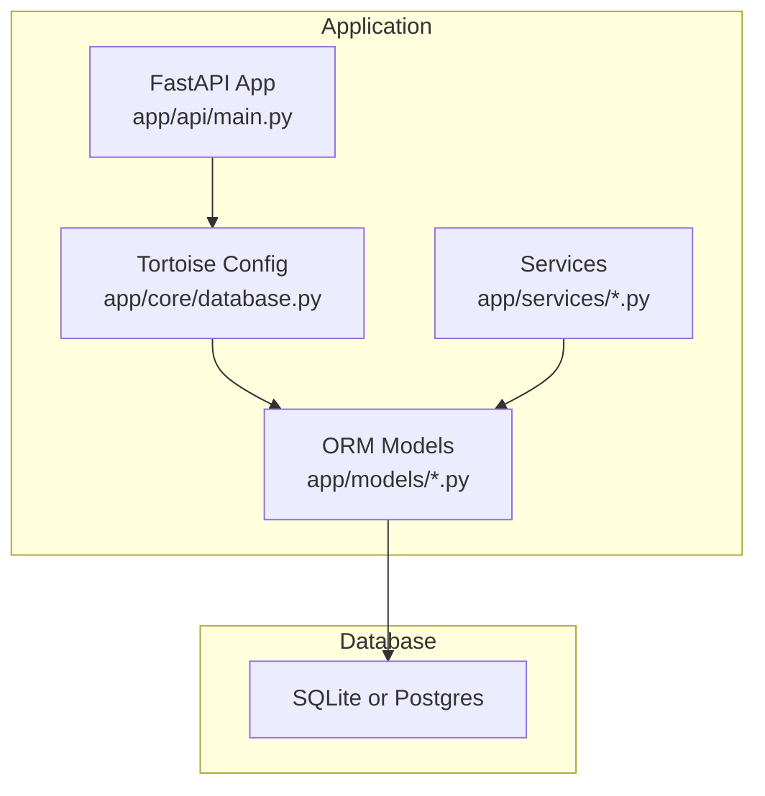
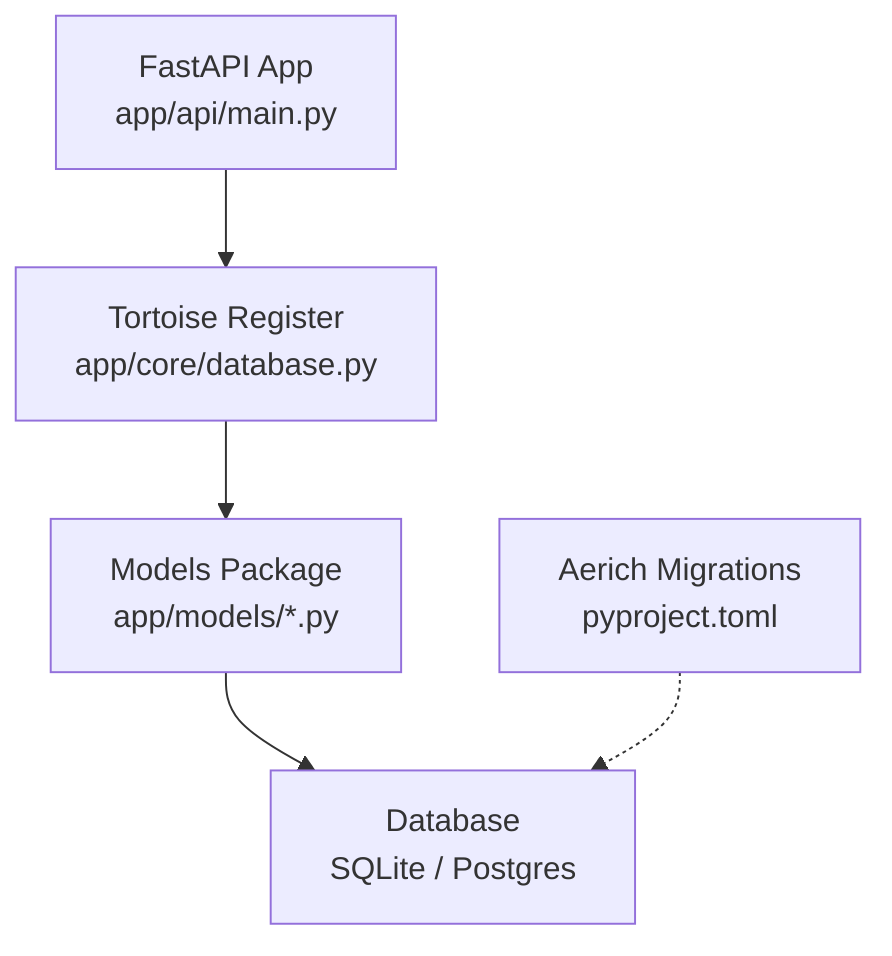
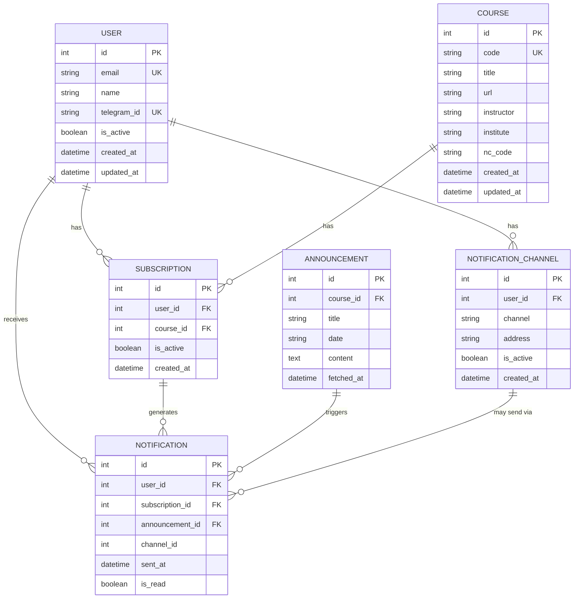
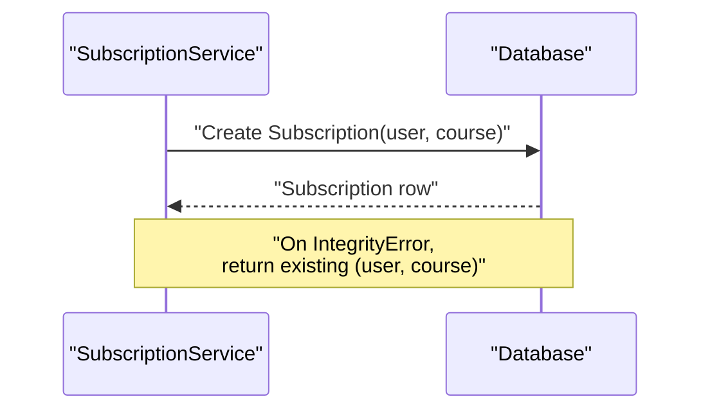
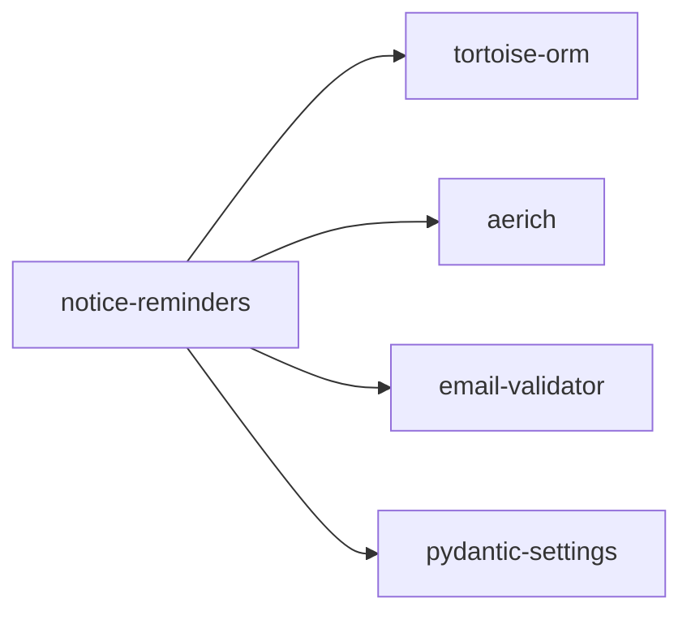

# Data models and database schema

## Introduction
This page describes the data models and database schema used by the notice-reminders application. It focuses on the persistent entities (User, Course, Announcement, Subscription, Notification, and NotificationChannel), their relationships, constraints, indexes, and validation rules. It also explains the Tortoise ORM configuration, how migrations and schema generation work, and typical data access patterns via services. Business rules such as uniqueness constraints, referential integrity, and cascading behavior are documented alongside entity relationship diagrams and sample data structures.

## Project structure
The data models are defined under the models package and integrated into the FastAPI application via Tortoise ORM registration. The application supports both API and CLI modes, with the database initialized during application startup.

```mermaid
graph TB
subgraph "Application"
API["FastAPI App<br/>app/api/main.py"]
CoreDB["Tortoise Config<br/>app/core/database.py"]
Models["ORM Models<br/>app/models/*.py"]
Services["Services<br/>app/services/*.py"]
end
subgraph "Database"
DB["SQLite or Postgres"]
end
API --> CoreDB
CoreDB --> Models
Services --> Models
Models --> DB
```

## Core components
This section documents each persistent model, including fields, constraints, indexes, and relationships.

- User
  - Fields: id (primary key), email (unique, indexed), name, telegram_id (unique), is_active, created_at, updated_at
  - Indexes: email, telegram_id
  - Unique constraints: email, telegram_id
  - Notes: Uses auto timestamps for created_at and updated_at

- Course
  - Fields: id (primary key), code (unique, indexed), title, url, instructor, institute, nc_code, created_at, updated_at
  - Indexes: code
  - Unique constraints: code
  - Notes: Uses auto timestamps

- Announcement
  - Fields: id (primary key), course (foreign key to Course), title, date, content, fetched_at
  - Relationships: belongs to Course via ForeignKeyField
  - Notes: fetched_at records when the announcement was pulled from a source; uses auto timestamp

- Subscription
  - Fields: id (primary key), user (foreign key), course (foreign key), created_at, is_active
  - Relationships: belongs to User and Course via ForeignKeyField
  - Unique constraints: (user, course)
  - Notes: Uses auto timestamp

- NotificationChannel
  - Fields: id (primary key), user (foreign key), channel, address, is_active, created_at
  - Relationships: belongs to User via ForeignKeyField
  - Unique constraints: (user, channel, address)
  - Notes: Uses auto timestamp

- Notification
  - Fields: id (primary key), user (foreign key), subscription (foreign key), announcement (foreign key), channel (nullable foreign key), sent_at, is_read
  - Relationships: belongs to User, Subscription, Announcement; optionally belongs to NotificationChannel
  - Notes: Uses auto timestamp; is_read defaults to False

Validation rules and constraints observed in the models:
- String length limits enforced by CharField(max_length=N)
- Unique constraints via unique=True
- Composite unique constraints via Meta.unique_together
- Nullable fields explicitly marked null=True
- Boolean defaults set via default=value
- Auto timestamps via auto_now_add/auto_now

## Architecture overview
The application uses Tortoise ORM to define models and connect to a database. The FastAPI application registers Tortoise with a configuration that includes all model modules. SQLite is supported, and the database file path is created if it does not exist. Migrations are handled by Aerich, and schema generation is enabled in debug mode.

```mermaid
graph TB
A["FastAPI App<br/>app/api/main.py"] --> B["Tortoise Register<br/>app/core/database.py"]
B --> C["Models Package<br/>app/models/*.py"]
C --> D["Database<br/>SQLite / Postgres"]
E["Aerich Migrations<br/>pyproject.toml"] -.-> D
```

## Detailed component analysis

### Entity relationship diagram
The following ER diagram shows the relationships among the six persistent models.

```mermaid
erDiagram
USER {
int id PK
string email UK
string name
string telegram_id UK
boolean is_active
datetime created_at
datetime updated_at
}
COURSE {
int id PK
string code UK
string title
string url
string instructor
string institute
string nc_code
datetime created_at
datetime updated_at
}
ANNOUNCEMENT {
int id PK
int course_id FK
string title
string date
text content
datetime fetched_at
}
SUBSCRIPTION {
int id PK
int user_id FK
int course_id FK
boolean is_active
datetime created_at
}
NOTIFICATION_CHANNEL {
int id PK
int user_id FK
string channel
string address
boolean is_active
datetime created_at
}
NOTIFICATION {
int id PK
int user_id FK
int subscription_id FK
int announcement_id FK
int channel_id
datetime sent_at
boolean is_read
}
USER ||--o{ SUBSCRIPTION : "has"
COURSE ||--o{ SUBSCRIPTION : "has"
USER ||--o{ NOTIFICATION_CHANNEL : "has"
USER ||--o{ NOTIFICATION : "receives"
SUBSCRIPTION ||--o{ NOTIFICATION : "generates"
ANNOUNCEMENT ||--o{ NOTIFICATION : "triggers"
NOTIFICATION_CHANNEL ||--o{ NOTIFICATION : "may send via"
```

### Domain models vs ORM models
The repository defines both domain dataclasses and ORM models. The domain models are lightweight data containers for parsing and transporting data outside the persistence layer.

- Domain Course and Announcement
  - Purpose: represent parsed course and announcement data
  - Fields: title, url, code, instructor, institute, nc_code; title, date, content respectively
  - Notes: These are not mapped to the database and are separate from the ORM Course model

### User model
- Primary key: id
- Unique indexes: email, telegram_id
- Additional index: email
- Validation: email and telegram_id constrained to be unique; CharField length limits apply
- Timestamps: created_at, updated_at

### Course model
- Primary key: id
- Unique index: code
- Additional index: code
- Validation: code constrained to be unique; CharField length limits apply
- Timestamps: created_at, updated_at

### Announcement model
- Primary key: id
- Foreign key: course (to Course)
- Relationships: Announcement belongs to one Course; Course has many Announcements via related_name
- Validation: CharField length limits; fetched_at auto timestamp
- Timestamps: fetched_at

### Subscription model
- Primary key: id
- Foreign keys: user (to User), course (to Course)
- Relationships: User and Course each have many Subscriptions via related_name
- Unique constraint: (user, course) enforced by Meta.unique_together
- Validation: is_active defaults to True; timestamps via auto_now_add
- Timestamps: created_at

### NotificationChannel model
- Primary key: id
- Foreign key: user (to User)
- Relationships: User has many NotificationChannels via related_name
- Unique constraint: (user, channel, address) enforced by Meta.unique_together
- Validation: is_active defaults to True; CharField length limits
- Timestamps: created_at

### Notification model
- Primary key: id
- Foreign keys: user (to User), subscription (to Subscription), announcement (to Announcement)
- Optional foreign key: channel (to NotificationChannel)
- Relationships: Notification belongs to User, Subscription, Announcement; optionally belongs to NotificationChannel
- Validation: is_read defaults to False; sent_at auto timestamp
- Timestamps: sent_at

### Data access patterns and business rules
- User management
  - Listing, retrieving by id or email, updating attributes, deleting
  - Adding notification channels with deduplication on composite unique key
- Subscriptions
  - Creating subscriptions with upsert-like behavior on unique constraint
  - Listing all subscriptions and per-user subscriptions
- Notifications
  - Creating notifications linking a subscription and announcement, optionally a channel
  - Listing notifications globally and per user
  - Marking notifications as read

```mermaid
sequenceDiagram
participant Svc as "SubscriptionService"
participant DB as "Database"
Svc->>DB : "Create Subscription(user, course)"
DB-->>Svc : "Subscription row"
Note over Svc,DB : "On IntegrityError,<br/>return existing (user, course)"
```

### Sample data structures
Representative rows for each table based on model definitions:

- User
  - id, email, name, telegram_id, is_active, created_at, updated_at
- Course
  - id, code, title, url, instructor, institute, nc_code, created_at, updated_at
- Announcement
  - id, course_id, title, date, content, fetched_at
- Subscription
  - id, user_id, course_id, is_active, created_at
- NotificationChannel
  - id, user_id, channel, address, is_active, created_at
- Notification
  - id, user_id, subscription_id, announcement_id, channel_id?, sent_at, is_read

## Dependency analysis
External dependencies relevant to data modeling and migrations:
- tortoise-orm: ORM framework
- aerich: migration tool
- email-validator: email validation support
- pydantic-settings: settings integration

```mermaid
graph LR
A["notice-reminders"] --> B["tortoise-orm"]
A --> C["aerich"]
A --> D["email-validator"]
A --> E["pydantic-settings"]
```

## Performance considerations
- Indexes: email and telegram_id on User; code on Course; consider adding indexes on frequently filtered fields (e.g., course_id on Announcement, user_id on Subscription/NotificationChannel/Notification).
- Unique constraints: Composite unique_together on Subscription and NotificationChannel prevent duplicates and improve lookup performance.
- Auto timestamps: Reduce manual timestamp handling and ensure consistent ordering in queries.
- Query patterns: Prefer filtering by indexed fields and avoid N+1 queries by using select_related and prefetch_related where applicable.

## Troubleshooting guide
Common issues and resolutions:
- Integrity errors on creation
  - Symptom: Duplicate entries when creating Subscription or NotificationChannel
  - Resolution: Use upsert logic that catches IntegrityError and retrieves the existing record
- Database initialization
  - Symptom: Empty database or missing tables
  - Resolution: Enable schema generation in debug mode or run migrations via Aerich
- SQLite file path
  - Symptom: Database file not found
  - Resolution: Ensure the configured SQLite path exists; the application creates parent directories if needed

## Conclusion
The notice-reminders application employs a clear set of ORM models with explicit constraints and indexes to enforce data integrity and optimize common queries. The Tortoise ORM configuration integrates smoothly with FastAPI, and migrations are managed via Aerich. Services encapsulate business logic for creating, querying, and managing entities while handling uniqueness and referential integrity constraints.

## Appendices

### Database initialization and registration
- The FastAPI application loads settings and registers Tortoise with a configuration that includes all model modules.
- Schema generation is controlled by the debug setting; SQLite paths are created automatically if they do not exist.
