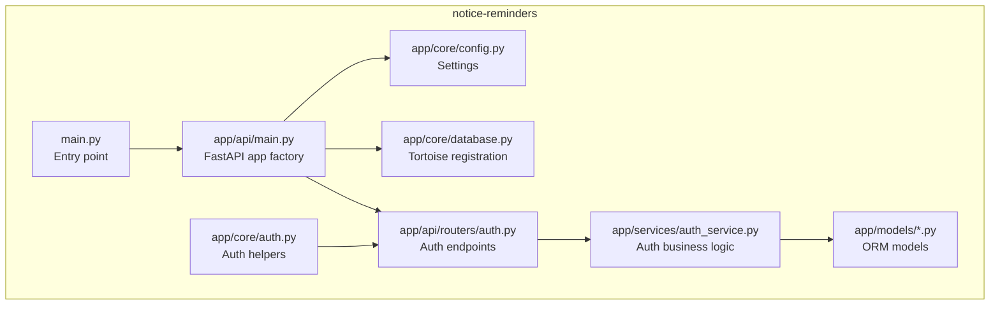
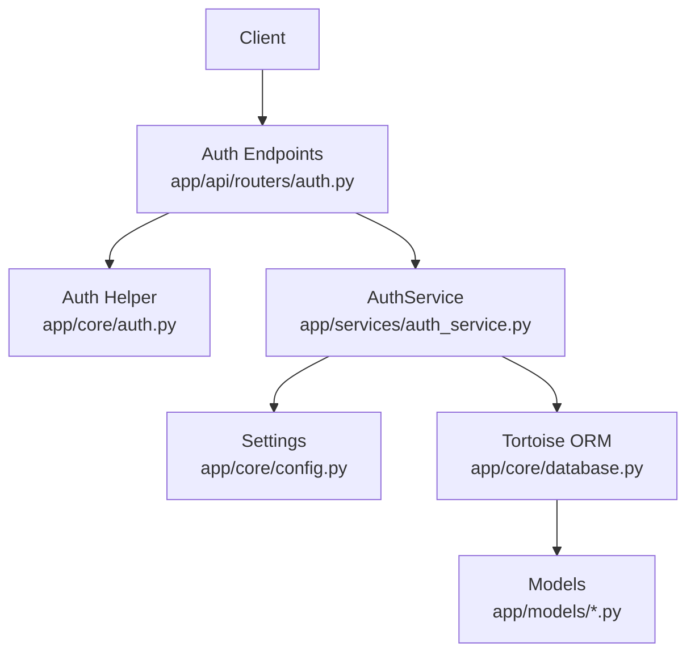
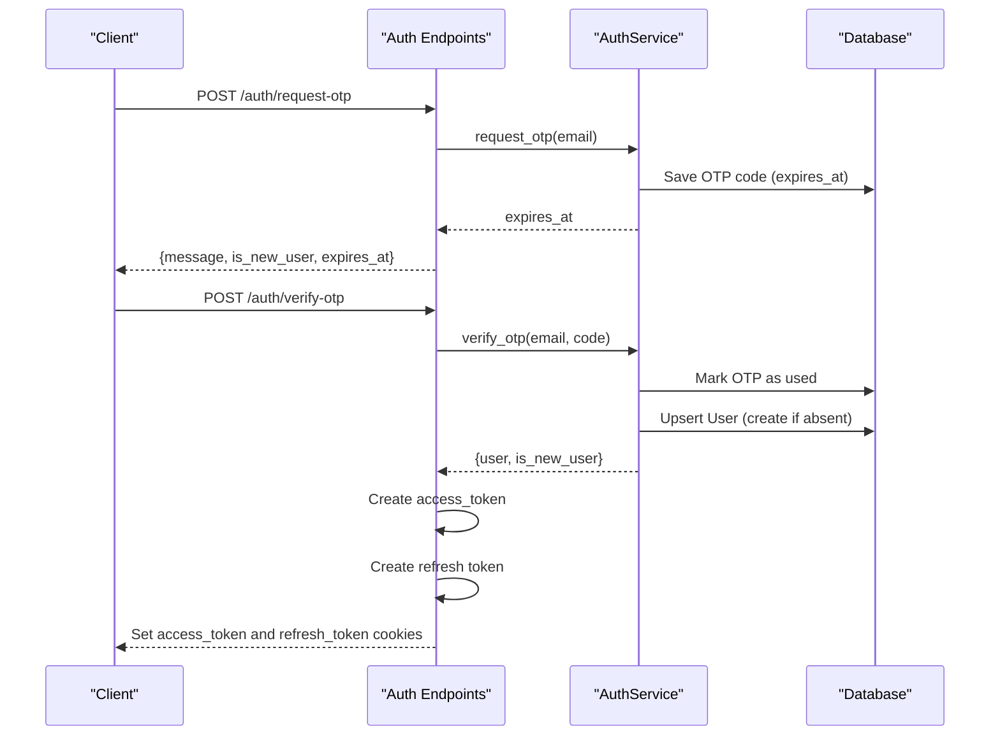
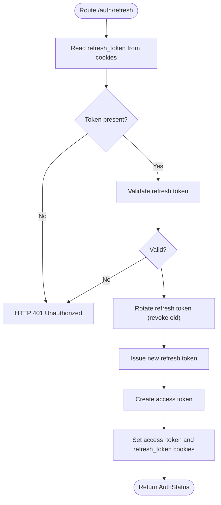
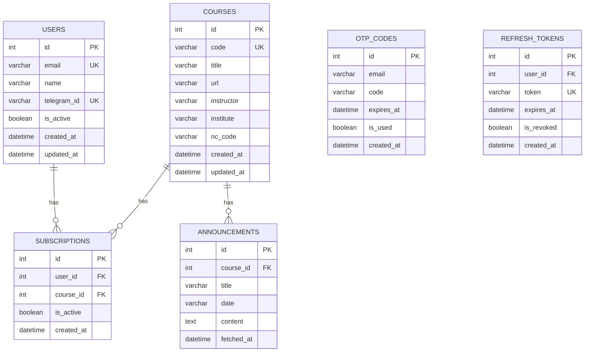
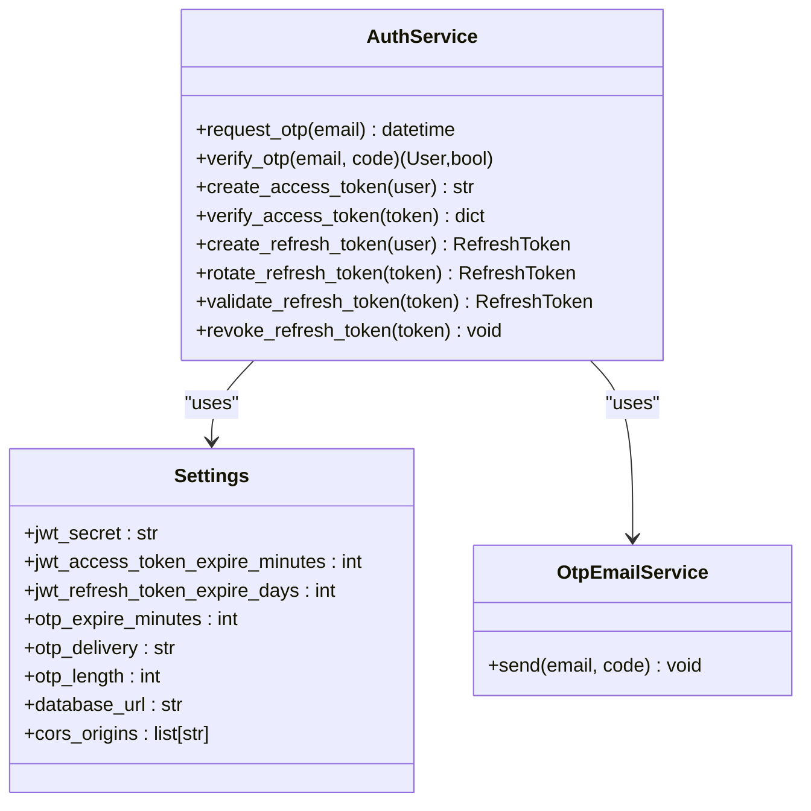
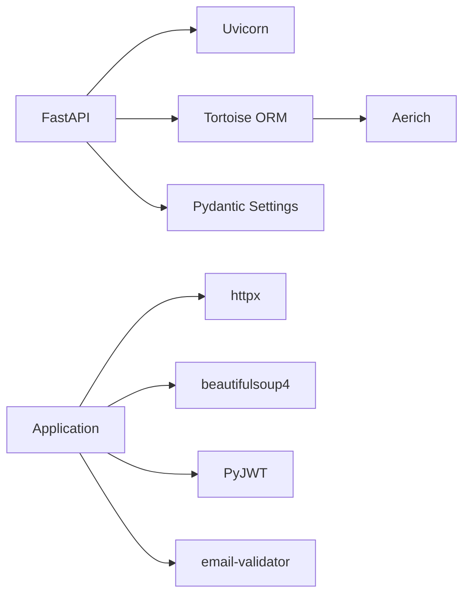

# Notice Reminders API

<cite>
**Referenced Files in This Document**
- [README.md](file://notice-reminders/README.md)
- [pyproject.toml](file://notice-reminders/pyproject.toml)
- [main.py](file://notice-reminders/main.py)
- [app/api/main.py](file://notice-reminders/app/api/main.py)
- [app/core/config.py](file://notice-reminders/app/core/config.py)
- [app/core/database.py](file://notice-reminders/app/core/database.py)
- [app/core/auth.py](file://notice-reminders/app/core/auth.py)
- [app/api/routers/auth.py](file://notice-reminders/app/api/routers/auth.py)
- [app/services/auth_service.py](file://notice-reminders/app/services/auth_service.py)
- [app/models/user.py](file://notice-reminders/app/models/user.py)
- [app/models/course.py](file://notice-reminders/app/models/course.py)
- [app/models/announcement.py](file://notice-reminders/app/models/announcement.py)
- [app/models/subscription.py](file://notice-reminders/app/models/subscription.py)
</cite>

## Table of Contents
1. [Introduction](#introduction)
2. [Project Structure](#project-structure)
3. [Core Components](#core-components)
4. [Architecture Overview](#architecture-overview)
5. [Detailed Component Analysis](#detailed-component-analysis)
6. [Dependency Analysis](#dependency-analysis)
7. [Performance Considerations](#performance-considerations)
8. [Troubleshooting Guide](#troubleshooting-guide)
9. [Conclusion](#conclusion)
10. [Appendices](#appendices)

## Introduction
This document describes the Notice Reminders API system, a FastAPI-based backend that enables users to discover MOOC courses on Swayam/NPTEL and receive timely announcements via cookie-based JWT authentication. It covers the backend architecture, database models, services layer, authentication flow, course discovery, announcement tracking, CLI tool usage, and configuration options. The system supports both API and CLI modes, with optional web scraping integration for course data.

## Project Structure
The repository is a monorepo with a shared core and multiple interfaces. The Notice Reminders API resides under the notice-reminders package and exposes:
- A FastAPI application with routers for authentication, course search, course details, announcements, subscriptions, and notifications.
- A core module for configuration, database registration, and authentication helpers.
- A models layer backed by Tortoise ORM for persistence.
- A services layer implementing business logic for authentication, course discovery, announcements, and notifications.
- A CLI entry point supporting interactive scraping without requiring a database.

**Diagram sources**
- [main.py](file://notice-reminders/main.py#L1-L71)
- [app/api/main.py](file://notice-reminders/app/api/main.py#L1-L46)
- [app/core/config.py](file://notice-reminders/app/core/config.py#L1-L32)
- [app/core/database.py](file://notice-reminders/app/core/database.py#L1-L54)
- [app/core/auth.py](file://notice-reminders/app/core/auth.py#L1-L72)
- [app/api/routers/auth.py](file://notice-reminders/app/api/routers/auth.py#L1-L126)
- [app/services/auth_service.py](file://notice-reminders/app/services/auth_service.py#L1-L128)
- [app/models/user.py](file://notice-reminders/app/models/user.py#L1-L20)
- [app/models/course.py](file://notice-reminders/app/models/course.py#L1-L22)
- [app/models/announcement.py](file://notice-reminders/app/models/announcement.py#L1-L25)
- [app/models/subscription.py](file://notice-reminders/app/models/subscription.py#L1-L28)

**Section sources**
- [README.md](file://notice-reminders/README.md#L1-L56)
- [pyproject.toml](file://notice-reminders/pyproject.toml#L1-L41)
- [main.py](file://notice-reminders/main.py#L1-L71)
- [app/api/main.py](file://notice-reminders/app/api/main.py#L1-L46)

## Core Components
- FastAPI Application Factory: Creates the app, registers CORS, includes routers, and initializes the database.
- Configuration: Centralized settings for database URL, platform base URLs, cache TTL, JWT, OTP, and optional integrations (Telegram SMTP).
- Database Registration: Configures Tortoise ORM connections and models, auto-generates SQLite if missing.
- Authentication Utilities: Extracts tokens from cookies, verifies JWT, and enforces protected routes.
- Services Layer: Implements OTP request/verify, JWT creation/verification, refresh token lifecycle, and user management.
- Data Models: Users, Courses, Announcements, Subscriptions, OTP codes, and refresh tokens.

Key responsibilities:
- API routing: Exposes endpoints for authentication, course search, course retrieval, announcements, subscriptions, and notifications.
- Persistence: Uses Tortoise ORM models to persist users, courses, announcements, subscriptions, OTP codes, and refresh tokens.
- Security: Cookie-based JWT with access and refresh tokens, CSRF-safe defaults.

**Section sources**
- [app/api/main.py](file://notice-reminders/app/api/main.py#L1-L46)
- [app/core/config.py](file://notice-reminders/app/core/config.py#L1-L32)
- [app/core/database.py](file://notice-reminders/app/core/database.py#L1-L54)
- [app/core/auth.py](file://notice-reminders/app/core/auth.py#L1-L72)
- [app/services/auth_service.py](file://notice-reminders/app/services/auth_service.py#L1-L128)
- [app/models/user.py](file://notice-reminders/app/models/user.py#L1-L20)
- [app/models/course.py](file://notice-reminders/app/models/course.py#L1-L22)
- [app/models/announcement.py](file://notice-reminders/app/models/announcement.py#L1-L25)
- [app/models/subscription.py](file://notice-reminders/app/models/subscription.py#L1-L28)

## Architecture Overview
The system follows a layered architecture:
- Presentation: FastAPI routers expose REST endpoints.
- Application: Services encapsulate business logic.
- Persistence: Tortoise ORM models and database.
- Infrastructure: Configuration, cookies, JWT, and optional external integrations.

**Diagram sources**
- [app/api/routers/auth.py](file://notice-reminders/app/api/routers/auth.py#L1-L126)
- [app/core/auth.py](file://notice-reminders/app/core/auth.py#L1-L72)
- [app/services/auth_service.py](file://notice-reminders/app/services/auth_service.py#L1-L128)
- [app/core/config.py](file://notice-reminders/app/core/config.py#L1-L32)
- [app/core/database.py](file://notice-reminders/app/core/database.py#L1-L54)
- [app/models/user.py](file://notice-reminders/app/models/user.py#L1-L20)
- [app/models/course.py](file://notice-reminders/app/models/course.py#L1-L22)
- [app/models/announcement.py](file://notice-reminders/app/models/announcement.py#L1-L25)
- [app/models/subscription.py](file://notice-reminders/app/models/subscription.py#L1-L28)

## Detailed Component Analysis

### Authentication System (OTP-based Login with JWT Cookies)
The authentication system uses:
- OTP request and verification for email-based login.
- Access token (short-lived) and refresh token (longer-lived) managed via cookies.
- Protected routes enforced by extracting and validating the access token from cookies.

**Diagram sources**
- [app/api/routers/auth.py](file://notice-reminders/app/api/routers/auth.py#L43-L76)
- [app/services/auth_service.py](file://notice-reminders/app/services/auth_service.py#L22-L59)
- [app/models/user.py](file://notice-reminders/app/models/user.py#L1-L20)
- [app/models/otp.py](file://notice-reminders/app/models/otp.py#L1-L200)
- [app/models/refresh_token.py](file://notice-reminders/app/models/refresh_token.py#L1-L200)

**Diagram sources**
- [app/api/routers/auth.py](file://notice-reminders/app/api/routers/auth.py#L78-L106)
- [app/services/auth_service.py](file://notice-reminders/app/services/auth_service.py#L81-L121)

Key implementation highlights:
- Access token creation and verification using HS256 with a secret from settings.
- Refresh token lifecycle: creation, validation, rotation, and revocation.
- Cookie policies: HttpOnly, SameSite lax, Secure based on debug mode, path "/".
- Logout endpoint revokes refresh tokens and clears cookies.

**Section sources**
- [app/api/routers/auth.py](file://notice-reminders/app/api/routers/auth.py#L1-L126)
- [app/core/auth.py](file://notice-reminders/app/core/auth.py#L1-L72)
- [app/services/auth_service.py](file://notice-reminders/app/services/auth_service.py#L1-L128)
- [app/core/config.py](file://notice-reminders/app/core/config.py#L22-L28)

### Database Models and Schema
The system persists users, courses, announcements, subscriptions, OTP codes, and refresh tokens. Below is the entity-relationship view:

**Diagram sources**
- [app/models/user.py](file://notice-reminders/app/models/user.py#L1-L20)
- [app/models/course.py](file://notice-reminders/app/models/course.py#L1-L22)
- [app/models/announcement.py](file://notice-reminders/app/models/announcement.py#L1-L25)
- [app/models/subscription.py](file://notice-reminders/app/models/subscription.py#L1-L28)
- [app/models/otp.py](file://notice-reminders/app/models/otp.py#L1-L200)
- [app/models/refresh_token.py](file://notice-reminders/app/models/refresh_token.py#L1-L200)

Notes:
- Unique constraints: email, telegram_id, course code, and refresh token ensure referential integrity.
- Foreign keys link announcements to courses and subscriptions to users/courses.

**Section sources**
- [app/models/user.py](file://notice-reminders/app/models/user.py#L1-L20)
- [app/models/course.py](file://notice-reminders/app/models/course.py#L1-L22)
- [app/models/announcement.py](file://notice-reminders/app/models/announcement.py#L1-L25)
- [app/models/subscription.py](file://notice-reminders/app/models/subscription.py#L1-L28)

### Services Layer
- AuthService: OTP generation and delivery, user upsert, JWT and refresh token management.
- Course Discovery: Swayam service integration for course search and metadata retrieval.
- Announcement Tracking: Fetches announcements per course and stores them.
- Notification Channels: Channel abstraction for future Telegram/email delivery.
- Subscription Management: CRUD operations for user-course subscriptions.

**Diagram sources**
- [app/services/auth_service.py](file://notice-reminders/app/services/auth_service.py#L1-L128)
- [app/core/config.py](file://notice-reminders/app/core/config.py#L1-L32)
- [app/services/otp_email_service.py](file://notice-reminders/app/services/otp_email_service.py#L1-L200)

**Section sources**
- [app/services/auth_service.py](file://notice-reminders/app/services/auth_service.py#L1-L128)
- [app/core/config.py](file://notice-reminders/app/core/config.py#L1-L32)

### API Endpoints Overview
- Authentication
  - POST /auth/request-otp: Initiates OTP delivery.
  - POST /auth/verify-otp: Verifies OTP and sets access/refresh cookies.
  - POST /auth/refresh: Rotates tokens using a valid refresh cookie.
  - POST /auth/logout: Revokes refresh token and clears cookies.
  - GET /auth/me: Returns authenticated user profile.
- Course Discovery
  - POST /search/courses: Searches courses on supported platforms.
  - GET /courses/{code}: Retrieves course details.
- Announcements
  - GET /courses/{code}/announcements: Lists announcements for a course.
- Subscriptions
  - GET /subscriptions: Lists user subscriptions.
  - POST /subscriptions: Creates a subscription.
  - DELETE /subscriptions/{id}: Cancels a subscription.
- Notifications
  - GET /notifications: Lists user notifications.
  - POST /notifications/deliver: Triggers delivery via configured channels.

Note: Endpoint definitions are implemented in routers under app/api/routers/*.py.

**Section sources**
- [app/api/routers/auth.py](file://notice-reminders/app/api/routers/auth.py#L1-L126)

### CLI Tool Capabilities
The CLI runs independently of the API and does not require a database. It provides:
- Interactive scraping for course discovery and announcements.
- Command-line entry via the root main.py with the "cli" subcommand.

Usage:
- Run: uv run python main.py cli

**Section sources**
- [README.md](file://notice-reminders/README.md#L33-L38)
- [main.py](file://notice-reminders/main.py#L49-L52)

## Dependency Analysis
External libraries and their roles:
- FastAPI/Uvicorn: Web framework and ASGI server.
- Tortoise ORM + Aerich: Asynchronous ORM and migrations.
- Pydantic Settings: Typed settings from environment.
- httpx, beautifulsoup4: HTTP client and HTML parsing for scraping.
- PyJWT: JWT encoding/decoding.
- python-multipart: Form parsing.
- email-validator: Email validation.

**Diagram sources**
- [pyproject.toml](file://notice-reminders/pyproject.toml#L7-L19)

**Section sources**
- [pyproject.toml](file://notice-reminders/pyproject.toml#L1-L41)

## Performance Considerations
- Caching: Platform base URLs and cache TTL are configurable; consider caching announcements and course metadata to reduce scrape frequency.
- Database: SQLite is default; for production, use a robust database engine and enable connection pooling.
- Token Lifetimes: Short-lived access tokens minimize exposure; refresh tokens are long-lived but rotated securely.
- Scraping Efficiency: Batch requests, respect robots.txt, and throttle to avoid rate limits.

## Troubleshooting Guide
Common issues and resolutions:
- Missing JWT Secret: Ensure jwt_secret is set in environment; otherwise, token operations will fail.
- Database Initialization: On first run with SQLite, the database file and schema are generated automatically if the path is valid.
- CORS Errors: Verify cors_origins matches the frontend origin.
- OTP Delivery: Configure OTP delivery method and credentials; console mode prints codes for local testing.
- Token Validation Failures: Confirm cookie presence and expiration; use refresh endpoint to obtain new tokens.

Operational checks:
- Environment variables: Load via .env using pydantic-settings.
- Database connectivity: Confirm database_url is reachable.
- Cookie Security: Insecure environments (debug=true) set non-Secure cookies; production should disable debug.

**Section sources**
- [app/core/config.py](file://notice-reminders/app/core/config.py#L1-L32)
- [app/core/database.py](file://notice-reminders/app/core/database.py#L39-L54)
- [app/api/routers/auth.py](file://notice-reminders/app/api/routers/auth.py#L15-L40)

## Conclusion
The Notice Reminders API provides a cohesive backend for discovering MOOC courses on Swayam/NPTEL and tracking announcements. Its OTP-based authentication with JWT cookies ensures secure session management, while the modular services and ORM-backed models support extensibility. The CLI offers a lightweight path for discovery without a database, and the API enables user management, subscriptions, and notifications. With proper configuration and operational hygiene, the system scales to serve users reliably.

## Appendices

### Setup Instructions
- Prerequisites: Python 3.12+.
- Install dependencies: uv sync.
- Initialize database: First run creates SQLite file and schema automatically.
- Run API: uv run python main.py api [--host HOST] [--port PORT] [--reload].
- Run CLI: uv run python main.py cli.

**Section sources**
- [README.md](file://notice-reminders/README.md#L20-L49)
- [pyproject.toml](file://notice-reminders/pyproject.toml#L1-L41)
- [main.py](file://notice-reminders/main.py#L30-L62)

### Configuration Options
Environment variables loaded via pydantic-settings (.env file):
- app_name, debug, database_url
- swayam_base_url, nptel_base_url
- cache_ttl_minutes
- telegram_bot_token, smtp_host, smtp_port, smtp_user, smtp_password, smtp_from
- cors_origins
- jwt_secret, jwt_access_token_expire_minutes, jwt_refresh_token_expire_days
- otp_expire_minutes, otp_delivery, otp_length

**Section sources**
- [app/core/config.py](file://notice-reminders/app/core/config.py#L4-L32)

### Usage Examples
- API Mode:
  - Start server: uv run python main.py api --reload
  - Authenticate:
    - POST /auth/request-otp with email
    - POST /auth/verify-otp with email and OTP
    - Use cookies for subsequent requests
- CLI Mode:
  - uv run python main.py cli
  - Interactively search and view course announcements

**Section sources**
- [README.md](file://notice-reminders/README.md#L29-L49)
- [main.py](file://notice-reminders/main.py#L49-L62)