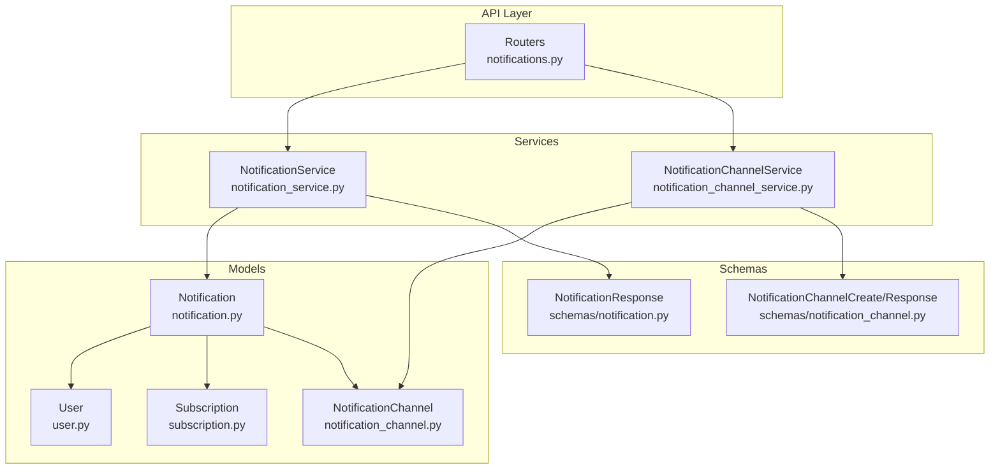
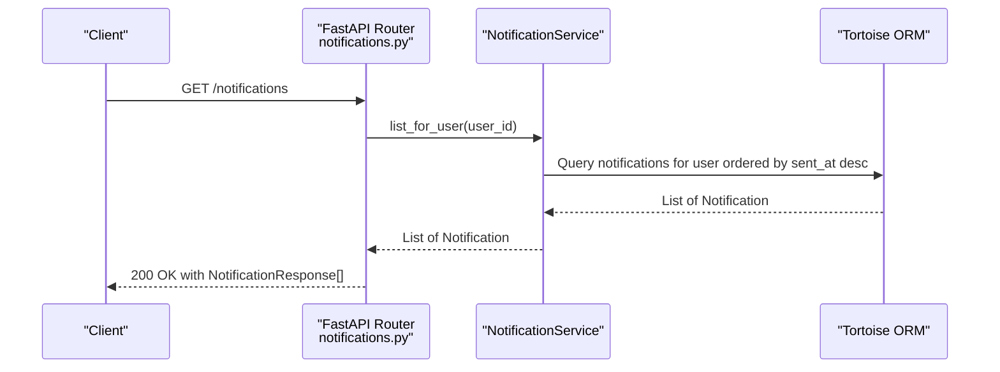
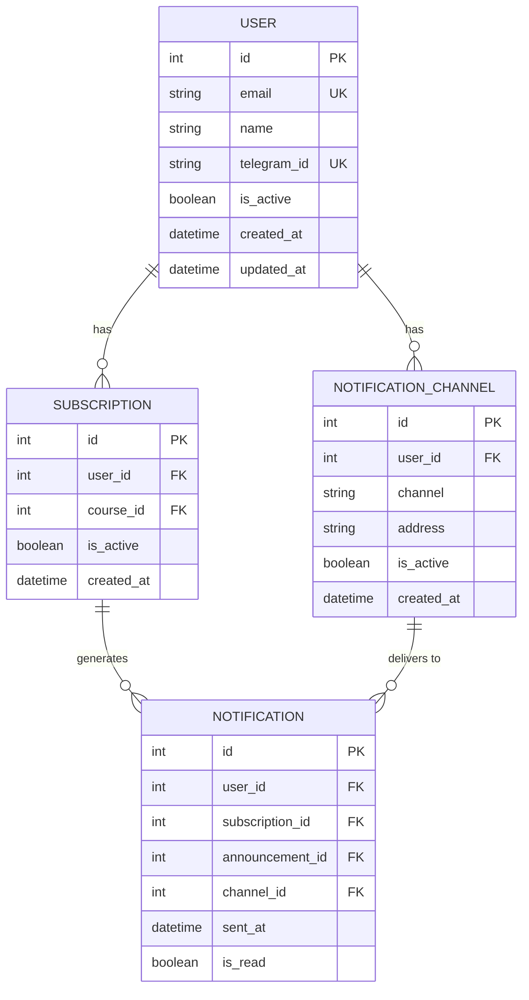
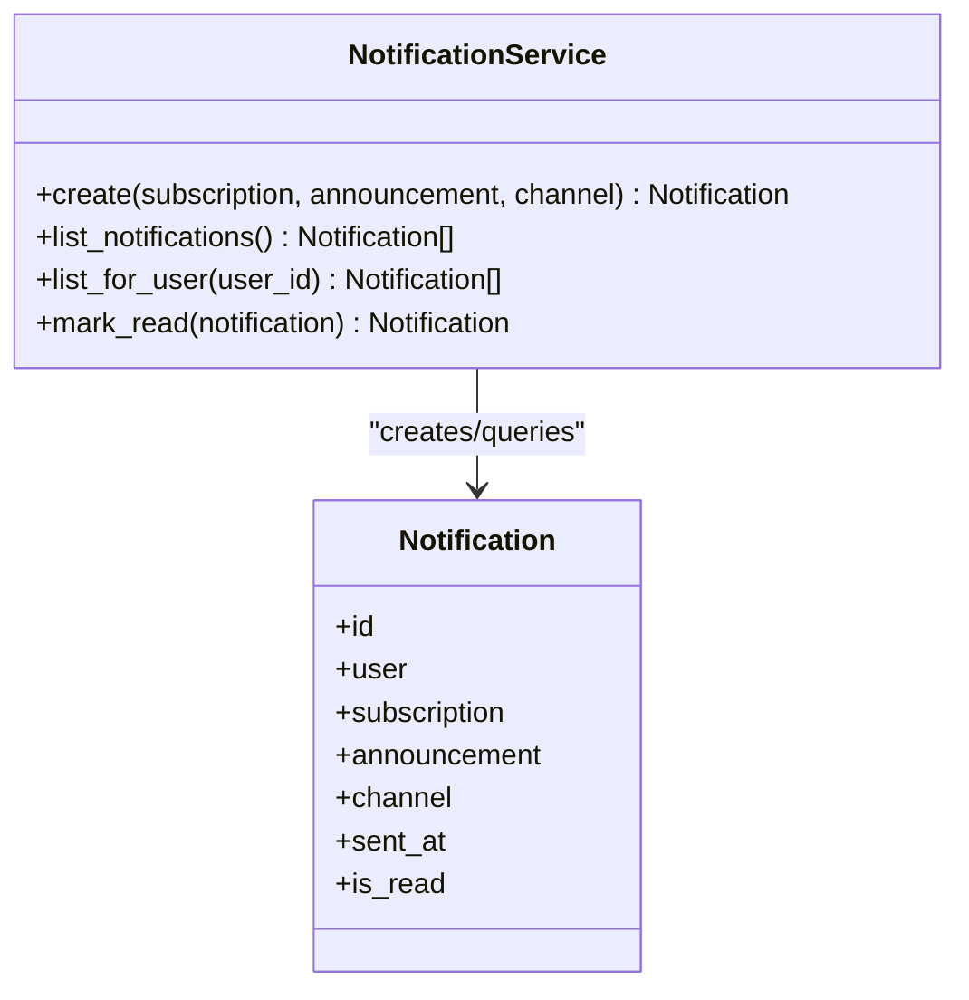
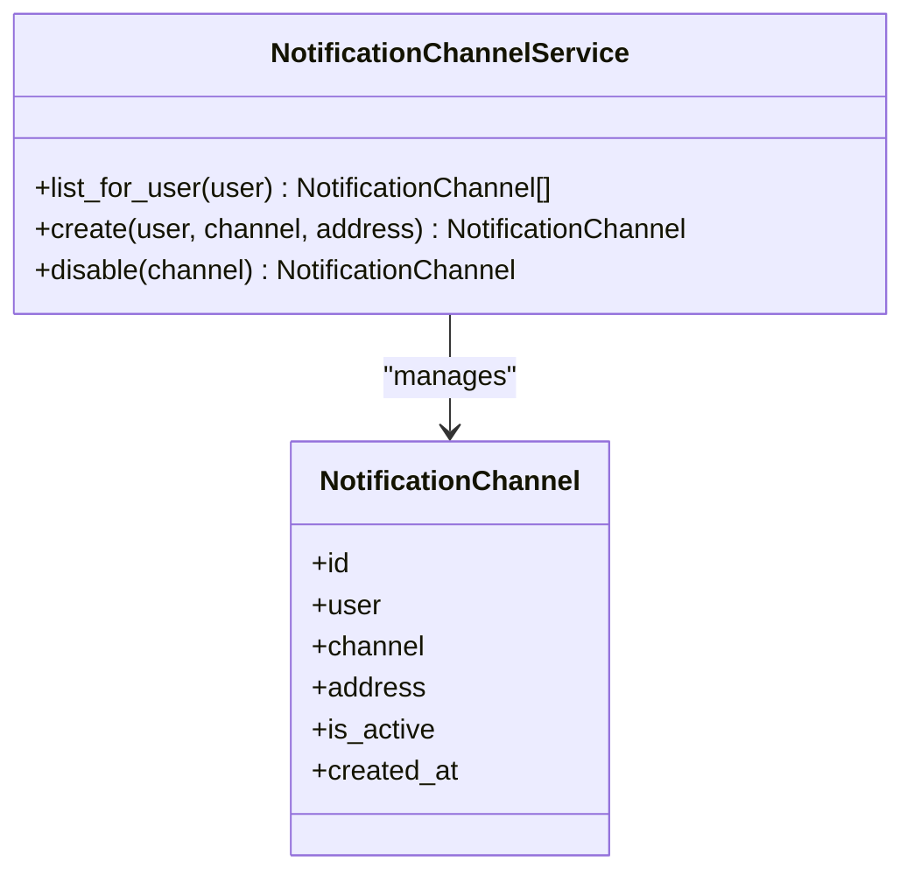
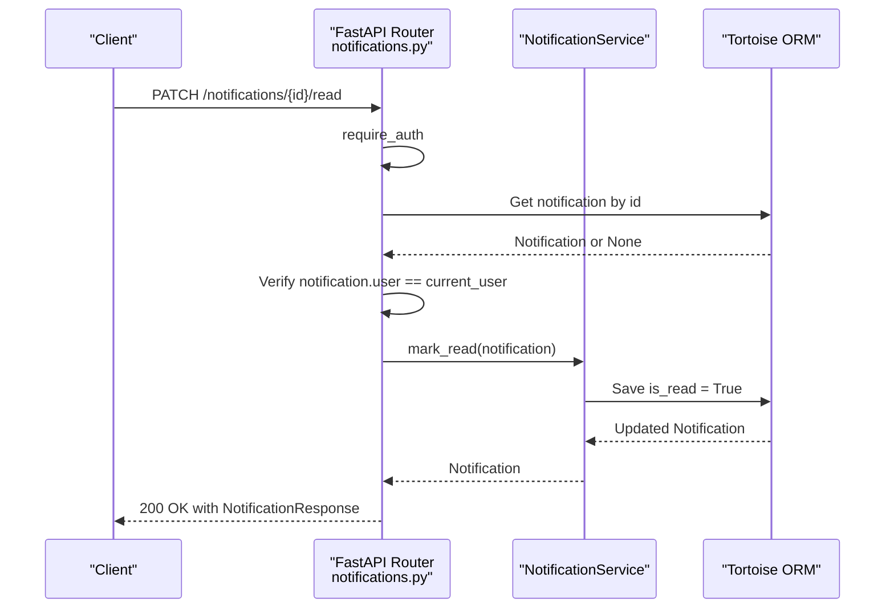
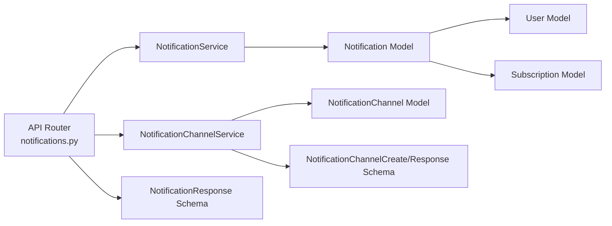
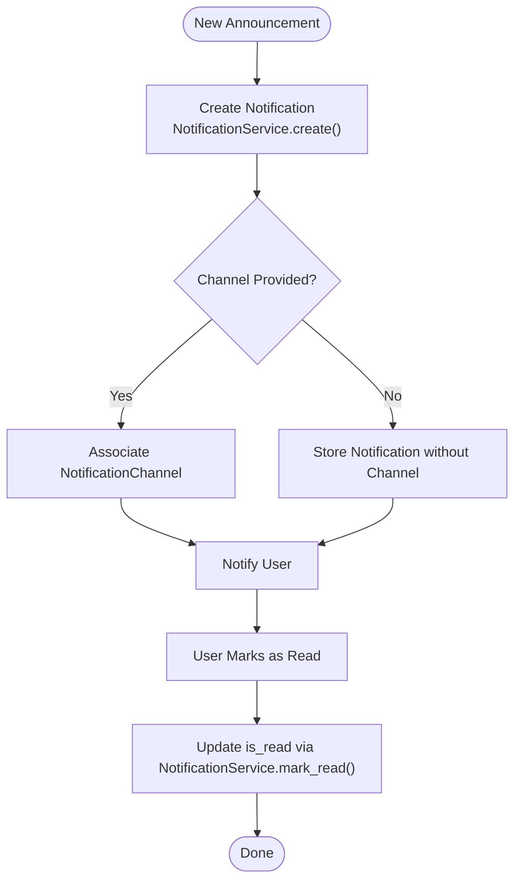
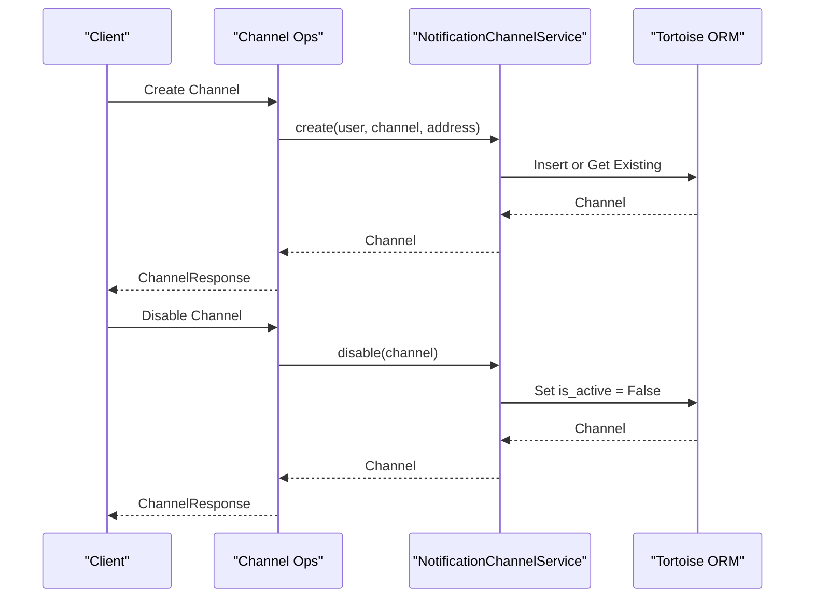

# Notification System

<cite>
**Referenced Files in This Document**
- [README.md](file://notice-reminders/README.md)
- [main.py](file://notice-reminders/app/api/main.py)
- [notifications.py](file://notice-reminders/app/api/routers/notifications.py)
- [notification.py](file://notice-reminders/app/models/notification.py)
- [notification_channel.py](file://notice-reminders/app/models/notification_channel.py)
- [notification_service.py](file://notice-reminders/app/services/notification_service.py)
- [notification_channel_service.py](file://notice-reminders/app/services/notification_channel_service.py)
- [notification.py](file://notice-reminders/app/schemas/notification.py)
- [notification_channel.py](file://notice-reminders/app/schemas/notification_channel.py)
- [user.py](file://notice-reminders/app/models/user.py)
- [subscription.py](file://notice-reminders/app/models/subscription.py)
</cite>

## Table of Contents
1. [Introduction](#introduction)
2. [Project Structure](#project-structure)
3. [Core Components](#core-components)
4. [Architecture Overview](#architecture-overview)
5. [Detailed Component Analysis](#detailed-component-analysis)
6. [Dependency Analysis](#dependency-analysis)
7. [Performance Considerations](#performance-considerations)
8. [Troubleshooting Guide](#troubleshooting-guide)
9. [Conclusion](#conclusion)
10. [Appendices](#appendices)

## Introduction
This document describes the notification delivery system for the notice reminders application. It explains the multi-channel notification architecture, real-time alert mechanisms, and notification scheduling. It documents the notification service implementation, channel-specific delivery logic, and retry mechanisms. It also covers notification templates, personalization options, and delivery status tracking. Finally, it lists API endpoints for notification queries, delivery logs, and channel management, and provides examples of notification workflows, channel configurations, and troubleshooting common delivery issues.

The project is a FastAPI-based backend with Tortoise ORM for persistence. Notifications are stored in the database and associated with users, subscriptions, and channels. The system currently supports listing notifications, marking them as read, and managing notification channels.

**Section sources**
- [README.md](file://notice-reminders/README.md#L1-L56)

## Project Structure
The notification system resides in the notice-reminders package under app/. The structure relevant to notifications includes:
- Models: define the data schema for notifications, channels, users, and subscriptions
- Services: encapsulate business logic for creating notifications and managing channels
- API Routers: expose endpoints for listing notifications and marking them as read
- Schemas: define serialization models for API responses

**Diagram sources**
- [notifications.py](file://notice-reminders/app/api/routers/notifications.py#L1-L62)
- [notification_service.py](file://notice-reminders/app/services/notification_service.py#L1-L31)
- [notification_channel_service.py](file://notice-reminders/app/services/notification_channel_service.py#L1-L32)
- [notification.py](file://notice-reminders/app/models/notification.py#L1-L37)
- [notification_channel.py](file://notice-reminders/app/models/notification_channel.py#L1-L26)
- [user.py](file://notice-reminders/app/models/user.py#L1-L20)
- [subscription.py](file://notice-reminders/app/models/subscription.py#L1-L28)
- [notification.py](file://notice-reminders/app/schemas/notification.py#L1-L17)
- [notification_channel.py](file://notice-reminders/app/schemas/notification_channel.py#L1-L22)

**Section sources**
- [main.py](file://notice-reminders/app/api/main.py#L1-L46)
- [README.md](file://notice-reminders/README.md#L1-L56)

## Core Components
- Notification model: stores notification records linked to a user, subscription, optional channel, and timestamp; tracks read/unread state
- NotificationChannel model: stores per-user channels (e.g., email, Telegram) with address and activation flag
- NotificationService: creates notifications and manages listing and read-state updates
- NotificationChannelService: lists, creates, and disables notification channels for a user
- API endpoints: expose listing notifications for a user and marking a notification as read

Key capabilities:
- Multi-channel support via NotificationChannel
- Delivery status tracking via is_read flag
- User-scoped access control enforced in API

**Section sources**
- [notification.py](file://notice-reminders/app/models/notification.py#L14-L37)
- [notification_channel.py](file://notice-reminders/app/models/notification_channel.py#L11-L26)
- [notification_service.py](file://notice-reminders/app/services/notification_service.py#L7-L31)
- [notification_channel_service.py](file://notice-reminders/app/services/notification_channel_service.py#L7-L32)
- [notifications.py](file://notice-reminders/app/api/routers/notifications.py#L13-L62)

## Architecture Overview
The notification architecture follows a layered design:
- API layer: FastAPI routers handle requests and delegate to services
- Service layer: NotificationService and NotificationChannelService encapsulate business logic
- Persistence layer: Tortoise ORM models persist notifications and channels
- Access control: Authentication decorator ensures only authorized users access their notifications

**Diagram sources**
- [notifications.py](file://notice-reminders/app/api/routers/notifications.py#L13-L20)
- [notification_service.py](file://notice-reminders/app/services/notification_service.py#L21-L25)

## Detailed Component Analysis

### Notification Model and Relationships
The Notification model links to User, Subscription, and optionally NotificationChannel. It captures when a notification was sent and whether it has been read. This design enables:
- Per-user delivery logs
- Association with specific course announcements via Subscription
- Optional channel attribution for delivery tracking

**Diagram sources**
- [notification.py](file://notice-reminders/app/models/notification.py#L14-L37)
- [notification_channel.py](file://notice-reminders/app/models/notification_channel.py#L11-L26)
- [user.py](file://notice-reminders/app/models/user.py#L7-L20)
- [subscription.py](file://notice-reminders/app/models/subscription.py#L12-L28)

**Section sources**
- [notification.py](file://notice-reminders/app/models/notification.py#L14-L37)
- [notification_channel.py](file://notice-reminders/app/models/notification_channel.py#L11-L26)
- [user.py](file://notice-reminders/app/models/user.py#L7-L20)
- [subscription.py](file://notice-reminders/app/models/subscription.py#L12-L28)

### NotificationService Implementation
Responsibilities:
- Create notifications linking a subscription and announcement to a user and optional channel
- List all notifications for a user ordered by sent_at descending
- Mark a notification as read after validating ownership

**Diagram sources**
- [notification_service.py](file://notice-reminders/app/services/notification_service.py#L7-L31)
- [notification.py](file://notice-reminders/app/models/notification.py#L14-L37)

**Section sources**
- [notification_service.py](file://notice-reminders/app/services/notification_service.py#L7-L31)

### NotificationChannelService Implementation
Responsibilities:
- List channels for a user
- Create a channel with deduplication via unique constraint
- Disable a channel by setting is_active to false

**Diagram sources**
- [notification_channel_service.py](file://notice-reminders/app/services/notification_channel_service.py#L7-L32)
- [notification_channel.py](file://notice-reminders/app/models/notification_channel.py#L11-L26)

**Section sources**
- [notification_channel_service.py](file://notice-reminders/app/services/notification_channel_service.py#L7-L32)

### API Endpoints for Notifications
Endpoints:
- GET /notifications: List notifications for the authenticated user
- GET /notifications/users/{user_id}: List notifications for a specific user (owner-only)
- PATCH /notifications/{notification_id}/read: Mark a notification as read (owner-only)

Access control:
- require_auth decorator enforces authentication
- Ownership checks ensure users can only access their own notifications

**Diagram sources**
- [notifications.py](file://notice-reminders/app/api/routers/notifications.py#L39-L62)
- [notification_service.py](file://notice-reminders/app/services/notification_service.py#L27-L31)

**Section sources**
- [notifications.py](file://notice-reminders/app/api/routers/notifications.py#L13-L62)

### Channel Management Endpoints
While the notification endpoints focus on listing and read-state updates, channel management is supported via NotificationChannelService. The service provides:
- Listing channels for a user
- Creating channels with deduplication
- Disabling channels

Note: Dedicated API endpoints for channel management are not present in the current code. Channel operations are handled programmatically via the service layer.

**Section sources**
- [notification_channel_service.py](file://notice-reminders/app/services/notification_channel_service.py#L7-L32)

### Real-Time Alerts and Scheduling
Current implementation:
- Notifications are created upon event occurrence (e.g., new announcements)
- No explicit scheduler or queue workers are implemented
- Real-time delivery is not implemented; delivery is triggered synchronously during creation

Recommendations for future enhancements:
- Introduce a task queue (e.g., Celery) to offload channel delivery
- Add retry logic with exponential backoff for transient failures
- Implement rate limiting per channel/address
- Add webhook or push notification hooks for real-time delivery

[No sources needed since this section provides general guidance]

### Templates and Personalization
Current implementation:
- Notification creation is straightforward and does not include templating
- Personalization is minimal (only user association)

Recommendations for future enhancements:
- Add template engine (e.g., Jinja2) to render subject/body per channel
- Support dynamic placeholders (user name, course name, date)
- Allow per-user customization of notification preferences

[No sources needed since this section provides general guidance]

## Dependency Analysis
The notification system exhibits clean separation of concerns:
- API depends on services for business logic
- Services depend on models for persistence
- Models define relationships and constraints
- Schemas define API serialization contracts

**Diagram sources**
- [notifications.py](file://notice-reminders/app/api/routers/notifications.py#L1-L62)
- [notification_service.py](file://notice-reminders/app/services/notification_service.py#L1-L31)
- [notification_channel_service.py](file://notice-reminders/app/services/notification_channel_service.py#L1-L32)
- [notification.py](file://notice-reminders/app/models/notification.py#L1-L37)
- [notification_channel.py](file://notice-reminders/app/models/notification_channel.py#L1-L26)
- [user.py](file://notice-reminders/app/models/user.py#L1-L20)
- [subscription.py](file://notice-reminders/app/models/subscription.py#L1-L28)
- [notification.py](file://notice-reminders/app/schemas/notification.py#L1-L17)
- [notification_channel.py](file://notice-reminders/app/schemas/notification_channel.py#L1-L22)

**Section sources**
- [main.py](file://notice-reminders/app/api/main.py#L1-L46)

## Performance Considerations
- Indexing: Ensure foreign keys and frequently queried fields (e.g., user_id, sent_at) are indexed
- Pagination: For large notification histories, implement pagination in list endpoints
- Caching: Cache recent notifications per user for read-heavy workloads
- Batch operations: When scaling to multiple channels, batch deliveries and avoid N+1 queries
- Asynchronous delivery: Offload channel delivery to background tasks to prevent blocking API requests

[No sources needed since this section provides general guidance]

## Troubleshooting Guide
Common issues and resolutions:
- Access denied when listing notifications for another user:
  - Cause: Ownership check fails
  - Resolution: Ensure the authenticated user matches the requested user_id
  - Reference: [notifications.py](file://notice-reminders/app/api/routers/notifications.py#L30-L38)

- Notification not found when marking as read:
  - Cause: Invalid notification_id or wrong user
  - Resolution: Verify notification exists and belongs to the authenticated user
  - Reference: [notifications.py](file://notice-reminders/app/api/routers/notifications.py#L46-L58)

- Duplicate channel entries:
  - Cause: Unique constraint violation on (user, channel, address)
  - Resolution: Use service create method which handles duplicates; or query existing channel
  - Reference: [notification_channel.py](file://notice-reminders/app/models/notification_channel.py#L25-L26), [notification_channel_service.py](file://notice-reminders/app/services/notification_channel_service.py#L17-L26)

- Channel disabled:
  - Cause: is_active is False
  - Resolution: Re-enable the channel via disable/enable operations
  - Reference: [notification_channel_service.py](file://notice-reminders/app/services/notification_channel_service.py#L28-L31)

**Section sources**
- [notifications.py](file://notice-reminders/app/api/routers/notifications.py#L30-L58)
- [notification_channel.py](file://notice-reminders/app/models/notification_channel.py#L25-L26)
- [notification_channel_service.py](file://notice-reminders/app/services/notification_channel_service.py#L17-L31)

## Conclusion
The notification system provides a solid foundation for storing and retrieving notifications, associating them with users and subscriptions, and tracking read/unread status. Multi-channel support is modeled via NotificationChannel, and access control is enforced at the API level. Future enhancements should focus on asynchronous delivery, retry mechanisms, scheduling, templating, and real-time alerts to improve scalability and user experience.

[No sources needed since this section summarizes without analyzing specific files]

## Appendices

### API Endpoints Summary
- GET /notifications
  - Description: List notifications for the authenticated user
  - Response: Array of NotificationResponse
  - Reference: [notifications.py](file://notice-reminders/app/api/routers/notifications.py#L13-L20)

- GET /notifications/users/{user_id}
  - Description: List notifications for a specific user (owner-only)
  - Response: Array of NotificationResponse
  - Reference: [notifications.py](file://notice-reminders/app/api/routers/notifications.py#L23-L36)

- PATCH /notifications/{notification_id}/read
  - Description: Mark a notification as read (owner-only)
  - Response: NotificationResponse
  - Reference: [notifications.py](file://notice-reminders/app/api/routers/notifications.py#L39-L62)

### Notification Workflow Example
- A new announcement triggers creation of a Notification linked to the user’s Subscription
- Optionally, associate a NotificationChannel to track delivery
- Users can list notifications and mark them as read via the API

**Diagram sources**
- [notification_service.py](file://notice-reminders/app/services/notification_service.py#L8-L19)
- [notification_service.py](file://notice-reminders/app/services/notification_service.py#L27-L31)
- [notification.py](file://notice-reminders/app/models/notification.py#L14-L37)
- [notification_channel.py](file://notice-reminders/app/models/notification_channel.py#L11-L26)

### Channel Configuration Example
- Create a channel for a user with a specific channel type and address
- Channels are unique per user, channel type, and address
- Disable a channel to stop delivery without deleting it

**Diagram sources**
- [notification_channel_service.py](file://notice-reminders/app/services/notification_channel_service.py#L11-L26)
- [notification_channel_service.py](file://notice-reminders/app/services/notification_channel_service.py#L28-L31)
- [notification_channel.py](file://notice-reminders/app/models/notification_channel.py#L11-L26)