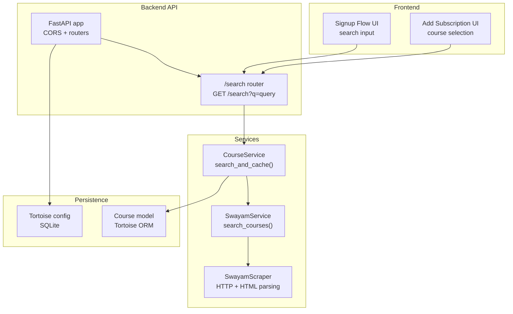
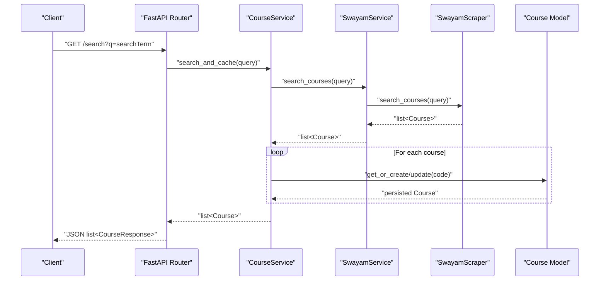
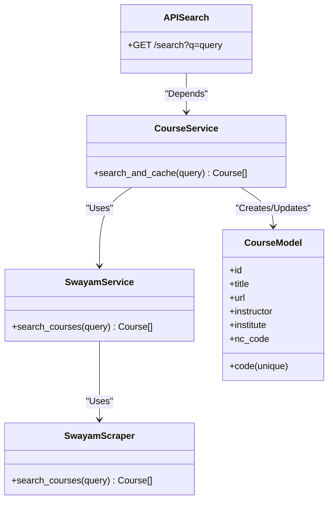

# Search Functionality

<cite>
**Referenced Files in This Document**
- [search.py](file://notice-reminders/app/api/routers/search.py)
- [course_service.py](file://notice-reminders/app/services/course_service.py)
- [swayam_service.py](file://notice-reminders/app/services/swayam_service.py)
- [swayam_scraper.py](file://notice-reminders/app/scrapers/__init__.py)
- [course_model.py](file://notice-reminders/app/models/course.py)
- [course_schema.py](file://notice-reminders/app/schemas/course.py)
- [domain_models.py](file://notice-reminders/app/domain/models.py)
- [config.py](file://notice-reminders/app/core/config.py)
- [database.py](file://notice-reminders/app/core/database.py)
- [main.py](file://notice-reminders/app/api/main.py)
- [signup-flow.tsx](file://website/components/notice-reminders/signup-flow.tsx)
- [add-subscription.tsx](file://website/components/notice-reminders/add-subscription.tsx)
</cite>

## Table of Contents
1. [Introduction](#introduction)
2. [Project Structure](#project-structure)
3. [Core Components](#core-components)
4. [Architecture Overview](#architecture-overview)
5. [Detailed Component Analysis](#detailed-component-analysis)
6. [Dependency Analysis](#dependency-analysis)
7. [Performance Considerations](#performance-considerations)
8. [Troubleshooting Guide](#troubleshooting-guide)
9. [Conclusion](#conclusion)
10. [Appendices](#appendices)

## Introduction
This document explains the search functionality for discovering and filtering MOOC courses from SWAYAM and NPTEL. It covers the search API endpoint, query parameters, backend implementation, caching and persistence strategy, and frontend integration. It also outlines current search behavior, relevance scoring, and result ranking, along with practical examples and performance optimization strategies.

## Project Structure
The search feature spans the backend API, service layer, scraper integration, and the frontend UI. The backend is a FastAPI application that exposes a single GET endpoint under /search. The service layer orchestrates scraping and local caching, while the frontend provides a user interface for searching and selecting courses.

**Diagram sources**
- [search.py](file://notice-reminders/app/api/routers/search.py#L10-L16)
- [course_service.py](file://notice-reminders/app/services/course_service.py#L17-L53)
- [swayam_service.py](file://notice-reminders/app/services/swayam_service.py#L18-L20)
- [swayam_scraper.py](file://notice-reminders/app/scrapers/__init__.py#L38-L101)
- [course_model.py](file://notice-reminders/app/models/course.py#L8-L21)
- [database.py](file://notice-reminders/app/core/database.py#L7-L25)
- [main.py](file://notice-reminders/app/api/main.py#L17-L42)

**Section sources**
- [search.py](file://notice-reminders/app/api/routers/search.py#L1-L17)
- [main.py](file://notice-reminders/app/api/main.py#L1-L46)

## Core Components
- Search API endpoint: GET /search?q=query returns a list of CourseResponse objects.
- CourseService.search_and_cache: Orchestrates scraping, deduplication, and persistence.
- SwayamService: Thin wrapper around SwayamScraper for course search.
- SwayamScraper: Performs HTTP requests to SWAYAM and parses course cards from HTML.
- Course model: Persisted entity with a unique code and supporting indexes.
- CourseResponse schema: Pydantic model for API serialization.

Key behaviors:
- Query parameter q is forwarded to the scraper.
- Results are normalized into Course domain entities and returned as CourseResponse.
- Local caching: Existing records are updated if fields change; new records are created.

**Section sources**
- [search.py](file://notice-reminders/app/api/routers/search.py#L10-L16)
- [course_service.py](file://notice-reminders/app/services/course_service.py#L17-L53)
- [swayam_service.py](file://notice-reminders/app/services/swayam_service.py#L18-L20)
- [swayam_scraper.py](file://notice-reminders/app/scrapers/__init__.py#L38-L101)
- [course_model.py](file://notice-reminders/app/models/course.py#L8-L21)
- [course_schema.py](file://notice-reminders/app/schemas/course.py#L6-L18)

## Architecture Overview
The search pipeline is request-driven and follows a clear separation of concerns:
- API layer validates and forwards the query.
- Service layer fetches and normalizes data.
- Persistence layer ensures idempotent updates and retrieval.
- Frontend triggers queries and renders results.

**Diagram sources**
- [search.py](file://notice-reminders/app/api/routers/search.py#L10-L16)
- [course_service.py](file://notice-reminders/app/services/course_service.py#L17-L53)
- [swayam_service.py](file://notice-reminders/app/services/swayam_service.py#L18-L20)
- [swayam_scraper.py](file://notice-reminders/app/scrapers/__init__.py#L38-L101)
- [course_model.py](file://notice-reminders/app/models/course.py#L8-L21)

## Detailed Component Analysis

### Search API Endpoint
- Path: GET /search
- Query parameter:
  - q: string search term passed to the backend.
- Response:
  - List of CourseResponse objects representing normalized course metadata.

Behavior:
- Calls CourseService.search_and_cache(q).
- Serializes results via CourseResponse.model_validate(...).

**Section sources**
- [search.py](file://notice-reminders/app/api/routers/search.py#L10-L16)
- [course_schema.py](file://notice-reminders/app/schemas/course.py#L6-L18)

### CourseService.search_and_cache
Responsibilities:
- Fetch courses from SwayamService.search_courses.
- For each course:
  - Retrieve existing record by code.
  - If present, update changed fields and save.
  - If absent, create a new record.
- Return the list of persisted Course instances.

Relevance and ranking:
- No explicit relevance scoring or ranking is implemented in the backend.
- Results order reflects the order returned by the scraper.

Caching semantics:
- TTL is enforced by a separate method that filters recent updates based on cache_ttl_minutes.

**Section sources**
- [course_service.py](file://notice-reminders/app/services/course_service.py#L17-L53)
- [config.py](file://notice-reminders/app/core/config.py#L12-L12)

### SwayamService and SwayamScraper
- SwayamService.search_courses delegates to SwayamScraper.search_courses.
- SwayamScraper.search_courses:
  - Sends an HTTP GET to the SWAYAM search endpoint with searchText=query.
  - Parses the HTML response to extract course cards and constructs Course domain entities.
- SwayamScraper.get_announcements supports fetching announcements for a given course code.

Current search algorithm:
- Uses a single HTTP GET with a query parameter.
- Extracts course metadata from DOM elements matching specific selectors.

Filtering and faceting:
- No server-side filters (e.g., by instructor, institute, or NC code) are exposed by the API.
- Filtering would need to be performed client-side on the returned list.

**Section sources**
- [swayam_service.py](file://notice-reminders/app/services/swayam_service.py#L18-L20)
- [swayam_scraper.py](file://notice-reminders/app/scrapers/__init__.py#L38-L101)
- [domain_models.py](file://notice-reminders/app/domain/models.py#L7-L21)

### Persistence Layer (Course Model)
- Unique code index enables efficient lookup and upsert-like behavior.
- Fields include title, url, instructor, institute, and nc_code.
- Tortoise ORM handles creation and updates.

Indexing strategy:
- Unique index on code ensures referential integrity and efficient get_or_none lookups.
- Additional indexes could be considered for frequent filters (e.g., title, instructor, institute) if server-side filtering is introduced.

**Section sources**
- [course_model.py](file://notice-reminders/app/models/course.py#L8-L21)
- [database.py](file://notice-reminders/app/core/database.py#L7-L25)

### Frontend Integration
- The frontend surfaces the search via two components:
  - Signup Flow: Provides a search input and renders results as selectable items.
  - Add Subscription: Allows selecting a course after search.
- The UI enforces a minimum query length before triggering search and displays empty states.

Usage patterns:
- Users type a query; the UI debounces input and calls the backend endpoint.
- Selected courses are stored locally until saved.

**Section sources**
- [signup-flow.tsx](file://website/components/notice-reminders/signup-flow.tsx#L254-L333)
- [signup-flow.tsx](file://website/components/notice-reminders/signup-flow.tsx#L307-L333)
- [add-subscription.tsx](file://website/components/notice-reminders/add-subscription.tsx#L109-L136)

## Dependency Analysis
The search feature exhibits low coupling and clear boundaries:
- API depends on CourseService via dependency injection.
- CourseService depends on SwayamService and Course model.
- SwayamService depends on SwayamScraper.
- SwayamScraper depends on HTTPX and BeautifulSoup.
- Persistence is configured centrally via Tortoise.

**Diagram sources**
- [search.py](file://notice-reminders/app/api/routers/search.py#L10-L16)
- [course_service.py](file://notice-reminders/app/services/course_service.py#L17-L53)
- [swayam_service.py](file://notice-reminders/app/services/swayam_service.py#L18-L20)
- [swayam_scraper.py](file://notice-reminders/app/scrapers/__init__.py#L38-L101)
- [course_model.py](file://notice-reminders/app/models/course.py#L8-L21)

**Section sources**
- [main.py](file://notice-reminders/app/api/main.py#L17-L42)
- [database.py](file://notice-reminders/app/core/database.py#L7-L25)

## Performance Considerations
Current state:
- Single HTTP GET per query to SWAYAM with minimal client-side filtering.
- Local caching avoids repeated scraping for identical results; updates occur only when fields change.
- Database operations are O(n) per query, where n is the number of scraped results.

Optimization opportunities:
- Introduce server-side filters (e.g., instructor, institute, nc_code) to reduce payload size and enable pagination.
- Add database indexes on frequently filtered fields (instructor, institute) to speed up queries.
- Implement result caching with TTL at the API level to avoid repeated scraping.
- Add pagination to limit result set size and improve responsiveness.
- Apply stemming or fuzzy matching at the scraper or service layer to improve recall.
- Use asynchronous batching for database writes to reduce overhead.

[No sources needed since this section provides general guidance]

## Troubleshooting Guide
Common issues and remedies:
- Empty results:
  - Verify query length threshold in the frontend (minimum characters before search).
  - Confirm network connectivity and SWAYAM availability.
- Unexpected missing fields:
  - Check that the scraper selectors still match the target HTML structure.
- Duplicate or stale entries:
  - Ensure unique code enforcement and that field comparison logic updates changed fields.
- CORS errors:
  - Confirm allowed origins in settings and that the frontend origin is included.

**Section sources**
- [signup-flow.tsx](file://website/components/notice-reminders/signup-flow.tsx#L328-L333)
- [swayam_scraper.py](file://notice-reminders/app/scrapers/__init__.py#L38-L101)
- [course_service.py](file://notice-reminders/app/services/course_service.py#L24-L38)
- [config.py](file://notice-reminders/app/core/config.py#L20-L20)

## Conclusion
The current search functionality provides a straightforward path from query to normalized results with basic caching and persistence. While server-side filtering and ranking are not implemented, the modular design allows incremental enhancements such as faceted search, pagination, and relevance scoring without disrupting existing integrations.

[No sources needed since this section summarizes without analyzing specific files]

## Appendices

### API Definition
- Method: GET
- Path: /search
- Query parameters:
  - q (required): Search string forwarded to the scraper.
- Response:
  - Array of CourseResponse objects.

Example requests:
- GET /search?q=introduction%20to%20cs
- GET /search?q=mechanical%20engineering

Example response shape:
- Array of objects containing id, code, title, url, instructor, institute, nc_code, created_at, updated_at.

Notes:
- Results are not ranked; ordering matches the upstream scraper’s order.
- Filtering must be applied client-side if needed.

**Section sources**
- [search.py](file://notice-reminders/app/api/routers/search.py#L10-L16)
- [course_schema.py](file://notice-reminders/app/schemas/course.py#L6-L18)

### Advanced Search Patterns
- Client-side filtering:
  - After receiving results, filter by instructor, institute, or nc_code.
- Multi-term queries:
  - Split q into tokens and apply AND/OR logic client-side.
- Fuzzy matching:
  - Apply approximate string matching on title/instructor/institute fields.
- Pagination:
  - Limit displayed results and implement “Load More” to reduce payload size.

[No sources needed since this section provides general guidance]