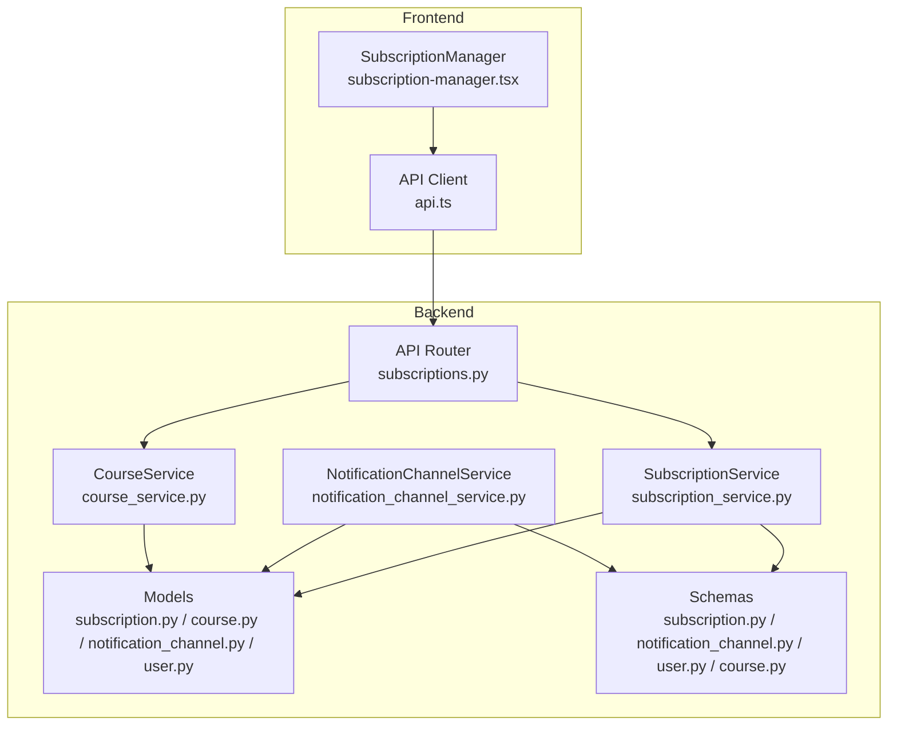
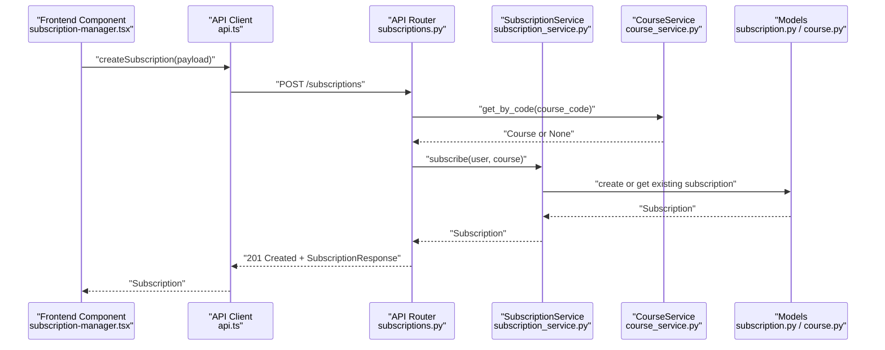
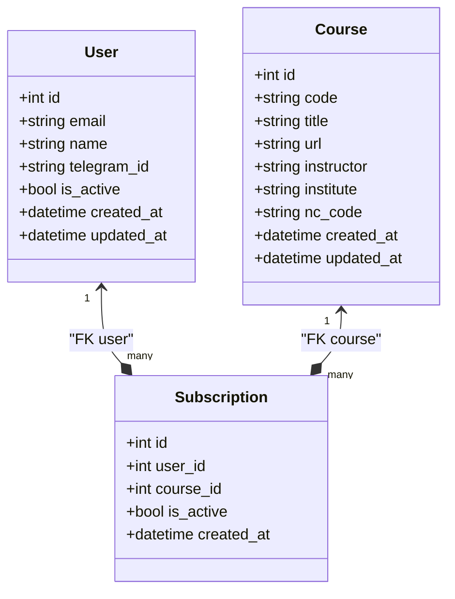
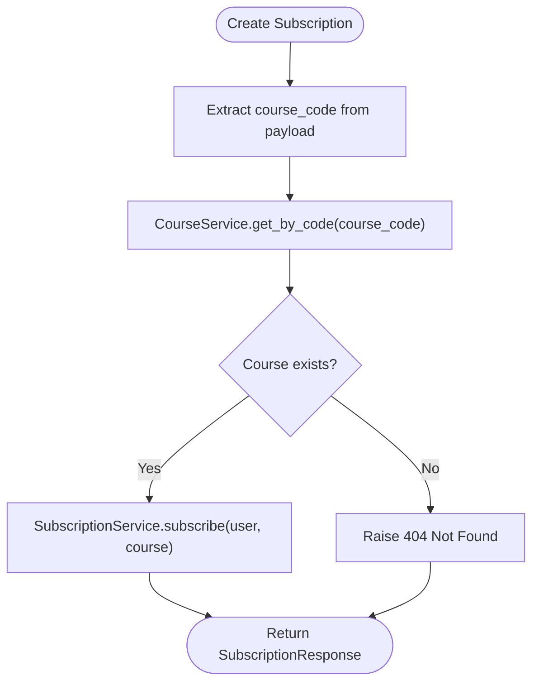
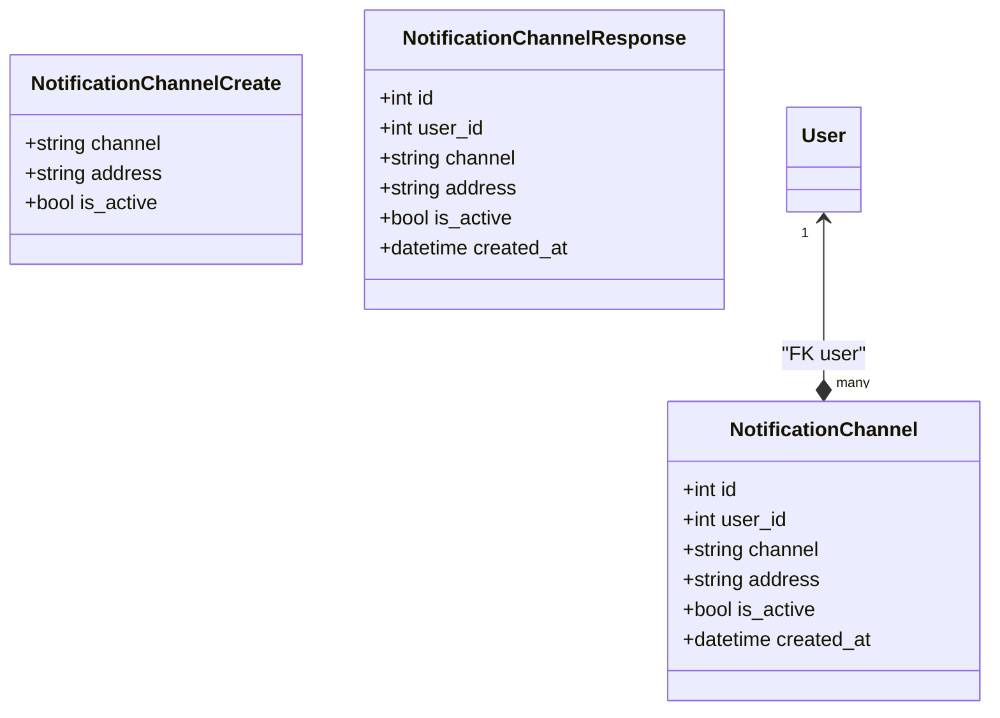
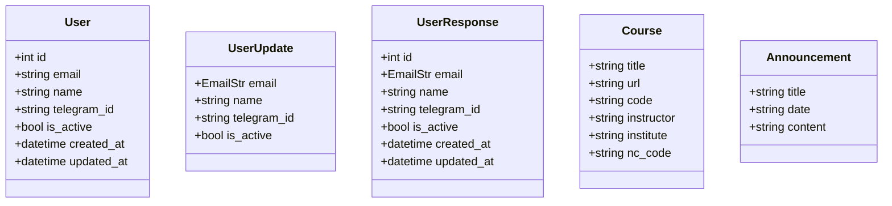
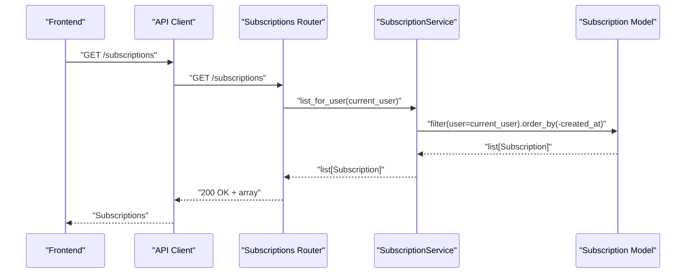
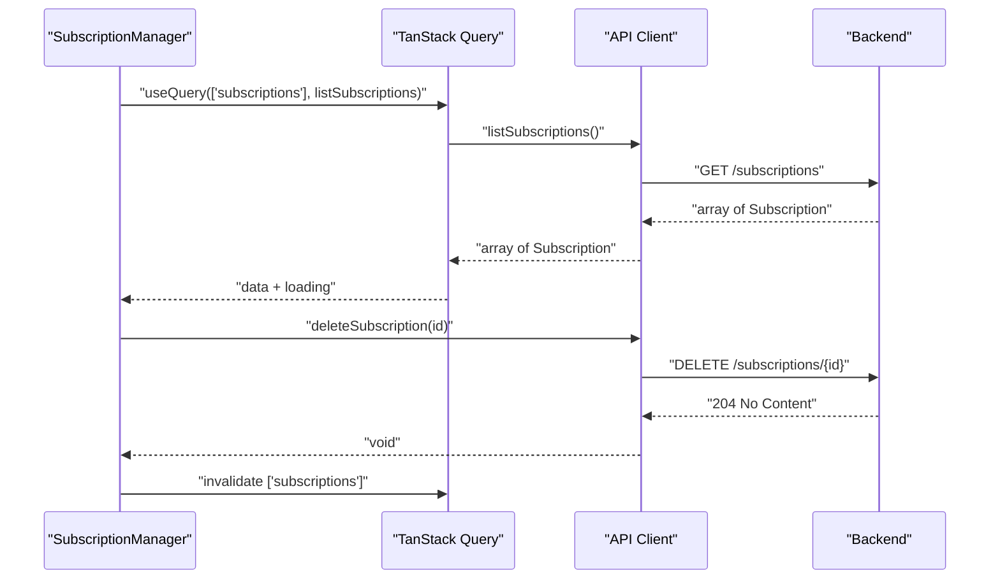
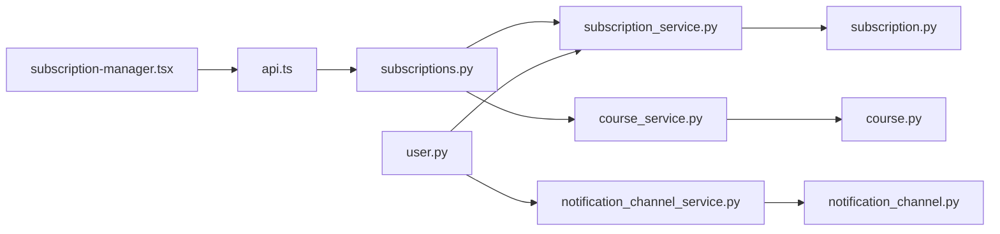

# Subscription management

## Introduction
This page describes the subscription management system for course announcements. It explains how users subscribe to courses, how subscriptions are validated and persisted, and how notification channels are managed alongside subscriptions. It also documents the subscription CRUD APIs, request/response schemas, and integration patterns used by the frontend. The system supports per-user subscriptions to courses, with optional notification channels for delivery of alerts.

## Project structure
The subscription management spans a FastAPI backend and a Next.js frontend:
- Backend (FastAPI):
  - API routers define endpoints for subscription operations.
  - Services encapsulate business logic for subscriptions and notification channels.
  - Models define persistence for subscriptions, courses, notification channels, and users.
  - Schemas define request/response data contracts.
- Frontend (Next.js):
  - React components integrate with the backend via typed API helpers.
  - TanStack Query manages caching and optimistic updates for subscriptions.

```mermaid
graph TB
subgraph "Backend"
A["API Router<br/>subscriptions.py"]
B["SubscriptionService<br/>subscription_service.py"]
C["NotificationChannelService<br/>notification_channel_service.py"]
D["Models<br/>subscription.py / course.py / notification_channel.py / user.py"]
E["Schemas<br/>subscription.py / notification_channel.py / user.py / course.py"]
F["CourseService<br/>course_service.py"]
end
subgraph "Frontend"
G["SubscriptionManager<br/>subscription-manager.tsx"]
H["API Client<br/>api.ts"]
end
G --> H
H --> A
A --> B
A --> F
B --> D
C --> D
F --> D
B --> E
C --> E
```

## Core components
- Subscription model: Tracks per-user subscriptions to courses with timestamps and activation flag.
- Subscription service: Handles creation, listing, and deletion of subscriptions with deduplication semantics.
- Course service: Manages course metadata and caches course records.
- Notification channel model and service: Stores user notification channels (e.g., email, Telegram) and supports enabling/disabling.
- User model and schemas: Identifies users and exposes profile-related fields.
- API router for subscriptions: Exposes endpoints for creating, listing, and deleting subscriptions.
- Frontend integration: React components and API client for subscription management.

## Architecture overview
The subscription workflow integrates frontend requests with backend services and persistence. Authentication is enforced for subscription operations. Course lookup ensures subscriptions target valid courses. Subscriptions are scoped to users and persisted with uniqueness constraints.

```mermaid
sequenceDiagram
participant FE as "Frontend Component<br/>subscription-manager.tsx"
participant API as "API Client<br/>api.ts"
participant Router as "API Router<br/>subscriptions.py"
participant SubSvc as "SubscriptionService<br/>subscription_service.py"
participant CourseSvc as "CourseService<br/>course_service.py"
participant DB as "Models<br/>subscription.py / course.py"
FE->>API : "createSubscription(payload)"
API->>Router : "POST /subscriptions"
Router->>CourseSvc : "get_by_code(course_code)"
CourseSvc-->>Router : "Course or None"
Router->>SubSvc : "subscribe(user, course)"
SubSvc->>DB : "create or get existing subscription"
DB-->>SubSvc : "Subscription"
SubSvc-->>Router : "Subscription"
Router-->>API : "201 Created + SubscriptionResponse"
API-->>FE : "Subscription"
```

## Detailed component analysis

### Subscription model and service
- Model fields include foreign keys to User and Course, timestamps, and an activation flag. Uniqueness constraint prevents duplicate subscriptions per user-course pair.
- Service methods:
  - Subscribe: Creates a subscription or returns an existing one on integrity errors.
  - List all and list for user: Ordered by creation time descending.
  - Delete: Removes a subscription.

```mermaid
classDiagram
class User {
+int id
+string email
+string name
+string telegram_id
+bool is_active
+datetime created_at
+datetime updated_at
}
class Course {
+int id
+string code
+string title
+string url
+string instructor
+string institute
+string nc_code
+datetime created_at
+datetime updated_at
}
class Subscription {
+int id
+int user_id
+int course_id
+bool is_active
+datetime created_at
}
User "1" <--* "many" Subscription : "FK user"
Course "1" <--* "many" Subscription : "FK course"
```

### Course lookup and validation
- CourseService searches and caches courses, ensuring course records exist before subscription creation.
- Uniqueness on course code prevents duplicates and supports efficient lookups.

```mermaid
flowchart TD
Start(["Create Subscription"]) --> GetCode["Extract course_code from payload"]
GetCode --> Lookup["CourseService.get_by_code(course_code)"]
Lookup --> Found{"Course exists?"}
Found --> |No| NotFound["Raise 404 Not Found"]
Found --> |Yes| Subscribe["SubscriptionService.subscribe(user, course)"]
Subscribe --> Done(["Return SubscriptionResponse"])
NotFound --> Done
```

### Notification channel management
- NotificationChannel stores user-specific channels (e.g., email, Telegram) with uniqueness constraints across user, channel type, and address.
- NotificationChannelService supports listing, creating (deduplicate on conflict), and disabling channels.

```mermaid
classDiagram
class NotificationChannel {
+int id
+int user_id
+string channel
+string address
+bool is_active
+datetime created_at
}
class NotificationChannelCreate {
+string channel
+string address
+bool is_active
}
class NotificationChannelResponse {
+int id
+int user_id
+string channel
+string address
+bool is_active
+datetime created_at
}
User "1" <--* "many" NotificationChannel : "FK user"
```

### User preferences handling
- User model includes optional identifiers (e.g., Telegram ID) and activity flag.
- User update schema allows partial updates to profile fields.
- Domain models include Course and Announcement entities for higher-level abstractions.

```mermaid
classDiagram
class User {
+int id
+string email
+string name
+string telegram_id
+bool is_active
+datetime created_at
+datetime updated_at
}
class UserUpdate {
+EmailStr email
+string name
+string telegram_id
+bool is_active
}
class UserResponse {
+int id
+EmailStr email
+string name
+string telegram_id
+bool is_active
+datetime created_at
+datetime updated_at
}
class Course {
+string title
+string url
+string code
+string instructor
+string institute
+string nc_code
}
class Announcement {
+string title
+string date
+string content
}
```

### API endpoints for subscription operations
- Create subscription
  - Method: POST
  - Path: /subscriptions
  - Authenticated: Yes
  - Request body: SubscriptionCreate (course_code)
  - Response: SubscriptionResponse
  - Behavior: Validates course existence; creates or retrieves subscription; returns created_at ordering
- List subscriptions
  - Method: GET
  - Path: /subscriptions
  - Authenticated: Yes
  - Response: array of SubscriptionResponse
  - Behavior: Returns user-scoped subscriptions ordered by created_at descending
- Delete subscription
  - Method: DELETE
  - Path: /subscriptions/{subscription_id}
  - Authenticated: Yes
  - Response: 204 No Content
  - Behavior: Validates ownership; deletes subscription

```mermaid
sequenceDiagram
participant FE as "Frontend"
participant API as "API Client"
participant Router as "Subscriptions Router"
participant SubSvc as "SubscriptionService"
participant DB as "Subscription Model"
FE->>API : "GET /subscriptions"
API->>Router : "GET /subscriptions"
Router->>SubSvc : "list_for_user(current_user)"
SubSvc->>DB : "filter(user=current_user).order_by(-created_at)"
DB-->>SubSvc : "list[Subscription]"
SubSvc-->>Router : "list[Subscription]"
Router-->>API : "200 OK + array"
API-->>FE : "Subscriptions"
```

### Request/Response schemas
- SubscriptionCreate
  - Fields: course_code (string)
- SubscriptionResponse
  - Fields: id, user_id, course_id, is_active, created_at (datetime)
- NotificationChannelCreate
  - Fields: channel (string), address (string), is_active (bool, default true)
- NotificationChannelResponse
  - Fields: id, user_id, channel, address, is_active, created_at (datetime)
- UserUpdate
  - Fields: email (optional), name (optional), telegram_id (optional), is_active (optional)
- UserResponse
  - Fields: id, email, name, telegram_id, is_active, created_at, updated_at
- CourseResponse
  - Fields: id, code, title, url, instructor, institute, nc_code, created_at, updated_at

### Frontend integration patterns
- SubscriptionManager fetches subscriptions and courses, renders subscription cards, and supports unsubscription via mutation.
- API client functions encapsulate HTTP calls for subscriptions and other resources.
- TanStack Query invalidates queries after mutations to keep UI in sync.

```mermaid
sequenceDiagram
participant Comp as "SubscriptionManager"
participant Query as "TanStack Query"
participant API as "API Client"
participant BE as "Backend"
Comp->>Query : "useQuery(['subscriptions'], listSubscriptions)"
Query->>API : "listSubscriptions()"
API->>BE : "GET /subscriptions"
BE-->>API : "array of Subscription"
API-->>Query : "array of Subscription"
Query-->>Comp : "data + loading"
Comp->>API : "deleteSubscription(id)"
API->>BE : "DELETE /subscriptions/{id}"
BE-->>API : "204 No Content"
API-->>Comp : "void"
Comp->>Query : "invalidate ['subscriptions']"
```

## Dependency analysis
- API router depends on authentication, subscription service, and course service.
- Subscription service depends on subscription and course models.
- Course service depends on external Swayam service and course model.
- Notification channel service depends on notification channel model.
- Frontend components depend on API client and TanStack Query.

```mermaid
graph LR
FE["subscription-manager.tsx"] --> APIC["api.ts"]
APIC --> R["subscriptions.py"]
R --> SS["subscription_service.py"]
R --> CS["course_service.py"]
SS --> SM["subscription.py"]
CS --> CM["course.py"]
NCS["notification_channel_service.py"] --> NCM["notification_channel.py"]
U["user.py"] --> SS
U --> NCS
```

## Performance considerations
- Deduplication on subscription creation avoids redundant writes and uses database constraints.
- Ordering by created_at descending reduces UI sorting overhead.
- Course caching minimizes repeated external lookups and improves responsiveness.
- Frontend caching via TanStack Query reduces network calls and accelerates list operations.

[No sources needed since this section provides general guidance]

## Troubleshooting guide
- Course not found during subscription creation:
  - Verify course_code correctness and that the course exists in the cache.
  - Check CourseService.get_by_code behavior and external course provider availability.
- Access denied on unsubscribe:
  - Ensure the subscription belongs to the current user; otherwise, a 403 is raised.
- Duplicate subscription:
  - Creation returns the existing subscription due to uniqueness constraints; no error is raised.
- Empty subscription list:
  - Confirm user has active subscriptions and that the list endpoint is called with proper authentication.

## Conclusion
The subscription management system provides a reliable, user-scoped mechanism to track course subscriptions with strong validation against course existence and deduplicated persistence. Notification channels complement subscriptions by allowing users to configure preferred delivery methods. The backend exposes clear CRUD endpoints, while the frontend integrates smoothly with TanStack Query for responsive UX. Together, these components support scalable course announcement tracking and delivery.

[No sources needed since this section summarizes without analyzing specific files]

## Appendices

### API endpoint reference
- POST /subscriptions
  - Authenticated: Yes
  - Request: SubscriptionCreate
  - Response: SubscriptionResponse
  - Notes: Creates or retrieves subscription for the given course_code
- GET /subscriptions
  - Authenticated: Yes
  - Response: array of SubscriptionResponse
  - Notes: Lists user's subscriptions ordered by created_at descending
- DELETE /subscriptions/{subscription_id}
  - Authenticated: Yes
  - Response: 204 No Content
  - Notes: Requires ownership of the subscription

### Example workflows
- Subscribe to a course:
  - Frontend calls createSubscription with course_code.
  - Backend validates course existence and persists subscription.
  - Frontend updates local cache and displays the new subscription.
- Unsubscribe from a course:
  - Frontend triggers deleteSubscription.
  - Backend verifies ownership and deletes the subscription.
  - Frontend invalidates cache and removes the subscription card.
