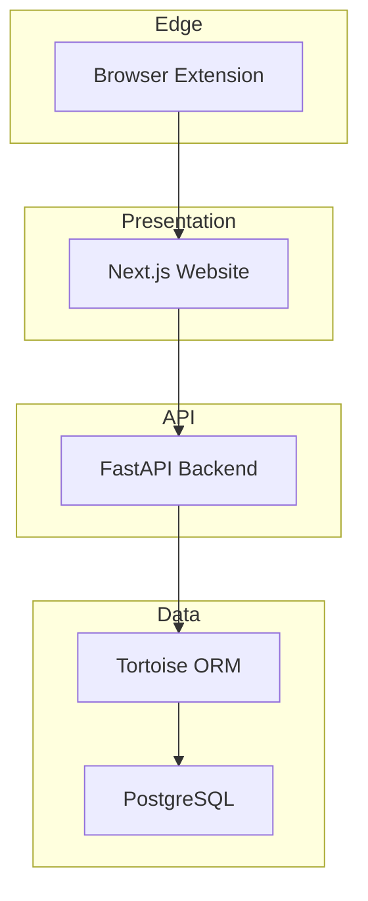
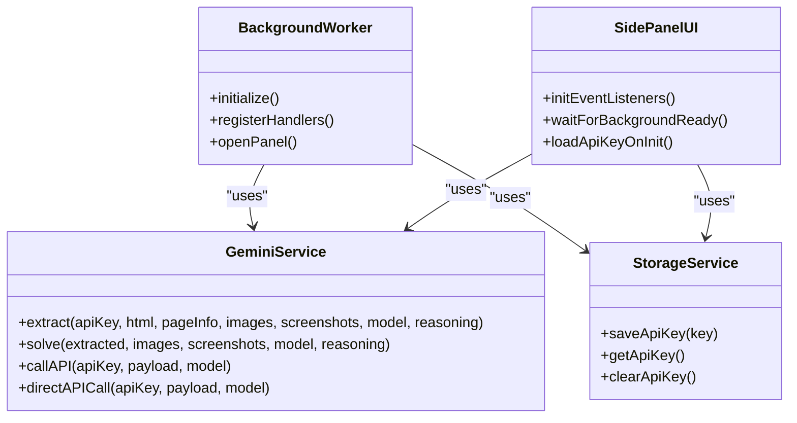
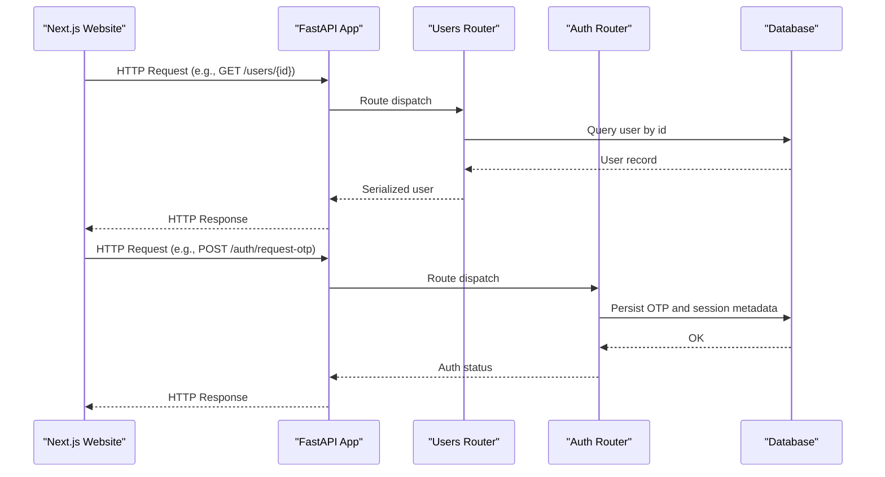
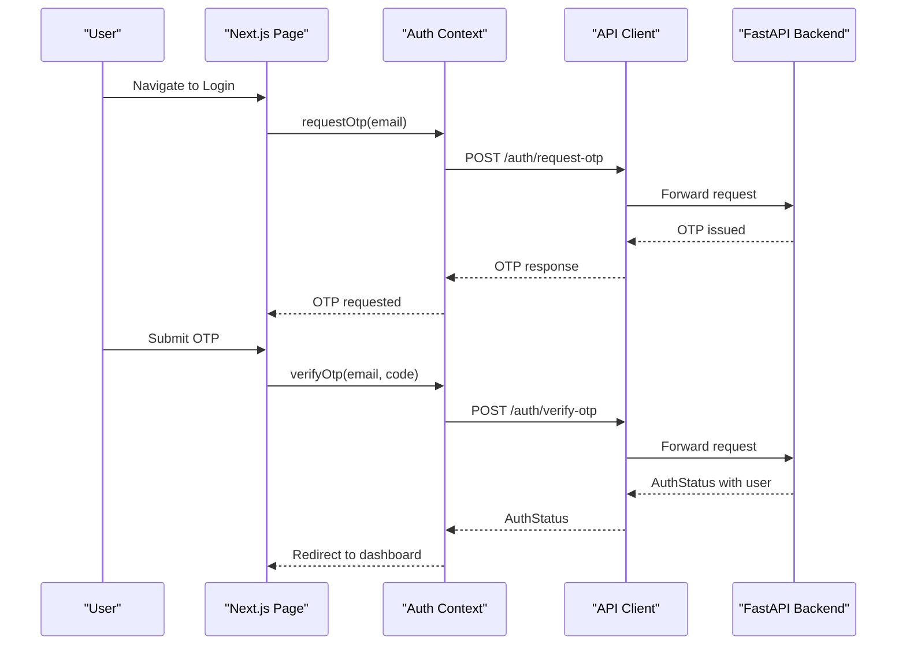
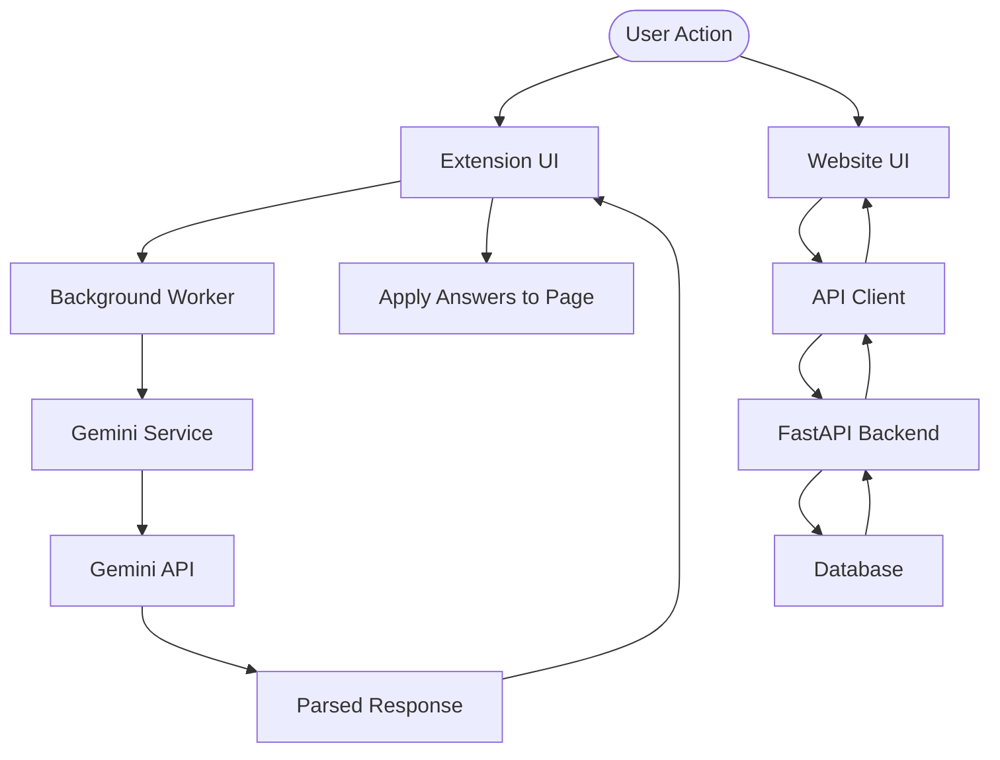
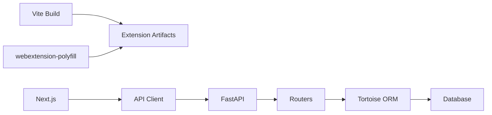

# Architecture overview

## Introduction
This page presents the architecture of the MOOC Utils ecosystem, a cohesive suite of tools designed to improve the MOOC learning experience. The system comprises three independent yet interconnected components:
- A browser extension that assists with assignment-solving using AI.
- A FastAPI backend that manages users, subscriptions, course data, and notifications.
- A Next.js web application that is a landing and dashboard experience, integrating with the backend for authentication and data.

These components collaborate to deliver a unified learning utility suite: the extension automates assignment tasks, the backend stores and orchestrates learning data, and the website provides a user-friendly interface for discovery, authentication, and dashboard management.

## Project structure
The repository is organized as a monorepo with three primary packages:
- assignment-solver: A modern browser extension built with Vite and webextension-polyfill, supporting Chrome and Firefox.
- notice-reminders: A FastAPI application with Tortoise ORM for persistence, offering REST endpoints for users, courses, subscriptions, and notifications.
- website: A Next.js 16 application using React 19, TypeScript, and TanStack Query for a responsive frontend.

```mermaid
graph TB
subgraph "Browser Extension"
EXT_UI["UI (Side Panel)"]
EXT_BG["Background Worker"]
EXT_CONTENT["Content Script"]
end
subgraph "Next.js Website"
WEB_APP["Next.js App Router"]
WEB_AUTH["Auth Context"]
WEB_API["API Client"]
end
subgraph "FastAPI Backend"
API_APP["FastAPI App"]
DB["Database (Tortoise ORM)"]
end
EXT_UI <- --> EXT_BG
EXT_BG <- --> EXT_CONTENT
WEB_APP --> WEB_AUTH
WEB_APP --> WEB_API
WEB_API --> API_APP
API_APP --> DB
```

## Core components
- Browser Extension (Assignment Solver)
  - UI: Side panel with controllers for settings, progress, and solving workflows.
  - Background: Service worker implementing a message router and handlers for extraction, screenshots, Gemini requests, and answer application.
  - Content Script: Interacts with the assignment page to extract HTML and apply answers.
  - Services: Gemini service for AI-powered extraction and solving, storage service for local key management.
  - Build: Vite with dynamic manifest generation for Chrome and Firefox.

- FastAPI Backend (Notice Reminders)
  - Application: FastAPI app with CORS middleware and route registration for users, auth, search, courses, announcements, subscriptions, and notifications.
  - Persistence: Tortoise ORM with Aerich migrations.
  - Entry Point: CLI/API mode selection via a single main entry point.

- Next.js Web Application (Website)
  - Routing: App Router with pages for landing, notice reminders dashboard, login, and privacy.
  - Authentication: Email OTP login with httpOnly cookies, session refresh, and logout.
  - API Layer: Strongly typed API client wrapping fetch with credential handling.
  - Providers: Theme provider and other UI providers.

## Architecture overview
The MOOC Utils ecosystem follows a distributed, layered architecture:
- Presentation Layer: Next.js website handles user onboarding, authentication, and dashboard views.
- API Layer: FastAPI backend exposes REST endpoints for CRUD operations and orchestration.
- Data Layer: Database persists users, courses, subscriptions, and notifications.
- Edge Layer: Browser extension integrates with the assignment page and communicates with the backend via the website's API layer.

```mermaid
graph TB
subgraph "Presentation"
WEB["Next.js Website"]
end
subgraph "API"
FASTAPI["FastAPI Backend"]
end
subgraph "Data"
TORTOISE["Tortoise ORM"]
DB["PostgreSQL"]
end
subgraph "Edge"
EXT["Browser Extension"]
end
WEB --> FASTAPI
FASTAPI --> TORTOISE
TORTOISE --> DB
EXT --> WEB
```

## Detailed component analysis

### Browser extension architecture
The extension employs a modular, dependency-injected design with explicit separation of concerns:
- UI: Initializes adapters, services, state, and controllers; waits for background readiness; wires event listeners.
- Background: Registers message handlers for extraction, screenshots, Gemini requests, and answer application; opens the side panel on action click.
- Content Script: Runs in page context to extract HTML and apply answers.
- Services: Gemini service encapsulates API calls, schema usage, and response parsing; storage service manages keys.

```mermaid
classDiagram
class BackgroundWorker {
+initialize()
+registerHandlers()
+openPanel()
}
class GeminiService {
+extract(apiKey, html, pageInfo, images, screenshots, model, reasoning)
+solve(extracted, images, screenshots, model, reasoning)
+callAPI(apiKey, payload, model)
+directAPICall(apiKey, payload, model)
}
class StorageService {
+saveApiKey(key)
+getApiKey()
+clearApiKey()
}
class SidePanelUI {
+initEventListeners()
+waitForBackgroundReady()
+loadApiKeyOnInit()
}
BackgroundWorker --> GeminiService : "uses"
BackgroundWorker --> StorageService : "uses"
SidePanelUI --> GeminiService : "uses"
SidePanelUI --> StorageService : "uses"
```

### FastAPI backend pattern
The backend follows a layered FastAPI pattern:
- Application Factory: Creates the FastAPI app, registers CORS, includes routers, and registers the database.
- Routers: Organized under app/api/routers for users, auth, search, courses, announcements, subscriptions, and notifications.
- Persistence: Models define entities and relationships; Tortoise ORM manages schema and migrations.
- Entry Point: Single main entry supports CLI and API modes.

```mermaid
sequenceDiagram
participant Client as "Next.js Website"
participant API as "FastAPI App"
participant Users as "Users Router"
participant Auth as "Auth Router"
participant DB as "Database"
Client->>API : HTTP Request (e.g., GET /users/{id})
API->>Users : Route dispatch
Users->>DB : Query user by id
DB-->>Users : User record
Users-->>API : Serialized user
API-->>Client : HTTP Response
Client->>API : HTTP Request (e.g., POST /auth/request-otp)
API->>Auth : Route dispatch
Auth->>DB : Persist OTP and session metadata
DB-->>Auth : OK
Auth-->>API : Auth status
API-->>Client : HTTP Response
```

### Next.js web application structure
The website uses App Router with a strict provider hierarchy:
- Layout: Sets metadata, fonts, and wraps children with Providers.
- Authentication Context: Manages OTP login, session refresh, logout, and user state.
- API Client: Centralized fetch wrapper with credential inclusion and error handling.

```mermaid
sequenceDiagram
participant User as "User"
participant UI as "Next.js Page"
participant Auth as "Auth Context"
participant API as "API Client"
participant BE as "FastAPI Backend"
User->>UI : Navigate to Login
UI->>Auth : requestOtp(email)
Auth->>API : POST /auth/request-otp
API->>BE : Forward request
BE-->>API : OTP issued
API-->>Auth : OTP response
Auth-->>UI : OTP requested
User->>UI : Submit OTP
UI->>Auth : verifyOtp(email, code)
Auth->>API : POST /auth/verify-otp
API->>BE : Forward request
BE-->>API : AuthStatus with user
API-->>Auth : AuthStatus
Auth-->>UI : Redirect to dashboard
```

### Data flow between components
- Extension to AI: The UI sends a message to the background worker, which invokes the Gemini service to call the Gemini API with structured prompts and schemas. Responses are parsed and returned to the UI.
- Website to Backend: The Next.js app calls the FastAPI backend using the API client, which includes credentials and handles errors. The backend routes requests to appropriate routers and interacts with the database.
- Cross-Browser Compatibility: The extension uses webextension-polyfill adapters to abstract browser differences and dynamic manifests for Chrome and Firefox.

```mermaid
flowchart TD
Start(["User Action"]) --> ExtUI["Extension UI"]
ExtUI --> BG["Background Worker"]
BG --> Gemini["Gemini Service"]
Gemini --> GeminiAPI["Gemini API"]
GeminiAPI --> GeminiResp["Parsed Response"]
GeminiResp --> ExtUI
ExtUI --> Apply["Apply Answers to Page"]
Start --> WebUI["Website UI"]
WebUI --> APIClient["API Client"]
APIClient --> FastAPI["FastAPI Backend"]
FastAPI --> DB["Database"]
DB --> FastAPI
FastAPI --> APIClient
APIClient --> WebUI
```

## Dependency analysis
- Technology Stack Choices
  - Browser Extension: Vite, webextension-polyfill, dynamic manifest generation, ES modules.
  - Backend: FastAPI, Uvicorn, Tortoise ORM, Aerich, Pydantic settings, HTTPX.
  - Website: Next.js 16, React 19, TypeScript, TanStack Query, Tailwind CSS, shadcn/ui.

- Architectural Patterns
  - Dependency Injection: Factory functions in the extension for testability and modularity.
  - Message-Driven Communication: Background worker routes messages to specialized handlers.
  - Event-Driven Architecture: Handlers react to UI actions and page events.
  - Clean Architecture: Separation of core utilities, platform adapters, services, background, UI, and content script.

```mermaid
graph LR
Vite["Vite Build"] --> EXT["Extension Artifacts"]
Polyfill["webextension-polyfill"] --> EXT
FastAPI["FastAPI"] --> Routers["Routers"]
Routers --> DBLayer["Tortoise ORM"]
DBLayer --> DB["Database"]
Next["Next.js"] --> API["API Client"]
API --> FastAPI
```

## Performance considerations
- Extension
  - Rate limiting and delays between API calls and DOM operations reduce throttling and ensure reliable page updates.
  - Direct API calls bypass message channel timeouts in certain environments.
- Backend
  - Asynchronous processing and efficient database queries improve responsiveness.
  - CORS configuration enables secure cross-origin requests.
- Website
  - TanStack Query caching and optimistic updates improve perceived performance.
  - Strict typing reduces runtime errors and improves maintainability.

[No sources needed since this section provides general guidance]

## Troubleshooting guide
- Extension
  - API Key Issues: Verify key validity and permissions; ensure correct model selection.
  - Platform Compatibility: Adjust selectors for unsupported platforms; confirm page readiness.
  - Rate Limits: Allow retries and reduce concurrent operations.
- Backend
  - Database Connectivity: Confirm connection URL and migration status.
  - Router Registration: Ensure all routers are included in the application factory.
- Website
  - Authentication: Check cookie settings and CORS configuration.
  - API Client: Validate base URL and error handling behavior.

## Conclusion
The MOOC Utils ecosystem demonstrates a well-structured, modular architecture that uses modern technologies to deliver a smooth learning experience. The browser extension, FastAPI backend, and Next.js website each serve distinct roles while remaining tightly integrated through clear APIs and shared patterns. The emphasis on dependency injection, message-driven communication, and clean separation of concerns ensures scalability, maintainability, and cross-platform compatibility.

[No sources needed since this section summarizes without analyzing specific files]

## Appendices
- System Boundaries
  - Extension boundary: UI, background worker, content script, and Gemini service.
  - Backend boundary: FastAPI app, routers, and database.
  - Website boundary: App Router, providers, and API client.
- Integration Points
  - Extension ↔ Website: API client consumes backend endpoints.
  - Website ↔ Backend: RESTful endpoints with CORS and session management.
  - Extension ↔ Gemini: Structured prompts and schemas for extraction and solving.

[No sources needed since this section provides general guidance]
