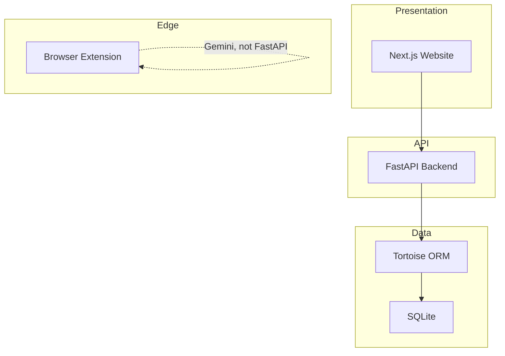
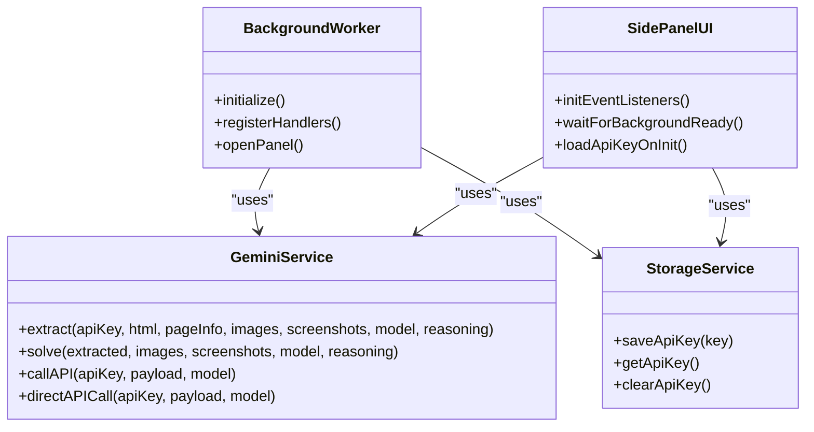
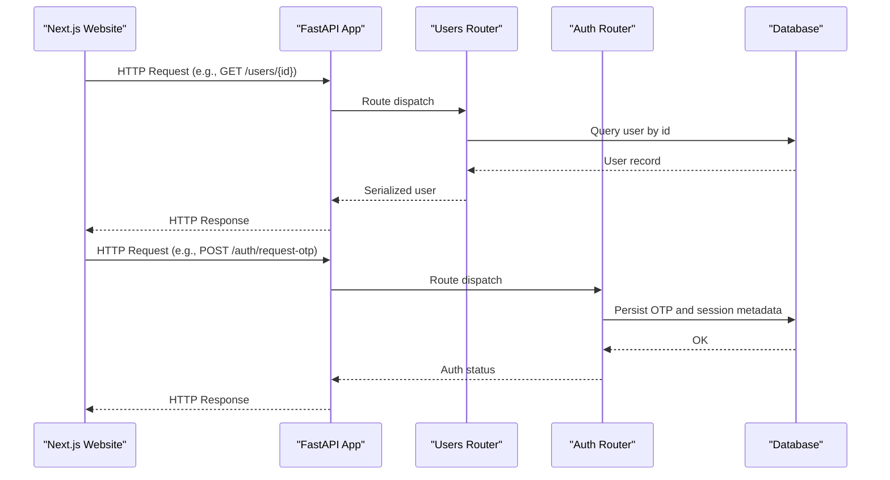
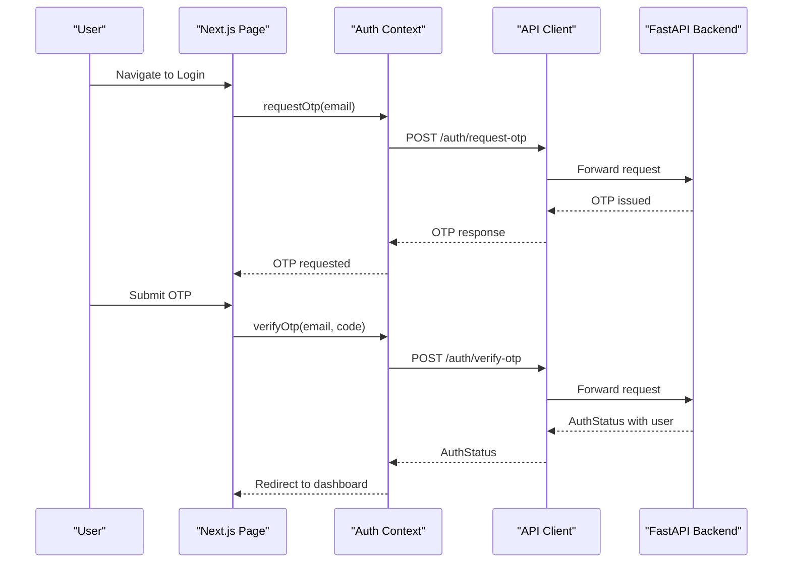
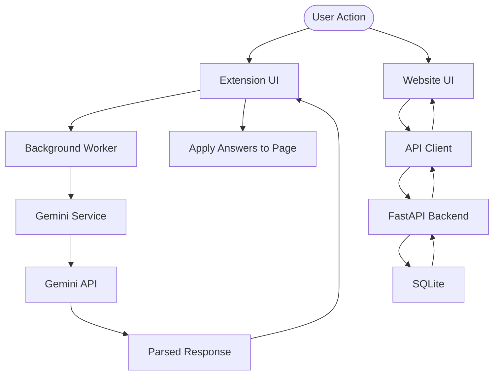
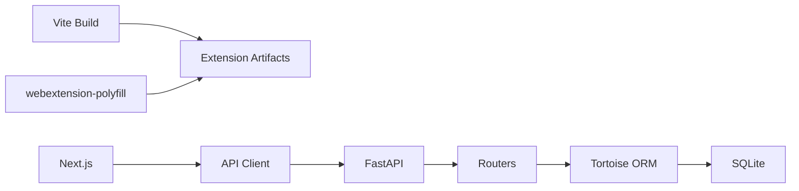

# Architecture overview

MOOC Utils is three cooperating apps:

- A browser extension for AI assignment help.
- A FastAPI backend for users, subscriptions, courses, and notifications.
- A Next.js site for landing and dashboard, talking to the backend for auth and data.

The extension does not go through the website to reach Gemini.

## Project structure

- `assignment-solver/`: Vite + webextension-polyfill, Chrome and Firefox.
- `notice-reminders/`: FastAPI + Tortoise ORM. CLI and API from `main.py`.
- `website/`: Next.js 16, React 19, TypeScript, TanStack Query.

```mermaid
graph TB
subgraph "Browser Extension"
EXT_UI["UI (Side Panel)"]
EXT_BG["Background Worker"]
EXT_CONTENT["Content Script"]
end
subgraph "Next.js Website"
WEB_APP["Next.js App Router"]
WEB_AUTH["Auth Context"]
WEB_API["API Client"]
end
subgraph "FastAPI Backend"
API_APP["FastAPI App"]
DB["SQLite (Tortoise ORM)"]
end
EXT_UI <- --> EXT_BG
EXT_BG <- --> EXT_CONTENT
WEB_APP --> WEB_AUTH
WEB_APP --> WEB_API
WEB_API --> API_APP
API_APP --> DB
```

## Core components

- Browser Extension (Assignment Solver)
  - UI: side panel controllers for settings, progress, solve.
  - Background: message router, extraction, screenshots, Gemini, apply answers.
  - Content script: page HTML and DOM writes.
  - Services: Gemini + local storage for the key.
  - Build: Vite, dynamic manifests.

- FastAPI Backend (Notice Reminders)
  - Routers: users, search, courses, announcements, subscriptions, notifications.
  - Persistence: Tortoise + Aerich, SQLite by default.
  - Entry: `uv run python main.py cli|api`.

- Next.js Website
  - Routes: `/`, `/notice-reminders`, `/notice-reminders/login`, `/notice-reminders/dashboard`, `/assignment-solver`, `/privacy`.
  - Auth: email OTP, httpOnly cookies, refresh, logout.
  - API: typed `fetch` client with credentials.

## Architecture overview

Presentation is the website. API is FastAPI. Data is SQLite via Tortoise. The extension is an edge client of Gemini, not of the Notice Reminders API.

```mermaid
graph TB
subgraph "Presentation"
WEB["Next.js Website"]
end
subgraph "API"
FASTAPI["FastAPI Backend"]
end
subgraph "Data"
TORTOISE["Tortoise ORM"]
DB["SQLite"]
end
subgraph "Edge"
EXT["Browser Extension"]
end
WEB --> FASTAPI
FASTAPI --> TORTOISE
TORTOISE --> DB
EXT -.->|"Gemini, not FastAPI"| EXT
```

## Browser extension architecture

```mermaid
classDiagram
class BackgroundWorker {
+initialize()
+registerHandlers()
+openPanel()
}
class GeminiService {
+extract(apiKey, html, pageInfo, images, screenshots, model, reasoning)
+solve(extracted, images, screenshots, model, reasoning)
+callAPI(apiKey, payload, model)
+directAPICall(apiKey, payload, model)
}
class StorageService {
+saveApiKey(key)
+getApiKey()
+clearApiKey()
}
class SidePanelUI {
+initEventListeners()
+waitForBackgroundReady()
+loadApiKeyOnInit()
}
BackgroundWorker --> GeminiService : "uses"
BackgroundWorker --> StorageService : "uses"
SidePanelUI --> GeminiService : "uses"
SidePanelUI --> StorageService : "uses"
```

UI waits for the background worker, then loads the stored key. Gemini requests use structured schemas in `src/services/gemini/schema.js`.

## FastAPI backend pattern

Factory creates the app, CORS, routers, Tortoise. Routers sit in `app/api/routers/`. There is no `package/api` tree.

```mermaid
sequenceDiagram
participant Client as "Next.js Website"
participant API as "FastAPI App"
participant Users as "Users Router"
participant Auth as "Auth Router"
participant DB as "Database"
Client->>API : HTTP Request (e.g., GET /users/{id})
API->>Users : Route dispatch
Users->>DB : Query user by id
DB-->>Users : User record
Users-->>API : Serialized user
API-->>Client : HTTP Response
Client->>API : HTTP Request (e.g., POST /auth/request-otp)
API->>Auth : Route dispatch
Auth->>DB : Persist OTP and session metadata
DB-->>Auth : OK
Auth-->>API : Auth status
API-->>Client : HTTP Response
```

## Next.js web application structure

```mermaid
sequenceDiagram
participant User as "User"
participant UI as "Next.js Page"
participant Auth as "Auth Context"
participant API as "API Client"
participant BE as "FastAPI Backend"
User->>UI : Navigate to Login
UI->>Auth : requestOtp(email)
Auth->>API : POST /auth/request-otp
API->>BE : Forward request
BE-->>API : OTP issued
API-->>Auth : OTP response
Auth-->>UI : OTP requested
User->>UI : Submit OTP
UI->>Auth : verifyOtp(email, code)
Auth->>API : POST /auth/verify-otp
API->>BE : Forward request
BE-->>API : AuthStatus with user
API-->>Auth : AuthStatus
Auth-->>UI : Redirect to dashboard
```

## Data flow between components

```mermaid
flowchart TD
Start(["User Action"]) --> ExtUI["Extension UI"]
ExtUI --> BG["Background Worker"]
BG --> Gemini["Gemini Service"]
Gemini --> GeminiAPI["Gemini API"]
GeminiAPI --> GeminiResp["Parsed Response"]
GeminiResp --> ExtUI
ExtUI --> Apply["Apply Answers to Page"]
Start --> WebUI["Website UI"]
WebUI --> APIClient["API Client"]
APIClient --> FastAPI["FastAPI Backend"]
FastAPI --> DB["SQLite"]
DB --> FastAPI
FastAPI --> APIClient
APIClient --> WebUI
```

## Dependency analysis

```mermaid
graph LR
Vite["Vite Build"] --> EXT["Extension Artifacts"]
Polyfill["webextension-polyfill"] --> EXT
FastAPI["FastAPI"] --> Routers["Routers"]
Routers --> DBLayer["Tortoise ORM"]
DBLayer --> DB["SQLite"]
Next["Next.js"] --> API["API Client"]
API --> FastAPI
```

## Performance

- Extension: delays between Gemini calls and DOM writes. Direct Gemini `fetch` avoids message-channel timeouts.
- Backend: async scraping, cache TTL, SQLite for local.
- Website: TanStack Query cache.

## Troubleshooting

- Extension: invalid Gemini key, selectors, quota.
- Backend: `database_url`, `jwt_secret`, router includes.
- Website: cookies, CORS, `NEXT_PUBLIC_API_URL`.

## Conclusion

Extension, API, website. Shared auth cookies and REST between site and API. The extension stays on-device with Gemini.

## Appendices

- Extension boundary: UI, background, content script, Gemini service.
- Backend boundary: FastAPI, routers, SQLite.
- Website boundary: App Router, providers, API client.
- Website ↔ Backend: REST, CORS, cookies.
- Extension ↔ Gemini: structured prompts and schemas.
- Extension ↔ Website: marketing/download page only. No Gemini proxy.
