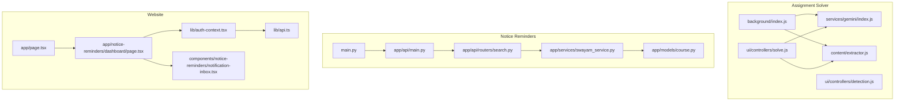
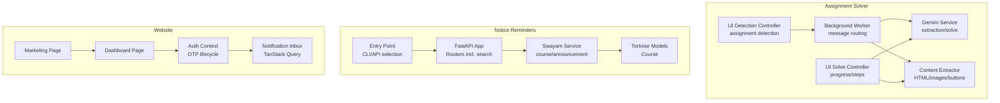
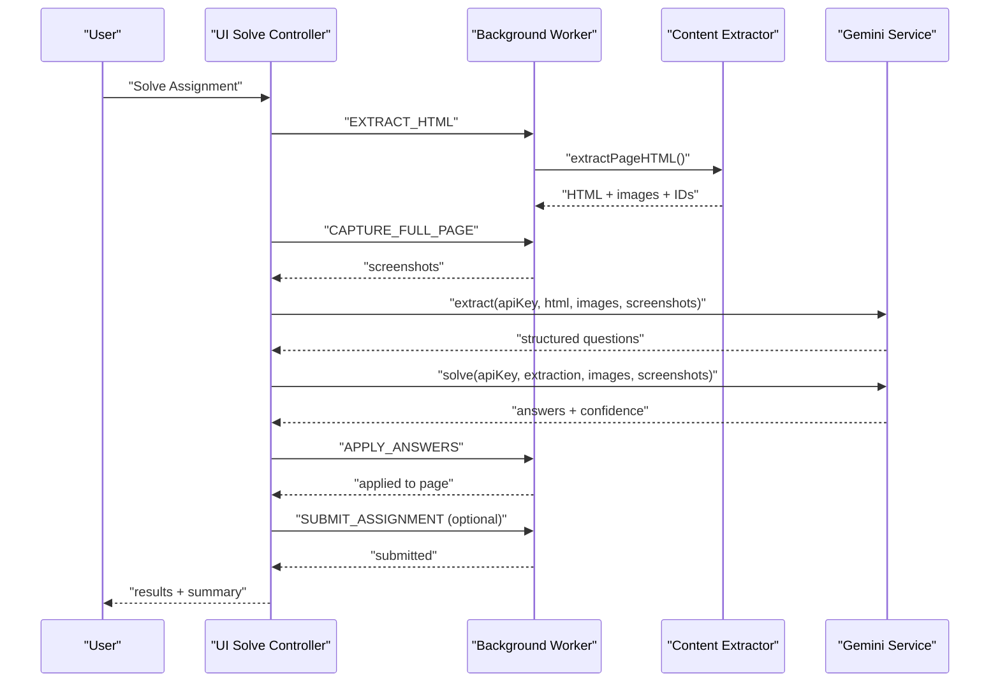
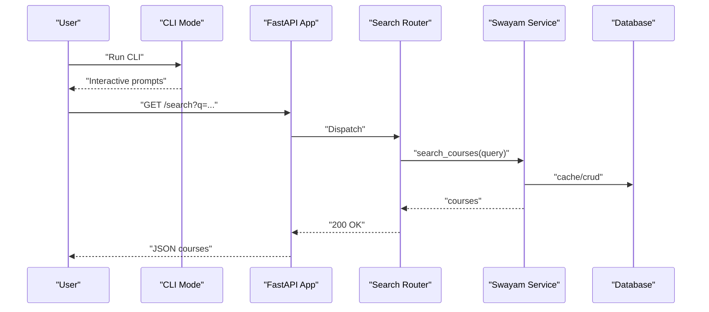
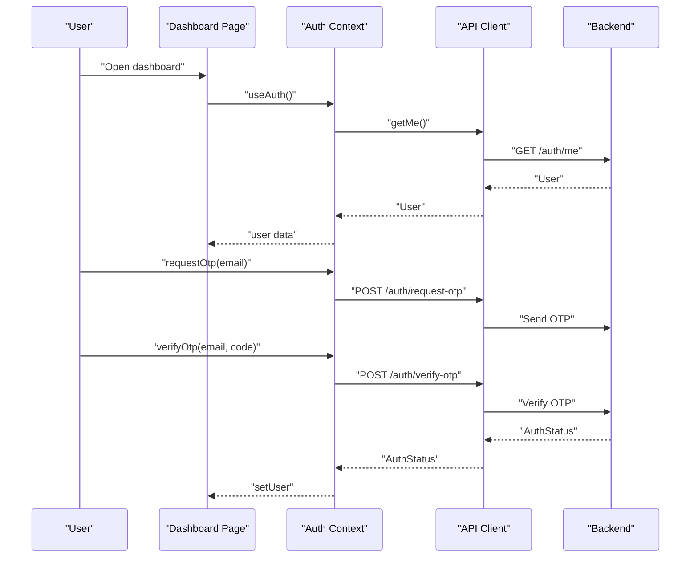
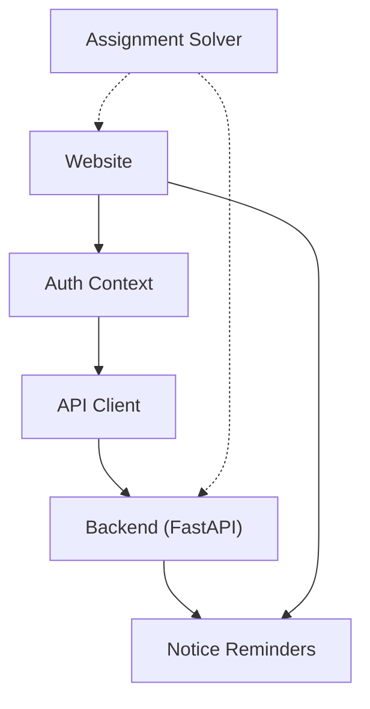

# Key Features

<cite>
**Referenced Files in This Document**
- [assignment-solver/README.md](file://assignment-solver/README.md)
- [assignment-solver/src/background/index.js](file://assignment-solver/src/background/index.js)
- [assignment-solver/src/services/gemini/index.js](file://assignment-solver/src/services/gemini/index.js)
- [assignment-solver/src/ui/controllers/detection.js](file://assignment-solver/src/ui/controllers/detection.js)
- [assignment-solver/src/ui/controllers/solve.js](file://assignment-solver/src/ui/controllers/solve.js)
- [assignment-solver/src/content/extractor.js](file://assignment-solver/src/content/extractor.js)
- [notice-reminders/README.md](file://notice-reminders/README.md)
- [notice-reminders/main.py](file://notice-reminders/main.py)
- [notice-reminders/app/api/main.py](file://notice-reminders/app/api/main.py)
- [notice-reminders/app/api/routers/search.py](file://notice-reminders/app/api/routers/search.py)
- [notice-reminders/app/models/course.py](file://notice-reminders/app/models/course.py)
- [notice-reminders/app/services/swayam_service.py](file://notice-reminders/app/services/swayam_service.py)
- [website/README.md](file://website/README.md)
- [website/app/page.tsx](file://website/app/page.tsx)
- [website/app/notice-reminders/dashboard/page.tsx](file://website/app/notice-reminders/dashboard/page.tsx)
- [website/lib/auth-context.tsx](file://website/lib/auth-context.tsx)
- [website/lib/api.ts](file://website/lib/api.ts)
- [website/components/notice-reminders/notification-inbox.tsx](file://website/components/notice-reminders/notification-inbox.tsx)
</cite>

## Table of Contents
1. [Introduction](#introduction)
2. [Project Structure](#project-structure)
3. [Core Components](#core-components)
4. [Architecture Overview](#architecture-overview)
5. [Detailed Component Analysis](#detailed-component-analysis)
6. [Dependency Analysis](#dependency-analysis)
7. [Performance Considerations](#performance-considerations)
8. [Troubleshooting Guide](#troubleshooting-guide)
9. [Conclusion](#conclusion)
10. [Appendices](#appendices)

## Introduction
This document presents the key features of MOOC Utils across its three components: Assignment Solver, Notice Reminders, and the Website. It highlights AI-powered capabilities, dual-mode operation, cross-platform support, privacy-first design, course search, announcement tracking, interactive CLI, and OTP-based authentication. It also provides feature comparisons, use cases, and value propositions for each component within the ecosystem.

## Project Structure
MOOC Utils is organized as a multi-component system:
- Assignment Solver: A browser extension leveraging AI to extract, analyze, and solve assignment questions with dual-mode operation and privacy-focused client-side processing.
- Notice Reminders: A Python-based system offering CLI and API modes for course search, announcement tracking, and user subscriptions.
- Website: A Next.js marketing and dashboard site integrating OTP authentication, course search, and user dashboards.

**Diagram sources**
- [assignment-solver/src/background/index.js](file://assignment-solver/src/background/index.js#L1-L135)
- [assignment-solver/src/services/gemini/index.js](file://assignment-solver/src/services/gemini/index.js#L1-L342)
- [assignment-solver/src/content/extractor.js](file://assignment-solver/src/content/extractor.js#L1-L241)
- [assignment-solver/src/ui/controllers/detection.js](file://assignment-solver/src/ui/controllers/detection.js#L1-L111)
- [assignment-solver/src/ui/controllers/solve.js](file://assignment-solver/src/ui/controllers/solve.js#L1-L778)
- [notice-reminders/main.py](file://notice-reminders/main.py#L1-L71)
- [notice-reminders/app/api/main.py](file://notice-reminders/app/api/main.py#L1-L46)
- [notice-reminders/app/api/routers/search.py](file://notice-reminders/app/api/routers/search.py#L1-L17)
- [notice-reminders/app/services/swayam_service.py](file://notice-reminders/app/services/swayam_service.py#L1-L25)
- [notice-reminders/app/models/course.py](file://notice-reminders/app/models/course.py#L1-L22)
- [website/app/page.tsx](file://website/app/page.tsx#L1-L20)
- [website/app/notice-reminders/dashboard/page.tsx](file://website/app/notice-reminders/dashboard/page.tsx#L1-L52)
- [website/lib/auth-context.tsx](file://website/lib/auth-context.tsx#L1-L97)
- [website/lib/api.ts](file://website/lib/api.ts#L1-L184)
- [website/components/notice-reminders/notification-inbox.tsx](file://website/components/notice-reminders/notification-inbox.tsx#L1-L156)

**Section sources**
- [assignment-solver/README.md](file://assignment-solver/README.md#L1-L339)
- [notice-reminders/README.md](file://notice-reminders/README.md#L1-L56)
- [website/README.md](file://website/README.md#L1-L51)

## Core Components
- Assignment Solver: AI-powered browser extension with dual-mode operation (Study Hints vs Auto-Solve), multi-format question support, image handling, export, and BYOK privacy model.
- Notice Reminders: CLI and API modes for course search, announcement retrieval, and subscription management; integrates with Swayam; provides interactive dashboard and OTP authentication.
- Website: Marketing site and dashboard with OTP-based authentication, public course search, and user-centric views.

**Section sources**
- [assignment-solver/README.md](file://assignment-solver/README.md#L5-L14)
- [notice-reminders/README.md](file://notice-reminders/README.md#L13-L18)
- [website/README.md](file://website/README.md#L13-L18)

## Architecture Overview
The system comprises three distinct but complementary modules:
- Assignment Solver: Client-side extraction and AI solving via Gemini, with secure local storage and optional screenshots.
- Notice Reminders: Python backend with FastAPI, database-backed models, and Swayam integration; supports CLI and API modes.
- Website: Next.js frontend with OTP authentication, TanStack Query for data fetching, and dashboard components.

**Diagram sources**
- [assignment-solver/src/background/index.js](file://assignment-solver/src/background/index.js#L44-L117)
- [assignment-solver/src/services/gemini/index.js](file://assignment-solver/src/services/gemini/index.js#L134-L341)
- [assignment-solver/src/content/extractor.js](file://assignment-solver/src/content/extractor.js#L21-L96)
- [assignment-solver/src/ui/controllers/solve.js](file://assignment-solver/src/ui/controllers/solve.js#L44-L240)
- [assignment-solver/src/ui/controllers/detection.js](file://assignment-solver/src/ui/controllers/detection.js#L26-L44)
- [notice-reminders/main.py](file://notice-reminders/main.py#L8-L66)
- [notice-reminders/app/api/main.py](file://notice-reminders/app/api/main.py#L17-L42)
- [notice-reminders/app/services/swayam_service.py](file://notice-reminders/app/services/swayam_service.py#L18-L24)
- [notice-reminders/app/models/course.py](file://notice-reminders/app/models/course.py#L8-L17)
- [website/app/page.tsx](file://website/app/page.tsx#L9-L19)
- [website/app/notice-reminders/dashboard/page.tsx](file://website/app/notice-reminders/dashboard/page.tsx#L13-L51)
- [website/lib/auth-context.tsx](file://website/lib/auth-context.tsx#L21-L87)
- [website/components/notice-reminders/notification-inbox.tsx](file://website/components/notice-reminders/notification-inbox.tsx#L26-L42)

## Detailed Component Analysis

### Assignment Solver: AI-Powered Assignment Solving
Key features:
- AI-powered question extraction and solving via Gemini with structured schemas.
- Dual-mode operation: Study Hints (educational guidance) and Auto-Solve (automated completion).
- Multi-format support: single choice, multi choice, fill-in-the-blank.
- Image support: embeds screenshots and extracted images for visual context.
- Privacy-focused BYOK model with client-side processing and local storage.
- Cross-browser support for Chrome and Firefox.

Feature deep dive:
- Extraction pipeline: content script extracts HTML and images, background worker orchestrates Gemini requests, and results are applied to the page.
- Recursive splitting: handles token limits by splitting HTML or question sets and merging results.
- Progress tracking: multi-step UI with determinate progress and status updates.
- Assignment detection: identifies NPTEL/Swayam assignment pages and counts questions.

**Diagram sources**
- [assignment-solver/src/ui/controllers/solve.js](file://assignment-solver/src/ui/controllers/solve.js#L44-L240)
- [assignment-solver/src/background/index.js](file://assignment-solver/src/background/index.js#L51-L113)
- [assignment-solver/src/content/extractor.js](file://assignment-solver/src/content/extractor.js#L21-L96)
- [assignment-solver/src/services/gemini/index.js](file://assignment-solver/src/services/gemini/index.js#L145-L217)

Practical examples:
- Study Hints mode: Extract questions, click “Get Study Hints” to receive guidance, then manually apply answers and submit.
- Auto-Solve mode: Extract questions, click “Solve All + Submit,” confirm, and review the summary.
- Handling images: The system captures full-page screenshots and embeds extracted images to aid AI understanding.

Privacy and security:
- API keys are stored locally and never sent to third-party servers.
- All processing occurs client-side or via official Gemini endpoints.

Use cases and value:
- Reduces time spent on repetitive assessments while preserving learning intent via hints mode.
- Automates submission for busy learners, with manual review controls.
- Addresses platform-specific layouts through selector-based extraction and recursive splitting.

**Section sources**
- [assignment-solver/README.md](file://assignment-solver/README.md#L5-L14)
- [assignment-solver/src/ui/controllers/solve.js](file://assignment-solver/src/ui/controllers/solve.js#L115-L180)
- [assignment-solver/src/services/gemini/index.js](file://assignment-solver/src/services/gemini/index.js#L145-L297)
- [assignment-solver/src/content/extractor.js](file://assignment-solver/src/content/extractor.js#L21-L96)
- [assignment-solver/src/background/index.js](file://assignment-solver/src/background/index.js#L51-L113)

### Notice Reminders: Course Search, Announcements, and Subscriptions
Key features:
- CLI mode for interactive scraping without a database.
- API mode with FastAPI backend, CORS-enabled, and database registration.
- Course search by keyword against Swayam.
- Announcement retrieval and notification inbox.
- User authentication via OTP (email) with httpOnly cookies.
- Subscription management for courses and channels.

Feature deep dive:
- Entry point selects CLI or API mode; API bootstraps routers and registers the database.
- Search router delegates to a service that caches and returns course results.
- Swayam integration encapsulated in a service layer returning typed models.
- Frontend dashboard components leverage TanStack Query for notifications and user profile.

**Diagram sources**
- [notice-reminders/main.py](file://notice-reminders/main.py#L49-L66)
- [notice-reminders/app/api/main.py](file://notice-reminders/app/api/main.py#L17-L42)
- [notice-reminders/app/api/routers/search.py](file://notice-reminders/app/api/routers/search.py#L10-L16)
- [notice-reminders/app/services/swayam_service.py](file://notice-reminders/app/services/swayam_service.py#L18-L24)
- [notice-reminders/app/models/course.py](file://notice-reminders/app/models/course.py#L8-L17)

Practical examples:
- CLI mode: Launch the CLI and browse announcements interactively without a backend.
- API mode: Start the server, search courses, create subscriptions, and manage notification channels.
- Dashboard: View unread notifications, mark as read, and manage subscriptions.

Use cases and value:
- Keeps learners informed about course announcements across Swayam.
- Provides flexible deployment modes (CLI for personal use, API for team dashboards).
- Simplifies course discovery and subscription management.

**Section sources**
- [notice-reminders/README.md](file://notice-reminders/README.md#L13-L18)
- [notice-reminders/main.py](file://notice-reminders/main.py#L8-L66)
- [notice-reminders/app/api/main.py](file://notice-reminders/app/api/main.py#L17-L42)
- [notice-reminders/app/api/routers/search.py](file://notice-reminders/app/api/routers/search.py#L10-L16)
- [notice-reminders/app/services/swayam_service.py](file://notice-reminders/app/services/swayam_service.py#L18-L24)
- [notice-reminders/app/models/course.py](file://notice-reminders/app/models/course.py#L8-L17)

### Website: Marketing Site, OTP Authentication, and Dashboard
Key features:
- Marketing site with hero, showcase, features, FAQ, and footer.
- Notice Reminders dashboard with subscriptions, notifications, and user profile.
- OTP-based authentication using httpOnly cookies and React Query.
- Public course search integrated with backend APIs.

Feature deep dive:
- Marketing page composes landing components.
- Dashboard page renders notification inbox and subscription manager inside an auth guard.
- Auth context manages OTP request/verify, session refresh, and logout.
- API client centralizes backend calls with credential inclusion and error handling.

**Diagram sources**
- [website/app/notice-reminders/dashboard/page.tsx](file://website/app/notice-reminders/dashboard/page.tsx#L13-L51)
- [website/lib/auth-context.tsx](file://website/lib/auth-context.tsx#L26-L64)
- [website/lib/api.ts](file://website/lib/api.ts#L150-L181)

Practical examples:
- Login: Request OTP, receive email, enter code to authenticate.
- Dashboard: Add subscriptions, view notifications, mark as read, and sign out.
- Public search: Use the search bar to discover courses and subscribe to announcements.

Use cases and value:
- Central hub for marketing and user onboarding.
- Secure, cookie-based authentication removes reliance on localStorage tokens.
- Unified dashboard streamlines course and announcement management.

**Section sources**
- [website/README.md](file://website/README.md#L13-L18)
- [website/app/page.tsx](file://website/app/page.tsx#L9-L19)
- [website/app/notice-reminders/dashboard/page.tsx](file://website/app/notice-reminders/dashboard/page.tsx#L13-L51)
- [website/lib/auth-context.tsx](file://website/lib/auth-context.tsx#L21-L87)
- [website/lib/api.ts](file://website/lib/api.ts#L150-L181)
- [website/components/notice-reminders/notification-inbox.tsx](file://website/components/notice-reminders/notification-inbox.tsx#L26-L42)

## Dependency Analysis
Inter-module relationships:
- Website depends on backend APIs for authentication, search, subscriptions, and notifications.
- Notice Reminders provides the data layer consumed by the Website dashboard.
- Assignment Solver is independent and does not depend on the other modules.

**Diagram sources**
- [website/lib/auth-context.tsx](file://website/lib/auth-context.tsx#L21-L87)
- [website/lib/api.ts](file://website/lib/api.ts#L28-L53)
- [notice-reminders/app/api/main.py](file://notice-reminders/app/api/main.py#L17-L42)
- [assignment-solver/src/services/gemini/index.js](file://assignment-solver/src/services/gemini/index.js#L134-L341)

**Section sources**
- [website/lib/api.ts](file://website/lib/api.ts#L1-L184)
- [notice-reminders/app/api/main.py](file://notice-reminders/app/api/main.py#L1-L46)

## Performance Considerations
- Assignment Solver:
  - Recursive splitting mitigates token limits by chunking HTML or questions and merging results.
  - Delays between API calls and DOM operations prevent throttling and ensure reliability.
- Notice Reminders:
  - FastAPI app enables efficient API responses; caching and database indexing improve search performance.
- Website:
  - TanStack Query optimizes data fetching and caching; cookie-based auth avoids frequent re-authentication.

[No sources needed since this section provides general guidance]

## Troubleshooting Guide
- Assignment Solver:
  - “Could not get page HTML”: Ensure you are on a valid assignment page and refresh.
  - “Question container not found”: Re-extract or adjust selectors for the platform.
  - “API Key invalid”: Verify the key at the provider’s portal and remove extra spaces.
  - “Answers not being applied”: Platform-specific components may require manual application.
  - “Rate limit errors”: Wait and reduce concurrent operations.
- Notice Reminders:
  - CLI mode requires Python 3.12+ and uv; ensure dependencies are installed.
  - API mode needs a running database; CORS must be configured for the frontend origin.
- Website:
  - Backend must be running for login and dashboard data.
  - Environment variable for API URL must be set for local development.

**Section sources**
- [assignment-solver/README.md](file://assignment-solver/README.md#L259-L289)
- [notice-reminders/README.md](file://notice-reminders/README.md#L20-L28)
- [website/README.md](file://website/README.md#L27-L50)

## Conclusion
MOOC Utils delivers a cohesive ecosystem:
- Assignment Solver accelerates assessment completion with AI while preserving learning via hints.
- Notice Reminders keeps learners informed through course search, announcements, and subscriptions.
- Website provides a secure, user-friendly interface for authentication, discovery, and dashboard management.

Together, they address common MOOC learning pain points: time management, information overload, and fragmented workflows.

[No sources needed since this section summarizes without analyzing specific files]

## Appendices

### Feature Comparison Matrix
- Assignment Solver
  - AI extraction and solving
  - Dual-mode operation
  - Multi-format question types
  - Image support
  - BYOK and privacy
  - Cross-browser
- Notice Reminders
  - CLI and API modes
  - Course search
  - Announcement tracking
  - Subscriptions
  - OTP authentication
- Website
  - Marketing site
  - Dashboard
  - Public course search
  - OTP authentication

[No sources needed since this section provides general guidance]