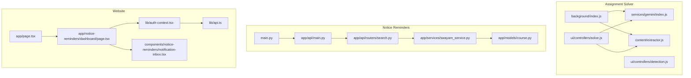
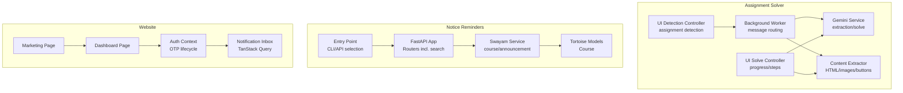
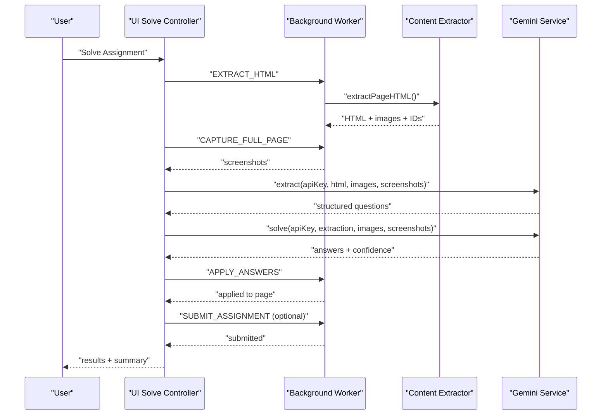
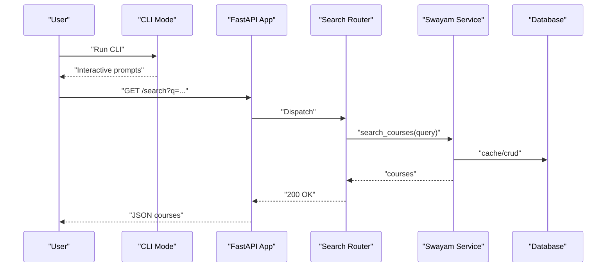
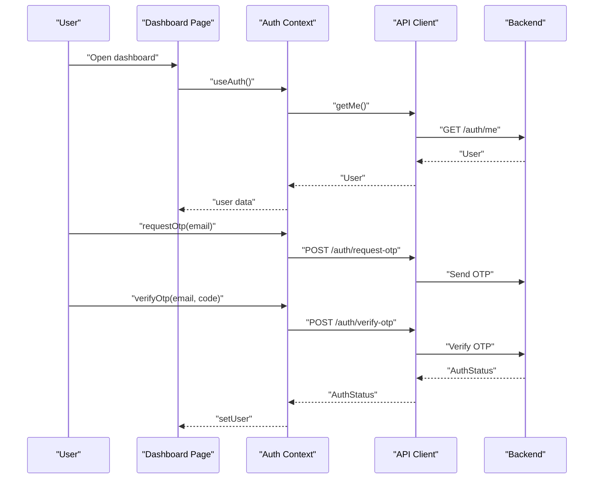
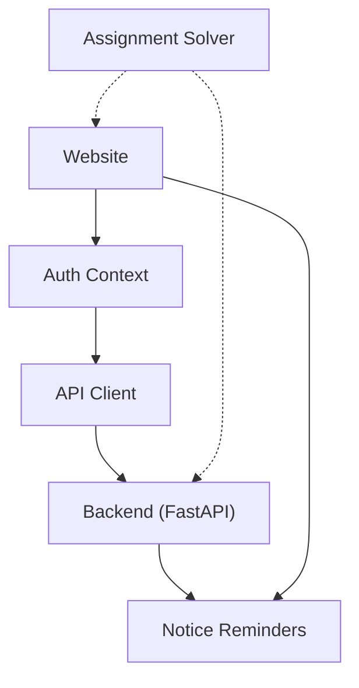

# Key features

## Introduction
This page presents the key features of MOOC Utils across its three components: Assignment Solver, Notice Reminders, and the Website. It highlights AI-powered capabilities, dual-mode operation, cross-platform support, privacy-first design, course search, announcement tracking, interactive CLI, and OTP-based authentication. It also provides feature comparisons, use cases, and value propositions for each component within the ecosystem.

## Project structure
MOOC Utils is organized as a multi-component system:
- Assignment Solver: A browser extension using AI to extract, analyze, and solve assignment questions with dual-mode operation and privacy-focused client-side processing.
- Notice Reminders: A Python-based system offering CLI and API modes for course search, announcement tracking, and user subscriptions.
- Website: A Next.js marketing and dashboard site integrating OTP authentication, course search, and user dashboards.

```mermaid
graph TB
subgraph "Assignment Solver"
AS_BG["background/index.js"]
AS_GEM["services/gemini/index.js"]
AS_EXT["content/extractor.js"]
AS_UI_D["ui/controllers/detection.js"]
AS_UI_S["ui/controllers/solve.js"]
end
subgraph "Notice Reminders"
NR_MAIN["main.py"]
NR_API["app/api/main.py"]
NR_SEARCH["app/api/routers/search.py"]
NR_SWAYAM["app/services/swayam_service.py"]
NR_MODEL_COURSE["app/models/course.py"]
end
subgraph "Website"
WEB_PAGE["app/page.tsx"]
WEB_DASH["app/notice-reminders/dashboard/page.tsx"]
WEB_AUTH["lib/auth-context.tsx"]
WEB_API["lib/api.ts"]
WEB_INBOX["components/notice-reminders/notification-inbox.tsx"]
end
AS_BG --> AS_GEM
AS_BG --> AS_EXT
AS_UI_S --> AS_GEM
AS_UI_S --> AS_EXT
NR_MAIN --> NR_API
NR_API --> NR_SEARCH
NR_SEARCH --> NR_SWAYAM
NR_SWAYAM --> NR_MODEL_COURSE
WEB_PAGE --> WEB_DASH
WEB_DASH --> WEB_AUTH
WEB_AUTH --> WEB_API
WEB_DASH --> WEB_INBOX
```

## Core components
- Assignment Solver: AI-powered browser extension with dual-mode operation (Study Hints vs Auto-Solve), multi-format question support, image handling, export, and BYOK privacy model.
- Notice Reminders: CLI and API modes for course search, announcement retrieval, and subscription management; integrates with Swayam; provides interactive dashboard and OTP authentication.
- Website: Marketing site and dashboard with OTP-based authentication, public course search, and user-centric views.

## Architecture overview
The system comprises three distinct but complementary modules:
- Assignment Solver: Client-side extraction and AI solving via Gemini, with secure local storage and optional screenshots.
- Notice Reminders: Python backend with FastAPI, database-backed models, and Swayam integration; supports CLI and API modes.
- Website: Next.js frontend with OTP authentication, TanStack Query for data fetching, and dashboard components.

```mermaid
graph TB
subgraph "Assignment Solver"
BG["Background Worker<br/>message routing"]
GEM["Gemini Service<br/>extraction/solve"]
EXT["Content Extractor<br/>HTML/images/buttons"]
UI_S["UI Solve Controller<br/>progress/steps"]
UI_D["UI Detection Controller<br/>assignment detection"]
end
subgraph "Notice Reminders"
MAIN["Entry Point<br/>CLI/API selection"]
API["FastAPI App<br/>Routers incl. search"]
SWAYAM["Swayam Service<br/>course/announcement"]
MODELS["Tortoise Models<br/>Course"]
end
subgraph "Website"
PAGE["Marketing Page"]
DASH["Dashboard Page"]
AUTH["Auth Context<br/>OTP lifecycle"]
INBOX["Notification Inbox<br/>TanStack Query"]
end
BG --> GEM
BG --> EXT
UI_S --> GEM
UI_S --> EXT
UI_D --> BG
MAIN --> API
API --> SWAYAM
SWAYAM --> MODELS
PAGE --> DASH
DASH --> AUTH
AUTH --> INBOX
```

## Detailed component analysis

### Assignment solver: AI-powered assignment solving
Key features:
- AI-powered question extraction and solving via Gemini with structured schemas.
- Dual-mode operation: Study Hints (educational guidance) and Auto-Solve (automated completion).
- Multi-format support: single choice, multi choice, fill-in-the-blank.
- Image support: embeds screenshots and extracted images for visual context.
- Privacy-focused BYOK model with client-side processing and local storage.
- Cross-browser support for Chrome and Firefox.

Feature deep dive:
- Extraction pipeline: content script extracts HTML and images, background worker orchestrates Gemini requests, and results are applied to the page.
- Recursive splitting: handles token limits by splitting HTML or question sets and merging results.
- Progress tracking: multi-step UI with determinate progress and status updates.
- Assignment detection: identifies NPTEL/Swayam assignment pages and counts questions.

```mermaid
sequenceDiagram
participant User as "User"
participant UI as "UI Solve Controller"
participant BG as "Background Worker"
participant CS as "Content Extractor"
participant GEM as "Gemini Service"
User->>UI : "Solve Assignment"
UI->>BG : "EXTRACT_HTML"
BG->>CS : "extractPageHTML()"
CS-->>BG : "HTML + images + IDs"
UI->>BG : "CAPTURE_FULL_PAGE"
BG-->>UI : "screenshots"
UI->>GEM : "extract(apiKey, html, images, screenshots)"
GEM-->>UI : "structured questions"
UI->>GEM : "solve(apiKey, extraction, images, screenshots)"
GEM-->>UI : "answers + confidence"
UI->>BG : "APPLY_ANSWERS"
BG-->>UI : "applied to page"
UI->>BG : "SUBMIT_ASSIGNMENT (optional)"
BG-->>UI : "submitted"
UI-->>User : "results + summary"
```

Practical examples:
- Study Hints mode: Extract questions, click "Get Study Hints" to receive guidance, then manually apply answers and submit.
- Auto-Solve mode: Extract questions, click "Solve All + Submit," confirm, and review the summary.
- Handling images: The system captures full-page screenshots and embeds extracted images to aid AI understanding.

Privacy and security:
- API keys are stored locally and never sent to third-party servers.
- All processing occurs client-side or via official Gemini endpoints.

Use cases and value:
- Reduces time spent on repetitive assessments while preserving learning intent via hints mode.
- Automates submission for busy learners, with manual review controls.
- Addresses platform-specific layouts through selector-based extraction and recursive splitting.

### Notice reminders: course search, announcements, and subscriptions
Key features:
- CLI mode for interactive scraping without a database.
- API mode with FastAPI backend, CORS-enabled, and database registration.
- Course search by keyword against Swayam.
- Announcement retrieval and notification inbox.
- User authentication via OTP (email) with httpOnly cookies.
- Subscription management for courses and channels.

Feature deep dive:
- Entry point selects CLI or API mode; API bootstraps routers and registers the database.
- Search router delegates to a service that caches and returns course results.
- Swayam integration encapsulated in a service layer returning typed models.
- Frontend dashboard components use TanStack Query for notifications and user profile.

```mermaid
sequenceDiagram
participant User as "User"
participant CLI as "CLI Mode"
participant API as "FastAPI App"
participant Search as "Search Router"
participant Svc as "Swayam Service"
participant DB as "Database"
User->>CLI : "Run CLI"
CLI-->>User : "Interactive prompts"
User->>API : "GET /search?q=..."
API->>Search : "Dispatch"
Search->>Svc : "search_courses(query)"
Svc->>DB : "cache/crud"
Svc-->>Search : "courses"
Search-->>API : "200 OK"
API-->>User : "JSON courses"
```

Practical examples:
- CLI mode: Launch the CLI and browse announcements interactively without a backend.
- API mode: Start the server, search courses, create subscriptions, and manage notification channels.
- Dashboard: View unread notifications, mark as read, and manage subscriptions.

Use cases and value:
- Keeps learners informed about course announcements across Swayam.
- Provides flexible deployment modes (CLI for personal use, API for team dashboards).
- Simplifies course discovery and subscription management.

### Website: marketing site, OTP authentication, and dashboard
Key features:
- Marketing site with hero, showcase, features, FAQ, and footer.
- Notice Reminders dashboard with subscriptions, notifications, and user profile.
- OTP-based authentication using httpOnly cookies and React Query.
- Public course search integrated with backend APIs.

Feature deep dive:
- Marketing page composes landing components.
- Dashboard page renders notification inbox and subscription manager inside an auth guard.
- Auth context manages OTP request/verify, session refresh, and logout.
- API client centralizes backend calls with credential inclusion and error handling.

```mermaid
sequenceDiagram
participant User as "User"
participant Page as "Dashboard Page"
participant Auth as "Auth Context"
participant API as "API Client"
participant BE as "Backend"
User->>Page : "Open dashboard"
Page->>Auth : "useAuth()"
Auth->>API : "getMe()"
API->>BE : "GET /auth/me"
BE-->>API : "User"
API-->>Auth : "User"
Auth-->>Page : "user data"
User->>Auth : "requestOtp(email)"
Auth->>API : "POST /auth/request-otp"
API->>BE : "Send OTP"
User->>Auth : "verifyOtp(email, code)"
Auth->>API : "POST /auth/verify-otp"
API->>BE : "Verify OTP"
BE-->>API : "AuthStatus"
API-->>Auth : "AuthStatus"
Auth-->>Page : "setUser"
```

Practical examples:
- Login: Request OTP, receive email, enter code to authenticate.
- Dashboard: Add subscriptions, view notifications, mark as read, and sign out.
- Public search: Use the search bar to discover courses and subscribe to announcements.

Use cases and value:
- Central hub for marketing and user onboarding.
- Secure, cookie-based authentication removes reliance on localStorage tokens.
- Unified dashboard streamlines course and announcement management.

## Dependency analysis
Inter-module relationships:
- Website depends on backend APIs for authentication, search, subscriptions, and notifications.
- Notice Reminders provides the data layer consumed by the Website dashboard.
- Assignment Solver is independent and does not depend on the other modules.

```mermaid
graph TB
WEB["Website"]
AUTH["Auth Context"]
API["API Client"]
BE["Backend (FastAPI)"]
NR["Notice Reminders"]
AS["Assignment Solver"]
WEB --> AUTH
AUTH --> API
API --> BE
BE --> NR
WEB --> NR
AS -.-> WEB
AS -.-> BE
```

## Performance considerations
- Assignment Solver:
  - Recursive splitting mitigates token limits by chunking HTML or questions and merging results.
  - Delays between API calls and DOM operations prevent throttling and ensure reliability.
- Notice Reminders:
  - FastAPI app enables efficient API responses; caching and database indexing improve search performance.
- Website:
  - TanStack Query optimizes data fetching and caching; cookie-based auth avoids frequent re-authentication.

[No sources needed since this section provides general guidance]

## Troubleshooting guide
- Assignment Solver:
  - "Could not get page HTML": Ensure you are on a valid assignment page and refresh.
  - "Question container not found": Re-extract or adjust selectors for the platform.
  - "API Key invalid": Verify the key at the provider's portal and remove extra spaces.
  - "Answers not being applied": Platform-specific components may require manual application.
  - "Rate limit errors": Wait and reduce concurrent operations.
- Notice Reminders:
  - CLI mode requires Python 3.12+ and uv; ensure dependencies are installed.
  - API mode needs a running database; CORS must be configured for the frontend origin.
- Website:
  - Backend must be running for login and dashboard data.
  - Environment variable for API URL must be set for local development.

## Conclusion
MOOC Utils delivers a cohesive ecosystem:
- Assignment Solver accelerates assessment completion with AI while preserving learning via hints.
- Notice Reminders keeps learners informed through course search, announcements, and subscriptions.
- Website provides a secure, user-friendly interface for authentication, discovery, and dashboard management.

Together, they address common MOOC learning pain points: time management, information overload, and fragmented workflows.

[No sources needed since this section summarizes without analyzing specific files]

## Appendices

### Feature comparison matrix
- Assignment Solver
  - AI extraction and solving
  - Dual-mode operation
  - Multi-format question types
  - Image support
  - BYOK and privacy
  - Cross-browser
- Notice Reminders
  - CLI and API modes
  - Course search
  - Announcement tracking
  - Subscriptions
  - OTP authentication
- Website
  - Marketing site
  - Dashboard
  - Public course search
  - OTP authentication

[No sources needed since this section provides general guidance]
