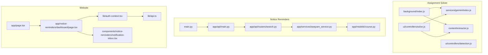
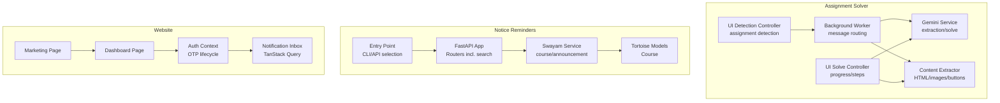
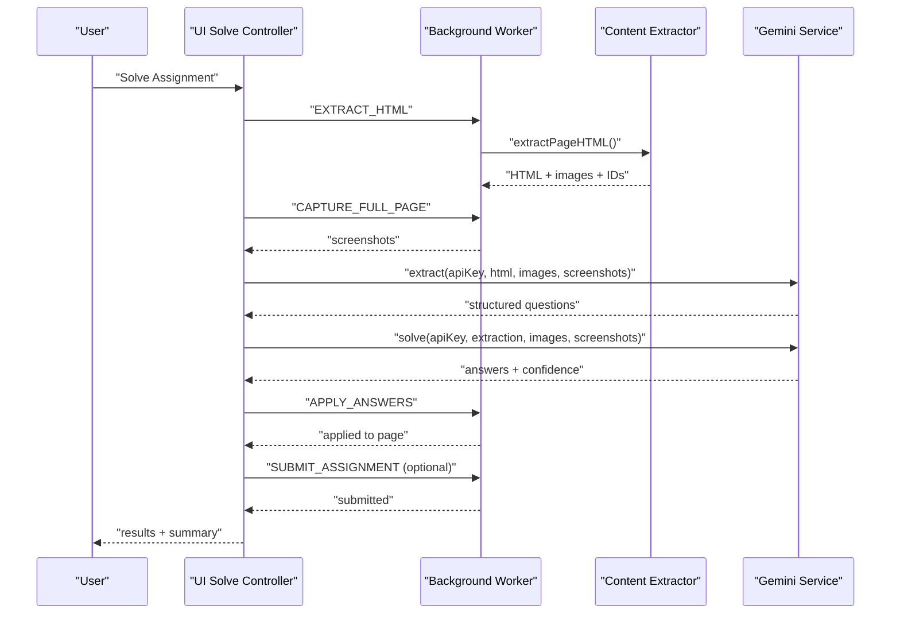
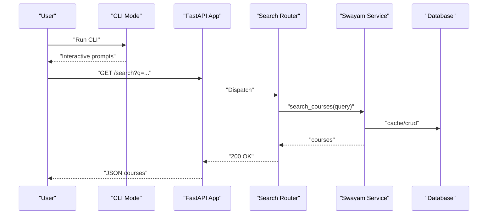
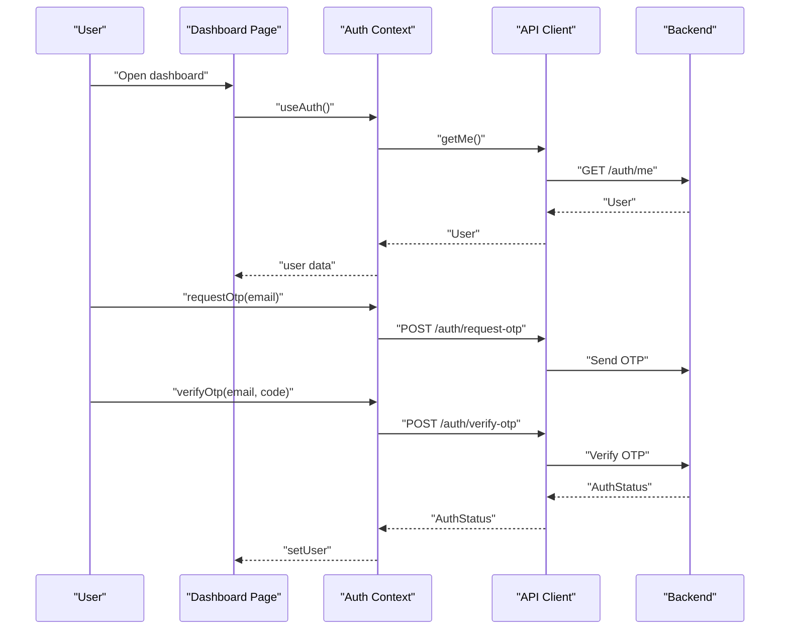
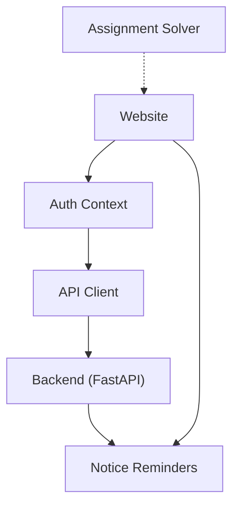

# Key features

Feature list across Assignment Solver, Notice Reminders, and the Website.

## Project structure

```mermaid
graph TB
subgraph "Assignment Solver"
AS_BG["background/index.js"]
AS_GEM["services/gemini/index.js"]
AS_EXT["content/extractor.js"]
AS_UI_D["ui/controllers/detection.js"]
AS_UI_S["ui/controllers/solve.js"]
end
subgraph "Notice Reminders"
NR_MAIN["main.py"]
NR_API["app/api/main.py"]
NR_SEARCH["app/api/routers/search.py"]
NR_SWAYAM["app/services/swayam_service.py"]
NR_MODEL_COURSE["app/models/course.py"]
end
subgraph "Website"
WEB_PAGE["app/page.tsx"]
WEB_DASH["app/notice-reminders/dashboard/page.tsx"]
WEB_AUTH["lib/auth-context.tsx"]
WEB_API["lib/api.ts"]
WEB_INBOX["components/notice-reminders/notification-inbox.tsx"]
end
AS_BG --> AS_GEM
AS_BG --> AS_EXT
AS_UI_S --> AS_GEM
AS_UI_S --> AS_EXT
NR_MAIN --> NR_API
NR_API --> NR_SEARCH
NR_SEARCH --> NR_SWAYAM
NR_SWAYAM --> NR_MODEL_COURSE
WEB_PAGE --> WEB_DASH
WEB_DASH --> WEB_AUTH
WEB_AUTH --> WEB_API
WEB_DASH --> WEB_INBOX
```

## Core components

- Assignment Solver: Study Hints vs Auto-Solve, multi-format questions, images, export, BYOK.
- Notice Reminders: CLI and API, Swayam search, announcements, OTP, subscriptions.
- Website: marketing, OTP dashboard, public search, extension page.

## Architecture overview

```mermaid
graph TB
subgraph "Assignment Solver"
BG["Background Worker<br/>message routing"]
GEM["Gemini Service<br/>extraction/solve"]
EXT["Content Extractor<br/>HTML/images/buttons"]
UI_S["UI Solve Controller<br/>progress/steps"]
UI_D["UI Detection Controller<br/>assignment detection"]
end
subgraph "Notice Reminders"
MAIN["Entry Point<br/>CLI/API selection"]
API["FastAPI App<br/>Routers incl. search"]
SWAYAM["Swayam Service<br/>course/announcement"]
MODELS["Tortoise Models<br/>Course"]
end
subgraph "Website"
PAGE["Marketing Page"]
DASH["Dashboard Page"]
AUTH["Auth Context<br/>OTP lifecycle"]
INBOX["Notification Inbox<br/>TanStack Query"]
end
BG --> GEM
BG --> EXT
UI_S --> GEM
UI_S --> EXT
UI_D --> BG
MAIN --> API
API --> SWAYAM
SWAYAM --> MODELS
PAGE --> DASH
DASH --> AUTH
AUTH --> INBOX
```

## Assignment solver

Gemini extracts structured questions from page HTML. Study Hints explains without dumping the answer first. Auto-Solve fills and can submit. Single choice, multi choice, fill-in-the-blank. Screenshots plus per-question images go to Gemini. Key stays in the browser. Chrome and Firefox.

```mermaid
sequenceDiagram
participant User as "User"
participant UI as "UI Solve Controller"
participant BG as "Background Worker"
participant CS as "Content Extractor"
participant GEM as "Gemini Service"
User->>UI : "Solve Assignment"
UI->>BG : "EXTRACT_HTML"
BG->>CS : "extractPageHTML()"
CS-->>BG : "HTML + images + IDs"
UI->>BG : "CAPTURE_FULL_PAGE"
BG-->>UI : "screenshots"
UI->>GEM : "extract(apiKey, html, images, screenshots)"
GEM-->>UI : "structured questions"
UI->>GEM : "solve(apiKey, extraction, images, screenshots)"
GEM-->>UI : "answers + confidence"
UI->>BG : "APPLY_ANSWERS"
BG-->>UI : "applied to page"
UI->>BG : "SUBMIT_ASSIGNMENT (optional)"
BG-->>UI : "submitted"
UI-->>User : "results + summary"
```

If HTML is too large, the extractor splits and merges. Selectors live in `src/content/extractor.js`. Academic honesty is on you. The README says as much.

## Notice reminders

CLI for interactive scraping. API for the dashboard. Search by keyword on Swayam. Announcements into the inbox. OTP cookies. Subscriptions per course.

```mermaid
sequenceDiagram
participant User as "User"
participant CLI as "CLI Mode"
participant API as "FastAPI App"
participant Search as "Search Router"
participant Svc as "Swayam Service"
participant DB as "Database"
User->>CLI : "Run CLI"
CLI-->>User : "Interactive prompts"
User->>API : "GET /search?q=..."
API->>Search : "Dispatch"
Search->>Svc : "search_courses(query)"
Svc->>DB : "cache/crud"
Svc-->>Search : "courses"
Search-->>API : "200 OK"
API-->>User : "JSON courses"
```

`uv run python main.py cli` needs no DB. `uv run python main.py api` does.

## Website

Hero, product demo, features, FAQ. Dashboard with inbox, subscriptions, profile, behind an auth guard. Public search still needs the API.

```mermaid
sequenceDiagram
participant User as "User"
participant Page as "Dashboard Page"
participant Auth as "Auth Context"
participant API as "API Client"
participant BE as "Backend"
User->>Page : "Open dashboard"
Page->>Auth : "useAuth()"
Auth->>API : "getMe()"
API->>BE : "GET /auth/me"
BE-->>API : "User"
API-->>Auth : "User"
Auth-->>Page : "user data"
User->>Auth : "requestOtp(email)"
Auth->>API : "POST /auth/request-otp"
API->>BE : "Send OTP"
User->>Auth : "verifyOtp(email, code)"
Auth->>API : "POST /auth/verify-otp"
API->>BE : "Verify OTP"
BE-->>API : "AuthStatus"
API-->>Auth : "AuthStatus"
Auth-->>Page : "setUser"
```

## Dependency analysis

```mermaid
graph TB
WEB["Website"]
AUTH["Auth Context"]
API["API Client"]
BE["Backend (FastAPI)"]
NR["Notice Reminders"]
AS["Assignment Solver"]
WEB --> AUTH
AUTH --> API
API --> BE
BE --> NR
WEB --> NR
AS -.-> WEB
```

The dashed line is the extension download page, not a Gemini proxy.

## Performance

Recursive HTML splits on token limits. Gemini/DOM delays. FastAPI plus cache TTL. TanStack Query on the dashboard.

## Troubleshooting

- Extension: page HTML, selectors, Gemini key, custom inputs, quota.
- Notice Reminders: Python 3.12+, `uv`, writable SQLite, CORS.
- Website: API up, `NEXT_PUBLIC_API_URL` set.

## Conclusion

AI help where it is private, notices where they are easy to miss, dashboard where settings live.

## Appendices

### Feature comparison

- Assignment Solver: extraction, dual modes, question types, images, BYOK, Chrome/Firefox.
- Notice Reminders: CLI and API, search, announcements, subscriptions, OTP.
- Website: marketing, dashboard, public search, OTP.
