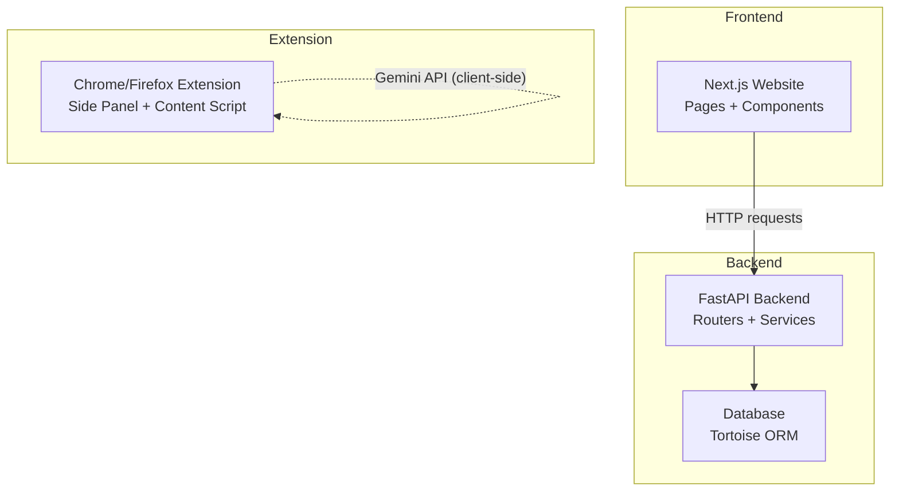
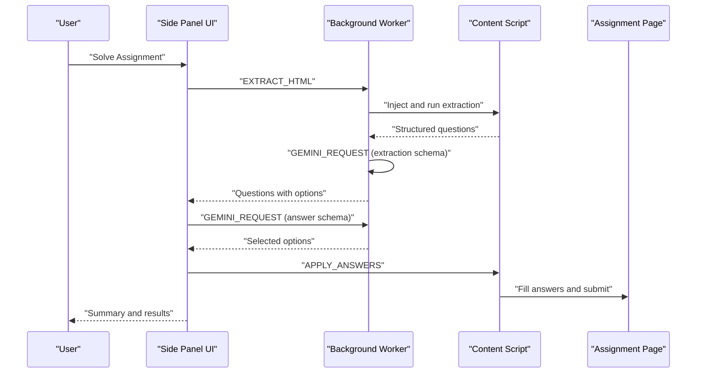
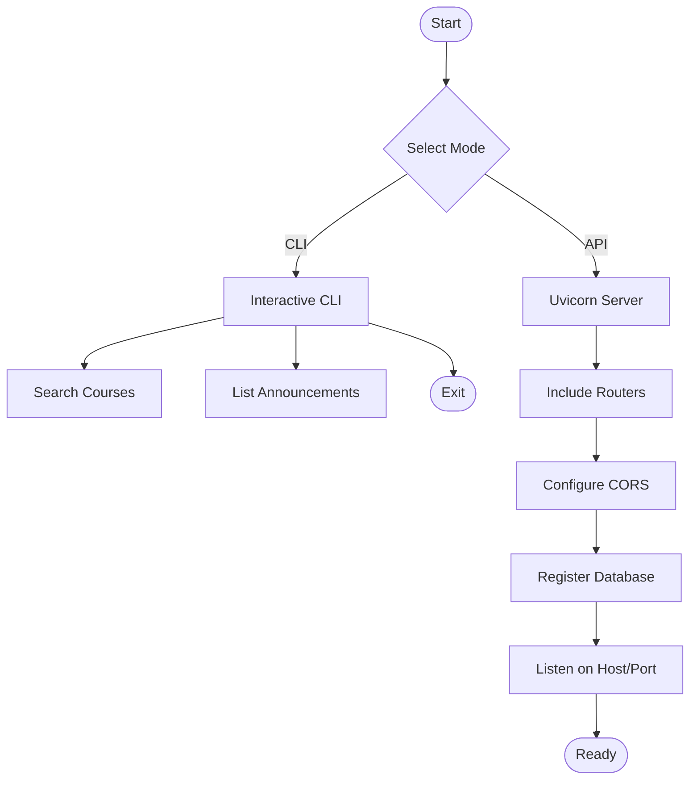
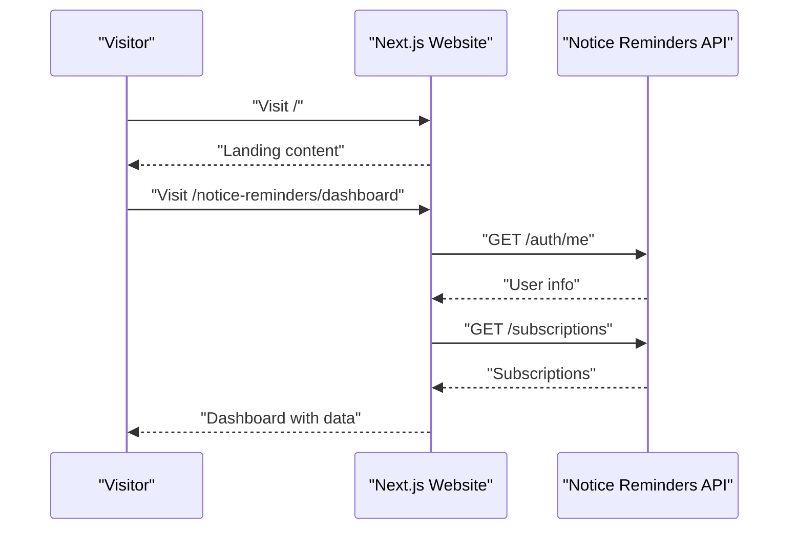
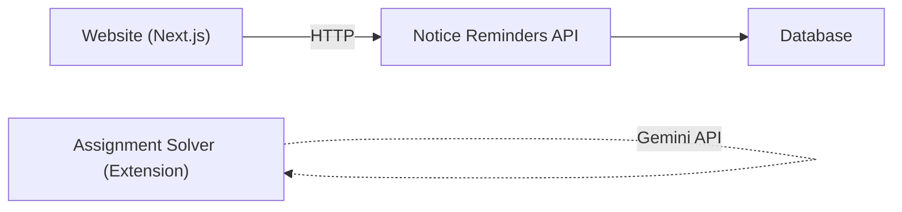

# Project Overview

<cite>
**Referenced Files in This Document**
- [README.md](file://README.md)
- [assignment-solver/README.md](file://assignment-solver/README.md)
- [assignment-solver/docs/architechture.md](file://assignment-solver/docs/architechture.md)
- [assignment-solver/manifest.config.js](file://assignment-solver/manifest.config.js)
- [notice-reminders/README.md](file://notice-reminders/README.md)
- [notice-reminders/main.py](file://notice-reminders/main.py)
- [notice-reminders/app/api/main.py](file://notice-reminders/app/api/main.py)
- [notice-reminders/pyproject.toml](file://notice-reminders/pyproject.toml)
- [website/README.md](file://website/README.md)
- [website/app/layout.tsx](file://website/app/layout.tsx)
- [website/lib/api.ts](file://website/lib/api.ts)
- [website/package.json](file://website/package.json)
</cite>

## Table of Contents
1. [Introduction](#introduction)
2. [Project Structure](#project-structure)
3. [Core Components](#core-components)
4. [Architecture Overview](#architecture-overview)
5. [Detailed Component Analysis](#detailed-component-analysis)
6. [Dependency Analysis](#dependency-analysis)
7. [Performance Considerations](#performance-considerations)
8. [Troubleshooting Guide](#troubleshooting-guide)
9. [Conclusion](#conclusion)

## Introduction
MOOC Utils is a cohesive suite of tools designed to enhance the experience of learners enrolled in Massive Open Online Course (MOOC) platforms such as NPTEL and SWAYAM. The project’s mission is to streamline study workflows by combining three complementary systems:
- Assignment Solver: A browser extension that assists with online assignments using AI.
- Notice Reminders: A CLI tool and FastAPI backend for course announcements and subscriptions.
- Website: A Next.js web application serving as a landing and dashboard for the ecosystem.

Together, these systems form a unified learning companion that reduces friction in assignment completion, keeps learners informed about course updates, and provides a centralized place to manage preferences and integrations.

Target audience
- Learners enrolled in NPTEL/SWAYAM courses who want efficient assignment assistance and timely course notifications.
- Educators and learners seeking a privacy-first, open-source toolkit for study support.

Key benefits
- Seamless integration across tools with shared authentication and data models.
- Privacy-focused design: client-side operations for sensitive tasks, local storage for secrets.
- Modular, maintainable architecture enabling easy contributions and future enhancements.

## Project Structure
The repository is organized as a monorepo with three primary subsystems, each with its own documentation, configuration, and build processes. The Website acts as the front door and dashboard hub, while Assignment Solver and Notice Reminders operate independently but share a common vision.

```mermaid
graph TB
subgraph "MOOC Utils Ecosystem"
Website["Website (Next.js)<br/>Landing + Dashboard"]
Solver["Assignment Solver<br/>(Chrome Extension)"]
Reminders["Notice Reminders<br/>(CLI + FastAPI)"]
end
Website --> |"REST API calls"| Reminders
Solver -.->|"Browser extension"<br/>"Side panel ↔ Content script ↔ Page"| Solver
Reminders --> |"Database and scraping"| Reminders
```

**Diagram sources**
- [README.md](file://README.md#L1-L62)
- [website/README.md](file://website/README.md#L1-L51)
- [assignment-solver/README.md](file://assignment-solver/README.md#L1-L339)
- [notice-reminders/README.md](file://notice-reminders/README.md#L1-L56)

**Section sources**
- [README.md](file://README.md#L1-L62)

## Core Components
This section introduces each component and its role in the ecosystem.

- Assignment Solver (Chrome Extension)
  - Role: AI-powered assignment assistance integrated directly into course pages.
  - Technology: JavaScript, Gemini API, cross-browser extension architecture.
  - Key capabilities: question extraction, AI-driven hints and solutions, manual and automated modes, export functionality, cross-browser support.
  - Privacy: BYOK model with client-side processing and local storage of keys.

- Notice Reminders (CLI Tool + API Backend)
  - Role: Course discovery, announcement retrieval, and subscription management.
  - Technology: Python 3.12+, FastAPI, Tortoise ORM, HTTPX, BeautifulSoup.
  - Key capabilities: course search, announcement listing, OTP-based authentication, subscription CRUD, planned notification channels.
  - Data persistence: database-backed models and migrations.

- Website (Next.js Web Application)
  - Role: Marketing site and dashboard for Notice Reminders and Assignment Solver.
  - Technology: Next.js App Router, React, TypeScript, Tailwind, TanStack Query.
  - Key capabilities: OTP login/dashboard, public course search, responsive UI, analytics integration.

How they work together
- Website provides a unified entry point and dashboard. It communicates with the Notice Reminders API for user management, subscriptions, and announcements.
- Assignment Solver operates as a standalone browser extension and does not depend on the Website for its core functionality.
- Notice Reminders powers the backend services consumed by the Website and can be used independently via CLI.

**Section sources**
- [README.md](file://README.md#L3-L46)
- [assignment-solver/README.md](file://assignment-solver/README.md#L1-L339)
- [notice-reminders/README.md](file://notice-reminders/README.md#L1-L56)
- [website/README.md](file://website/README.md#L1-L51)

## Architecture Overview
The overall architecture emphasizes modularity, separation of concerns, and interoperability:
- Website (frontend) consumes the Notice Reminders API for user and subscription data.
- Notice Reminders (backend) manages data models, authentication, and scraping logic.
- Assignment Solver (browser extension) runs client-side within the learner’s browser.



**Diagram sources**
- [website/lib/api.ts](file://website/lib/api.ts#L1-L184)
- [notice-reminders/app/api/main.py](file://notice-reminders/app/api/main.py#L1-L46)
- [assignment-solver/README.md](file://assignment-solver/README.md#L164-L202)

## Detailed Component Analysis

### Assignment Solver (Browser Extension)
Purpose and scope
- Provides AI-powered assignment assistance with Study Hints and Auto-Solve modes.
- Operates entirely client-side with the user’s Gemini API key, ensuring privacy and no server involvement.

Architecture highlights
- Separation of concerns across core, platform, services, background, content, and UI layers.
- Dependency injection pattern for testability and flexibility.
- Cross-browser compatibility via webextension-polyfill and dynamic manifest generation.

Message flow overview
- Side panel → Background → Content script → Page DOM manipulation.
- Background ↔ Gemini API for extraction and answer generation.



**Diagram sources**
- [assignment-solver/docs/architechture.md](file://assignment-solver/docs/architechture.md#L133-L167)
- [assignment-solver/README.md](file://assignment-solver/README.md#L186-L202)

Build and deployment
- Vite-based build system with separate targets for Chrome and Firefox.
- Dynamic manifest generation supports side_panel (Chrome) and sidebar_action (Firefox).

Security and privacy
- API key stored locally; no server-side processing except official Gemini endpoints.
- Content security policy restricts API connections to trusted domains.

**Section sources**
- [assignment-solver/README.md](file://assignment-solver/README.md#L1-L339)
- [assignment-solver/docs/architechture.md](file://assignment-solver/docs/architechture.md#L1-L311)
- [assignment-solver/manifest.config.js](file://assignment-solver/manifest.config.js#L1-L108)

### Notice Reminders (CLI + FastAPI Backend)
Purpose and scope
- Enables learners to discover courses, fetch announcements, and manage subscriptions.
- Provides both interactive CLI usage and a production-ready API server.

Technology stack
- FastAPI for REST endpoints, Tortoise ORM for database abstraction, HTTPX for HTTP operations, BeautifulSoup for parsing, Pydantic settings for configuration.

Entry point and modes
- Single entry point supports CLI and API modes with argument parsing and runtime selection.



**Diagram sources**
- [notice-reminders/main.py](file://notice-reminders/main.py#L1-L71)
- [notice-reminders/app/api/main.py](file://notice-reminders/app/api/main.py#L1-L46)

Data model example
- User model demonstrates typical fields and constraints managed by Tortoise ORM.

**Section sources**
- [notice-reminders/README.md](file://notice-reminders/README.md#L1-L56)
- [notice-reminders/main.py](file://notice-reminders/main.py#L1-L71)
- [notice-reminders/app/api/main.py](file://notice-reminders/app/api/main.py#L1-L46)
- [notice-reminders/pyproject.toml](file://notice-reminders/pyproject.toml#L1-L41)
- [notice-reminders/app/models/user.py](file://notice-reminders/app/models/user.py#L1-L20)

### Website (Next.js Landing + Dashboard)
Purpose and scope
- Marketing site introducing the suite and a dashboard for Notice Reminders.
- Integrates with the Notice Reminders API for authentication, subscriptions, and announcements.

Frontend architecture
- App Router-based pages, TypeScript for type safety, Tailwind for styling, TanStack Query for data fetching.
- Centralized API client encapsulates HTTP requests and error handling.



**Diagram sources**
- [website/lib/api.ts](file://website/lib/api.ts#L1-L184)
- [website/app/layout.tsx](file://website/app/layout.tsx#L1-L99)

Environment and setup
- Requires NEXT_PUBLIC_API_URL pointing to the backend.
- Recommended to use Bun for development and build.

**Section sources**
- [website/README.md](file://website/README.md#L1-L51)
- [website/lib/api.ts](file://website/lib/api.ts#L1-L184)
- [website/app/layout.tsx](file://website/app/layout.tsx#L1-L99)
- [website/package.json](file://website/package.json#L1-L47)

## Dependency Analysis
High-level dependencies and integration points:
- Website depends on Notice Reminders API for user, subscription, and announcement data.
- Notice Reminders depends on external services for course data and uses a database for persistence.
- Assignment Solver is independent of the Website and Notice Reminders; it interacts with Gemini via browser APIs.



**Diagram sources**
- [website/lib/api.ts](file://website/lib/api.ts#L1-L184)
- [notice-reminders/app/api/main.py](file://notice-reminders/app/api/main.py#L1-L46)
- [assignment-solver/README.md](file://assignment-solver/README.md#L164-L178)

**Section sources**
- [website/lib/api.ts](file://website/lib/api.ts#L1-L184)
- [notice-reminders/app/api/main.py](file://notice-reminders/app/api/main.py#L1-L46)
- [assignment-solver/README.md](file://assignment-solver/README.md#L164-L178)

## Performance Considerations
- Assignment Solver
  - Rate limiting and delays between API calls and DOM operations prevent throttling and ensure reliability.
  - Client-side processing avoids network latency for UI interactions.

- Notice Reminders
  - Asynchronous scraping and caching strategies can improve responsiveness.
  - Database indexing on frequently queried fields (e.g., user email) enhances lookup performance.

- Website
  - TanStack Query caching and optimistic updates reduce perceived latency.
  - Image optimization and minimal payload sizes improve load times.

[No sources needed since this section provides general guidance]

## Troubleshooting Guide
- Assignment Solver
  - “Could not get page HTML”: ensure the page is fully loaded and try re-extracting.
  - “Question container not found”: re-extract or adjust selectors for the platform.
  - “API Key invalid”: verify the key at the provider’s portal and ensure no extra spaces.
  - “Answers not being applied”: platform-specific components may require manual application.

- Notice Reminders
  - CLI/API mode misconfiguration: confirm mode selection and arguments.
  - Database connectivity: ensure database URL and migrations are configured.

- Website
  - API connection failures: verify NEXT_PUBLIC_API_URL and backend availability.
  - Authentication issues: ensure cookies are accepted and session refresh is handled.

**Section sources**
- [assignment-solver/README.md](file://assignment-solver/README.md#L259-L289)
- [notice-reminders/README.md](file://notice-reminders/README.md#L20-L56)
- [website/README.md](file://website/README.md#L27-L51)

## Conclusion
MOOC Utils delivers a cohesive, privacy-focused toolkit for MOOC learners. By separating concerns across a browser extension, a robust backend, and a modern web dashboard, the project enables a seamless learning experience. The modular architecture, explicit dependency management, and clear integration points position the ecosystem for continued growth and community contribution.

[No sources needed since this section summarizes without analyzing specific files]