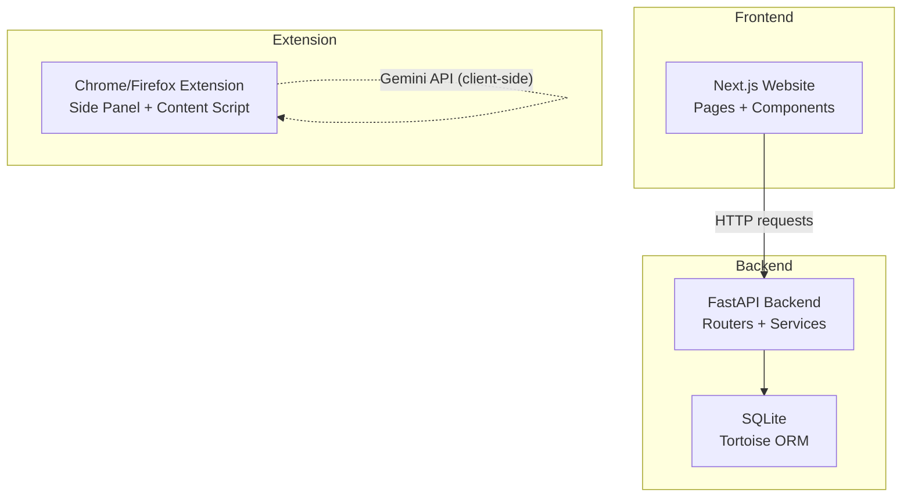
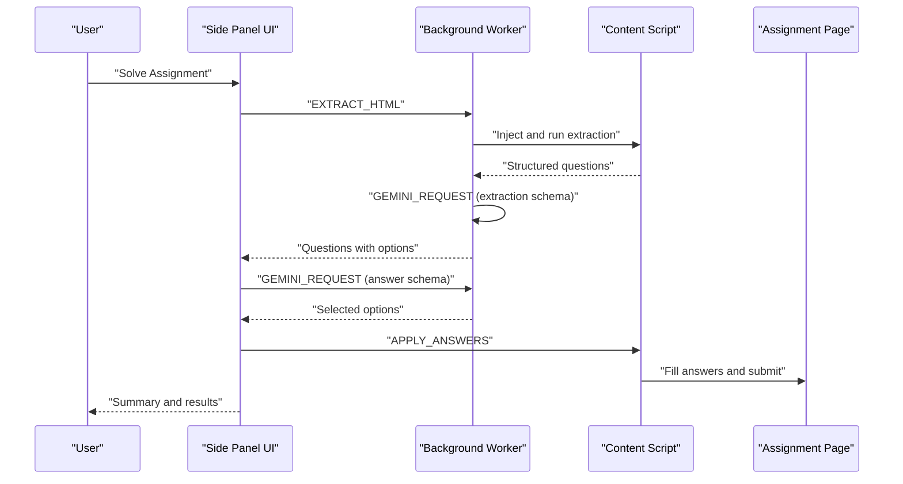
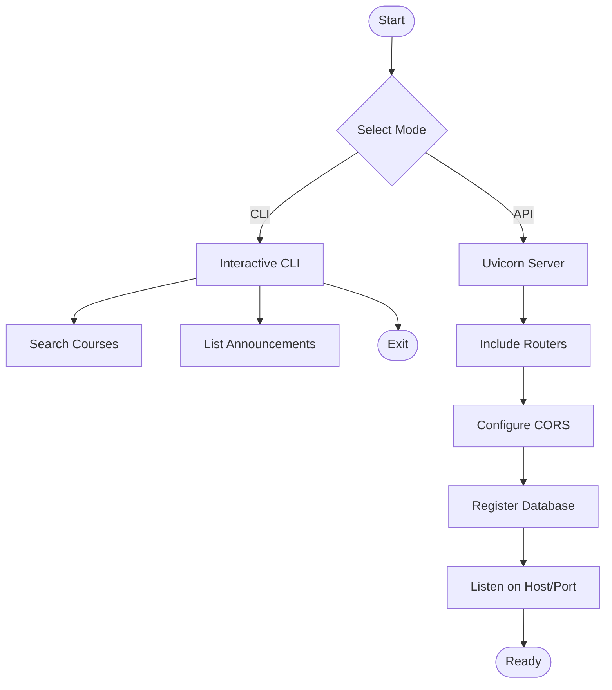
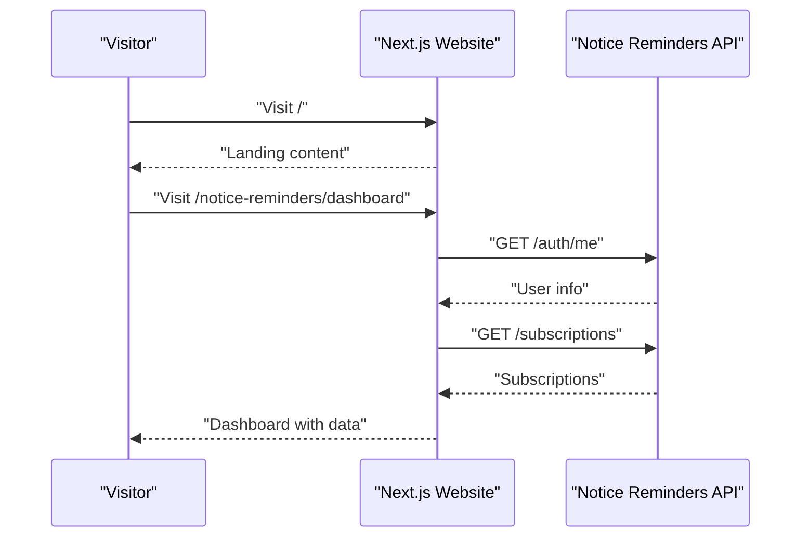
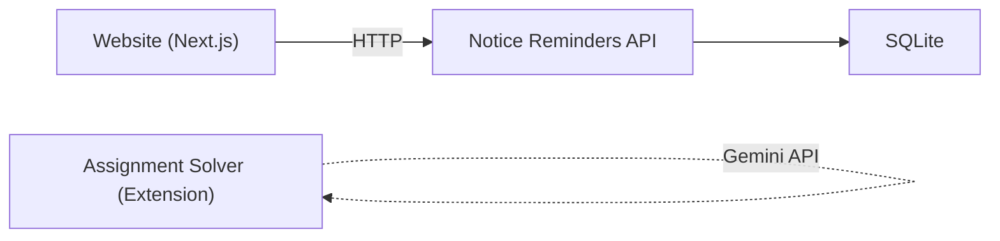

# Project overview

MOOC Utils is a toolkit for NPTEL and SWAYAM learners: a browser assignment helper, a notices CLI/API, and a Next.js dashboard. Less tab switching, fewer missed announcements.

Who it is for:

- Learners on NPTEL/SWAYAM who want assignment help and timely course notices.
- People who want a privacy-first, open-source study toolkit.

Why the split:

- Website and API share auth cookies and models.
- Gemini work stays in the browser. The key never leaves the extension except for Google.
- Each package has its own README, so you can change one without knowing the others.

Repo: https://github.com/tashifkhan/MOOC-utils

## Project structure

Three packages, each with its own build:

```mermaid
graph TB
subgraph "MOOC Utils Ecosystem"
Website["Website (Next.js)<br/>Landing + Dashboard"]
Solver["Assignment Solver<br/>(Chrome/Firefox Extension)"]
Reminders["Notice Reminders<br/>(CLI + FastAPI)"]
end
Website --> |"REST API calls"| Reminders
Solver -.->|"Browser extension"<br/>"Side panel ↔ Content script ↔ Page"| Solver
Reminders --> |"SQLite and scraping"| Reminders
```

## Core components

- Assignment Solver (Chrome/Firefox extension)
  - Role: assignment help on the course page.
  - Tech: JavaScript, Vite 5, Gemini API, webextension-polyfill.
  - Capabilities: extract questions, study hints, auto-solve, screenshots, JSON export.
  - Privacy: BYOK. Key in `browser.storage.local`. No MOOC Utils server.

- Notice Reminders (CLI + FastAPI)
  - Role: course search, announcements, subscriptions.
  - Tech: Python 3.12+, FastAPI, Tortoise ORM, HTTPX, BeautifulSoup.
  - Capabilities: Swayam search, announcement fetch, email OTP + JWT cookies, subscription CRUD. Telegram/email notify is still planned.
  - Data: SQLite at `data/db/db.sqlite3` by default. Code lives under `app/`, not `package/cli` or `package/api`.

- Website (Next.js App Router)
  - Role: marketing site and dashboard for Notice Reminders, plus an Assignment Solver download page.
  - Tech: Next.js 16.1.6, React 19.2.3, TypeScript, Tailwind 4, TanStack Query.
  - Capabilities: OTP login, public search, subscriptions, inbox, profile.

How they work together:

- The website calls the Notice Reminders API for users, subscriptions, and announcements.
- Assignment Solver is standalone. It does not need the website or the API to solve questions.
- Notice Reminders also runs as `uv run python main.py cli` with no database.

## Architecture overview

- Website consumes the Notice Reminders API.
- Notice Reminders owns models, OTP auth, and scraping.
- Assignment Solver talks to Gemini from the browser.


```mermaid
graph TB
subgraph "Frontend"
UI["Next.js Website<br/>Pages + Components"]
end
subgraph "Backend"
API["FastAPI Backend<br/>Routers + Services"]
DB["SQLite<br/>Tortoise ORM"]
end
subgraph "Extension"
EXT["Chrome/Firefox Extension<br/>Side Panel + Content Script"]
end
UI --> |"HTTP requests"| API
API --> DB
EXT -.->|"Gemini API (client-side)"| EXT
```

## Assignment solver (browser extension)

Study Hints and Auto-Solve. Your Gemini key, your browser.

Layers: `src/core`, `src/platform`, `src/services`, `src/background`, `src/content`, `src/ui`. Factories inject adapters so tests can swap them. Chrome uses `side_panel`; Firefox uses `sidebar_action`.


```mermaid
sequenceDiagram
participant User as "User"
participant Panel as "Side Panel UI"
participant BG as "Background Worker"
participant CS as "Content Script"
participant Page as "Assignment Page"
User->>Panel : "Solve Assignment"
Panel->>BG : "EXTRACT_HTML"
BG->>CS : "Inject and run extraction"
CS-->>BG : "Structured questions"
BG->>BG : "GEMINI_REQUEST (extraction schema)"
BG-->>Panel : "Questions with options"
Panel->>BG : "GEMINI_REQUEST (answer schema)"
BG-->>Panel : "Selected options"
Panel->>CS : "APPLY_ANSWERS"
CS->>Page : "Fill answers and submit"
Panel-->>User : "Summary and results"
```

Build: `bun run build` writes `dist/chrome/` and `dist/firefox/`. Default model is `gemini-3-flash-preview` in `src/services/gemini/index.js`.

## Notice reminders (CLI + FastAPI)

Discover courses, fetch announcements, manage subscriptions. One entry point:

```bash
uv run python main.py cli
uv run python main.py api --reload
```


```mermaid
flowchart TD
Start(["Start"]) --> Mode{"Select Mode"}
Mode --> |CLI| CLI["Interactive CLI"]
Mode --> |API| API["Uvicorn Server"]
CLI --> Search["Search Courses"]
CLI --> Ann["List Announcements"]
CLI --> Exit(["Exit"])
API --> Routers["Include Routers"]
Routers --> CORS["Configure CORS"]
CORS --> DB["Register Database"]
DB --> Listen["Listen on Host/Port"]
Listen --> End(["Ready"])
```

CLI uses `app/cli` and `SwayamScraper`. API uses `app/api/routers/` (users, search, courses, announcements, subscriptions, notifications).

## Website (Next.js landing + dashboard)

App Router pages: `/`, `/notice-reminders`, `/notice-reminders/login`, `/notice-reminders/dashboard`, `/assignment-solver`, `/privacy`. `lib/api.ts` wraps `fetch` with cookies. `NEXT_PUBLIC_API_URL` defaults to `http://localhost:8000`. Do not use `npm run dev` or `bun dev`.


```mermaid
sequenceDiagram
participant Visitor as "Visitor"
participant Site as "Next.js Website"
participant API as "Notice Reminders API"
Visitor->>Site : "Visit /"
Site-->>Visitor : "Landing content"
Visitor->>Site : "Visit /notice-reminders/dashboard"
Site->>API : "GET /auth/me"
API-->>Site : "User info"
Site->>API : "GET /subscriptions"
API-->>Site : "Subscriptions"
Site-->>Visitor : "Dashboard with data"
```

## Dependency analysis


```mermaid
graph LR
Website["Website (Next.js)"] --> |HTTP| NoticeAPI["Notice Reminders API"]
NoticeAPI --> DB["SQLite"]
Solver["Assignment Solver (Extension)"] -.->|"Gemini API"| Solver
```

## Performance

- Assignment Solver: 500ms between answer calls, 200ms between DOM writes.
- Notice Reminders: `cache_ttl_minutes` is 60. Index email lookups if search grows.
- Website: TanStack Query cache; invalidate after mutations.

## Troubleshooting

- Assignment Solver: page not loaded, bad selectors, invalid Gemini key, custom inputs.
- Notice Reminders: wrong `cli` vs `api` args, missing `jwt_secret`, SQLite path not writable.
- Website: API down, `NEXT_PUBLIC_API_URL` wrong, cookies blocked.

## Conclusion

Three packages, one learner-facing story. Contribute at the package boundary that matches the bug.
