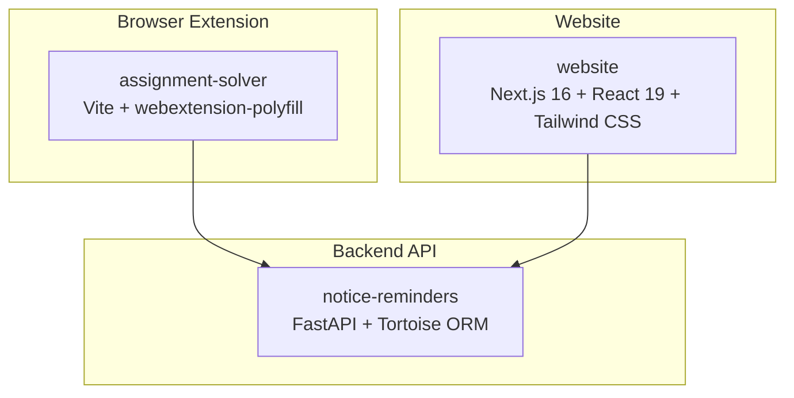
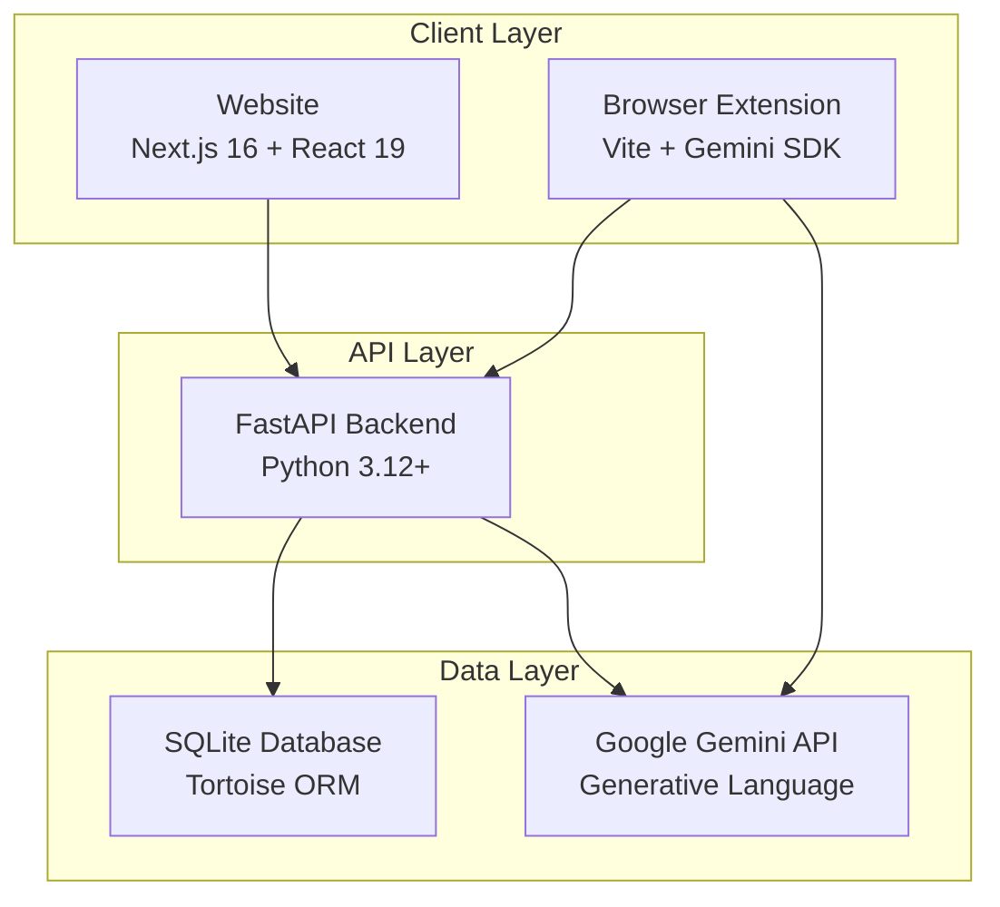
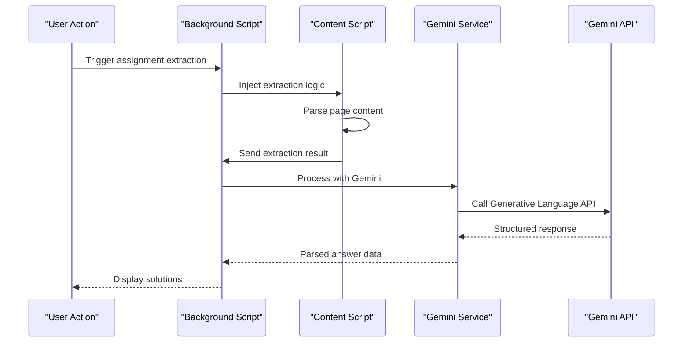
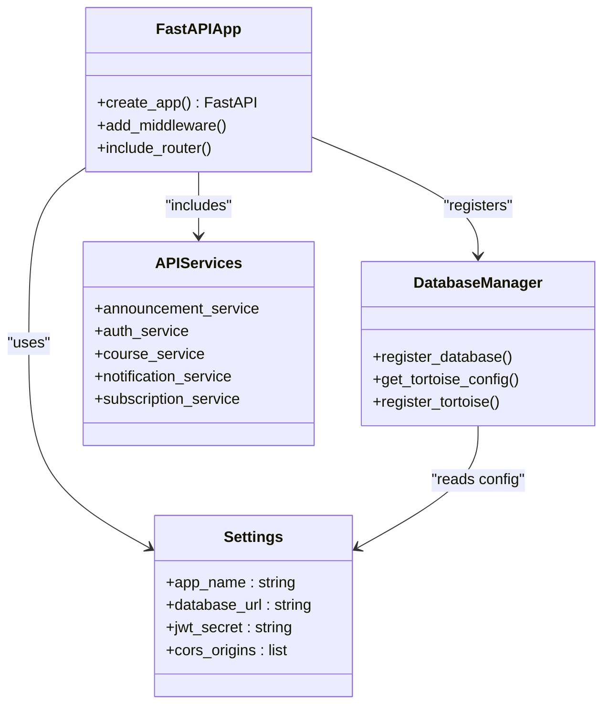
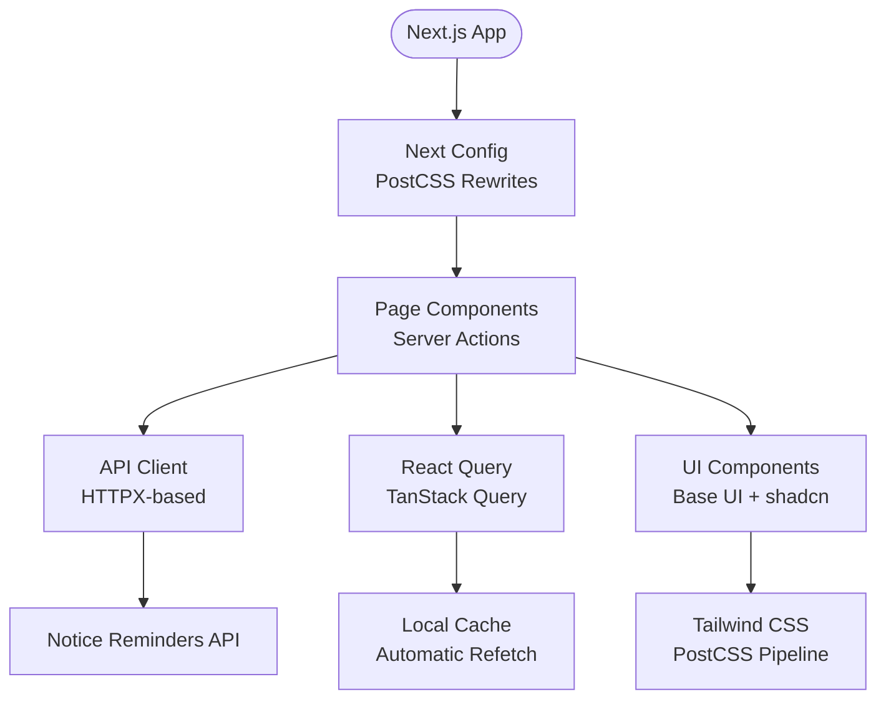
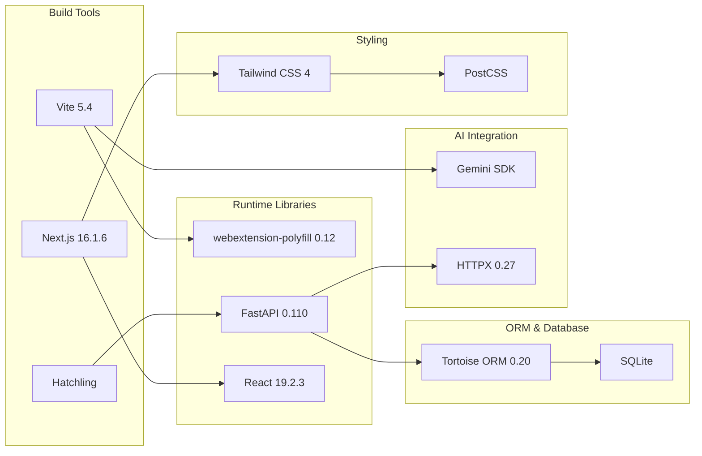

# Technology Stack

<cite>
**Referenced Files in This Document**
- [assignment-solver/package.json](file://assignment-solver/package.json)
- [assignment-solver/vite.config.js](file://assignment-solver/vite.config.js)
- [assignment-solver/manifest.config.js](file://assignment-solver/manifest.config.js)
- [assignment-solver/manifest.json](file://assignment-solver/manifest.json)
- [assignment-solver/src/services/gemini/index.js](file://assignment-solver/src/services/gemini/index.js)
- [assignment-solver/src/background/handlers/gemini.js](file://assignment-solver/src/background/handlers/gemini.js)
- [notice-reminders/pyproject.toml](file://notice-reminders/pyproject.toml)
- [notice-reminders/app/core/config.py](file://notice-reminders/app/core/config.py)
- [notice-reminders/app/core/database.py](file://notice-reminders/app/core/database.py)
- [notice-reminders/app/api/main.py](file://notice-reminders/app/api/main.py)
- [website/package.json](file://website/package.json)
- [website/next.config.ts](file://website/next.config.ts)
- [website/tsconfig.json](file://website/tsconfig.json)
- [website/postcss.config.mjs](file://website/postcss.config.mjs)
- [website/lib/api.ts](file://website/lib/api.ts)
</cite>

## Table of Contents
1. [Introduction](#introduction)
2. [Project Structure](#project-structure)
3. [Core Components](#core-components)
4. [Architecture Overview](#architecture-overview)
5. [Detailed Component Analysis](#detailed-component-analysis)
6. [Dependency Analysis](#dependency-analysis)
7. [Performance Considerations](#performance-considerations)
8. [Troubleshooting Guide](#troubleshooting-guide)
9. [Conclusion](#conclusion)

## Introduction
This document provides a comprehensive technology stack overview for MOOC Utils, detailing the complete technology landscape across three major components:
- Browser Extension (Assignment Solver): JavaScript/TypeScript with Vite, webextension-polyfill, and Google Gemini SDK integration
- Backend API (Notice Reminders): Python with FastAPI, Tortoise ORM, and HTTPX
- Website: Next.js 16, React 19, and Tailwind CSS

The document explains the rationale behind each technology choice, version requirements, compatibility considerations, development tools, build systems, and deployment technologies. It also covers cross-platform considerations for the browser extension and how these choices support the project's goals of performance, security, and maintainability.

## Project Structure
The repository is organized into three primary modules:
- assignment-solver: A modern browser extension built with Vite and TypeScript-like module system
- notice-reminders: A Python FastAPI application with database abstraction via Tortoise ORM
- website: A Next.js 16 application with React 19 and Tailwind CSS

**Section sources**
- [assignment-solver/package.json](file://assignment-solver/package.json#L1-L30)
- [notice-reminders/pyproject.toml](file://notice-reminders/pyproject.toml#L1-L41)
- [website/package.json](file://website/package.json#L1-L47)

## Core Components
This section documents the technology choices and their roles in each component.

### Browser Extension (Assignment Solver)
- Build System: Vite 5.4.x
- Polyfill: webextension-polyfill 0.12.x
- Manifest Generation: Custom Vite plugin generates dynamic manifest.json for Chrome and Firefox
- Gemini Integration: Direct fetch-based API calls to Google Generative Language API
- Cross-browser Compatibility: Manifest v3 with browser-specific adaptations

Key capabilities:
- Chrome: Uses side_panel API and service_worker
- Firefox: Uses sidebar_action and script-based background
- Shared content scripts for NPTEL domains

**Section sources**
- [assignment-solver/package.json](file://assignment-solver/package.json#L15-L29)
- [assignment-solver/vite.config.js](file://assignment-solver/vite.config.js#L1-L109)
- [assignment-solver/manifest.config.js](file://assignment-solver/manifest.config.js#L1-L108)
- [assignment-solver/manifest.json](file://assignment-solver/manifest.json#L1-L44)

### Backend API (Notice Reminders)
- Language: Python 3.12+
- Framework: FastAPI 0.110.x
- Database ORM: Tortoise ORM 0.20.x with Aerich migrations
- HTTP Client: HTTPX 0.27.x
- Authentication: PyJWT 2.8.x
- Validation: Pydantic Settings 2.2.x
- Web Server: Uvicorn [standard] 0.27.1

Security and reliability features:
- CORS middleware with configurable origins
- SQLite-first approach with automatic schema generation
- JWT-based session management
- Email OTP verification support

**Section sources**
- [notice-reminders/pyproject.toml](file://notice-reminders/pyproject.toml#L1-L41)
- [notice-reminders/app/core/config.py](file://notice-reminders/app/core/config.py#L1-L32)
- [notice-reminders/app/core/database.py](file://notice-reminders/app/core/database.py#L1-L54)
- [notice-reminders/app/api/main.py](file://notice-reminders/app/api/main.py#L1-L46)

### Website (Next.js Application)
- Framework: Next.js 16.1.6
- UI Library: React 19.2.3 (client and server components)
- Styling: Tailwind CSS 4.x with @tailwindcss/postcss
- State Management: TanStack React Query 5.90.x
- Analytics: PostHog JS 1.358.0
- Type Safety: TypeScript 5.x
- UI Components: Base UI React 1.1.0, shadcn/ui ecosystem

Development experience:
- Next.js App Router with server actions
- PostCSS pipeline for Tailwind compilation
- Strict TypeScript configuration
- ESLint integration

**Section sources**
- [website/package.json](file://website/package.json#L1-L47)
- [website/next.config.ts](file://website/next.config.ts#L1-L19)
- [website/tsconfig.json](file://website/tsconfig.json#L1-L35)
- [website/postcss.config.mjs](file://website/postcss.config.mjs#L1-L8)

## Architecture Overview
The system follows a distributed architecture with clear separation of concerns:

**Diagram sources**
- [assignment-solver/src/services/gemini/index.js](file://assignment-solver/src/services/gemini/index.js#L1-L342)
- [notice-reminders/app/api/main.py](file://notice-reminders/app/api/main.py#L1-L46)
- [website/lib/api.ts](file://website/lib/api.ts#L1-L184)

## Detailed Component Analysis

### Assignment Solver Architecture
The browser extension implements a modular architecture with clear separation between background services, content scripts, and UI components.

**Diagram sources**
- [assignment-solver/src/services/gemini/index.js](file://assignment-solver/src/services/gemini/index.js#L145-L217)
- [assignment-solver/src/background/handlers/gemini.js](file://assignment-solver/src/background/handlers/gemini.js#L12-L34)

Key implementation patterns:
- Message-based communication between extension contexts
- Gemini API integration with structured prompts and schemas
- Cross-browser manifest generation for Chrome and Firefox
- Side panel UI with dynamic HTML transformation

**Section sources**
- [assignment-solver/src/services/gemini/index.js](file://assignment-solver/src/services/gemini/index.js#L1-L342)
- [assignment-solver/src/background/handlers/gemini.js](file://assignment-solver/src/background/handlers/gemini.js#L1-L35)
- [assignment-solver/vite.config.js](file://assignment-solver/vite.config.js#L15-L52)

### Notice Reminders API
The backend implements a clean architecture with clear separation between concerns:

**Diagram sources**
- [notice-reminders/app/api/main.py](file://notice-reminders/app/api/main.py#L17-L45)
- [notice-reminders/app/core/config.py](file://notice-reminders/app/core/config.py#L4-L32)
- [notice-reminders/app/core/database.py](file://notice-reminders/app/core/database.py#L7-L53)

**Section sources**
- [notice-reminders/app/api/main.py](file://notice-reminders/app/api/main.py#L1-L46)
- [notice-reminders/app/core/config.py](file://notice-reminders/app/core/config.py#L1-L32)
- [notice-reminders/app/core/database.py](file://notice-reminders/app/core/database.py#L1-L54)

### Website Frontend Architecture
The Next.js application follows modern React patterns with server-side rendering and client-side interactivity:

**Diagram sources**
- [website/next.config.ts](file://website/next.config.ts#L3-L18)
- [website/lib/api.ts](file://website/lib/api.ts#L28-L53)

**Section sources**
- [website/next.config.ts](file://website/next.config.ts#L1-L19)
- [website/lib/api.ts](file://website/lib/api.ts#L1-L184)

## Dependency Analysis
The technology stack demonstrates careful selection for performance, security, and maintainability:

**Diagram sources**
- [assignment-solver/package.json](file://assignment-solver/package.json#L15-L29)
- [notice-reminders/pyproject.toml](file://notice-reminders/pyproject.toml#L7-L19)
- [website/package.json](file://website/package.json#L11-L27)

**Section sources**
- [assignment-solver/package.json](file://assignment-solver/package.json#L1-L30)
- [notice-reminders/pyproject.toml](file://notice-reminders/pyproject.toml#L1-L41)
- [website/package.json](file://website/package.json#L1-L47)

## Performance Considerations
The technology choices prioritize performance through several mechanisms:

- **Build System Efficiency**: Vite provides instant server start and lightning-fast hot module replacement for rapid iteration
- **Modular Architecture**: Clear separation of concerns reduces coupling and enables independent optimization
- **Database Abstraction**: Tortoise ORM's async-first design minimizes blocking operations
- **Caching Strategy**: HTTPX caching with configurable TTL for reduced network overhead
- **Bundle Optimization**: Next.js automatic code splitting and React 19's concurrent rendering features
- **Resource Loading**: Tailwind CSS purging and efficient asset handling

Cross-platform considerations for the browser extension:
- Manifest v3 ensures consistent APIs across Chrome and Firefox
- webextension-polyfill provides compatibility layer for feature differences
- Dynamic manifest generation handles browser-specific permissions and APIs
- Side panel vs sidebar_action abstraction maintains unified UX

## Troubleshooting Guide
Common issues and their resolutions:

**Extension Development Issues**:
- Manifest generation failures: Verify Vite plugins are properly configured and browser targets match expectations
- Gemini API rate limiting: Implement retry logic with exponential backoff in production deployments
- Cross-browser compatibility: Test against both Chrome and Firefox manifest variants

**Backend API Issues**:
- Database migration conflicts: Use Aerich migrations to manage schema changes safely
- CORS configuration errors: Ensure frontend origin matches configured CORS settings
- Authentication failures: Verify JWT secret configuration and token expiration settings

**Frontend Issues**:
- Build failures: Check TypeScript strict mode configuration and resolve type errors
- Styling inconsistencies: Verify Tailwind CSS configuration and PostCSS pipeline
- API connectivity: Confirm environment variable configuration for API base URLs

**Section sources**
- [assignment-solver/vite.config.js](file://assignment-solver/vite.config.js#L15-L52)
- [notice-reminders/app/core/config.py](file://notice-reminders/app/core/config.py#L20-L27)
- [website/tsconfig.json](file://website/tsconfig.json#L21-L24)

## Conclusion
MOOC Utils demonstrates a well-architected technology stack that balances modern development practices with practical deployment considerations. The choice of Vite for the browser extension ensures rapid development cycles while maintaining cross-browser compatibility. The Python FastAPI backend provides robust API capabilities with excellent type safety and async support. The Next.js website leverages cutting-edge React features with a comprehensive UI component library.

The stack emphasizes:
- **Performance**: Optimized build systems, efficient database access, and modern frontend patterns
- **Security**: Proper authentication with JWT, CORS configuration, and secure API design
- **Maintainability**: Clean architecture, comprehensive type checking, and modular design
- **Scalability**: Async-first backend design and flexible frontend architecture

These technology choices position MOOC Utils for continued growth while maintaining developer productivity and user experience quality.