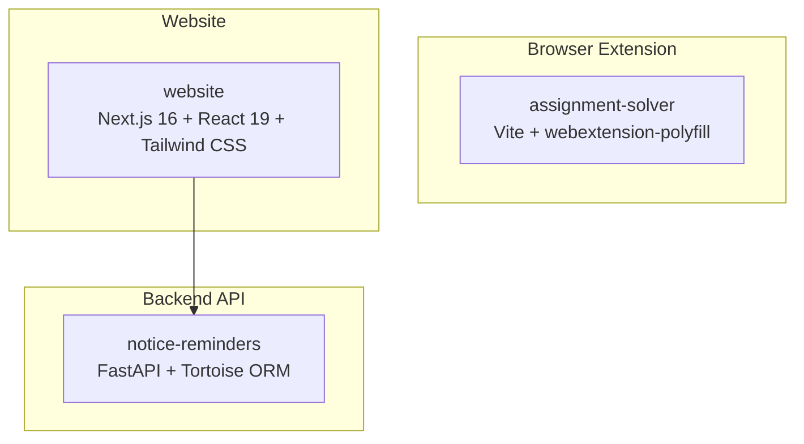
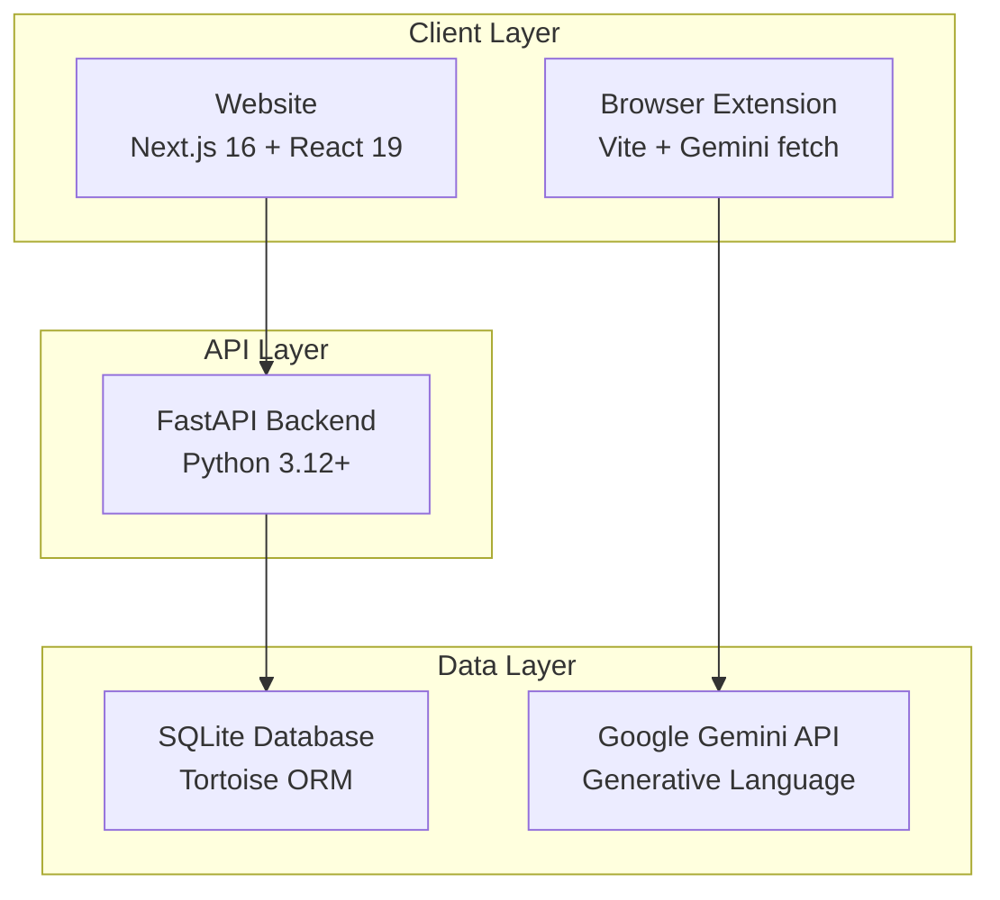
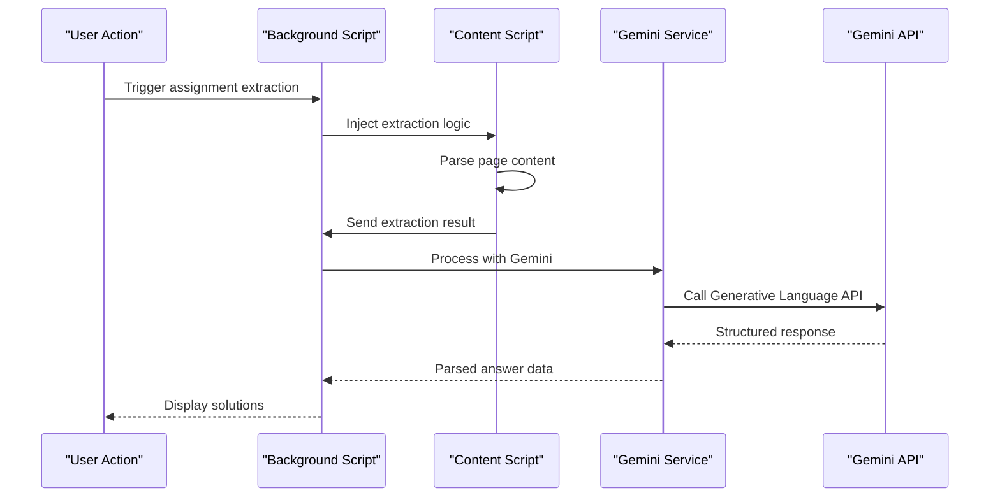
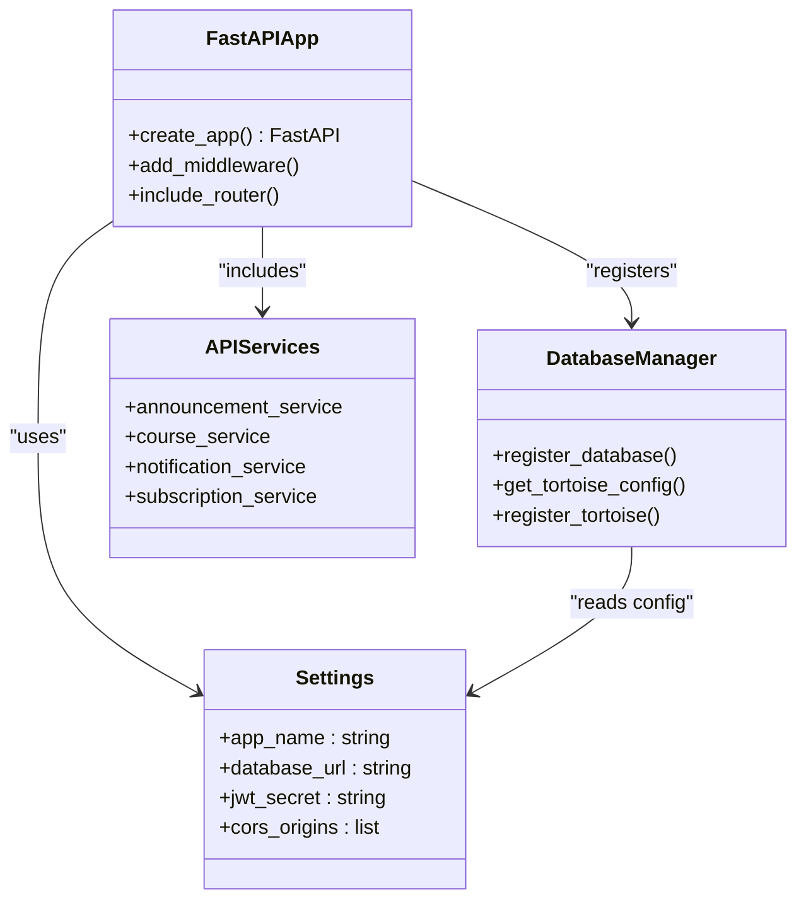
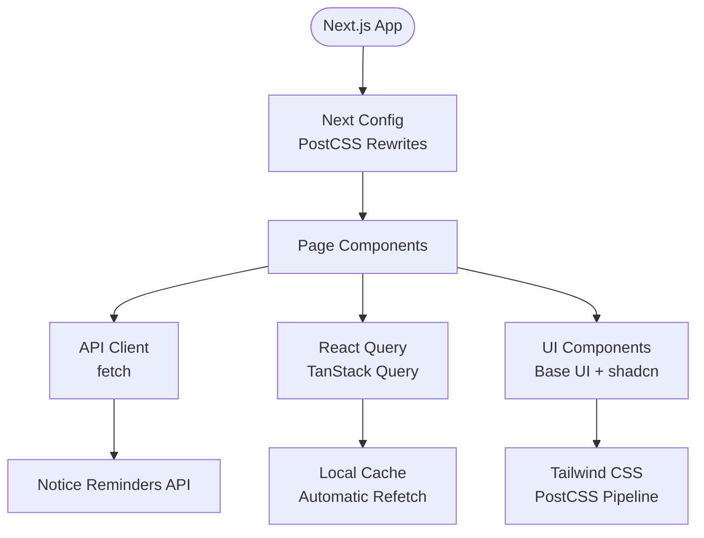
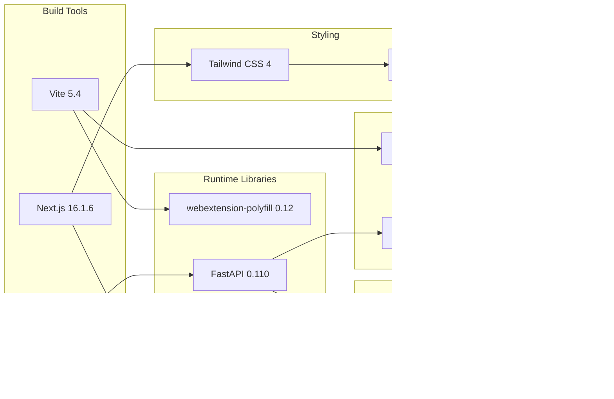

# Technology stack

What each package actually uses.

- Assignment Solver: JavaScript, Vite 5.4, webextension-polyfill 0.12, Gemini over `fetch`.
- Notice Reminders: Python 3.12+, FastAPI 0.110+, Tortoise ORM 0.20+, HTTPX 0.27+.
- Website: Next.js 16.1.6, React 19.2.3, TanStack Query 5.90, Tailwind 4.

## Project structure

```mermaid
graph TB
subgraph "Browser Extension"
AS["assignment-solver<br/>Vite + webextension-polyfill"]
end
subgraph "Backend API"
NR["notice-reminders<br/>FastAPI + Tortoise ORM"]
end
subgraph "Website"
WEB["website<br/>Next.js 16 + React 19 + Tailwind CSS"]
end
WEB --> NR
```

The extension does not depend on Notice Reminders.

## Browser extension (assignment solver)

- Build: Vite 5.4.x
- Polyfill: webextension-polyfill 0.12.x
- Manifest: Vite plugin writes Chrome vs Firefox `manifest.json`
- Gemini: `https://generativelanguage.googleapis.com/v1beta/models` from `src/services/gemini/index.js`
- Package name: `nptel-assignment-solver` 1.1.0

Chrome uses `side_panel` and a service worker. Firefox uses `sidebar_action` and a script background. Shared content scripts target NPTEL-style pages.

## Backend API (notice reminders)

- Python 3.12+ (`requires-python = ">=3.12"`)
- FastAPI, Uvicorn, Tortoise, Aerich, HTTPX, BeautifulSoup, Pydantic Settings, PyJWT
- Default `database_url`: `sqlite://./data/db/db.sqlite3`
- CORS: `http://localhost:3000`
- OTP: `otp_delivery` defaults to `console`
- Hatchling wheel of the `app` package
- Scripts: `notice-reminders = "main:main"`

## Website (Next.js)

- Next.js 16.1.6, React 19.2.3, TypeScript 5
- Tailwind CSS 4 with `@tailwindcss/postcss`
- TanStack React Query 5.90
- PostHog JS 1.358
- Base UI / shadcn
- Scripts: `build` and `lint` only for day-to-day work. Do not use `npm run dev` or `bun dev`.

## Architecture overview

```mermaid
graph TB
subgraph "Client Layer"
EXT["Browser Extension<br/>Vite + Gemini fetch"]
WEB["Website<br/>Next.js 16 + React 19"]
end
subgraph "API Layer"
API["FastAPI Backend<br/>Python 3.12+"]
end
subgraph "Data Layer"
DB["SQLite Database<br/>Tortoise ORM"]
GEMINI["Google Gemini API<br/>Generative Language"]
end
WEB --> API
API --> DB
EXT --> GEMINI
```

Gemini is called from the extension, not from FastAPI.

## Assignment solver architecture

```mermaid
sequenceDiagram
participant User as "User Action"
participant BG as "Background Script"
participant CS as "Content Script"
participant GS as "Gemini Service"
participant API as "Gemini API"
User->>BG : Trigger assignment extraction
BG->>CS : Inject extraction logic
CS->>CS : Parse page content
CS->>BG : Send extraction result
BG->>GS : Process with Gemini
GS->>API : Call Generative Language API
API-->>GS : Structured response
GS-->>BG : Parsed answer data
BG-->>User : Display solutions
```

Messages between UI, background, and content script. Dynamic manifests for Chrome and Firefox.

## Notice reminders API

```mermaid
classDiagram
class FastAPIApp {
+create_app() FastAPI
+add_middleware()
+include_router()
}
class Settings {
+app_name : string
+database_url : string
+jwt_secret : string
+cors_origins : list
}
class DatabaseManager {
+register_database()
+get_tortoise_config()
+register_tortoise()
}
class APIServices {
+announcement_service
+course_service
+notification_service
+subscription_service
}
FastAPIApp --> Settings : "uses"
FastAPIApp --> DatabaseManager : "registers"
FastAPIApp --> APIServices : "includes"
DatabaseManager --> Settings : "reads config"
```

Routers live in `app/api/routers/`. CLI lives in `app/cli`.

## Website frontend architecture

```mermaid
flowchart TD
Start(["Next.js App"]) --> Config["Next Config<br/>PostCSS Rewrites"]
Config --> Pages["Page Components"]
Pages --> API["API Client<br/>fetch"]
API --> Backend["Notice Reminders API"]
Pages --> State["React Query<br/>TanStack Query"]
State --> Cache["Local Cache<br/>Automatic Refetch"]
Pages --> UI["UI Components<br/>Base UI + shadcn"]
UI --> Styles["Tailwind CSS<br/>PostCSS Pipeline"]
```

The website API client is `fetch` in `lib/api.ts`, not HTTPX.

## Dependency analysis

```mermaid
graph LR
subgraph "Build Tools"
VITE[Vite 5.4]
NEXT[Next.js 16.1.6]
PYBUILD[Hatchling]
end
subgraph "Runtime Libraries"
WEBEXT[webextension-polyfill 0.12]
FASTAPI[FastAPI 0.110]
REACT[React 19.2.3]
end
subgraph "ORM and Database"
TORTOISE[Tortoise ORM 0.20]
SQLITE[SQLite]
end
subgraph "AI Integration"
GEMINI[Gemini fetch]
HTTPX[HTTPX 0.27]
end
subgraph "Styling"
TAILWIND[Tailwind CSS 4]
POSTCSS[PostCSS]
end
VITE --> WEBEXT
NEXT --> REACT
PYBUILD --> FASTAPI
FASTAPI --> TORTOISE
TORTOISE --> SQLITE
VITE --> GEMINI
FASTAPI --> HTTPX
NEXT --> TAILWIND
TAILWIND --> POSTCSS
```

## Performance

Vite for extension rebuilds. Tortoise stays async. HTTPX plus a 60 minute cache on Swayam searches. Next.js splits routes. Tailwind 4 through PostCSS.

Chrome vs Firefox: Manifest v3, polyfill, generated manifests, `side_panel` vs `sidebar_action`.

## Troubleshooting

- Manifest generation: Vite mode `chrome` or `firefox`, then load the matching `dist/` folder.
- Gemini quota: wait, shrink the batch, check AI Studio.
- Aerich vs a fresh SQLite file: delete `data/db/db.sqlite3` only in local throwaway work.
- CORS: frontend origin must be in `cors_origins`.
- Website types: `bun run build` / `bun run lint`. Set `NEXT_PUBLIC_API_URL`.

## Conclusion

Current stack on purpose. Swap a library only inside the package that owns it.
