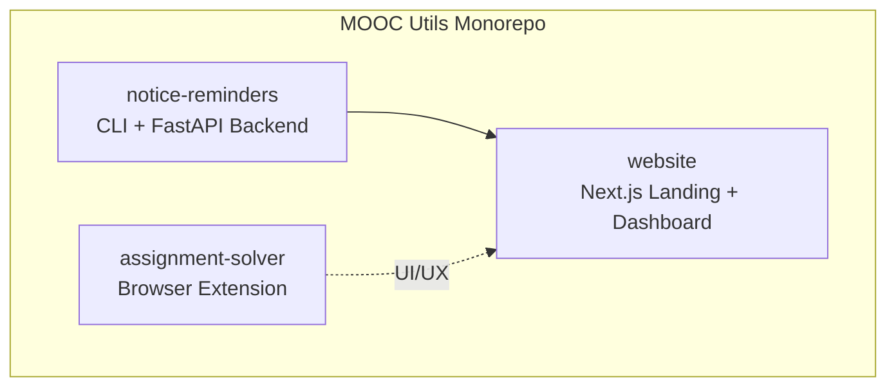
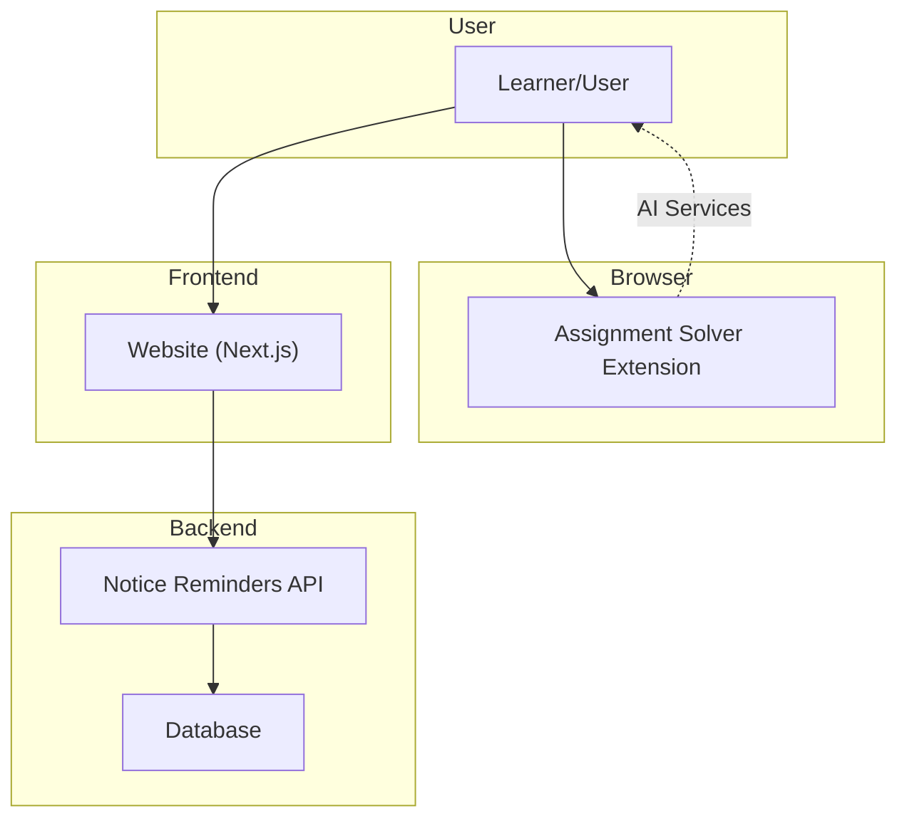
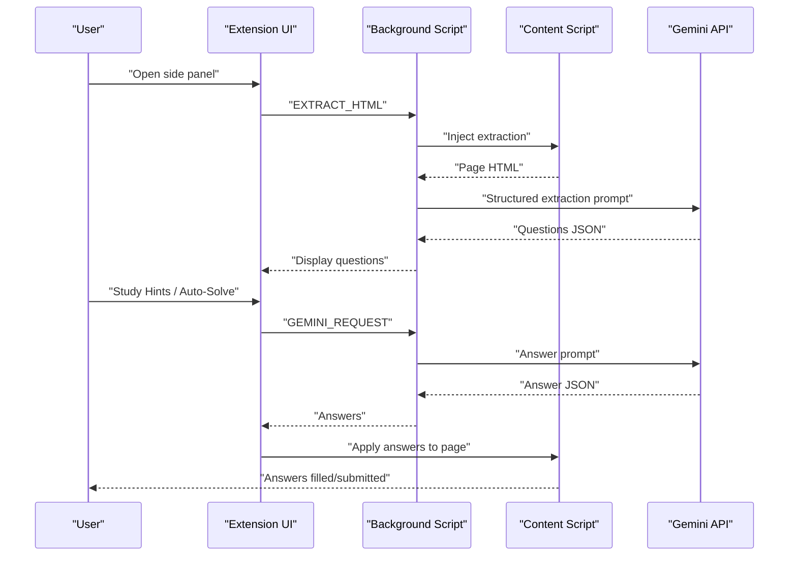
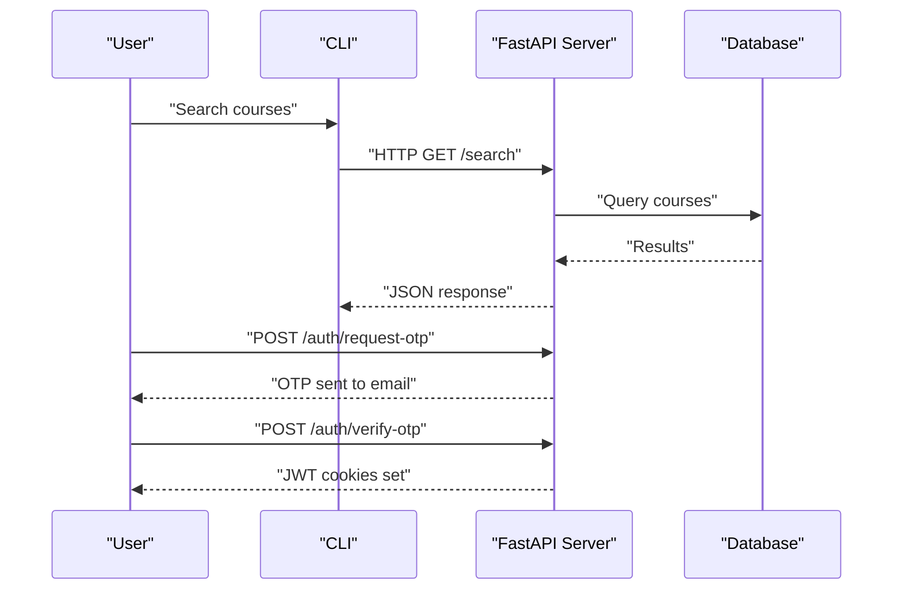
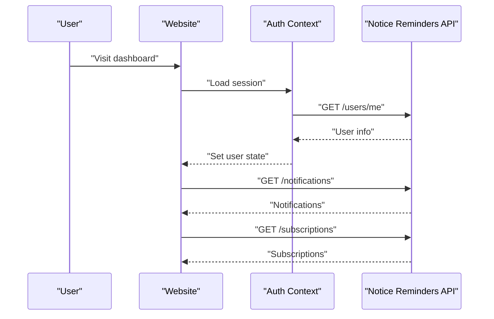
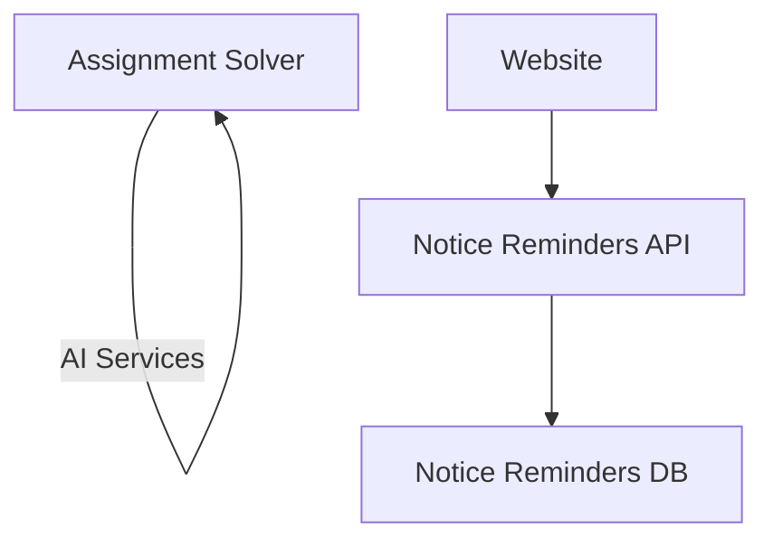

# What is MOOC Utils

<cite>
**Referenced Files in This Document**
- [README.md](file://README.md)
- [assignment-solver/README.md](file://assignment-solver/README.md)
- [notice-reminders/README.md](file://notice-reminders/README.md)
- [website/README.md](file://website/README.md)
- [assignment-solver/package.json](file://assignment-solver/package.json)
- [notice-reminders/pyproject.toml](file://notice-reminders/pyproject.toml)
- [website/package.json](file://website/package.json)
- [assignment-solver/src/background/index.js](file://assignment-solver/src/background/index.js)
- [notice-reminders/main.py](file://notice-reminders/main.py)
- [notice-reminders/app/api/main.py](file://notice-reminders/app/api/main.py)
- [website/app/layout.tsx](file://website/app/layout.tsx)
- [website/lib/auth-context.tsx](file://website/lib/auth-context.tsx)
- [website/app/notice-reminders/dashboard/page.tsx](file://website/app/notice-reminders/dashboard/page.tsx)
- [website/components/notice-reminders/notification-inbox.tsx](file://website/components/notice-reminders/notification-inbox.tsx)
- [website/components/notice-reminders/subscription-manager.tsx](file://website/components/notice-reminders/subscription-manager.tsx)
</cite>

## Table of Contents
1. [Introduction](#introduction)
2. [Project Structure](#project-structure)
3. [Core Components](#core-components)
4. [Architecture Overview](#architecture-overview)
5. [Detailed Component Analysis](#detailed-component-analysis)
6. [Dependency Analysis](#dependency-analysis)
7. [Performance Considerations](#performance-considerations)
8. [Troubleshooting Guide](#troubleshooting-guide)
9. [Conclusion](#conclusion)
10. [Appendices](#appendices)

## Introduction
MOOC Utils is a collection of utilities designed to enhance the experience of learners on Massive Open Online Course (MOOC) platforms, primarily focusing on NPTEL and SWAYAM. The project’s mission is to streamline online learning workflows by reducing manual effort and improving focus on studying. It achieves this through three complementary components:

- Assignment Solver: A browser extension that assists with online assignments using AI to extract, analyze, and solve questions.
- Notice Reminders: A CLI tool and FastAPI backend that tracks course announcements and delivers notifications.
- Website: A Next.js web application serving as a marketing site and a dashboard for user authentication, subscriptions, and notifications.

Together, these components aim to save time, improve learning outcomes, and increase engagement by automating repetitive tasks and keeping learners informed about course updates.

## Project Structure
MOOC Utils is organized as a monorepo with three distinct packages, each with its own technology stack and responsibilities:

- assignment-solver: A cross-browser Chrome/Firefox extension built with modern tooling and AI integration.
- notice-reminders: A Python-based CLI and API backend with a FastAPI server and database persistence.
- website: A Next.js web application providing a landing page, marketing content, and a user dashboard.

**Diagram sources**
- [README.md](file://README.md#L1-L62)
- [assignment-solver/README.md](file://assignment-solver/README.md#L1-L339)
- [notice-reminders/README.md](file://notice-reminders/README.md#L1-L56)
- [website/README.md](file://website/README.md#L1-L51)

**Section sources**
- [README.md](file://README.md#L1-L62)

## Core Components
This section defines each component and its role within MOOC Utils.

- Assignment Solver
  - Purpose: Automate assignment solving on MOOC platforms using AI.
  - Key capabilities: AI-powered question extraction, Study Hints and Auto-Solve modes, support for single/multi-choice and fill-in-the-blank questions, client-side privacy with BYOK (Bring Your Own Key), and export functionality.
  - Target platforms: NPTEL and similar MOOC sites; cross-browser support for Chrome and Firefox.
  - Technical highlights: Vite build system, webextension-polyfill, dynamic manifests, and Gemini API integration.

- Notice Reminders
  - Purpose: Keep learners informed about course updates without manually checking the web UI.
  - Key capabilities: Course search, announcement retrieval, interactive CLI, email OTP authentication, and planned notification channels.
  - Technical highlights: FastAPI backend, Tortoise ORM, HTTPX, BeautifulSoup, and a modular architecture supporting both CLI and API modes.

- Website
  - Purpose: Marketing site and user dashboard for Notice Reminders and Assignment Solver.
  - Key capabilities: OTP-based login/signup, course search, subscription management, notification inbox, and user profile management.
  - Technical highlights: Next.js App Router, React with TypeScript, TanStack Query, Tailwind CSS, and shadcn/ui.

**Section sources**
- [README.md](file://README.md#L3-L46)
- [assignment-solver/README.md](file://assignment-solver/README.md#L1-L339)
- [notice-reminders/README.md](file://notice-reminders/README.md#L1-L56)
- [website/README.md](file://website/README.md#L1-L51)

## Architecture Overview
The system architecture connects the three components through a cohesive data and control flow:

- Assignment Solver runs as a browser extension and communicates with AI services to assist with assignments.
- Notice Reminders provides a backend API and CLI to manage subscriptions and announcements.
- Website serves as the frontend for user onboarding, authentication, and dashboard interactions, integrating with the Notice Reminders API.

**Diagram sources**
- [assignment-solver/src/background/index.js](file://assignment-solver/src/background/index.js#L1-L135)
- [notice-reminders/app/api/main.py](file://notice-reminders/app/api/main.py#L1-L46)
- [website/lib/auth-context.tsx](file://website/lib/auth-context.tsx#L1-L97)

## Detailed Component Analysis

### Assignment Solver
Assignment Solver is a browser extension that integrates AI to assist with MOOC assignments. It operates in two primary modes—Study Hints (educational guidance) and Auto-Solve (automation)—and supports various question types. The extension is built with a clear separation of concerns across background scripts, content scripts, UI panels, and service integrations.

**Diagram sources**
- [assignment-solver/src/background/index.js](file://assignment-solver/src/background/index.js#L45-L113)

Key implementation patterns:
- Message routing and handlers in the background script coordinate UI, content script, and AI services.
- Cross-browser compatibility is achieved via platform adapters and dynamic manifests.
- Privacy-first design stores API keys locally and performs processing client-side.

Operational characteristics:
- Extraction phase converts raw HTML into structured question data.
- Solving phase queries AI for answers and stores results in extension state.
- Application phase simulates DOM interactions to apply answers and submit forms.

**Section sources**
- [assignment-solver/README.md](file://assignment-solver/README.md#L1-L339)
- [assignment-solver/package.json](file://assignment-solver/package.json#L1-L30)
- [assignment-solver/src/background/index.js](file://assignment-solver/src/background/index.js#L1-L135)

### Notice Reminders
Notice Reminders offers both CLI and API modes to search courses, fetch announcements, and manage subscriptions. The API is built with FastAPI and integrates with a database through Tortoise ORM. Authentication uses email OTP with JWT cookies, and the system is designed for extensibility with future notification channels.

**Diagram sources**
- [notice-reminders/main.py](file://notice-reminders/main.py#L1-L71)
- [notice-reminders/app/api/main.py](file://notice-reminders/app/api/main.py#L1-L46)

Operational characteristics:
- CLI mode provides an interactive experience without requiring a database.
- API mode exposes endpoints for user management, course search, announcements, subscriptions, and notifications.
- CORS is configured for secure frontend integration.

**Section sources**
- [notice-reminders/README.md](file://notice-reminders/README.md#L1-L56)
- [notice-reminders/pyproject.toml](file://notice-reminders/pyproject.toml#L1-L41)
- [notice-reminders/main.py](file://notice-reminders/main.py#L1-L71)
- [notice-reminders/app/api/main.py](file://notice-reminders/app/api/main.py#L1-L46)

### Website
The Website component serves as both a marketing site and a dashboard. It provides OTP-based authentication, course search, subscription management, and a notification inbox. It integrates with the Notice Reminders API and uses TanStack Query for efficient data fetching and caching.

**Diagram sources**
- [website/app/layout.tsx](file://website/app/layout.tsx#L1-L99)
- [website/lib/auth-context.tsx](file://website/lib/auth-context.tsx#L1-L97)
- [website/app/notice-reminders/dashboard/page.tsx](file://website/app/notice-reminders/dashboard/page.tsx#L1-L52)
- [website/components/notice-reminders/notification-inbox.tsx](file://website/components/notice-reminders/notification-inbox.tsx#L1-L156)
- [website/components/notice-reminders/subscription-manager.tsx](file://website/components/notice-reminders/subscription-manager.tsx#L1-L260)

Key implementation patterns:
- Authentication context manages OTP login, session refresh, and logout.
- Dashboard composes reusable components for notifications, subscriptions, and user profiles.
- TanStack Query optimizes data fetching and state synchronization.

**Section sources**
- [website/README.md](file://website/README.md#L1-L51)
- [website/package.json](file://website/package.json#L1-L47)
- [website/app/layout.tsx](file://website/app/layout.tsx#L1-L99)
- [website/lib/auth-context.tsx](file://website/lib/auth-context.tsx#L1-L97)
- [website/app/notice-reminders/dashboard/page.tsx](file://website/app/notice-reminders/dashboard/page.tsx#L1-L52)
- [website/components/notice-reminders/notification-inbox.tsx](file://website/components/notice-reminders/notification-inbox.tsx#L1-L156)
- [website/components/notice-reminders/subscription-manager.tsx](file://website/components/notice-reminders/subscription-manager.tsx#L1-L260)

## Dependency Analysis
The three components are loosely coupled and communicate primarily through the Notice Reminders API and the browser extension’s internal messaging. The website depends on the backend for authentication and data, while the extension interacts with external AI services.

**Diagram sources**
- [assignment-solver/src/background/index.js](file://assignment-solver/src/background/index.js#L1-L135)
- [notice-reminders/app/api/main.py](file://notice-reminders/app/api/main.py#L1-L46)
- [website/lib/auth-context.tsx](file://website/lib/auth-context.tsx#L1-L97)

**Section sources**
- [assignment-solver/package.json](file://assignment-solver/package.json#L1-L30)
- [notice-reminders/pyproject.toml](file://notice-reminders/pyproject.toml#L1-L41)
- [website/package.json](file://website/package.json#L1-L47)

## Performance Considerations
- Assignment Solver
  - Rate limiting and delays are implemented to prevent API throttling and ensure reliable DOM updates.
  - Client-side processing minimizes latency and protects privacy.
- Notice Reminders
  - Database-backed API requires careful indexing and query optimization for search and announcement retrieval.
  - CORS and middleware configuration ensure secure and responsive interactions.
- Website
  - TanStack Query enables efficient caching and background refetching.
  - Next.js App Router improves navigation performance and reduces bundle sizes.

[No sources needed since this section provides general guidance]

## Troubleshooting Guide
Common issues and resolutions:

- Assignment Solver
  - “Could not get page HTML”: Ensure the assignment page is fully loaded and try re-extracting.
  - “Question container not found”: Re-extract questions or check console for errors.
  - “API Key invalid”: Verify the key at the provider’s portal and ensure it has API access enabled.
  - “Answers not being applied”: Some platforms use custom components; inspect console and apply answers individually.
  - “Rate limit errors”: Wait before retrying, upgrade quota, or reduce concurrent operations.

- Notice Reminders
  - CLI vs API confusion: Use the appropriate mode depending on whether a database is required.
  - CORS errors: Ensure the frontend is configured to call the correct backend origin.

- Website
  - Authentication failures: Confirm backend is running and cookies are accepted.
  - Dashboard not loading data: Check network requests and query keys for TanStack Query.

**Section sources**
- [assignment-solver/README.md](file://assignment-solver/README.md#L259-L339)
- [notice-reminders/README.md](file://notice-reminders/README.md#L1-L56)
- [website/README.md](file://website/README.md#L1-L51)

## Conclusion
MOOC Utils consolidates practical tools to elevate the MOOC learning journey. By combining an AI-powered assignment assistant, a robust notice reminder system, and a user-friendly dashboard, it reduces manual overhead, keeps learners engaged, and supports better study outcomes. The modular architecture and clear separation of concerns enable maintainability and scalability across components.

[No sources needed since this section summarizes without analyzing specific files]

## Appendices
- Getting started with each component:
  - Assignment Solver: Follow the build and installation steps for Chrome or Firefox.
  - Notice Reminders: Install dependencies and run in CLI or API mode.
  - Website: Install dependencies, configure environment variables, and run the Next.js app.

**Section sources**
- [README.md](file://README.md#L48-L61)
- [assignment-solver/README.md](file://assignment-solver/README.md#L30-L91)
- [notice-reminders/README.md](file://notice-reminders/README.md#L20-L49)
- [website/README.md](file://website/README.md#L20-L45)