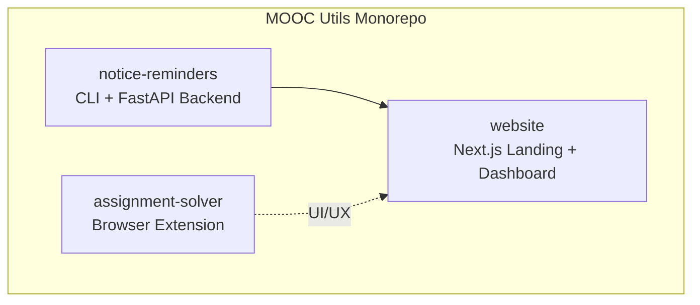
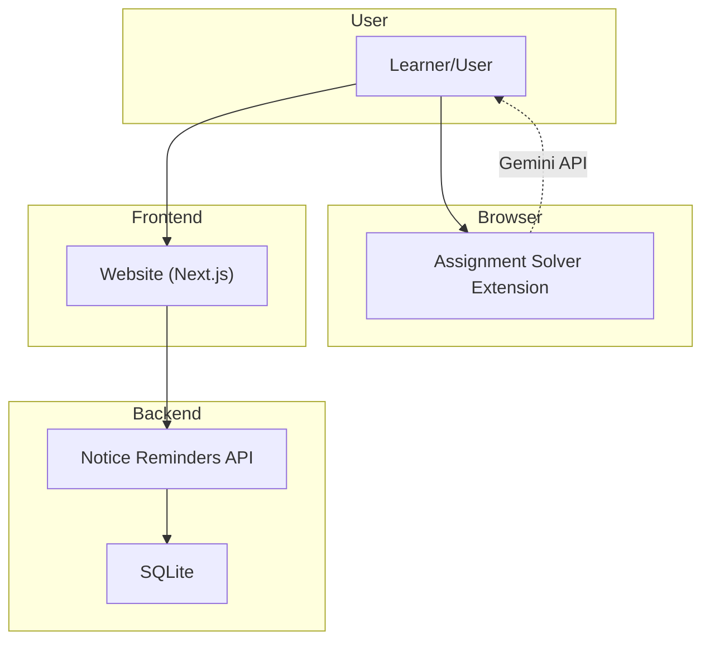
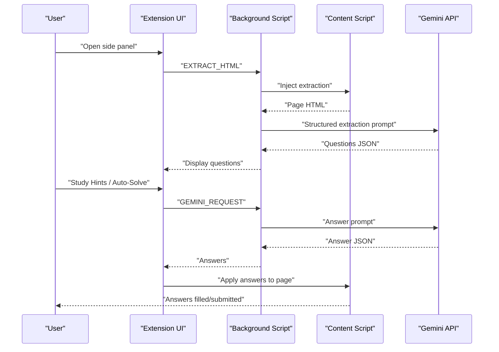
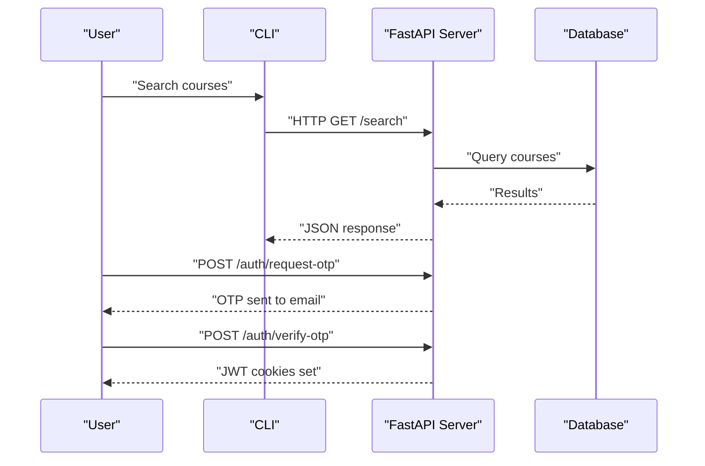
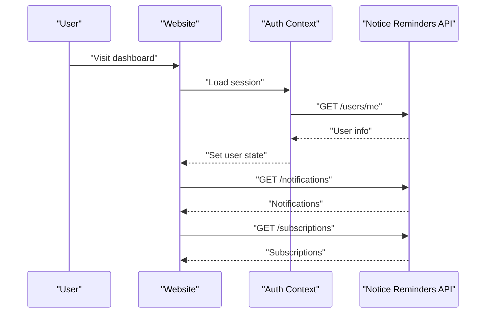
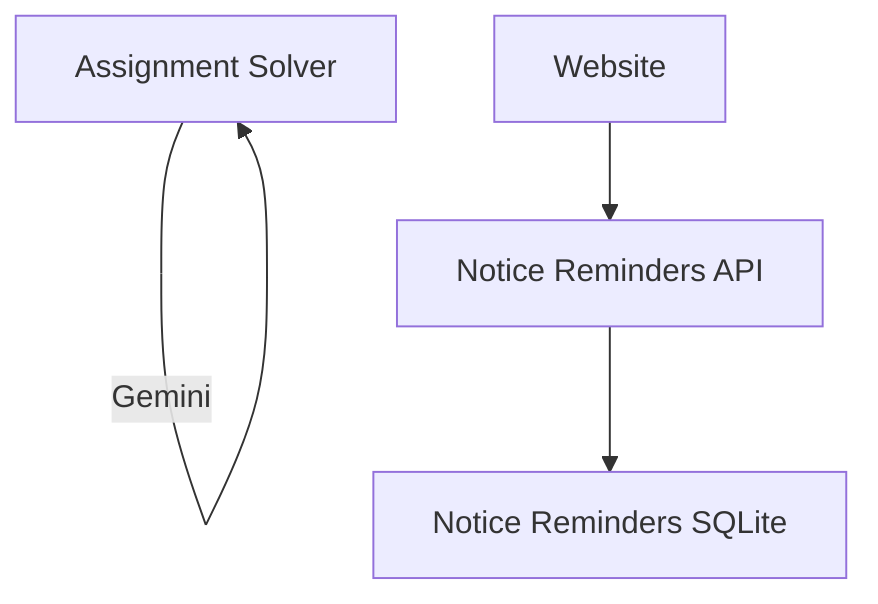

# What is MOOC utils

MOOC Utils is a set of tools for NPTEL and SWAYAM learners who are tired of repetitive busywork. Three parts: an AI assignment helper extension, a notices CLI/API, and a Next.js marketing site plus dashboard.

Repo: https://github.com/tashifkhan/MOOC-utils

## Project structure

Three packages, each with its own stack:

- `assignment-solver/`: Chrome/Firefox extension (Vite, Gemini).
- `notice-reminders/`: Python 3.12+ CLI and FastAPI backend.
- `website/`: Next.js App Router landing page and dashboard.

```mermaid
graph TB
subgraph "MOOC Utils Monorepo"
AS["assignment-solver<br/>Browser Extension"]
NR["notice-reminders<br/>CLI + FastAPI Backend"]
WEB["website<br/>Next.js Landing + Dashboard"]
end
NR --> WEB
AS -. "UI/UX".-> WEB
```

## Core components

- Assignment Solver
  - Purpose: extract and solve assignment questions on MOOC pages.
  - Modes: Study Hints and Auto-Solve.
  - Types: single choice, multi choice, fill-in-the-blank, plus screenshots for image questions.
  - Privacy: BYOK. Client-side only. Key stored in the browser.
  - Browsers: Chrome 116+, Firefox 121+.

- Notice Reminders
  - Purpose: course updates without hunting the Swayam UI.
  - CLI: search and list announcements, no database.
  - API: users, search, courses, announcements, subscriptions, notifications.
  - Auth: email OTP, JWT access/refresh cookies.
  - Notify: Telegram and email still planned.

- Website
  - Purpose: marketing plus the Notice Reminders dashboard, and an Assignment Solver page.
  - Auth: OTP against the Notice Reminders API.
  - Also: public course search, subscription manager, inbox, profile.

## Architecture overview

The extension talks to Gemini. The website talks to Notice Reminders. Those two paths do not share a server.

```mermaid
graph TB
subgraph "User"
U["Learner/User"]
end
subgraph "Browser"
EXT["Assignment Solver Extension"]
end
subgraph "Backend"
API["Notice Reminders API"]
DB["SQLite"]
end
subgraph "Frontend"
WEB["Website (Next.js)"]
end
U --> EXT
U --> WEB
WEB --> API
API --> DB
EXT -. "Gemini API".-> U
```

## Assignment solver

Layered background, content script, side panel, and Gemini service.

```mermaid
sequenceDiagram
participant User as "User"
participant Ext as "Extension UI"
participant BG as "Background Script"
participant CS as "Content Script"
participant Gemini as "Gemini API"
User->>Ext : "Open side panel"
Ext->>BG : "EXTRACT_HTML"
BG->>CS : "Inject extraction"
CS-->>BG : "Page HTML"
BG->>Gemini : "Structured extraction prompt"
Gemini-->>BG : "Questions JSON"
BG-->>Ext : "Display questions"
User->>Ext : "Study Hints / Auto-Solve"
Ext->>BG : "GEMINI_REQUEST"
BG->>Gemini : "Answer prompt"
Gemini-->>BG : "Answer JSON"
BG-->>Ext : "Answers"
Ext->>CS : "Apply answers to page"
CS-->>User : "Answers filled/submitted"
```

Extraction turns page HTML into JSON. Solving asks Gemini per question. Application clicks radios, checks boxes, or types fill-ins.

## Notice reminders

`uv run python main.py cli` or `uv run python main.py api`. CLI uses `app/cli`. API uses Tortoise against SQLite.

```mermaid
sequenceDiagram
participant User as "User"
participant CLI as "CLI"
participant API as "FastAPI Server"
participant DB as "Database"
User->>CLI : "Search courses"
CLI->>API : "HTTP GET /search"
API->>DB : "Query courses"
DB-->>API : "Results"
API-->>CLI : "JSON response"
User->>API : "POST /auth/request-otp"
API-->>User : "OTP sent to email"
User->>API : "POST /auth/verify-otp"
API-->>User : "JWT cookies set"
```

Public: `GET /search`, `GET /courses`, `GET /courses/{code}`. Everything else needs auth. CORS defaults to `http://localhost:3000`.

## Website

OTP login, course search, subscriptions, inbox. TanStack Query for dashboard fetches.

```mermaid
sequenceDiagram
participant User as "User"
participant Site as "Website"
participant Auth as "Auth Context"
participant API as "Notice Reminders API"
User->>Site : "Visit dashboard"
Site->>Auth : "Load session"
Auth->>API : "GET /users/me"
API-->>Auth : "User info"
Auth-->>Site : "Set user state"
Site->>API : "GET /notifications"
API-->>Site : "Notifications"
Site->>API : "GET /subscriptions"
API-->>Site : "Subscriptions"
```

`lib/auth-context.tsx` owns request/verify OTP, refresh, and logout. Do not use `npm run dev` or `bun dev`.

## Dependency analysis

```mermaid
graph TB
AS["Assignment Solver"]
NR_API["Notice Reminders API"]
NR_DB["Notice Reminders SQLite"]
WEB["Website"]
AS --> |"Gemini"| AS
WEB --> NR_API
NR_API --> NR_DB
```

## Performance

- Assignment Solver: delays between Gemini calls and DOM writes so quota and the page keep up.
- Notice Reminders: cache TTL 60 minutes; SQLite is the local default.
- Website: Query cache and App Router splits.

## Troubleshooting

- Assignment Solver: page HTML, missing containers, invalid key, custom widgets, rate limits.
- Notice Reminders: CLI vs API, CORS origin, `jwt_secret`.
- Website: API down, cookies blocked, wrong `NEXT_PUBLIC_API_URL`.

## Conclusion

Less manual checking, fewer missed notices, assignment help that does not ship your key to a random server.

## Appendices

- Assignment Solver: `cd assignment-solver && bun install && bun run build`, load `dist/chrome` or `dist/firefox`.
- Notice Reminders: `cd notice-reminders && uv sync`, then `cli` or `api`.
- Website: `cd website && bun install`, set `NEXT_PUBLIC_API_URL`, `bun run build`.
