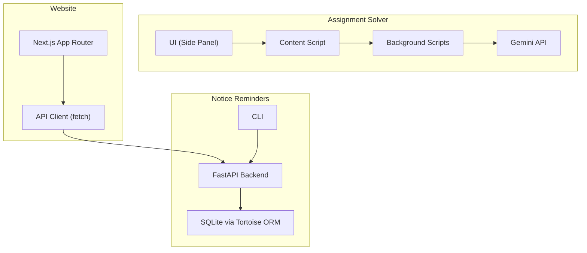
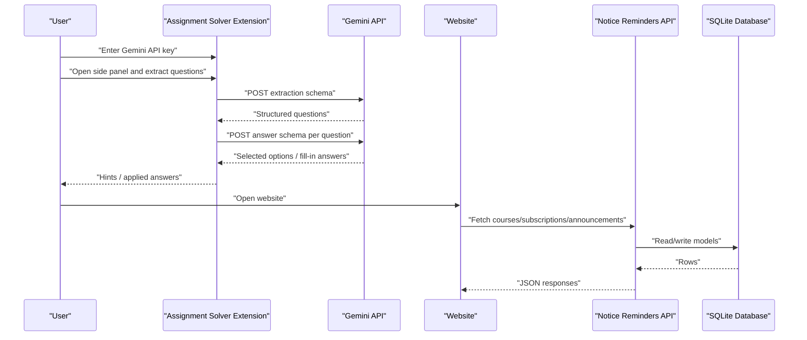
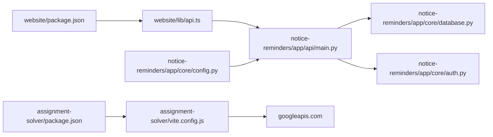

# Troubleshooting and FAQ

<cite>
**Referenced Files in This Document**
- [assignment-solver/README.md](file://assignment-solver/README.md)
- [assignment-solver/package.json](file://assignment-solver/package.json)
- [assignment-solver/vite.config.js](file://assignment-solver/vite.config.js)
- [assignment-solver/src/core/logger.js](file://assignment-solver/src/core/logger.js)
- [assignment-solver/src/content/logger.js](file://assignment-solver/src/content/logger.js)
- [notice-reminders/README.md](file://notice-reminders/README.md)
- [notice-reminders/pyproject.toml](file://notice-reminders/pyproject.toml)
- [notice-reminders/app/core/config.py](file://notice-reminders/app/core/config.py)
- [notice-reminders/app/core/database.py](file://notice-reminders/app/core/database.py)
- [notice-reminders/app/core/auth.py](file://notice-reminders/app/core/auth.py)
- [notice-reminders/app/api/main.py](file://notice-reminders/app/api/main.py)
- [website/README.md](file://website/README.md)
- [website/package.json](file://website/package.json)
- [website/lib/api.ts](file://website/lib/api.ts)
- [website/app/layout.tsx](file://website/app/layout.tsx)
</cite>

## Table of Contents
1. [Introduction](#introduction)
2. [Project Structure](#project-structure)
3. [Core Components](#core-components)
4. [Architecture Overview](#architecture-overview)
5. [Detailed Component Analysis](#detailed-component-analysis)
6. [Dependency Analysis](#dependency-analysis)
7. [Performance Considerations](#performance-considerations)
8. [Troubleshooting Guide](#troubleshooting-guide)
9. [Conclusion](#conclusion)
10. [Appendices](#appendices)

## Introduction
This document provides a comprehensive troubleshooting guide and FAQ for all MOOC Utils components: the Assignment Solver browser extension, the Notice Reminders API and CLI, and the Website dashboard. It covers installation issues, API connectivity, authentication failures, performance optimization, debugging workflows, browser-specific problems, CORS, and integration challenges. Step-by-step resolutions, diagnostic commands, and error interpretation are included to help both users and developers resolve issues quickly.

## Project Structure
The repository is organized as a monorepo with three primary areas:
- assignment-solver: A browser extension (Chrome/Firefox) that integrates with Gemini AI to extract and solve assignments.
- notice-reminders: A FastAPI backend with Tortoise ORM for course announcements and subscriptions, plus a CLI.
- website: A Next.js frontend/dashboard that communicates with the Notice Reminders API.

**Diagram sources**
- [assignment-solver/vite.config.js](file://assignment-solver/vite.config.js#L54-L108)
- [notice-reminders/app/api/main.py](file://notice-reminders/app/api/main.py#L17-L46)
- [notice-reminders/app/core/database.py](file://notice-reminders/app/core/database.py#L39-L54)
- [website/lib/api.ts](file://website/lib/api.ts#L28-L53)

**Section sources**
- [assignment-solver/README.md](file://assignment-solver/README.md#L142-L160)
- [notice-reminders/README.md](file://notice-reminders/README.md#L5-L12)
- [website/README.md](file://website/README.md#L1-L12)

## Core Components
- Assignment Solver (browser extension)
  - Uses Vite for builds, webextension-polyfill for cross-browser compatibility, and dynamic manifests for Chrome and Firefox.
  - Integrates with Gemini via HTTPS calls to googleapis.com.
  - Stores API keys locally in browser storage.
- Notice Reminders (FastAPI + Tortoise ORM)
  - Provides REST endpoints for users, courses, subscriptions, notifications, and auth.
  - Configurable CORS origins and SQLite database via environment variables.
- Website (Next.js)
  - Frontend dashboard and marketing pages, communicating with the Notice Reminders API via fetch with credentials.

Key configuration touchpoints:
- Assignment Solver build and permissions are defined in its package and Vite configs.
- Notice Reminders settings include CORS, JWT, SMTP, and database URL.
- Website requires NEXT_PUBLIC_API_URL and uses credentials for API calls.

**Section sources**
- [assignment-solver/package.json](file://assignment-solver/package.json#L6-L14)
- [assignment-solver/vite.config.js](file://assignment-solver/vite.config.js#L15-L32)
- [notice-reminders/app/core/config.py](file://notice-reminders/app/core/config.py#L4-L32)
- [notice-reminders/app/core/database.py](file://notice-reminders/app/core/database.py#L7-L25)
- [website/lib/api.ts](file://website/lib/api.ts#L16-L53)

## Architecture Overview
High-level interactions among components:

**Diagram sources**
- [assignment-solver/README.md](file://assignment-solver/README.md#L164-L202)
- [notice-reminders/app/api/main.py](file://notice-reminders/app/api/main.py#L17-L46)
- [notice-reminders/app/core/database.py](file://notice-reminders/app/core/database.py#L39-L54)
- [website/lib/api.ts](file://website/lib/api.ts#L28-L53)

## Detailed Component Analysis

### Assignment Solver Extension
Common issues and resolutions:
- Could not get page HTML
  - Ensure you are on a real assignment page and it is fully loaded. Refresh and re-extract.
- Question container not found
  - Re-extract questions; check console for detailed errors.
- API Key invalid
  - Verify the key at the provider’s portal, ensure it has Gemini API access enabled, and remove extra spaces.
- Answers not being applied
  - Some platforms use custom components; check browser console; apply answers one at a time to isolate issues.
- Rate limit errors
  - Wait before retrying; consider upgrading quota or reducing questions per session.

Debugging steps:
- Open DevTools in the extension context and review console logs.
- Use the content script logger to trace extraction and application phases.
- Confirm permissions and host permissions for the target site and googleapis.com.

Build and load troubleshooting:
- Build for Chrome or Firefox using the provided scripts.
- Load the extension in developer mode:
  - Chrome: chrome://extensions → Developer mode → Load unpacked → select dist/chrome
  - Firefox: about:debugging → This Firefox → Load Temporary Add-on → select any file under dist/firefox

Permissions and host permissions:
- activeTab, scripting, storage, sidePanel/sidebarAction, and host permissions for googleapis.com.

**Section sources**
- [assignment-solver/README.md](file://assignment-solver/README.md#L259-L300)
- [assignment-solver/package.json](file://assignment-solver/package.json#L6-L14)
- [assignment-solver/vite.config.js](file://assignment-solver/vite.config.js#L54-L108)
- [assignment-solver/src/core/logger.js](file://assignment-solver/src/core/logger.js#L10-L18)
- [assignment-solver/src/content/logger.js](file://assignment-solver/src/content/logger.js#L11-L17)

### Notice Reminders API and CLI
Common issues and resolutions:
- Database initialization and migrations
  - SQLite path is created automatically if missing; ensure the directory exists and is writable.
- CORS errors in the website
  - Adjust cors_origins in settings to include the website origin.
- Authentication failures
  - Ensure cookies are accepted and tokens are present; verify token expiration and payload.
- Rate limiting and quotas
  - The API relies on external services; monitor usage and consider rate-limit-aware clients.

Development and deployment:
- Install dependencies using the documented commands.
- Run the API in development mode with hot reload or bind to a specific host/port.
- For CLI mode, run the interactive scraper without requiring a database.

**Section sources**
- [notice-reminders/README.md](file://notice-reminders/README.md#L20-L56)
- [notice-reminders/pyproject.toml](file://notice-reminders/pyproject.toml#L1-L41)
- [notice-reminders/app/core/config.py](file://notice-reminders/app/core/config.py#L4-L32)
- [notice-reminders/app/core/database.py](file://notice-reminders/app/core/database.py#L28-L54)
- [notice-reminders/app/core/auth.py](file://notice-reminders/app/core/auth.py#L14-L72)
- [notice-reminders/app/api/main.py](file://notice-reminders/app/api/main.py#L17-L46)

### Website Dashboard
Common issues and resolutions:
- Backend not running
  - The website requires the Notice Reminders API to be up for login and dashboard features.
- Environment configuration
  - Set NEXT_PUBLIC_API_URL to the backend address; ensure trailing slashes and protocol are correct.
- CORS and cookies
  - The API client sends credentials; ensure the API allows the frontend origin and sets appropriate CORS.

**Section sources**
- [website/README.md](file://website/README.md#L20-L51)
- [website/package.json](file://website/package.json#L5-L10)
- [website/lib/api.ts](file://website/lib/api.ts#L16-L53)
- [website/app/layout.tsx](file://website/app/layout.tsx#L28-L79)

## Dependency Analysis
Relationships between components:

**Diagram sources**
- [assignment-solver/package.json](file://assignment-solver/package.json#L6-L14)
- [assignment-solver/vite.config.js](file://assignment-solver/vite.config.js#L54-L108)
- [notice-reminders/app/core/config.py](file://notice-reminders/app/core/config.py#L4-L32)
- [notice-reminders/app/core/database.py](file://notice-reminders/app/core/database.py#L39-L54)
- [notice-reminders/app/core/auth.py](file://notice-reminders/app/core/auth.py#L14-L72)
- [notice-reminders/app/api/main.py](file://notice-reminders/app/api/main.py#L17-L46)
- [website/package.json](file://website/package.json#L5-L10)
- [website/lib/api.ts](file://website/lib/api.ts#L16-L53)

**Section sources**
- [assignment-solver/package.json](file://assignment-solver/package.json#L6-L14)
- [notice-reminders/app/core/config.py](file://notice-reminders/app/core/config.py#L4-L32)
- [notice-reminders/app/api/main.py](file://notice-reminders/app/api/main.py#L17-L46)
- [website/lib/api.ts](file://website/lib/api.ts#L16-L53)

## Performance Considerations
- Assignment Solver
  - Rate limiting: There is a deliberate delay between API calls and DOM operations to prevent throttling and ensure reliable page updates.
  - Recommendations: Reduce concurrent questions per session, avoid rapid retries, and consider upgrading the Gemini quota if needed.
- Notice Reminders API
  - Use caching TTL settings appropriately; tune cache duration based on content volatility.
  - Monitor database writes and consider batching operations where feasible.
- Website
  - Minimize unnecessary requests; leverage caching and pagination for large datasets.
  - Ensure CORS is configured to reduce preflight overhead.

**Section sources**
- [assignment-solver/README.md](file://assignment-solver/README.md#L253-L258)
- [notice-reminders/app/core/config.py](file://notice-reminders/app/core/config.py#L12-L12)

## Troubleshooting Guide

### Extension Installation Problems
Symptoms:
- Extension does not appear after loading.
- Missing permissions or blocked API calls.

Resolution steps:
- Verify prerequisites: supported browser versions and Bun installed.
- Build the extension for the target browser using the provided scripts.
- Load the extension in developer mode:
  - Chrome: chrome://extensions → Developer mode → Load unpacked → select dist/chrome
  - Firefox: about:debugging → This Firefox → Load Temporary Add-on → select any file under dist/firefox
- Confirm permissions and host permissions for the target site and googleapis.com.

Diagnostics:
- Open the extension’s background and side panel contexts in DevTools.
- Check console logs for permission-related errors.

**Section sources**
- [assignment-solver/README.md](file://assignment-solver/README.md#L24-L30)
- [assignment-solver/package.json](file://assignment-solver/package.json#L6-L14)
- [assignment-solver/vite.config.js](file://assignment-solver/vite.config.js#L54-L108)

### API Connectivity Issues
Symptoms:
- Website shows “Request failed” or generic network errors.
- Login/signup endpoints return errors.

Resolution steps:
- Ensure the Notice Reminders API is running and reachable.
- Set NEXT_PUBLIC_API_URL to the correct backend address.
- Confirm CORS settings allow the frontend origin.

Diagnostics:
- Inspect network tab in DevTools for failed requests and status codes.
- Use the API client’s error handling to surface detailed messages.

**Section sources**
- [website/README.md](file://website/README.md#L27-L34)
- [website/lib/api.ts](file://website/lib/api.ts#L18-L53)
- [notice-reminders/app/api/main.py](file://notice-reminders/app/api/main.py#L21-L27)

### Authentication Failures
Symptoms:
- “Not authenticated,” “Access token expired,” or “Invalid access token.”
- Session refresh or logout endpoints failing.

Resolution steps:
- Ensure cookies are enabled and sent with requests.
- Verify JWT secret and token expiration settings.
- Regenerate tokens if expired; retry refresh or re-login.

Diagnostics:
- Check server logs for token verification errors.
- Confirm token presence in cookies and payload validity.

**Section sources**
- [notice-reminders/app/core/auth.py](file://notice-reminders/app/core/auth.py#L14-L72)
- [notice-reminders/app/core/config.py](file://notice-reminders/app/core/config.py#L22-L26)
- [website/lib/api.ts](file://website/lib/api.ts#L167-L177)

### Performance Optimization
Symptoms:
- Slow extraction or answer application.
- Frequent rate limit errors.

Resolution steps:
- Reduce the number of questions processed per session.
- Allow recommended delays between operations.
- Upgrade API quota if necessary.

Diagnostics:
- Monitor Gemini API response times and error rates.
- Observe DOM operation timing in the content script.

**Section sources**
- [assignment-solver/README.md](file://assignment-solver/README.md#L253-L258)

### Debugging the Assignment Solver Extension
Steps:
- Open DevTools for the extension’s side panel and background contexts.
- Use the provided logger factories to trace extraction, solving, and application phases.
- Reproduce the issue and capture console output.

Diagnostics:
- Look for selector mismatches or missing elements during extraction.
- Validate answer application by checking DOM events and element states.

**Section sources**
- [assignment-solver/src/core/logger.js](file://assignment-solver/src/core/logger.js#L10-L18)
- [assignment-solver/src/content/logger.js](file://assignment-solver/src/content/logger.js#L11-L17)

### Database Connection Problems (Notice Reminders)
Symptoms:
- Database initialization fails or schema generation errors.
- SQLite path not found.

Resolution steps:
- Ensure the database URL points to a valid path for SQLite.
- Confirm the directory exists and is writable.
- On first run, the database is initialized automatically if the path is missing.

Diagnostics:
- Check Tortoise registration logs.
- Verify file system permissions for the SQLite directory.

**Section sources**
- [notice-reminders/app/core/database.py](file://notice-reminders/app/core/database.py#L28-L54)
- [notice-reminders/app/core/config.py](file://notice-reminders/app/core/config.py#L7-L7)

### Website Deployment Issues
Symptoms:
- Login/dashboard features unavailable.
- CORS errors when fetching data.

Resolution steps:
- Run the backend before starting the frontend.
- Set NEXT_PUBLIC_API_URL to the backend address.
- Configure CORS origins to include the frontend origin.

Diagnostics:
- Confirm credentials are included in API requests.
- Validate that the backend responds to health checks.

**Section sources**
- [website/README.md](file://website/README.md#L47-L51)
- [website/lib/api.ts](file://website/lib/api.ts#L35-L40)
- [notice-reminders/app/api/main.py](file://notice-reminders/app/api/main.py#L21-L27)

### Browser-Specific Issues
Symptoms:
- Extension behaves differently on Chrome vs Firefox.
- Side panel or sidebar action not visible.

Resolution steps:
- Use the correct build targets for each browser.
- Confirm sidePanel permissions for Chrome and sidebarAction for Firefox.
- Test on supported minimum versions.

Diagnostics:
- Compare manifest differences and permissions.
- Validate browser-specific APIs via DevTools.

**Section sources**
- [assignment-solver/README.md](file://assignment-solver/README.md#L291-L300)
- [assignment-solver/vite.config.js](file://assignment-solver/vite.config.js#L15-L32)

### CORS Problems
Symptoms:
- Preflight failures or blocked requests.
- “CORS policy” errors in the console.

Resolution steps:
- Add the frontend origin to cors_origins in settings.
- Ensure credentials are included in requests.
- Match allowed methods and headers.

Diagnostics:
- Inspect preflight OPTIONS requests and responses.
- Verify allowed origins and credentials flags.

**Section sources**
- [notice-reminders/app/core/config.py](file://notice-reminders/app/core/config.py#L20-L20)
- [notice-reminders/app/api/main.py](file://notice-reminders/app/api/main.py#L21-L27)
- [website/lib/api.ts](file://website/lib/api.ts#L35-L40)

### Integration Challenges Between Components
Symptoms:
- Website cannot communicate with the API.
- Tokens not recognized across frontend/backend.

Resolution steps:
- Align NEXT_PUBLIC_API_URL with the backend host/port.
- Ensure cookies are accepted and tokens are stored in httpOnly cookies.
- Verify CORS and credential policies are consistent.

Diagnostics:
- Trace request/response headers for cookies and origins.
- Validate token signing and expiration settings.

**Section sources**
- [website/lib/api.ts](file://website/lib/api.ts#L16-L53)
- [notice-reminders/app/core/auth.py](file://notice-reminders/app/core/auth.py#L14-L72)
- [notice-reminders/app/core/config.py](file://notice-reminders/app/core/config.py#L22-L26)

## Conclusion
By following the step-by-step procedures and diagnostics outlined above, most issues across the MOOC Utils components can be resolved efficiently. Keep an eye on rate limits, ensure proper configuration of CORS and database paths, and leverage the built-in logging and DevTools to isolate problems quickly.

## Appendices

### Quick Diagnostic Commands
- Assignment Solver
  - Build for Chrome: bun run build:chrome
  - Build for Firefox: bun run build:firefox
  - Watch mode: bun run dev:chrome or bun run dev:firefox
- Notice Reminders
  - Install dependencies: uv sync
  - Run API (dev): uv run python main.py api --reload
  - Run API (bind): uv run python main.py api --host 0.0.0.0 --port 8000
  - CLI mode: uv run python main.py cli
- Website
  - Install dependencies: bun install
  - Build: bun run build
  - Lint: bun run lint

**Section sources**
- [assignment-solver/package.json](file://assignment-solver/package.json#L6-L14)
- [notice-reminders/README.md](file://notice-reminders/README.md#L24-L49)
- [website/README.md](file://website/README.md#L22-L45)