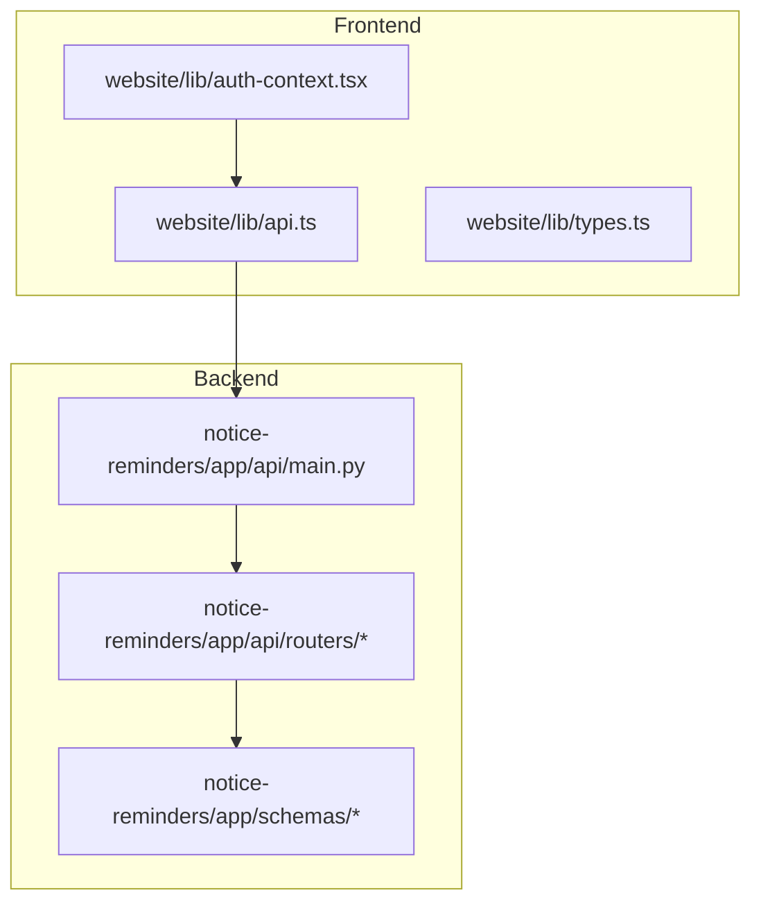
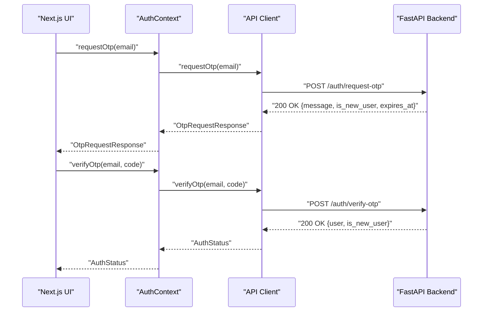
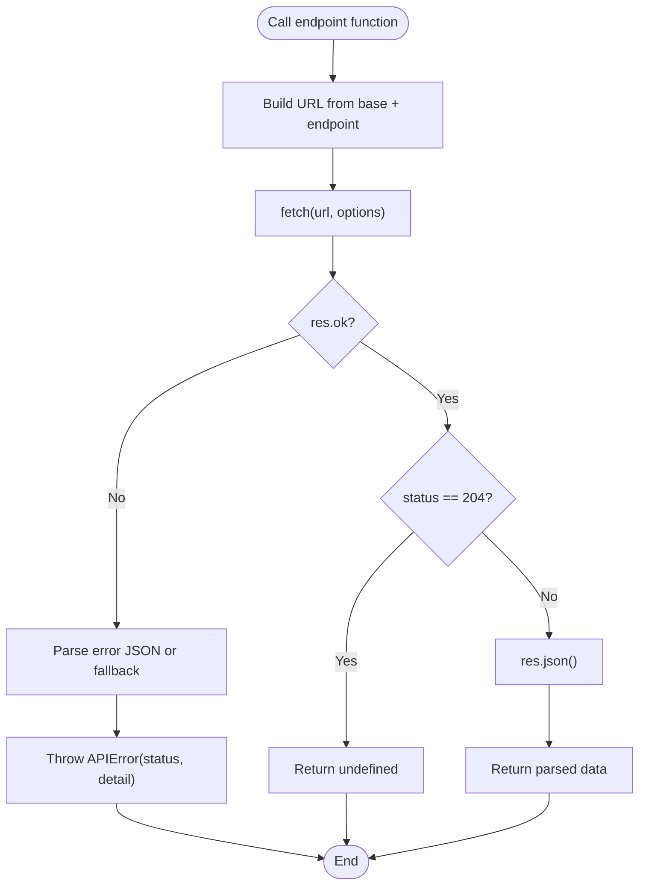
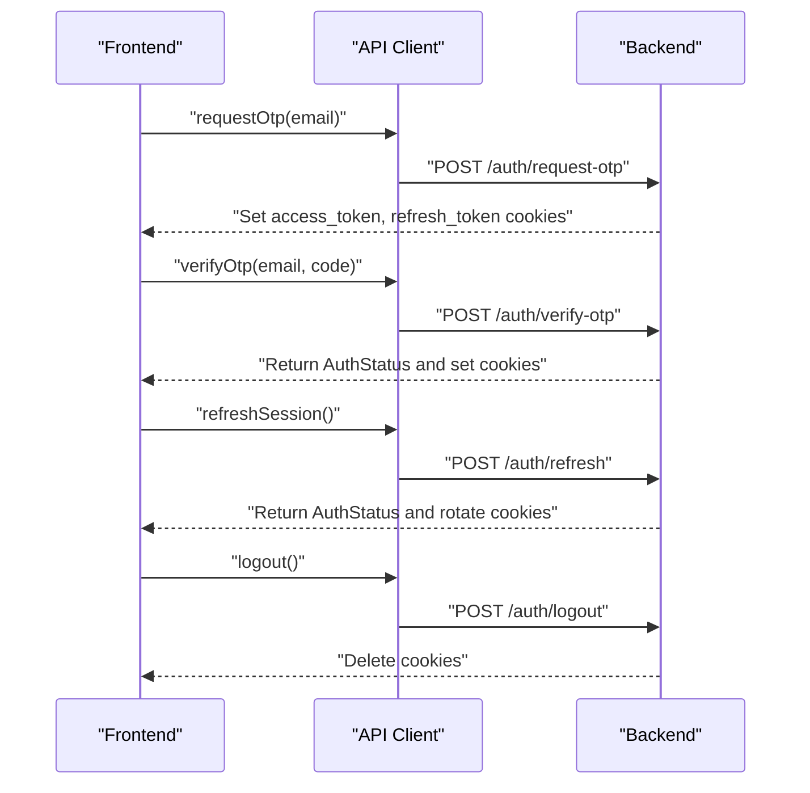
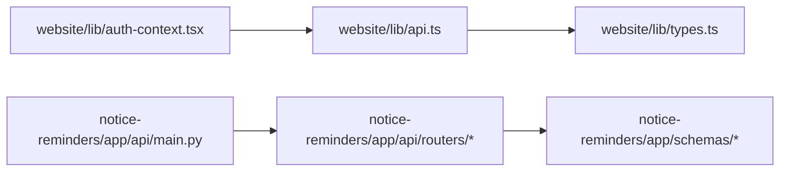

# API Integration

<cite>
**Referenced Files in This Document**
- [api.ts](file://website/lib/api.ts)
- [types.ts](file://website/lib/types.ts)
- [auth-context.tsx](file://website/lib/auth-context.tsx)
- [main.py](file://notice-reminders/app/api/main.py)
- [auth.py](file://notice-reminders/app/api/routers/auth.py)
- [users.py](file://notice-reminders/app/api/routers/users.py)
- [courses.py](file://notice-reminders/app/api/routers/courses.py)
- [search.py](file://notice-reminders/app/api/routers/search.py)
- [subscriptions.py](file://notice-reminders/app/api/routers/subscriptions.py)
- [announcements.py](file://notice-reminders/app/api/routers/announcements.py)
- [notifications.py](file://notice-reminders/app/api/routers/notifications.py)
- [auth.py (schemas)](file://notice-reminders/app/schemas/auth.py)
- [user.py (schemas)](file://notice-reminders/app/schemas/user.py)
- [course.py (schemas)](file://notice-reminders/app/schemas/course.py)
- [subscription.py (schemas)](file://notice-reminders/app/schemas/subscription.py)
- [notification.py (schemas)](file://notice-reminders/app/schemas/notification.py)
- [notification_channel.py (schemas)](file://notice-reminders/app/schemas/notification_channel.py)
</cite>

## Table of Contents
1. [Introduction](#introduction)
2. [Project Structure](#project-structure)
3. [Core Components](#core-components)
4. [Architecture Overview](#architecture-overview)
5. [Detailed Component Analysis](#detailed-component-analysis)
6. [Dependency Analysis](#dependency-analysis)
7. [Performance Considerations](#performance-considerations)
8. [Troubleshooting Guide](#troubleshooting-guide)
9. [Conclusion](#conclusion)

## Introduction
This document describes the API integration layer that connects the Next.js frontend to the Notice Reminders backend. It explains the API client implementation, request/response handling, error management, TypeScript interfaces, data transformation patterns, authentication flow, and endpoint specifications. It also outlines strategies for rate limiting, retries, and offline handling to improve user experience.

## Project Structure
The integration spans two primary areas:
- Frontend API client and types: located under website/lib
- Backend API routers and schemas: located under notice-reminders/app/api/routers and notice-reminders/app/schemas

**Diagram sources**
- [api.ts](file://website/lib/api.ts#L1-L184)
- [types.ts](file://website/lib/types.ts#L1-L97)
- [auth-context.tsx](file://website/lib/auth-context.tsx#L1-L97)
- [main.py](file://notice-reminders/app/api/main.py#L1-L46)
- [auth.py](file://notice-reminders/app/api/routers/auth.py#L1-L126)
- [users.py](file://notice-reminders/app/api/routers/users.py#L1-L151)
- [courses.py](file://notice-reminders/app/api/routers/courses.py#L1-L32)
- [search.py](file://notice-reminders/app/api/routers/search.py#L1-L17)
- [subscriptions.py](file://notice-reminders/app/api/routers/subscriptions.py#L1-L71)
- [announcements.py](file://notice-reminders/app/api/routers/announcements.py#L1-L33)
- [notifications.py](file://notice-reminders/app/api/routers/notifications.py#L1-L62)
- [auth.py (schemas)](file://notice-reminders/app/schemas/auth.py#L1-L26)
- [user.py (schemas)](file://notice-reminders/app/schemas/user.py#L1-L24)
- [course.py (schemas)](file://notice-reminders/app/schemas/course.py#L1-L19)
- [subscription.py (schemas)](file://notice-reminders/app/schemas/subscription.py#L1-L19)
- [notification.py (schemas)](file://notice-reminders/app/schemas/notification.py#L1-L17)
- [notification_channel.py (schemas)](file://notice-reminders/app/schemas/notification_channel.py#L1-L22)

**Section sources**
- [api.ts](file://website/lib/api.ts#L1-L184)
- [types.ts](file://website/lib/types.ts#L1-L97)
- [auth-context.tsx](file://website/lib/auth-context.tsx#L1-L97)
- [main.py](file://notice-reminders/app/api/main.py#L1-L46)

## Core Components
- API client: centralized request wrapper with consistent headers, credentials, and error handling.
- Endpoint functions: typed wrappers for each backend route.
- TypeScript interfaces: strict data contracts mirroring backend schemas.
- Authentication context: OTP-based session lifecycle and cookie-based auth propagation.
- Backend routers: FastAPI endpoints implementing CRUD and orchestration.

Key responsibilities:
- API client enforces JSON content type, includes credentials, and normalizes errors.
- Endpoint functions encapsulate URL construction, HTTP verbs, and body serialization.
- Types define request/response shapes and guard against runtime mismatches.
- Auth context manages session hydration, OTP requests/verification, refresh, and logout.
- Backend routers validate inputs, enforce permissions, and return Pydantic models.

**Section sources**
- [api.ts](file://website/lib/api.ts#L16-L53)
- [types.ts](file://website/lib/types.ts#L1-L97)
- [auth-context.tsx](file://website/lib/auth-context.tsx#L21-L87)
- [auth.py](file://notice-reminders/app/api/routers/auth.py#L15-L125)

## Architecture Overview
The frontend communicates with the backend via HTTPS endpoints. The backend uses cookies for session management and CORS for cross-origin support. The frontend’s API client centralizes request configuration and error handling.

**Diagram sources**
- [auth-context.tsx](file://website/lib/auth-context.tsx#L41-L49)
- [api.ts](file://website/lib/api.ts#L150-L165)
- [auth.py](file://notice-reminders/app/api/routers/auth.py#L43-L75)

## Detailed Component Analysis

### API Client Implementation
The API client defines a generic request function and typed endpoint functions. It:
- Sets base URL from environment.
- Sends credentials with each request.
- Enforces JSON content type.
- Parses successful responses and handles 204 No Content.
- Converts non-OK responses into a structured APIError with status and message.

**Diagram sources**
- [api.ts](file://website/lib/api.ts#L28-L53)

**Section sources**
- [api.ts](file://website/lib/api.ts#L16-L53)

### Request/Response Handling and Error Management
- Successful responses are parsed as JSON; 204 returns undefined.
- Non-OK responses trigger APIError with status and detail.
- The client does not implement retries or exponential backoff; these can be added at call sites if needed.

Recommendations:
- Add retry logic with jitter for transient failures.
- Implement rate-limit-aware backoff and queueing.
- Surface user-friendly messages while preserving error details.

**Section sources**
- [api.ts](file://website/lib/api.ts#L42-L52)

### TypeScript Interfaces and Data Transformation
Frontend types mirror backend schemas. The backend validates and serializes responses using Pydantic models. The frontend consumes these as strongly typed interfaces.

```mermaid
classDiagram
class User {
+number id
+string email
+string name
+string telegram_id
+boolean is_active
+string created_at
+string updated_at
}
class UserUpdate {
+string email
+string name
+string telegram_id
+boolean is_active
}
class Course {
+number id
+string code
+string title
+string url
+string instructor
+string institute
+string nc_code
+string created_at
+string updated_at
}
class Subscription {
+number id
+number user_id
+number course_id
+boolean is_active
+string created_at
}
class SubscriptionCreate {
+string course_code
}
class NotificationChannel {
+number id
+number user_id
+string channel
+string address
+boolean is_active
+string created_at
}
class NotificationChannelCreate {
+string channel
+string address
+boolean is_active
}
class OtpRequestResponse {
+string message
+boolean is_new_user
+string expires_at
}
class AuthStatus {
+User user
+boolean is_new_user
}
class Announcement {
+number id
+number course_id
+string title
+string date
+string content
+string fetched_at
}
class Notification {
+number id
+number user_id
+number subscription_id
+number announcement_id
+number channel_id
+boolean is_read
+string sent_at
}
```

**Diagram sources**
- [types.ts](file://website/lib/types.ts#L4-L96)
- [auth.py (schemas)](file://notice-reminders/app/schemas/auth.py#L8-L25)
- [user.py (schemas)](file://notice-reminders/app/schemas/user.py#L13-L23)
- [course.py (schemas)](file://notice-reminders/app/schemas/course.py#L6-L18)
- [subscription.py (schemas)](file://notice-reminders/app/schemas/subscription.py#L10-L18)
- [notification_channel.py (schemas)](file://notice-reminders/app/schemas/notification_channel.py#L12-L21)
- [notification.py (schemas)](file://notice-reminders/app/schemas/notification.py#L6-L16)

**Section sources**
- [types.ts](file://website/lib/types.ts#L1-L97)

### Authentication Headers and Session Cookies
- The API client sends credentials with each request, enabling cookie-based session handling.
- Backend sets HttpOnly, SameSite lax cookies for access and refresh tokens.
- The frontend relies on the backend to manage session state via cookies.

**Diagram sources**
- [api.ts](file://website/lib/api.ts#L150-L177)
- [auth.py](file://notice-reminders/app/api/routers/auth.py#L15-L121)

**Section sources**
- [api.ts](file://website/lib/api.ts#L33-L40)
- [auth.py](file://notice-reminders/app/api/routers/auth.py#L15-L41)

### Request Interceptors and Response Parsing
- Interceptor pattern: a single request wrapper applies headers and credentials uniformly.
- Response parsing: JSON parsing with 204 handling; errors normalized into APIError.

Enhancements:
- Add request/response logging for debugging.
- Introduce a thin interceptor layer around fetch to centralize retry/backoff and rate-limit handling.

**Section sources**
- [api.ts](file://website/lib/api.ts#L28-L53)

### API Endpoint Specifications
Below are the endpoint groups and their functions exposed by the frontend client and implemented by the backend.

- Users
  - GET /users/{user_id}
  - PATCH /users/{user_id}
  - DELETE /users/{user_id}
  - POST /users/{user_id}/channels
  - GET /users/{user_id}/channels

- Auth
  - POST /auth/request-otp
  - POST /auth/verify-otp
  - POST /auth/refresh
  - POST /auth/logout
  - GET /auth/me

- Courses
  - GET /courses
  - GET /courses/{course_code}

- Search
  - GET /search?q={query}

- Announcements
  - GET /courses/{course_code}/announcements

- Subscriptions
  - POST /subscriptions
  - GET /subscriptions
  - DELETE /subscriptions/{subscription_id}

- Notifications
  - GET /notifications
  - GET /notifications/users/{user_id}
  - PATCH /notifications/{notification_id}/read

Note: All endpoints are protected by authentication where indicated. The frontend client wraps these in typed functions.

**Section sources**
- [api.ts](file://website/lib/api.ts#L55-L181)
- [users.py](file://notice-reminders/app/api/routers/users.py#L17-L150)
- [auth.py](file://notice-reminders/app/api/routers/auth.py#L43-L125)
- [courses.py](file://notice-reminders/app/api/routers/courses.py#L10-L31)
- [search.py](file://notice-reminders/app/api/routers/search.py#L10-L16)
- [announcements.py](file://notice-reminders/app/api/routers/announcements.py#L15-L32)
- [subscriptions.py](file://notice-reminders/app/api/routers/subscriptions.py#L16-L70)
- [notifications.py](file://notice-reminders/app/api/routers/notifications.py#L13-L61)

### Parameter Validation and Error Boundary Handling
- Backend validation:
  - Pydantic models validate incoming payloads (e.g., email format, required fields).
  - Route-level checks enforce ownership and existence (e.g., 403 for unauthorized access, 404 for missing resources).
- Frontend error boundaries:
  - APIError carries status and message; wrap calls in try/catch and surface user-friendly messages.
  - Consider adding global error handlers to unify toast/snackbar notifications.

**Section sources**
- [auth.py (schemas)](file://notice-reminders/app/schemas/auth.py#L8-L14)
- [users.py](file://notice-reminders/app/api/routers/users.py#L24-L28)
- [subscriptions.py](file://notice-reminders/app/api/routers/subscriptions.py#L56-L68)
- [notifications.py](file://notice-reminders/app/api/routers/notifications.py#L46-L58)

### Rate Limiting, Retry Logic, and Offline Handling
Current client behavior:
- No built-in rate-limit awareness or retry logic.
- Uses standard fetch with credentials and JSON.

Recommended enhancements:
- Rate limiting:
  - Track recent request counts per time window.
  - Back off on 429 responses; parse Retry-After header if present.
- Retry logic:
  - Retry transient network errors and 5xx responses with exponential backoff and jitter.
  - Idempotency keys for idempotent operations.
- Offline handling:
  - Queue requests when offline; replay on reconnect.
  - Use service workers or local storage to persist pending mutations.
  - Show optimistic updates with rollback on failure.

[No sources needed since this section provides general guidance]

## Dependency Analysis
The frontend API client depends on:
- Environment variable for base URL.
- Typed interfaces for request/response shapes.
- Auth context for session lifecycle.

The backend depends on:
- Pydantic schemas for validation.
- FastAPI routers for routing and dependency injection.
- Cookie-based auth for session management.

**Diagram sources**
- [api.ts](file://website/lib/api.ts#L1-L14)
- [types.ts](file://website/lib/types.ts#L1-L97)
- [auth-context.tsx](file://website/lib/auth-context.tsx#L1-L6)
- [main.py](file://notice-reminders/app/api/main.py#L6-L35)
- [auth.py (schemas)](file://notice-reminders/app/schemas/auth.py#L1-L26)

**Section sources**
- [api.ts](file://website/lib/api.ts#L1-L14)
- [main.py](file://notice-reminders/app/api/main.py#L17-L42)

## Performance Considerations
- Minimize redundant requests by coalescing frequent reads (e.g., deduplicate search queries).
- Paginate long lists (notifications, subscriptions) to reduce payload sizes.
- Cache immutable data (courses) locally with expiry to reduce network usage.
- Use background refetch strategies to keep data fresh without blocking UI.

[No sources needed since this section provides general guidance]

## Troubleshooting Guide
Common issues and resolutions:
- Authentication failures:
  - Verify cookies are being sent; ensure SameSite/Lax compatibility.
  - On 401/403, redirect to login or refresh session.
- Network errors:
  - Wrap API calls in try/catch; display user-friendly messages.
  - Implement retry with backoff for transient failures.
- Backend validation errors:
  - Inspect APIError status and message; show specific field errors when available.
- CORS issues:
  - Confirm backend allows frontend origin and credentials.

**Section sources**
- [api.ts](file://website/lib/api.ts#L18-L26)
- [auth.py](file://notice-reminders/app/api/routers/auth.py#L84-L106)

## Conclusion
The frontend API integration layer provides a clean, typed interface to the Notice Reminders backend. It centralizes request configuration, enforces authentication via cookies, and normalizes errors. Extending the client with retry/backoff, rate-limit awareness, and offline handling will significantly improve resilience and user experience. Aligning frontend types with backend schemas ensures robust data contracts across the stack.