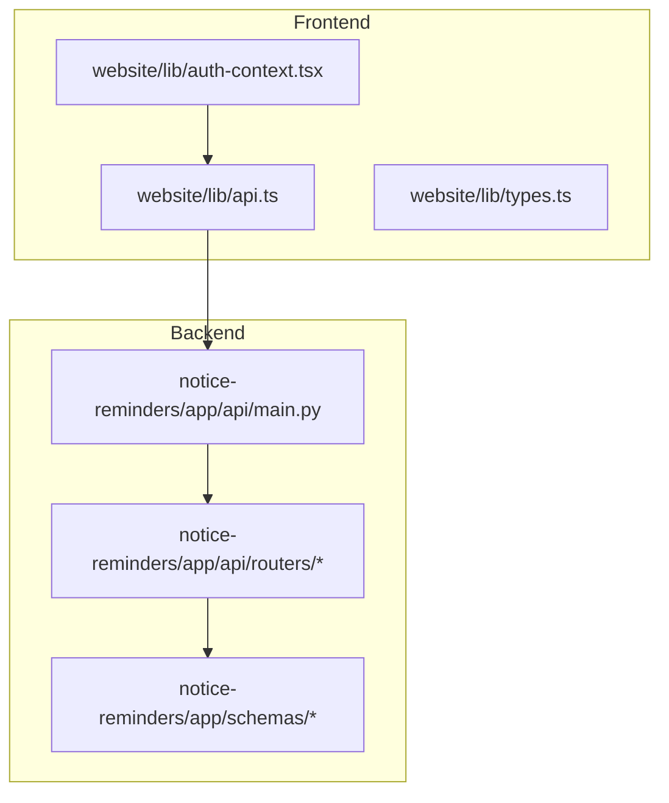
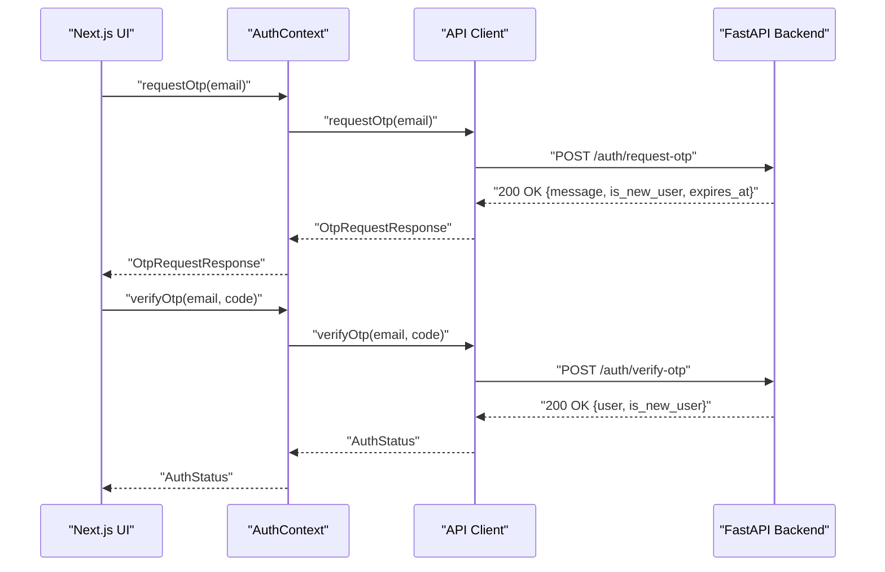
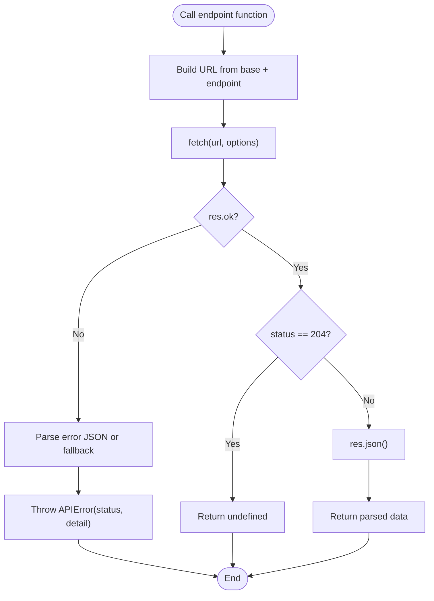
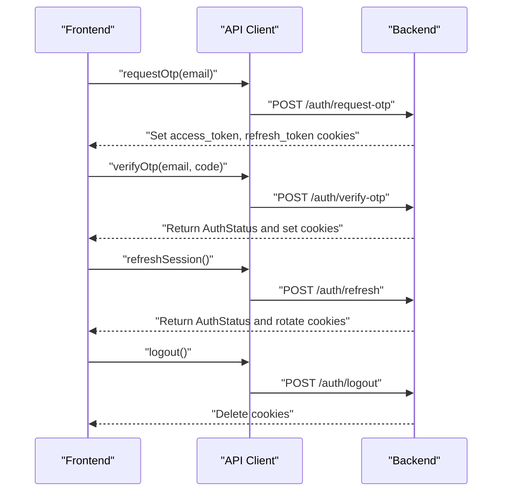
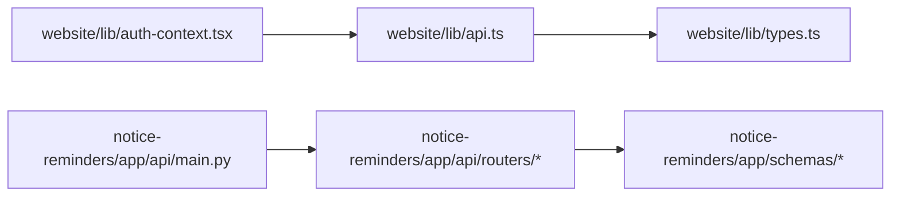

# API integration

## Introduction
This page describes the API integration layer that connects the Next.js frontend to the Notice Reminders backend. It explains the API client implementation, request/response handling, error management, TypeScript interfaces, data transformation patterns, authentication flow, and endpoint specifications. It also outlines strategies for rate limiting, retries, and offline handling to improve user experience.

## Project structure
The integration spans two primary areas:
- Frontend API client and types: located under website/lib
- Backend API routers and schemas: located under notice-reminders/app/api/routers and notice-reminders/app/schemas

```mermaid
graph TB
subgraph "Frontend"
FE_API["website/lib/api.ts"]
FE_TYPES["website/lib/types.ts"]
FE_AUTH["website/lib/auth-context.tsx"]
end
subgraph "Backend"
BE_MAIN["notice-reminders/app/api/main.py"]
BE_ROUTERS["notice-reminders/app/api/routers/*"]
BE_SCHEMAS["notice-reminders/app/schemas/*"]
end
FE_API --> BE_MAIN
FE_AUTH --> FE_API
BE_MAIN --> BE_ROUTERS
BE_ROUTERS --> BE_SCHEMAS
```

## Core components
- API client: centralized request wrapper with consistent headers, credentials, and error handling.
- Endpoint functions: typed wrappers for each backend route.
- TypeScript interfaces: strict data contracts mirroring backend schemas.
- Authentication context: OTP-based session lifecycle and cookie-based auth propagation.
- Backend routers: FastAPI endpoints implementing CRUD and orchestration.

Key responsibilities:
- API client enforces JSON content type, includes credentials, and normalizes errors.
- Endpoint functions encapsulate URL construction, HTTP verbs, and body serialization.
- Types define request/response shapes and guard against runtime mismatches.
- Auth context manages session hydration, OTP requests/verification, refresh, and logout.
- Backend routers validate inputs, enforce permissions, and return Pydantic models.

## Architecture overview
The frontend communicates with the backend via HTTPS endpoints. The backend uses cookies for session management and CORS for cross-origin support. The frontend's API client centralizes request configuration and error handling.

```mermaid
sequenceDiagram
participant UI as "Next.js UI"
participant AuthCtx as "AuthContext"
participant APIClient as "API Client"
participant Backend as "FastAPI Backend"
UI->>AuthCtx : "requestOtp(email)"
AuthCtx->>APIClient : "requestOtp(email)"
APIClient->>Backend : "POST /auth/request-otp"
Backend-->>APIClient : "200 OK {message, is_new_user, expires_at}"
APIClient-->>AuthCtx : "OtpRequestResponse"
AuthCtx-->>UI : "OtpRequestResponse"
UI->>AuthCtx : "verifyOtp(email, code)"
AuthCtx->>APIClient : "verifyOtp(email, code)"
APIClient->>Backend : "POST /auth/verify-otp"
Backend-->>APIClient : "200 OK {user, is_new_user}"
APIClient-->>AuthCtx : "AuthStatus"
AuthCtx-->>UI : "AuthStatus"
```

## Detailed component analysis

### API client implementation
The API client defines a generic request function and typed endpoint functions. It:
- Sets base URL from environment.
- Sends credentials with each request.
- Enforces JSON content type.
- Parses successful responses and handles 204 No Content.
- Converts non-OK responses into a structured APIError with status and message.

```mermaid
flowchart TD
Start(["Call endpoint function"]) --> BuildURL["Build URL from base + endpoint"]
BuildURL --> Fetch["fetch(url, options)"]
Fetch --> Ok{"res.ok?"}
Ok --> |No| ParseErr["Parse error JSON or fallback"]
ParseErr --> ThrowErr["Throw APIError(status, detail)"]
Ok --> |Yes| NoContent{"status == 204?"}
NoContent --> |Yes| ReturnUndef["Return undefined"]
NoContent --> |No| ParseJSON["res.json()"]
ParseJSON --> ReturnData["Return parsed data"]
ThrowErr --> End(["End"])
ReturnUndef --> End
ReturnData --> End
```

### Request/Response handling and error management
- Successful responses are parsed as JSON; 204 returns undefined.
- Non-OK responses trigger APIError with status and detail.
- The client does not implement retries or exponential backoff; these can be added at call sites if needed.

Recommendations:
- Add retry logic with jitter for transient failures.
- Implement rate-limit-aware backoff and queueing.
- Surface user-friendly messages while preserving error details.

### TypeScript interfaces and data transformation
Frontend types mirror backend schemas. The backend validates and serializes responses using Pydantic models. The frontend consumes these as strongly typed interfaces.

```mermaid
classDiagram
class User {
+number id
+string email
+string name
+string telegram_id
+boolean is_active
+string created_at
+string updated_at
}
class UserUpdate {
+string email
+string name
+string telegram_id
+boolean is_active
}
class Course {
+number id
+string code
+string title
+string url
+string instructor
+string institute
+string nc_code
+string created_at
+string updated_at
}
class Subscription {
+number id
+number user_id
+number course_id
+boolean is_active
+string created_at
}
class SubscriptionCreate {
+string course_code
}
class NotificationChannel {
+number id
+number user_id
+string channel
+string address
+boolean is_active
+string created_at
}
class NotificationChannelCreate {
+string channel
+string address
+boolean is_active
}
class OtpRequestResponse {
+string message
+boolean is_new_user
+string expires_at
}
class AuthStatus {
+User user
+boolean is_new_user
}
class Announcement {
+number id
+number course_id
+string title
+string date
+string content
+string fetched_at
}
class Notification {
+number id
+number user_id
+number subscription_id
+number announcement_id
+number channel_id
+boolean is_read
+string sent_at
}
```

### Authentication headers and session cookies
- The API client sends credentials with each request, enabling cookie-based session handling.
- Backend sets HttpOnly, SameSite lax cookies for access and refresh tokens.
- The frontend relies on the backend to manage session state via cookies.

```mermaid
sequenceDiagram
participant FE as "Frontend"
participant API as "API Client"
participant BE as "Backend"
FE->>API : "requestOtp(email)"
API->>BE : "POST /auth/request-otp"
BE-->>FE : "Set access_token, refresh_token cookies"
FE->>API : "verifyOtp(email, code)"
API->>BE : "POST /auth/verify-otp"
BE-->>FE : "Return AuthStatus and set cookies"
FE->>API : "refreshSession()"
API->>BE : "POST /auth/refresh"
BE-->>FE : "Return AuthStatus and rotate cookies"
FE->>API : "logout()"
API->>BE : "POST /auth/logout"
BE-->>FE : "Delete cookies"
```

### Request interceptors and response parsing
- Interceptor pattern: a single request wrapper applies headers and credentials uniformly.
- Response parsing: JSON parsing with 204 handling; errors normalized into APIError.

Enhancements:
- Add request/response logging for debugging.
- Introduce a thin interceptor layer around fetch to centralize retry/backoff and rate-limit handling.

### API endpoint specifications
Below are the endpoint groups and their functions exposed by the frontend client and implemented by the backend.

- Users
  - GET /users/{user_id}
  - PATCH /users/{user_id}
  - DELETE /users/{user_id}
  - POST /users/{user_id}/channels
  - GET /users/{user_id}/channels

- Auth
  - POST /auth/request-otp
  - POST /auth/verify-otp
  - POST /auth/refresh
  - POST /auth/logout
  - GET /auth/me

- Courses
  - GET /courses
  - GET /courses/{course_code}

- Search
  - GET /search?q={query}

- Announcements
  - GET /courses/{course_code}/announcements

- Subscriptions
  - POST /subscriptions
  - GET /subscriptions
  - DELETE /subscriptions/{subscription_id}

- Notifications
  - GET /notifications
  - GET /notifications/users/{user_id}
  - PATCH /notifications/{notification_id}/read

Note: All endpoints are protected by authentication where indicated. The frontend client wraps these in typed functions.

### Parameter validation and error boundary handling
- Backend validation:
  - Pydantic models validate incoming payloads (e.g., email format, required fields).
  - Route-level checks enforce ownership and existence (e.g., 403 for unauthorized access, 404 for missing resources).
- Frontend error boundaries:
  - APIError carries status and message; wrap calls in try/catch and surface user-friendly messages.
  - Consider adding global error handlers to unify toast/snackbar notifications.

### Rate limiting, retry logic, and offline handling
Current client behavior:
- No built-in rate-limit awareness or retry logic.
- Uses standard fetch with credentials and JSON.

Recommended enhancements:
- Rate limiting:
  - Track recent request counts per time window.
  - Back off on 429 responses; parse Retry-After header if present.
- Retry logic:
  - Retry transient network errors and 5xx responses with exponential backoff and jitter.
  - Idempotency keys for idempotent operations.
- Offline handling:
  - Queue requests when offline; replay on reconnect.
  - Use service workers or local storage to persist pending mutations.
  - Show optimistic updates with rollback on failure.

[No sources needed since this section provides general guidance]

## Dependency analysis
The frontend API client depends on:
- Environment variable for base URL.
- Typed interfaces for request/response shapes.
- Auth context for session lifecycle.

The backend depends on:
- Pydantic schemas for validation.
- FastAPI routers for routing and dependency injection.
- Cookie-based auth for session management.

```mermaid
graph LR
FE_API["website/lib/api.ts"] --> FE_TYPES["website/lib/types.ts"]
FE_AUTH["website/lib/auth-context.tsx"] --> FE_API
BE_MAIN["notice-reminders/app/api/main.py"] --> BE_ROUTERS["notice-reminders/app/api/routers/*"]
BE_ROUTERS --> BE_SCHEMAS["notice-reminders/app/schemas/*"]
```

## Performance considerations
- Minimize redundant requests by coalescing frequent reads (e.g., deduplicate search queries).
- Paginate long lists (notifications, subscriptions) to reduce payload sizes.
- Cache immutable data (courses) locally with expiry to reduce network usage.
- Use background refetch strategies to keep data fresh without blocking UI.

[No sources needed since this section provides general guidance]

## Troubleshooting guide
Common issues and resolutions:
- Authentication failures:
  - Verify cookies are being sent; ensure SameSite/Lax compatibility.
  - On 401/403, redirect to login or refresh session.
- Network errors:
  - Wrap API calls in try/catch; display user-friendly messages.
  - Implement retry with backoff for transient failures.
- Backend validation errors:
  - Inspect APIError status and message; show specific field errors when available.
- CORS issues:
  - Confirm backend allows frontend origin and credentials.

## Conclusion
The frontend API integration layer provides a clean, typed interface to the Notice Reminders backend. It centralizes request configuration, enforces authentication via cookies, and normalizes errors. Extending the client with retry/backoff, rate-limit awareness, and offline handling will significantly improve resilience and user experience. Aligning frontend types with backend schemas ensures reliable data contracts across the stack.
