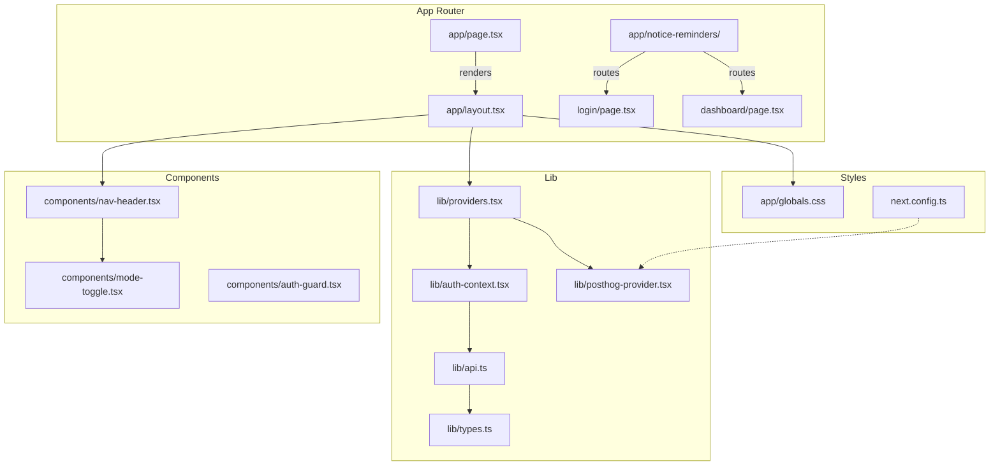
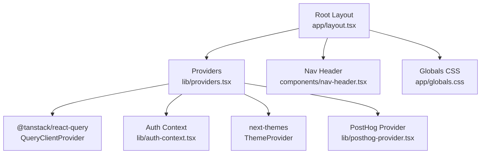
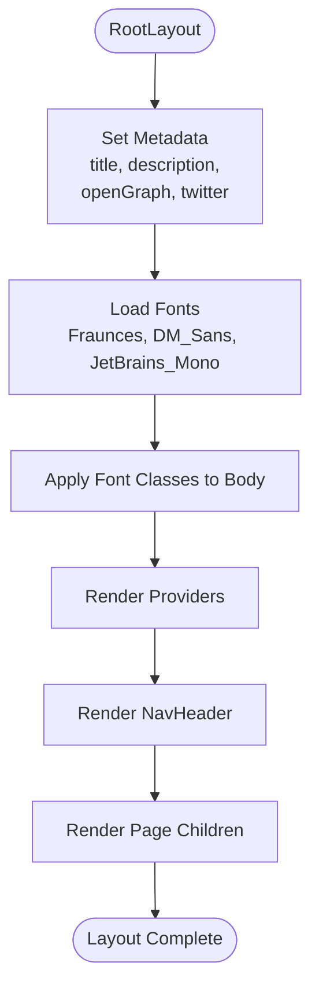
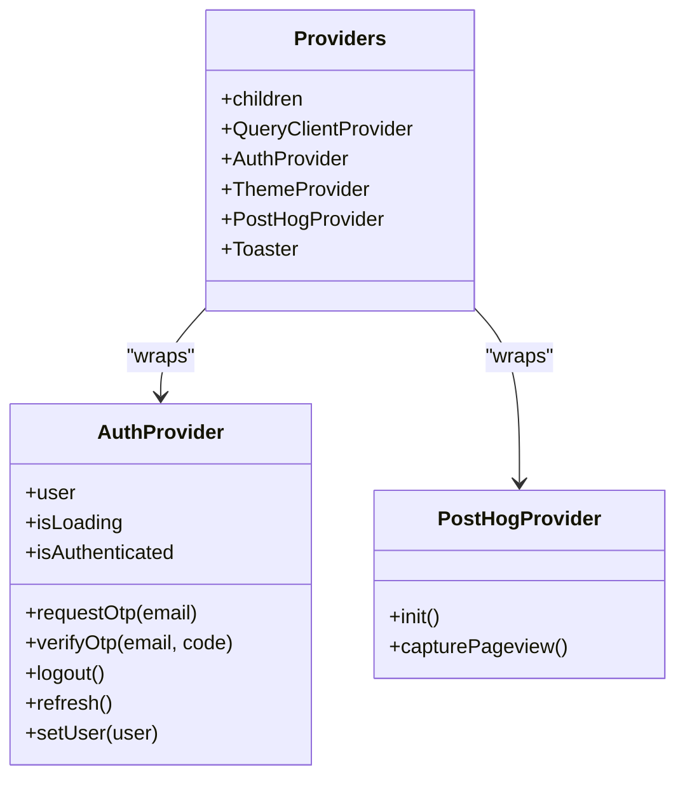
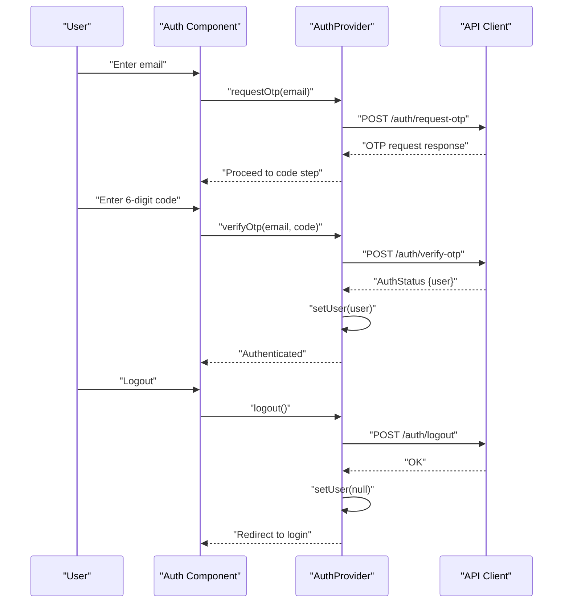
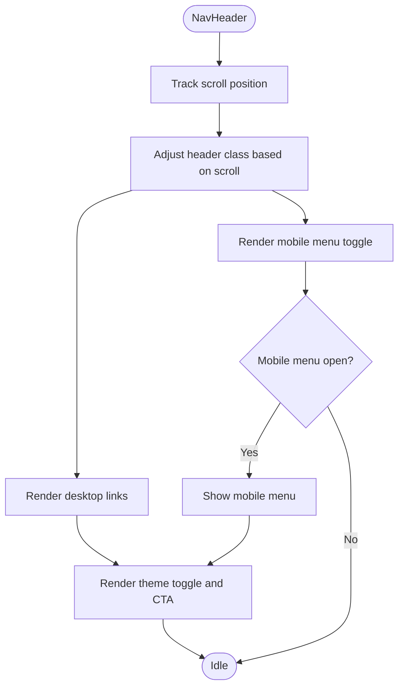
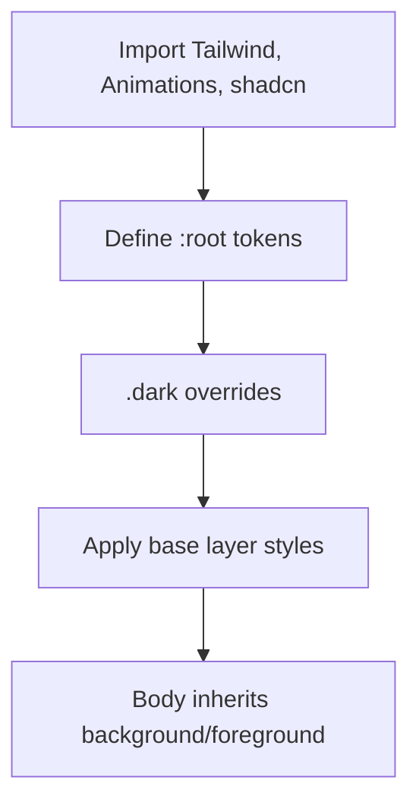
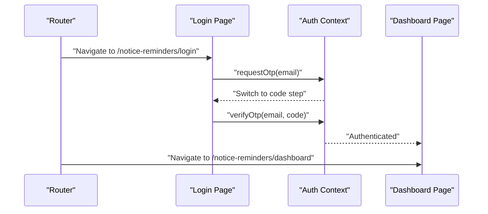
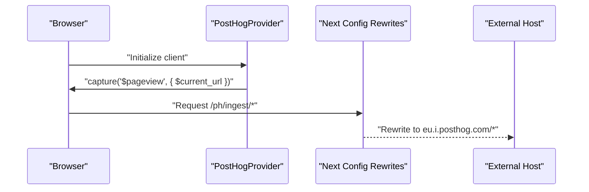
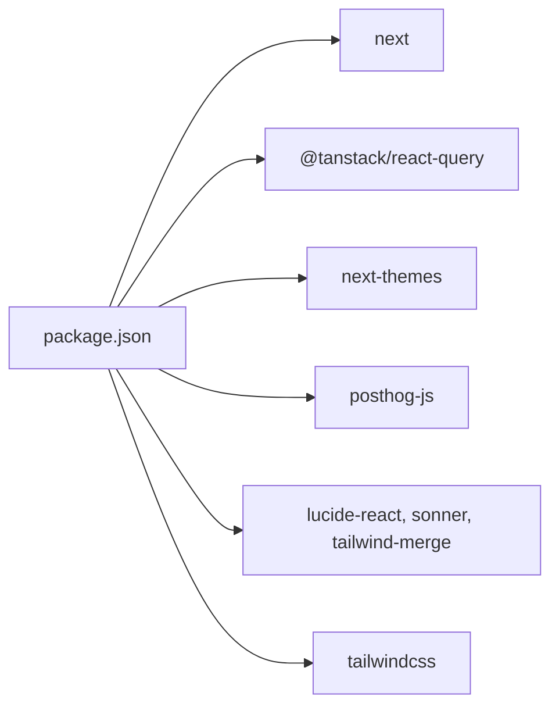

# Application Architecture

<cite>
**Referenced Files in This Document**
- [layout.tsx](file://website/app/layout.tsx)
- [page.tsx](file://website/app/page.tsx)
- [providers.tsx](file://website/lib/providers.tsx)
- [auth-context.tsx](file://website/lib/auth-context.tsx)
- [api.ts](file://website/lib/api.ts)
- [types.ts](file://website/lib/types.ts)
- [nav-header.tsx](file://website/components/nav-header.tsx)
- [mode-toggle.tsx](file://website/components/mode-toggle.tsx)
- [posthog-provider.tsx](file://website/lib/posthog-provider.tsx)
- [next.config.ts](file://website/next.config.ts)
- [globals.css](file://website/app/globals.css)
- [login/page.tsx](file://website/app/notice-reminders/login/page.tsx)
- [dashboard/page.tsx](file://website/app/notice-reminders/dashboard/page.tsx)
- [auth-guard.tsx](file://website/components/auth-guard.tsx)
- [package.json](file://website/package.json)
</cite>

## Table of Contents
1. [Introduction](#introduction)
2. [Project Structure](#project-structure)
3. [Core Components](#core-components)
4. [Architecture Overview](#architecture-overview)
5. [Detailed Component Analysis](#detailed-component-analysis)
6. [Dependency Analysis](#dependency-analysis)
7. [Performance Considerations](#performance-considerations)
8. [Troubleshooting Guide](#troubleshooting-guide)
9. [Conclusion](#conclusion)

## Introduction
This document explains the Next.js application architecture for the website module. It covers the App Router structure, root layout and metadata configuration, font loading strategy, provider system (authentication, theme, analytics), navigation header integration, global styling, component hierarchy, SSR/CSR patterns, and performance optimizations. It also details the authentication context provider setup, session management, and user state synchronization across components.

## Project Structure
The website module follows Next.js App Router conventions with a clear separation of concerns:
- Root layout defines global metadata, fonts, and providers.
- Pages define route segments and render page-specific content.
- Shared UI components encapsulate reusable elements like the navigation header and theme toggle.
- Provider modules configure cross-cutting concerns such as authentication, theming, analytics, and data fetching.

**Diagram sources**
- [layout.tsx](file://website/app/layout.tsx#L1-L99)
- [page.tsx](file://website/app/page.tsx#L1-L20)
- [providers.tsx](file://website/lib/providers.tsx#L1-L41)
- [auth-context.tsx](file://website/lib/auth-context.tsx#L1-L97)
- [api.ts](file://website/lib/api.ts#L1-L184)
- [types.ts](file://website/lib/types.ts#L1-L97)
- [nav-header.tsx](file://website/components/nav-header.tsx#L1-L139)
- [mode-toggle.tsx](file://website/components/mode-toggle.tsx#L1-L43)
- [posthog-provider.tsx](file://website/lib/posthog-provider.tsx#L1-L49)
- [next.config.ts](file://website/next.config.ts#L1-L19)
- [globals.css](file://website/app/globals.css#L1-L128)
- [login/page.tsx](file://website/app/notice-reminders/login/page.tsx#L1-L158)
- [dashboard/page.tsx](file://website/app/notice-reminders/dashboard/page.tsx#L1-L52)
- [auth-guard.tsx](file://website/components/auth-guard.tsx#L1-L28)

**Section sources**
- [layout.tsx](file://website/app/layout.tsx#L1-L99)
- [page.tsx](file://website/app/page.tsx#L1-L20)
- [providers.tsx](file://website/lib/providers.tsx#L1-L41)
- [nav-header.tsx](file://website/components/nav-header.tsx#L1-L139)
- [globals.css](file://website/app/globals.css#L1-L128)
- [next.config.ts](file://website/next.config.ts#L1-L19)

## Core Components
- Root layout and metadata: Defines global metadata, Open Graph, Twitter, and font loading via Next Font.
- Providers: Composes React Query, authentication context, theme provider, analytics provider, and toast notifications.
- Authentication context: Manages user session lifecycle, OTP-based sign-in, refresh, and logout.
- Navigation header: Provides responsive navigation with theme toggle and branding.
- Global styling: Tailwind-based design tokens with CSS custom properties and dark mode support.
- Analytics provider: PostHog integration with manual pageview tracking and rewrites for proxying ingestion.

**Section sources**
- [layout.tsx](file://website/app/layout.tsx#L28-L79)
- [layout.tsx](file://website/app/layout.tsx#L81-L99)
- [providers.tsx](file://website/lib/providers.tsx#L10-L40)
- [auth-context.tsx](file://website/lib/auth-context.tsx#L21-L87)
- [nav-header.tsx](file://website/components/nav-header.tsx#L10-L138)
- [globals.css](file://website/app/globals.css#L7-L127)
- [posthog-provider.tsx](file://website/lib/posthog-provider.tsx#L8-L28)
- [next.config.ts](file://website/next.config.ts#L4-L15)

## Architecture Overview
The application uses a layered provider pattern:
- Root layout composes Providers at the root level.
- Providers wrap the entire app tree with QueryClient, AuthProvider, ThemeProvider, PostHogProvider, and toasts.
- Pages and components consume context and hooks to access user state, theme, and analytics.

**Diagram sources**
- [layout.tsx](file://website/app/layout.tsx#L81-L99)
- [providers.tsx](file://website/lib/providers.tsx#L10-L40)
- [auth-context.tsx](file://website/lib/auth-context.tsx#L21-L87)
- [posthog-provider.tsx](file://website/lib/posthog-provider.tsx#L8-L28)
- [nav-header.tsx](file://website/components/nav-header.tsx#L10-L138)
- [globals.css](file://website/app/globals.css#L1-L128)

## Detailed Component Analysis

### Root Layout and Metadata
- Metadata configuration includes title template, description, keywords, author/publisher info, robots directives, and Open Graph/Twitter settings.
- Fonts are loaded using Next Font with variable axes and swap strategy for fast rendering.
- Root layout renders Providers, NavHeader, and page children inside a single html/body wrapper with font classes applied to the body.

**Diagram sources**
- [layout.tsx](file://website/app/layout.tsx#L28-L79)
- [layout.tsx](file://website/app/layout.tsx#L81-L99)

**Section sources**
- [layout.tsx](file://website/app/layout.tsx#L28-L79)
- [layout.tsx](file://website/app/layout.tsx#L81-L99)

### Provider System
- QueryClientProvider: Configured with a default staleTime and controlled refetch behavior.
- AuthProvider: Centralizes user session state, OTP requests, verification, logout, and session refresh.
- ThemeProvider: Uses next-themes with class-based switching and system preference support.
- PostHogProvider: Initializes PostHog client and captures pageviews on route changes.
- Toaster: Provides toast notifications for user feedback.

**Diagram sources**
- [providers.tsx](file://website/lib/providers.tsx#L10-L40)
- [auth-context.tsx](file://website/lib/auth-context.tsx#L21-L87)
- [posthog-provider.tsx](file://website/lib/posthog-provider.tsx#L8-L28)

**Section sources**
- [providers.tsx](file://website/lib/providers.tsx#L10-L40)
- [auth-context.tsx](file://website/lib/auth-context.tsx#L21-L87)
- [posthog-provider.tsx](file://website/lib/posthog-provider.tsx#L8-L28)

### Authentication Context Provider
- Session initialization: On mount, attempts to load current user profile and sets loading state accordingly.
- OTP flow: requestOtp triggers backend OTP issuance; verifyOtp exchanges code for session and updates user state.
- Logout: Clears user state and redirects to login route.
- Refresh: Periodically refreshes session and updates user state.
- Hook safety: useAuth enforces usage within AuthProvider.

**Diagram sources**
- [auth-context.tsx](file://website/lib/auth-context.tsx#L26-L64)
- [api.ts](file://website/lib/api.ts#L150-L181)

**Section sources**
- [auth-context.tsx](file://website/lib/auth-context.tsx#L21-L87)
- [api.ts](file://website/lib/api.ts#L149-L181)

### Navigation Header Integration
- Responsive design: Fixed header with scroll-aware styling, mobile menu toggle, and desktop navigation.
- Theme toggle: Integrates with next-themes to switch between light, dark, and system modes.
- Branding and actions: Includes logo, navigation links, and a call-to-action button.

**Diagram sources**
- [nav-header.tsx](file://website/components/nav-header.tsx#L10-L138)
- [mode-toggle.tsx](file://website/components/mode-toggle.tsx#L15-L42)

**Section sources**
- [nav-header.tsx](file://website/components/nav-header.tsx#L10-L138)
- [mode-toggle.tsx](file://website/components/mode-toggle.tsx#L15-L42)

### Global Styling Approach
- Tailwind v4 with custom variants and shadcn styling.
- CSS custom properties define theme tokens mapped to Tailwind variables.
- Dark mode variables adjust color palettes for contrast and readability.
- Base layer applies global borders and outlines.

**Diagram sources**
- [globals.css](file://website/app/globals.css#L1-L128)

**Section sources**
- [globals.css](file://website/app/globals.css#L1-L128)

### Login and Dashboard Pages
- Login page: Implements a two-step OTP flow with zod validation, loading states, and error messaging. Redirects authenticated users away from the login route.
- Dashboard page: Protected by AuthGuard, displays user profile, subscriptions, notifications, and logout action.

**Diagram sources**
- [login/page.tsx](file://website/app/notice-reminders/login/page.tsx#L19-L61)
- [auth-context.tsx](file://website/lib/auth-context.tsx#L41-L55)
- [dashboard/page.tsx](file://website/app/notice-reminders/dashboard/page.tsx#L13-L49)

**Section sources**
- [login/page.tsx](file://website/app/notice-reminders/login/page.tsx#L1-L158)
- [dashboard/page.tsx](file://website/app/notice-reminders/dashboard/page.tsx#L1-L52)
- [auth-guard.tsx](file://website/components/auth-guard.tsx#L8-L27)

### Analytics Provider and Rewrites
- PostHog client initialized in the browser with environment key and manual pageview capture.
- Next.js rewrites proxy PostHog ingestion endpoints to external hosts while keeping internal routing clean.

**Diagram sources**
- [posthog-provider.tsx](file://website/lib/posthog-provider.tsx#L8-L28)
- [next.config.ts](file://website/next.config.ts#L4-L15)

**Section sources**
- [posthog-provider.tsx](file://website/lib/posthog-provider.tsx#L8-L28)
- [next.config.ts](file://website/next.config.ts#L4-L15)

## Dependency Analysis
- Runtime dependencies include Next.js, React, TanStack Query, next-themes, PostHog, Tailwind, and UI primitives.
- Dev dependencies include ESLint, TypeScript, and Tailwind tooling.
- The provider stack introduces explicit coupling between auth, theming, analytics, and data fetching.

**Diagram sources**
- [package.json](file://website/package.json#L11-L26)

**Section sources**
- [package.json](file://website/package.json#L11-L26)

## Performance Considerations
- Font loading: Next Font with display swap reduces FOIT/FOUT by enabling fast system font fallback during font load.
- Hydration: Root layout uses suppressHydrationWarning to avoid mismatches when server-rendered HTML toggles theme attributes.
- Data fetching: QueryClient configured with a short staleTime and disabled refetch on window focus to balance freshness and performance.
- Analytics: Manual pageview capture avoids redundant automatic tracking and reduces overhead.
- SSR/CSR: AuthGuard renders a loader while checking authentication state, minimizing hydration jank for protected routes.

[No sources needed since this section provides general guidance]

## Troubleshooting Guide
- Authentication state not persisting:
  - Verify session cookies are included in fetch requests and backend supports credentials.
  - Check that getMe and refresh endpoints are reachable and return valid user objects.
- Theme toggle not applying:
  - Ensure next-themes is initialized and attribute is set to class.
  - Confirm CSS custom properties are defined in globals and mapped to Tailwind variables.
- Analytics events not recorded:
  - Confirm NEXT_PUBLIC_POSTHOG_KEY is set and PostHog client initializes in the browser.
  - Verify rewrites are active and external host is reachable.
- Hydration warnings:
  - Review root layout and header components for mismatched SSR/CSR content, especially around theme and dynamic content.

**Section sources**
- [api.ts](file://website/lib/api.ts#L33-L53)
- [auth-context.tsx](file://website/lib/auth-context.tsx#L26-L39)
- [posthog-provider.tsx](file://website/lib/posthog-provider.tsx#L9-L18)
- [layout.tsx](file://website/app/layout.tsx#L87-L96)

## Conclusion
The application employs a robust provider-first architecture with clear separation of concerns. The root layout centralizes metadata and fonts, while Providers compose authentication, theming, analytics, and data fetching. The authentication context manages session lifecycle and integrates with backend APIs. The navigation header and global styling provide a cohesive UX, and Next.js rewrites streamline analytics integration. Together, these patterns deliver a maintainable, performant, and user-friendly Next.js application.