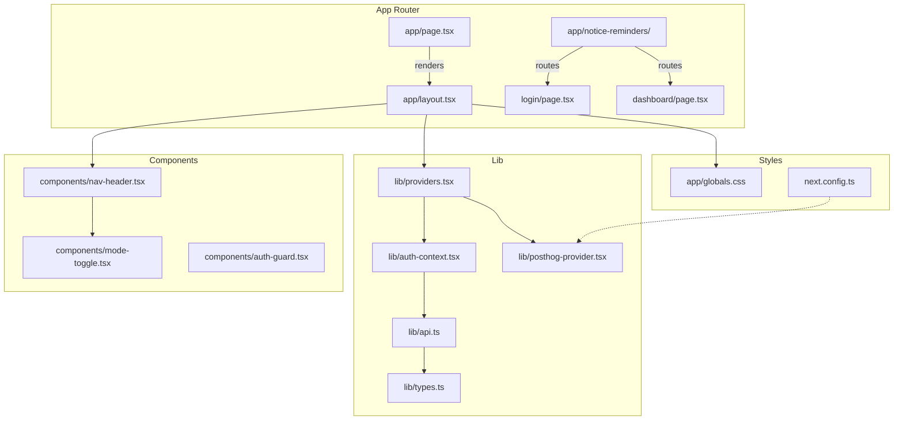
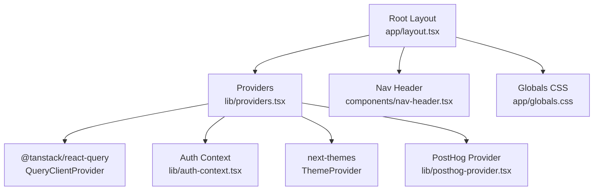
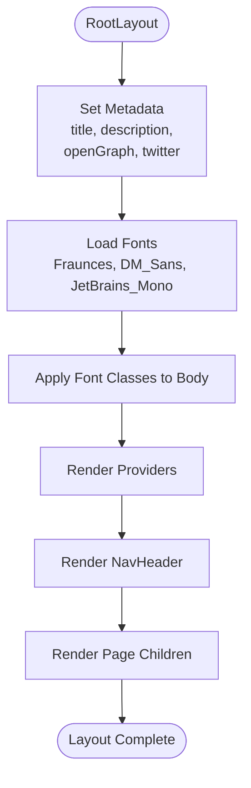
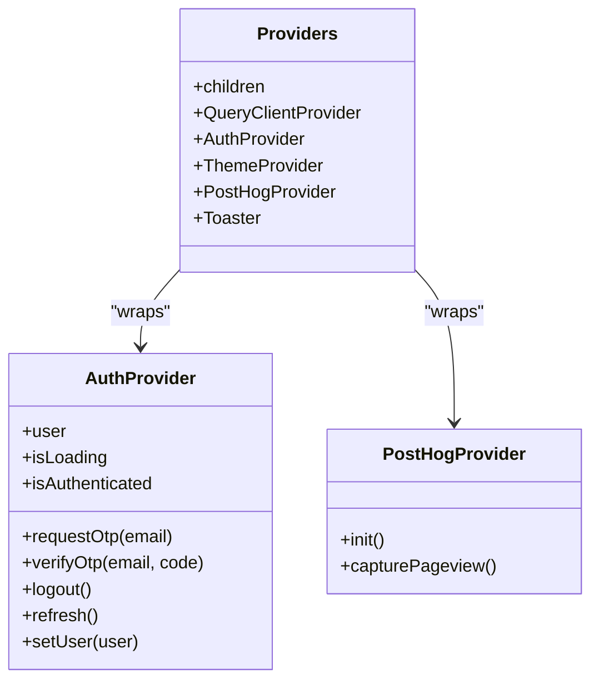
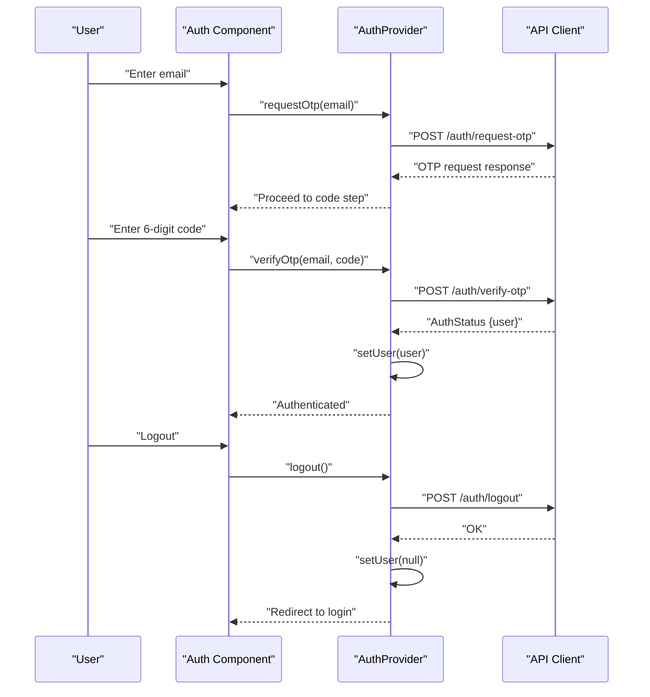
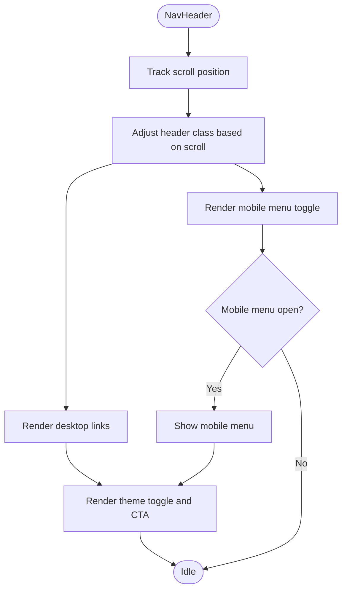
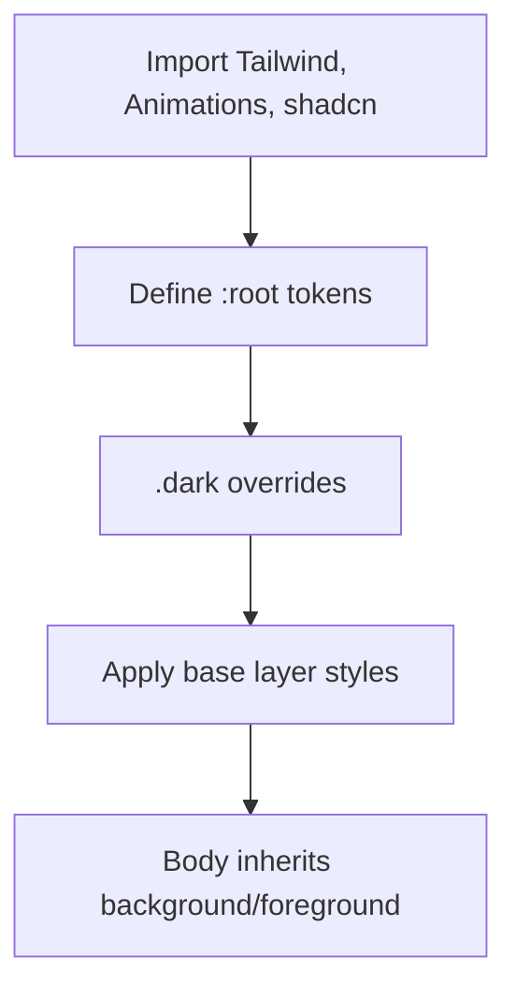
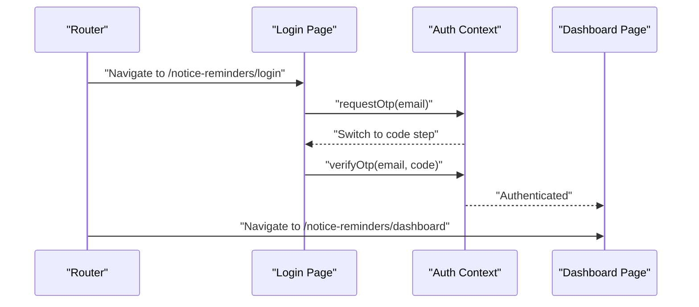
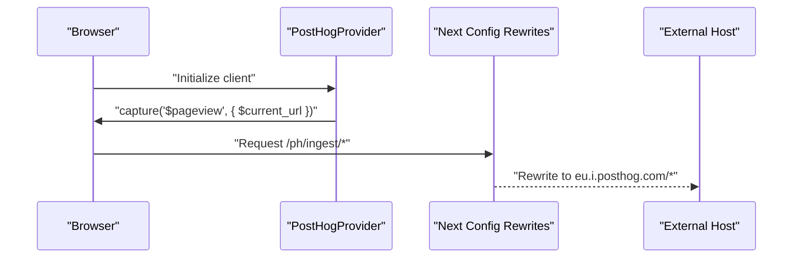
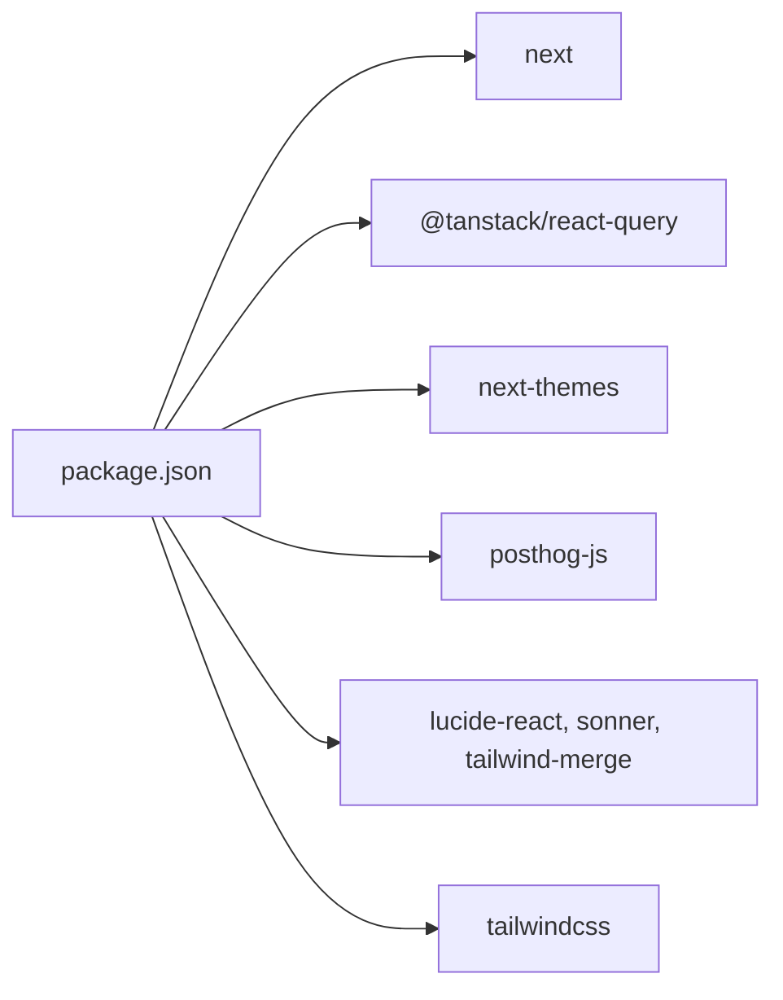

# Application architecture

## Introduction
This page explains the Next.js application architecture for the website module. It covers the App Router structure, root layout and metadata configuration, font loading strategy, provider system (authentication, theme, analytics), navigation header integration, global styling, component hierarchy, SSR/CSR patterns, and performance optimizations. It also details the authentication context provider setup, session management, and user state synchronization across components.

## Project structure
The website module follows Next.js App Router conventions with a clear separation of concerns:
- Root layout defines global metadata, fonts, and providers.
- Pages define route segments and render page-specific content.
- Shared UI components encapsulate reusable elements like the navigation header and theme toggle.
- Provider modules configure cross-cutting concerns such as authentication, theming, analytics, and data fetching.

```mermaid
graph TB
subgraph "App Router"
L["app/layout.tsx"]
P["app/page.tsx"]
S["app/notice-reminders/"]
S1["login/page.tsx"]
S2["dashboard/page.tsx"]
end
subgraph "Lib"
PR["lib/providers.tsx"]
AC["lib/auth-context.tsx"]
API["lib/api.ts"]
TP["lib/types.ts"]
PH["lib/posthog-provider.tsx"]
end
subgraph "Components"
NH["components/nav-header.tsx"]
MT["components/mode-toggle.tsx"]
AG["components/auth-guard.tsx"]
end
subgraph "Styles"
GCSS["app/globals.css"]
NC["next.config.ts"]
end
L --> PR
PR --> AC
PR --> PH
L --> NH
NH --> MT
P --> |"renders"| L
S --> |"routes"| S1
S --> |"routes"| S2
AC --> API
API --> TP
L --> GCSS
NC -.-> PH
```

## Core components
- Root layout and metadata: Defines global metadata, Open Graph, Twitter, and font loading via Next Font.
- Providers: Composes React Query, authentication context, theme provider, analytics provider, and toast notifications.
- Authentication context: Manages user session lifecycle, OTP-based sign-in, refresh, and logout.
- Navigation header: Provides responsive navigation with theme toggle and branding.
- Global styling: Tailwind-based design tokens with CSS custom properties and dark mode support.
- Analytics provider: PostHog integration with manual pageview tracking and rewrites for proxying ingestion.

## Architecture overview
The application uses a layered provider pattern:
- Root layout composes Providers at the root level.
- Providers wrap the entire app tree with QueryClient, AuthProvider, ThemeProvider, PostHogProvider, and toasts.
- Pages and components consume context and hooks to access user state, theme, and analytics.

```mermaid
graph TB
RL["Root Layout<br/>app/layout.tsx"] --> PR["Providers<br/>lib/providers.tsx"]
PR --> AQ["@tanstack/react-query<br/>QueryClientProvider"]
PR --> AU["Auth Context<br/>lib/auth-context.tsx"]
PR --> TH["next-themes<br/>ThemeProvider"]
PR --> PH["PostHog Provider<br/>lib/posthog-provider.tsx"]
RL --> NH["Nav Header<br/>components/nav-header.tsx"]
RL --> GC["Globals CSS<br/>app/globals.css"]
```

## Detailed component analysis

### Root layout and metadata
- Metadata configuration includes title template, description, keywords, author/publisher info, robots directives, and Open Graph/Twitter settings.
- Fonts are loaded using Next Font with variable axes and swap strategy for fast rendering.
- Root layout renders Providers, NavHeader, and page children inside a single html/body wrapper with font classes applied to the body.

```mermaid
flowchart TD
Start(["RootLayout"]) --> Meta["Set Metadata<br/>title, description,<br/>openGraph, twitter"]
Meta --> Fonts["Load Fonts<br/>Fraunces, DM_Sans, JetBrains_Mono"]
Fonts --> Body["Apply Font Classes to Body"]
Body --> Providers["Render Providers"]
Providers --> Header["Render NavHeader"]
Header --> Children["Render Page Children"]
Children --> End(["Layout Complete"])
```

### Provider system
- QueryClientProvider: Configured with a default staleTime and controlled refetch behavior.
- AuthProvider: Centralizes user session state, OTP requests, verification, logout, and session refresh.
- ThemeProvider: Uses next-themes with class-based switching and system preference support.
- PostHogProvider: Initializes PostHog client and captures pageviews on route changes.
- Toaster: Provides toast notifications for user feedback.

```mermaid
classDiagram
class Providers {
+children
+QueryClientProvider
+AuthProvider
+ThemeProvider
+PostHogProvider
+Toaster
}
class AuthProvider {
+user
+isLoading
+isAuthenticated
+requestOtp(email)
+verifyOtp(email, code)
+logout()
+refresh()
+setUser(user)
}
class PostHogProvider {
+init()
+capturePageview()
}
Providers --> AuthProvider : "wraps"
Providers --> PostHogProvider : "wraps"
```

### Authentication context provider
- Session initialization: On mount, attempts to load current user profile and sets loading state accordingly.
- OTP flow: requestOtp triggers backend OTP issuance; verifyOtp exchanges code for session and updates user state.
- Logout: Clears user state and redirects to login route.
- Refresh: Periodically refreshes session and updates user state.
- Hook safety: useAuth enforces usage within AuthProvider.

```mermaid
sequenceDiagram
participant U as "User"
participant C as "Auth Component"
participant A as "AuthProvider"
participant API as "API Client"
U->>C : "Enter email"
C->>A : "requestOtp(email)"
A->>API : "POST /auth/request-otp"
API-->>A : "OTP request response"
A-->>C : "Proceed to code step"
U->>C : "Enter 6-digit code"
C->>A : "verifyOtp(email, code)"
A->>API : "POST /auth/verify-otp"
API-->>A : "AuthStatus {user}"
A->>A : "setUser(user)"
A-->>C : "Authenticated"
U->>C : "Logout"
C->>A : "logout()"
A->>API : "POST /auth/logout"
API-->>A : "OK"
A->>A : "setUser(null)"
A-->>C : "Redirect to login"
```

### Navigation header integration
- Responsive design: Fixed header with scroll-aware styling, mobile menu toggle, and desktop navigation.
- Theme toggle: Integrates with next-themes to switch between light, dark, and system modes.
- Branding and actions: Includes logo, navigation links, and a call-to-action button.

```mermaid
flowchart TD
Start(["NavHeader"]) --> Scroll["Track scroll position"]
Scroll --> Style["Adjust header class based on scroll"]
Style --> Desktop["Render desktop links"]
Style --> Mobile["Render mobile menu toggle"]
Mobile --> Toggle{"Mobile menu open?"}
Toggle --> |Yes| Menu["Show mobile menu"]
Toggle --> |No| End(["Idle"])
Desktop --> Actions["Render theme toggle and CTA"]
Actions --> End
Menu --> Actions
```

### Global styling approach
- Tailwind v4 with custom variants and shadcn styling.
- CSS custom properties define theme tokens mapped to Tailwind variables.
- Dark mode variables adjust color palettes for contrast and readability.
- Base layer applies global borders and outlines.

```mermaid
flowchart TD
Import["Import Tailwind, Animations, shadcn"] --> Theme["Define :root tokens"]
Theme --> Dark[".dark overrides"]
Dark --> Layer["Apply base layer styles"]
Layer --> Body["Body inherits background/foreground"]
```

### Login and dashboard pages
- Login page: Implements a two-step OTP flow with zod validation, loading states, and error messaging. Redirects authenticated users away from the login route.
- Dashboard page: Protected by AuthGuard, displays user profile, subscriptions, notifications, and logout action.

```mermaid
sequenceDiagram
participant R as "Router"
participant L as "Login Page"
participant A as "Auth Context"
participant D as "Dashboard Page"
R->>L : "Navigate to /notice-reminders/login"
L->>A : "requestOtp(email)"
A-->>L : "Switch to code step"
L->>A : "verifyOtp(email, code)"
A-->>D : "Authenticated"
R->>D : "Navigate to /notice-reminders/dashboard"
```

### Analytics provider and rewrites
- PostHog client initialized in the browser with environment key and manual pageview capture.
- Next.js rewrites proxy PostHog ingestion endpoints to external hosts while keeping internal routing clean.

```mermaid
sequenceDiagram
participant B as "Browser"
participant PH as "PostHogProvider"
participant RW as "Next Config Rewrites"
participant EH as "External Host"
B->>PH : "Initialize client"
PH->>B : "capture('$pageview', { $current_url })"
B->>RW : "Request /ph/ingest/*"
RW-->>EH : "Rewrite to eu.i.posthog.com/*"
```

## Dependency analysis
- Runtime dependencies include Next.js, React, TanStack Query, next-themes, PostHog, Tailwind, and UI primitives.
- Dev dependencies include ESLint, TypeScript, and Tailwind tooling.
- The provider stack introduces explicit coupling between auth, theming, analytics, and data fetching.

```mermaid
graph LR
Pkg["package.json"] --> N["next"]
Pkg --> RQ["@tanstack/react-query"]
Pkg --> NT["next-themes"]
Pkg --> PH["posthog-js"]
Pkg --> UI["lucide-react, sonner, tailwind-merge"]
Pkg --> TW["tailwindcss"]
```

## Performance considerations
- Font loading: Next Font with display swap reduces FOIT/FOUT by enabling fast system font fallback during font load.
- Hydration: Root layout uses suppressHydrationWarning to avoid mismatches when server-rendered HTML toggles theme attributes.
- Data fetching: QueryClient configured with a short staleTime and disabled refetch on window focus to balance freshness and performance.
- Analytics: Manual pageview capture avoids redundant automatic tracking and reduces overhead.
- SSR/CSR: AuthGuard renders a loader while checking authentication state, minimizing hydration jank for protected routes.

[No sources needed since this section provides general guidance]

## Troubleshooting guide
- Authentication state not persisting:
  - Verify session cookies are included in fetch requests and backend supports credentials.
  - Check that getMe and refresh endpoints are reachable and return valid user objects.
- Theme toggle not applying:
  - Ensure next-themes is initialized and attribute is set to class.
  - Confirm CSS custom properties are defined in globals and mapped to Tailwind variables.
- Analytics events not recorded:
  - Confirm NEXT_PUBLIC_POSTHOG_KEY is set and PostHog client initializes in the browser.
  - Verify rewrites are active and external host is reachable.
- Hydration warnings:
  - Review root layout and header components for mismatched SSR/CSR content, especially around theme and dynamic content.

## Conclusion
The application employs a reliable provider-first architecture with clear separation of concerns. The root layout centralizes metadata and fonts, while Providers compose authentication, theming, analytics, and data fetching. The authentication context manages session lifecycle and integrates with backend APIs. The navigation header and global styling provide a cohesive UX, and Next.js rewrites streamline analytics integration. Together, these patterns deliver a maintainable, performant, and user-friendly Next.js application.
