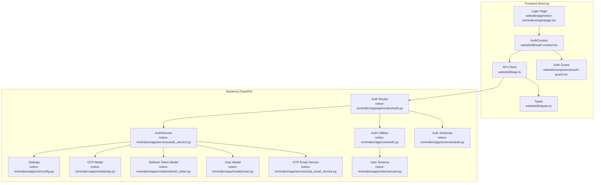
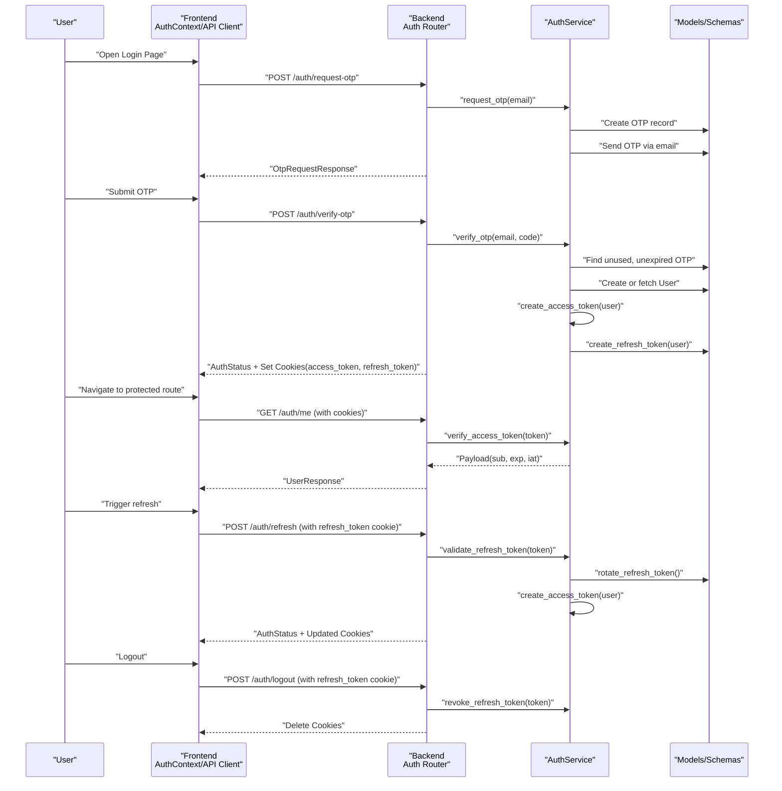
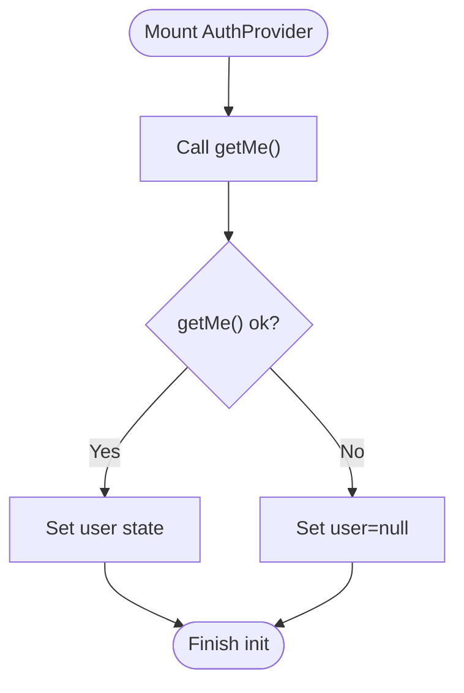
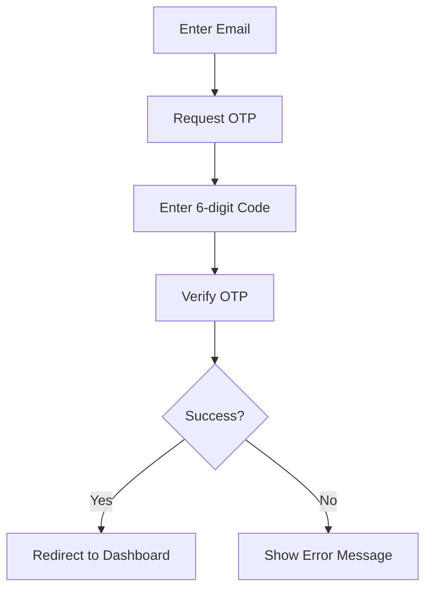
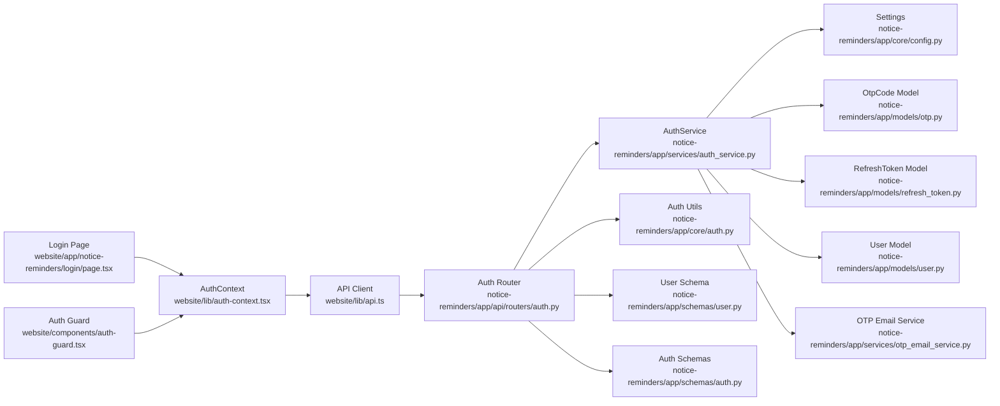

# Authentication System

<cite>
**Referenced Files in This Document**
- [auth-context.tsx](file://website/lib/auth-context.tsx)
- [api.ts](file://website/lib/api.ts)
- [auth-guard.tsx](file://website/components/auth-guard.tsx)
- [login/page.tsx](file://website/app/notice-reminders/login/page.tsx)
- [types.ts](file://website/lib/types.ts)
- [auth.py](file://notice-reminders/app/api/routers/auth.py)
- [auth.py](file://notice-reminders/app/core/auth.py)
- [auth_service.py](file://notice-reminders/app/services/auth_service.py)
- [otp.py](file://notice-reminders/app/models/otp.py)
- [refresh_token.py](file://notice-reminders/app/models/refresh_token.py)
- [user.py](file://notice-reminders/app/models/user.py)
- [auth.py](file://notice-reminders/app/schemas/auth.py)
- [user.py](file://notice-reminders/app/schemas/user.py)
- [config.py](file://notice-reminders/app/core/config.py)
- [otp_email_service.py](file://notice-reminders/app/services/otp_email_service.py)
</cite>

## Table of Contents
1. [Introduction](#introduction)
2. [Project Structure](#project-structure)
3. [Core Components](#core-components)
4. [Architecture Overview](#architecture-overview)
5. [Detailed Component Analysis](#detailed-component-analysis)
6. [Dependency Analysis](#dependency-analysis)
7. [Performance Considerations](#performance-considerations)
8. [Troubleshooting Guide](#troubleshooting-guide)
9. [Conclusion](#conclusion)
10. [Appendices](#appendices)

## Introduction
This document describes the OTP-based authentication system used by the application. It explains the authentication context implementation, session management, and user state handling. It documents the OTP login flow, JWT token management, and cookie-based authentication persistence. It also covers authentication hooks, protected route handling, and the user session lifecycle. API integration patterns for authentication endpoints, error handling strategies, and security considerations are included, along with logout functionality, token refresh mechanisms, and authentication state synchronization across the application.

## Project Structure
The authentication system spans two primary areas:
- Frontend (Next.js app): Provides the authentication context, UI flows, and protected routing.
- Backend (FastAPI service): Implements OTP generation and verification, JWT issuance, refresh token rotation, and cookie management.

**Diagram sources**
- [auth-context.tsx](file://website/lib/auth-context.tsx#L1-L97)
- [api.ts](file://website/lib/api.ts#L1-L184)
- [login/page.tsx](file://website/app/notice-reminders/login/page.tsx#L1-L158)
- [auth-guard.tsx](file://website/components/auth-guard.tsx#L1-L28)
- [types.ts](file://website/lib/types.ts#L1-L97)
- [auth.py](file://notice-reminders/app/api/routers/auth.py#L1-L126)
- [auth.py](file://notice-reminders/app/core/auth.py#L1-L72)
- [auth_service.py](file://notice-reminders/app/services/auth_service.py#L1-L128)
- [config.py](file://notice-reminders/app/core/config.py#L1-L32)
- [otp.py](file://notice-reminders/app/models/otp.py#L1-L19)
- [refresh_token.py](file://notice-reminders/app/models/refresh_token.py#L1-L23)
- [user.py](file://notice-reminders/app/models/user.py#L1-L20)
- [otp_email_service.py](file://notice-reminders/app/services/otp_email_service.py#L1-L43)
- [user.py](file://notice-reminders/app/schemas/user.py#L1-L24)
- [auth.py](file://notice-reminders/app/schemas/auth.py#L1-L26)

**Section sources**
- [auth-context.tsx](file://website/lib/auth-context.tsx#L1-L97)
- [api.ts](file://website/lib/api.ts#L1-L184)
- [auth-guard.tsx](file://website/components/auth-guard.tsx#L1-L28)
- [login/page.tsx](file://website/app/notice-reminders/login/page.tsx#L1-L158)
- [types.ts](file://website/lib/types.ts#L1-L97)
- [auth.py](file://notice-reminders/app/api/routers/auth.py#L1-L126)
- [auth.py](file://notice-reminders/app/core/auth.py#L1-L72)
- [auth_service.py](file://notice-reminders/app/services/auth_service.py#L1-L128)
- [config.py](file://notice-reminders/app/core/config.py#L1-L32)
- [otp.py](file://notice-reminders/app/models/otp.py#L1-L19)
- [refresh_token.py](file://notice-reminders/app/models/refresh_token.py#L1-L23)
- [user.py](file://notice-reminders/app/models/user.py#L1-L20)
- [otp_email_service.py](file://notice-reminders/app/services/otp_email_service.py#L1-L43)
- [user.py](file://notice-reminders/app/schemas/user.py#L1-L24)
- [auth.py](file://notice-reminders/app/schemas/auth.py#L1-L26)

## Core Components
- Authentication Context (frontend): Manages user state, loading state, OTP request/verification, logout, and session refresh. It initializes by loading the current user session on mount.
- API Client (frontend): Encapsulates HTTP requests to backend endpoints, handles credentials, and parses responses.
- Login Page (frontend): Implements the OTP-based sign-in flow with step transitions and validation.
- Auth Guard (frontend): Protects routes by redirecting unauthenticated users to the login page while handling loading states.
- Auth Router (backend): Exposes endpoints for OTP request, OTP verification, token refresh, logout, and fetching the current user.
- Auth Utilities (backend): Extracts and validates JWT access tokens from cookies for protected routes.
- AuthService (backend): Orchestrates OTP lifecycle, JWT creation/verification, refresh token creation/rotation/revoke, and user provisioning.
- Models and Schemas (backend): Define OTP codes, refresh tokens, users, and Pydantic models for request/response validation.
- Configuration (backend): Centralizes JWT, OTP, and SMTP settings.

**Section sources**
- [auth-context.tsx](file://website/lib/auth-context.tsx#L1-L97)
- [api.ts](file://website/lib/api.ts#L1-L184)
- [login/page.tsx](file://website/app/notice-reminders/login/page.tsx#L1-L158)
- [auth-guard.tsx](file://website/components/auth-guard.tsx#L1-L28)
- [auth.py](file://notice-reminders/app/api/routers/auth.py#L1-L126)
- [auth.py](file://notice-reminders/app/core/auth.py#L1-L72)
- [auth_service.py](file://notice-reminders/app/services/auth_service.py#L1-L128)
- [otp.py](file://notice-reminders/app/models/otp.py#L1-L19)
- [refresh_token.py](file://notice-reminders/app/models/refresh_token.py#L1-L23)
- [user.py](file://notice-reminders/app/models/user.py#L1-L20)
- [auth.py](file://notice-reminders/app/schemas/auth.py#L1-L26)
- [user.py](file://notice-reminders/app/schemas/user.py#L1-L24)
- [config.py](file://notice-reminders/app/core/config.py#L1-L32)

## Architecture Overview
The system uses cookie-based authentication with short-lived access tokens and long-lived refresh tokens. The frontend authenticates via OTP, receives JWT cookies, and uses them for subsequent authenticated requests. The backend validates access tokens from cookies and provides refresh and logout endpoints.

**Diagram sources**
- [auth-context.tsx](file://website/lib/auth-context.tsx#L1-L97)
- [api.ts](file://website/lib/api.ts#L1-L184)
- [auth.py](file://notice-reminders/app/api/routers/auth.py#L1-L126)
- [auth.py](file://notice-reminders/app/core/auth.py#L1-L72)
- [auth_service.py](file://notice-reminders/app/services/auth_service.py#L1-L128)
- [otp.py](file://notice-reminders/app/models/otp.py#L1-L19)
- [refresh_token.py](file://notice-reminders/app/models/refresh_token.py#L1-L23)
- [user.py](file://notice-reminders/app/models/user.py#L1-L20)
- [auth.py](file://notice-reminders/app/schemas/auth.py#L1-L26)
- [user.py](file://notice-reminders/app/schemas/user.py#L1-L24)

## Detailed Component Analysis

### Authentication Context (Frontend)
Responsibilities:
- Initialize session by fetching the current user on mount.
- Provide OTP request and verification functions.
- Manage user state, loading state, and authentication status.
- Handle logout by calling backend and resetting state.
- Refresh session by validating and updating user state.

Key behaviors:
- On mount, attempts to load the current user and sets loading state accordingly.
- OTP request delegates to the API client.
- OTP verification updates user state and returns authentication status.
- Logout clears user state and redirects to the login route.
- Refresh attempts to renew session and update user state; on failure, clears state.

**Diagram sources**
- [auth-context.tsx](file://website/lib/auth-context.tsx#L26-L39)

**Section sources**
- [auth-context.tsx](file://website/lib/auth-context.tsx#L1-L97)

### API Client (Frontend)
Responsibilities:
- Centralized HTTP client with credential inclusion for cross-site cookies.
- Unified error handling via a typed APIError.
- Specific functions for OTP request, OTP verification, session refresh, logout, and fetching current user.

Key behaviors:
- All requests include credentials to support cookie-based auth.
- Non-OK responses raise APIError with status and message.
- 204 responses are handled as no-content.

Integration patterns:
- requestOtp(email) → POST /auth/request-otp
- verifyOtp(email, code) → POST /auth/verify-otp
- refreshSession() → POST /auth/refresh
- logout() → POST /auth/logout
- getMe() → GET /auth/me

**Section sources**
- [api.ts](file://website/lib/api.ts#L1-L184)
- [types.ts](file://website/lib/types.ts#L65-L97)

### Login Page (Frontend)
Responsibilities:
- Two-step OTP flow: request OTP and verify OTP.
- Form validation for email and code.
- Navigation to dashboard upon successful authentication.
- Loading states and error messaging.

Flow:
- Enter email and submit to request OTP; transitions to code step.
- Enter six-digit code and submit to verify OTP; navigates to dashboard on success.

**Diagram sources**
- [login/page.tsx](file://website/app/notice-reminders/login/page.tsx#L37-L61)

**Section sources**
- [login/page.tsx](file://website/app/notice-reminders/login/page.tsx#L1-L158)

### Auth Guard (Frontend)
Responsibilities:
- Protect routes by checking authentication state and loading status.
- Redirect unauthenticated users to the login page.
- Render a loader while resolving authentication state.

Behavior:
- On change of loading or authentication state, enforces redirect if not authenticated.

**Section sources**
- [auth-guard.tsx](file://website/components/auth-guard.tsx#L1-L28)

### Backend Authentication Router
Endpoints:
- POST /auth/request-otp: Creates OTP record and sends code; indicates if user is new.
- POST /auth/verify-otp: Verifies OTP, creates access and refresh tokens, sets cookies.
- POST /auth/refresh: Validates refresh token, rotates it, issues new access token, updates cookies.
- POST /auth/logout: Revokes refresh token and deletes cookies.
- GET /auth/me: Returns current user after extracting access token from cookies.

Cookie policy:
- access_token: HttpOnly, SameSite=Lax, Path=/, Secure unless debug.
- refresh_token: HttpOnly, SameSite=Lax, Path=/, Secure unless debug.

**Section sources**
- [auth.py](file://notice-reminders/app/api/routers/auth.py#L1-L126)

### Access Token Validation (Backend)
- Extracts access_token from cookies.
- Raises 401 for missing token or invalid/expired payloads.
- Resolves user ID from token payload and loads user from database.

**Section sources**
- [auth.py](file://notice-reminders/app/core/auth.py#L14-L51)

### AuthService (Backend)
Responsibilities:
- OTP lifecycle: generate code, persist OTP, send via email service.
- User provisioning: create user if not exists.
- JWT lifecycle: create access token with subject, email, exp, iat; verify access token.
- Refresh token lifecycle: create refresh token, rotate (invalidate old and issue new), validate, revoke.

Security and correctness:
- OTP uniqueness per email and expiration enforcement.
- Refresh token revocation on logout and rotation on refresh.
- Strict validation of token presence and expiration.

**Section sources**
- [auth_service.py](file://notice-reminders/app/services/auth_service.py#L1-L128)

### Models and Schemas (Backend)
- User: unique email, optional profile fields, timestamps.
- OtpCode: email, code, expiration, usage flag, timestamps.
- RefreshToken: foreign key to User, unique token, expiration, revoked flag, timestamps.
- Auth schemas: OtpRequest, OtpVerify, AuthStatus, OtpRequestResponse.
- UserResponse schema for serialization.

**Section sources**
- [user.py](file://notice-reminders/app/models/user.py#L1-L20)
- [otp.py](file://notice-reminders/app/models/otp.py#L1-L19)
- [refresh_token.py](file://notice-reminders/app/models/refresh_token.py#L1-L23)
- [auth.py](file://notice-reminders/app/schemas/auth.py#L1-L26)
- [user.py](file://notice-reminders/app/schemas/user.py#L1-L24)

### Configuration (Backend)
- JWT secret and expiry windows for access and refresh tokens.
- OTP expiry window and length.
- SMTP settings for OTP delivery; console fallback.

**Section sources**
- [config.py](file://notice-reminders/app/core/config.py#L1-L32)

### OTP Delivery Service (Backend)
- Console output for development.
- SMTP transport for production with validation of required settings.

**Section sources**
- [otp_email_service.py](file://notice-reminders/app/services/otp_email_service.py#L1-L43)

## Dependency Analysis
High-level dependencies:
- Frontend depends on backend endpoints and shared types.
- Backend endpoints depend on AuthService, Tortoise ORM models, and Pydantic schemas.
- AuthService depends on configuration, email service, and models.

**Diagram sources**
- [auth-context.tsx](file://website/lib/auth-context.tsx#L1-L97)
- [api.ts](file://website/lib/api.ts#L1-L184)
- [login/page.tsx](file://website/app/notice-reminders/login/page.tsx#L1-L158)
- [auth-guard.tsx](file://website/components/auth-guard.tsx#L1-L28)
- [auth.py](file://notice-reminders/app/api/routers/auth.py#L1-L126)
- [auth.py](file://notice-reminders/app/core/auth.py#L1-L72)
- [auth_service.py](file://notice-reminders/app/services/auth_service.py#L1-L128)
- [config.py](file://notice-reminders/app/core/config.py#L1-L32)
- [otp.py](file://notice-reminders/app/models/otp.py#L1-L19)
- [refresh_token.py](file://notice-reminders/app/models/refresh_token.py#L1-L23)
- [user.py](file://notice-reminders/app/models/user.py#L1-L20)
- [otp_email_service.py](file://notice-reminders/app/services/otp_email_service.py#L1-L43)
- [user.py](file://notice-reminders/app/schemas/user.py#L1-L24)
- [auth.py](file://notice-reminders/app/schemas/auth.py#L1-L26)

**Section sources**
- [auth-context.tsx](file://website/lib/auth-context.tsx#L1-L97)
- [api.ts](file://website/lib/api.ts#L1-L184)
- [auth.py](file://notice-reminders/app/api/routers/auth.py#L1-L126)
- [auth_service.py](file://notice-reminders/app/services/auth_service.py#L1-L128)

## Performance Considerations
- Token lifetimes: Access tokens are short-lived; refresh tokens are long-lived but rotated on each refresh to limit exposure.
- OTP validity: OTPs expire quickly to reduce risk window.
- Cookie policy: HttpOnly and SameSite=Lax improve protection against XSS and CSRF; Secure flag is disabled in debug mode.
- Network efficiency: Frontend reuses a single API client with credentials; backend avoids redundant lookups by validating tokens and OTPs efficiently.
- Database queries: OTP retrieval filters by email, code, unused, and expiration; refresh token validation checks revocation and expiry.

[No sources needed since this section provides general guidance]

## Troubleshooting Guide
Common issues and resolutions:
- Missing or expired access token: Ensure cookies are present and not expired; trigger refresh if needed.
- Invalid or expired OTP: Re-request OTP; confirm delivery and expiration window.
- Refresh token errors: Missing or revoked/expired refresh token requires re-authentication.
- Logout not taking effect: Confirm cookies are deleted and refresh token is revoked.
- API errors: Inspect APIError status and message returned by the client.

Error handling patterns:
- Frontend: APIError with status and message; display user-friendly messages.
- Backend: HTTPException with appropriate status codes for missing/invalid/expired tokens and OTPs.

**Section sources**
- [api.ts](file://website/lib/api.ts#L18-L53)
- [auth.py](file://notice-reminders/app/api/routers/auth.py#L64-L75)
- [auth.py](file://notice-reminders/app/api/routers/auth.py#L85-L106)
- [auth.py](file://notice-reminders/app/api/routers/auth.py#L115-L121)
- [auth.py](file://notice-reminders/app/core/auth.py#L18-L51)

## Conclusion
The authentication system combines a robust backend with cookie-based JWT tokens and a streamlined frontend OTP flow. It emphasizes security through short-lived access tokens, refresh token rotation, OTP expiration, and strict validation. The frontend provides a clear user experience with guarded routes and centralized state management, while the backend ensures reliable session persistence and secure token lifecycle management.

[No sources needed since this section summarizes without analyzing specific files]

## Appendices

### Authentication Lifecycle Summary
- OTP Request: Generates and persists OTP; sends via configured channel.
- OTP Verification: Validates OTP, provisions user if needed, issues access and refresh tokens, sets cookies.
- Protected Routes: Access token extracted from cookies; validated before allowing access.
- Session Refresh: Validates refresh token, rotates it, issues new access token, updates cookies.
- Logout: Revokes refresh token and clears cookies.

**Section sources**
- [auth.py](file://notice-reminders/app/api/routers/auth.py#L43-L126)
- [auth.py](file://notice-reminders/app/core/auth.py#L14-L51)
- [auth_service.py](file://notice-reminders/app/services/auth_service.py#L22-L127)
- [otp_email_service.py](file://notice-reminders/app/services/otp_email_service.py#L11-L42)