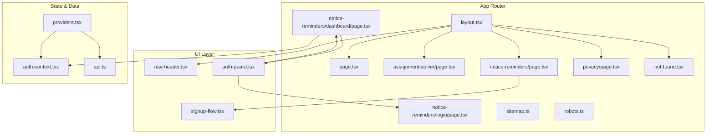
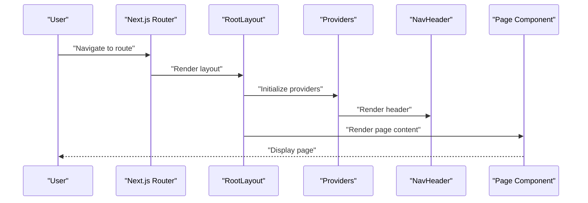
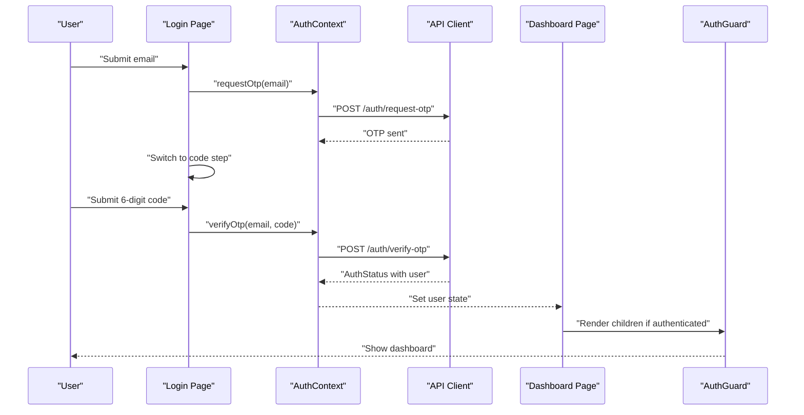
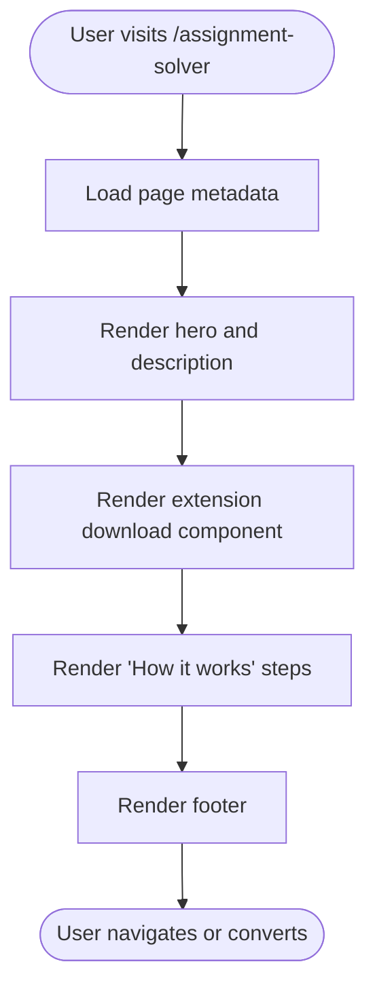
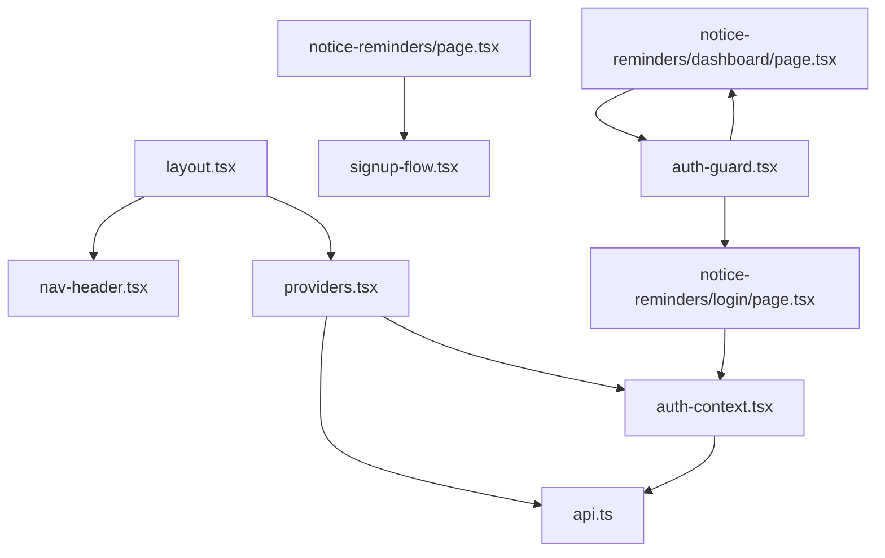

# Pages and Routing

<cite>
**Referenced Files in This Document**
- [layout.tsx](file://website/app/layout.tsx)
- [page.tsx](file://website/app/page.tsx)
- [not-found.tsx](file://website/app/not-found.tsx)
- [assignment-solver/page.tsx](file://website/app/assignment-solver/page.tsx)
- [notice-reminders/page.tsx](file://website/app/notice-reminders/page.tsx)
- [notice-reminders/dashboard/page.tsx](file://website/app/notice-reminders/dashboard/page.tsx)
- [notice-reminders/login/page.tsx](file://website/app/notice-reminders/login/page.tsx)
- [privacy/page.tsx](file://website/app/privacy/page.tsx)
- [sitemap.ts](file://website/app/sitemap.ts)
- [robots.ts](file://website/app/robots.ts)
- [auth-guard.tsx](file://website/components/auth-guard.tsx)
- [auth-context.tsx](file://website/lib/auth-context.tsx)
- [providers.tsx](file://website/lib/providers.tsx)
- [api.ts](file://website/lib/api.ts)
- [nav-header.tsx](file://website/components/nav-header.tsx)
- [signup-flow.tsx](file://website/components/notice-reminders/signup-flow.tsx)
</cite>

## Table of Contents
1. [Introduction](#introduction)
2. [Project Structure](#project-structure)
3. [Core Components](#core-components)
4. [Architecture Overview](#architecture-overview)
5. [Detailed Component Analysis](#detailed-component-analysis)
6. [Dependency Analysis](#dependency-analysis)
7. [Performance Considerations](#performance-considerations)
8. [Troubleshooting Guide](#troubleshooting-guide)
9. [Conclusion](#conclusion)
10. [Appendices](#appendices)

## Introduction
This document explains the Next.js App Router implementation and page structure for the website. It covers the routing hierarchy, page components, navigation patterns, and the notice reminders dashboard (login, dashboard, and course management). It also documents the assignment solver page and its integration with the browser extension, along with the marketing landing page, privacy policy, and sitemap generation. Route protection, dynamic routing, error handling, SEO optimization, and the 404 page implementation are addressed, including fallback routing strategies.

## Project Structure
The website uses Next.js App Router conventions under the app directory. Key pages include:
- Root marketing page
- Assignment solver landing page
- Notice reminders landing page
- Notice reminders login page
- Notice reminders dashboard page
- Privacy policy page
- Sitemap and robots generators
- Global layout and metadata
- Navigation header and providers

**Diagram sources**
- [layout.tsx](file://website/app/layout.tsx#L81-L98)
- [page.tsx](file://website/app/page.tsx#L9-L19)
- [assignment-solver/page.tsx](file://website/app/assignment-solver/page.tsx#L21-L163)
- [notice-reminders/page.tsx](file://website/app/notice-reminders/page.tsx#L4-L19)
- [notice-reminders/dashboard/page.tsx](file://website/app/notice-reminders/dashboard/page.tsx#L13-L51)
- [notice-reminders/login/page.tsx](file://website/app/notice-reminders/login/page.tsx#L19-L157)
- [privacy/page.tsx](file://website/app/privacy/page.tsx#L47-L283)
- [not-found.tsx](file://website/app/not-found.tsx#L8-L96)
- [sitemap.ts](file://website/app/sitemap.ts#L3-L37)
- [robots.ts](file://website/app/robots.ts#L3-L12)
- [nav-header.tsx](file://website/components/nav-header.tsx#L10-L138)
- [auth-guard.tsx](file://website/components/auth-guard.tsx#L8-L27)
- [auth-context.tsx](file://website/lib/auth-context.tsx#L21-L88)
- [providers.tsx](file://website/lib/providers.tsx#L10-L39)
- [api.ts](file://website/lib/api.ts#L16-L53)

**Section sources**
- [layout.tsx](file://website/app/layout.tsx#L81-L98)
- [page.tsx](file://website/app/page.tsx#L9-L19)
- [assignment-solver/page.tsx](file://website/app/assignment-solver/page.tsx#L21-L163)
- [notice-reminders/page.tsx](file://website/app/notice-reminders/page.tsx#L4-L19)
- [notice-reminders/dashboard/page.tsx](file://website/app/notice-reminders/dashboard/page.tsx#L13-L51)
- [notice-reminders/login/page.tsx](file://website/app/notice-reminders/login/page.tsx#L19-L157)
- [privacy/page.tsx](file://website/app/privacy/page.tsx#L47-L283)
- [not-found.tsx](file://website/app/not-found.tsx#L8-L96)
- [sitemap.ts](file://website/app/sitemap.ts#L3-L37)
- [robots.ts](file://website/app/robots.ts#L3-L12)
- [nav-header.tsx](file://website/components/nav-header.tsx#L10-L138)
- [auth-guard.tsx](file://website/components/auth-guard.tsx#L8-L27)
- [auth-context.tsx](file://website/lib/auth-context.tsx#L21-L88)
- [providers.tsx](file://website/lib/providers.tsx#L10-L39)
- [api.ts](file://website/lib/api.ts#L16-L53)

## Core Components
- Global layout and metadata: Defines global fonts, theme provider, navigation header, and metadata for SEO.
- Marketing landing page: Composed of Hero, Features, ProductShowcase, FAQ, and Footer components.
- Assignment solver page: Dedicated landing page with metadata, hero, benefits, steps, and footer.
- Notice reminders landing page: Onboarding flow with SignupFlow component.
- Notice reminders login page: Multi-step OTP flow with validation and navigation.
- Notice reminders dashboard page: Protected route using AuthGuard, displaying notifications, subscriptions, and user profile.
- Privacy policy page: Structured legal page with sections and metadata.
- Sitemap and robots: Programmatic generation of sitemap entries and robots directives.
- Navigation header: Responsive header with logo, links, and theme toggle.
- Authentication guard and context: Client-side auth state, loading, and redirection logic.
- Providers: React Query, theme provider, auth provider, and toast provider.
- API client: Typed fetch wrapper for backend endpoints.

**Section sources**
- [layout.tsx](file://website/app/layout.tsx#L28-L79)
- [page.tsx](file://website/app/page.tsx#L9-L19)
- [assignment-solver/page.tsx](file://website/app/assignment-solver/page.tsx#L6-L19)
- [notice-reminders/page.tsx](file://website/app/notice-reminders/page.tsx#L4-L19)
- [notice-reminders/login/page.tsx](file://website/app/notice-reminders/login/page.tsx#L19-L157)
- [notice-reminders/dashboard/page.tsx](file://website/app/notice-reminders/dashboard/page.tsx#L13-L51)
- [privacy/page.tsx](file://website/app/privacy/page.tsx#L6-L10)
- [sitemap.ts](file://website/app/sitemap.ts#L3-L37)
- [robots.ts](file://website/app/robots.ts#L3-L12)
- [nav-header.tsx](file://website/components/nav-header.tsx#L10-L138)
- [auth-guard.tsx](file://website/components/auth-guard.tsx#L8-L27)
- [auth-context.tsx](file://website/lib/auth-context.tsx#L21-L88)
- [providers.tsx](file://website/lib/providers.tsx#L10-L39)
- [api.ts](file://website/lib/api.ts#L16-L53)

## Architecture Overview
The routing follows Next.js App Router conventions with nested layouts and route segments. The global layout wraps all pages and injects providers and the navigation header. Notice reminders pages are protected by an auth guard that redirects unauthenticated users to the login page. The assignment solver page integrates with the browser extension and is optimized for SEO. The privacy page and sitemap/robots are generated programmatically.

**Diagram sources**
- [layout.tsx](file://website/app/layout.tsx#L81-L98)
- [providers.tsx](file://website/lib/providers.tsx#L10-L39)
- [nav-header.tsx](file://website/components/nav-header.tsx#L10-L138)
- [page.tsx](file://website/app/page.tsx#L9-L19)

## Detailed Component Analysis

### Routing Hierarchy and Navigation Patterns
- Root route (/): Renders the marketing landing page composed of Hero, Features, ProductShowcase, FAQ, and Footer.
- Assignment solver route (/assignment-solver): Dedicated landing page with metadata and structured sections.
- Notice reminders routes:
  - Landing (/notice-reminders): Onboarding with course search and subscription setup.
  - Login (/notice-reminders/login): Two-step OTP authentication flow.
  - Dashboard (/notice-reminders/dashboard): Protected route with notifications, subscriptions, and user profile.
- Privacy policy route (/privacy): Legal page with structured sections.
- Sitemap and robots: Generated dynamically for SEO and crawlability.

Navigation patterns:
- Global header links to the assignment solver page and displays a “Coming soon” notice for the reminders product.
- Protected routes enforce authentication via AuthGuard, redirecting to login when unauthenticated.

**Section sources**
- [page.tsx](file://website/app/page.tsx#L9-L19)
- [assignment-solver/page.tsx](file://website/app/assignment-solver/page.tsx#L21-L163)
- [notice-reminders/page.tsx](file://website/app/notice-reminders/page.tsx#L4-L19)
- [notice-reminders/login/page.tsx](file://website/app/notice-reminders/login/page.tsx#L19-L157)
- [notice-reminders/dashboard/page.tsx](file://website/app/notice-reminders/dashboard/page.tsx#L13-L51)
- [privacy/page.tsx](file://website/app/privacy/page.tsx#L47-L283)
- [sitemap.ts](file://website/app/sitemap.ts#L3-L37)
- [robots.ts](file://website/app/robots.ts#L3-L12)
- [nav-header.tsx](file://website/components/nav-header.tsx#L46-L80)

### Notice Reminders Dashboard: Login, Dashboard, and Course Management
- Login page:
  - Two-step OTP flow: email collection, code verification, and redirect to dashboard upon success.
  - Validation with Zod schemas and controlled inputs.
  - Redirects authenticated users away from the login page.
- Dashboard page:
  - Wrapped in AuthGuard to enforce authentication.
  - Displays notifications, subscriptions, and user profile.
  - Provides logout action.
- Course management:
  - SignupFlow component orchestrates course search, account setup, OTP verification, and subscription creation.
  - Uses React Query for search debouncing and mutations for OTP, channel creation, and subscriptions.
  - Supports optional Telegram and email notification channels.

**Diagram sources**
- [notice-reminders/login/page.tsx](file://website/app/notice-reminders/login/page.tsx#L19-L157)
- [auth-context.tsx](file://website/lib/auth-context.tsx#L41-L76)
- [api.ts](file://website/lib/api.ts#L150-L165)
- [notice-reminders/dashboard/page.tsx](file://website/app/notice-reminders/dashboard/page.tsx#L13-L51)
- [auth-guard.tsx](file://website/components/auth-guard.tsx#L8-L27)

**Section sources**
- [notice-reminders/login/page.tsx](file://website/app/notice-reminders/login/page.tsx#L19-L157)
- [notice-reminders/dashboard/page.tsx](file://website/app/notice-reminders/dashboard/page.tsx#L13-L51)
- [signup-flow.tsx](file://website/components/notice-reminders/signup-flow.tsx#L65-L206)
- [auth-guard.tsx](file://website/components/auth-guard.tsx#L8-L27)
- [auth-context.tsx](file://website/lib/auth-context.tsx#L21-L88)
- [api.ts](file://website/lib/api.ts#L150-L165)

### Assignment Solver Page and Browser Extension Integration
- The assignment solver page defines metadata for SEO and presents a hero, benefits, and a “How it works” section.
- The page includes an extension download component that renders the browser extension integration UI.
- The page is optimized for discoverability and conversion with clear CTAs and feature highlights.

**Diagram sources**
- [assignment-solver/page.tsx](file://website/app/assignment-solver/page.tsx#L6-L19)
- [assignment-solver/page.tsx](file://website/app/assignment-solver/page.tsx#L21-L163)

**Section sources**
- [assignment-solver/page.tsx](file://website/app/assignment-solver/page.tsx#L6-L19)
- [assignment-solver/page.tsx](file://website/app/assignment-solver/page.tsx#L21-L163)

### Marketing Landing Page
- The root page composes multiple marketing sections: Hero, ProductShowcase, Features, FAQ, and Footer.
- This structure emphasizes value proposition and conversion.

**Section sources**
- [page.tsx](file://website/app/page.tsx#L9-L19)

### Privacy Policy Page
- The privacy page defines metadata and renders structured sections with icons and data inventories.
- Includes sections covering data collection, usage, sharing, storage, rights, and contact.

**Section sources**
- [privacy/page.tsx](file://website/app/privacy/page.tsx#L6-L10)
- [privacy/page.tsx](file://website/app/privacy/page.tsx#L47-L283)

### Sitemap and Robots Generation
- Sitemap: Programmatically generates entries for the home, assignment solver, notice reminders, and privacy pages with frequency and priority.
- Robots: Defines allow/disallow rules and points to the sitemap.

**Section sources**
- [sitemap.ts](file://website/app/sitemap.ts#L3-L37)
- [robots.ts](file://website/app/robots.ts#L3-L12)

### Route Protection and Dynamic Routing
- Route protection:
  - AuthGuard checks authentication state and redirects unauthenticated users to the login page.
  - AuthProvider initializes session state and exposes authentication functions.
- Dynamic routing:
  - Notice reminders routes are nested under /notice-reminders with subpages for login and dashboard.
  - The login page uses dynamic steps (email/code) and redirects based on state.

**Section sources**
- [auth-guard.tsx](file://website/components/auth-guard.tsx#L8-L27)
- [auth-context.tsx](file://website/lib/auth-context.tsx#L21-L88)
- [notice-reminders/login/page.tsx](file://website/app/notice-reminders/login/page.tsx#L19-L157)
- [notice-reminders/dashboard/page.tsx](file://website/app/notice-reminders/dashboard/page.tsx#L13-L51)

### Error Handling and 404 Page Implementation
- Global 404 page:
  - Client component with decorative visuals and contextual links to home and assignment solver.
  - Provides helpful suggestions and links to related tools.
- Fallback routing:
  - Next.js App Router’s not-found.tsx is used for unmatched routes.
  - Combined with programmatic sitemap and robots for SEO-friendly crawlers.

**Section sources**
- [not-found.tsx](file://website/app/not-found.tsx#L8-L96)

### SEO Optimization
- Metadata:
  - Root layout sets title template, description, keywords, author, publisher, OG, Twitter, robots, and icons.
  - Individual pages override or augment metadata (e.g., assignment solver, privacy).
- Sitemap and robots:
  - Sitemap includes URLs, last modified, change frequency, and priority.
  - Robots disallows API paths and points to sitemap.

**Section sources**
- [layout.tsx](file://website/app/layout.tsx#L28-L79)
- [assignment-solver/page.tsx](file://website/app/assignment-solver/page.tsx#L6-L19)
- [privacy/page.tsx](file://website/app/privacy/page.tsx#L6-L10)
- [sitemap.ts](file://website/app/sitemap.ts#L3-L37)
- [robots.ts](file://website/app/robots.ts#L3-L12)

## Dependency Analysis
The following diagram shows key dependencies among pages, components, and providers.

**Diagram sources**
- [layout.tsx](file://website/app/layout.tsx#L81-L98)
- [nav-header.tsx](file://website/components/nav-header.tsx#L10-L138)
- [providers.tsx](file://website/lib/providers.tsx#L10-L39)
- [auth-context.tsx](file://website/lib/auth-context.tsx#L21-L88)
- [api.ts](file://website/lib/api.ts#L16-L53)
- [notice-reminders/page.tsx](file://website/app/notice-reminders/page.tsx#L4-L19)
- [signup-flow.tsx](file://website/components/notice-reminders/signup-flow.tsx#L65-L206)
- [notice-reminders/login/page.tsx](file://website/app/notice-reminders/login/page.tsx#L19-L157)
- [notice-reminders/dashboard/page.tsx](file://website/app/notice-reminders/dashboard/page.tsx#L13-L51)
- [auth-guard.tsx](file://website/components/auth-guard.tsx#L8-L27)

**Section sources**
- [layout.tsx](file://website/app/layout.tsx#L81-L98)
- [providers.tsx](file://website/lib/providers.tsx#L10-L39)
- [auth-context.tsx](file://website/lib/auth-context.tsx#L21-L88)
- [api.ts](file://website/lib/api.ts#L16-L53)
- [notice-reminders/page.tsx](file://website/app/notice-reminders/page.tsx#L4-L19)
- [signup-flow.tsx](file://website/components/notice-reminders/signup-flow.tsx#L65-L206)
- [notice-reminders/login/page.tsx](file://website/app/notice-reminders/login/page.tsx#L19-L157)
- [notice-reminders/dashboard/page.tsx](file://website/app/notice-reminders/dashboard/page.tsx#L13-L51)
- [auth-guard.tsx](file://website/components/auth-guard.tsx#L8-L27)

## Performance Considerations
- Client-side hydration and theme switching are handled efficiently via providers.
- Debounced search in the notice reminders signup flow reduces unnecessary API calls.
- React Query defaults minimize refetch overhead while keeping data fresh.
- Static metadata and programmatic sitemap/robots improve SEO and reduce server load.

[No sources needed since this section provides general guidance]

## Troubleshooting Guide
Common issues and resolutions:
- Authentication loops:
  - Ensure AuthGuard and AuthProvider are both rendered by the layout and that session initialization completes before navigation.
- OTP flow errors:
  - Validate email and code inputs with Zod schemas and surface API errors from OTP requests/verification.
- Protected route access:
  - Confirm AuthGuard runs before rendering dashboard content and that redirects occur on unauthenticated state.
- API connectivity:
  - Verify NEXT_PUBLIC_API_URL is set and that credentials include cookies for authenticated endpoints.

**Section sources**
- [auth-guard.tsx](file://website/components/auth-guard.tsx#L8-L27)
- [auth-context.tsx](file://website/lib/auth-context.tsx#L26-L35)
- [notice-reminders/login/page.tsx](file://website/app/notice-reminders/login/page.tsx#L37-L61)
- [api.ts](file://website/lib/api.ts#L16-L53)

## Conclusion
The Next.js App Router implementation organizes the website into clear, SEO-friendly pages with robust navigation and state management. The notice reminders feature employs a secure, multi-step login flow and protected routes, while the assignment solver page and marketing content are optimized for engagement and conversions. Sitemap and robots generation support search engine visibility, and the global layout ensures consistent branding and UX.

[No sources needed since this section summarizes without analyzing specific files]

## Appendices
- Global metadata and fonts are configured in the root layout.
- Navigation header adapts to mobile and desktop contexts.
- Providers encapsulate state, theming, and analytics.

**Section sources**
- [layout.tsx](file://website/app/layout.tsx#L28-L79)
- [nav-header.tsx](file://website/components/nav-header.tsx#L10-L138)
- [providers.tsx](file://website/lib/providers.tsx#L10-L39)