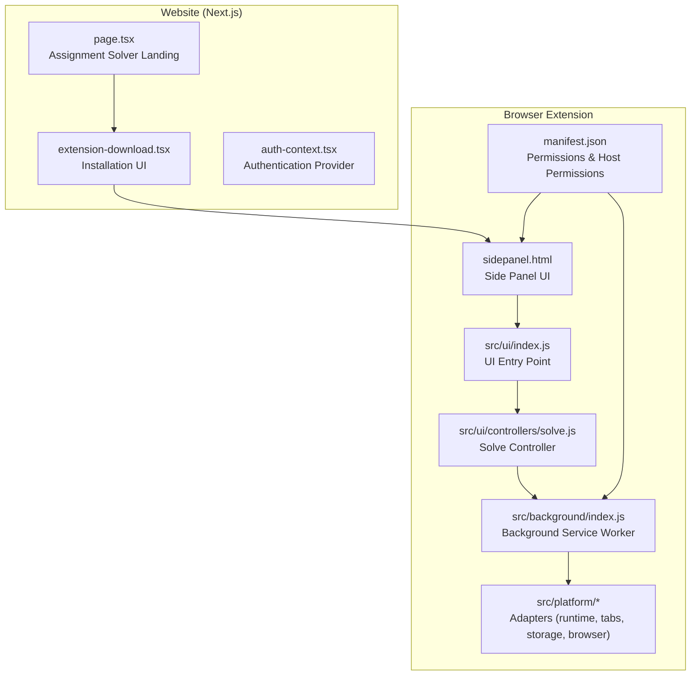
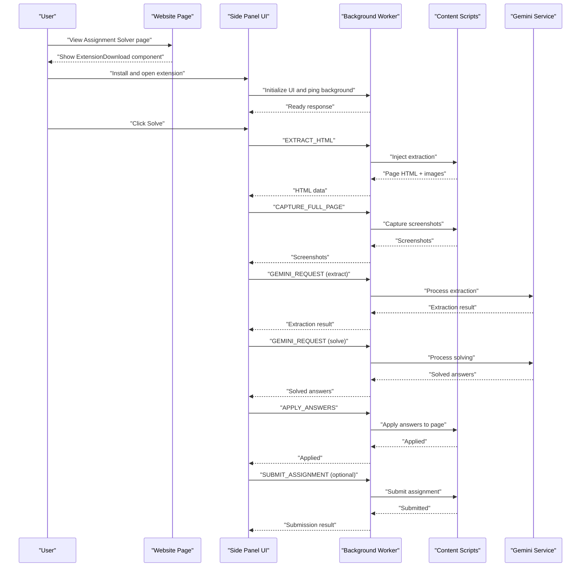
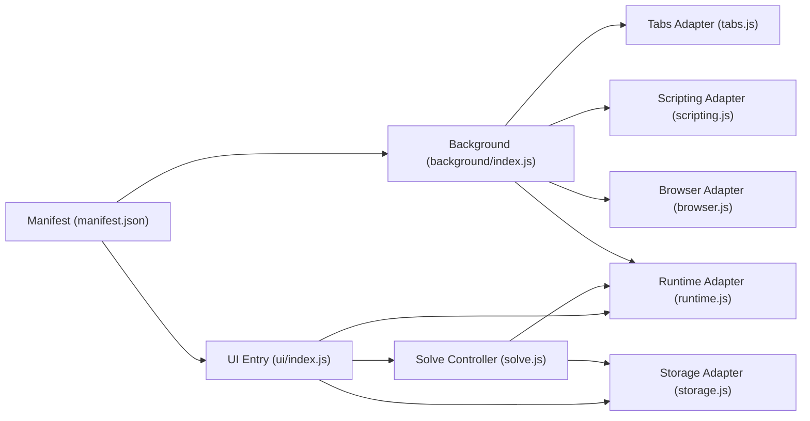

# Assignment Solver Components

<cite>
**Referenced Files in This Document**
- [extension-download.tsx](file://website/components/assignment-solver/extension-download.tsx)
- [page.tsx](file://website/app/assignment-solver/page.tsx)
- [index.js](file://website/lib/auth-context.tsx)
- [sidepanel.html](file://assignment-solver/public/sidepanel.html)
- [index.js](file://assignment-solver/src/ui/index.js)
- [solve.js](file://assignment-solver/src/ui/controllers/solve.js)
- [runtime.js](file://assignment-solver/src/platform/runtime.js)
- [storage.js](file://assignment-solver/src/platform/storage.js)
- [browser.js](file://assignment-solver/src/platform/browser.js)
- [tabs.js](file://assignment-solver/src/platform/tabs.js)
- [scripting.js](file://assignment-solver/src/platform/scripting.js)
- [index.js](file://assignment-solver/src/background/index.js)
- [manifest.json](file://assignment-solver/manifest.json)
- [manifest.config.js](file://assignment-solver/manifest.config.js)
</cite>

## Table of Contents
1. [Introduction](#introduction)
2. [Project Structure](#project-structure)
3. [Core Components](#core-components)
4. [Architecture Overview](#architecture-overview)
5. [Detailed Component Analysis](#detailed-component-analysis)
6. [Dependency Analysis](#dependency-analysis)
7. [Performance Considerations](#performance-considerations)
8. [Troubleshooting Guide](#troubleshooting-guide)
9. [Conclusion](#conclusion)

## Introduction
This document focuses on the assignment solver’s browser extension and its integration with the website’s user interface. It explains how the ExtensionDownload component guides users through installing the extension, how the extension integrates with the website’s authentication system, and how the extension coordinates with the browser to solve assignments on supported MOOC platforms. It also covers installation instructions, permissions, troubleshooting, and customization options for different deployment scenarios.

## Project Structure
The assignment solver spans two major parts:
- Website UI (Next.js): Provides the landing page and onboarding experience, including the ExtensionDownload component.
- Browser Extension (WebExtension): Provides the side panel UI, background service worker, and integration with content scripts to extract, analyze, and apply answers to assignments.

**Diagram sources**
- [page.tsx](file://website/app/assignment-solver/page.tsx#L21-L44)
- [extension-download.tsx](file://website/components/assignment-solver/extension-download.tsx#L13-L115)
- [sidepanel.html](file://assignment-solver/public/sidepanel.html#L1-L392)
- [index.js](file://assignment-solver/src/ui/index.js#L54-L112)
- [solve.js](file://assignment-solver/src/ui/controllers/solve.js#L37-L240)
- [index.js](file://assignment-solver/src/background/index.js#L30-L135)
- [runtime.js](file://assignment-solver/src/platform/runtime.js#L12-L31)
- [tabs.js](file://assignment-solver/src/platform/tabs.js#L12-L51)
- [storage.js](file://assignment-solver/src/platform/storage.js#L12-L41)
- [browser.js](file://assignment-solver/src/platform/browser.js#L22-L55)
- [manifest.json](file://assignment-solver/manifest.json#L1-L44)

**Section sources**
- [page.tsx](file://website/app/assignment-solver/page.tsx#L21-L44)
- [extension-download.tsx](file://website/components/assignment-solver/extension-download.tsx#L13-L115)
- [sidepanel.html](file://assignment-solver/public/sidepanel.html#L1-L392)
- [index.js](file://assignment-solver/src/ui/index.js#L54-L112)
- [index.js](file://assignment-solver/src/background/index.js#L30-L135)
- [manifest.json](file://assignment-solver/manifest.json#L1-L44)

## Core Components
- ExtensionDownload (Next.js UI): Renders the installation cards for Chrome Web Store and Firefox Add-ons, and provides manual installation steps for GitHub releases. It links to store URLs and GitHub releases.
- Side Panel UI (Extension): Provides the primary user controls (solve, auto-submit, settings) and displays progress and results.
- Background Service Worker: Routes messages between UI and content scripts, manages panel opening, and relays debug logs.
- Solve Controller: Orchestrates extraction, screenshot capture, AI processing, answer application, and optional auto-submit.
- Platform Adapters: Unified wrappers around browser APIs for runtime messaging, tabs, scripting, storage, and browser detection.

**Section sources**
- [extension-download.tsx](file://website/components/assignment-solver/extension-download.tsx#L13-L115)
- [sidepanel.html](file://assignment-solver/public/sidepanel.html#L64-L175)
- [index.js](file://assignment-solver/src/background/index.js#L44-L117)
- [solve.js](file://assignment-solver/src/ui/controllers/solve.js#L37-L240)
- [runtime.js](file://assignment-solver/src/platform/runtime.js#L12-L31)
- [tabs.js](file://assignment-solver/src/platform/tabs.js#L12-L51)
- [storage.js](file://assignment-solver/src/platform/storage.js#L12-L41)
- [browser.js](file://assignment-solver/src/platform/browser.js#L22-L55)

## Architecture Overview
The extension follows a message-driven architecture:
- The website’s ExtensionDownload component directs users to install the extension.
- Installed extension opens the side panel and initializes UI controllers.
- The solve controller sends messages to the background worker, which executes content scripts and interacts with AI services.
- Results are relayed back to the side panel for display.

**Diagram sources**
- [page.tsx](file://website/app/assignment-solver/page.tsx#L21-L44)
- [extension-download.tsx](file://website/components/assignment-solver/extension-download.tsx#L13-L115)
- [sidepanel.html](file://assignment-solver/public/sidepanel.html#L64-L175)
- [index.js](file://assignment-solver/src/ui/index.js#L54-L112)
- [solve.js](file://assignment-solver/src/ui/controllers/solve.js#L44-L240)
- [index.js](file://assignment-solver/src/background/index.js#L44-L117)

## Detailed Component Analysis

### ExtensionDownload Component
Role:
- Guides users to install the extension from the Chrome Web Store or Firefox Add-ons.
- Provides manual installation steps for GitHub releases, including developer mode setup for Chrome and temporary add-on loading for Firefox.

Key behaviors:
- Store cards render with availability flags (e.g., “Coming Soon” for Firefox).
- Manual installation steps include downloading releases, extracting ZIP, and loading unpacked extensions.
- Links to external resources (store URLs and GitHub releases) are opened in new tabs with appropriate security attributes.

Integration points:
- Embedded within the assignment solver landing page.
- Drives users to the extension installation flow before they can use the solve workflow.

Customization options:
- Update store URLs and release URL constants to reflect new deployments.
- Modify availability flags to reflect store readiness.

**Section sources**
- [extension-download.tsx](file://website/components/assignment-solver/extension-download.tsx#L13-L115)
- [page.tsx](file://website/app/assignment-solver/page.tsx#L21-L44)

### Side Panel UI and Solve Controller
Role:
- Presents controls for solving assignments, auto-submit, and settings.
- Manages progress steps (extract, analyze, fill, submit) and displays results.

Key behaviors:
- Initializes platform adapters and services, waits for background readiness, and wires event listeners.
- Orchestrates extraction, screenshot capture, AI processing, answer application, and optional submission.
- Handles recursive splitting for large pages/questions to avoid token limits.
- Relays debug logs to the page console via the background worker.

Browser compatibility:
- Uses unified adapters for runtime, tabs, scripting, and storage to support both Chrome and Firefox.

**Section sources**
- [sidepanel.html](file://assignment-solver/public/sidepanel.html#L64-L175)
- [index.js](file://assignment-solver/src/ui/index.js#L54-L112)
- [solve.js](file://assignment-solver/src/ui/controllers/solve.js#L44-L240)
- [runtime.js](file://assignment-solver/src/platform/runtime.js#L12-L31)
- [tabs.js](file://assignment-solver/src/platform/tabs.js#L12-L51)
- [scripting.js](file://assignment-solver/src/platform/scripting.js#L12-L26)
- [browser.js](file://assignment-solver/src/platform/browser.js#L22-L55)

### Background Service Worker
Role:
- Registers message handlers for extraction, page info, screenshots, Gemini requests, answer application, and submission.
- Opens the side panel on action click and sets panel behavior for Chrome.
- Relays debug logs to the active tab.

Initialization:
- Creates adapters and services, registers message router, and sets up action click handler.

**Section sources**
- [index.js](file://assignment-solver/src/background/index.js#L30-L135)

### Authentication Integration
Role:
- The website provides an authentication context for user sessions.
- The extension does not depend on website authentication for operation; however, the website’s auth context can be used to gate access to the assignment solver landing page and related features.

Integration:
- The extension’s side panel allows users to enter and persist a Gemini API key locally in extension storage.

**Section sources**
- [index.js](file://website/lib/auth-context.tsx#L21-L88)
- [storage.js](file://assignment-solver/src/platform/storage.js#L12-L41)
- [sidepanel.html](file://assignment-solver/public/sidepanel.html#L214-L227)

### Browser Compatibility Handling
Mechanisms:
- Unified browser API via polyfill with explicit detection for Chrome vs Firefox.
- Dynamic manifest generation supports both side_panel (Chrome) and sidebar_action (Firefox).
- Optional API checks prevent failures when certain APIs are unavailable.

**Section sources**
- [browser.js](file://assignment-solver/src/platform/browser.js#L22-L85)
- [manifest.config.js](file://assignment-solver/manifest.config.js#L14-L105)

## Dependency Analysis
The extension’s UI and background communicate via a well-defined message protocol. Platform adapters encapsulate browser differences, enabling cross-browser compatibility.

**Diagram sources**
- [index.js](file://assignment-solver/src/ui/index.js#L62-L89)
- [runtime.js](file://assignment-solver/src/platform/runtime.js#L12-L31)
- [storage.js](file://assignment-solver/src/platform/storage.js#L12-L41)
- [solve.js](file://assignment-solver/src/ui/controllers/solve.js#L21-L30)
- [index.js](file://assignment-solver/src/background/index.js#L24-L28)
- [tabs.js](file://assignment-solver/src/platform/tabs.js#L12-L51)
- [scripting.js](file://assignment-solver/src/platform/scripting.js#L12-L26)
- [browser.js](file://assignment-solver/src/platform/browser.js#L6-L16)
- [manifest.json](file://assignment-solver/manifest.json#L1-L44)

**Section sources**
- [index.js](file://assignment-solver/src/ui/index.js#L62-L89)
- [runtime.js](file://assignment-solver/src/platform/runtime.js#L12-L31)
- [storage.js](file://assignment-solver/src/platform/storage.js#L12-L41)
- [solve.js](file://assignment-solver/src/ui/controllers/solve.js#L21-L30)
- [index.js](file://assignment-solver/src/background/index.js#L24-L28)
- [tabs.js](file://assignment-solver/src/platform/tabs.js#L12-L51)
- [scripting.js](file://assignment-solver/src/platform/scripting.js#L12-L26)
- [browser.js](file://assignment-solver/src/platform/browser.js#L6-L16)
- [manifest.json](file://assignment-solver/manifest.json#L1-L44)

## Performance Considerations
- Recursive splitting: The solve controller splits large HTML or question sets to avoid token limits, reducing retries and improving reliability.
- Backoff and retry: UI initialization waits for the background worker with exponential backoff to handle timing differences (notably in Firefox).
- Batch operations: Answer application is performed incrementally with small delays to balance responsiveness and stability.
- Optional screenshots: Screenshot capture is attempted but gracefully continues without screenshots if unavailable.

[No sources needed since this section provides general guidance]

## Troubleshooting Guide
Common installation issues:
- Firefox Add-ons store not yet available: The store card indicates “Coming Soon” for Firefox; use manual installation via GitHub releases.
- Developer mode steps: Ensure Developer mode is enabled and “Load unpacked” is used for Chrome; for Firefox, use “about:debugging” and “Load Temporary Add-on”.

Manual installation steps:
- Download the latest release ZIP from GitHub releases.
- Extract the ZIP to a persistent folder.
- Load the extension per browser-specific instructions in the manual steps.

Cross-browser compatibility:
- If the side panel does not open, verify the correct panel API is used (side_panel for Chrome, sidebar_action for Firefox).
- Confirm host permissions include the relevant MOOC domains and the Gemini API endpoint.

API key and storage:
- Ensure the Gemini API key is entered in the side panel settings and persisted in extension local storage.
- If answers fail to apply, check that the content script is injected on the target domain and that the tab is pinned for message routing.

Background readiness:
- If the UI reports “Background may not be ready,” wait and retry. The UI performs ping attempts with exponential backoff.

**Section sources**
- [extension-download.tsx](file://website/components/assignment-solver/extension-download.tsx#L44-L110)
- [sidepanel.html](file://assignment-solver/public/sidepanel.html#L214-L227)
- [index.js](file://assignment-solver/src/ui/index.js#L26-L51)
- [manifest.json](file://assignment-solver/manifest.json#L7-L12)
- [manifest.config.js](file://assignment-solver/manifest.config.js#L78-L102)

## Conclusion
The ExtensionDownload component serves as the onboarding entry point for the assignment solver extension, guiding users through installation and manual setup. The extension’s side panel integrates tightly with the background worker and content scripts to deliver a seamless assignment-solving experience across supported browsers. With unified adapters and dynamic manifest generation, the extension maintains compatibility while providing robust error handling and performance optimizations.