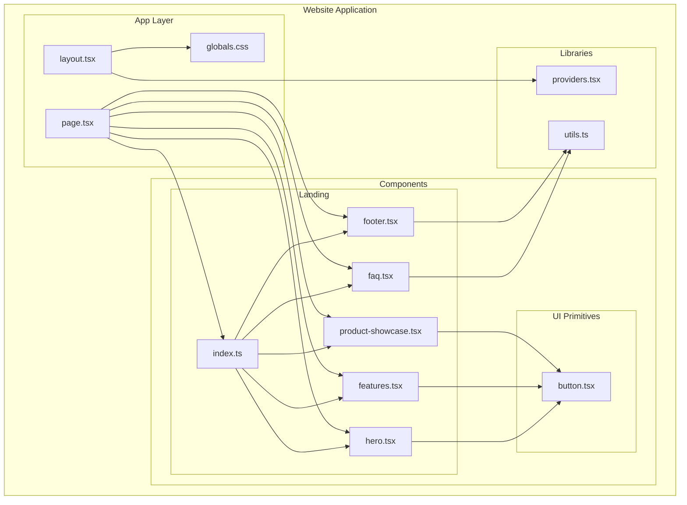
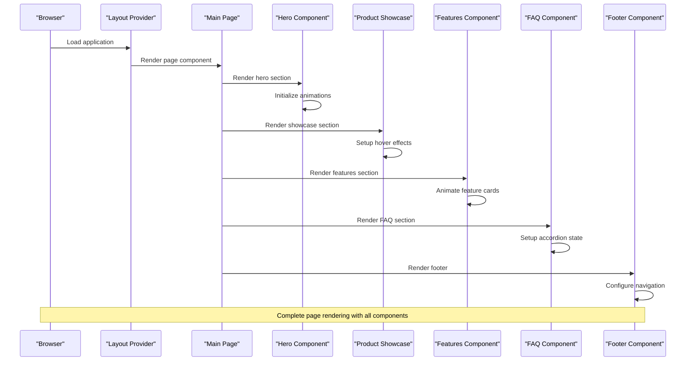
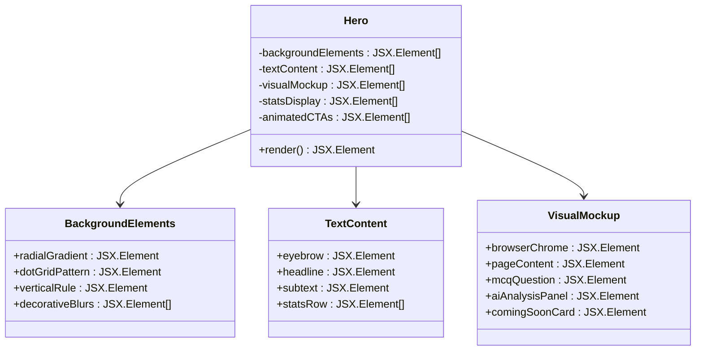
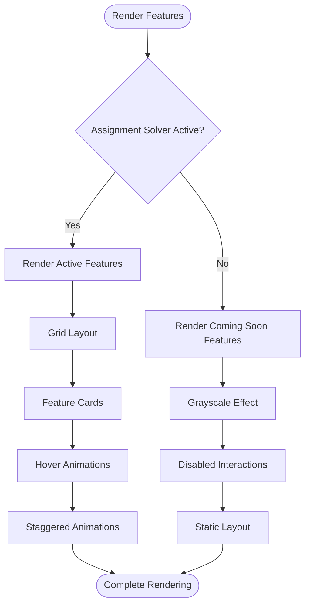
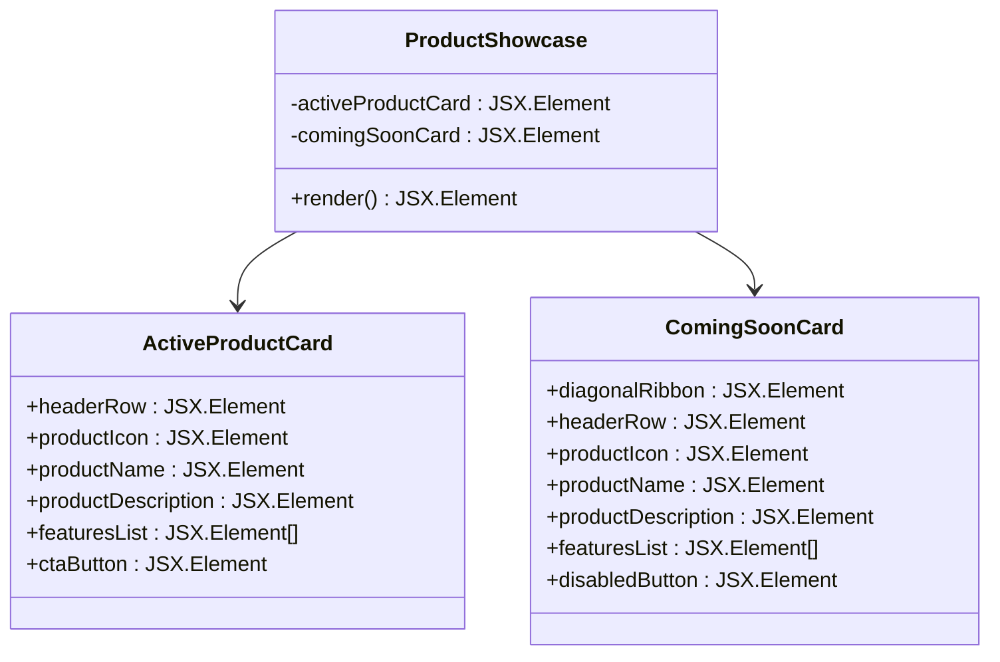
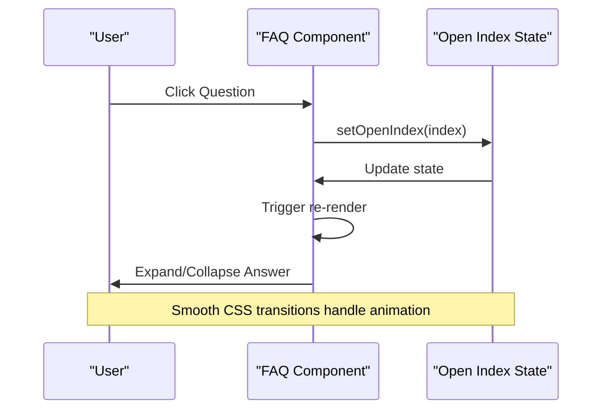
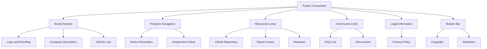
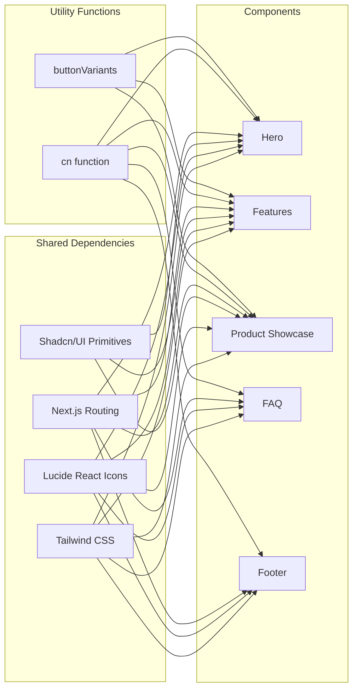

# Landing Page Components

<cite>
**Referenced Files in This Document**
- [website/app/page.tsx](file://website/app/page.tsx)
- [website/components/landing/index.ts](file://website/components/landing/index.ts)
- [website/components/landing/hero.tsx](file://website/components/landing/hero.tsx)
- [website/components/landing/features.tsx](file://website/components/landing/features.tsx)
- [website/components/landing/product-showcase.tsx](file://website/components/landing/product-showcase.tsx)
- [website/components/landing/faq.tsx](file://website/components/landing/faq.tsx)
- [website/components/landing/footer.tsx](file://website/components/landing/footer.tsx)
- [website/app/layout.tsx](file://website/app/layout.tsx)
- [website/app/globals.css](file://website/app/globals.css)
- [website/lib/providers.tsx](file://website/lib/providers.tsx)
- [website/lib/utils.ts](file://website/lib/utils.ts)
- [website/components/ui/button.tsx](file://website/components/ui/button.tsx)
- [website/app/robots.ts](file://website/app/robots.ts)
- [website/app/sitemap.ts](file://website/app/sitemap.ts)
</cite>

## Table of Contents
1. [Introduction](#introduction)
2. [Project Structure](#project-structure)
3. [Core Components](#core-components)
4. [Architecture Overview](#architecture-overview)
5. [Detailed Component Analysis](#detailed-component-analysis)
6. [Dependency Analysis](#dependency-analysis)
7. [Performance Considerations](#performance-considerations)
8. [Troubleshooting Guide](#troubleshooting-guide)
9. [Conclusion](#conclusion)

## Introduction
This document provides comprehensive documentation for the marketing landing page components that form the primary user acquisition and conversion funnel for MOOC Utils. The landing page consists of five key components: Hero, Features, ProductShowcase, FAQ, and Footer. These components work together to present a cohesive value proposition, demonstrate functionality, address user concerns, and guide visitors toward conversion actions.

The landing page follows a modern design system built with Next.js, Tailwind CSS, shadcn/ui primitives, and Lucide React icons. It emphasizes responsive design, accessibility, and SEO optimization while maintaining a consistent visual language across all components.

## Project Structure
The landing page components are organized within the website application under the components/landing directory. They are exported via a centralized index file and consumed by the main page component.

**Diagram sources**
- [website/app/page.tsx](file://website/app/page.tsx#L1-L20)
- [website/components/landing/index.ts](file://website/components/landing/index.ts#L1-L6)
- [website/components/landing/hero.tsx](file://website/components/landing/hero.tsx#L1-L283)
- [website/components/landing/features.tsx](file://website/components/landing/features.tsx#L1-L144)
- [website/components/landing/product-showcase.tsx](file://website/components/landing/product-showcase.tsx#L1-L161)
- [website/components/landing/faq.tsx](file://website/components/landing/faq.tsx#L1-L97)
- [website/components/landing/footer.tsx](file://website/components/landing/footer.tsx#L1-L166)
- [website/app/layout.tsx](file://website/app/layout.tsx#L1-L99)
- [website/app/globals.css](file://website/app/globals.css#L1-L128)
- [website/lib/providers.tsx](file://website/lib/providers.tsx#L1-L41)
- [website/lib/utils.ts](file://website/lib/utils.ts#L1-L7)
- [website/components/ui/button.tsx](file://website/components/ui/button.tsx#L1-L54)

**Section sources**
- [website/app/page.tsx](file://website/app/page.tsx#L1-L20)
- [website/components/landing/index.ts](file://website/components/landing/index.ts#L1-L6)

## Core Components
The landing page is composed of five distinct components, each serving a specific role in the user journey:

### Hero Component
The Hero component serves as the primary value proposition display, featuring:
- Full-screen hero section with animated background elements
- Dual-column layout (text + visual mockup) that adapts responsively
- Interactive download call-to-action with hover animations
- Statistics display highlighting platform achievements
- Browser mockup showcasing real assignment solving interface
- Coming-soon indicator for Notice Reminders feature

### Features Component
The Features component showcases platform capabilities through:
- Two-column feature grid (Assignment Solver active, Notice Reminders coming soon)
- Icon-based feature cards with hover effects
- Animated entrance transitions for feature cards
- Clear status indicators for feature availability
- Consistent design language with color-coded accents

### Product Showcase
The Product Showcase presents the two core tools through:
- Card-based layout with hover effects and shadow transitions
- Feature comparison between active and upcoming products
- Status indicators (Active vs. Coming Soon)
- Prominent call-to-action buttons for each product
- Visual differentiation through color schemes and accents

### FAQ Component
The FAQ component provides:
- Interactive accordion-style question-answer sections
- Smooth expand/collapse animations using CSS grid transitions
- State management for controlling open/close states
- Responsive design that works across device sizes
- Consistent styling with the overall design system

### Footer Component
The Footer provides:
- Multi-column navigation structure (Brand, Products, Resources, Community, Legal)
- Social media and GitHub integration
- Copyright and attribution information
- Consistent typography and spacing
- Accessible navigation links

**Section sources**
- [website/components/landing/hero.tsx](file://website/components/landing/hero.tsx#L1-L283)
- [website/components/landing/features.tsx](file://website/components/landing/features.tsx#L1-L144)
- [website/components/landing/product-showcase.tsx](file://website/components/landing/product-showcase.tsx#L1-L161)
- [website/components/landing/faq.tsx](file://website/components/landing/faq.tsx#L1-L97)
- [website/components/landing/footer.tsx](file://website/components/landing/footer.tsx#L1-L166)

## Architecture Overview
The landing page follows a component-based architecture with clear separation of concerns and reusable design patterns.

**Diagram sources**
- [website/app/layout.tsx](file://website/app/layout.tsx#L81-L98)
- [website/app/page.tsx](file://website/app/page.tsx#L9-L19)
- [website/components/landing/hero.tsx](file://website/components/landing/hero.tsx#L8-L283)
- [website/components/landing/product-showcase.tsx](file://website/components/landing/product-showcase.tsx#L8-L161)
- [website/components/landing/features.tsx](file://website/components/landing/features.tsx#L45-L144)
- [website/components/landing/faq.tsx](file://website/components/landing/faq.tsx#L40-L97)
- [website/components/landing/footer.tsx](file://website/components/landing/footer.tsx#L4-L166)

The architecture leverages:
- **Component Composition**: Each component is self-contained with its own styling and logic
- **Design System Integration**: Consistent use of shadcn/ui primitives and Tailwind CSS
- **Responsive Design Patterns**: Mobile-first approach with progressive enhancement
- **State Management**: Local component state for interactive elements (FAQ accordion)
- **Accessibility**: Semantic HTML and proper ARIA attributes

## Detailed Component Analysis

### Hero Component Analysis
The Hero component implements a sophisticated full-screen hero section with multiple visual and interactive elements.

**Diagram sources**
- [website/components/landing/hero.tsx](file://website/components/landing/hero.tsx#L8-L283)

Key implementation patterns:
- **CSS Grid Layout**: Responsive two-column layout using `grid` and `lg:grid-cols-[1fr_1.15fr]`
- **Animation System**: Staggered entrance animations using CSS classes and delays
- **Background Effects**: Radial gradients, dot grid patterns, and blur effects
- **Interactive Elements**: Hover animations on CTA buttons with arrow icons
- **Status Indicators**: "Coming Soon" badges with visual styling

Responsive design implementation:
- Mobile-first approach with `sm:` and `lg:` breakpoints
- Flexible typography using `clamp()` for fluid scaling
- Hidden elements on smaller screens (`hidden lg:block`)
- Animated entrance sequences with staggered timing

**Section sources**
- [website/components/landing/hero.tsx](file://website/components/landing/hero.tsx#L1-L283)

### Features Component Analysis
The Features component presents platform capabilities through a structured grid layout.

**Diagram sources**
- [website/components/landing/features.tsx](file://website/components/landing/features.tsx#L45-L144)

Implementation patterns:
- **Data-driven Content**: Feature arrays for Assignment Solver and Notice Reminders
- **Conditional Rendering**: Different treatment based on feature availability
- **Status Indicators**: Color-coded badges for feature states
- **Hover Effects**: Interactive cards with border and background transitions
- **Animation System**: Staggered entrance animations for feature cards

Content management approach:
- Features are defined as arrays of objects with icon, title, and description
- Separate arrays for active and upcoming features
- Consistent structure allows easy modification and expansion

**Section sources**
- [website/components/landing/features.tsx](file://website/components/landing/features.tsx#L1-L144)

### Product Showcase Analysis
The Product Showcase component presents the two core tools with clear visual distinction.

**Diagram sources**
- [website/components/landing/product-showcase.tsx](file://website/components/landing/product-showcase.tsx#L8-L161)

Key features:
- **Visual Hierarchy**: Clear distinction between active and upcoming products
- **Status Communication**: Diagonal ribbons and grayscale effects
- **Feature Comparison**: Side-by-side presentation of capabilities
- **Call-to-Action Focus**: Prominent buttons directing users to tools
- **Hover Interactions**: Shadow and border transitions for enhanced UX

**Section sources**
- [website/components/landing/product-showcase.tsx](file://website/components/landing/product-showcase.tsx#L1-L161)

### FAQ Component Analysis
The FAQ component implements an interactive accordion system for frequently asked questions.

**Diagram sources**
- [website/components/landing/faq.tsx](file://website/components/landing/faq.tsx#L40-L97)

Implementation details:
- **State Management**: Uses React useState hook for managing open/close state
- **CSS Grid Transitions**: `grid-rows-[1fr]` and `grid-rows-[0fr]` for smooth animations
- **Conditional Styling**: Dynamic class names based on open state
- **Accessible Interactions**: Proper button semantics and keyboard navigation
- **Responsive Design**: Works across mobile and desktop devices

**Section sources**
- [website/components/landing/faq.tsx](file://website/components/landing/faq.tsx#L1-L97)

### Footer Component Analysis
The Footer component provides comprehensive navigation and legal information.

**Diagram sources**
- [website/components/landing/footer.tsx](file://website/components/landing/footer.tsx#L4-L166)

Structure and organization:
- **Multi-column Grid**: Responsive grid layout adapting to screen size
- **Logical Grouping**: Related links grouped by category
- **Consistent Styling**: Uniform typography and spacing
- **External Links**: Proper handling of external resources with security attributes
- **Legal Compliance**: Privacy policy and copyright information

**Section sources**
- [website/components/landing/footer.tsx](file://website/components/landing/footer.tsx#L1-L166)

## Dependency Analysis
The landing page components share common dependencies and follow established patterns for consistency and maintainability.

**Diagram sources**
- [website/components/landing/hero.tsx](file://website/components/landing/hero.tsx#L3-L6)
- [website/components/landing/features.tsx](file://website/components/landing/features.tsx#L1)
- [website/components/landing/product-showcase.tsx](file://website/components/landing/product-showcase.tsx#L3-L6)
- [website/components/landing/faq.tsx](file://website/components/landing/faq.tsx#L3-L5)
- [website/components/landing/footer.tsx](file://website/components/landing/footer.tsx#L1-L2)
- [website/lib/utils.ts](file://website/lib/utils.ts#L1-L7)
- [website/components/ui/button.tsx](file://website/components/ui/button.tsx#L1-L54)

Key dependency patterns:
- **Utility Function Sharing**: All components use the `cn` function for conditional class merging
- **Design System Integration**: Consistent use of shadcn/ui button variants
- **Icon System**: Universal Lucide React icon library for visual consistency
- **Routing Integration**: Next.js Link components for seamless navigation
- **Theme System**: Shared Tailwind CSS variables and color schemes

**Section sources**
- [website/lib/utils.ts](file://website/lib/utils.ts#L1-L7)
- [website/components/ui/button.tsx](file://website/components/ui/button.tsx#L1-L54)

## Performance Considerations
The landing page components are designed with performance optimization in mind:

### Rendering Optimizations
- **Component Isolation**: Each component manages its own state and rendering logic
- **Minimal Re-renders**: Local state only affects specific component areas
- **CSS Animations**: Hardware-accelerated transitions using transform properties
- **Lazy Loading**: Images and visual elements load progressively

### Bundle Size Management
- **Tree Shaking**: Unused code eliminated through proper module exports
- **Icon Optimization**: Lucide React icons loaded as individual SVG components
- **CSS Optimization**: Tailwind CSS purged to remove unused styles
- **Image Optimization**: Next.js automatic image optimization

### Accessibility Features
- **Semantic HTML**: Proper heading hierarchy and landmark roles
- **Keyboard Navigation**: Full keyboard accessibility for interactive elements
- **Screen Reader Support**: ARIA attributes and proper labeling
- **Color Contrast**: WCAG-compliant color schemes and contrast ratios

## Troubleshooting Guide

### Common Issues and Solutions

**Component Not Rendering**
- Verify component export/import statements in the index file
- Check for proper TypeScript syntax and JSX formatting
- Ensure all required dependencies are installed

**Styling Issues**
- Confirm Tailwind CSS configuration includes the components directory
- Verify CSS custom properties are properly defined in globals.css
- Check for conflicting CSS classes or specificity issues

**Animation Problems**
- Ensure CSS animations are enabled in the browser
- Verify animation classes are properly applied
- Check for CSS transitions conflicts

**Responsive Design Issues**
- Test component layouts across different viewport sizes
- Verify breakpoint configurations match design requirements
- Check for proper mobile-first CSS declarations

**SEO Optimization**
- Verify meta tags are properly configured in layout.tsx
- Ensure robots.txt and sitemap.ts are correctly set up
- Test SEO using tools like Google Search Console

**Section sources**
- [website/app/layout.tsx](file://website/app/layout.tsx#L28-L79)
- [website/app/robots.ts](file://website/app/robots.ts#L1-L13)
- [website/app/sitemap.ts](file://website/app/sitemap.ts#L1-L38)

## Conclusion
The landing page components for MOOC Utils demonstrate a well-architected, maintainable, and performant approach to building marketing pages. The components work together to create a cohesive user experience that effectively communicates value, showcases functionality, addresses user concerns, and drives conversions.

Key strengths of the implementation include:
- **Consistent Design System**: Unified design language across all components
- **Responsive Architecture**: Mobile-first approach with progressive enhancement
- **Performance Optimization**: Carefully considered rendering and bundle management
- **Accessibility Compliance**: Comprehensive accessibility features and semantic markup
- **SEO Best Practices**: Proper metadata, structured content, and sitemap configuration

The modular component structure allows for easy maintenance, testing, and future enhancements while maintaining visual consistency and user experience quality. The integration of analytics and theme providers ensures the components operate within a complete application ecosystem.