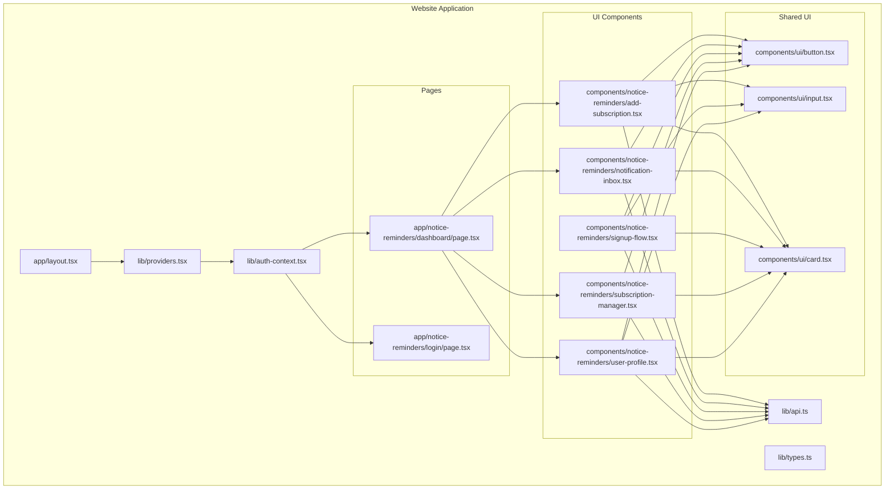
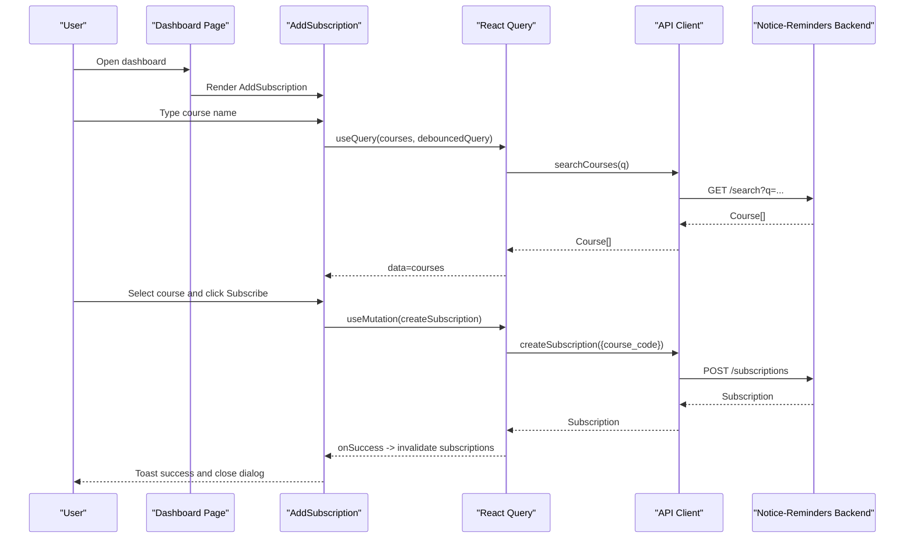
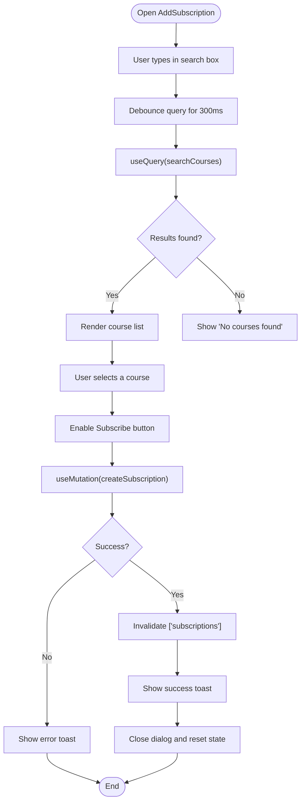
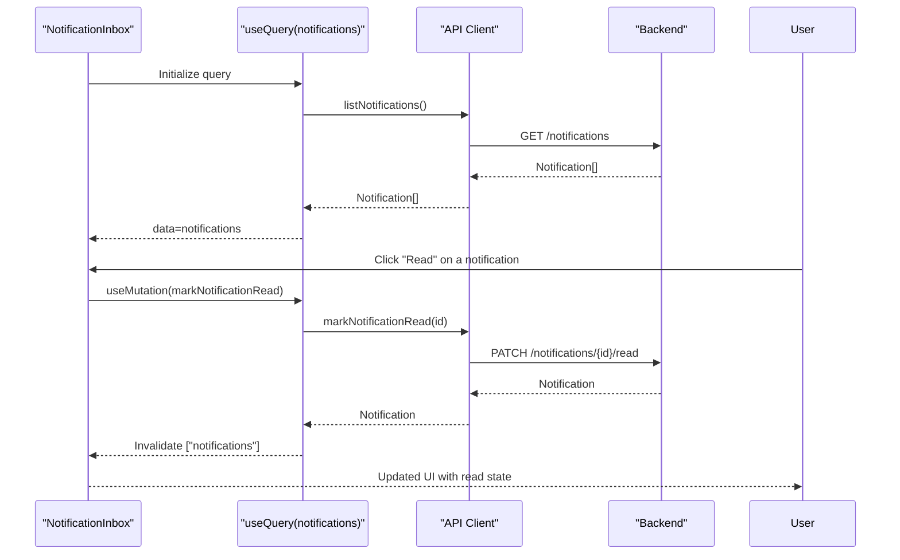
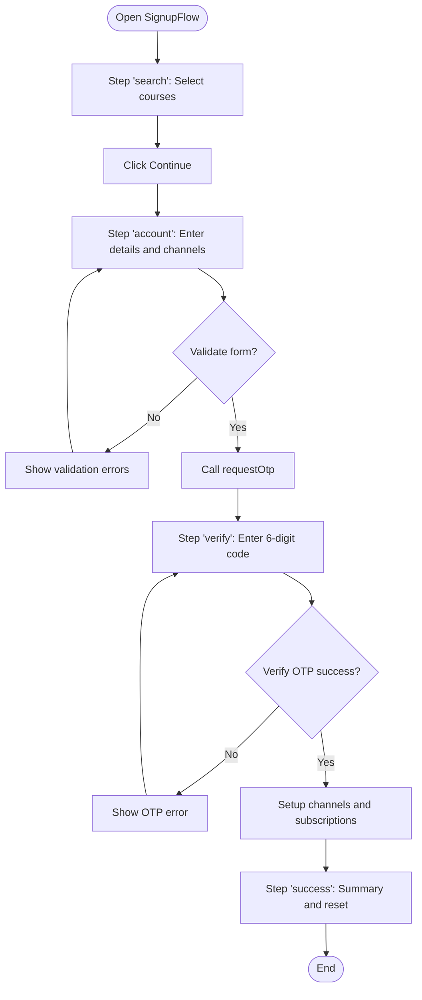
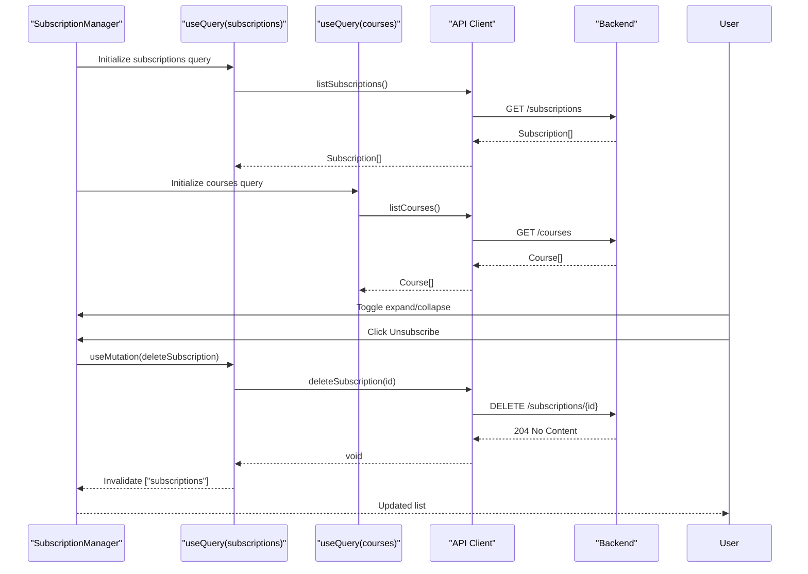
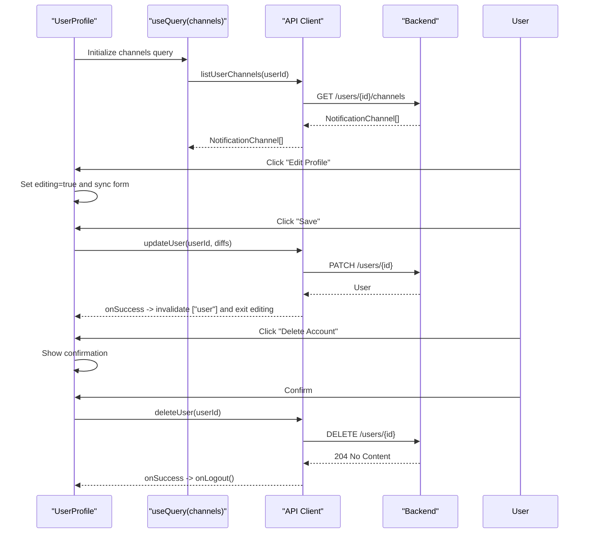
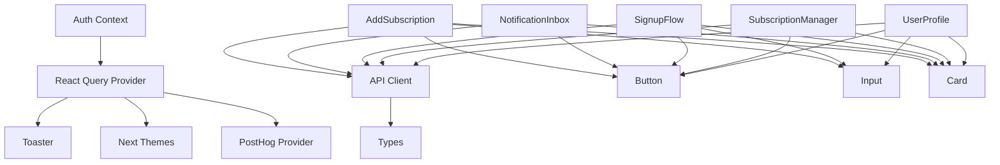

# Notice Reminders Components

<cite>
**Referenced Files in This Document**
- [add-subscription.tsx](file://website/components/notice-reminders/add-subscription.tsx)
- [notification-inbox.tsx](file://website/components/notice-reminders/notification-inbox.tsx)
- [signup-flow.tsx](file://website/components/notice-reminders/signup-flow.tsx)
- [subscription-manager.tsx](file://website/components/notice-reminders/subscription-manager.tsx)
- [user-profile.tsx](file://website/components/notice-reminders/user-profile.tsx)
- [api.ts](file://website/lib/api.ts)
- [types.ts](file://website/lib/types.ts)
- [auth-context.tsx](file://website/lib/auth-context.tsx)
- [providers.tsx](file://website/lib/providers.tsx)
- [layout.tsx](file://website/app/layout.tsx)
- [dashboard/page.tsx](file://website/app/notice-reminders/dashboard/page.tsx)
- [login/page.tsx](file://website/app/notice-reminders/login/page.tsx)
- [button.tsx](file://website/components/ui/button.tsx)
- [card.tsx](file://website/components/ui/card.tsx)
- [input.tsx](file://website/components/ui/input.tsx)
</cite>

## Table of Contents
1. [Introduction](#introduction)
2. [Project Structure](#project-structure)
3. [Core Components](#core-components)
4. [Architecture Overview](#architecture-overview)
5. [Detailed Component Analysis](#detailed-component-analysis)
6. [Dependency Analysis](#dependency-analysis)
7. [Performance Considerations](#performance-considerations)
8. [Troubleshooting Guide](#troubleshooting-guide)
9. [Conclusion](#conclusion)

## Introduction
This document provides comprehensive documentation for the notice reminders UI components that power course subscription management, notification delivery, user authentication, and account settings. It explains component props, state management, API integration patterns, and user interaction flows. It also covers form handling, validation rules, loading states, error handling, component composition with shared UI components, and integration with the backend API. Examples of component usage and customization options are included to help developers integrate and extend the functionality effectively.

## Project Structure
The notice reminders UI components live under the website application in the notice-reminders directory. They rely on a shared UI component library and a typed API client to communicate with the backend service. Authentication state is managed globally via a context provider, and React Query is used for caching and optimistic updates.

**Diagram sources**
- [layout.tsx](file://website/app/layout.tsx#L81-L98)
- [providers.tsx](file://website/lib/providers.tsx#L10-L41)
- [auth-context.tsx](file://website/lib/auth-context.tsx#L21-L88)
- [dashboard/page.tsx](file://website/app/notice-reminders/dashboard/page.tsx#L13-L51)
- [login/page.tsx](file://website/app/notice-reminders/login/page.tsx#L19-L157)
- [add-subscription.tsx](file://website/components/notice-reminders/add-subscription.tsx#L23-L163)
- [notification-inbox.tsx](file://website/components/notice-reminders/notification-inbox.tsx#L23-L156)
- [signup-flow.tsx](file://website/components/notice-reminders/signup-flow.tsx#L65-L638)
- [subscription-manager.tsx](file://website/components/notice-reminders/subscription-manager.tsx#L33-L260)
- [user-profile.tsx](file://website/components/notice-reminders/user-profile.tsx#L35-L318)
- [api.ts](file://website/lib/api.ts#L1-L184)
- [types.ts](file://website/lib/types.ts#L1-L97)
- [button.tsx](file://website/components/ui/button.tsx#L1-L54)
- [input.tsx](file://website/components/ui/input.tsx#L1-L21)
- [card.tsx](file://website/components/ui/card.tsx#L1-L95)

**Section sources**
- [layout.tsx](file://website/app/layout.tsx#L81-L98)
- [providers.tsx](file://website/lib/providers.tsx#L10-L41)

## Core Components
This section summarizes the five notice reminders components and their primary responsibilities.

- AddSubscription: Allows users to search for courses and create new subscriptions.
- NotificationInbox: Displays user notifications and supports marking them as read.
- SignupFlow: Guides users through course selection, account creation, OTP verification, and channel setup.
- SubscriptionManager: Lists active subscriptions, previews course announcements, and allows cancellation.
- UserProfile: Manages user profile updates and notification channels, and supports account deletion.

Each component integrates with the shared UI library and the typed API client, leveraging React Query for caching and optimistic updates.

**Section sources**
- [add-subscription.tsx](file://website/components/notice-reminders/add-subscription.tsx#L23-L163)
- [notification-inbox.tsx](file://website/components/notice-reminders/notification-inbox.tsx#L23-L156)
- [signup-flow.tsx](file://website/components/notice-reminders/signup-flow.tsx#L65-L638)
- [subscription-manager.tsx](file://website/components/notice-reminders/subscription-manager.tsx#L33-L260)
- [user-profile.tsx](file://website/components/notice-reminders/user-profile.tsx#L35-L318)

## Architecture Overview
The components follow a unidirectional data flow:
- Authentication state is provided globally and consumed by pages and components.
- Components use React Query hooks to fetch and mutate data.
- Shared UI components encapsulate styling and behavior.
- The API client abstracts HTTP requests and error handling.

**Diagram sources**
- [dashboard/page.tsx](file://website/app/notice-reminders/dashboard/page.tsx#L26-L26)
- [add-subscription.tsx](file://website/components/notice-reminders/add-subscription.tsx#L37-L60)
- [api.ts](file://website/lib/api.ts#L94-L106)

**Section sources**
- [auth-context.tsx](file://website/lib/auth-context.tsx#L21-L88)
- [providers.tsx](file://website/lib/providers.tsx#L10-L41)
- [api.ts](file://website/lib/api.ts#L1-L184)

## Detailed Component Analysis

### AddSubscription Component
Purpose: Enable users to search for courses and create subscriptions.

Key behaviors:
- Debounced search input to reduce network requests.
- Dialog-based UX for course selection and subscription.
- Mutation to create a subscription and invalidate related queries.
- Toast notifications for success and error feedback.

Props:
- None (uses global state and context).

State management:
- Local state for dialog open/close, search query, debounced query, selected course, and reset on close.

API integration:
- searchCourses for fetching courses.
- createSubscription for creating a subscription.
- invalidateQueries for ["subscriptions"] after successful subscription.

Validation and errors:
- Disabled subscribe button when no course is selected or mutation is pending.
- Error toast on mutation failure.

Usage examples:
- Embedded in the dashboard header next to the sign-out button.

Customization options:
- Adjust dialog width via className.
- Modify button text/icon by editing trigger render prop.
- Change toast messages by updating onSuccess/onError callbacks.

**Diagram sources**
- [add-subscription.tsx](file://website/components/notice-reminders/add-subscription.tsx#L31-L72)
- [api.ts](file://website/lib/api.ts#L94-L106)

**Section sources**
- [add-subscription.tsx](file://website/components/notice-reminders/add-subscription.tsx#L23-L163)
- [api.ts](file://website/lib/api.ts#L94-L106)
- [button.tsx](file://website/components/ui/button.tsx#L1-L54)
- [card.tsx](file://website/components/ui/card.tsx#L1-L95)
- [input.tsx](file://website/components/ui/input.tsx#L1-L21)

### NotificationInbox Component
Purpose: Display notifications and allow users to mark them as read.

Key behaviors:
- Fetch notifications on mount.
- Mark individual notifications as read via mutation.
- Compute unread count for display.
- Render empty state and loading state.

Props:
- None (uses global state and context).

State management:
- Uses local state derived from query data (unread count).

API integration:
- listNotifications for fetching notifications.
- markNotificationRead for marking as read.
- Invalidate ["notifications"] on success.

Validation and errors:
- Loading spinner while fetching.
- Empty state with illustration when no notifications.

Usage examples:
- Embedded in the dashboard left column alongside SubscriptionManager.

Customization options:
- Adjust max height of notification list.
- Customize unread badge appearance.
- Modify date formatting for timestamps.

**Diagram sources**
- [notification-inbox.tsx](file://website/components/notice-reminders/notification-inbox.tsx#L26-L41)
- [api.ts](file://website/lib/api.ts#L135-L147)

**Section sources**
- [notification-inbox.tsx](file://website/components/notice-reminders/notification-inbox.tsx#L23-L156)
- [api.ts](file://website/lib/api.ts#L135-L147)
- [card.tsx](file://website/components/ui/card.tsx#L1-L95)

### SignupFlow Component
Purpose: End-to-end user onboarding with course selection, account setup, OTP verification, and channel configuration.

Key behaviors:
- Multi-step wizard: search → account → verify → success.
- Zod-based form validation for email, Telegram ID, and channel selection.
- OTP request and verification via auth context.
- Creation of notification channels and subscriptions upon completion.
- Resettable state to add more courses.

Props:
- None (self-contained).

State management:
- Local state for step, form data, search query, debounced query, errors, and new user flag.
- Uses auth context for OTP lifecycle and user session.

API integration:
- searchCourses for course discovery.
- requestOtp and verifyOtp for authentication.
- addNotificationChannel for email/telegram channels.
- updateUser for profile updates.
- createSubscription for each selected course.

Validation and errors:
- Real-time validation with Zod schemas.
- Error messages for invalid inputs and OTP failures.
- Disabled navigation buttons during pending operations.

Usage examples:
- Embedded in the landing page section for new users.
- Can be integrated into a standalone login page.

Customization options:
- Adjust steps, labels, and messaging per brand guidelines.
- Extend validation schemas for additional fields.
- Modify success summary content and actions.

**Diagram sources**
- [signup-flow.tsx](file://website/components/notice-reminders/signup-flow.tsx#L65-L206)
- [auth-context.tsx](file://website/lib/auth-context.tsx#L41-L49)
- [api.ts](file://website/lib/api.ts#L150-L165)

**Section sources**
- [signup-flow.tsx](file://website/components/notice-reminders/signup-flow.tsx#L65-L638)
- [auth-context.tsx](file://website/lib/auth-context.tsx#L21-L97)
- [api.ts](file://website/lib/api.ts#L150-L165)
- [types.ts](file://website/lib/types.ts#L66-L75)
- [button.tsx](file://website/components/ui/button.tsx#L1-L54)
- [input.tsx](file://website/components/ui/input.tsx#L1-L21)
- [card.tsx](file://website/components/ui/card.tsx#L1-L95)

### SubscriptionManager Component
Purpose: Manage active subscriptions, expand to preview announcements, and cancel subscriptions.

Key behaviors:
- Fetch subscriptions and courses.
- Expandable rows with announcement previews.
- Delete subscription with optimistic UI updates.
- Guidance to home page when no subscriptions exist.

Props:
- None (uses global state and context).

State management:
- Local state for expanded subscription ID.
- Memoized helpers to resolve course for a subscription.

API integration:
- listSubscriptions for active subscriptions.
- listCourses for course metadata.
- deleteSubscription for cancellation.
- listAnnouncements for preview data.

Validation and errors:
- Loading spinner while fetching subscriptions.
- Disabled delete button during mutation.

Usage examples:
- Embedded in the dashboard left column.

Customization options:
- Adjust announcement preview limit and styling.
- Modify action buttons and labels.
- Add filters or sorting for subscriptions.

**Diagram sources**
- [subscription-manager.tsx](file://website/components/notice-reminders/subscription-manager.tsx#L37-L52)
- [api.ts](file://website/lib/api.ts#L108-L116)

**Section sources**
- [subscription-manager.tsx](file://website/components/notice-reminders/subscription-manager.tsx#L33-L260)
- [api.ts](file://website/lib/api.ts#L76-L116)
- [card.tsx](file://website/components/ui/card.tsx#L1-L95)

### UserProfile Component
Purpose: Allow users to edit profile details, manage notification channels, and delete their account.

Key behaviors:
- Editable profile fields with diff-based updates.
- Display existing notification channels.
- Confirmation flow for account deletion.
- Logout callback on successful deletion.

Props:
- user: User object.
- onLogout: Callback invoked after account deletion.

State management:
- Local state for editing mode, confirm delete, and form values synced with user prop.

API integration:
- updateUser for partial profile updates.
- listUserChannels for channel listing.
- deleteUser for account deletion.

Validation and errors:
- Disabled save when no changes are present.
- Error display for update mutations.

Usage examples:
- Embedded in the dashboard right column.

Customization options:
- Add new editable fields by extending UserUpdate.
- Customize channel icons and labels.
- Modify danger zone messaging and actions.

**Diagram sources**
- [user-profile.tsx](file://website/components/notice-reminders/user-profile.tsx#L45-L63)
- [api.ts](file://website/lib/api.ts#L59-L73)

**Section sources**
- [user-profile.tsx](file://website/components/notice-reminders/user-profile.tsx#L35-L318)
- [api.ts](file://website/lib/api.ts#L59-L73)
- [card.tsx](file://website/components/ui/card.tsx#L1-L95)

## Dependency Analysis
The components share a common dependency graph rooted in the API client and shared UI components. Authentication state is centralized, and React Query manages caching and invalidation.

**Diagram sources**
- [providers.tsx](file://website/lib/providers.tsx#L10-L41)
- [auth-context.tsx](file://website/lib/auth-context.tsx#L21-L88)
- [api.ts](file://website/lib/api.ts#L1-L184)
- [types.ts](file://website/lib/types.ts#L1-L97)
- [button.tsx](file://website/components/ui/button.tsx#L1-L54)
- [input.tsx](file://website/components/ui/input.tsx#L1-L21)
- [card.tsx](file://website/components/ui/card.tsx#L1-L95)

**Section sources**
- [providers.tsx](file://website/lib/providers.tsx#L10-L41)
- [api.ts](file://website/lib/api.ts#L1-L184)
- [types.ts](file://website/lib/types.ts#L1-L97)

## Performance Considerations
- Debounced search: AddSubscription and SignupFlow debounce user input to minimize network requests.
- Query caching: React Query caches responses with a 60-second stale time and disables window focus refetch by default.
- Optimistic updates: Mutations invalidate queries to keep UI in sync without waiting for server responses.
- Conditional queries: Queries are enabled only when conditions are met (e.g., minimum query length).
- Loading states: Components render spinners and skeleton-like states to improve perceived performance.

[No sources needed since this section provides general guidance]

## Troubleshooting Guide
Common issues and resolutions:
- Authentication errors: Ensure the auth context is initialized and the user is loaded before rendering protected components.
- Network failures: The API client throws a typed error with status and message; display user-friendly messages and retry logic.
- Validation errors: Form components display inline errors; ensure validation schemas match backend expectations.
- Stale data: React Query invalidates queries on success; if data does not update, check query keys and invalidation logic.
- Toast notifications: Ensure the Toaster provider is mounted in the app layout.

**Section sources**
- [auth-context.tsx](file://website/lib/auth-context.tsx#L21-L88)
- [api.ts](file://website/lib/api.ts#L18-L53)
- [providers.tsx](file://website/lib/providers.tsx#L10-L41)

## Conclusion
The notice reminders components provide a cohesive, reusable set of UI elements for course subscription management, notifications, authentication, and user settings. By leveraging shared UI components, a typed API client, and React Query, the system achieves predictable state management, responsive interactions, and maintainable code. Developers can extend and customize these components to fit evolving requirements while preserving consistent behavior and user experience.