# Shared UI Components

<cite>
**Referenced Files in This Document**
- [package.json](file://website/package.json)
- [components.json](file://website/components.json)
- [globals.css](file://website/app/globals.css)
- [utils.ts](file://website/lib/utils.ts)
- [button.tsx](file://website/components/ui/button.tsx)
- [input.tsx](file://website/components/ui/input.tsx)
- [card.tsx](file://website/components/ui/card.tsx)
- [dialog.tsx](file://website/components/ui/dialog.tsx)
- [alert-dialog.tsx](file://website/components/ui/alert-dialog.tsx)
- [badge.tsx](file://website/components/ui/badge.tsx)
- [combobox.tsx](file://website/components/ui/combobox.tsx)
- [dropdown-menu.tsx](file://website/components/ui/dropdown-menu.tsx)
- [field.tsx](file://website/components/ui/field.tsx)
- [input-group.tsx](file://website/components/ui/input-group.tsx)
- [label.tsx](file://website/components/ui/label.tsx)
- [select.tsx](file://website/components/ui/select.tsx)
- [separator.tsx](file://website/components/ui/separator.tsx)
- [sonner.tsx](file://website/components/ui/sonner.tsx)
- [textarea.tsx](file://website/components/ui/textarea.tsx)
</cite>

## Table of Contents
1. [Introduction](#introduction)
2. [Project Structure](#project-structure)
3. [Core Components](#core-components)
4. [Architecture Overview](#architecture-overview)
5. [Detailed Component Analysis](#detailed-component-analysis)
6. [Dependency Analysis](#dependency-analysis)
7. [Performance Considerations](#performance-considerations)
8. [Troubleshooting Guide](#troubleshooting-guide)
9. [Conclusion](#conclusion)
10. [Appendices](#appendices)

## Introduction
This document describes the shared UI component library built with the shadcn/ui design system in a Next.js application. It documents reusable components including Button, Input, Card, Dialog, Alert Dialog, Badge, Combobox, Dropdown Menu, Field, Input Group, Label, Select, Separator, Sonner, and Textarea. For each component, we explain the props interface, styling customization options, accessibility features, and usage patterns. We also cover composition patterns, variant options, size variations, theme integration via Tailwind CSS and design tokens, and practical examples for integrating with form validation.

## Project Structure
The UI components live under website/components/ui and are composed with:
- Base primitives from @base-ui/react
- Shadcn/ui configuration via components.json
- Tailwind CSS v4 with CSS Variables and design tokens defined in app/globals.css
- Utility class merging via lib/utils.ts (clsx + tailwind-merge)

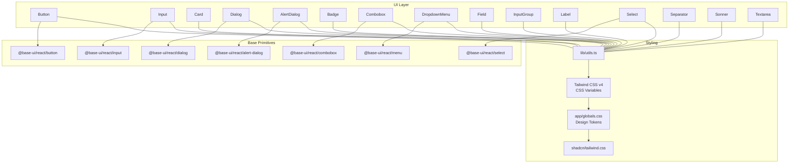

**Diagram sources**
- [button.tsx](file://website/components/ui/button.tsx#L1-L54)
- [input.tsx](file://website/components/ui/input.tsx#L1-L21)
- [card.tsx](file://website/components/ui/card.tsx#L1-L95)
- [dialog.tsx](file://website/components/ui/dialog.tsx#L1-L152)
- [alert-dialog.tsx](file://website/components/ui/alert-dialog.tsx#L1-L176)
- [badge.tsx](file://website/components/ui/badge.tsx#L1-L49)
- [combobox.tsx](file://website/components/ui/combobox.tsx#L1-L296)
- [dropdown-menu.tsx](file://website/components/ui/dropdown-menu.tsx#L1-L266)
- [field.tsx](file://website/components/ui/field.tsx#L1-L228)
- [input-group.tsx](file://website/components/ui/input-group.tsx#L1-L150)
- [label.tsx](file://website/components/ui/label.tsx)
- [select.tsx](file://website/components/ui/select.tsx)
- [separator.tsx](file://website/components/ui/separator.tsx)
- [sonner.tsx](file://website/components/ui/sonner.tsx)
- [textarea.tsx](file://website/components/ui/textarea.tsx)
- [utils.ts](file://website/lib/utils.ts#L1-L7)
- [globals.css](file://website/app/globals.css#L1-L128)
- [components.json](file://website/components.json#L1-L26)

**Section sources**
- [package.json](file://website/package.json#L1-L47)
- [components.json](file://website/components.json#L1-L26)
- [globals.css](file://website/app/globals.css#L1-L128)
- [utils.ts](file://website/lib/utils.ts#L1-L7)

## Core Components
This section summarizes the primary components and their responsibilities, focusing on props, variants, sizes, and styling hooks.

- Button
  - Props: className, variant, size, plus primitive props
  - Variants: default, outline, secondary, ghost, destructive, link
  - Sizes: default, xs, sm, lg, icon, icon-xs, icon-sm, icon-lg
  - Accessibility: focus-visible ring, aria-invalid states, outline-none
  - Composition: integrates with Icon via SVG sizing rules

- Input
  - Props: className, type, plus native input props
  - Accessibility: focus-visible ring, aria-invalid states, placeholder color
  - Composition: used inside InputGroup

- Card
  - Props: className, size ("default" | "sm")
  - Subcomponents: CardHeader, CardTitle, CardDescription, CardAction, CardContent, CardFooter
  - Composition: grid layout with optional action area

- Dialog
  - Props: Root, Trigger, Portal, Overlay, Content (showCloseButton), Header, Footer, Title, Description
  - Accessibility: Backdrop, Close button with sr-only label, portal rendering
  - Composition: Uses Button for close, Lucide X icon

- Alert Dialog
  - Props: Root, Trigger, Portal, Overlay, Content (size), Header, Footer, Media, Title, Description, Action, Cancel
  - Accessibility: Backdrop, portal rendering, size variants
  - Composition: Uses Button for actions

- Badge
  - Props: className, variant, render, plus primitive props
  - Variants: default, secondary, destructive, outline, ghost, link
  - Accessibility: focus-visible ring, aria-invalid states

- Combobox
  - Props: Root, Value, Trigger, Clear, Input (showTrigger, showClear), Content (positioning), List, Item, Group, Label, Collection, Empty, Separator, Chips, Chip, ChipsInput
  - Accessibility: keyboard navigation, highlight states, item indicators
  - Composition: integrates with InputGroup, Button, Lucide icons

- Dropdown Menu
  - Props: Root, Portal, Trigger, Content (positioning), Group, Label (inset), Item (inset, variant), Submenu, Checkbox/Radio Items, Separator, Shortcut
  - Accessibility: keyboard navigation, submenus, indicators
  - Composition: integrates with Lucide icons

- Field
  - Props: FieldSet, FieldLegend (variant), FieldGroup, Field (orientation), FieldContent, FieldLabel, FieldTitle, FieldDescription, FieldSeparator, FieldError (errors)
  - Accessibility: grouping roles, legends, separators, error roles
  - Composition: integrates with Label, Separator

- Input Group
  - Props: InputGroup, InputGroupAddon (align), InputGroupButton (size, variant), InputGroupText, InputGroupInput, InputGroupTextarea
  - Accessibility: focus management, click-to-focus on addon
  - Composition: composes Button and Input/Textarea

- Label
  - Props: className, plus native label props
  - Accessibility: associated with controls via htmlFor

- Select
  - Props: Root, Trigger, Portal, Content (positioning), Group, Label, Item, Separator, Value
  - Accessibility: keyboard navigation, highlight states
  - Composition: integrates with Lucide icons

- Separator
  - Props: className, decorative, orientation
  - Accessibility: semantic role via role attribute

- Sonner
  - Props: toast manager and helpers
  - Integration: toast notifications

- Textarea
  - Props: className, plus native textarea props
  - Accessibility: focus-visible ring, aria-invalid states
  - Composition: used inside InputGroup

**Section sources**
- [button.tsx](file://website/components/ui/button.tsx#L8-L36)
- [input.tsx](file://website/components/ui/input.tsx#L6-L18)
- [card.tsx](file://website/components/ui/card.tsx#L5-L84)
- [dialog.tsx](file://website/components/ui/dialog.tsx#L10-L138)
- [alert-dialog.tsx](file://website/components/ui/alert-dialog.tsx#L9-L130)
- [badge.tsx](file://website/components/ui/badge.tsx#L7-L24)
- [combobox.tsx](file://website/components/ui/combobox.tsx#L16-L256)
- [dropdown-menu.tsx](file://website/components/ui/dropdown-menu.tsx#L9-L221)
- [field.tsx](file://website/components/ui/field.tsx#L10-L214)
- [input-group.tsx](file://website/components/ui/input-group.tsx#L11-L140)
- [label.tsx](file://website/components/ui/label.tsx)
- [select.tsx](file://website/components/ui/select.tsx)
- [separator.tsx](file://website/components/ui/separator.tsx)
- [sonner.tsx](file://website/components/ui/sonner.tsx)
- [textarea.tsx](file://website/components/ui/textarea.tsx)

## Architecture Overview
The UI components follow a layered architecture:
- Primitive wrappers: thin wrappers around @base-ui/react primitives
- Styling layer: class merging via cn(), variants via class-variance-authority
- Theme layer: Tailwind CSS v4 with CSS variables mapped to design tokens
- Composition layer: components compose smaller building blocks (e.g., Button, Input, Label)

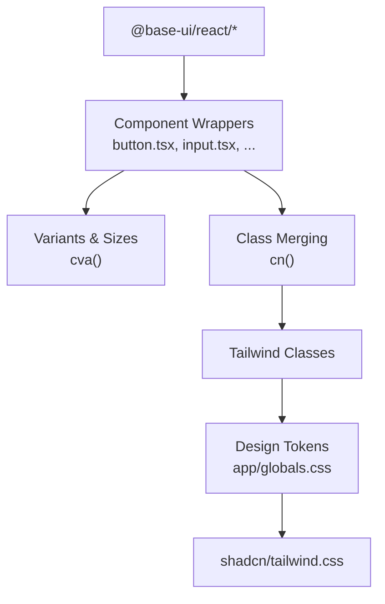

**Diagram sources**
- [button.tsx](file://website/components/ui/button.tsx#L3-L6)
- [input.tsx](file://website/components/ui/input.tsx#L2-L4)
- [utils.ts](file://website/lib/utils.ts#L4-L6)
- [globals.css](file://website/app/globals.css#L7-L49)
- [components.json](file://website/components.json#L6-L12)

**Section sources**
- [button.tsx](file://website/components/ui/button.tsx#L1-L54)
- [input.tsx](file://website/components/ui/input.tsx#L1-L21)
- [utils.ts](file://website/lib/utils.ts#L1-L7)
- [globals.css](file://website/app/globals.css#L1-L128)
- [components.json](file://website/components.json#L1-L26)

## Detailed Component Analysis

### Button
- Props interface
  - className: string
  - variant: "default" | "outline" | "secondary" | "ghost" | "destructive" | "link"
  - size: "default" | "xs" | "sm" | "lg" | "icon" | "icon-xs" | "icon-sm" | "icon-lg"
  - Additional primitive props
- Styling customization
  - Uses cva() for variants and sizes
  - Focus-visible ring, aria-invalid ring, disabled opacity, icon sizing rules
- Accessibility
  - Focus-visible ring, outline-none, aria-invalid states
- Usage examples
  - Primary action: variant="default", size="default"
  - Icon-only: variant="ghost", size="icon"
  - Danger: variant="destructive"

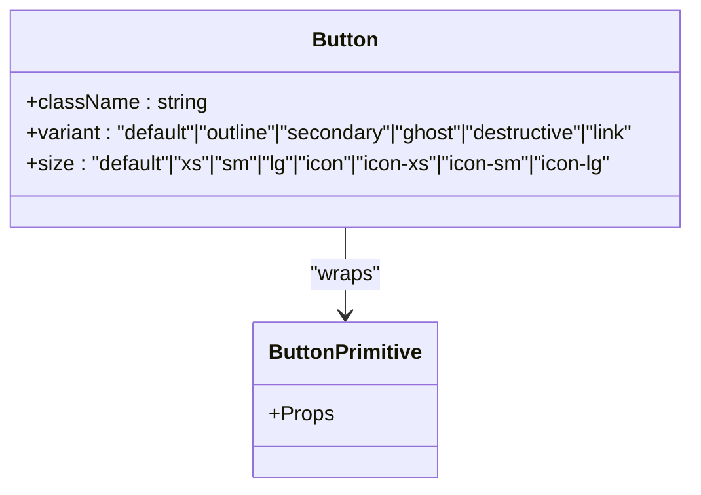

**Diagram sources**
- [button.tsx](file://website/components/ui/button.tsx#L38-L51)

**Section sources**
- [button.tsx](file://website/components/ui/button.tsx#L8-L36)
- [button.tsx](file://website/components/ui/button.tsx#L38-L51)

### Input
- Props interface
  - className: string
  - type: string
  - Additional native input props
- Styling customization
  - Focus-visible ring, aria-invalid ring, placeholder color, disabled states
- Accessibility
  - Focus-visible ring, aria-invalid states
- Usage examples
  - Inside InputGroup for addons/buttons
  - Controlled via form libraries

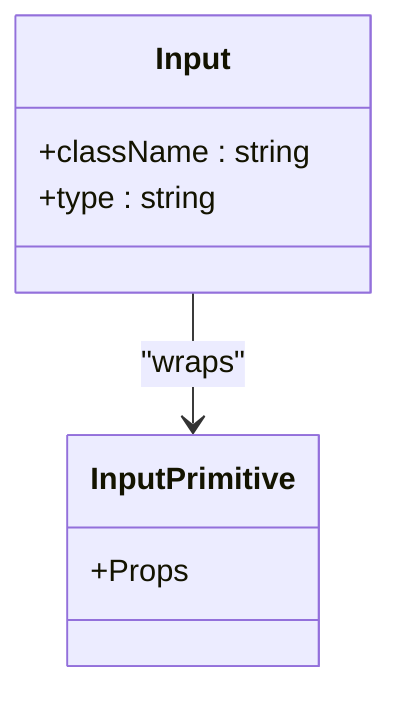

**Diagram sources**
- [input.tsx](file://website/components/ui/input.tsx#L6-L18)

**Section sources**
- [input.tsx](file://website/components/ui/input.tsx#L1-L21)

### Card
- Props interface
  - className: string
  - size: "default" | "sm"
- Subcomponents
  - CardHeader, CardTitle, CardDescription, CardAction, CardContent, CardFooter
- Styling customization
  - Ring, background, shadow, rounded corners, grid layout
- Accessibility
  - Semantic grouping via data-* attributes and slots
- Usage examples
  - Feature cards with action buttons
  - Content containers with optional descriptions

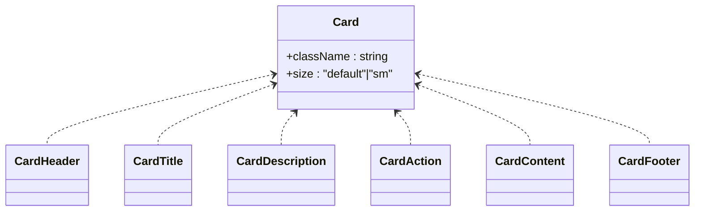

**Diagram sources**
- [card.tsx](file://website/components/ui/card.tsx#L5-L84)

**Section sources**
- [card.tsx](file://website/components/ui/card.tsx#L1-L95)

### Dialog
- Props interface
  - Dialog: Root
  - DialogTrigger: Trigger
  - DialogPortal: Portal
  - DialogOverlay: Backdrop
  - DialogContent: Popup (showCloseButton?)
  - DialogHeader/Footer: container
  - DialogTitle/Description: Title/Description
- Styling customization
  - Animation classes, overlay backdrop, fixed positioning, z-index
- Accessibility
  - Portal rendering, sr-only close label, backdrop filtering support
- Usage examples
  - Form modals with header/footer
  - Confirmation dialogs with close button

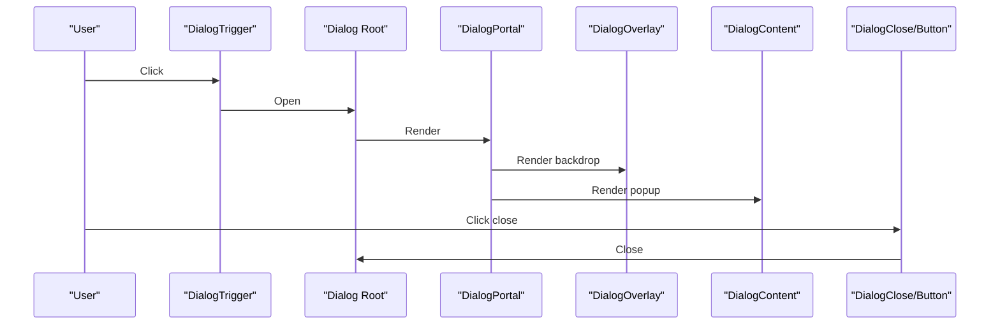

**Diagram sources**
- [dialog.tsx](file://website/components/ui/dialog.tsx#L10-L78)

**Section sources**
- [dialog.tsx](file://website/components/ui/dialog.tsx#L1-L152)

### Alert Dialog
- Props interface
  - AlertDialog: Root
  - AlertDialogTrigger: Trigger
  - AlertDialogPortal: Portal
  - AlertDialogOverlay: Backdrop
  - AlertDialogContent: Popup (size?)
  - AlertDialogHeader/Footer: container
  - AlertDialogMedia: media area
  - AlertDialogTitle/Description: Title/Description
  - AlertDialogAction: Button
  - AlertDialogCancel: Close with Button renderer
- Styling customization
  - Size variants, grid layout, animation classes
- Accessibility
  - Portal rendering, size-aware layouts
- Usage examples
  - Confirmation prompts with destructive action
  - Informational alerts with media

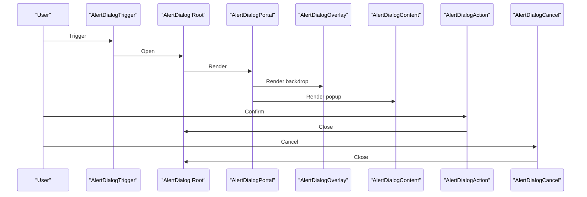

**Diagram sources**
- [alert-dialog.tsx](file://website/components/ui/alert-dialog.tsx#L9-L160)

**Section sources**
- [alert-dialog.tsx](file://website/components/ui/alert-dialog.tsx#L1-L176)

### Badge
- Props interface
  - className: string
  - variant: "default" | "secondary" | "destructive" | "outline" | "ghost" | "link"
  - render: component renderer
  - Additional primitive props
- Styling customization
  - Variants via cva(), focus-visible ring, aria-invalid states
- Accessibility
  - Focus-visible ring, aria-invalid states
- Usage examples
  - Status badges, tags, links

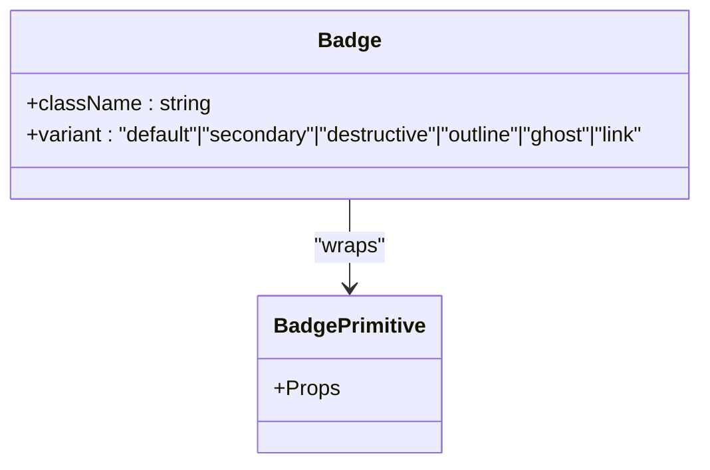

**Diagram sources**
- [badge.tsx](file://website/components/ui/badge.tsx#L26-L46)

**Section sources**
- [badge.tsx](file://website/components/ui/badge.tsx#L1-L49)

### Combobox
- Props interface
  - Combobox: Root
  - ComboboxValue: Value
  - ComboboxTrigger: Trigger (with ChevronDown)
  - ComboboxClear: Clear (with X)
  - ComboboxInput: Input (showTrigger?, showClear?, disabled?)
  - ComboboxContent: Popup (positioning props)
  - ComboboxList: List
  - ComboboxItem: Item (with Check indicator)
  - ComboboxGroup/Label: Grouping
  - ComboboxCollection/Empty/Separator
  - ComboboxChips/Chip/ChipsInput
- Styling customization
  - Positioner-based placement, chips mode, item highlighting
- Accessibility
  - Keyboard navigation, highlight states, item indicators
- Usage examples
  - Single/multi-select inputs, searchable lists, chips selection

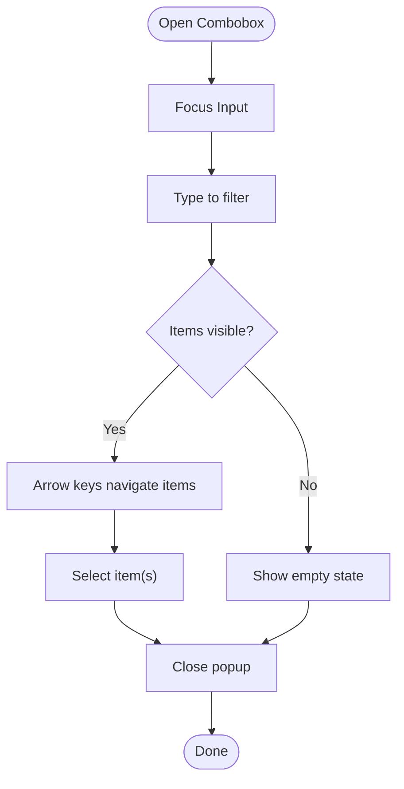

**Diagram sources**
- [combobox.tsx](file://website/components/ui/combobox.tsx#L16-L256)

**Section sources**
- [combobox.tsx](file://website/components/ui/combobox.tsx#L1-L296)

### Dropdown Menu
- Props interface
  - DropdownMenu: Root
  - DropdownMenuPortal: Portal
  - DropdownMenuTrigger: Trigger
  - DropdownMenuContent: Popup (positioning)
  - DropdownMenuGroup/Label (inset)
  - DropdownMenuItem (inset, variant)
  - DropdownMenuSubmenu: SubRoot/SubTrigger/SubContent
  - DropdownMenuCheckboxItem/RadioItem
  - DropdownMenuSeparator
  - DropdownMenuShortcut
- Styling customization
  - Positioner-based placement, nested submenus, variant colors
- Accessibility
  - Keyboard navigation, submenus, indicators
- Usage examples
  - Context menus, navigation dropdowns, settings panels

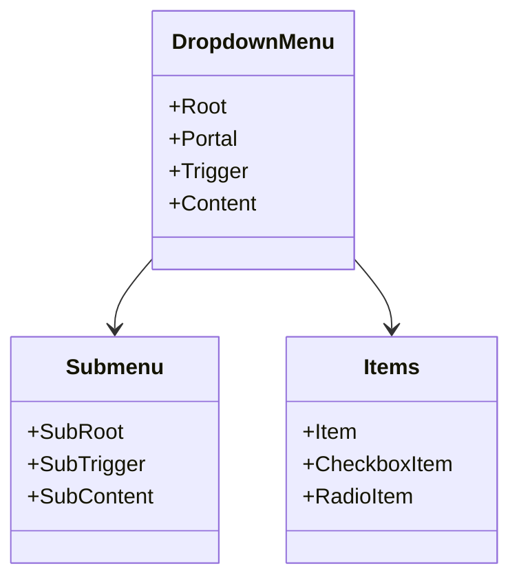

**Diagram sources**
- [dropdown-menu.tsx](file://website/components/ui/dropdown-menu.tsx#L9-L221)

**Section sources**
- [dropdown-menu.tsx](file://website/components/ui/dropdown-menu.tsx#L1-L266)

### Field
- Props interface
  - FieldSet, FieldLegend (variant), FieldGroup
  - Field (orientation: "vertical" | "horizontal" | "responsive")
  - FieldContent, FieldLabel, FieldTitle, FieldDescription, FieldSeparator, FieldError (errors)
- Styling customization
  - Orientation-dependent layout, responsive breakpoints, separators
- Accessibility
  - Role grouping, legends, separators, error roles
- Usage examples
  - Form groups with labels, descriptions, and error lists

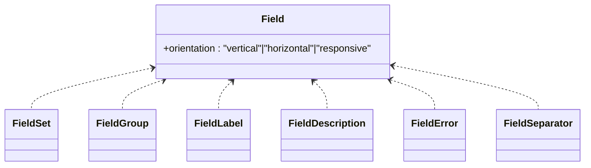

**Diagram sources**
- [field.tsx](file://website/components/ui/field.tsx#L64-L78)

**Section sources**
- [field.tsx](file://website/components/ui/field.tsx#L1-L228)

### Input Group
- Props interface
  - InputGroup
  - InputGroupAddon (align: "inline-start" | "inline-end" | "block-start" | "block-end")
  - InputGroupButton (size variants, variant)
  - InputGroupText
  - InputGroupInput, InputGroupTextarea
- Styling customization
  - Border focus ring, alignment, spacing, disabled opacity
- Accessibility
  - Click-to-focus on addon, proper focus order
- Usage examples
  - Inputs with prepend/append buttons or text
  - Search bars with action buttons

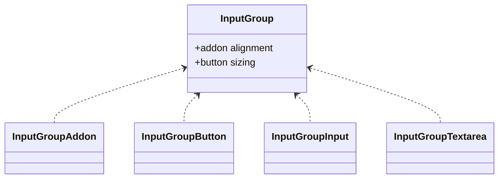

**Diagram sources**
- [input-group.tsx](file://website/components/ui/input-group.tsx#L11-L140)

**Section sources**
- [input-group.tsx](file://website/components/ui/input-group.tsx#L1-L150)

### Label
- Props interface
  - className: string
  - Additional native label props
- Styling customization
  - Inherits from base label styles
- Accessibility
  - Associated with controls via htmlFor
- Usage examples
  - Labels for inputs, checkboxes, radios

**Section sources**
- [label.tsx](file://website/components/ui/label.tsx)

### Select
- Props interface
  - Root, Trigger, Portal, Content (positioning), Group, Label, Item, Separator, Value
- Styling customization
  - Positioner-based placement, item highlighting
- Accessibility
  - Keyboard navigation, highlight states
- Usage examples
  - Dropdown selects, option pickers

**Section sources**
- [select.tsx](file://website/components/ui/select.tsx)

### Separator
- Props interface
  - className: string
  - decorative: boolean
  - orientation: "horizontal" | "vertical"
- Styling customization
  - Border color, margin, padding
- Accessibility
  - role attribute for semantic separation
- Usage examples
  - Dividers in forms, menus, cards

**Section sources**
- [separator.tsx](file://website/components/ui/separator.tsx)

### Sonner
- Props interface
  - Toast manager and helpers
- Styling customization
  - Notification styling via Tailwind classes
- Usage examples
  - Global notifications, toasts

**Section sources**
- [sonner.tsx](file://website/components/ui/sonner.tsx)

### Textarea
- Props interface
  - className: string
  - Additional native textarea props
- Styling customization
  - Focus-visible ring, aria-invalid ring, disabled states
- Accessibility
  - Focus-visible ring, aria-invalid states
- Usage examples
  - Multi-line inputs, comments, descriptions

**Section sources**
- [textarea.tsx](file://website/components/ui/textarea.tsx)

## Dependency Analysis
The components depend on:
- Base primitives (@base-ui/react/*)
- Styling utilities (class-variance-authority, clsx, tailwind-merge)
- Theme (Tailwind CSS v4, CSS variables, shadcn/tailwind.css)
- Icons (lucide-react)

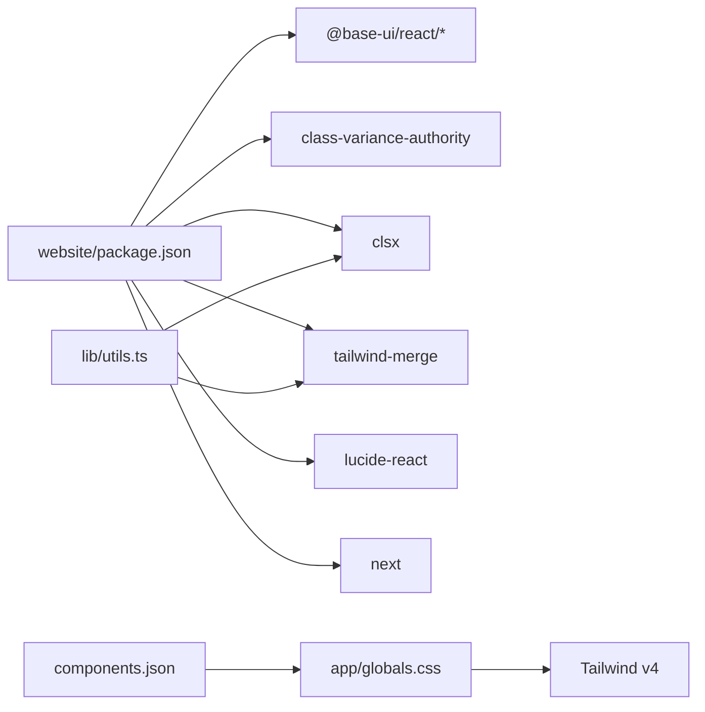

**Diagram sources**
- [package.json](file://website/package.json#L11-L26)
- [utils.ts](file://website/lib/utils.ts#L1-L7)
- [globals.css](file://website/app/globals.css#L1-L128)
- [components.json](file://website/components.json#L1-L26)

**Section sources**
- [package.json](file://website/package.json#L1-L47)
- [utils.ts](file://website/lib/utils.ts#L1-L7)
- [globals.css](file://website/app/globals.css#L1-L128)
- [components.json](file://website/components.json#L1-L26)

## Performance Considerations
- Prefer variant and size props over ad-hoc className overrides to keep styles predictable and efficient.
- Use InputGroup to avoid redundant borders and shadows on composite inputs.
- Leverage CSS variables for theme updates without rebuilding styles.
- Keep animations minimal; Dialog and AlertDialog use lightweight transitions.
- Avoid excessive nesting in Field and DropdownMenu to reduce DOM traversal.

## Troubleshooting Guide
- Focus ring not visible
  - Ensure focus-visible ring classes are applied and not overridden.
  - Verify theme variables for ring color.
- Disabled state not working
  - Check disabled pointer-events and opacity classes.
- Invalid state styling inconsistent
  - Confirm aria-invalid classes and destructives ring/opacity.
- Combobox menu misaligned
  - Adjust positioner props (side, align, offsets) and ensure anchor is set.
- Dropdown submenu not opening
  - Verify SubmenuRoot and SubTrigger are paired and not disabled.
- InputGroup addon click does nothing
  - Confirm click handler focuses the input element.

**Section sources**
- [button.tsx](file://website/components/ui/button.tsx#L8-L36)
- [input.tsx](file://website/components/ui/input.tsx#L6-L18)
- [input-group.tsx](file://website/components/ui/input-group.tsx#L55-L62)
- [combobox.tsx](file://website/components/ui/combobox.tsx#L95-L121)
- [dropdown-menu.tsx](file://website/components/ui/dropdown-menu.tsx#L99-L146)

## Conclusion
The shared UI component library leverages shadcn/ui design principles with @base-ui/react primitives, Tailwind CSS v4, and CSS variables for consistent theming. Components expose clear props interfaces, variants, and sizes, while emphasizing accessibility and composability. The InputGroup, Field, and Combobox demonstrate advanced composition patterns suitable for robust form experiences.

## Appendices
- Theme integration
  - Design tokens defined in app/globals.css map to Tailwind variables.
  - components.json configures shadcn/ui style, icon library, and CSS variables.
- Practical form validation patterns
  - Use Field components to group labels, descriptions, and errors.
  - Apply aria-invalid on inputs and observe destructive ring/opacity.
  - Use InputGroup for prepend/append actions alongside validation feedback.

**Section sources**
- [globals.css](file://website/app/globals.css#L7-L49)
- [components.json](file://website/components.json#L3-L13)
- [field.tsx](file://website/components/ui/field.tsx#L165-L214)
- [input-group.tsx](file://website/components/ui/input-group.tsx#L11-L23)