# UI Components

<cite>
**Referenced Files in This Document**
- [button.tsx](file://website/components/ui/button.tsx)
- [input.tsx](file://website/components/ui/input.tsx)
- [dialog.tsx](file://website/components/ui/dialog.tsx)
- [card.tsx](file://website/components/ui/card.tsx)
- [alert-dialog.tsx](file://website/components/ui/alert-dialog.tsx)
- [textarea.tsx](file://website/components/ui/textarea.tsx)
- [badge.tsx](file://website/components/ui/badge.tsx)
- [notification-inbox.tsx](file://website/components/notice-reminders/notification-inbox.tsx)
- [user-profile.tsx](file://website/components/notice-reminders/user-profile.tsx)
- [subscription-manager.tsx](file://website/components/notice-reminders/subscription-manager.tsx)
- [extension-download.tsx](file://website/components/assignment-solver/extension-download.tsx)
- [features.tsx](file://website/components/landing/features.tsx)
- [product-showcase.tsx](file://website/components/landing/product-showcase.tsx)
- [utils.ts](file://website/lib/utils.ts)
</cite>

## Table of Contents
1. [Introduction](#introduction)
2. [Project Structure](#project-structure)
3. [Core Components](#core-components)
4. [Architecture Overview](#architecture-overview)
5. [Detailed Component Analysis](#detailed-component-analysis)
6. [Dependency Analysis](#dependency-analysis)
7. [Performance Considerations](#performance-considerations)
8. [Accessibility Compliance](#accessibility-compliance)
9. [Responsive Design Implementation](#responsive-design-implementation)
10. [Troubleshooting Guide](#troubleshooting-guide)
11. [Conclusion](#conclusion)

## Introduction
This document describes the reusable UI component library used across the Next.js website application. It covers shared components (buttons, forms, dialogs, cards, inputs), notice reminders components for subscription management and user profiles, assignment solver components for extension download and integration, and landing page components showcasing features and product showcase. The guide explains component props, customization options, styling approaches using Tailwind CSS and class variance authority (CVA), component composition patterns, accessibility compliance, and responsive design implementation.

## Project Structure
The UI library is organized under website/components/ui with reusable base components and specialized components grouped by feature area:
- Shared UI primitives: button, input, textarea, card, dialog, alert-dialog, badge
- Feature-specific components: notice reminders (inbox, subscription manager, user profile), assignment solver (extension download), landing page components (features, product showcase)

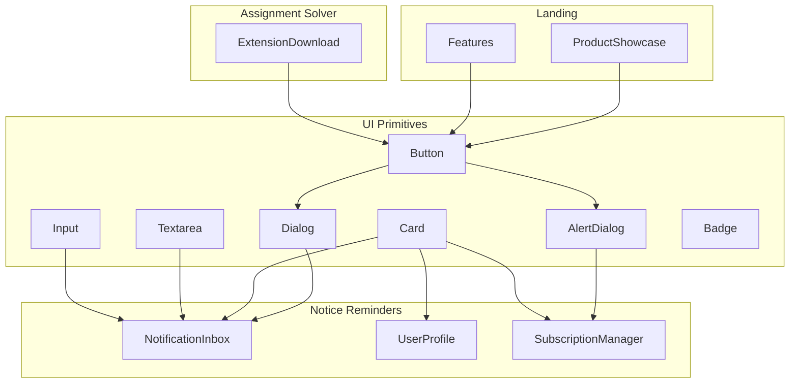

**Diagram sources**
- [button.tsx](file://website/components/ui/button.tsx#L1-L54)
- [input.tsx](file://website/components/ui/input.tsx#L1-L21)
- [textarea.tsx](file://website/components/ui/textarea.tsx#L1-L19)
- [card.tsx](file://website/components/ui/card.tsx#L1-L95)
- [dialog.tsx](file://website/components/ui/dialog.tsx#L1-L152)
- [alert-dialog.tsx](file://website/components/ui/alert-dialog.tsx#L1-L176)
- [badge.tsx](file://website/components/ui/badge.tsx#L1-L49)
- [notification-inbox.tsx](file://website/components/notice-reminders/notification-inbox.tsx#L1-L156)
- [user-profile.tsx](file://website/components/notice-reminders/user-profile.tsx#L1-L318)
- [subscription-manager.tsx](file://website/components/notice-reminders/subscription-manager.tsx#L1-L260)
- [extension-download.tsx](file://website/components/assignment-solver/extension-download.tsx#L1-L197)
- [features.tsx](file://website/components/landing/features.tsx#L1-L144)
- [product-showcase.tsx](file://website/components/landing/product-showcase.tsx#L1-L161)

**Section sources**
- [button.tsx](file://website/components/ui/button.tsx#L1-L54)
- [input.tsx](file://website/components/ui/input.tsx#L1-L21)
- [dialog.tsx](file://website/components/ui/dialog.tsx#L1-L152)
- [card.tsx](file://website/components/ui/card.tsx#L1-L95)
- [alert-dialog.tsx](file://website/components/ui/alert-dialog.tsx#L1-L176)
- [textarea.tsx](file://website/components/ui/textarea.tsx#L1-L19)
- [badge.tsx](file://website/components/ui/badge.tsx#L1-L49)
- [notification-inbox.tsx](file://website/components/notice-reminders/notification-inbox.tsx#L1-L156)
- [user-profile.tsx](file://website/components/notice-reminders/user-profile.tsx#L1-L318)
- [subscription-manager.tsx](file://website/components/notice-reminders/subscription-manager.tsx#L1-L260)
- [extension-download.tsx](file://website/components/assignment-solver/extension-download.tsx#L1-L197)
- [features.tsx](file://website/components/landing/features.tsx#L1-L144)
- [product-showcase.tsx](file://website/components/landing/product-showcase.tsx#L1-L161)

## Core Components
This section documents the shared UI primitives that form the foundation of the component library.

- Button
  - Purpose: Primary interactive element with variant and size variants.
  - Props:
    - variant: default, outline, secondary, ghost, destructive, link
    - size: default, xs, sm, lg, icon, icon-xs, icon-sm, icon-lg
    - className: optional tailwind classes
  - Customization: Uses CVA for variant and size tokens; integrates with data-slot attributes for consistent styling.
  - Accessibility: Inherits focus-visible ring and aria-invalid states for form integration.
  
  **Section sources**
  - [button.tsx](file://website/components/ui/button.tsx#L8-L36)
  - [button.tsx](file://website/components/ui/button.tsx#L38-L51)

- Input
  - Purpose: Text input primitive with consistent focus states and invalid feedback.
  - Props: type, className, plus standard input attributes.
  - Customization: Tailwind classes applied via cn; integrates aria-invalid for form validation.
  
  **Section sources**
  - [input.tsx](file://website/components/ui/input.tsx#L6-L18)

- Textarea
  - Purpose: Multi-line text input with consistent focus and invalid states.
  - Props: className, plus standard textarea attributes.
  
  **Section sources**
  - [textarea.tsx](file://website/components/ui/textarea.tsx#L5-L16)

- Card
  - Purpose: Container with header, title, description, action, content, and footer slots.
  - Props:
    - size: default, sm
    - className
  - Slots: card-header, card-title, card-description, card-action, card-content, card-footer.
  
  **Section sources**
  - [card.tsx](file://website/components/ui/card.tsx#L5-L18)
  - [card.tsx](file://website/components/ui/card.tsx#L20-L84)

- Dialog
  - Purpose: Modal overlay with trigger, portal, close, overlay, content, header, footer, title, and description.
  - Props:
    - DialogContent: showCloseButton flag
    - DialogFooter: showCloseButton flag
    - size variants for alert-style dialogs
  - Composition: Composes Base UI Dialog with internal Button and XIcon for close.
  
  **Section sources**
  - [dialog.tsx](file://website/components/ui/dialog.tsx#L10-L12)
  - [dialog.tsx](file://website/components/ui/dialog.tsx#L39-L78)
  - [dialog.tsx](file://website/components/ui/dialog.tsx#L90-L115)
  - [dialog.tsx](file://website/components/ui/dialog.tsx#L117-L138)

- AlertDialog
  - Purpose: Confirmation dialog with action and cancel bindings to Button.
  - Props:
    - size: default, sm
    - AlertDialogAction: Button props
    - AlertDialogCancel: variant, size defaults to outline, default size
  
  **Section sources**
  - [alert-dialog.tsx](file://website/components/ui/alert-dialog.tsx#L9-L11)
  - [alert-dialog.tsx](file://website/components/ui/alert-dialog.tsx#L41-L62)
  - [alert-dialog.tsx](file://website/components/ui/alert-dialog.tsx#L132-L160)

- Badge
  - Purpose: Label or indicator with variant variants.
  - Props:
    - variant: default, secondary, destructive, outline, ghost, link
    - render: optional renderer for advanced composition
    - className
  
  **Section sources**
  - [badge.tsx](file://website/components/ui/badge.tsx#L26-L46)

Styling approach
- Tailwind classes are combined using cn from lib/utils.
- CVA defines variant and size tokens for Buttons and Badges.
- Focus-visible rings and aria-invalid states ensure accessible feedback.
- Responsive breakpoints and spacing tokens are used consistently across components.

**Section sources**
- [utils.ts](file://website/lib/utils.ts)
- [button.tsx](file://website/components/ui/button.tsx#L8-L36)
- [badge.tsx](file://website/components/ui/badge.tsx#L7-L24)

## Architecture Overview
The UI library follows a composition-first pattern:
- Primitive components (Button, Input, Card) encapsulate base styling and behavior.
- Feature components (NotificationInbox, UserProfile, SubscriptionManager) compose primitives to implement domain logic.
- Landing components (Features, ProductShowcase) demonstrate product capabilities using primitives and links.

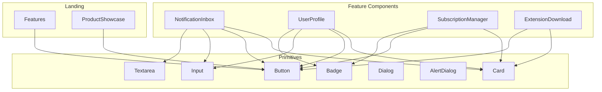

**Diagram sources**
- [notification-inbox.tsx](file://website/components/notice-reminders/notification-inbox.tsx#L1-L156)
- [user-profile.tsx](file://website/components/notice-reminders/user-profile.tsx#L1-L318)
- [subscription-manager.tsx](file://website/components/notice-reminders/subscription-manager.tsx#L1-L260)
- [extension-download.tsx](file://website/components/assignment-solver/extension-download.tsx#L1-L197)
- [features.tsx](file://website/components/landing/features.tsx#L1-L144)
- [product-showcase.tsx](file://website/components/landing/product-showcase.tsx#L1-L161)
- [button.tsx](file://website/components/ui/button.tsx#L1-L54)
- [input.tsx](file://website/components/ui/input.tsx#L1-L21)
- [textarea.tsx](file://website/components/ui/textarea.tsx#L1-L19)
- [card.tsx](file://website/components/ui/card.tsx#L1-L95)
- [dialog.tsx](file://website/components/ui/dialog.tsx#L1-L152)
- [alert-dialog.tsx](file://website/components/ui/alert-dialog.tsx#L1-L176)
- [badge.tsx](file://website/components/ui/badge.tsx#L1-L49)

## Detailed Component Analysis

### Button Component
- Variants: default, outline, secondary, ghost, destructive, link
- Sizes: default, xs, sm, lg, icon, icon-xs, icon-sm, icon-lg
- Behavior: Uses Base UI Button, adds data-slot, focus-visible ring, aria-invalid support, and pointer-events disabled when disabled.

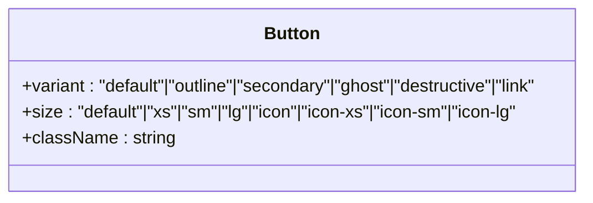

**Diagram sources**
- [button.tsx](file://website/components/ui/button.tsx#L38-L51)

**Section sources**
- [button.tsx](file://website/components/ui/button.tsx#L8-L36)
- [button.tsx](file://website/components/ui/button.tsx#L38-L51)

### Input and Textarea Components
- Input: Base input with focus-visible ring, aria-invalid support, and consistent padding.
- Textarea: Multi-line variant with similar focus and invalid states.

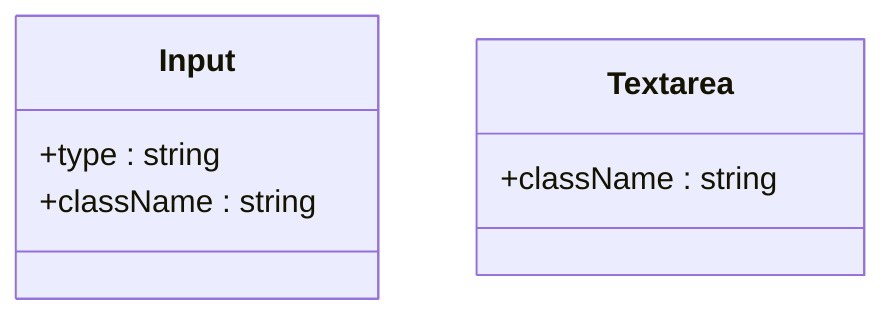

**Diagram sources**
- [input.tsx](file://website/components/ui/input.tsx#L6-L18)
- [textarea.tsx](file://website/components/ui/textarea.tsx#L5-L16)

**Section sources**
- [input.tsx](file://website/components/ui/input.tsx#L6-L18)
- [textarea.tsx](file://website/components/ui/textarea.tsx#L5-L16)

### Card Component
- Slots: header, title, description, action, content, footer
- Size variants: default, sm
- Composition: Uses data-size and data-slot attributes for consistent rendering.

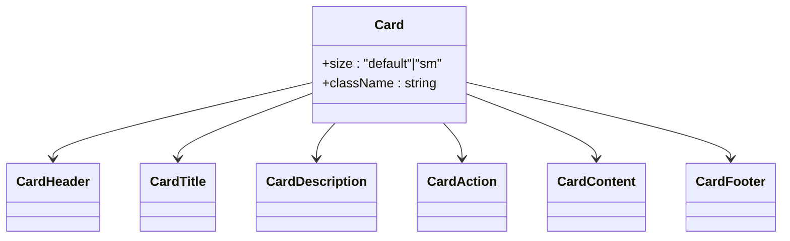

**Diagram sources**
- [card.tsx](file://website/components/ui/card.tsx#L5-L18)
- [card.tsx](file://website/components/ui/card.tsx#L20-L84)

**Section sources**
- [card.tsx](file://website/components/ui/card.tsx#L5-L18)
- [card.tsx](file://website/components/ui/card.tsx#L20-L84)

### Dialog and AlertDialog Components
- Dialog: Root, Trigger, Portal, Close, Overlay, Content, Header, Footer, Title, Description.
- AlertDialog: Root, Trigger, Portal, Overlay, Content (with size), Header, Footer, Media, Title, Description, Action, Cancel.

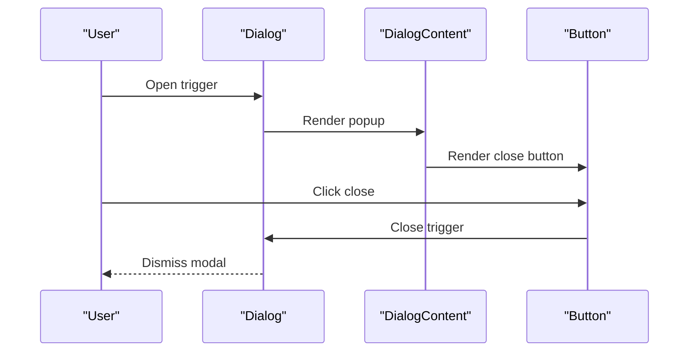

**Diagram sources**
- [dialog.tsx](file://website/components/ui/dialog.tsx#L10-L78)
- [button.tsx](file://website/components/ui/button.tsx#L38-L51)

**Section sources**
- [dialog.tsx](file://website/components/ui/dialog.tsx#L10-L152)
- [alert-dialog.tsx](file://website/components/ui/alert-dialog.tsx#L9-L176)

### Badge Component
- Variants: default, secondary, destructive, outline, ghost, link
- Composition: Uses Base UI renderer with data-slot and variant tokens.

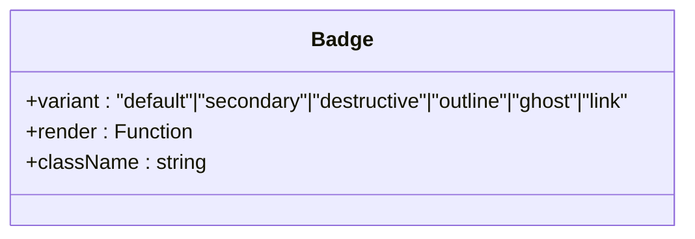

**Diagram sources**
- [badge.tsx](file://website/components/ui/badge.tsx#L26-L46)

**Section sources**
- [badge.tsx](file://website/components/ui/badge.tsx#L7-L24)
- [badge.tsx](file://website/components/ui/badge.tsx#L26-L46)

### Notice Reminders Components

#### NotificationInbox
- Fetches notifications via React Query, displays unread count, and allows marking as read.
- Composes Card, Button, Input, and Badge for a cohesive inbox experience.

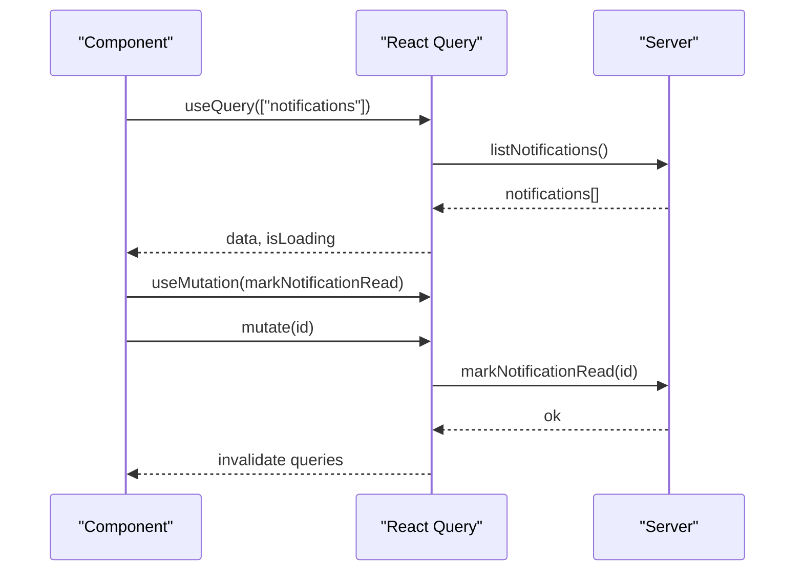

**Diagram sources**
- [notification-inbox.tsx](file://website/components/notice-reminders/notification-inbox.tsx#L23-L41)

**Section sources**
- [notification-inbox.tsx](file://website/components/notice-reminders/notification-inbox.tsx#L23-L156)

#### UserProfile
- Manages user profile editing, channel listing, and account deletion with confirmations.
- Uses Input, Label, Card, Badge, and Button for form and profile display.

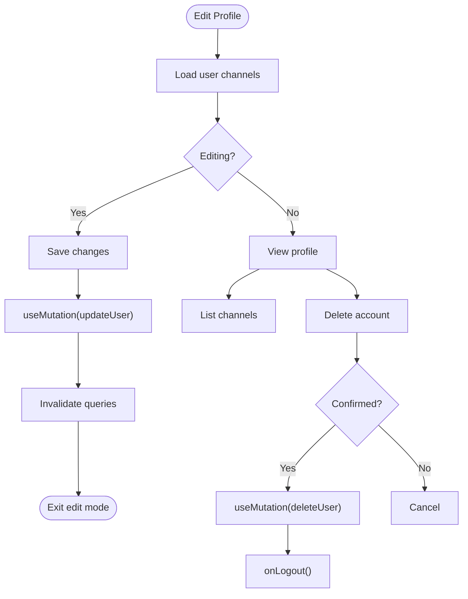

**Diagram sources**
- [user-profile.tsx](file://website/components/notice-reminders/user-profile.tsx#L35-L63)

**Section sources**
- [user-profile.tsx](file://website/components/notice-reminders/user-profile.tsx#L30-L318)

#### SubscriptionManager
- Lists subscriptions, expands to show course details and recent announcements, and supports deletion.
- Uses Card, Button, Badge, and Link for navigation.

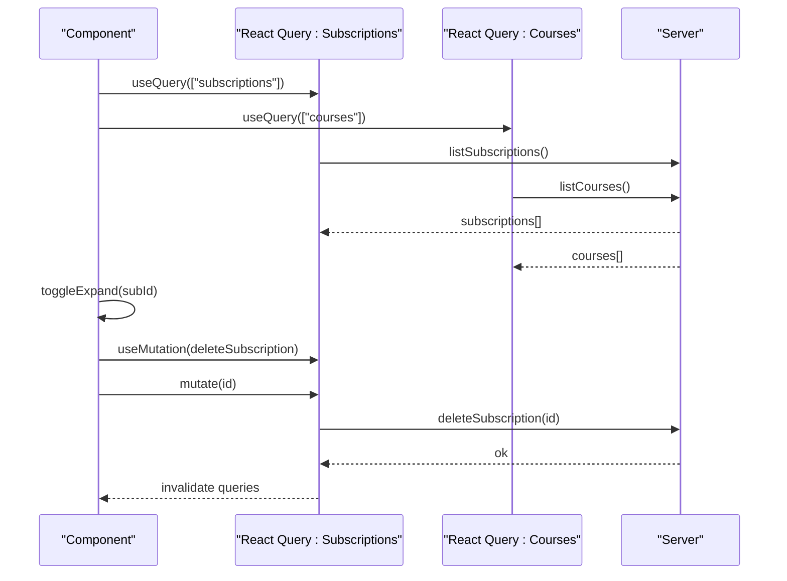

**Diagram sources**
- [subscription-manager.tsx](file://website/components/notice-reminders/subscription-manager.tsx#L33-L59)

**Section sources**
- [subscription-manager.tsx](file://website/components/notice-reminders/subscription-manager.tsx#L33-L260)

### Assignment Solver Components

#### ExtensionDownload
- Promotes browser extension installation via store links and manual steps.
- Uses Card, Button, and Badge for structured presentation.

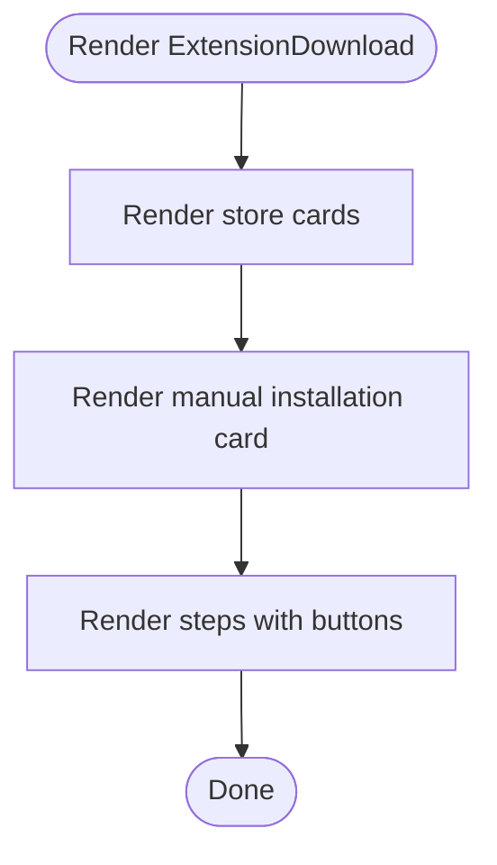

**Diagram sources**
- [extension-download.tsx](file://website/components/assignment-solver/extension-download.tsx#L13-L115)

**Section sources**
- [extension-download.tsx](file://website/components/assignment-solver/extension-download.tsx#L1-L197)

### Landing Page Components

#### Features
- Displays feature highlights for assignment solver and placeholders for notice reminders.
- Uses Button variants and layout tokens for visual emphasis.

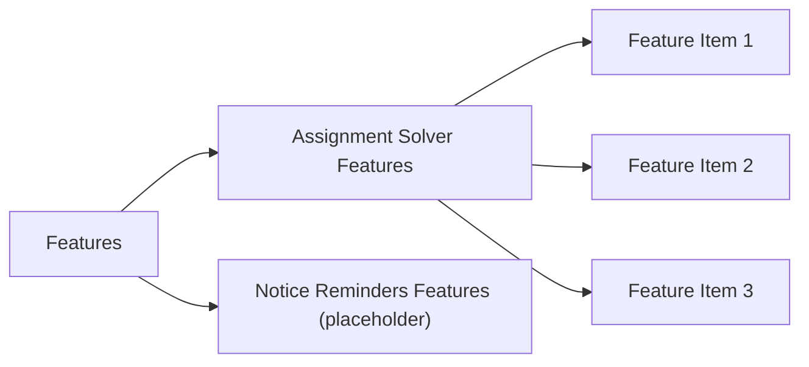

**Diagram sources**
- [features.tsx](file://website/components/landing/features.tsx#L45-L144)

**Section sources**
- [features.tsx](file://website/components/landing/features.tsx#L1-L144)

#### ProductShowcase
- Highlights two tools with feature lists and CTAs; one is active, the other marked as coming soon.
- Uses Button variants and gradient accents.

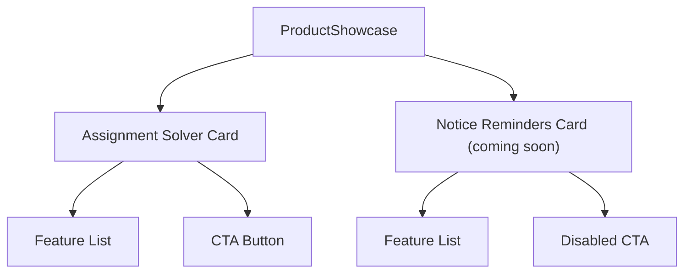

**Diagram sources**
- [product-showcase.tsx](file://website/components/landing/product-showcase.tsx#L8-L161)

**Section sources**
- [product-showcase.tsx](file://website/components/landing/product-showcase.tsx#L1-L161)

## Dependency Analysis
Component dependencies and coupling:
- Feature components depend on primitives (Button, Input, Card, Badge) for consistent styling and behavior.
- Notice reminders components integrate with React Query for data fetching and mutations.
- Landing components depend on Button variants and layout utilities for visual consistency.

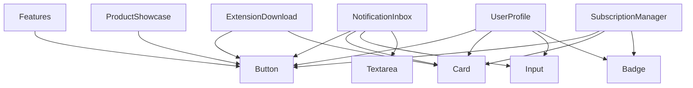

**Diagram sources**
- [notification-inbox.tsx](file://website/components/notice-reminders/notification-inbox.tsx#L1-L156)
- [user-profile.tsx](file://website/components/notice-reminders/user-profile.tsx#L1-L318)
- [subscription-manager.tsx](file://website/components/notice-reminders/subscription-manager.tsx#L1-L260)
- [extension-download.tsx](file://website/components/assignment-solver/extension-download.tsx#L1-L197)
- [features.tsx](file://website/components/landing/features.tsx#L1-L144)
- [product-showcase.tsx](file://website/components/landing/product-showcase.tsx#L1-L161)
- [button.tsx](file://website/components/ui/button.tsx#L1-L54)
- [input.tsx](file://website/components/ui/input.tsx#L1-L21)
- [textarea.tsx](file://website/components/ui/textarea.tsx#L1-L19)
- [card.tsx](file://website/components/ui/card.tsx#L1-L95)
- [badge.tsx](file://website/components/ui/badge.tsx#L1-L49)

**Section sources**
- [notification-inbox.tsx](file://website/components/notice-reminders/notification-inbox.tsx#L1-L156)
- [user-profile.tsx](file://website/components/notice-reminders/user-profile.tsx#L1-L318)
- [subscription-manager.tsx](file://website/components/notice-reminders/subscription-manager.tsx#L1-L260)
- [extension-download.tsx](file://website/components/assignment-solver/extension-download.tsx#L1-L197)
- [features.tsx](file://website/components/landing/features.tsx#L1-L144)
- [product-showcase.tsx](file://website/components/landing/product-showcase.tsx#L1-L161)

## Performance Considerations
- Prefer variant and size tokens over ad-hoc classes to reduce CSS bloat.
- Use data-slot attributes to minimize reflows during dynamic updates.
- Lazy-load heavy feature components (e.g., subscription announcements preview) to defer computation.
- Keep mutation caches minimal; invalidate only affected query keys to avoid unnecessary refetches.
- Use CSS containment and transform-based animations sparingly to maintain smooth interactions.

## Accessibility Compliance
- Focus management: All interactive primitives expose focus-visible rings and outline-none where appropriate.
- ARIA integration: Inputs support aria-invalid for validation feedback; dialogs include sr-only labels for close buttons.
- Semantic markup: Components render semantic HTML elements (button, input, textarea) with proper roles.
- Keyboard navigation: Triggers and controls are keyboard accessible via Base UI primitives.
- Screen reader support: Icons include sr-only text where needed; dialogs provide titles and descriptions.

**Section sources**
- [button.tsx](file://website/components/ui/button.tsx#L8-L10)
- [input.tsx](file://website/components/ui/input.tsx#L6-L18)
- [dialog.tsx](file://website/components/ui/dialog.tsx#L59-L74)
- [alert-dialog.tsx](file://website/components/ui/alert-dialog.tsx#L132-L160)

## Responsive Design Implementation
- Breakpoints: Components use responsive utilities (e.g., sm:, md:) to adapt layouts across screen sizes.
- Typography: Heading and text utilities scale appropriately with container widths.
- Spacing: Consistent padding and margin tokens ensure readable layouts on mobile and desktop.
- Grids and flex: Cards and landing sections use grid and flex utilities to stack or align content responsively.

**Section sources**
- [dialog.tsx](file://website/components/ui/dialog.tsx#L50-L57)
- [card.tsx](file://website/components/ui/card.tsx#L11-L17)
- [features.tsx](file://website/components/landing/features.tsx#L47-L144)
- [product-showcase.tsx](file://website/components/landing/product-showcase.tsx#L10-L161)

## Troubleshooting Guide
Common issues and resolutions:
- Button disabled state not applying: Verify disabled prop is passed and pointer-events-none is included in variant classes.
- Dialog close button not visible: Ensure showCloseButton is true and Button variant/size are set correctly.
- Input focus ring not visible: Confirm focus-visible ring classes are present and not overridden by custom styles.
- Badge variant mismatch: Check variant prop matches available options and data-slot is set.
- NotificationInbox not updating after read: Ensure query key invalidation occurs on mutation success.
- SubscriptionManager expansion not toggling: Verify expandedSub state and toggle handler logic.

**Section sources**
- [button.tsx](file://website/components/ui/button.tsx#L38-L51)
- [dialog.tsx](file://website/components/ui/dialog.tsx#L39-L78)
- [input.tsx](file://website/components/ui/input.tsx#L6-L18)
- [badge.tsx](file://website/components/ui/badge.tsx#L26-L46)
- [notification-inbox.tsx](file://website/components/notice-reminders/notification-inbox.tsx#L34-L41)
- [subscription-manager.tsx](file://website/components/notice-reminders/subscription-manager.tsx#L61-L63)

## Conclusion
The UI component library provides a consistent, accessible, and responsive foundation for the application. By composing primitive components and leveraging CVA for variants, teams can rapidly build feature-rich pages while maintaining design system coherence. Notice reminders and landing components demonstrate practical usage patterns for real-world scenarios, ensuring maintainability and scalability.