# UI components

## Introduction
This page describes the reusable UI component library used across the Next.js website application. It covers shared components (buttons, forms, dialogs, cards, inputs), notice reminders components for subscription management and user profiles, assignment solver components for extension download and integration, and landing page components showing features and product showcase. The guide explains component props, customization options, styling approaches using Tailwind CSS and class variance authority (CVA), component composition patterns, accessibility compliance, and responsive design implementation.

## Project structure
The UI library is organized under website/components/ui with reusable base components and specialized components grouped by feature area:
- Shared UI primitives: button, input, textarea, card, dialog, alert-dialog, badge
- Feature-specific components: notice reminders (inbox, subscription manager, user profile), assignment solver (extension download), landing page components (features, product showcase)

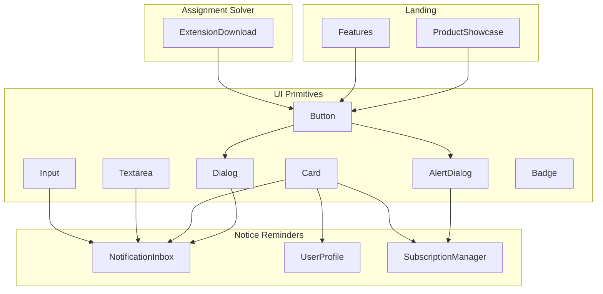
```mermaid
graph TB
subgraph "UI Primitives"
B["Button"]
I["Input"]
T["Textarea"]
C["Card"]
D["Dialog"]
AD["AlertDialog"]
BD["Badge"]
end
subgraph "Notice Reminders"
NI["NotificationInbox"]
UP["UserProfile"]
SM["SubscriptionManager"]
end
subgraph "Assignment Solver"
ED["ExtensionDownload"]
end
subgraph "Landing"
FE["Features"]
PS["ProductShowcase"]
end
B --> D
B --> AD
I --> NI
T --> NI
C --> NI
C --> UP
C --> SM
D --> NI
AD --> SM
ED --> B
FE --> B
PS --> B
```

## Core components
This section documents the shared UI primitives that form the foundation of the component library.

- Button
  - Purpose: Primary interactive element with variant and size variants.
  - Props:
    - variant: default, outline, secondary, ghost, destructive, link
    - size: default, xs, sm, lg, icon, icon-xs, icon-sm, icon-lg
    - className: optional tailwind classes
  - Customization: Uses CVA for variant and size tokens; integrates with data-slot attributes for consistent styling.
  - Accessibility: Inherits focus-visible ring and aria-invalid states for form integration.

- Input
  - Purpose: Text input primitive with consistent focus states and invalid feedback.
  - Props: type, className, plus standard input attributes.
  - Customization: Tailwind classes applied via cn; integrates aria-invalid for form validation.

- Textarea
  - Purpose: Multi-line text input with consistent focus and invalid states.
  - Props: className, plus standard textarea attributes.

- Card
  - Purpose: Container with header, title, description, action, content, and footer slots.
  - Props:
    - size: default, sm
    - className
  - Slots: card-header, card-title, card-description, card-action, card-content, card-footer.

- Dialog
  - Purpose: Modal overlay with trigger, portal, close, overlay, content, header, footer, title, and description.
  - Props:
    - DialogContent: showCloseButton flag
    - DialogFooter: showCloseButton flag
    - size variants for alert-style dialogs
  - Composition: Composes Base UI Dialog with internal Button and XIcon for close.

- AlertDialog
  - Purpose: Confirmation dialog with action and cancel bindings to Button.
  - Props:
    - size: default, sm
    - AlertDialogAction: Button props
    - AlertDialogCancel: variant, size defaults to outline, default size

- Badge
  - Purpose: Label or indicator with variant variants.
  - Props:
    - variant: default, secondary, destructive, outline, ghost, link
    - render: optional renderer for advanced composition
    - className

Styling approach
- Tailwind classes are combined using cn from lib/utils.
- CVA defines variant and size tokens for Buttons and Badges.
- Focus-visible rings and aria-invalid states ensure accessible feedback.
- Responsive breakpoints and spacing tokens are used consistently across components.

## Architecture overview
The UI library follows a composition-first pattern:
- Primitive components (Button, Input, Card) encapsulate base styling and behavior.
- Feature components (NotificationInbox, UserProfile, SubscriptionManager) compose primitives to implement domain logic.
- Landing components (Features, ProductShowcase) demonstrate product capabilities using primitives and links.

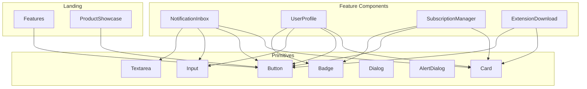
```mermaid
graph TB
subgraph "Primitives"
B["Button"]
I["Input"]
T["Textarea"]
C["Card"]
D["Dialog"]
AD["AlertDialog"]
BD["Badge"]
end
subgraph "Feature Components"
NI["NotificationInbox"]
UP["UserProfile"]
SM["SubscriptionManager"]
ED["ExtensionDownload"]
end
subgraph "Landing"
FE["Features"]
PS["ProductShowcase"]
end
NI --> C
NI --> B
NI --> I
NI --> T
UP --> C
UP --> B
UP --> I
UP --> BD
SM --> C
SM --> B
SM --> BD
ED --> C
ED --> B
FE --> B
PS --> B
```

## Detailed component analysis

### Button component
- Variants: default, outline, secondary, ghost, destructive, link
- Sizes: default, xs, sm, lg, icon, icon-xs, icon-sm, icon-lg
- Behavior: Uses Base UI Button, adds data-slot, focus-visible ring, aria-invalid support, and pointer-events disabled when disabled.

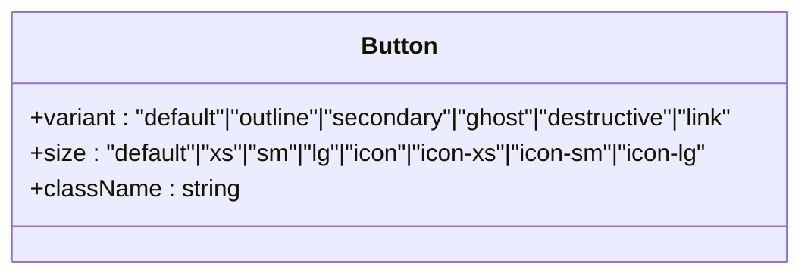
```mermaid
classDiagram
class Button {
+variant : "default"|"outline"|"secondary"|"ghost"|"destructive"|"link"
+size : "default"|"xs"|"sm"|"lg"|"icon"|"icon-xs"|"icon-sm"|"icon-lg"
+className : string
}
```

### Input and textarea components
- Input: Base input with focus-visible ring, aria-invalid support, and consistent padding.
- Textarea: Multi-line variant with similar focus and invalid states.

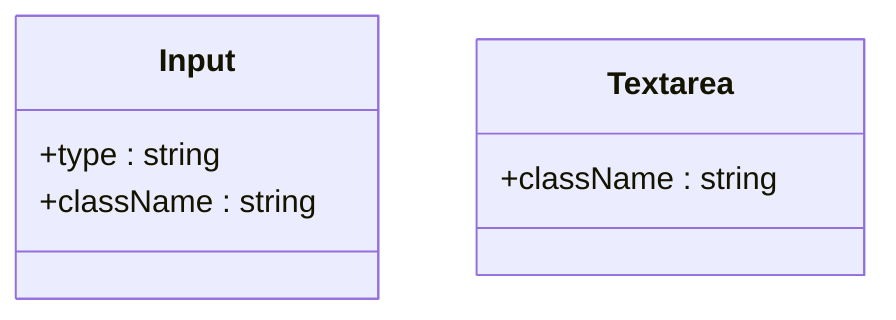
```mermaid
classDiagram
class Input {
+type : string
+className : string
}
class Textarea {
+className : string
}
```

### Card component
- Slots: header, title, description, action, content, footer
- Size variants: default, sm
- Composition: Uses data-size and data-slot attributes for consistent rendering.

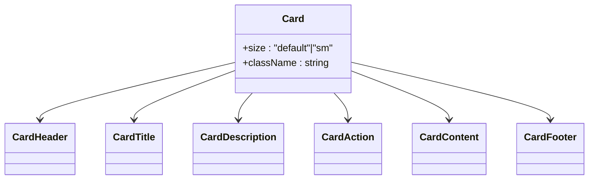
```mermaid
classDiagram
class Card {
+size : "default"|"sm"
+className : string
}
class CardHeader
class CardTitle
class CardDescription
class CardAction
class CardContent
class CardFooter
Card --> CardHeader
Card --> CardTitle
Card --> CardDescription
Card --> CardAction
Card --> CardContent
Card --> CardFooter
```

### Dialog and AlertDialog components
- Dialog: Root, Trigger, Portal, Close, Overlay, Content, Header, Footer, Title, Description.
- AlertDialog: Root, Trigger, Portal, Overlay, Content (with size), Header, Footer, Media, Title, Description, Action, Cancel.

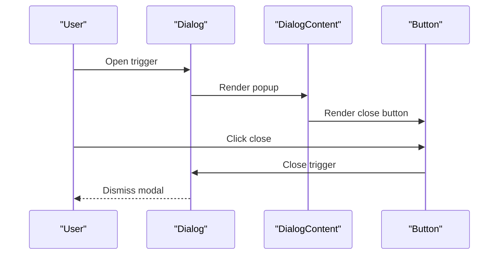
```mermaid
sequenceDiagram
participant U as "User"
participant D as "Dialog"
participant DC as "DialogContent"
participant B as "Button"
U->>D : Open trigger
D->>DC : Render popup
DC->>B : Render close button
U->>B : Click close
B->>D : Close trigger
D-->>U : Dismiss modal
```

### Badge component
- Variants: default, secondary, destructive, outline, ghost, link
- Composition: Uses Base UI renderer with data-slot and variant tokens.

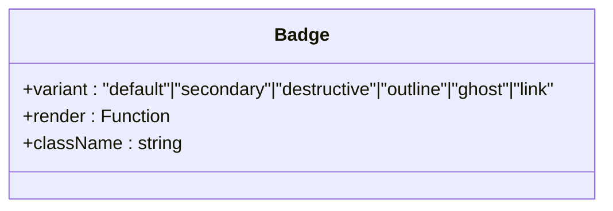
```mermaid
classDiagram
class Badge {
+variant : "default"|"secondary"|"destructive"|"outline"|"ghost"|"link"
+render : Function
+className : string
}
```

### Notice reminders components

#### NotificationInbox
- Fetches notifications via React Query, displays unread count, and allows marking as read.
- Composes Card, Button, Input, and Badge for a cohesive inbox experience.

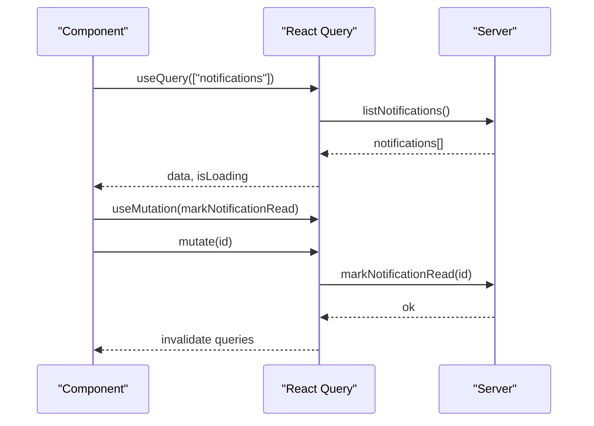
```mermaid
sequenceDiagram
participant C as "Component"
participant Q as "React Query"
participant S as "Server"
C->>Q : useQuery(["notifications"])
Q->>S : listNotifications()
S-->>Q : notifications[]
Q-->>C : data, isLoading
C->>Q : useMutation(markNotificationRead)
C->>Q : mutate(id)
Q->>S : markNotificationRead(id)
S-->>Q : ok
Q-->>C : invalidate queries
```

#### UserProfile
- Manages user profile editing, channel listing, and account deletion with confirmations.
- Uses Input, Label, Card, Badge, and Button for form and profile display.

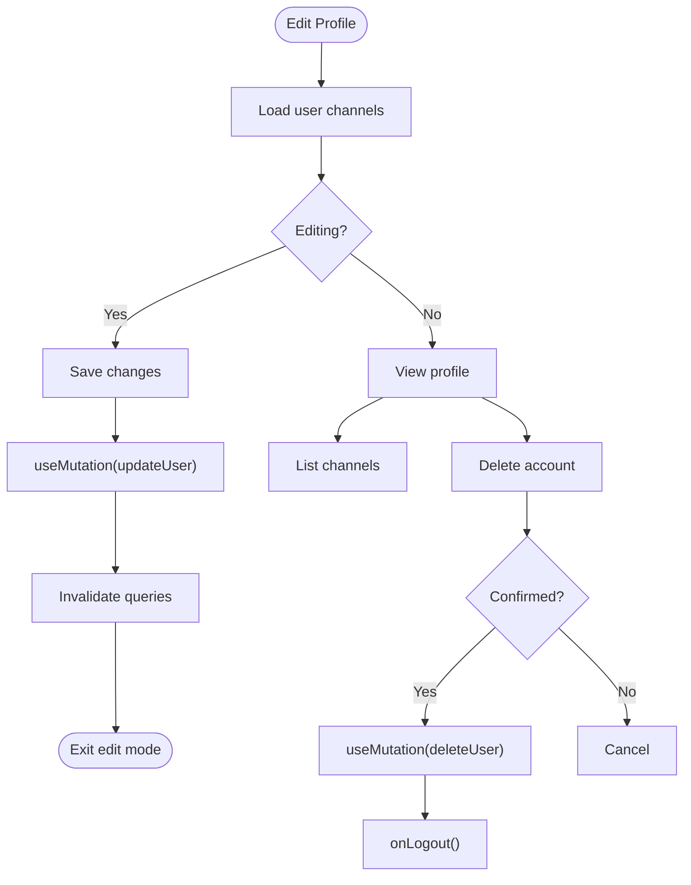
```mermaid
flowchart TD
Start([Edit Profile]) --> Load["Load user channels"]
Load --> Edit{"Editing?"}
Edit --> |Yes| Save["Save changes"]
Save --> Update["useMutation(updateUser)"]
Update --> Invalidate["Invalidate queries"]
Invalidate --> Exit([Exit edit mode])
Edit --> |No| View["View profile"]
View --> Channels["List channels"]
View --> Delete["Delete account"]
Delete --> Confirm{"Confirmed?"}
Confirm --> |Yes| Remove["useMutation(deleteUser)"]
Remove --> Logout["onLogout()"]
Confirm --> |No| Cancel["Cancel"]
```

#### SubscriptionManager
- Lists subscriptions, expands to show course details and recent announcements, and supports deletion.
- Uses Card, Button, Badge, and Link for navigation.

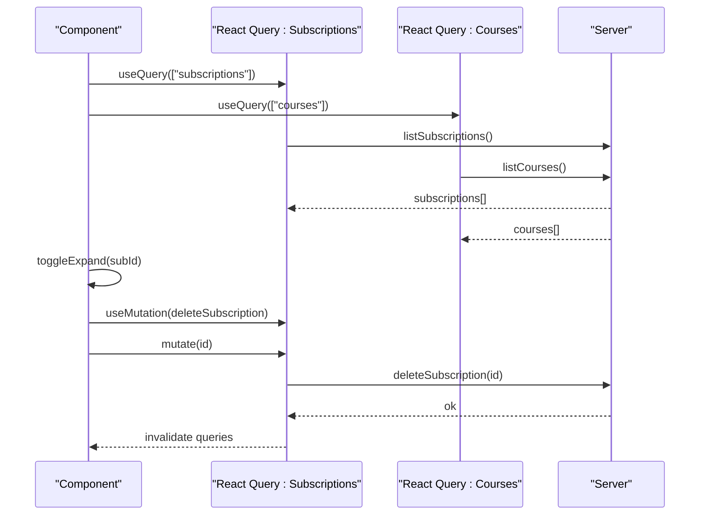
```mermaid
sequenceDiagram
participant C as "Component"
participant Q1 as "React Query : Subscriptions"
participant Q2 as "React Query : Courses"
participant S as "Server"
C->>Q1 : useQuery(["subscriptions"])
C->>Q2 : useQuery(["courses"])
Q1->>S : listSubscriptions()
Q2->>S : listCourses()
S-->>Q1 : subscriptions[]
S-->>Q2 : courses[]
C->>C : toggleExpand(subId)
C->>Q1 : useMutation(deleteSubscription)
C->>Q1 : mutate(id)
Q1->>S : deleteSubscription(id)
S-->>Q1 : ok
Q1-->>C : invalidate queries
```

### Assignment solver components

#### ExtensionDownload
- Promotes browser extension installation via store links and manual steps.
- Uses Card, Button, and Badge for structured presentation.

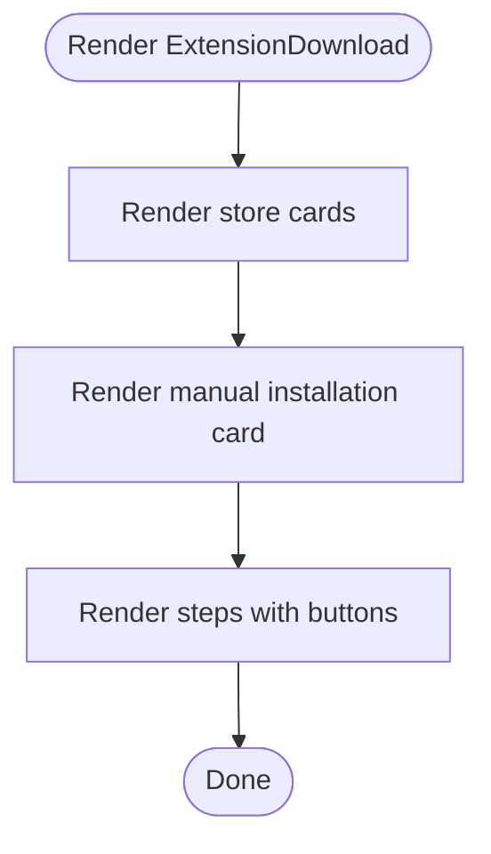
```mermaid
flowchart TD
Start([Render ExtensionDownload]) --> Stores["Render store cards"]
Stores --> Manual["Render manual installation card"]
Manual --> Steps["Render steps with buttons"]
Steps --> End([Done])
```

### Landing page components

#### Features
- Displays feature highlights for assignment solver and placeholders for notice reminders.
- Uses Button variants and layout tokens for visual emphasis.

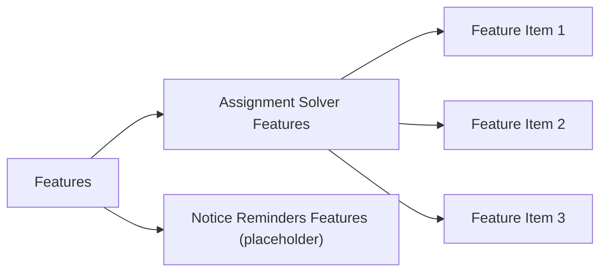
```mermaid
graph LR
F["Features"] --> AF["Assignment Solver Features"]
F --> NF["Notice Reminders Features (placeholder)"]
AF --> Item1["Feature Item 1"]
AF --> Item2["Feature Item 2"]
AF --> Item3["Feature Item 3"]
```

#### ProductShowcase
- Highlights two tools with feature lists and CTAs; one is active, the other marked as coming soon.
- Uses Button variants and gradient accents.

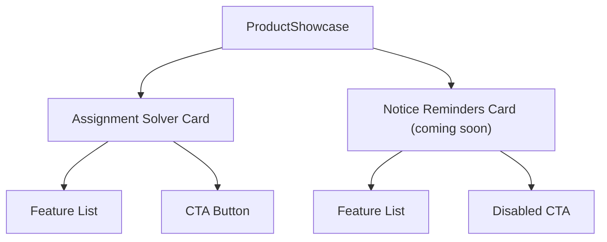
```mermaid
graph TB
PS["ProductShowcase"] --> AS["Assignment Solver Card"]
PS --> NR["Notice Reminders Card (coming soon)"]
AS --> ASFeatures["Feature List"]
AS --> ASCta["CTA Button"]
NR --> NRFeatures["Feature List"]
NR --> NRDisabled["Disabled CTA"]
```

## Dependency analysis
Component dependencies and coupling:
- Feature components depend on primitives (Button, Input, Card, Badge) for consistent styling and behavior.
- Notice reminders components integrate with React Query for data fetching and mutations.
- Landing components depend on Button variants and layout utilities for visual consistency.

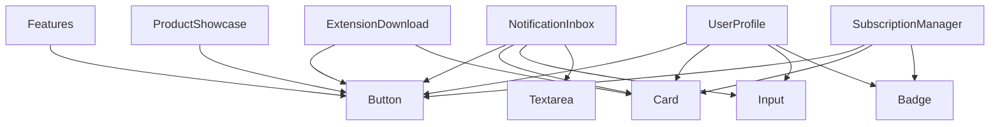
```mermaid
graph TB
NI["NotificationInbox"] --> B["Button"]
NI --> C["Card"]
NI --> I["Input"]
NI --> T["Textarea"]
UP["UserProfile"] --> B
UP --> C
UP --> I
UP --> BD["Badge"]
SM["SubscriptionManager"] --> B
SM --> C
SM --> BD
ED["ExtensionDownload"] --> B
ED --> C
FE["Features"] --> B
PS["ProductShowcase"] --> B
```

## Performance considerations
- Prefer variant and size tokens over ad-hoc classes to reduce CSS bloat.
- Use data-slot attributes to minimize reflows during dynamic updates.
- Lazy-load heavy feature components (e.g., subscription announcements preview) to defer computation.
- Keep mutation caches minimal; invalidate only affected query keys to avoid unnecessary refetches.
- Use CSS containment and transform-based animations sparingly to maintain smooth interactions.

## Accessibility compliance
- Focus management: All interactive primitives expose focus-visible rings and outline-none where appropriate.
- ARIA integration: Inputs support aria-invalid for validation feedback; dialogs include sr-only labels for close buttons.
- Semantic markup: Components render semantic HTML elements (button, input, textarea) with proper roles.
- Keyboard navigation: Triggers and controls are keyboard accessible via Base UI primitives.
- Screen reader support: Icons include sr-only text where needed; dialogs provide titles and descriptions.

## Responsive design implementation
- Breakpoints: Components use responsive utilities (e.g., sm:, md:) to adapt layouts across screen sizes.
- Typography: Heading and text utilities scale appropriately with container widths.
- Spacing: Consistent padding and margin tokens ensure readable layouts on mobile and desktop.
- Grids and flex: Cards and landing sections use grid and flex utilities to stack or align content responsively.

## Troubleshooting guide
Common issues and resolutions:
- Button disabled state not applying: Verify disabled prop is passed and pointer-events-none is included in variant classes.
- Dialog close button not visible: Ensure showCloseButton is true and Button variant/size are set correctly.
- Input focus ring not visible: Confirm focus-visible ring classes are present and not overridden by custom styles.
- Badge variant mismatch: Check variant prop matches available options and data-slot is set.
- NotificationInbox not updating after read: Ensure query key invalidation occurs on mutation success.
- SubscriptionManager expansion not toggling: Verify expandedSub state and toggle handler logic.

## Conclusion
The UI component library provides a consistent, accessible, and responsive foundation for the application. By composing primitive components and using CVA for variants, teams can rapidly build feature-rich pages while maintaining design system coherence. Notice reminders and landing components demonstrate practical usage patterns for real-world scenarios, ensuring maintainability and scalability.
