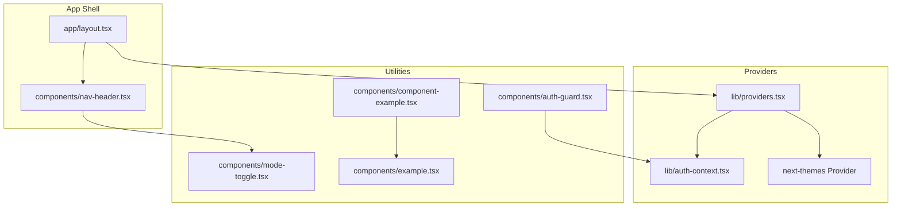
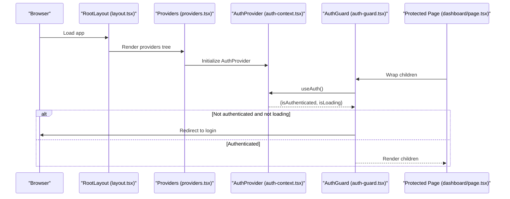
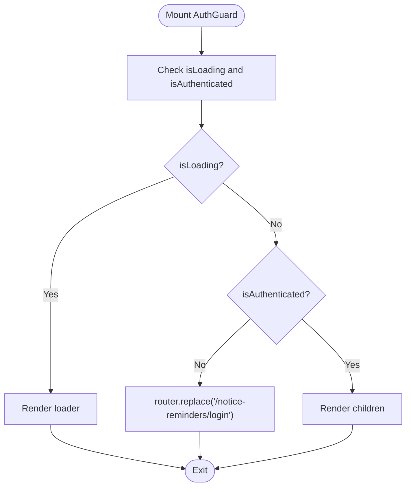
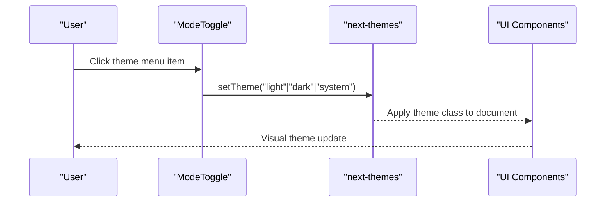
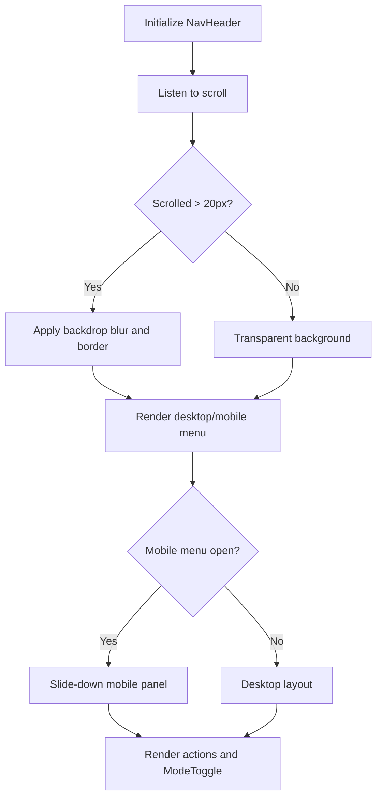
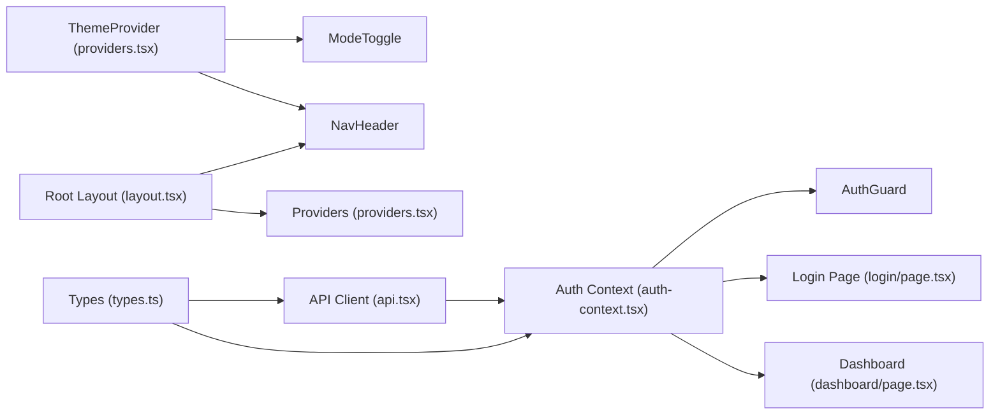

# Utility Components

<cite>
**Referenced Files in This Document**
- [auth-guard.tsx](file://website/components/auth-guard.tsx)
- [mode-toggle.tsx](file://website/components/mode-toggle.tsx)
- [nav-header.tsx](file://website/components/nav-header.tsx)
- [component-example.tsx](file://website/components/component-example.tsx)
- [example.tsx](file://website/components/example.tsx)
- [auth-context.tsx](file://website/lib/auth-context.tsx)
- [providers.tsx](file://website/lib/providers.tsx)
- [layout.tsx](file://website/app/layout.tsx)
- [login/page.tsx](file://website/app/notice-reminders/login/page.tsx)
- [dashboard/page.tsx](file://website/app/notice-reminders/dashboard/page.tsx)
- [page.tsx](file://website/app/page.tsx)
- [types.ts](file://website/lib/types.ts)
- [api.ts](file://website/lib/api.ts)
</cite>

## Table of Contents
1. [Introduction](#introduction)
2. [Project Structure](#project-structure)
3. [Core Components](#core-components)
4. [Architecture Overview](#architecture-overview)
5. [Detailed Component Analysis](#detailed-component-analysis)
6. [Dependency Analysis](#dependency-analysis)
7. [Performance Considerations](#performance-considerations)
8. [Troubleshooting Guide](#troubleshooting-guide)
9. [Conclusion](#conclusion)

## Introduction
This document explains the utility and helper components that support the overall application functionality. It focuses on:
- AuthGuard: route protection and authentication state management
- ModeToggle: dark/light/system theme switching
- NavHeader: navigation and branding
- Example components: development reference and UI showcase

It describes responsibilities, integration patterns with the authentication system, props and events, and how these components contribute to user experience and application architecture.

## Project Structure
The utility components live under website/components and integrate with the authentication provider and theme provider via website/lib/providers. The layout composes NavHeader globally, while AuthGuard wraps protected routes.

**Diagram sources**
- [layout.tsx](file://website/app/layout.tsx#L81-L98)
- [providers.tsx](file://website/lib/providers.tsx#L10-L40)
- [auth-context.tsx](file://website/lib/auth-context.tsx#L21-L88)
- [nav-header.tsx](file://website/components/nav-header.tsx#L10-L139)
- [mode-toggle.tsx](file://website/components/mode-toggle.tsx#L15-L42)
- [auth-guard.tsx](file://website/components/auth-guard.tsx#L8-L27)
- [component-example.tsx](file://website/components/component-example.tsx#L70-L77)
- [example.tsx](file://website/components/example.tsx#L3-L17)

**Section sources**
- [layout.tsx](file://website/app/layout.tsx#L81-L98)
- [providers.tsx](file://website/lib/providers.tsx#L10-L40)

## Core Components
- AuthGuard: Protects routes by checking authentication state and redirecting unauthenticated users to the login page while rendering a loading indicator during initialization.
- ModeToggle: Provides theme switching (light, dark, system) using next-themes and UI dropdown primitives.
- NavHeader: Implements responsive navigation with logo, desktop links, action buttons, and mobile menu, integrating ModeToggle and scroll-aware styling.
- Example components: Provide a development reference and showcase of UI primitives for cards, forms, dialogs, and menus.

**Section sources**
- [auth-guard.tsx](file://website/components/auth-guard.tsx#L8-L27)
- [mode-toggle.tsx](file://website/components/mode-toggle.tsx#L15-L42)
- [nav-header.tsx](file://website/components/nav-header.tsx#L10-L139)
- [component-example.tsx](file://website/components/component-example.tsx#L70-L77)
- [example.tsx](file://website/components/example.tsx#L3-L17)

## Architecture Overview
The authentication and theming systems are initialized at the root level and consumed by utility components and pages.

**Diagram sources**
- [layout.tsx](file://website/app/layout.tsx#L81-L98)
- [providers.tsx](file://website/lib/providers.tsx#L24-L37)
- [auth-context.tsx](file://website/lib/auth-context.tsx#L21-L88)
- [auth-guard.tsx](file://website/components/auth-guard.tsx#L8-L27)
- [dashboard/page.tsx](file://website/app/notice-reminders/dashboard/page.tsx#L17-L49)

## Detailed Component Analysis

### AuthGuard
Responsibilities:
- Enforce authentication for protected routes
- Prevent rendering until authentication state is determined
- Redirect unauthenticated users to the login page

Integration with authentication system:
- Consumes useAuth from AuthProvider to access isAuthenticated and isLoading
- Uses Next.js router to replace the current route to the login page when unauthenticated

Props:
- children: ReactNode (content to render when authenticated)

Events:
- None (purely declarative)

Behavior:
- On mount, checks isLoading and isAuthenticated
- If not authenticated and not loading, redirects to the notice-reminders login page
- Renders a centered loader while determining auth state
- Once authenticated, renders children

Usage contexts:
- Wraps pages that require login (e.g., dashboard)
- Can wrap any route segment requiring authentication

**Diagram sources**
- [auth-guard.tsx](file://website/components/auth-guard.tsx#L8-L27)

**Section sources**
- [auth-guard.tsx](file://website/components/auth-guard.tsx#L8-L27)
- [auth-context.tsx](file://website/lib/auth-context.tsx#L90-L96)
- [providers.tsx](file://website/lib/providers.tsx#L24-L37)
- [dashboard/page.tsx](file://website/app/notice-reminders/dashboard/page.tsx#L17-L49)

### ModeToggle
Responsibilities:
- Allow users to switch themes: light, dark, or system preference
- Provide a visual toggle with sun/moon icons and keyboard-accessible labels

Integration with theming system:
- Uses next-themes useTheme to set the theme
- Renders a dropdown menu with theme options

Props:
- None (no props required)

Events:
- onClick handlers on menu items call setTheme with "light", "dark", or "system"

UI composition:
- Uses Button and DropdownMenu primitives
- Icons change based on current theme (sun/moon rotation and scaling)

**Diagram sources**
- [mode-toggle.tsx](file://website/components/mode-toggle.tsx#L15-L42)

**Section sources**
- [mode-toggle.tsx](file://website/components/mode-toggle.tsx#L15-L42)
- [providers.tsx](file://website/lib/providers.tsx#L26-L36)
- [nav-header.tsx](file://website/components/nav-header.tsx#L72-L72)

### NavHeader
Responsibilities:
- Provide global navigation and branding
- Offer responsive behavior (desktop vs mobile)
- Integrate theme switching and call-to-action buttons

Key features:
- Scroll-aware header styling (background blur and border on scroll)
- Desktop navigation links and action buttons
- Mobile hamburger menu with animated slide-in
- Logo with hover scaling effect
- Integrates ModeToggle for theme switching

Props:
- None (no props required)

Events:
- Toggling mobile menu via internal state
- Navigation link clicks (standard anchor navigation)

Responsive behavior:
- Desktop: displays links and actions inline
- Mobile: collapses into a slide-down menu with theme toggle and primary action

**Diagram sources**
- [nav-header.tsx](file://website/components/nav-header.tsx#L10-L139)

**Section sources**
- [nav-header.tsx](file://website/components/nav-header.tsx#L10-L139)
- [layout.tsx](file://website/app/layout.tsx#L81-L98)
- [mode-toggle.tsx](file://website/components/mode-toggle.tsx#L15-L42)

### Example Components (Development Reference)
Responsibilities:
- Demonstrate UI primitives usage for cards, forms, alerts, and dropdowns
- Serve as a living reference for component composition and styling

Composition:
- ComponentExample orchestrates multiple examples
- ExampleWrapper provides a responsive grid layout for examples
- Example wraps individual examples with optional titles and borders

Usage:
- Used in development and documentation contexts to show component behavior
- Demonstrates nested components like AlertDialog inside Card

**Section sources**
- [component-example.tsx](file://website/components/component-example.tsx#L70-L77)
- [example.tsx](file://website/components/example.tsx#L3-L17)

## Dependency Analysis
The components depend on shared libraries and providers:

**Diagram sources**
- [auth-context.tsx](file://website/lib/auth-context.tsx#L21-L88)
- [auth-guard.tsx](file://website/components/auth-guard.tsx#L8-L27)
- [login/page.tsx](file://website/app/notice-reminders/login/page.tsx#L19-L32)
- [dashboard/page.tsx](file://website/app/notice-reminders/dashboard/page.tsx#L17-L49)
- [providers.tsx](file://website/lib/providers.tsx#L24-L37)
- [mode-toggle.tsx](file://website/components/mode-toggle.tsx#L15-L42)
- [nav-header.tsx](file://website/components/nav-header.tsx#L10-L139)
- [layout.tsx](file://website/app/layout.tsx#L81-L98)
- [api.tsx](file://website/lib/api.ts#L149-L181)
- [types.ts](file://website/lib/types.ts#L65-L97)

**Section sources**
- [auth-context.tsx](file://website/lib/auth-context.tsx#L21-L88)
- [providers.tsx](file://website/lib/providers.tsx#L24-L37)
- [api.tsx](file://website/lib/api.ts#L149-L181)
- [types.ts](file://website/lib/types.ts#L65-L97)

## Performance Considerations
- AuthGuard defers rendering until authentication state resolves to avoid unnecessary re-renders and flicker.
- NavHeader uses passive scroll listeners and minimal state updates to keep scrolling smooth.
- ModeToggle relies on next-themes for efficient theme switching without heavy computations.
- Providers configure React Query defaults to reduce network overhead and improve caching behavior.

## Troubleshooting Guide
Common issues and resolutions:
- AuthGuard redirect loop on login:
  - Ensure the login page does not require authentication and guards against authenticated users.
  - Verify AuthProvider initializes correctly and useAuth returns expected values.
- AuthGuard shows loader indefinitely:
  - Confirm the session loading completes and isAuthenticated transitions after initial hydration.
- Theme toggle not applying:
  - Check that next-themes provider is mounted and ModeToggle invokes setTheme.
- Navigation not responsive:
  - Verify mobileOpen state toggles and Tailwind classes apply correctly on small screens.

**Section sources**
- [auth-guard.tsx](file://website/components/auth-guard.tsx#L8-L27)
- [login/page.tsx](file://website/app/notice-reminders/login/page.tsx#L19-L32)
- [providers.tsx](file://website/lib/providers.tsx#L24-L37)
- [mode-toggle.tsx](file://website/components/mode-toggle.tsx#L15-L42)
- [nav-header.tsx](file://website/components/nav-header.tsx#L10-L139)

## Conclusion
These utility components form the backbone of user experience and application structure:
- AuthGuard ensures secure access to protected areas
- ModeToggle enhances accessibility and personalization
- NavHeader delivers consistent navigation and branding across contexts
- Example components provide a practical reference for building UIs

They integrate cleanly with the authentication and theming providers, enabling scalable and maintainable frontend architecture.