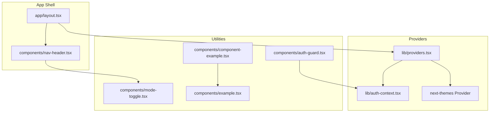
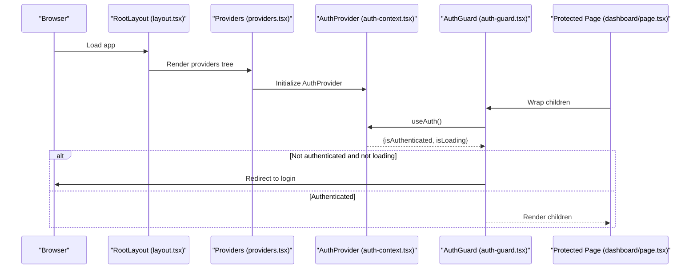
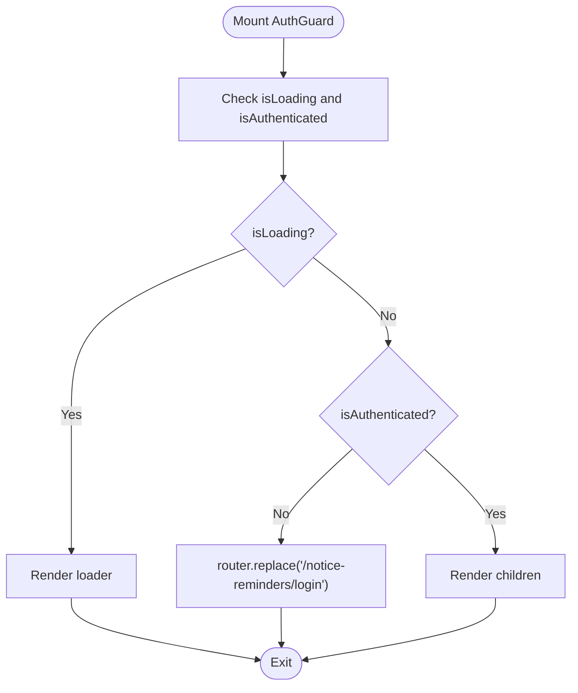
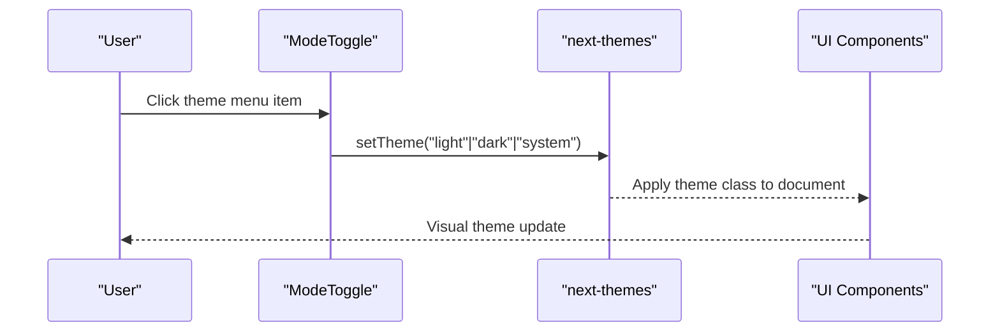
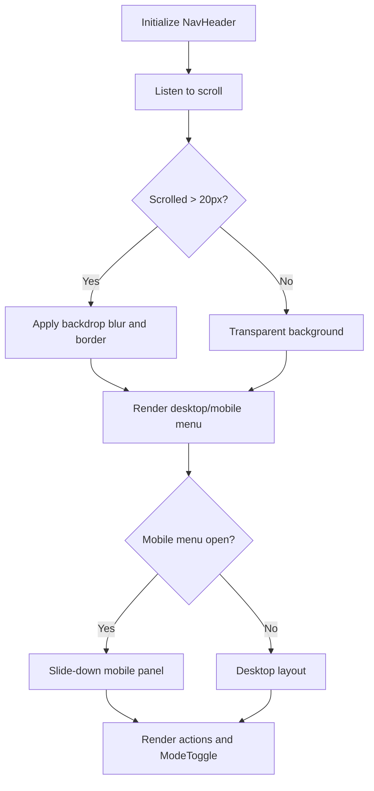
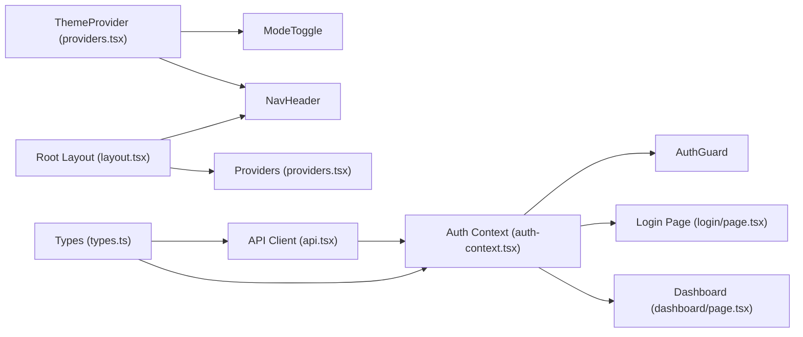

# Utility components

## Introduction
This page explains the utility and helper components that support the overall application functionality. It focuses on:
- AuthGuard: route protection and authentication state management
- ModeToggle: dark/light/system theme switching
- NavHeader: navigation and branding
- Example components: development reference and UI showcase

It describes responsibilities, integration patterns with the authentication system, props and events, and how these components contribute to user experience and application architecture.

## Project structure
The utility components live under website/components and integrate with the authentication provider and theme provider via website/lib/providers. The layout composes NavHeader globally, while AuthGuard wraps protected routes.

```mermaid
graph TB
subgraph "App Shell"
LAYOUT["app/layout.tsx"]
NAV["components/nav-header.tsx"]
end
subgraph "Providers"
PROVIDERS["lib/providers.tsx"]
AUTHCTX["lib/auth-context.tsx"]
THEME["next-themes Provider"]
end
subgraph "Utilities"
GUARD["components/auth-guard.tsx"]
MODE["components/mode-toggle.tsx"]
EXAMPLE["components/component-example.tsx"]
EXWRAPPER["components/example.tsx"]
end
LAYOUT --> NAV
LAYOUT --> PROVIDERS
PROVIDERS --> AUTHCTX
PROVIDERS --> THEME
NAV --> MODE
GUARD --> AUTHCTX
EXAMPLE --> EXWRAPPER
```

## Core components
- AuthGuard: Protects routes by checking authentication state and redirecting unauthenticated users to the login page while rendering a loading indicator during initialization.
- ModeToggle: Provides theme switching (light, dark, system) using next-themes and UI dropdown primitives.
- NavHeader: Implements responsive navigation with logo, desktop links, action buttons, and mobile menu, integrating ModeToggle and scroll-aware styling.
- Example components: Provide a development reference and showcase of UI primitives for cards, forms, dialogs, and menus.

## Architecture overview
The authentication and theming systems are initialized at the root level and consumed by utility components and pages.

```mermaid
sequenceDiagram
participant Browser as "Browser"
participant Layout as "RootLayout (layout.tsx)"
participant Providers as "Providers (providers.tsx)"
participant Auth as "AuthProvider (auth-context.tsx)"
participant Guard as "AuthGuard (auth-guard.tsx)"
participant Page as "Protected Page (dashboard/page.tsx)"
Browser->>Layout : Load app
Layout->>Providers : Render providers tree
Providers->>Auth : Initialize AuthProvider
Page->>Guard : Wrap children
Guard->>Auth : useAuth()
Auth-->>Guard : {isAuthenticated, isLoading}
alt Not authenticated and not loading
Guard->>Browser : Redirect to login
else Authenticated
Guard-->>Page : Render children
end
```

## Detailed component analysis

### AuthGuard
Responsibilities:
- Enforce authentication for protected routes
- Prevent rendering until authentication state is determined
- Redirect unauthenticated users to the login page

Integration with authentication system:
- Consumes useAuth from AuthProvider to access isAuthenticated and isLoading
- Uses Next.js router to replace the current route to the login page when unauthenticated

Props:
- children: ReactNode (content to render when authenticated)

Events:
- None (purely declarative)

Behavior:
- On mount, checks isLoading and isAuthenticated
- If not authenticated and not loading, redirects to the notice-reminders login page
- Renders a centered loader while determining auth state
- Once authenticated, renders children

Usage contexts:
- Wraps pages that require login (e.g., dashboard)
- Can wrap any route segment requiring authentication

```mermaid
flowchart TD
Start(["Mount AuthGuard"]) --> Check["Check isLoading and isAuthenticated"]
Check --> IsLoading{"isLoading?"}
IsLoading --> |Yes| ShowLoader["Render loader"]
IsLoading --> |No| IsAuth{"isAuthenticated?"}
IsAuth --> |No| Redirect["router.replace('/notice-reminders/login')"]
IsAuth --> |Yes| RenderChildren["Render children"]
ShowLoader --> End(["Exit"])
Redirect --> End
RenderChildren --> End
```

### ModeToggle
Responsibilities:
- Allow users to switch themes: light, dark, or system preference
- Provide a visual toggle with sun/moon icons and keyboard-accessible labels

Integration with theming system:
- Uses next-themes useTheme to set the theme
- Renders a dropdown menu with theme options

Props:
- None (no props required)

Events:
- onClick handlers on menu items call setTheme with "light", "dark", or "system"

UI composition:
- Uses Button and DropdownMenu primitives
- Icons change based on current theme (sun/moon rotation and scaling)

```mermaid
sequenceDiagram
participant User as "User"
participant Toggle as "ModeToggle"
participant Theme as "next-themes"
participant UI as "UI Components"
User->>Toggle : Click theme menu item
Toggle->>Theme : setTheme("light"|"dark"|"system")
Theme-->>UI : Apply theme class to document
UI-->>User : Visual theme update
```

### NavHeader
Responsibilities:
- Provide global navigation and branding
- Offer responsive behavior (desktop vs mobile)
- Integrate theme switching and call-to-action buttons

Key features:
- Scroll-aware header styling (background blur and border on scroll)
- Desktop navigation links and action buttons
- Mobile hamburger menu with animated slide-in
- Logo with hover scaling effect
- Integrates ModeToggle for theme switching

Props:
- None (no props required)

Events:
- Toggling mobile menu via internal state
- Navigation link clicks (standard anchor navigation)

Responsive behavior:
- Desktop: displays links and actions inline
- Mobile: collapses into a slide-down menu with theme toggle and primary action

```mermaid
flowchart TD
Init["Initialize NavHeader"] --> Scroll["Listen to scroll"]
Scroll --> Scrolled{"Scrolled > 20px?"}
Scrolled --> |Yes| Styled["Apply backdrop blur and border"]
Scrolled --> |No| Transparent["Transparent background"]
Styled --> Menu["Render desktop/mobile menu"]
Transparent --> Menu
Menu --> Mobile{"Mobile menu open?"}
Mobile --> |Yes| SlideDown["Slide-down mobile panel"]
Mobile --> |No| Desktop["Desktop layout"]
SlideDown --> Actions["Render actions and ModeToggle"]
Desktop --> Actions
```

### Example components (development reference)
Responsibilities:
- Demonstrate UI primitives usage for cards, forms, alerts, and dropdowns
- Are a living reference for component composition and styling

Composition:
- ComponentExample orchestrates multiple examples
- ExampleWrapper provides a responsive grid layout for examples
- Example wraps individual examples with optional titles and borders

Usage:
- Used in development and documentation contexts to show component behavior
- Demonstrates nested components like AlertDialog inside Card

## Dependency analysis
The components depend on shared libraries and providers:

```mermaid
graph LR
AUTHCTX["Auth Context (auth-context.tsx)"] --> GUARD["AuthGuard"]
AUTHCTX --> LOGINPAGE["Login Page (login/page.tsx)"]
AUTHCTX --> DASHBOARD["Dashboard (dashboard/page.tsx)"]
THEMEPROV["ThemeProvider (providers.tsx)"] --> MODE["ModeToggle"]
THEMEPROV --> NAV["NavHeader"]
LAYOUT["Root Layout (layout.tsx)"] --> NAV
LAYOUT --> PROVIDERS["Providers (providers.tsx)"]
API["API Client (api.tsx)"] --> AUTHCTX
TYPES["Types (types.ts)"] --> AUTHCTX
TYPES --> API
```

## Performance considerations
- AuthGuard defers rendering until authentication state resolves to avoid unnecessary re-renders and flicker.
- NavHeader uses passive scroll listeners and minimal state updates to keep scrolling smooth.
- ModeToggle relies on next-themes for efficient theme switching without heavy computations.
- Providers configure React Query defaults to reduce network overhead and improve caching behavior.

## Troubleshooting guide
Common issues and resolutions:
- AuthGuard redirect loop on login:
  - Ensure the login page does not require authentication and guards against authenticated users.
  - Verify AuthProvider initializes correctly and useAuth returns expected values.
- AuthGuard shows loader indefinitely:
  - Confirm the session loading completes and isAuthenticated transitions after initial hydration.
- Theme toggle not applying:
  - Check that next-themes provider is mounted and ModeToggle invokes setTheme.
- Navigation not responsive:
  - Verify mobileOpen state toggles and Tailwind classes apply correctly on small screens.

## Conclusion
These utility components form the backbone of user experience and application structure:
- AuthGuard ensures secure access to protected areas
- ModeToggle improves accessibility and personalization
- NavHeader delivers consistent navigation and branding across contexts
- Example components provide a practical reference for building UIs

They integrate cleanly with the authentication and theming providers, enabling scalable and maintainable frontend architecture.
