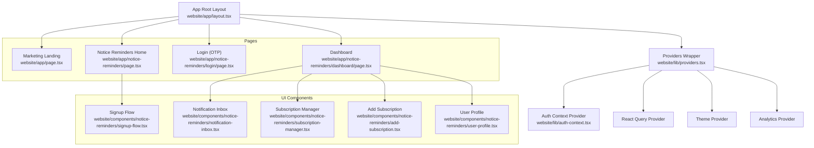
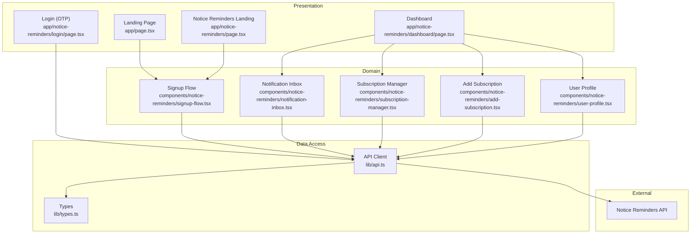
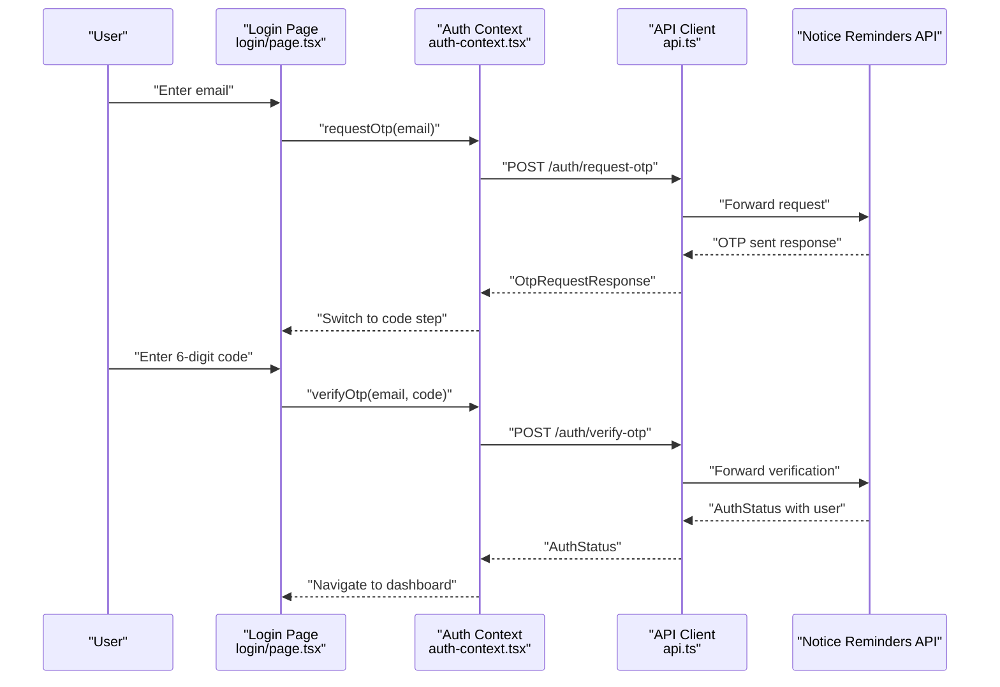
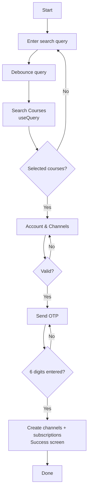
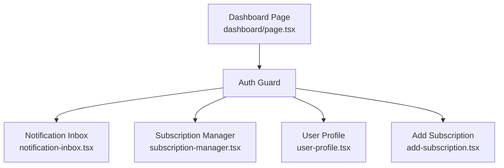
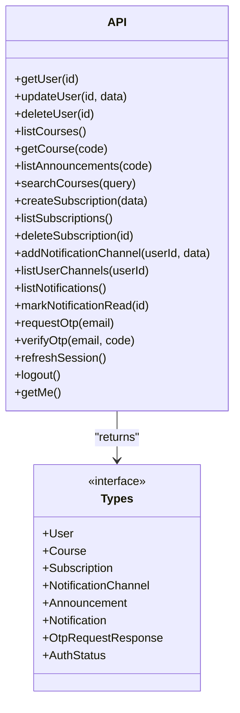
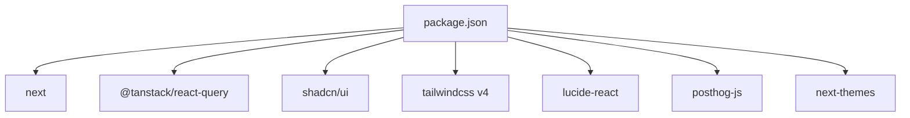

# Website Dashboard

<cite>
**Referenced Files in This Document**
- [package.json](file://website/package.json)
- [layout.tsx](file://website/app/layout.tsx)
- [providers.tsx](file://website/lib/providers.tsx)
- [auth-context.tsx](file://website/lib/auth-context.tsx)
- [page.tsx](file://website/app/page.tsx)
- [notice-reminders/page.tsx](file://website/app/notice-reminders/page.tsx)
- [dashboard/page.tsx](file://website/app/notice-reminders/dashboard/page.tsx)
- [login/page.tsx](file://website/app/notice-reminders/login/page.tsx)
- [signup-flow.tsx](file://website/components/notice-reminders/signup-flow.tsx)
- [notification-inbox.tsx](file://website/components/notice-reminders/notification-inbox.tsx)
- [subscription-manager.tsx](file://website/components/notice-reminders/subscription-manager.tsx)
- [add-subscription.tsx](file://website/components/notice-reminders/add-subscription.tsx)
- [user-profile.tsx](file://website/components/notice-reminders/user-profile.tsx)
- [api.ts](file://website/lib/api.ts)
- [types.ts](file://website/lib/types.ts)
</cite>

## Table of Contents
1. [Introduction](#introduction)
2. [Project Structure](#project-structure)
3. [Core Components](#core-components)
4. [Architecture Overview](#architecture-overview)
5. [Detailed Component Analysis](#detailed-component-analysis)
6. [Dependency Analysis](#dependency-analysis)
7. [Performance Considerations](#performance-considerations)
8. [Troubleshooting Guide](#troubleshooting-guide)
9. [Conclusion](#conclusion)

## Introduction
This document describes the Website Dashboard built with Next.js. It covers the marketing site functionality, OTP-based user authentication, the user dashboard for managing subscriptions and notifications, and course browsing capabilities. It documents the React component architecture, API integration patterns, authentication context providers, UI component library usage, routing structure, state management, and styling approach using Tailwind CSS and shadcn/ui components.

## Project Structure
The website is a Next.js application organized into:
- App Router pages under website/app
- Shared UI components under website/components
- Client-side providers and context under website/lib
- Global styles and fonts configured in the root layout

**Diagram sources**
- [layout.tsx](file://website/app/layout.tsx#L81-L98)
- [providers.tsx](file://website/lib/providers.tsx#L10-L40)
- [auth-context.tsx](file://website/lib/auth-context.tsx#L21-L87)
- [page.tsx](file://website/app/page.tsx#L9-L19)
- [notice-reminders/page.tsx](file://website/app/notice-reminders/page.tsx#L4-L19)
- [login/page.tsx](file://website/app/notice-reminders/login/page.tsx#L19-L157)
- [dashboard/page.tsx](file://website/app/notice-reminders/dashboard/page.tsx#L13-L51)
- [signup-flow.tsx](file://website/components/notice-reminders/signup-flow.tsx#L65-L597)
- [notification-inbox.tsx](file://website/components/notice-reminders/notification-inbox.tsx#L23-L155)
- [subscription-manager.tsx](file://website/components/notice-reminders/subscription-manager.tsx#L33-L195)
- [add-subscription.tsx](file://website/components/notice-reminders/add-subscription.tsx#L23-L162)
- [user-profile.tsx](file://website/components/notice-reminders/user-profile.tsx#L35-L317)

**Section sources**
- [layout.tsx](file://website/app/layout.tsx#L1-L99)
- [providers.tsx](file://website/lib/providers.tsx#L1-L41)

## Core Components
- Authentication Context: Centralized OTP login state, session refresh, and logout handling.
- Providers: Wraps the app with React Query, theme switching, analytics, and auth context.
- UI Components: Reusable building blocks for forms, cards, dialogs, and lists.
- Pages: Marketing landing, notice reminders landing, OTP login, and user dashboard.

Key responsibilities:
- Auth Context: request OTP, verify OTP, refresh session, logout, and expose user state.
- Providers: configure caching policy, theme persistence, and global toasts.
- UI Components: encapsulate business logic for subscriptions, notifications, and user profile.
- Pages: orchestrate navigation and render appropriate components.

**Section sources**
- [auth-context.tsx](file://website/lib/auth-context.tsx#L1-L97)
- [providers.tsx](file://website/lib/providers.tsx#L1-L41)
- [api.ts](file://website/lib/api.ts#L1-L184)

## Architecture Overview
The system follows a layered architecture:
- Presentation Layer: Next.js App Router pages and React components.
- Domain Layer: UI components implementing business logic (subscriptions, notifications, user profile).
- Data Access Layer: API client module encapsulating HTTP requests and error handling.
- External Services: Notice Reminders API (courses, subscriptions, notifications, auth).

**Diagram sources**
- [page.tsx](file://website/app/page.tsx#L9-L19)
- [notice-reminders/page.tsx](file://website/app/notice-reminders/page.tsx#L4-L19)
- [login/page.tsx](file://website/app/notice-reminders/login/page.tsx#L19-L157)
- [dashboard/page.tsx](file://website/app/notice-reminders/dashboard/page.tsx#L13-L51)
- [signup-flow.tsx](file://website/components/notice-reminders/signup-flow.tsx#L65-L597)
- [notification-inbox.tsx](file://website/components/notice-reminders/notification-inbox.tsx#L23-L155)
- [subscription-manager.tsx](file://website/components/notice-reminders/subscription-manager.tsx#L33-L195)
- [add-subscription.tsx](file://website/components/notice-reminders/add-subscription.tsx#L23-L162)
- [user-profile.tsx](file://website/components/notice-reminders/user-profile.tsx#L35-L317)
- [api.ts](file://website/lib/api.ts#L1-L184)
- [types.ts](file://website/lib/types.ts#L1-L97)

## Detailed Component Analysis

### Authentication System (OTP Login)
The authentication system uses an OTP flow with two steps:
- Request OTP: sends an email to the provided address.
- Verify OTP: validates the 6-digit code and establishes a session.

**Diagram sources**
- [login/page.tsx](file://website/app/notice-reminders/login/page.tsx#L19-L157)
- [auth-context.tsx](file://website/lib/auth-context.tsx#L41-L64)
- [api.ts](file://website/lib/api.ts#L150-L165)

Key behaviors:
- Validation with Zod schemas for email and code length.
- Controlled step transitions and error messaging.
- Session persistence via cookies and refresh endpoint.

**Section sources**
- [login/page.tsx](file://website/app/notice-reminders/login/page.tsx#L14-L157)
- [auth-context.tsx](file://website/lib/auth-context.tsx#L21-L87)
- [api.ts](file://website/lib/api.ts#L149-L181)

### Notice Reminders Landing and Course Browsing
The landing page integrates a multi-step signup flow:
- Step 1: Course search and selection.
- Step 2: Account details and notification preferences.
- Step 3: OTP verification.
- Step 4: Success screen with subscriptions.

**Diagram sources**
- [signup-flow.tsx](file://website/components/notice-reminders/signup-flow.tsx#L65-L597)

Highlights:
- Debounced search with Lucide icons and loading indicators.
- Conditional validation for Telegram ID and at least one notification channel.
- Mutation orchestration for OTP, channel creation, and subscriptions.

**Section sources**
- [notice-reminders/page.tsx](file://website/app/notice-reminders/page.tsx#L4-L19)
- [signup-flow.tsx](file://website/components/notice-reminders/signup-flow.tsx#L65-L597)

### User Dashboard
The dashboard organizes content into three areas:
- Top bar: welcome message and sign out.
- Left column: notifications inbox and subscription manager.
- Right column: user profile and quick actions.

**Diagram sources**
- [dashboard/page.tsx](file://website/app/notice-reminders/dashboard/page.tsx#L13-L51)
- [notification-inbox.tsx](file://website/components/notice-reminders/notification-inbox.tsx#L23-L155)
- [subscription-manager.tsx](file://website/components/notice-reminders/subscription-manager.tsx#L33-L195)
- [user-profile.tsx](file://website/components/notice-reminders/user-profile.tsx#L35-L317)
- [add-subscription.tsx](file://website/components/notice-reminders/add-subscription.tsx#L23-L162)

**Section sources**
- [dashboard/page.tsx](file://website/app/notice-reminders/dashboard/page.tsx#L13-L51)

### API Integration Patterns
The API client centralizes HTTP interactions:
- Base URL configurable via environment variable.
- Automatic cookie inclusion for session management.
- Typed responses and errors mapped to a custom error class.
- Dedicated functions for users, courses, subscriptions, channels, notifications, and auth.

**Diagram sources**
- [api.ts](file://website/lib/api.ts#L1-L184)
- [types.ts](file://website/lib/types.ts#L1-L97)

**Section sources**
- [api.ts](file://website/lib/api.ts#L1-L184)
- [types.ts](file://website/lib/types.ts#L1-L97)

### UI Component Library Usage
Components leverage shadcn/ui primitives and Lucide icons:
- Buttons, inputs, labels, cards, badges, dialogs, dropdowns, and toasts.
- Consistent spacing, typography, and responsive layouts using Tailwind utilities.
- Theming via next-themes with system preference support.

**Section sources**
- [providers.tsx](file://website/lib/providers.tsx#L1-L41)
- [layout.tsx](file://website/app/layout.tsx#L1-L99)

## Dependency Analysis
External dependencies include Next.js, React Query, shadcn/ui, Tailwind CSS v4, and analytics.

**Diagram sources**
- [package.json](file://website/package.json#L11-L26)

**Section sources**
- [package.json](file://website/package.json#L1-L47)

## Performance Considerations
- React Query caching: staleTime configured to balance freshness and network usage.
- Debounced search inputs to reduce API calls during typing.
- Conditional query enabling to avoid unnecessary requests.
- Efficient invalidation patterns to keep views synchronized after mutations.

[No sources needed since this section provides general guidance]

## Troubleshooting Guide
Common issues and resolutions:
- Authentication failures: Verify OTP endpoint responses and error messages surfaced to the UI.
- Network errors: Inspect API client error handling and ensure NEXT_PUBLIC_API_URL is set.
- Session persistence: Confirm cookie-based auth and refresh endpoint usage.
- UI state sync: Ensure React Query invalidations occur after mutations (e.g., subscriptions, notifications).

**Section sources**
- [api.ts](file://website/lib/api.ts#L18-L53)
- [auth-context.tsx](file://website/lib/auth-context.tsx#L57-L64)
- [subscription-manager.tsx](file://website/components/notice-reminders/subscription-manager.tsx#L47-L52)
- [notification-inbox.tsx](file://website/components/notice-reminders/notification-inbox.tsx#L34-L41)

## Conclusion
The Website Dashboard combines a modern Next.js frontend with a robust OTP authentication system, a comprehensive dashboard for managing subscriptions and notifications, and a seamless course browsing experience. The architecture emphasizes clear separation of concerns, reusable UI components, and efficient data fetching with React Query. The styling system using Tailwind CSS and shadcn/ui ensures a consistent, accessible, and responsive user experience.