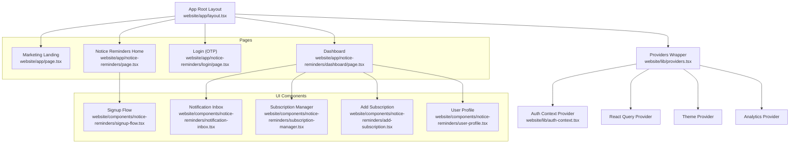
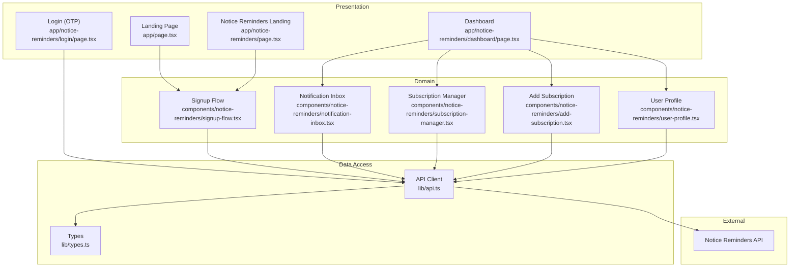
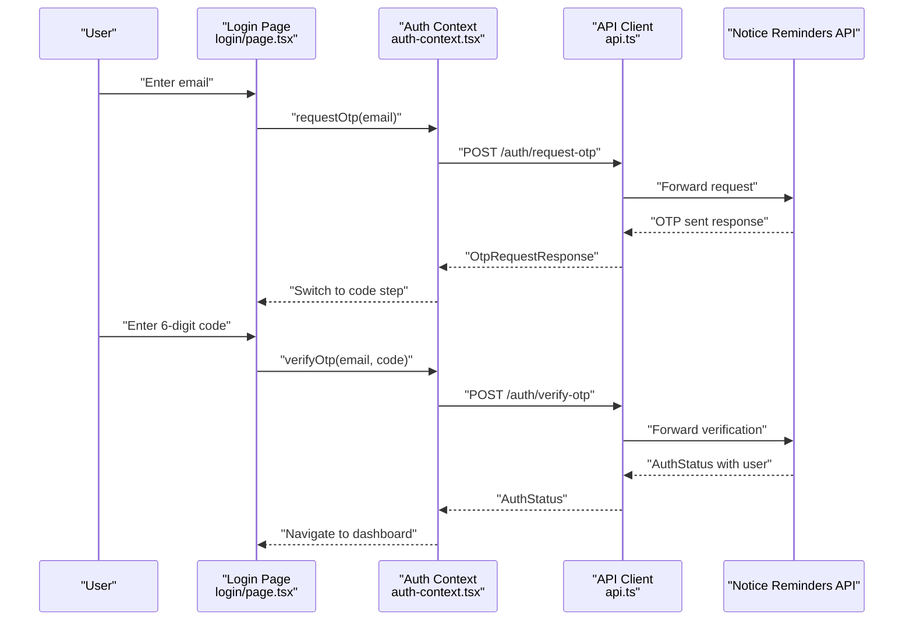
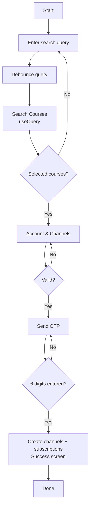
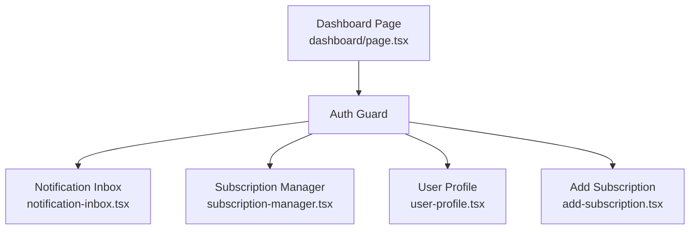
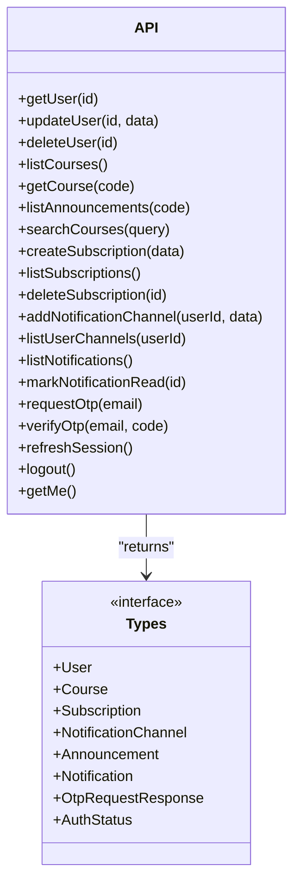
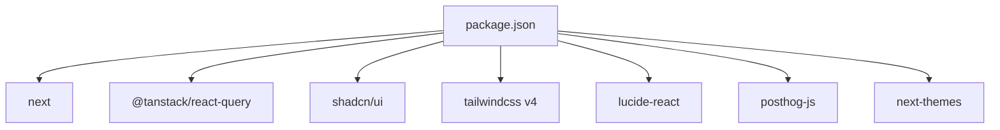

# Website dashboard

## Introduction
This page describes the Website Dashboard built with Next.js. It covers the marketing site functionality, OTP-based user authentication, the user dashboard for managing subscriptions and notifications, and course browsing capabilities. It documents the React component architecture, API integration patterns, authentication context providers, UI component library usage, routing structure, state management, and styling approach using Tailwind CSS and shadcn/ui components.

## Project structure
The website is a Next.js application organized into:
- App Router pages under website/app
- Shared UI components under website/components
- Client-side providers and context under website/lib
- Global styles and fonts configured in the root layout

```mermaid
graph TB
A["App Root Layout<br/>website/app/layout.tsx"] --> B["Providers Wrapper<br/>website/lib/providers.tsx"]
B --> C["Auth Context Provider<br/>website/lib/auth-context.tsx"]
B --> D["React Query Provider"]
B --> E["Theme Provider"]
B --> F["Analytics Provider"]
subgraph "Pages"
P1["Marketing Landing<br/>website/app/page.tsx"]
P2["Notice Reminders Home<br/>website/app/notice-reminders/page.tsx"]
P3["Login (OTP)<br/>website/app/notice-reminders/login/page.tsx"]
P4["Dashboard<br/>website/app/notice-reminders/dashboard/page.tsx"]
end
A --> P1
A --> P2
A --> P3
A --> P4
subgraph "UI Components"
U1["Signup Flow<br/>website/components/notice-reminders/signup-flow.tsx"]
U2["Notification Inbox<br/>website/components/notice-reminders/notification-inbox.tsx"]
U3["Subscription Manager<br/>website/components/notice-reminders/subscription-manager.tsx"]
U4["Add Subscription<br/>website/components/notice-reminders/add-subscription.tsx"]
U5["User Profile<br/>website/components/notice-reminders/user-profile.tsx"]
end
P2 --> U1
P4 --> U2
P4 --> U3
P4 --> U5
P4 --> U4
```

## Core components
- Authentication Context: Centralized OTP login state, session refresh, and logout handling.
- Providers: Wraps the app with React Query, theme switching, analytics, and auth context.
- UI Components: Reusable building blocks for forms, cards, dialogs, and lists.
- Pages: Marketing landing, notice reminders landing, OTP login, and user dashboard.

Key responsibilities:
- Auth Context: request OTP, verify OTP, refresh session, logout, and expose user state.
- Providers: configure caching policy, theme persistence, and global toasts.
- UI Components: encapsulate business logic for subscriptions, notifications, and user profile.
- Pages: orchestrate navigation and render appropriate components.

## Architecture overview
The system follows a layered architecture:
- Presentation Layer: Next.js App Router pages and React components.
- Domain Layer: UI components implementing business logic (subscriptions, notifications, user profile).
- Data Access Layer: API client module encapsulating HTTP requests and error handling.
- External Services: Notice Reminders API (courses, subscriptions, notifications, auth).

```mermaid
graph TB
subgraph "Presentation"
L["Landing Page<br/>app/page.tsx"]
NR["Notice Reminders Landing<br/>app/notice-reminders/page.tsx"]
LG["Login (OTP)<br/>app/notice-reminders/login/page.tsx"]
DB["Dashboard<br/>app/notice-reminders/dashboard/page.tsx"]
end
subgraph "Domain"
SF["Signup Flow<br/>components/notice-reminders/signup-flow.tsx"]
NI["Notification Inbox<br/>components/notice-reminders/notification-inbox.tsx"]
SM["Subscription Manager<br/>components/notice-reminders/subscription-manager.tsx"]
AS["Add Subscription<br/>components/notice-reminders/add-subscription.tsx"]
UP["User Profile<br/>components/notice-reminders/user-profile.tsx"]
end
subgraph "Data Access"
API["API Client<br/>lib/api.ts"]
TYP["Types<br/>lib/types.ts"]
end
subgraph "External"
NAPI["Notice Reminders API"]
end
L --> SF
NR --> SF
LG --> API
DB --> NI
DB --> SM
DB --> UP
DB --> AS
SF --> API
NI --> API
SM --> API
AS --> API
UP --> API
API --> NAPI
API --> TYP
```

## Detailed component analysis

### Authentication system (OTP login)
The authentication system uses an OTP flow with two steps:
- Request OTP: sends an email to the provided address.
- Verify OTP: validates the 6-digit code and establishes a session.

```mermaid
sequenceDiagram
participant U as "User"
participant LP as "Login Page<br/>login/page.tsx"
participant AC as "Auth Context<br/>auth-context.tsx"
participant API as "API Client<br/>api.ts"
participant BE as "Notice Reminders API"
U->>LP : "Enter email"
LP->>AC : "requestOtp(email)"
AC->>API : "POST /auth/request-otp"
API->>BE : "Forward request"
BE-->>API : "OTP sent response"
API-->>AC : "OtpRequestResponse"
AC-->>LP : "Switch to code step"
U->>LP : "Enter 6-digit code"
LP->>AC : "verifyOtp(email, code)"
AC->>API : "POST /auth/verify-otp"
API->>BE : "Forward verification"
BE-->>API : "AuthStatus with user"
API-->>AC : "AuthStatus"
AC-->>LP : "Navigate to dashboard"
```

Key behaviors:
- Validation with Zod schemas for email and code length.
- Controlled step transitions and error messaging.
- Session persistence via cookies and refresh endpoint.

### Notice reminders landing and course browsing
The landing page integrates a multi-step signup flow:
- Step 1: Course search and selection.
- Step 2: Account details and notification preferences.
- Step 3: OTP verification.
- Step 4: Success screen with subscriptions.

```mermaid
flowchart TD
S["Start"] --> Q["Enter search query"]
Q --> DQ["Debounce query"]
DQ --> Search["Search Courses<br/>useQuery"]
Search --> Select{"Selected courses?"}
Select --> |No| Q
Select --> |Yes| Acc["Account & Channels"]
Acc --> Validate{"Valid?"}
Validate --> |No| Acc
Validate --> |Yes| OTP["Send OTP"]
OTP --> Verify{"6 digits entered?"}
Verify --> |No| OTP
Verify --> |Yes| Finish["Create channels + subscriptions<br/>Success screen"]
Finish --> End["Done"]
```

Highlights:
- Debounced search with Lucide icons and loading indicators.
- Conditional validation for Telegram ID and at least one notification channel.
- Mutation orchestration for OTP, channel creation, and subscriptions.

### User dashboard
The dashboard organizes content into three areas:
- Top bar: welcome message and sign out.
- Left column: notifications inbox and subscription manager.
- Right column: user profile and quick actions.

```mermaid
graph TB
DB["Dashboard Page<br/>dashboard/page.tsx"] --> AG["Auth Guard"]
AG --> NI["Notification Inbox<br/>notification-inbox.tsx"]
AG --> SM["Subscription Manager<br/>subscription-manager.tsx"]
AG --> UP["User Profile<br/>user-profile.tsx"]
AG --> AS["Add Subscription<br/>add-subscription.tsx"]
```

### API integration patterns
The API client centralizes HTTP interactions:
- Base URL configurable via environment variable.
- Automatic cookie inclusion for session management.
- Typed responses and errors mapped to a custom error class.
- Dedicated functions for users, courses, subscriptions, channels, notifications, and auth.

```mermaid
classDiagram
class API {
+getUser(id)
+updateUser(id, data)
+deleteUser(id)
+listCourses()
+getCourse(code)
+listAnnouncements(code)
+searchCourses(query)
+createSubscription(data)
+listSubscriptions()
+deleteSubscription(id)
+addNotificationChannel(userId, data)
+listUserChannels(userId)
+listNotifications()
+markNotificationRead(id)
+requestOtp(email)
+verifyOtp(email, code)
+refreshSession()
+logout()
+getMe()
}
class Types {
<<interface>>
+User
+Course
+Subscription
+NotificationChannel
+Announcement
+Notification
+OtpRequestResponse
+AuthStatus
}
API --> Types : "returns"
```

### UI component library usage
Components use shadcn/ui primitives and Lucide icons:
- Buttons, inputs, labels, cards, badges, dialogs, dropdowns, and toasts.
- Consistent spacing, typography, and responsive layouts using Tailwind utilities.
- Theming via next-themes with system preference support.

## Dependency analysis
External dependencies include Next.js, React Query, shadcn/ui, Tailwind CSS v4, and analytics.

```mermaid
graph TB
P["package.json"] --> N["next"]
P --> RQ["@tanstack/react-query"]
P --> SH["shadcn/ui"]
P --> TW["tailwindcss v4"]
P --> LC["lucide-react"]
P --> PT["posthog-js"]
P --> TH["next-themes"]
```

## Performance considerations
- React Query caching: staleTime configured to balance freshness and network usage.
- Debounced search inputs to reduce API calls during typing.
- Conditional query enabling to avoid unnecessary requests.
- Efficient invalidation patterns to keep views synchronized after mutations.

[No sources needed since this section provides general guidance]

## Troubleshooting guide
Common issues and resolutions:
- Authentication failures: Verify OTP endpoint responses and error messages surfaced to the UI.
- Network errors: Inspect API client error handling and ensure NEXT_PUBLIC_API_URL is set.
- Session persistence: Confirm cookie-based auth and refresh endpoint usage.
- UI state sync: Ensure React Query invalidations occur after mutations (e.g., subscriptions, notifications).

## Conclusion
The Website Dashboard combines a modern Next.js frontend with a reliable OTP authentication system, a detailed dashboard for managing subscriptions and notifications, and a smooth course browsing experience. The architecture emphasizes clear separation of concerns, reusable UI components, and efficient data fetching with React Query. The styling system using Tailwind CSS and shadcn/ui ensures a consistent, accessible, and responsive user experience.
