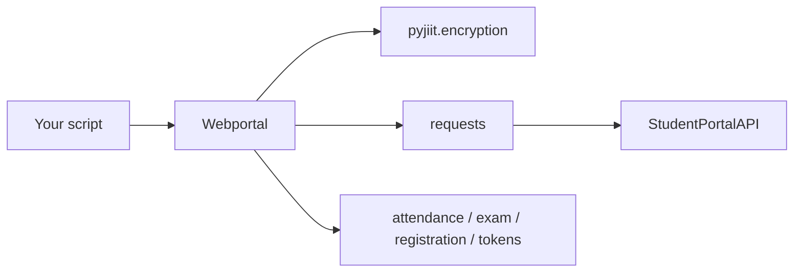
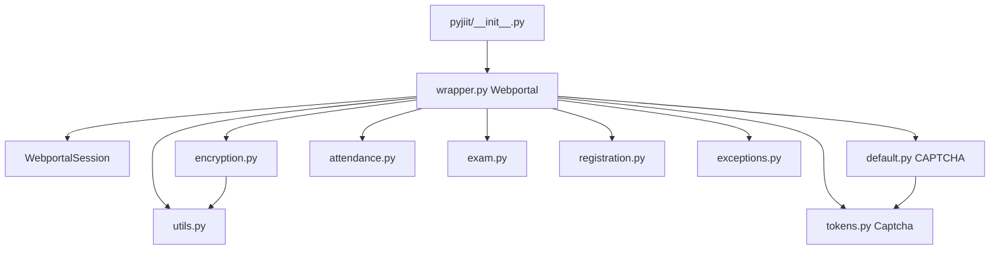
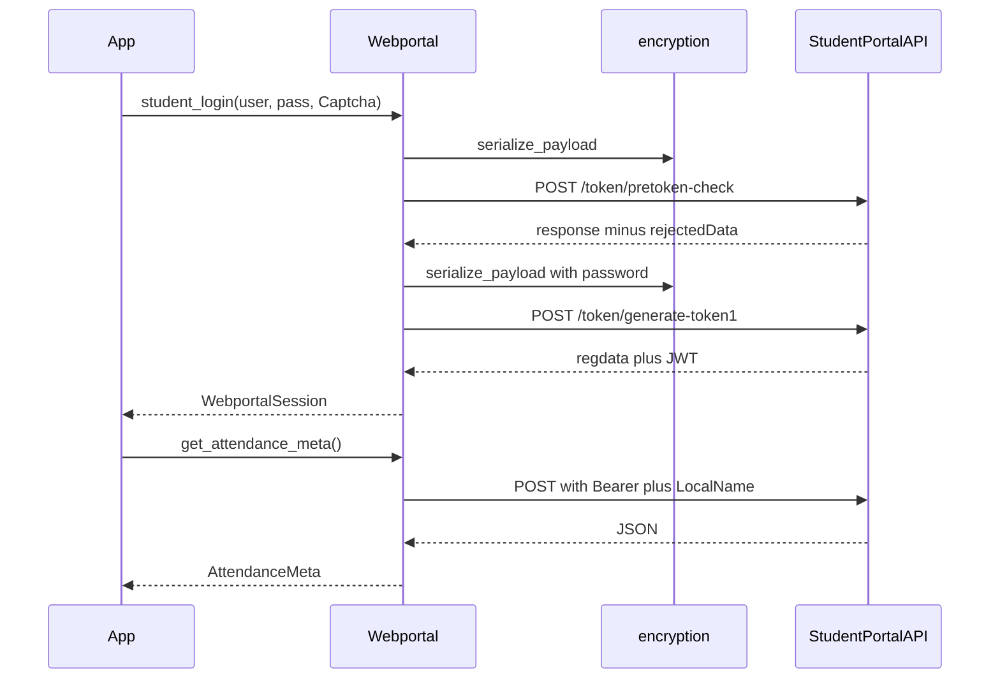
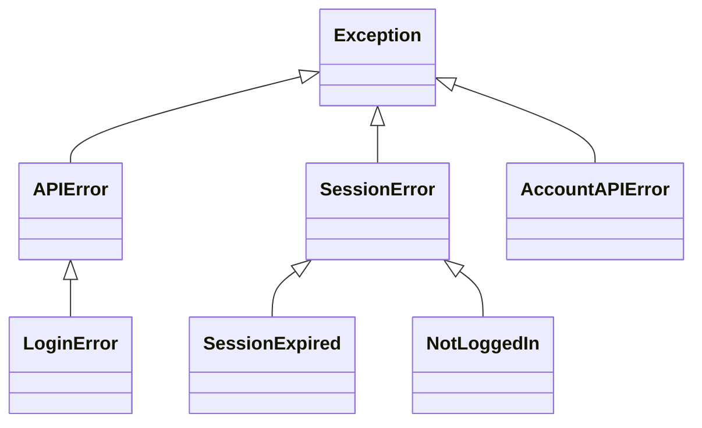

# Overview

pyjiit is a Python client for the JIIT Student Webportal APIs. Version **0.1.0a8**, Python **>=3.9**. Harsh Sharma (`codelif`) wrote it. This site documents the fork at [tashifkhan/pyjiit](https://github.com/tashifkhan/pyjiit). Upstream is [codelif/pyjiit](https://github.com/codelif/pyjiit).

The package talks to `https://webportal.jiit.ac.in:6011/StudentPortalAPI` with `requests`. Payloads that the portal encrypts go through AES-CBC in `pyjiit.encryption`. Login takes a `Captcha` object. A filled default lives in `pyjiit.default.CAPTCHA`.

Install and first call: [Getting started](2-getting-started). Method list: [Core API reference](3-core-api-reference). Crypto: [Security and encryption](4-security-and-encryption).

README.rst still points at the Sphinx site: [https://pyjiit.codelif.in](https://pyjiit.codelif.in).

## What it does

`from pyjiit import Webportal` is the public entry. The class is **Webportal**, not WebPortal. After `student_login`, the same instance holds a `WebportalSession` and you call attendance, registration, exam, marks, fees, and account methods on it.

## Package layout

| Module | Role |
| --- | --- |
| `pyjiit/__init__.py` | `from pyjiit.wrapper import Webportal` |
| `pyjiit/wrapper.py` | `Webportal`, `WebportalSession`, `@authenticated`, `__hit` |
| `pyjiit/encryption.py` | AES-CBC, `serialize_payload`, `generate_local_name` |
| `pyjiit/utils.py` | Date sequence and random chars for the daily key |
| `pyjiit/attendance.py` | `AttendanceHeader`, `Semester`, `AttendanceMeta` |
| `pyjiit/exam.py` | `ExamEvent` |
| `pyjiit/registration.py` | `RegisteredSubject`, `Registrations` |
| `pyjiit/tokens.py` | `Captcha` |
| `pyjiit/default.py` | Premade `CAPTCHA` used in the usage docs |
| `pyjiit/exceptions.py` | `APIError`, `LoginError`, `SessionError`, `SessionExpired`, `NotLoggedIn`, `AccountAPIError` |
| `pyjiit/init.py` | `__version__ = "0.1.0a8"` |

## Login and a typical call

Login is two POSTs. Both bodies are encrypted with `serialize_payload`. Unauthenticated requests still send a `LocalName` header from `generate_local_name()`.

1. `POST /token/pretoken-check` with username, `usertype: "S"`, and `captcha.payload()`.
2. Take `response`, drop `rejectedData`, set `Modulename` to `STUDENTMODULE` and `passwordotpvalue` to the password.
3. `POST /token/generate-token1`. Store `WebportalSession(resp["response"])` on `self.session`.

Most later methods go through `__hit`. `@authenticated` raises `NotLoggedIn` if `self.session` is `None`. The JWT expiry check is commented out because the portal's expiry claim is wrong for cookies that still work.

## Exceptions

`__hit` raises `SessionExpired` when `status` is the integer `401`. Any other non-`Success` `responseStatus` raises the method's exception type, default `APIError`. `set_password` uses `AccountAPIError`.

## Crypto in one line

Key is `b"qa8y" + generate_date_seq() + b"ty1pn"` (16 bytes). IV is the fixed `b"dcek9wb8frty1pnm"`. AES-CBC with PKCS padding. The date sequence changes at calendar midnight of the machine running the client. The module comment says 0000 IST.

## Dependencies

| Package | Constraint | Why |
| --- | --- | --- |
| `requests` | `>=2.32.3,<3.0.0` | HTTP. Not fetch. |
| `pycryptodome` | `>=3.22.0,<4.0.0` | AES. README.rst calls this out as explicit on purpose. |

Docs extra (Poetry group `docs`): Sphinx `>=7.4.7`, Furo `^2024.8.6`. License MIT. Credits in README.rst go to [arvindpunk](https://github.com/arvindpunk) for reversing the payload crypto.
