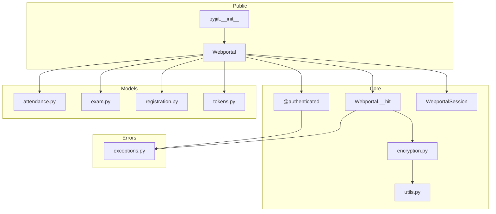
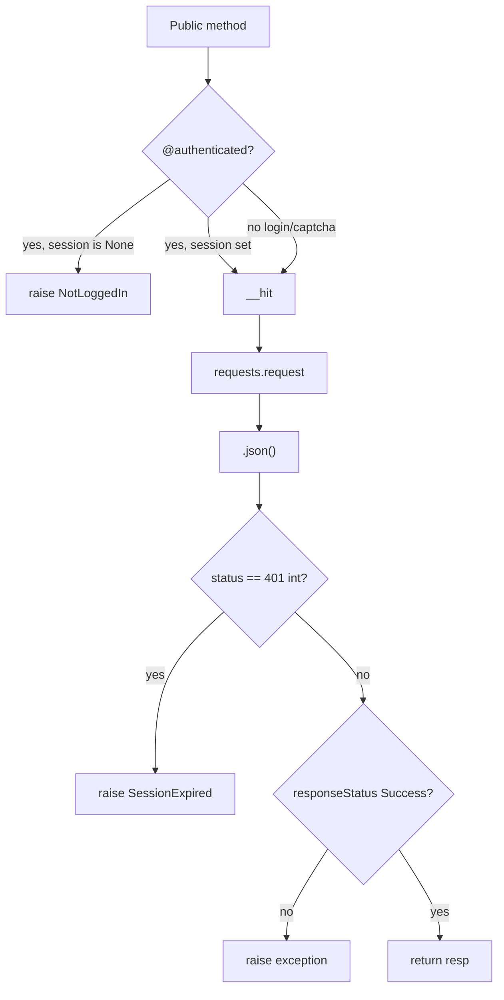
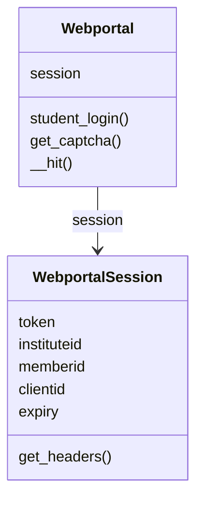
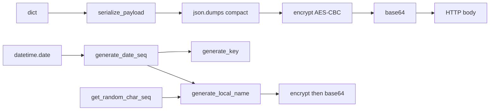
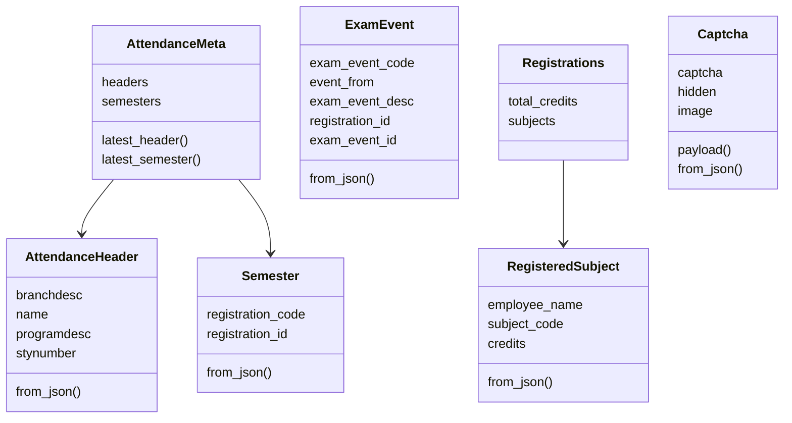
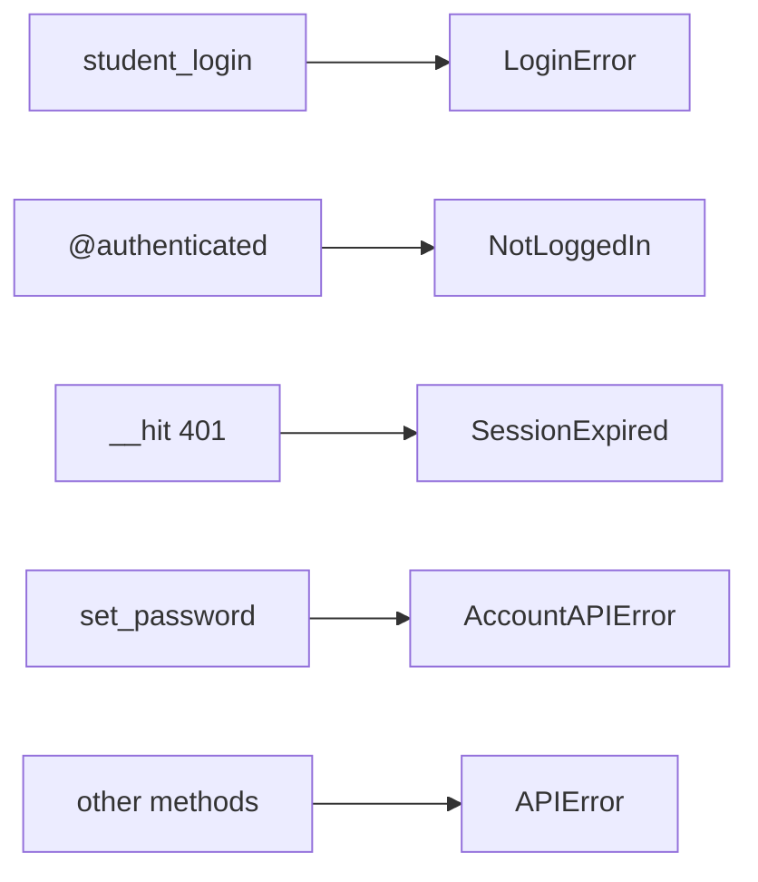
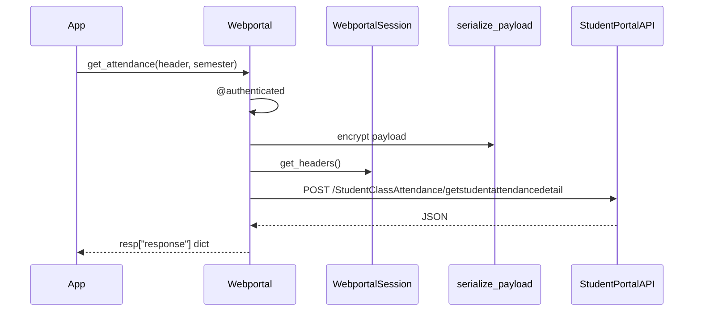

# System architecture

How `Webportal` sits on `requests`, encryption, and the model classes. Install: [Getting started](2-getting-started). Methods: [Webportal class](3.1-webportal-class). Crypto: [Encryption system](4.1-encryption-system).

## Layers

`__init__.py` only re-exports `Webportal`. Everything else is imported from `wrapper.py`.

## Webportal

`Webportal.__init__` sets `self.session = None`. `__str__` returns `"Driver Class for JIIT Webportal"`.

`@authenticated` wraps methods that need a session. If `self.session is None`, it raises `NotLoggedIn`. The expiry branch that would raise `SessionExpired` is commented out. The portal returns a JWT `exp` that does not match live cookies.

`__hit` is the shared HTTP path:

1. Pick an exception class (`APIError` unless `exception=` is passed).
2. If `authenticated=True`, merge `self.session.get_headers()`. Else send only `LocalName`.
3. `requests.request(*args, **kwargs).json()`.
4. Integer `status == 401` raises `SessionExpired`.
5. `status.responseStatus != "Success"` raises the chosen exception.
6. Return the parsed dict.

`download_marks` skips `__hit` and uses `requests.get` so it can return PDF bytes.

## WebportalSession

Built from the login `response` dict.

| Attribute | Source |
| --- | --- |
| `raw_response` | Full `response` |
| `regdata` | `resp["regdata"]` |
| `institute`, `instituteid` | First `institutelist` entry `label` / `value` |
| `memberid` | `regdata["memberid"]` |
| `userid` | `regdata["userid"]` |
| `token` | JWT in `regdata["token"]` |
| `expiry` | `exp` claim from JWT payload, `datetime.fromtimestamp` |
| `clientid` | `regdata["clientid"]` |
| `membertype` | `regdata["membertype"]` |
| `name` | `regdata["name"]` |

`get_headers()` returns `Authorization: Bearer {token}` and a fresh `LocalName`.

## Encryption module

| Function | Returns |
| --- | --- |
| `generate_key(date=None)` | 16-byte AES key |
| `encrypt` / `decrypt` | padded / unpadded bytes |
| `serialize_payload(dict)` | base64 ciphertext string |
| `deserialize_payload(str)` | dict |
| `generate_local_name(date=None)` | base64 ciphertext for the header |

IV is constant `b"dcek9wb8frty1pnm"`. Key string is `"qa8y" + date_seq + "ty1pn"`.

## Models

`Semester` lives in `attendance.py`, not `tokens.py`.

## Exception use

## Authenticated call shape

Not every method encrypts. `get_student_bank_info`, `get_attendance_meta`, `set_password`, and `get_fee_summary` send plain JSON. `download_marks` is a GET with path params.
