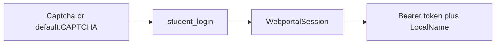
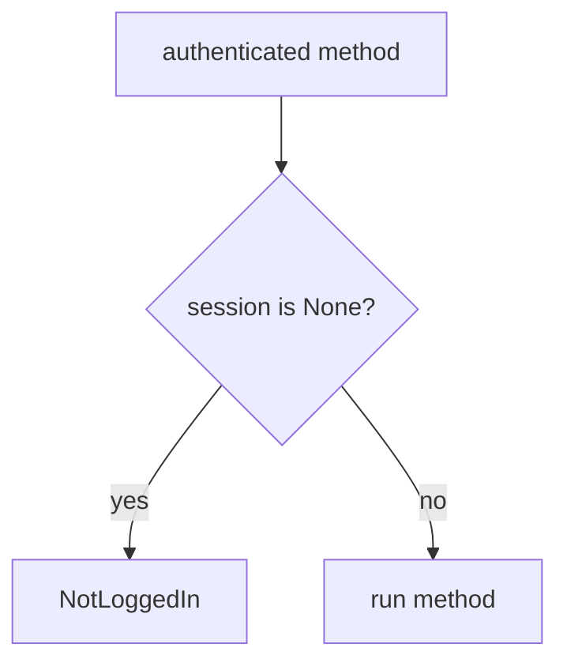
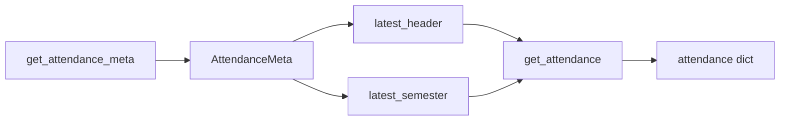
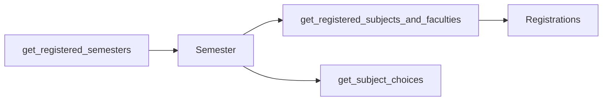
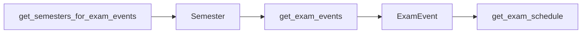
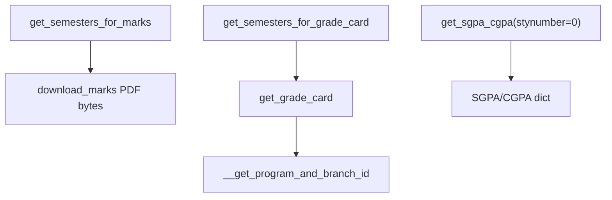
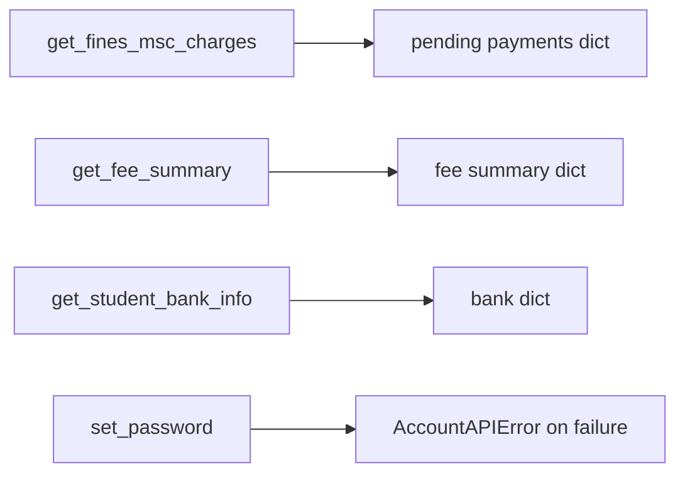
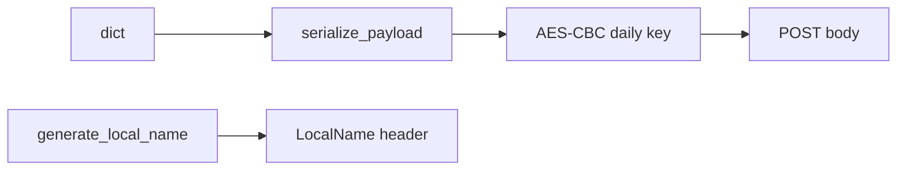
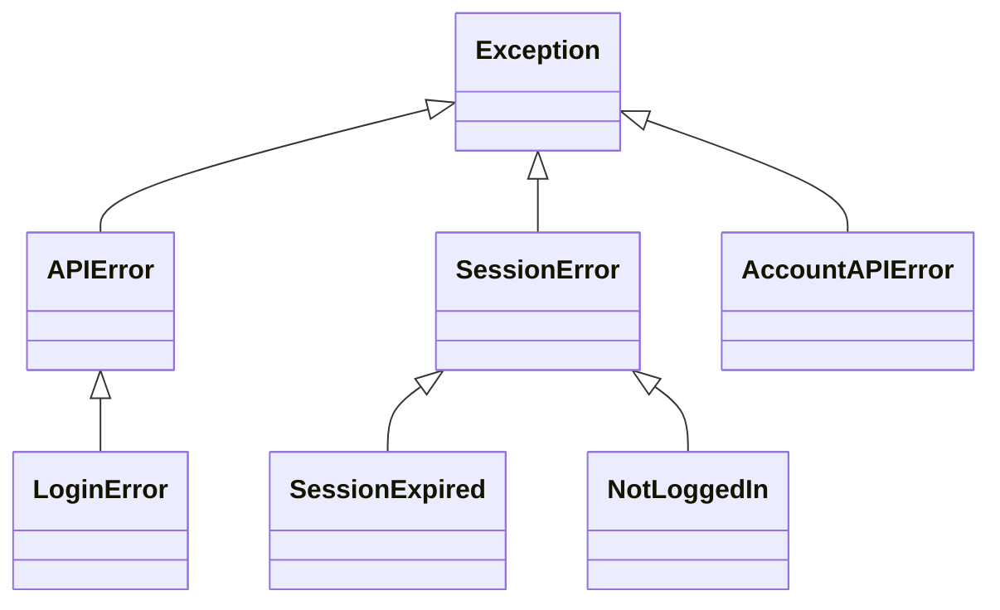
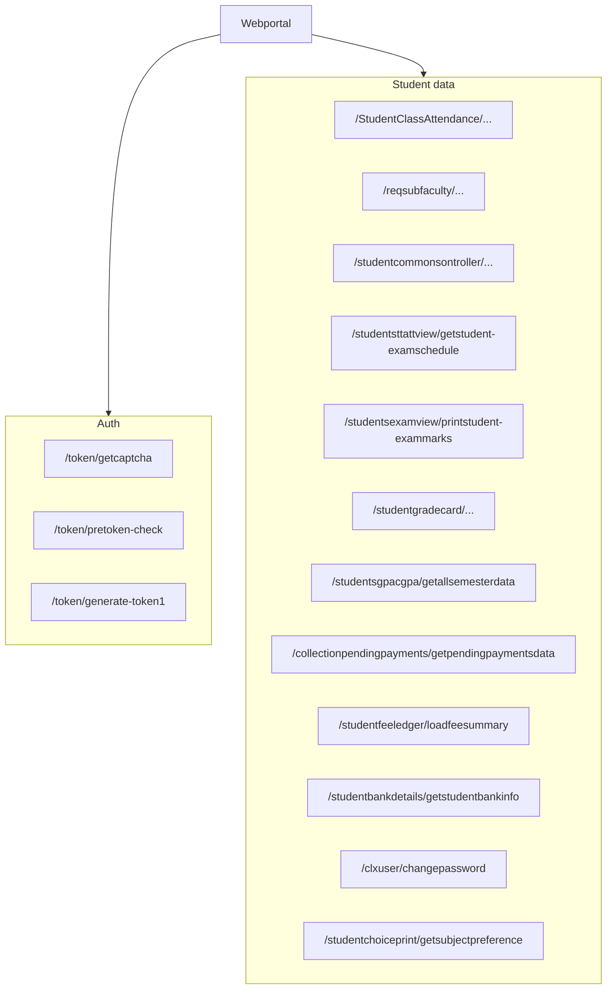

# Key features

What `Webportal` actually exposes in 0.1.0a8. README.rst lists login, attendance, registration, exam events, and explicit exceptions. The wrapper also covers marks PDFs, grade cards, SGPA/CGPA, fees, subject choices, bank info, and password change.

## Login and session

`student_login(username, password, captcha: Captcha) -> WebportalSession`. You must pass a `Captcha`. The usage docs use `from pyjiit.default import CAPTCHA` because the portal does not bind the challenge tightly to the client.

`get_captcha()` GETs `/token/getcaptcha` and returns `Captcha.from_json` with an empty answer field until you fill `captcha`.

`@authenticated` is the gate. There is no `logout` method. Drop the instance or set `session = None`.

## Attendance

`get_attendance_meta` POSTs `/StudentClassAttendance/getstudentInforegistrationforattendence` as plain JSON (`clientid`, `instituteid`, `membertype`). `get_attendance(header, semester)` encrypts `registrationcode`, `registrationid`, and `stynumber` and POSTs `/StudentClassAttendance/getstudentattendancedetail`. Sphinx usage notes that this call can sit for over 10 seconds on the server.

## Registration

`get_registered_semesters` hits `/reqsubfaculty/getregistrationList`. `get_registered_subjects_and_faculties(semester)` hits `/reqsubfaculty/getfaculties` and returns `Registrations` (`total_credits`, list of `RegisteredSubject`). `get_subject_choices(semester)` hits `/studentchoiceprint/getsubjectpreference`. Allocated rows in `subjectpreferencegrid` have `subjectrunning == "Y"`.

## Exams

The exam-events payload uses the portal typo `registationid`. `get_exam_schedule` sends `instituteid`, `registrationid`, `exameventid`.

## Marks and grades

`download_marks` GETs `/studentsexamview/printstudent-exammarks/{instituteid}/{registration_id}/{registration_code}` and returns `response.content` on HTTP 200. `get_grade_card` first calls private `__get_program_and_branch_id` (`/studentgradecard/getstudentinfo`) then `/studentgradecard/showstudentgradecard`.

## Fees and account

`get_fines_msc_charges` documents that an empty queue comes back as Failure `"NO APPROVED REQUEST FOUND"`, which `__hit` turns into `APIError`. `get_fee_summary` sends unencrypted JSON with only `instituteid`.

## Encryption on the wire

Login always encrypts. Several later methods encrypt too. `__hit` always adds `LocalName`.

## Exception map

| Feature | Raises |
| --- | --- |
| `student_login` | `LoginError` |
| Any `@authenticated` method with no session | `NotLoggedIn` |
| HTTP 401 from `__hit` | `SessionExpired` |
| `set_password` | `AccountAPIError` |
| Other failed `responseStatus` | `APIError` |
| `download_marks` non-200 | `APIError` |

## Endpoint map

Base URL is always `https://webportal.jiit.ac.in:6011/StudentPortalAPI`.
