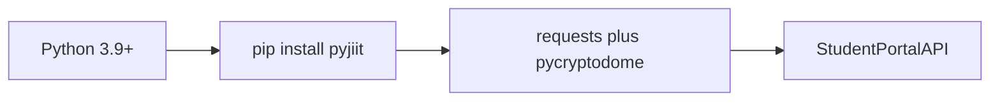
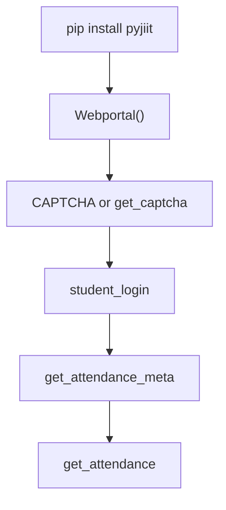
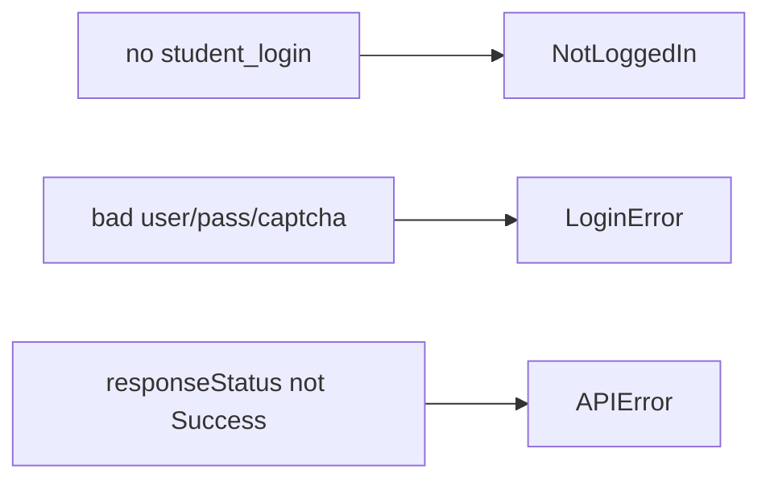

# Getting started

Install pyjiit 0.1.0a8, log in with a `Captcha`, and pull attendance. Deeper install notes: [Installation](2.1-installation). Copy-paste walkthrough: [Quick start guide](2.2-quick-start-guide). Login internals: [Authentication flow](2.3-authentication-flow).

## Requirements

| Need | Spec |
| --- | --- |
| Python | `>=3.9` |
| Runtime | `requests >=2.32.3,<3.0.0`, `pycryptodome >=3.22.0,<4.0.0` |
| Network | HTTPS to `webportal.jiit.ac.in:6011` |
| Login | Enrollment number, portal password, a `Captcha` |

End users install from PyPI. Maintainers use Poetry.



## Install

```bash
pip install pyjiit
```

That pulls the two runtime deps. There is no README.md. Package metadata is in `README.rst` and `pyproject.toml`.

## First session

```python
from pyjiit import Webportal
from pyjiit.default import CAPTCHA

w = Webportal()
print(w)
# Driver Class for JIIT Webportal

session = w.student_login("username", "password", CAPTCHA)
print(session.clientid)
# JAYPEE
```

`CAPTCHA` is a filled `Captcha` in `pyjiit.default`. The Sphinx usage page says the portal does not really bind captcha state to your IP, so the premade object is what people actually ship.

To fetch a live image instead:

```python
from pyjiit import Webportal

w = Webportal()
captcha = w.get_captcha()
# captcha.image is a base64 PNG
# set captcha.captcha to the text, then student_login(...)
```



## Attendance in four lines

```python
meta = w.get_attendance_meta()
header = meta.latest_header()
sem = meta.latest_semester()
print(w.get_attendance(header, sem))
```

`get_attendance` can take more than 10 seconds. That wait is the portal.

## Subjects

```python
semesters = w.get_registered_semesters()
reg = w.get_registered_subjects_and_faculties(semesters[0])
print(*reg.subjects, sep="\n")
print(reg.total_credits)
```

## Errors you will hit first

```python
from pyjiit.exceptions import NotLoggedIn, LoginError, APIError

w = Webportal()
try:
    w.get_student_bank_info()
except NotLoggedIn:
    pass
```

Call `student_login` before any `@authenticated` method. Bad credentials raise `LoginError`. Generic portal failures raise `APIError`.



## What not to expect

- There is no `logout`.
- The class is `Webportal`, not `WebPortal`.
- The client is `requests`, not `fetch`.
- `Webportal()` does not take a cached `WebportalSession`. README.rst still lists that as a roadmap item.
